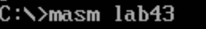
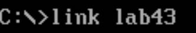
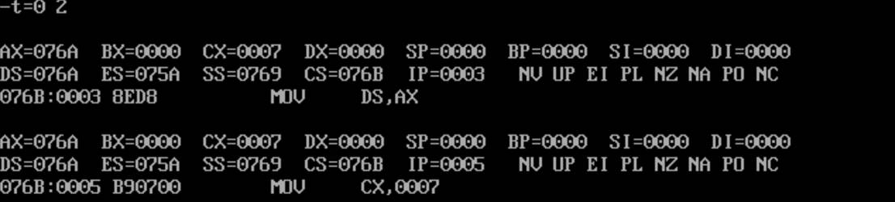
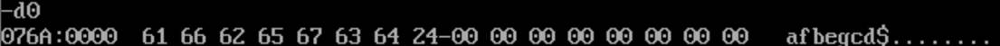
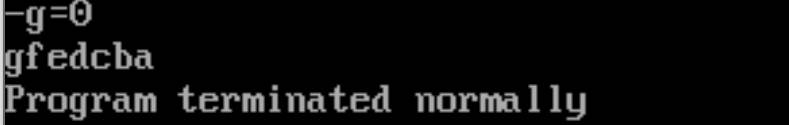

# 冒泡排序

汇编编程实现利用冒泡法对一组数据进行逆序排序

我们参考C语言的冒泡排序，可以得知，冒泡排序需要内外双循环以及一个比较

```c
#include <stdio.h>
void bubble_sort(int arr[], int len) {
    int i, j, temp;
    for (i = 0; i < len - 1; i++)
        for (j = 0; j < len - 1 - i; j++)
            if (arr[j] > arr[j + 1]) {
                temp = arr[j];
                arr[j] = arr[j + 1];
                arr[j + 1] = temp;
            }
}
```


```assembly
DATA SEGMENT
	BUF DB 'afbegcd$'

DATA ENDS

CODE SEGMENT
	ASSUME CS:CODE,DS:DATA
START:
	MOV AX,DATA
	MOV DS,AX
	MOV CX,7-BUF
OULOOP:	　;外循环
	MOV DX,CX	;外循环次数暂存DX,避免与内循环的CX冲突
	MOV SI,0
INLOOP:　;内循环
	MOV AL,BUF[SI]
	CMP AL,BUF[SI+1]	;比较程序
	JGE NEXT			;AL大直接跳转
	XCHG AL,BUF[SI+1]	;BUF[SI+1]大则交换位置
	MOV	BUF[SI],AL
NEXT:
	INC SI
	LOOP INLOOP
	
	MOV CX,DX　;循环次数送回CX
	LOOP OULOOP
	
	MOV AH,09H ;显示由DS:DX所指向的以"$"结束的字符串BUF
	LEA	DX,BUF
	INT 21H
	MOV AH,4CH
	INT 21H
CODE ENDS
	END START
```

１、编译运行





２、t=0加载数据段



3、查看数据段



4、G=0运行程序

