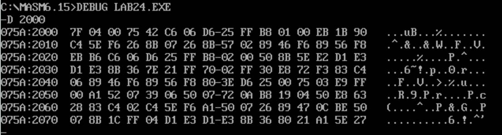
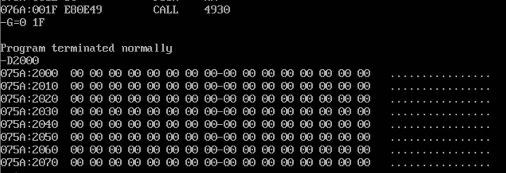

# 连续内容清零

将从 2000H 单元开始的连续 128 个单元的内容进行清零。

```assembly
CODE SEGMENT 
	ASSUME CS:CODE,DS:CODE 
START: 
	MOV BX,2000H 
	MOV CX,128 
	MOV AL,00H 
L1: 
	MOV [BX],AL 
	INC BX 
	LOOP L1 
	MOV AH,4CH 
	INT 21H
CODE ENDS 
	END START
```

汇编：

连接：

使用D命令查看2000H位置原本状态



先是U0反汇编找到程序的断点001FH，然后运行程序至断点处，随后查看2000H处的数据显示已被修改为0

