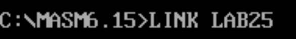
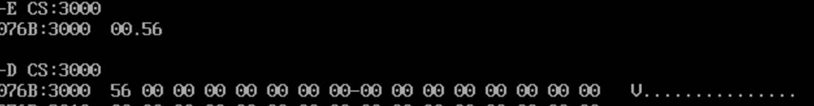
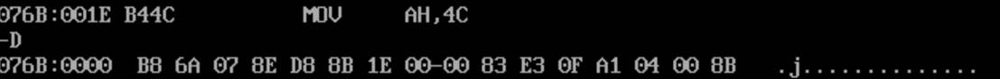
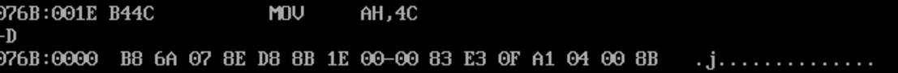

# 内容拆分

将 3000H 单元的一个字节的内容进行拆分，高半字节放进 3001H 单元的低半部分，其低半字节放进 3002H 单元的低半部分。

```assembly
DATA SEGMENT
	N0 DW 3000H
	N1 DW 3001H
	N2 DW 3002H
DATA ENDS
CODE SEGMENT 
	ASSUME CS:CODE,DS:DATA
START: 
	MOV AX,DATA
	MOV DS,AX
	MOV BX,N0 
	AND BX,0FH
	MOV AX,N2
	MOV AX,[BX]
	MOV BX,N0
	MOV CL,4
	SHR AX,CL
	MOV AX,N1
	MOV AX,[BX]
	MOV AH,4CH 
	INT 21H
CODE ENDS 
	END START
```




U反汇编找到1E


d命令查看cs:3000位置原数据







 

