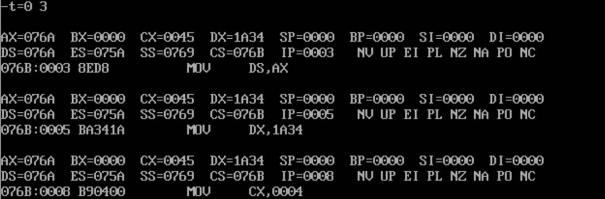
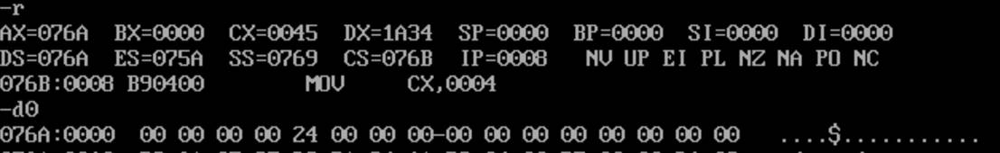
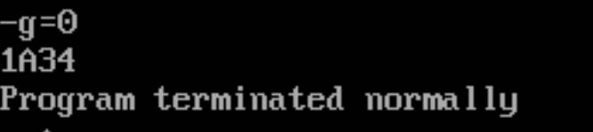
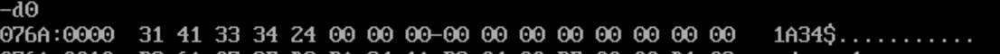

# 显示DX数值

**将 DX 中的十六进制数转换为 ASCII 码，存放到 BUF 开始的内存单元中去，并在屏幕显示出数值。** 

```assembly
data segment
	buf db 4 dup(?),'$'
data ends
 ;DX 中的十六进制数转换为 ASCII 码，存放到 BUF 开始的内存单元中去，并在屏幕显示出数值。
CODE SEGMENT
ASSUME CS:CODE, DS:DATA
START:MOV AX,DATA
	MOV DS,AX
	MOV DX,1A34H ;给DX赋初值
	MOV CX,4 ;循环四次
	MOV DI,0
L:
	ROL DX,1	
	ROL DX,1
	ROL DX,1
	ROL DX,1 	;循环左移4位,将最高位送出
	MOV AL,DL   ;
	AND AL,0FH	;通过and00001111取右4位
	ADD	AL,30H	;数字转为ASCII码
	CMP AL,39H	;数字判断
	JLE	DIG		;是0~9直接到DIG
	ADD	AL,7
	
DIG:
	MOV BUF[DI],AL
	INC DI
	
	LOOP L
	
	MOV AH,09H ;显示由DS:DX所指向的以"$"结束的字符串BUF
	LEA	DX,BUF
	INT 21H
	MOV AH,4CH
	INT 21H
CODE ENDS
	END START

```


1、编译运行


2、加载数据段及DX的值



3、查看DX的值及数据段



4、g=0运行程序



5、d0查看运行后的数据段



与我们预想的相同