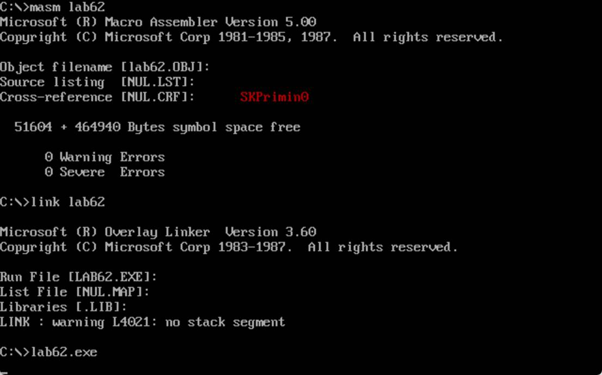

# 屏幕显示字符串

编写一个子程序，实现在屏幕的指定位置，用指定颜色，显示一个用 0 结尾的字符串。 

```assembly
DATA SEGMENT
	DB 'SKPrimin0',0
DATA ENDS
CODE SEGMENT
	ASSUME CS:CODE,DS:DATA
MAIN PROC FAR
	MOV DH,8	
	MOV DL,3	
	MOV CL,4	;红色
	MOV AX,DATA
	MOV DS,AX
	MOV SI,0
	CALL SHOW
	RET
	MOV AH,4CH
	INT 21H	
MAIN ENDP
SHOW PROC NEAR
	MOV AX,0B800H
	MOV ES,AX      
	MOV AL,0AAH
	MOV BH,6H
	MUL BH           
	MOV DI,4H			
	ADD DI,AX		
	MOV AL,CL     
	MOV CH,0	
NEXT:  
	MOV CL,DS:[SI]
	JCXZ EXIT       ;检测要输出的是否为0
	MOV ES:[DI],CL  
	INC DI
	MOV ES:[DI],AL  
	INC DI
	INC SI
	JMP  NEXT		
EXIT: 
	RET	
	MOV AH,4CH
	INT 21H
SHOW ENDP
CODE ENDS
	END MAIN
```

