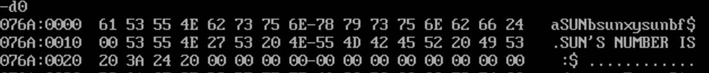
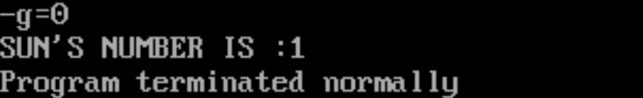
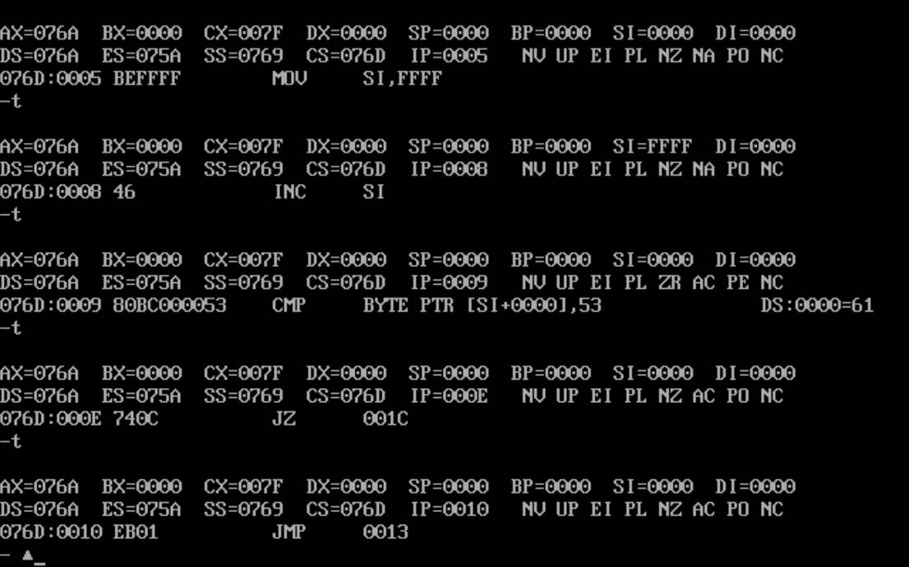

# 统计单词出现次数

设有一段英文，其字符变量名为 ENG，并以$字符结束（如下定义）。程序检查单词 SUN 在文中出现的次数，并以格式“SUN echo times:”显示出次数。

```assembly
DATA SEGMENT
ENG DB "aSUNbsunxysunbf$"
COUNT DB 0
STR DB "SUN'S NUMBER IS :$ "
DATA ENDS

CODE SEGMENT
ASSUME CS:CODE,DS:DATA
START: MOV AX,DATA
	MOV DS,AX
	MOV SI,-1
NEXT: INC SI
	CMP ENG[SI],'S'
	JZ L1
	JMP L
L:  CMP ENG[SI],'$'
	JZ EXIT
	JMP NEXT
L1: INC SI
	CMP ENG[SI],'U'
	JZ L2
	JMP L
L2: INC SI
	CMP ENG[SI] ,'N'
	JZ L3
	JMP L
L3: INC COUNT
	JMP NEXT 
EXIT:
	LEA DX,STR
	MOV AH,9
	INT 21H
	MOV DL,COUNT
	MOV DH,0
	ADD DL,30H
	MOV AH,2
	INT 21H
	MOV AH,4CH
	INT 21H
CODE ENDS
	END START
```

1、编译运行


2、T=0 2 加载数据段


3、D0查看数据段



与我们预设的字符段相同

4、G=0 运行并查看运行结果,与我们设想的相同



5、t单步执行查看过程



发现其在NEXT，L，L1，L2程序段中来回跳转，不符合时跳转顺序为INC->CMP->JZ->JMP。只有当符合条件时才会跳转到L3使COUNT加一

