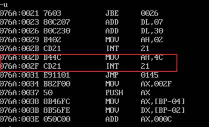
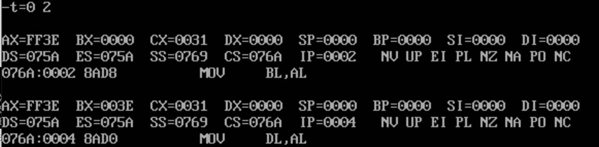
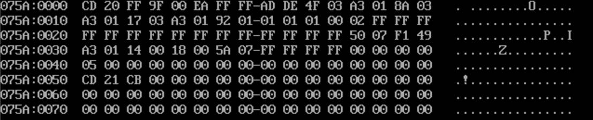
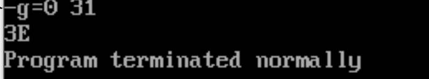
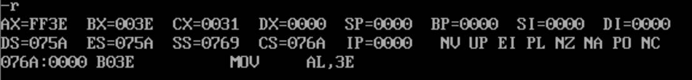
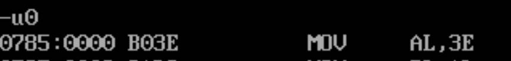
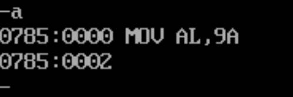
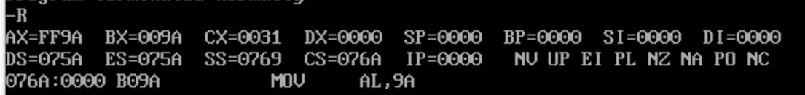

# 显示 AL 寄存器中的两位十六进制数

```assembly
CODE SEGMENT
	ASSUME CS:CODE
	START: 
	MOV AL,3EH ;此处假设为 3EH
	MOV BL,AL
	MOV DL,AL
	MOV CL,4
	SHR DL,CL
	CMP DL,9
	JBE NEXT1
	ADD DL,7
	NEXT1: ADD DL,30H
	MOV AH,2
	INT 21H ;显示高位 ASCII 码
	MOV DL,BL
	AND DL,0FH
	CMP DL,9
	JBE NEXT2
	ADD DL,7
	NEXT2: ADD DL,30H
	MOV AH,2
	INT 21H ;显示低位 ASCII 码
	MOV AH,4CH
	INT 21H
CODE ENDS ;返回 DOS
	END START
```

2、编译连接


3、运行

a.  －U0 ；通过反汇编查找程序的断点，位于076A：0031



b.  －`T=0 2` 加载数据段 



c.  －D0 查看原始数据是否正确 



d.  －`G=0 31` 运行程序至断点 31 处 ，显示输出了AL的十六进制字符



e.  －R 查看程序运行结果，结果正确



4、调试

修改 AL 的内容，判断此程序是否能正确显示其中的内容,修改为9A。

a.  －L ；重新加载可执行文件 

b.  - U 0；查看MOV AL，3EH位置



c.  －A0 ；重新修改 MOV AL，3EH 



d.  －G＝0 31；带断点运行 


 

 

e.  －R ；查看程序运行结果

