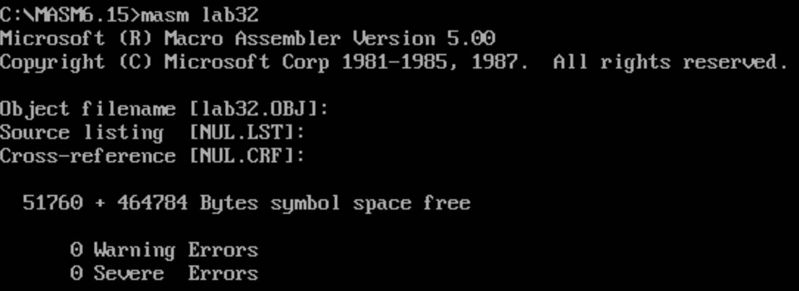
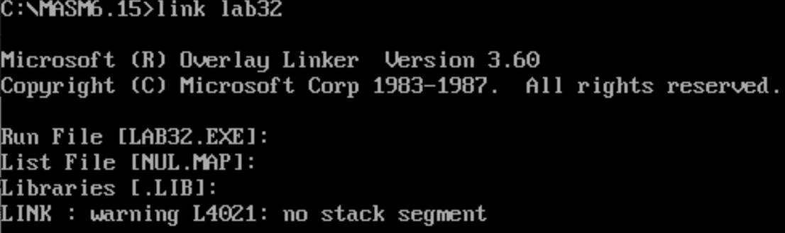
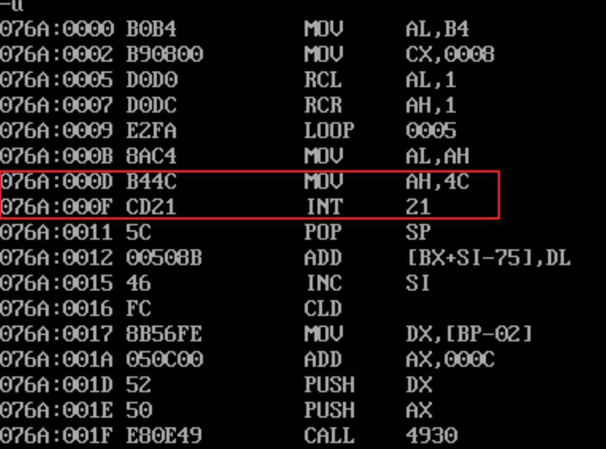
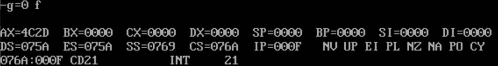

# AL字节反向排序

ReverseSorting，AL字节反向排序

```assembly
CODES SEGMENT
    ASSUME CS:CODES
START:
    MOV AX,0000
    MOV AL,0D0H
    MOV DL,00H
    MOV BL,00H
    MOV BL,1
    MOV CX,8
DOIT:
    SHL AL,1
    JNC PASS
    ADD DL,BL
    PASS:
        SHL BL,1
    LOOPNE DOIT
    MOV AH,4CH
    INT 21H
CODES ENDS
END START

```

2、编译，连接





3、反汇编查看结束位置



4、运行程序



10110100B = D2H

反转后AL = 2D，即AX的低位为２D