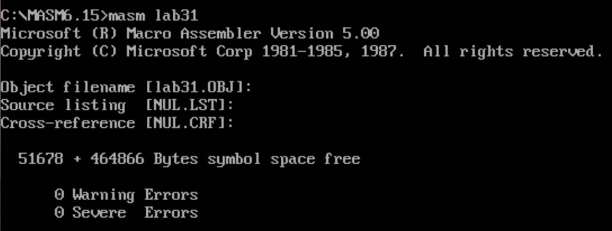
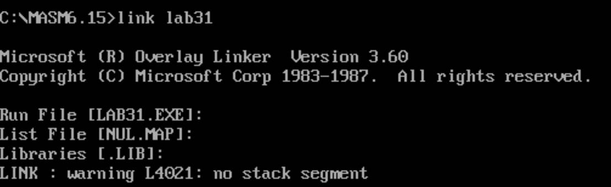
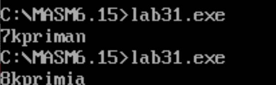
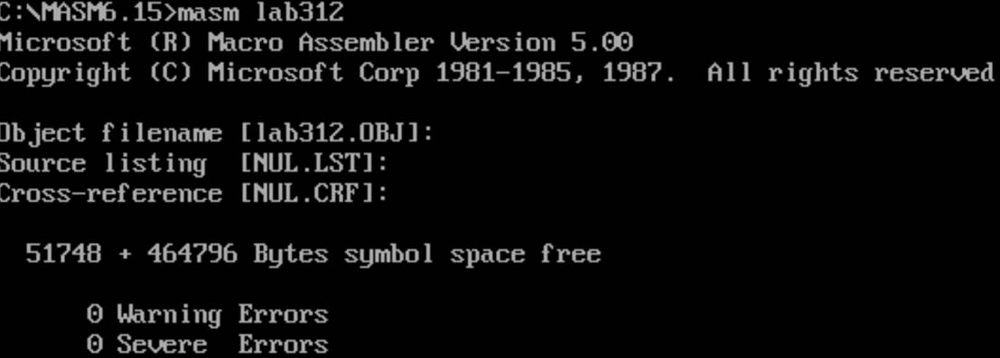
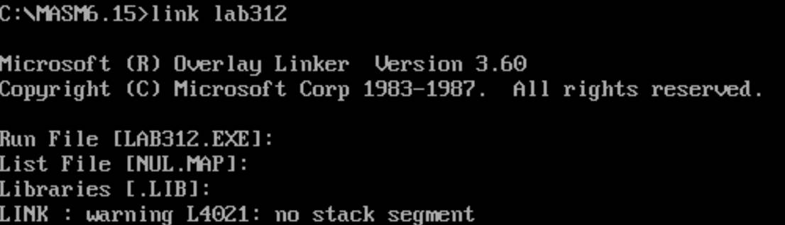
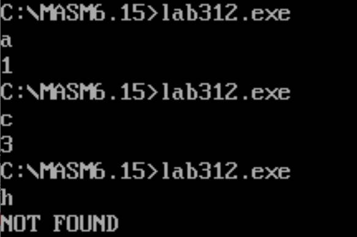

# 字符串比较与查找

用字符串处理指令编程程序，处理字符串的比较和查找，显示结果。

要求：（1）字符串的比较程序中，一个字符串在数据段定义，另一个字符串在程序执行时从键盘输入，必须定义键盘缓冲区，并指出不相等的位置。

（2）在字符串中查找某个字符，字符串在数据段定义，要查找的字符在程序执行时从键盘输入，并指出找到的位置。

## 一比较程序

```assembly
DATA SEGMENT
	BUFF DB 255 DUP('?')
DATA ENDS
;定义缓冲区

EXT SEGMENT 
	MESS DB 'skprimin$'
EXT ENDS

CODE SEGMENT
ASSUME CS:CODE,DS:DATA,ES:EXT
START:
MOV AX,DATA
MOV DS,AX
MOV AX,EXT
MOV ES,AX

;向缓冲区输入字符串
LEA DX,BUFF
MOV AH,0AH
INT 21H

MOV CL,BUFF+1
LEA SI,BUFF+2
LEA DI,MESS

CLD
MOV BL,'0'

XY:INC BL
CMPSB
LOOPZ XY
;循环BL+1

JZ YES
MOV DL,BL
JMP XXXXXXXXXX
YES:MOV DL,'v'
XXXXXXXXXX:MOV AH,2
INT 21H
;显示字符

MOV AH,4CH
INT 21H
CODE ENDS
END START

```

2.编译，连接，生成exe文件





3. 通过运行exe文件



与在数据段定义的skprimin相比

①　第一次键入skpriman

| 1    | 2    | 3    | 4    | 5    | 6    | 7    | 8    |
| ---- | ---- | ---- | ---- | ---- | ---- | ---- | ---- |
| s    | k    | p    | r    | i    | m    | i    | n    |
| s    | k    | p    | r    | i    | m    | a    | n    |

刚好返回7，指出位置7处不相等

②　第二次键入skprimia

| 1    | 2    | 3    | 4    | 5    | 6    | 7    | 8    |
| ---- | ---- | ---- | ---- | ---- | ---- | ---- | ---- |
| s    | k    | p    | r    | i    | m    | i    | n    |
| s    | k    | p    | r    | i    | m    | i    | a    |

## 二查找程序

```assembly
DATAS SEGMENT
    STRING DB 'abcdefg$'
    TIP DB 'NOT FOUND$'
DATAS ENDS

CODES SEGMENT
   ASSUME CS:CODES,DS:DATAS
START:
MOV AX,DATAS
MOV ES,AX
MOV DS,AX
MOV AH,01H
INT 21H 
;键盘输入一个字符并回显
LEA DI,STRING
MOV CX,8
CLD
MOV BL,'0'
FIND: INC BL
SCASB
LOOPNZ FIND
JZ OUTPUT
NOFIND:
MOV DL,0AH
MOV AH,02H
INT 21H
;显示字符
LEA DX,TIP
MOV AH,09H
INT 21H
;显示字符串
JMP DDL
OUTPUT: 
MOV DL,0AH
MOV AH,2H
INT 21H
;显示输出一个字符
MOV DL,BL
MOV AH,2H
INT 21H
;显示输出一个字符
JMP DDL
DDL:    
MOV AH,4CH
INT 21H
;程序结束
CODES ENDS
END START
```

2、编译，连接





3、运行



| a    | b    | c    | d    | e    | f    | g    |             |
| ---- | ---- | ---- | ---- | ---- | ---- | ---- | ----------- |
| a  1 |      |      |      |      |      |      |             |
|      |      | c  3 |      |      |      |      |             |
|      |      |      |      |      |      |      | h NOT FOUND |