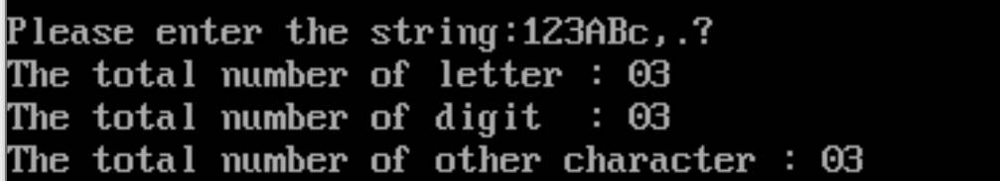

# 字符串统计

```assembly
DATAS SEGMENT
　　buf db '12ADdf#gh592HKL*','$'
　　tp1 db 0;大写字母个数
　　tp2 db 0;小写字母个数
　　tp3 db 0;数字的个数
　　tp4 db 0;其他字符的个数

　　str1 db 'the number of big is:','$'
　　str2 db 'the number of small is:','$'
　　str3 db 'the number of number is:','$'
　　str4 db 'the number of other is:','$'
　　str5 db 0dH,0aH,'$';换行

DATAS ENDS

STACKS SEGMENT
　　;此处输入堆栈段代码
STACKS ENDS

CODES SEGMENT
　　ASSUME CS:CODES,DS:DATAS,SS:STACKS
　　START:
　　　　MOV AX,DATAS
　　　　MOV DS,AX

　　　　lea si, buf
　　　　mov cx, 16;设置循环次数

　　　　　again:
　　　　　　;字符串结尾，结束程序
　　　　　　cmp byte ptr[si],'&'
　　　　　　je exit

　　　　　　;0-9
　　　　　　cmp byte ptr[si],30h;小于30，其他字符加1
　　　　　　jb L1
　　　　　　cmp byte ptr[si],39h;大于39进一步比较
　　　　　　jbe L2

　　　　　　cmp byte ptr[si],41h
　　　　　　jb L1
　　　　　　cmp byte ptr[si],5AH
　　　　　　jbe L3

　　　　　　cmp byte ptr[si],61h
　　　　　　jb L1
　　　　　　cmp byte ptr[si],7AH
　　　　　　jbe L4


　　　　L1:
　　　　　　inc tp4
　　　　　　jmp L5
　　　　L2:
　　　　　　inc tp3
　　　　　　jmp L5
　　　　L3:
　　　　　　inc tp1
　　　　　　jmp L5
　　　　L4:
　　　　　　inc tp2
　　　　　　jmp L5
　　　　L5:
　　　　　　add si,1
　　　　　　loop again


　　　　;显示大写字母
　　　　lea dx,str1
　　　　mov ah,09h
　　　　int 21h

　　　　mov bl,tp1
　　　　call disp ;调用子程序

　　　　mov ah,09h
　　　　lea dx,str5
　　　　int 21h

　　　　;显示小写字母
　　　　lea dx,str2
　　　　mov ah,09h
　　　　int 21h

　　　　mov bl,tp2
　　　　call disp ;调用子程序

　　　　mov ah,09h
　　　　lea dx,str5
　　　　int 21h

　　　　;显示数字
　　　　lea dx,str3
　　　　mov ah,09h
　　　　int 21h

　　　　mov bl,tp3
　　　　call disp ;调用子程序

　　　　mov ah,09h
　　　　lea dx,str5
　　　　int 21h

　　　　;显示其他
　　　　lea dx,str4
　　　　mov ah,09h
　　　　int 21h

　　　　mov bl,tp4
　　　　call disp ;调用子程序

　　　　mov ah,09h
　　　　lea dx,str5
　　　　int 21h


　　　　exit:
　　　　　　MOV AH,4CH
　　　　　　INT 21H

　　disp PROC ;显示BX中的数
　　　　mov ch,4
　　　　roll:

　　　　　　mov cl,4
　　　　　　rol bx,cl
　　　　　　mov dl,bl
　　　　　　and dl,0fh
　　　　　　cmp dl,9
　　　　　　jbe next1
　　　　　　add dl,07h
　　　　next1:

　　　　　　 add dl,30h
　　　　　　mov ah,02h
　　　　　　int 21h
　　　　　　dec ch
　　　　　　jnz roll
　　　　RET
　　disp ENDP

CODES ENDS
　　END START
```

2

```assembly
datas   segment
  letter   db   ?
  digit    db   ?
  other    db   ?
  string   label  byte
           max db 80 
           act db ?  
           str db 80 dup(?)
print   db  13,10,'Please enter the string:','$'
mess1   db  13,10, 'The total number of letter : ','$'
mess2   db  13,10,'The total number of digit  : ','$'
mess3   db  13,10,'The total number of other character : ','$'
datas   ends

code  segment
      assume  cs:code,ds:datas
start: push  ds
       sub  ax,ax
       push  ax
       mov   ax,datas
       mov   ds,ax
       mov   es,ax
       mov   letter,0
       mov   digit,0
       mov   other,0
       lea   dx,print
       mov   ah,09h  
       int   21h
       lea   dx,string
       mov   ah,0ah
       int   21h
       sub   ch,ch
       mov   cl,[string+1]
       lea   si,string+2
	   
digitseg: 
       mov   al,[si] ;数字判断，小于0为其他,0到9为数字
       cmp   al,'0'
       jb    otherseg
       cmp   al,'9'
       ja    letterseg    
       inc   digit
       jmp   loop1
	   
letterseg: 
       cmp   al,'A' ;大写字母判断，9之后，大于9，小于A为其他，A到Z为字母
       jb    otherseg   						
       cmp   al,'Z'
       ja    letter2seg 
       inc   letter
       jmp   loop1  
	   
letter2seg:  
       cmp   al,'a' ;小写字母判断，大于Z，小于a为其他，a到z为字母
       jb    otherseg
       cmp   al,'z'
       ja    otherseg
       inc   letter
       jmp   loop1
otherseg: 
       inc   other ;上文中未被识别出的字符均为其他
	   
loop1:  
       inc   si
       dec   cl
       cmp   cl,0
       jz    print1 
       jne   digitseg 
	   
print1:   
       lea   dx,mess1 ;输出mess1，字母
       mov   ah,09h
       int   21h
	   
       mov   al,letter 
       call  disp
	   
       lea   dx, mess2 ;输出mess2，数字
       mov   ah,09h
       int   21h
       mov   al,digit
       call  disp
	   
       lea   dx, mess3 ;输出mess3，其他
       mov   ah,09h
       int   21h
       mov   al,other
       call  disp
exit:
       mov  ah, 4ch
       int  21h
disp:                 						;十进制数形式显示AL中的内容.
       mov  ah, 0
       mov  bl, 10
       div  bl        						;div 无符号:div src 16位操作:商ax=(dx,ax)/src,余数dx
       add  al, 30h   						 ;比如说al=15h,即21，表示letter数量，然后，这个过程就是，ax=0015h(21),除以bl，bl值为10
       mov  dl, al     						 ;则除完了的结果为2余1，则ah=01,al=02,即ax=0102h;,那么al+30h即为表示该数字的ASCII码值，因为0的ASCII值为30h
       mov  bh, ah      					 ;则ax=0132h,dl=32,bh=01;
       mov  ah, 02h     					 ;显示输出dx,则显示32码对应的数字，2
       int  21h           
       mov  al, bh      						  ;把01给al,然后算出ASCII码，然后给dx，然后显示
       add  al, 30h
       mov  dl, al        
       mov  ah, 02h
       int  21h     
       ret
code   ends
       end   start
```

### 程序运行



|        | 1    | 2    | 3    | A    | B    | c    | ,    | .    | ?    |
| ------ | ---- | ---- | ---- | ---- | ---- | ---- | ---- | ---- | ---- |
| letter |      |      |      | 1    | 2    | 3    |      |      |      |
| digit  | 1    | 2    | 3    |      |      |      |      |      |      |
| other  |      |      |      |      |      |      | 1    | 2    | 3    |

与事实相符。