# 两数相加

将两个 32 位十进制数相加，被加数和加数存放在 DATA 段内的 N1 与 N2 两个变量中，要求将相加结果送入 N3 变量中。 

```assembly
DATA SEGMENT
	N1 DD 12345678H
	N2 DD 87654321H
	N3 DD ?
DATA ENDS
CODE SEGMENT
	ASSUME CS:CODE,DS:DATA
START:
	MOV AX,DATA
	MOV DS,AX
	MOV AX,WORD PTR N1
	MOV DX,WORD PTR N1+2
	MOV CX,WORD PTR N2
	MOV BX,WORD PTR N2+2
	ADD AX,CX
	ADC DX,BX
	MOV WORD PTR N3,AX
	MOV WORD PTR N3+2,DX
	MOV AH,4CH
	INT 21H
CODE ENDS
	END START
```

##### 1.汇编： 

##### 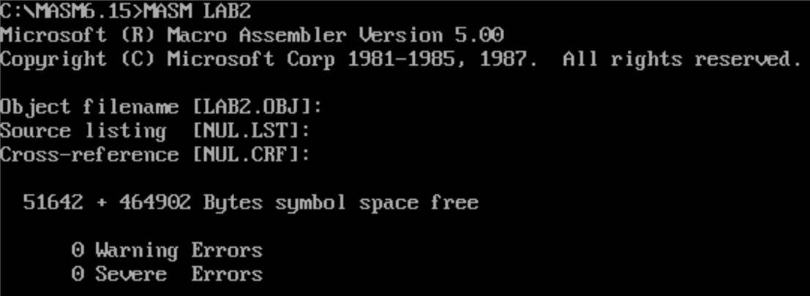

##### 2.连接： 

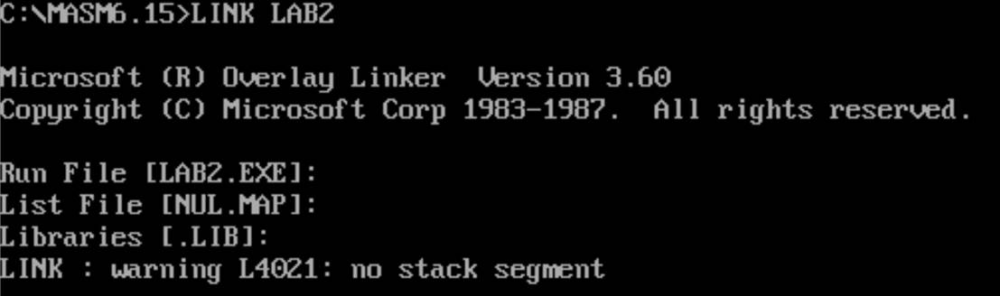

##### 三.运行及调试： 

1. 运行： 

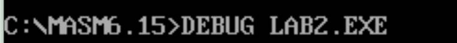 

```sh
U0
```

通过反汇编查找程序的断点 

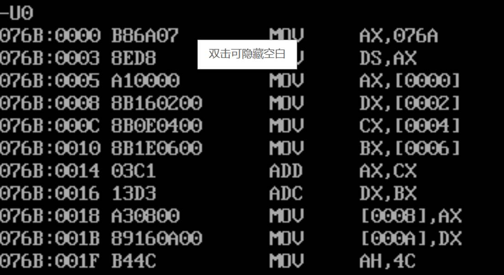；找到程序的断点为 001FH 

```sh
T=0 2 
```

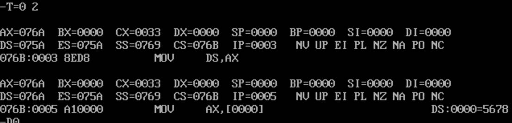

；加载数据段 

－`D0` 查看原始数据是否正确，椭圆圈起来的数据就是 N1 与 N2 的值 


－`G=0 1F `；运行程序至断点 1F 处 

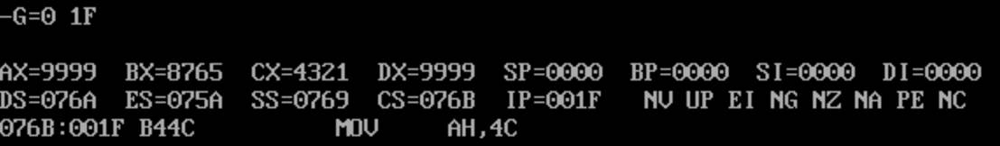

－`D0 `查看程序运行结果，矩形选中的数据就是相加的和 

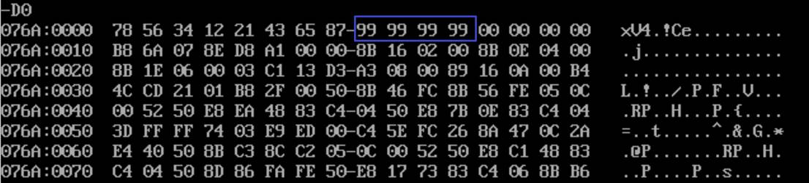

2. 调试：

若要判断此程序对于其它 32 位数相加是否正确，则需要使用 DEBUG 进行程序调试。 

例：判断 234B8074H＋658A1D61H 是否正确的方法如下： 

```assembly
DATA SEGMENT
	N1 DD 234B8074H
	N2 DD 658A1D61H
	N3 DD ?
```

－`L` 重新加载可执行文件 

－`T＝0 2` 加载程序的数据段，以便修改 N1 与 N2 的值 

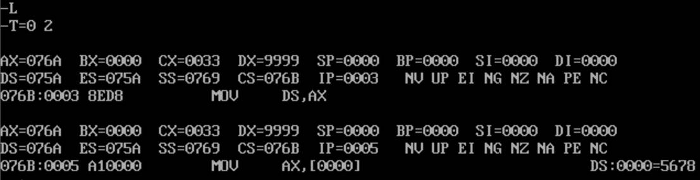

－`D0` 查看数据段的内容 

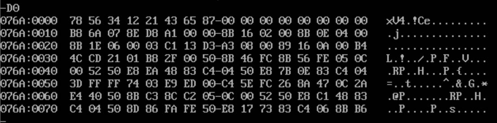－`E0` 修改 N1 为 234B8074H，N2 为 658A1D61H 

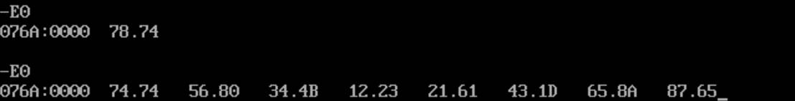

－`G 1F `带断点运行，此处不能使用 `G＝0 1F9 `

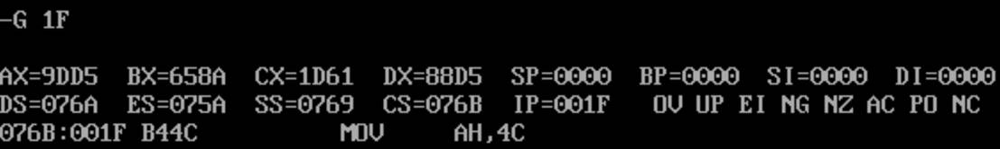

－`D0 `查看运行结果，下划线上的数据就是相加的和 

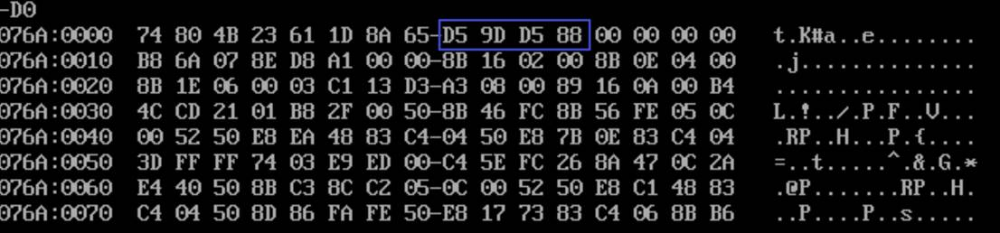