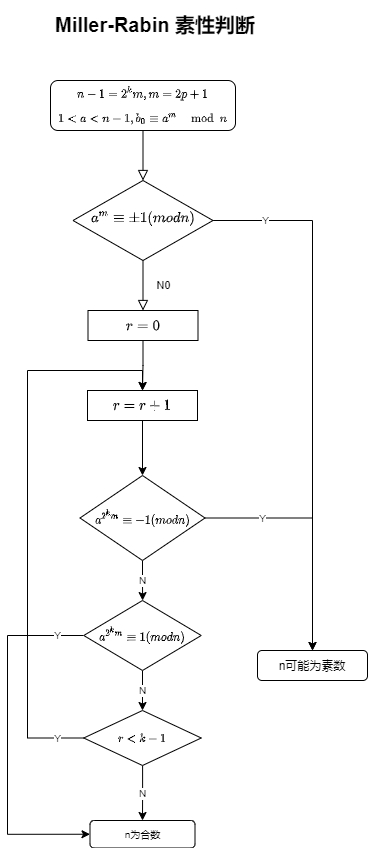
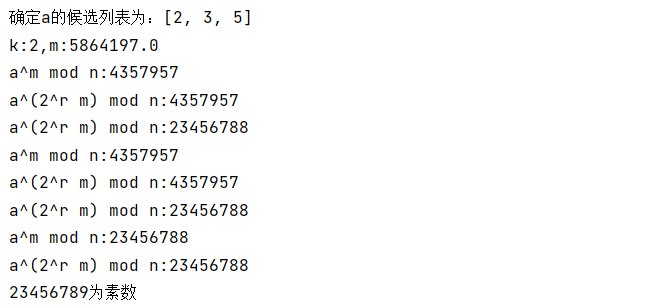

# 素数判定 Miller-Rabin 算法的实现

## 实验目的

通过实验掌握 Miller-Rabin 素数判定的算法。

## 实验原理

[Miller-Rabin primality test | encyclopedia article by TheFreeDictionary](https://encyclopedia.thefreedictionary.com/Miller-Rabin+primality+test)

Miller-Rabin 素性测试或 Rabin-Miller 素性测试是一种概率素性测试: 一种判断给定数字是否可能为素数的算法，类似于费马素性检验和 Solovay-Strassen 素性测试。

**强概要素数**：对于一个给定的奇数整数 n > 2，我们把 n 写成$2^s · d + 1$，其中 s 和 d 是正整数，d 是奇数。让我们考虑一个整数 a，称为基数，如果这些同余关系中有一个成立，那么 n 就是一个很可能的素数:

- $a^d \equiv 1 (\mod n)$
- $a^{2^r*d}\equiv-1 (\mod n) $for some $ 0\leq t <s $

这个测试背后的想法是，当 n 是一个奇素数时，它通过测试是因为两个事实:

- 根据费马小定理$a^{p-1} \equiv 1(\mod p)$，(这个性质本身就定义了基于 a 的可能素数的较弱的概念，而费马检验就是基于这个概念) ;

- 1模 n 的唯一平方根是1和-1。

**基本原理**：令 n 表示一个整数，假设存在整数 x 和 y 满足 $x^2\equiv y^2(mod n)$，但$x\neq\pm y\mod n$ ,那么 n 是合数。而且$ gcd(x-y,n) $给出了 n 的一个非平凡因子。

**Miller-Rabin 素数判定**: $(n-1=2^km，m 为奇数)$

- 如果对所有的 $r\in[0,k-1] $，若$ a^m\mod n\neq 1$ 且$ a^{2^r* m}\mod n≠-1$，则 n 是合数。否则可能为素数

**费马小定理**：$a^{p-1} \equiv 1(\mod p)$

 - 如果p是素数，这必须成立
 - 如果这成立，p大部分情况下是素数（任意a都有大部分p）
 - 对于某些合数p, a大部分情况下也成立（指定p的大部分a）

**二次探测**

- 定义模p意义下1的平方根是满足$x^2 mod p=1$的任意x
  - $(x-1)(x+1) \mod p = 0$
- 对所有p，1都有平方根$1,p-1$
  - $1^2 \equiv 1 \mod p$，${-1}^2 \equiv {(p-1)}^2\equiv1 \mod p$

- 但是如果p是素数，1的平方根只能是1，p-1
  - $x-1 = 0 \mod p$ 或 $x+1= 0 \mod p$
- 因此如果模p意义下1有不是1，p-1的平方根，那p就不是素数。

**数学原理**

- 如果一个奇数n有k个互不相同的质因子，那么模n意义下1的平方根有$2^k$个

**证明**

- 当 *n*是奇数素数时，1 模 *n* 的唯一平方根是1和 −1。

已知1和−1，当平方模 *n*时，总是得到1。它仍然表明没有1模*n*的其他平方根。这是一个特例，这里应用于[有限域](https://encyclopedia.thefreedictionary.com/Finite+field) **Z**/*n*Z上的[多项式](https://encyclopedia.thefreedictionary.com/Polynomial)$X^2 − 1$，这是某个域上的多项式更一般的事实根不超过其度数（此定理源于多项式的欧几里得除法的存在）。 下面是一个更基本的证明。 假设 *x*是 1模 *n*的平方根。然后：

$(x-1)(x+1) =x^2-1\equiv 0\mod p$

换句话说*，n*除以乘积 （*x* − 1）（*x* + 1）。根据[欧几里得引理](https://encyclopedia.thefreedictionary.com/Euclid's+lemma)，由于 *n*是素数，它除以一个因子 *x* − 1或*x* + 1，这意味着 *x*与1或 −1模 *n*一致。

- 如果n是奇素数，那么它很可能是一个以a为底的素数。

根据费马的小定理：$a^{2^r*d}\equiv 1 (\mod n) $

数列$a^{2^r d},a^{2^r-1 d},…… ,a^{2 d} ,a^{d} $的每一项，都是前一项的平方根。因为第一项同1，因此第二项是 1 的平方根模 n。根据前面的引理，它同1或−1都一致。如果它同−1一致，就完成了。否则，它等于1，我们可以迭代推理。在结尾处，有一项与−1一致，或者所有的项都与−1一致，特别是最后一项$a^d$是一致的。

### 例子

假设我们希望确定n = 221是否为素数。我们把n−1写成 $2^2·55$，这样我们就有了s = 2 和 d = 55。我们随机选择一个数字a，使得，1 < a < n - 1,比如a = 174。 我们继续计算：

- $a^{2^0·d }mod n = 174^{55 }mod 221 = 47 ≠ 1， n − 1$
- $a^{2^1·d } mod n = 174^{110} mod 221 = 220 = n − 1.$

由于220 ≡ −1 mod n，要么 221是素数，要么174是221 的强伪素数。

我们尝试另一个随机的a，这次选择a = 137：

- $a^{2^0·d } mod n = 137^{55 } mod 221 = 188 ≠ 1， n − 1$
- $a^{2^1·d } mod n = 137^{110} mod 221 = 205 ≠ n − 1.$

因此，137是221复合性的见证，而174实际上是一个强伪素数。


### 针对小组底座进行测试

当要测试的数字n很小时，不需要尝试所有$a < 2(\ln n)^2 $，因为足够了(as much smaller sets of potential witnesses are known to suffice.) 

- 如果*n* < 2，047，则检验*a* = 2;
- 如果*n* < 1，373，653，则检验 *a* = 2和3;
- 如果*n* < 9，080，191，则检验 *a* = 31和 73;
- 如果*n* < 25，326，001，则检验 *a* = 2、3和5;
- 如果*n* < 3，215，031，751，则检验 *a* = 2、3、5和7;
- 如果*n* < 4，759，123，141，则检验 *a* = 2、7和 61;
- 如果*n* < 1，122，004，669，633，则检验 *a* = 2、13、23和 1662803;
- 如果*n* < 2，152，302，898，747，则检验 *a* = 2、3、5、7和 11;
- 如果*n* < 3，474，749，660，383，则检验 *a* = 2、3、5、7、11和 13;
- 如果*n* < 341，550，071，728，321，则检验 *a* = 2、3、5、7、11、13和 17。

- 如果*n* < 3，825，123，056，546，413，051，则检验 *a* = 2、3、5、7、11、13、17、19和 23。
- 如果*n* < 18，446，744，073，709，551，616 = $2^{64}$，则检验*a* = 2、 3、 5、 7、 11、 13、 17、 19、 23、 29、 31 和 37。

- 如果*n* < 318，665，857，834，031，151，167，461，则检验 *a* = 2、3、5、7、11、13、17、19、23、29、31和 37。
- 如果*n* < 3，317，044，064，679，887，385，961，981，则检验 *a* = 2， 3， 5， 7， 11， 13， 17， 19， 23， 29， 31， 37 和 41。

## 过程

将$a^{n-1} \equiv1 \mod n$中的指数$n- 1$分解为$n- 1 = u\times 2^t$，在每轮测试中对随机出来的$a$先求出$a^u \mod n$，之后对这个值执行最多t次平方操作，若发现非平凡平方根时即可判断出其不是素数，否则通过此轮测试。

流程图



## 实验内容

 编程实现 Miller-Rabin 素数判定算法，并判断 23456789 是否是素数

#### Python实现

```python
def chooseA(n):
    """依照小组底座进行测试结论选出a的列表"""
    if n < 2_047:
        alist = [2]
    elif n < 1_373_653:
        alist = [2, 3]
    elif n < 9_080_191:
        alist = [31, 73]
    elif n < 25_326_001:
        alist = [2, 3, 5]
    elif n < 3_215_031_751:
        alist = [2, 3, 5, 7]
    elif n < 3_825_123_056_546_413_051:
        alist = [2, 3, 5, 7, 11, 13, 17, 19, 23]
    elif n < 318_665_857_834_031_151_167_461:
        alist = [2, 3, 5, 7, 11, 13, 17, 19, 23, 29, 31, 37]
    elif n < 3_317_044_064_679_887_385_961_981:
        alist = [2, 3, 5, 7, 11, 13, 17, 19, 23, 29, 31, 37]
    else:
        print("数字过大，你太瞧得起这个程序了")
        alist = [x for x in range(n) if x % 2 == 1]
    return alist


def getKM(n):
    m = n - 1
    k = 0
    # 当m为奇数时循环终止 求出 2^k m = n - 1
    while m % 2 == 0:
        m = m / 2
        k = k + 1
    print(f"k:{k},m:{m}")
    return k, int(m)


def getaMmodN(a, m):
    # pow函数自动计算 a^m mod n
    x = pow(a, m, n)
    print(f"a^m mod n:{x}")
    # 计算结果x = 1或 -1
    if x == 1 or x == -1:
        return True
    else:
        return False


def geta2rMmodN(a, k, m):
    """计算 a^{2^r m} mod n的值"""
    # r = [0, k-1]
    for r in range(0, k):
        rm2 = 2 ** r * m
        x = pow(a, rm2, n)
        print(f"a^(2^r m) mod n:{x}")
        # 如果 a^{2^r m} mod n = -1 ,则可能为素数，在已知a的情况下能确实
        # 计算机会取正数，因此此处应为 n-1
        if x == n - 1:
            return True
        # 如果 a^{2^r m} mod n = 1 则为合数 直接返回False
        elif x == 1:
            return False
    # 如果循环已经结束仍未返回值，判定合数，返回FALSE
    return False


if __name__ == '__main__':
    # n为全局变量，各函数均可使用
    n = 23456789
    # 找到n对应的 a列表
    alist = chooseA(n)
    print(alist)
    # 计算出k,m
    k, m = getKM(n)
    #
    isPrime = True
    # 将每一个a都带入运算
    for a in alist:
        if not getaMmodN(a=a, m=m):
            if not geta2rMmodN(a=a, k=k, m=m):
                print(f"{n}为合数")
                isPrime = False
                break
    if isPrime:
        print(f"{n}为素数")
```

##### 运行截图




