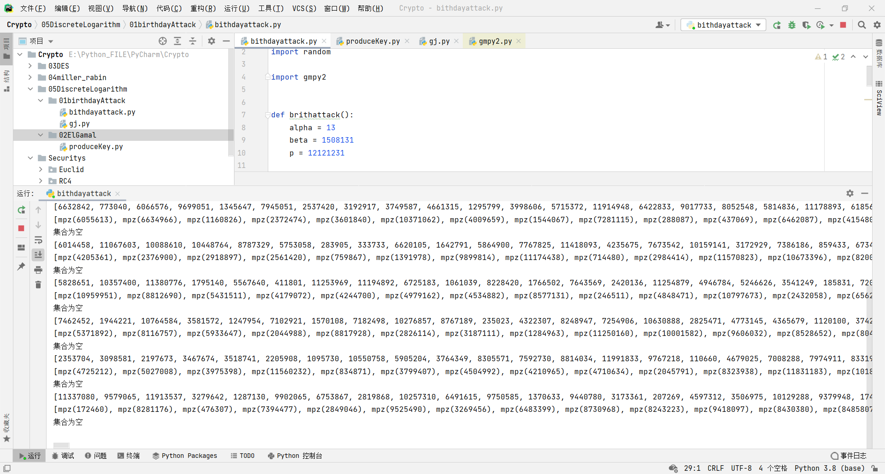
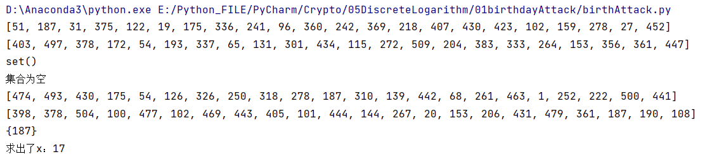
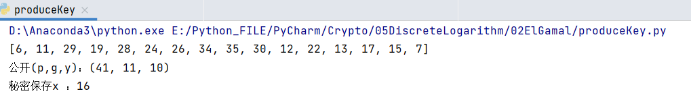
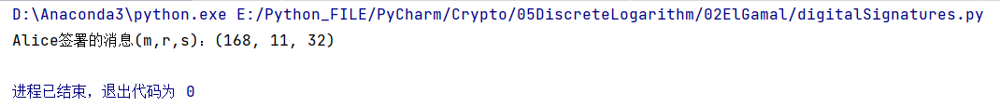
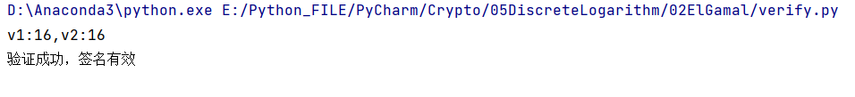

# 基于离散对数问题的密码算法

## 1实验目的

1. 利用生日攻击求解离散对数问题。
1. 通过实验了解数字签名的过程（签名过程和认证过程），掌握 ElGamal签名方案。

## 2实验原理

#### **离散对数问题（ DLP ）**

给定素数 p, $\alpha$, $\beta$ 是模 p 非零的整数，令$\beta = \alpha^x\mod p$ ，则求 x 的问题称为离散对数问题。

#### 生日攻击

生日攻击是一种密码攻击，它利用概率论中生日问题背后的数学原理。攻击取决于随机攻击中的高 碰撞 概率和固定置换次数（ 鸽巢原理 ）。通过生日攻击，可以在$\sqrt{2^n} = 2 ^ {n / 2}$中找到哈希函数的碰撞碰撞，其中$2 ^ {n}$ 是经典的预测阻力安全。生日攻击是用来指代一类暴力攻击的名称。它得名于一个令人惊讶的结果：在一个23人的群体中，两个或更多人拥有相同生日的概率大于1/2；这种结果被称为生日悖论。

#### 生日问题

例如，考虑这样一个场景：一个班级有30名学生（n = 30）的教师要求每个人的生日（为简单起见，忽略闰年），以确定是否有任何两个学生具有相同的生日（对应于进一步描述的哈希冲突）。直观地说，这个机会可能看起来很小。与直觉相反，至少有一个学生的概率与任何一天的任何其他学生的生日相同，大约为70%（对于n = 30），公式$1-\frac{365!}{(365-n)!·365^n}$

如果老师选择了一个特定的日期（比如9月16日），那么至少有一个学生出生在那个特定日期的几率是，大约是$1 - (364/365)^{30}$ 7.9%。

#### 实现

输入为生成元$\alpha$ 的阶 $p - 1$ 和元  $\beta$；输出为离散对数 $x = \log_\alpha \beta$，即要求解$\beta \equiv \alpha^x \mod p$。

设置两个长度为$\sqrt p$ 的列表：

- 列表 1 包含$\alpha^k\mod p$，通过随机选取 $\sqrt p$个$k$得到；

- 列表 2 包含$\beta\alpha^{-l}\mod p$，通过随机选取 $\sqrt p$个$l$得到；

则 在 两 个 列 表 中 很 有 可 能 出 现 重 复 的 项 ， 即 $\alpha^k=\beta\alpha^{-l}$， 因 此$\alpha^{k+l}=\beta \mod p$，那么$x=k+l \mod {(p-l)}$就是要找的离散对数 。 

### ElGamal 数字签名的实现过程

##### 1密钥产生:Alice 要对一个消息签名。

- 她选择一个大素数 p 和一个本原根g。选择一个秘密整数$1\leq x \leq p-2$，并且计算$y\equiv g^x \mod p$, $(p,g,y)$公开。x 秘密保存。
  - 使得$a^m\equiv1 \mod p$成立的最小正幂m满足$m=\varphi(p)$,则称a是p的本原根。
  - 注：ElGamal 签名方案的安全性在于 x 的保密性。由于离散对数问题难解，很难由(p,g,y)确定 x.


##### 2数字签名:Alice 签署消息 m 

- 选择一个安全的随机数 k, 使得 $gcd(k,p-1)=1$;
- 计算 $r \equiv g^k \mod p$;
- 计算 $s \equiv k^{-1} (m-xr)\mod (p-1)$;
- Alice 签署的消息是三元组$(m,r,s)$; 

##### 3验证:Bob 确认签名

-  下载 Alice 的公钥$(p,g,y)$；
- 计算 $v1 \equiv y^rr^s \mod p$和 $v2 \equiv g^m \mod p$；

- 当且仅当 $v1 \equiv v2 \mod p$时，签名是有效的。

## 3 实验内容

### 生日攻击

1、用生日攻击方法求解离散对数问题：$1508131 = 13^x \mod 12121231$； 

```python
import math
import random


def getRandomList(n):
    """集合方式实现生成n个随机数"""
    numbers = []
    while len(numbers) < n:
        i = random.randint(0, 100)
        if i not in numbers:
            numbers.append(i)
    return numbers


def brithAttack(alpha, beta, p):
    sqrt_p = int(math.sqrt(p))
    # 初始化两个列表
    list_k_value = []
    list_l_value = []
    # 生成 sqrt(p) 长度的随机数集合
    list_k = getRandomList(sqrt_p)
    list_l = getRandomList(sqrt_p)
    # 生成 sqrt(p) 长度的
    for i in range(sqrt_p):
        # 计算出 alpha^k mod p并放入集合，同时在另一列表记录下k
        item_k = pow(alpha, list_k[i], p)
        list_k_value.append(item_k)
        # 计算出 beta * alpha^{-l} mod p 并放入集合,同时在另一列表记录下l
        item_l = beta * pow(alpha, -list_l[i], p) % p
        list_l_value.append(item_l)

    print(list_k_value)
    print(list_l_value)
    # 求出合集
    coincide = set(list_k_value) & set(list_l_value)
    print(coincide)
    if not coincide:
        print("集合为空")
        return False
    else:
        for same in coincide:
            k_index = list_k_value.index(same)
            l_index = list_l_value.index(same)
            k_value = list_k[k_index]
            l_value = list_l[l_index]
            x = k_value + l_value
            print("求出了x")
            print(x % (p - 1))
        return True


if __name__ == '__main__':
    while True:
        if brithAttack(alpha=13, beta=1508131, p=12121231):
            break
```

使用给定值时经过漫长的等待始终没有结果



我们带入其他数据检测发现结果正确

$298=19^{17} \mod 521,17 = \log_{19}298 \mod 521$



### ElGamal 数字签名

2、每人生成各自的密钥（注意素数 p 的选择，及 p 的本原根的选择），并公布公钥$(p,g,y)$，A 和 B 之间约定签署的消息 m(如学号)，A 署消息 m，将三元组$(m,r,s)$发给 B，B 验证签名。

##### 1密钥产生

```python
import random


def gcd(a: int, b: int):
    """欧几里得算法求最大公约数"""
    while a != 0:
        a, b = b % a, a
    return b


def euler(n):
    """欧拉函数"""
    # 如果n是质数直接返回n-1
    if (n, 1) == 1:
        return n - 1
    m = 0
    for i in range(n):
        if gcd(i, n) == 1:
            m += 1
    return m


def getFirstPrimitiveRoot(p):
    """算出第一个本原根"""
    # 得到欧拉函数值m
    euler_n = euler(p)
    # 双循环
    for a in range(2, p):
        for m in range(2, p):
            # 第一个m满足a^m = 1 mod p 同时m = euler_n则a为第一个本原根
            if pow(a, m, p) == 1:
                # 如果最小的正幂a不为欧拉函数，进行下一轮循环
                if m == euler_n:
                    return a
                else:
                    break
    return False


def getAllPrimitiveRoot(p, first):
    primitiveRoot = []
    for i in range(p):
        # 若 i与p互素，即i是 p-1的简化剩余系一员
        if gcd(i, p - 1) == 1:
            # 将 原根 加入列表
            primitiveRoot.append(pow(first, i, p))
    return primitiveRoot


if __name__ == '__main__':
    p = 41
    firstp = getFirstPrimitiveRoot(p)
    pR = getAllPrimitiveRoot(p, firstp)
    print(pR)

    # 随机选择一个本原根g
    g = pR[random.randint(0, len(pR) - 1)]
    # 随机生成一个 x
    x = random.randint(1, p - 2)
    # 计算出 y = g^x mod p
    y = pow(g, x, p)

    print(f"公开(p,g,y)：{(p, g, y)}")
    print(f"秘密保存x ：{x}")
```



##### 2数字签名

```python
import random

# 第一步公开的信息
p, g = 521, 186
# 秘密保存的x
x = 401
# 签署的信息m
m = 1914168


def gcd(a: int, b: int):
    """欧几里得算法求最大公约数"""
    while a != 0:
        a, b = b % a, a
    return b


# 选择k 使得 gcd(k,p-1)=1
while True:
    k = random.randint(0, p - 1)
    if gcd(k, p - 1) == 1:
        break

# 计算 r = g^k mod p
r = pow(g, k, p)
# 求 k^-1

# 扩展欧几里得算法求逆 ki即为最终需要的逆元
ai, bi = k, p - 1
ki, ti, xi, yi = 1, 0, 0, 1  # 初始化s,t,x2,y2
while bi:
    qi, ri = divmod(ai, bi)
    ai, bi = bi, ri  # 求最大公约数
    ki, ti, xi, yi = xi, yi, ki - qi * xi, ti - qi * yi  # 辗转相除

# s = k^{-1} * (m-xr) mod (p-1)
s = ki * (m - x * r) % (p - 1)

print(f"Alice签署的消息(m,r,s)：{(m, r, s)}")
```




##### 3验证

```python
#  Alice 的公钥
p, g, y = 41, 11, 10
# Alice签署的消息
m, r, s = 168, 13, 0
# 计算 v1 v2 并比较
v1 = pow(y, r, p) * pow(r, s, p) % p
v2 = pow(g, m, p)

print(f"v1:{v1},v2:{v2}")
if v1 == v2:
    print("验证成功，签名有效")
```


