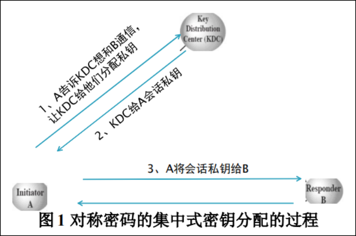
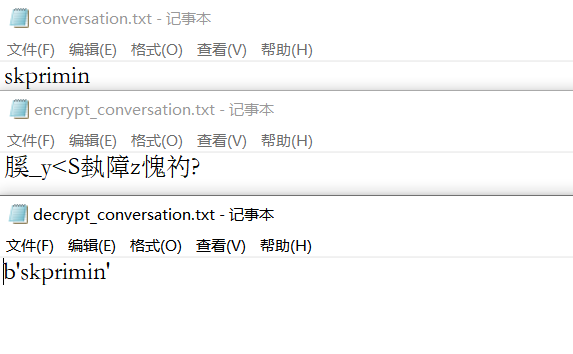

# 对称密码的集中式密钥分配协议

####  实验目的

通过掌握基于对称密码的集中式密钥分配的基本原理；熟练运用对称密码算法解决实际的密钥分配问题。

## 实验原理

#### 分配过程

1. 对称密码的集中式密钥分配的过程如图 1 所示：



（1）A 向 KDC 发出会话密钥请求：请求的消息由 A 和 B 的身份，惟一识别符N1。 

（2）KDC 为 A 的请求发出应答。

（3）A 存储会话密钥，并向 B 转发 EKB[KS‖IDA] 。 

（4）B 用 KS 加密随机数 N2，并将加密结果发送给 A。 

（5）A 以 f(N2)作为对 B 的应答，其中 f 是对 N2 进行某种变换（例如加 1）的函数，并加密后发送给 B。

注意： 第 （3）步就已完成密钥分配，第（4）、（5）两步结合第 （3）步执行的是认证功能。可使 B 相信第 （3）步收到的消息不是一个重放。

2. 对称密码的集中式密钥分配的公式表示如下：

$$
(1) A\to KDC:{requst}||N_1 \hfill
\\(2) KDC\to A:E_{k_a}[k_s||requst||N_1||E_{k_b}(K_s||ID_A)] \hfill
\\(3) A\to B:E_{k_b}(k_s||ID_A)\hfill&(完成密钥分配)
\\(4) B\to A:E_{k_s}(N_2) \hfill
\\(5) A\to B:E_{k_s}[f(N_2)]\hfill&(完成认证)其中f(x)是一个函数
$$

$(1) A\to KDC:{requst}||N_1 $
$(2) KDC\to A:E_{k_a}[k_s||requst||N_1||E_{k_b}(K_s||ID_A)] $
$(3) A\to B:E_{k_b}(k_s||ID_A) (完成密钥分配)$
$(4) B\to A:E_{k_s}(N_2) $
$(5) A\to B:E_{k_s}[f(N_2)] (完成认证)其中f(x)是一个函数$

## 实验要求

编程实现基于对称密码的集中式密钥分配协议，主要要求如下：

（1）采用 DES 完成对称密钥技术的加解密；

（2）初始化过程至少有 10 个以上的用户，每个用户分别与 KDC 共享一个主密钥，KDC 以文件格式存储用户的密钥；

（3）任意用户间进行会话需满足上图中的步骤，会话内容为.txt 文件格式。


## 实验内容

编程实现基于 DES 的集中式密钥分配协议的仿真过程，实验中包含至少 10个用户，并可在任意两个用户间进行保密通信。会话内容以.txt 文件格式传输。输出每一步所传递的信息和解密后的信息，并比较正式会话过程中解密后的明文信息同原来的会话文件是否一致。

```python
import random

from Crypto.Cipher import DES
from Crypto.Util.Padding import pad, unpad

# 密钥存储中心
Keys = {
    'A': '1234567a', 'B': '1234567b', 'C': '1234567c', 'D': '1234567d', 'E': '1234567e',
    'F': '1234567f', 'G': '1234567g', 'H': '1234567h', 'I': '1234567i', 'J': '1234567j'
}
BLOCK_SIZE = 16


def step1_a2kdc(user1, user2):
    """(1) A 向 KDC 发出会话密钥请求：请求的消息由 A 和 B 的身份，惟一识别符N1。 明文传输"""
    # 发出会话密钥请求  A 和 B 的身份惟一识别符N1
    a2kdc = f"{user1}|{user2}|{N1}"
    print(a2kdc)
    return a2kdc


def step2_kdc2a(data: str):
    """(2)KDC 为 A 的请求发出应答 Eka[ ks | requst | N1 | Ekb(Ks|IDA) ]"""
    # 发出的请求数据进行解析
    user1, user2, N1 = data.split('|')
    kb = bytes(Keys[user2].encode())
    ka = bytes(Keys[user1].encode())
    print(f"KDC已经找到{user1}的密钥:{ka},{user2}的密钥:{kb}")
    # 随机生成长度8的会话密钥Ks
    Ks = random.randint(10000000, 99999999)
    # Ekb(Ks|IDA)
    KsIDA = pad(bytes(f"{Ks}|{user1}".encode()), BLOCK_SIZE)
    # 由于较短故采用电码本模式 并转为16进制存储
    cipher2 = DES.new(kb, DES.MODE_ECB)
    EkbKsIDA = cipher2.encrypt(KsIDA)
    EkbKsIDA = EkbKsIDA.hex()
    # Eka[ks | requst | N1 | Ekb(Ks | IDA)]
    print(f"{Ks}|{user1}|{user2}|{N1}|{EkbKsIDA}")
    krne = pad(bytes(f"{Ks}|{user1}|{user2}|{N1}|{EkbKsIDA}".encode()), BLOCK_SIZE)
    cipher1 = DES.new(ka, DES.MODE_ECB)
    Ekakrne = cipher1.encrypt(krne)
    return Ekakrne


def step3_aksa2b(user1, user2, cipherEkakrne):
    """(3)A 存储会话密钥，并向 B 转发 EKB[KS‖IDA]"""
    ka = bytes(Keys[user1].encode())
    decipher = DES.new(ka, DES.MODE_ECB)
    msg_dec = decipher.decrypt(cipherEkakrne)
    msg = unpad(msg_dec, 16)
    # 解密后的字符串分割
    Ks, user1r, user2r, N1r, EkbKsIDA = str(msg, 'utf-8').split('|')
    print(N1)
    # 对数据进行验证
    if user1r != user1:
        raise ValueError(f"{user1}身份验证错误，错误值为{user1r}")
    if user2r != user2:
        raise ValueError(f"{user2}身份验证错误，错误值为{user2r}")
    if int(N1r) != int(N1):
        raise ValueError("惟一识别符N1错误")
    # 得到会话密钥 Ks
    print(f"{user1}得到了会话密钥{Ks}")
    Ksa = str(Ks)
    # 向 B 转发 EKB[KS‖IDA]
    print(f"向{user2}转发{EkbKsIDA}")
    return Ks, EkbKsIDA


def step4_b2a(EkbKsIDA):
    """(4)B 用 KS 加密随机数 N2，并将加密结果发送给 A"""
    # 将十六进制字符串转为bytes
    EkbKsIDA = bytes.fromhex(EkbKsIDA)
    kb = bytes(Keys[user2].encode())
    # DES 解密
    decipher2 = DES.new(kb, DES.MODE_ECB)
    msg_dec = decipher2.decrypt(EkbKsIDA)
    msg_dec = unpad(msg_dec, BLOCK_SIZE)
    Ks, user1r = str(msg_dec, 'utf-8').split('|')
    print(f"{user2}得到会话密钥{Ks}，对应用户是{user1r}")

    ks = bytes(Ks.encode())
    cipher4 = DES.new(ks, DES.MODE_ECB)
    EksN2 = cipher4.encrypt(pad(bytes(str(N2).encode()), BLOCK_SIZE))
    return str(Ks), EksN2


def step5_a2b(EksN2, ksa):
    """(5)A 以 f(N2)作为对 B 的应答，其中 f 是对 N2 进行某种变换（例如加 1）的函数，并加密后发送给 B"""
    # DES 解密
    ks = bytes(ksa.encode())
    decipher2 = DES.new(ks, DES.MODE_ECB)
    msg_dec5 = decipher2.decrypt(EksN2)
    msg_dec5 = unpad(msg_dec5, BLOCK_SIZE)
    print(f"解密得到随机数N2:{msg_dec5}")
    r2b = str(f(int(msg_dec5)))

    cipher = DES.new(ks, DES.MODE_ECB)
    EksFN2 = cipher.encrypt(pad(bytes(r2b.encode()), BLOCK_SIZE))
    return EksFN2


def f(x):
    return x + 1


def conversation(ks: bytes):
    # A 使用密钥加密对话
    with open('conversation.txt', 'r', encoding='utf-8') as fa:
        msg = fa.read()
    print(f"{user1}发送的会话内容为:{msg}")
    cipher = DES.new(ks, DES.MODE_ECB)
    msg = pad(bytes(msg.encode()), BLOCK_SIZE)
    encrypt_msg = cipher.encrypt(msg)
    with open('encrypt_conversation.txt', 'wb') as fa:
        fa.write(encrypt_msg)
    # B 解密对话
    with open('encrypt_conversation.txt', 'rb') as fa:
        encrypt_msgr = fa.read()
        decipher = DES.new(ks, DES.MODE_ECB)
        msg_dec = decipher.decrypt(encrypt_msg)
        msg_dec = unpad(msg_dec, BLOCK_SIZE)
        print(msg_dec)
    with open('decrypt_conversation.txt', 'w', encoding='utf-8') as fa:
        fa.write(str(msg_dec))
        print(f"{user2}解密得到的会话内容为:{msg}")


if __name__ == '__main__':
    # user1, user2 = 'A', 'B'
    user1, user2 = input("请输入两个用户（通信方，被通讯方）").split(" ")

    print("(1)A向KDC发出会话密钥请求：请求的消息由A和B的身份，惟一识别符N1。明文传输".center(100, "-"))
    # 随机生成唯一识别符N1
    N1 = random.randint(100000, 999999)
    print(f"{user2}生成唯一识别符N1:{N1}")

    s1 = step1_a2kdc(user1, user2)

    print("(2)KDC为A的请求发出应答Eka[ks|requst|N1|Ekb(Ks|IDA)]".center(100, "-"))
    s2 = step2_kdc2a(s1)

    print(f"(3){user1}存储会话密钥，并向{user2}转发EKB[KS‖IDA]".center(100, "-"))
    ksa, s3 = step3_aksa2b(user1, user2, cipherEkakrne=s2)

    print(f"(4){user2}用KS加密随机数N2，并将加密结果发送给{user1}".center(100, "-"))
    # 用 KS 加密随机数 N2
    N2 = random.randint(100000, 999999)
    print(f"{user2}生成随机数N2:{N2}")
    ksb, s4 = step4_b2a(s3)

    print(f"(5){user1}以f(N2)作为对{user2}的应答，其中f是对N2进行某种变换（例如加1）的函数，并加密后发送给{user2}".center(100, "-"))
    EksFN2 = step5_a2b(s4, ksa)

    # 最终的验证
    ks = bytes(ksb.encode())
    decipher2 = DES.new(ks, DES.MODE_ECB)
    EksFN2r = decipher2.decrypt(EksFN2)
    EksFN2r = unpad(EksFN2r, BLOCK_SIZE)
    if int(EksFN2r) == f(N2):
        print("验证成功")
    # 进行会话
    print(f"{user1}和{user2}进行会话".center(100, '-'))
    conversation(ks)
```

运行结果

