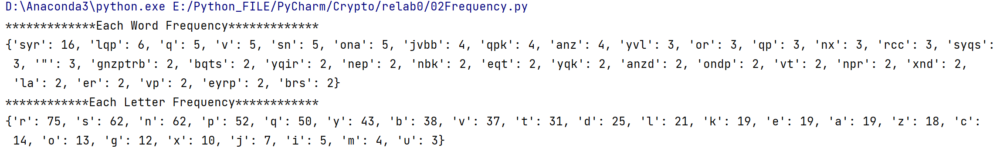
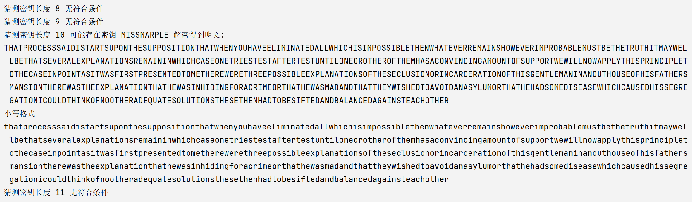

# 凯撒、简单替换、维吉尼亚密码、 CRC 破解 

本实验为密码学的一次练习

代码仓库：https://github.com/SKPrimin/HomeWork/tree/main/Cryptology/relab0

[TOC]

## 凯撒密码

1、cipher text

```
mxud jxu idemi vqbb qdt jxu mxyju mydti rbem jxu bedu mebv tyui rkj jxu fqsa ikhlylui
```

我们猜测这是一个凯撒密码，通过脚本移位发现确实如此

凯撒密码（Caesar）加密时会将明文中的 **每个字母** 都按照其在字母表中的顺序向后（或向前）移动固定数目（**循环移动**）作为密文。

### 穷举


```python
from nltk.corpus import wordnet # if you check. Otherwise, delete

Converter = ['a', 'b', 'c', 'd', 'e', 'f', 'g', 'h', 'i', 'j', 'k', 'l', 'm', 'n', 'o', 'p', 'q', 'r', 's', 't', 'u', 'v', 'w', 'x', 'y', 'z']


def caeser(cipher: str, move: int):
    # 一律转为小写字母
    cipher = cipher.lower()
    decipher = ""
    for i in cipher:
        if i in Converter:
            decipher += Converter[(ord(i) - 97 + move) % 26]
        else:
            decipher += ' '

    return decipher


# if you check
def enCheck(decipher):
    """检查是否为英文"""
    words = decipher.split(" ")
    # 至少一半英文才能通过
    least = len(words) / 2
    for word in words:
        if wordnet.synsets(word):
            least -= 1
        if least < 0:
            return True
    return False


cipher = "mxud jxu idemi vqbb qdt jxu mxyju mydti rbem jxu bedu mebv tyui rkj jxu fqsa ikhlylui"
decipherList = []  # if you check
for i in range(26):
    decipher = caeser(cipher, i)
    print(f"Right shift {i}:\t{decipher}")
    decipherList.append(decipher)  # if you check

# if you check
for i, decipher in enumerate(decipherList):
    if enCheck(decipher):
        print(f"May Original Text Right Shift {i}".center(45, "*"))
        print(decipher)
```

运行结果

```python
Right shift 0:	mxud jxu idemi vqbb qdt jxu mxyju mydti rbem jxu bedu mebv tyui rkj jxu fqsa ikhlylui
Right shift 1:	nyve kyv jefnj wrcc reu kyv nyzkv nzeuj scfn kyv cfev nfcw uzvj slk kyv grtb jlimzmvj
Right shift 2:	ozwf lzw kfgok xsdd sfv lzw ozalw oafvk tdgo lzw dgfw ogdx vawk tml lzw hsuc kmjnanwk
Right shift 3:	paxg max lghpl ytee tgw max pabmx pbgwl uehp max ehgx phey wbxl unm max itvd lnkoboxl
Right shift 4:	qbyh nby mhiqm zuff uhx nby qbcny qchxm vfiq nby fihy qifz xcym von nby juwe molpcpym
Right shift 5:	rczi ocz nijrn avgg viy ocz rcdoz rdiyn wgjr ocz gjiz rjga ydzn wpo ocz kvxf npmqdqzn
Right shift 6:	sdaj pda ojkso bwhh wjz pda sdepa sejzo xhks pda hkja skhb zeao xqp pda lwyg oqnrerao
Right shift 7:	tebk qeb pkltp cxii xka qeb tefqb tfkap yilt qeb ilkb tlic afbp yrq qeb mxzh prosfsbp
Right shift 8:	ufcl rfc qlmuq dyjj ylb rfc ufgrc uglbq zjmu rfc jmlc umjd bgcq zsr rfc nyai qsptgtcq
Right shift 9:	vgdm sgd rmnvr ezkk zmc sgd vghsd vhmcr aknv sgd knmd vnke chdr ats sgd ozbj rtquhudr
Right shift 10:	when the snows fall and the white winds blow the lone wolf dies but the pack survives
Right shift 11:	xifo uif topxt gbmm boe uif xijuf xjoet cmpx uif mpof xpmg ejft cvu uif qbdl tvswjwft
Right shift 12:	yjgp vjg upqyu hcnn cpf vjg yjkvg ykpfu dnqy vjg nqpg yqnh fkgu dwv vjg rcem uwtxkxgu
Right shift 13:	zkhq wkh vqrzv idoo dqg wkh zklwh zlqgv eorz wkh orqh zroi glhv exw wkh sdfn vxuylyhv
Right shift 14:	alir xli wrsaw jepp erh xli almxi amrhw fpsa xli psri aspj hmiw fyx xli tego wyvzmziw
Right shift 15:	bmjs ymj xstbx kfqq fsi ymj bmnyj bnsix gqtb ymj qtsj btqk injx gzy ymj ufhp xzwanajx
Right shift 16:	cnkt znk ytucy lgrr gtj znk cnozk cotjy hruc znk rutk curl joky haz znk vgiq yaxbobky
Right shift 17:	dolu aol zuvdz mhss huk aol dopal dpukz isvd aol svul dvsm kplz iba aol whjr zbycpclz
Right shift 18:	epmv bpm avwea nitt ivl bpm epqbm eqvla jtwe bpm twvm ewtn lqma jcb bpm xiks aczdqdma
Right shift 19:	fqnw cqn bwxfb ojuu jwm cqn fqrcn frwmb kuxf cqn uxwn fxuo mrnb kdc cqn yjlt bdaerenb
Right shift 20:	grox dro cxygc pkvv kxn dro grsdo gsxnc lvyg dro vyxo gyvp nsoc led dro zkmu cebfsfoc
Right shift 21:	hspy esp dyzhd qlww lyo esp hstep htyod mwzh esp wzyp hzwq otpd mfe esp alnv dfcgtgpd
Right shift 22:	itqz ftq ezaie rmxx mzp ftq itufq iuzpe nxai ftq xazq iaxr puqe ngf ftq bmow egdhuhqe
Right shift 23:	jura gur fabjf snyy naq gur juvgr jvaqf oybj gur ybar jbys qvrf ohg gur cnpx fheivirf
Right shift 24:	kvsb hvs gbckg tozz obr hvs kvwhs kwbrg pzck hvs zcbs kczt rwsg pih hvs doqy gifjwjsg
Right shift 25:	lwtc iwt hcdlh upaa pcs iwt lwxit lxcsh qadl iwt adct ldau sxth qji iwt eprz hjgkxkth
```

### 智能判断

也许有的人就能发现第10行是原文，但我英文不行，No G00d。因此我多加了英文判断，即enCheck函数，调用nltk的wordnet进行判断

```python
*******May Original Text Right Shift 10******
when the snows fall and the white winds blow the lone wolf dies but the pack survives
```

它给出了正确结果

也可以直接在网站上解密，https://quipqiup.com/

## 简单替换密码——词频攻击

2、cipher text

```
qrlnp't xvpqb endkt. "qbbne lr sn cvir la bndk npr bqts mvrgr nx gnzptrb," syr nbk lqp yqk tqvk, "syr tqlr gnzptrb syqs v npgr cqir la odnsyrd eyrp er mqdsrk xnd syr bqts svlr. yr eqt sydrr qpk syvdsa eyrp syr cdrqs gnzpgvb gyntr yvl sn lnzps syr vdnp sydnpr. q lqp cdnep evsy tnpt nx yvt nep, ars vp tnlr eqat tsvbb q ona. rcc yqk qp vppngrpgr sn yvl, q terrsprtt er qbb bnirk. jvbb syr ona evsyvp anz, v snbk yvl syr kqa v snnj tyvm xnd syr eqbb. vs sqjrt q lqp sn dzbr. qp qrcnp, pns qp rcc. jvbb syr ona qpk brs syr lqp or ondp." syr nbk lqp xrbs unp't xqgr. "anz qdr yqbx syr qcr syqs rcc eqt, qpk anzd nep ozdkrp vt q gdzrbrd npr, v xrqd. anz evbb yqir bvssbr una nx anzd gnllqpk, ozs v syvpj anz yqir syr tsdrpcsy vp anz sn kn syr syvpct syqs lzts or knpr. jvbb syr ona, unp tpne. evpsrd vt qblnts zmnp zt. jvbb syr ona qpk brs syr lqp or ondp."
```

当我们将其放到上题的凯撒解密代码运行，发现没有正确结果，我们猜测这可能是独立码表，

简单替换密码（Simple Substitution Cipher）加密时，将每个明文字母替换为与之唯一对应且不同的字母。它与恺撒密码之间的区别是其密码字母表的字母不是简单的移位，而是完全是混乱的，这也使得其破解难度要高于凯撒密码。

### 词频分析

由于这种加密方式导致其所有的密钥个数是$26!$，因此需要使用频率攻击。

我们先行性词频分析，分为单词分析和字符分析。

```python
import string
import re


def frequentCount(paragraph, isWord=True,minVal=0):
    """isWord 为 Treu 查单词，否则为字母。 minVal为 最低出现次数"""
    if isWord:
        aStr = paragraph.replace(',', ' ').replace('.', ' ').split()
    else:
        aStr = re.sub("[^a-z^A-Z^0-9]", "", paragraph)

    aList = []
    # 利用集合元素唯一性自动实现去重
    aSet = set()
    for s in aStr:
        aSet.add(s)
        aList.append(s)

    # 列表转为字典，统计出aSet中每个元素出现的次数
    aDict = {}
    for item in aSet:
        counter = aList.count(item)
        if counter >= minVal:  # 仅出现一次的去除
            aDict[item] = aList.count(item)

    # 将字典按照元素值进行逆序排序
    return dict(sorted(aDict.items(), key=lambda i: i[1], reverse=True))


cipher = '''qrlnp't xvpqb endkt. "qbbne lr sn cvir la bndk npr bqts mvrgr nx gnzptrb,"
 syr nbk lqp yqk tqvk, "syr tqlr gnzptrb syqs v npgr cqir la odnsyrd eyrp er mqdsrk xnd syr bqts svlr. 
yr eqt sydrr qpk syvdsa eyrp syr cdrqs gnzpgvb gyntr yvl sn lnzps syr vdnp sydnpr. 
q lqp cdnep evsy tnpt nx yvt nep, ars vp tnlr eqat tsvbb q ona. 
rcc yqk qp vppngrpgr sn yvl, q terrsprtt er qbb bnirk. jvbb syr ona evsyvp anz, v snbk yvl syr kqa v snnj tyvm xnd syr eqbb. 
vs sqjrt q lqp sn dzbr. qp qrcnp, pns qp rcc. jvbb syr ona qpk brs syr lqp or ondp." syr nbk lqp xrbs unp't 
xqgr. "anz qdr yqbx syr qcr syqs rcc eqt, qpk anzd nep ozdkrp vt q gdzrbrd npr, v xrqd. 
anz evbb yqir bvssbr una nx anzd gnllqpk, ozs v syvpj anz yqir syr tsdrpcsy vp anz sn kn syr syvpct syqs lzts or knpr. 
jvbb syr ona, unp tpne. evpsrd vt qblnts zmnp zt. jvbb syr ona qpk brs syr lqp or ondp." '''

print("Each Word Frequency".center(45,"*"))
print(frequentCount(cipher,True,2))
print("Each Letter Frequency".center(45,"*"))
print(frequentCount(cipher, False,0))
```

得到如下结果：

```python
*************Each Word Frequency*************
{'syr': 16, 'lqp': 6, 'ona': 5, 'v': 5, 'sn': 5, 'q': 5, 'jvbb': 4, 'anz': 4, 'qpk': 4, 'syqs': 3, 'yvl': 3, '"': 3, 'nx': 3, 'rcc': 3, 'qp': 3, 'or': 3, 'yqk': 2, 'eyrp': 2, 'npr': 2, 'er': 2, 'ondp': 2, 'nep': 2, 'vp': 2, 'brs': 2, 'xnd': 2, 'la': 2, 'yqir': 2, 'vt': 2, 'eqt': 2, 'bqts': 2, 'anzd': 2, 'nbk': 2, 'gnzptrb': 2}
************Each Letter Frequency************
{'r': 75, 'n': 62, 's': 62, 'p': 52, 'q': 50, 'y': 43, 'b': 38, 'v': 37, 't': 31, 'd': 25, 'l': 21, 'a': 19, 'k': 19, 'e': 19, 'z': 18, 'c': 14, 'o': 13, 'g': 12, 'x': 10, 'j': 7, 'i': 5, 'm': 4, 'u': 3}
```



真正的英文字母频率

| 字母 | 频率    | 字母 | 频率   | 字母 | 频率   |
| ---- | ------- | ---- | ------ | ---- | ------ |
| e    | 12.702% | d    | 4.253% | p    | 1.929% |
| t    | 9.056%  | l    | 4.025% | b    | 1.492% |
| a    | 8.167%  | c    | 2.782% | v    | 0.978% |
| o    | 7.507%  | u    | 2.758% | k    | 0.772% |
| i    | 6.966%  | f    | 2.228% | x    | 0.150% |
| n    | 6.749%  | m    | 2.406% | j    | 0.153% |
| s    | 6.327%  | w    | 2.360% | q    | 0.095% |
| h    | 6.094%  | y    | 1.974% | z    | 0.074% |
| r    | 5.987%  | g    | 2.015% |      |        |

### 攻击

我们开始着手分析对应的密码表
$$
首先r\to e，进而推理出syr \to the，即 \\
 s \to t,\\ y\to h\\
 文章中出现 't，推测\\
 t\to s\\
 至此，继续频率分析，\\高频还剩 nqp  对应 aoinr ,考虑到q能单独出现\\
 q \to a\\
 另一个多次单独出现的 v极有可能是另一个常出现的 i
 \\ v\to i
$$
- 极高频 E
- 次高频 T A O I N S H R
- 中等频 D L
- 低频   C U M W F G Y P B
- 极低频 V K X J  Q Z

将文章的数据带入

| 字母 | 出现次数 | 原文 |      | 字母 | 出现次数 | 原文 |      | 字母 | 出现次数 | 原文 |
| ---- | -------- | ---- | ---- | ---- | -------- | ---- | ---- | ---- | -------- | ---- |
| r    | 75       |      |      | s    | 62       |      |      | n    | 62       |      |
| p    | 52       |      |      | q    | 50       |      |      | y    | 43       |      |
| b    | 38       |      |      | v    | 37       |      |      | t    | 31       |      |
| d    | 25       |      |      | l    | 21       |      |      | a    | 19       |      |
| k    | 19       |      |      | e    | 19       |      |      | z    | 18       |      |
| c    | 14       |      |      | o    | 13       |      |      | g    | 12       |      |
| x    | 10       |      |      | j    | 7        |      |      | i    | 5        |      |
| m    | 4        |      |      | u    | 3        |      |      |      |          |      |

我们开始着手分析对应的密码表
$$
首先r\to e，进而推理出syr \to the，即 \\
 s \to t,\\ y\to h\\
 文章中出现 't，推测\\
 t\to s\\
 至此，继续频率分析，\\高频还剩 nqp  对应 aoinr ,考虑到q能单独出现\\
 q \to a\\
 另一个多次单独出现的 v极有可能是另一个常出现的 i
 \\ v\to i
$$

接来下有点艰难，我们先通过已知的表部分解密，但考虑到结果中会出现混用的情况，我们可以替换时加标记

```python
def rep_by_dict(aStr, dict_for_rep:dict):
    newStr = ''
    for i in aStr:
        if i in dict_for_rep.keys():
            newStr += dict_for_rep[i]
        else:
            newStr+=i
    return newStr

cipher = '''qrlnp't xvpqb endkt. "qbbne lr sn cvir la bndk npr bqts mvrgr nx gnzptrb,"
 syr nbk lqp yqk tqvk, "syr tqlr gnzptrb syqs v npgr cqir la odnsyrd eyrp er mqdsrk xnd syr bqts svlr. 
yr eqt sydrr qpk syvdsa eyrp syr cdrqs gnzpgvb gyntr yvl sn lnzps syr vdnp sydnpr. 
q lqp cdnep evsy tnpt nx yvt nep, ars vp tnlr eqat tsvbb q ona. 
rcc yqk qp vppngrpgr sn yvl, q terrsprtt er qbb bnirk. jvbb syr ona evsyvp anz, v snbk yvl syr kqa v snnj tyvm xnd syr eqbb. 
vs sqjrt q lqp sn dzbr. qp qrcnp, pns qp rcc. jvbb syr ona qpk brs syr lqp or ondp." syr nbk lqp xrbs unp't xqgr. "anz qdr yqbx syr qcr syqs rcc eqt, qpk anzd nep ozdkrp vt q gdzrbrd npr, v xrqd. 
anz evbb yqir bvssbr una nx anzd gnllqpk, ozs v syvpj anz yqir syr tsdrpcsy vp anz sn kn syr syvpct syqs lzts or knpr. 
jvbb syr ona, unp tpne. evpsrd vt qblnts zmnp zt. jvbb syr ona qpk brs syr lqp or ondp." '''


decrypture_dict = {'r': '\\e', 's': '\\t', 't': '\\s', 'y': '\\h', 'q': '\\a', 'v': '\\i'}
print(rep_by_dict(cipher, decrypture_dict))
```

部分解密得到： e t s h a v已解密

```
\a\elnp'\s x\ip\ab endk\s. "\abbne l\e \tn c\ii\e la bndk np\e b\a\s\t m\i\eg\e nx gnzp\s\eb,"
 \t\h\e nbk l\ap \h\ak \s\a\ik, "\t\h\e \s\al\e gnzp\s\eb \t\h\a\t \i npg\e c\ai\e la odn\t\h\ed e\h\ep e\e m\ad\t\ek xnd \t\h\e b\a\s\t \t\il\e. 
\h\e e\a\s \t\hd\e\e \apk \t\h\id\ta e\h\ep \t\h\e cd\e\a\t gnzpg\ib g\hn\s\e \h\il \tn lnzp\t \t\h\e \idnp \t\hdnp\e. 
\a l\ap cdnep e\i\t\h \snp\s nx \h\i\s nep, a\e\t \ip \snl\e e\aa\s \s\t\ibb \a ona. 
\ecc \h\ak \ap \ippng\epg\e \tn \h\il, \a \se\e\e\tp\e\s\s e\e \abb bni\ek. j\ibb \t\h\e ona e\i\t\h\ip anz, \i \tnbk \h\il \t\h\e k\aa \i \tnnj \s\h\im xnd \t\h\e e\abb. 
\i\t \t\aj\e\s \a l\ap \tn dzb\e. \ap \a\ecnp, pn\t \ap \ecc. j\ibb \t\h\e ona \apk b\e\t \t\h\e l\ap o\e ondp." \t\h\e nbk l\ap x\eb\t unp'\s x\ag\e. 
"anz \ad\e \h\abx \t\h\e \ac\e \t\h\a\t \ecc e\a\s, \apk anzd nep ozdk\ep \i\s \a gdz\eb\ed np\e, \i x\e\ad. 
anz e\ibb \h\ai\e b\i\t\tb\e una nx anzd gnll\apk, oz\t \i \t\h\ipj anz \h\ai\e \t\h\e \s\td\epc\t\h \ip anz \tn kn \t\h\e \t\h\ipc\s \t\h\a\t lz\s\t o\e knp\e. 
j\ibb \t\h\e ona, unp \spne. e\ip\t\ed \i\s \abln\s\t zmnp z\s. j\ibb \t\h\e ona \apk b\e\t \t\h\e l\ap o\e ondp." 
```

$$
e t s h a v已解密\\
 结合语境，我们分析\text{\\h\\ak \\s\\a\\ik }，再结合前面是一段话，故 saik \to said 得\\
 k\to d
\\ \text{\\ad\\e} \to are
\\d\to r
\\ o\text{\\e} \to be
即
o \to b
\\ \text{e\\a\\s} \to was
\\e \to w
连字母 bb 、cc组合多次出现英文中可能时 ll、ff、gg组合
\\ 结合 \text{\\abb} ，以及词频b较高 \\
b\to l
\\ 结合 \text{\\ac\\e \; \\ecc}以及频率低，
\\ c\to g
现在剩下的高频不多了，还剩n、p
\\结合 \text{ \\w\\h\\ep \; \\ap\;  \\ap\\d  } \
\\推测 p \to n
\\结合 \text{ n\\n\\e \; \\a\\l\\ln\\w  } \
\\推测 n \to o
\\
剩下的l结合\text{ l\\a\\n \; \\s\\ol\\e\; \\t\\il\\e} 
\\ l\to m

\\接着往下 a  \text{ \\b\\oa \; a\\oz}对照词频 
\\a\to y
\\ z \text{  \\y\\oz \; \\bz\\t \; \\rz\\l\\e}
\\z \to u
\\ g \text{ \\o\\ng\\e  \;\; g\\o\\m\\m\\a\\n\\d}
\\g \to c
$$

接下来我们查看还有那些没有翻译

```python
import string
decrypture_dict = {'r': 'e', 's': 't', 't': 's', 'y': 'h', 'q': 'a', 'v': 'i','k':'d','o':'b','d':'r','e':'w','c':'g','b':'l','l':'m','p':'n','n':'o','a':'y','z':'u','g':'c'}
alletter = list(string.ascii_lowercase)  # 全集
keys = list(decrypture_dict.keys())  # 已有的密文
values = list(decrypture_dict.values())  # 已有的原文

print([item for item in alletter if not item in keys])
print([item for item in alletter if not item in values])
```

```python
['f', 'h', 'i', 'j', 'm', 'u', 'w', 'x']
['f', 'j', 'k', 'p', 'q', 'v', 'x', 'z']
```

目前 我们实际还剩 `x j i u m`没有翻译，可供选择的有`'f', 'j', 'k', 'p', 'q', 'v', 'x', 'z'`

- x

`x\o\r  \ox x\e\l\t` 推理出$x\to f$

- j

`\t\o\oj   \t\aj\e\s  j\i\l\l`推理出$j\to k$

- i 

`\h\ai\e  \l\oi\e\d` 推理出$i\to v$

- m

`\um\o\n   \s\h\im    m\a\r\t\e\d    m\i\e\c\e`  推理出$m\to p$

- u 

`u\o\n'\s   u\o\y     u\o\n  `  推理出$u\to j$

得到完整的密码表

| 字母 | 出现次数 |原文   | |字母 | 出现次数 |原文    | | 字母 | 出现次数 |原文   |
| ---- | ------- |------ | ---- | -----| ---- |--- | -|--- | ------ | ------ |
|r|75|e|| s|62|t| | n|62|o|
|p|52|n| | q|50|a| | y|43|h|
|b|38|l| | v|37|i| | t|31|s|
|d|25|r| | l|21|m| | a|19|y|
|k|19|d| | e|19|w| | z|18|u|
|c|14|g| | o|13|b| | g|12|c|
|x|10|f| | j|7|k| | i|5|v|
|m|4|p| | u|3|j||| ||

及其对应的字典

```python
decrypture_dict = {'r': 'e', 's': 't', 't': 's', 'y': 'h', 'q': 'a', 'v': 'i','k':'d','o':'b','d':'r','e':'w','c':'g','b':'l','l':'m','p':'n','n':'o','a':'y','z':'u','g':'c','x':'f','j':'k','i':'v','m':'p','u':'j'}
```

带入程序得到：

```
aemon's final words. "allow me to give my lord one last piece of counsel,"
 the old man had said, "the same counsel that i once gave my brother when we parted for the last time. 
he was three and thirty when the great council chose him to mount the iron throne. 
a man grown with sons of his own, yet in some ways still a boy. 
egg had an innocence to him, a sweetness we all loved. kill the boy within you, i told him the day i took ship for the wall. 
it takes a man to rule. an aegon, not an egg. kill the boy and let the man be born." the old man felt jon's face. "you are half the age that egg was, and your own burden is a crueler one, i fear. 
you will have little joy of your command, but i think you have the strength in you to do the things that must be done. 
kill the boy, jon snow. winter is almost upon us. kill the boy and let the man be born." 
```

带入翻译软件中，发现无异常

```
Aemon的最后一句话。 “请允许我给主的最后一位律师。”
  老人说：“我们最后一次分手时曾经给兄弟的同一位律师。
当伟大的议会选择他登上铁王位时，他只有三十岁。
一个有自己的儿子长大的男人，但在某些方面仍然是男孩。
鸡蛋对他有着纯真的态度，这是我们所有人都喜欢的甜蜜。 杀死你里面的男孩，我告诉他我乘船去墙的那一天。
它需要一个人来统治。 一个艾根，不是鸡蛋。 杀死男孩，让男人出生。”老人感觉到乔恩的脸。 
“我担心你是鸡蛋年龄的一半，而且你自己的负担更加残酷。
您的命令几乎不会感到高兴，但是我认为您有能力做必须做的事情。
杀死男孩，乔恩·斯诺。 冬天快到了。 杀死男孩，让男人出生。”
```

当然也可以直接在网站上解密，https://quipqiup.com/


## 维吉尼亚密码

3、Vigenere cipher text

在凯撒密码中，字母表中的每一字母都会作一定的偏移，例如偏移量为3时，`A`就转换为了`D`、`B`转换为了`E`……而维吉尼亚密码则是由一些偏移量不同的恺撒密码组成。

为了生成密码，需要使用表格法。这一表格包括了26行字母表，每一行都由前一行向左偏移一位得到。具体使用哪一行字母表进行编译是基于密钥进行的，在过程中会不断地变换。解密的过程则与加密相反

用数字0-25代替字母`A`-`Z`，维吉尼亚密码的加密文法可以写成同余的形式：
$$
加密C_i \equiv P_i +K_i (\mod 26 )\\
解密P_i \equiv C_i — K_i(\mod 26 )
$$

```
FPSLBRFRPWEASAPIJILVFAMHANKWPWGXHGEIKXZRFPSLIHVCJSGPSNQECXXMZILWPACAHLUKZAEIDEZWEQTDQTYTYATILWHEIGPQMQFKTONTGIDQEHDOSPMPQUMKFBVISIFZMLTIKBLCIMDDNEKWLXEMNWDACTITXIFSFIFCDVQUSAZIELSMOPUSEEFCPXDQWKFEJILJFMJLQSKJYXUTGFQOIDELQZGXFHVBSEEIUGZVZCNMZOSEAUEIZJECHHARKLPAUTDFAWREAPKBZAEPIXYGUXDWFOKWPGMAWAZPFXYXMAALIAJUTVEBHJQSVCEIPBGEQTYTCIIMJWFHITPTAAKANLVTITXIFSFIFCDSRBZWEETAFWUWFGDIERLVOMJSFIFCZJFPAKSEEIWIYIFAZAEDFXTWMKQOWWTWRILZQRJBLREQGFFHVGPAMALZQEOEWEZILAANKWLXTMOSEIEWTHUVYXARRRCMYMGJFHRISIIIKEMDRCOXTILLTEPLTWTMVLAAMDTHMVSKKLLBZVFPSLTEYPOWAUWVUSVPDIIPAUTCRJDIPPAKEEXGPKMBAGZITDFPPBZAZKFUYSABZWDAUTBYMBWKALLITSZALZQSVISIZPSVFOSTDMRBWVMNUQLPMVUWPAXPTREBWSOHFISID
```

破译维吉尼亚密码的关键在于它的密钥是循环重复的。如果我们知道了密钥的长度，那密文就可以被看作是交织在一起的凯撒密码，而其中每一个都可以单独破解。

#### 重合指数法

弗里德曼（William F. Friedman）使用了重合指数（index of coincidence）来描述密文字母频率的不匀性，从而破译密码。$\kappa _{p}$指目标语言中两个任意字母相同的概率（有意义的英文中为0.067），${\displaystyle \kappa _{r}}$指字母表中这种情况出现的概率（英文中为1/26=0.0385），从而密钥长度可以估计为：

计为：

$$
{\kappa _{p}-\kappa _{r}} \over {\kappa _{o}-\kappa _{r}}
$$
其中，观察概率为
$$
\kappa _{o}={\frac {\sum _{i=1}^{c}n_{i}(n_{i}-1)}{N(N-1)}}
$$
 但在实际计算中我们还是正向计算重合指数较好

实际使用$CI$的估计值为 $CI^`$， $L$为密文的长度， $f_i$为26个字母中第 $i$ 个字母发生的次数。
$$
CI` = \sum _{i=1}^{c} \frac{f_i}{L} \times \frac{f_i-1}{L-1}
$$
因为单表代换改变的只是字母，并没有改变频率，故统计规律和自然语言相似。若结果接近$0.067$ ，则猜测正确。

### 组合数破解

```python
import string


def Cutting(cipher, key_length):
    """据密钥长度对text进行分组,分组后为交织在一起的凯撒密码"""
    groups = ["" for _ in range(key_length)]
    for i, c in enumerate(cipher):
        groups[i % key_length] += c
    return groups


def countLetter(cipher):
    """统计26个字母各自 在参数text中 出现的次数"""
    # 初始化计数数组
    count = {}
    for i in string.ascii_uppercase:
        count[i] = 0
    for i in cipher:
        count[i] += 1
    return count


def cutAndCount(cipher, keyLength):
    """将前两个函数合并得到输出"""
    countOfGroup = []
    cipherGroups = Cutting(cipher, keyLength)
    for i in range(keyLength):
        countOfGroup.append(countLetter(cipherGroups[i]))
    # print([txtGroup, countOfGroup])
    return cipherGroups, countOfGroup


def calcIC(N: int, frequency):
    """在给定字母出现次数统计表的情况下计算重合指数"""
    IC = 0
    for i in string.ascii_uppercase:
        n_i = frequency[i]
        IC += (n_i * (n_i - 1))
    IC /= (N * (N - 1))
    return IC


def getAvgIC(keyLength, res, find):
    """得到在该长度下的组合重数平均值"""
    sumIC = 0
    for i in range(keyLength):
        N = len(res[i])
        found = find[i]
        sumIC += calcIC(N, found)
    return sumIC / keyLength


def getKey(keyLength, cipherGroup, find):
    """根据密钥长度猜测密钥 分组密钥的拟重合指数阈值 fi*pi/n（n是密文长度）"""
    key = ""
    for i in range(keyLength):  # 共keyLength组密文
        delta = 0  # 位移量
        # 最多26个字母
        for K in string.ascii_uppercase:
            IC = 0
            C_i = 65 + delta
            subCipher = cipherGroup[i]
            found = find[i]
            for p in probability:  # 根据拟重合指数公式，此处C_i所表示的字母是与英语的中第i个字母对应的
                if C_i == 91: C_i = 65
                IC += p * found[chr(C_i)]
                C_i += 1
            IC /= len(subCipher)
            # print(IC)  # 无结果时查看 调整 GROUP_IC
            if IC >= GROUP_IC:
                key += K
                break
            else:
                delta += 1
        # print("**********************************")# 无结果时查看
    if keyLength != len(key):
        key = None
    return key


def decrypt(key: str, cipher: str):
    """维吉尼亚密码解密"""
    decipher = ""
    keyLength = len(key)
    for i, c in enumerate(cipher):
        k = key[i % keyLength]
        origin = (ord(c) - ord(k)) % 26
        decipher += chr(origin + 65)
    return decipher


if __name__ == '__main__':
    # 分组密钥的拟重合指数阈值 标准英文中为0.067 可适当下降
    GROUP_IC = 0.06
    # 整体的平均重合指数阈值
    ALL_IC = 0.06
    # 单词频率表
    probability = [0.08167, 0.01492, 0.02782, 0.04253, 0.12705, 0.02228, 0.02015, 0.06094, 0.06996, 0.00153, 0.00772, 0.04025, 0.02406, 0.06749, 0.07507, 0.01929, 0.0009, 0.05987, 0.06327, 0.09056, 0.02758, 0.00978, 0.02360, 0.0015, 0.01974, 0.00074]
    cipher = "FPSLBRFRPWEASAPIJILVFAMHANKWPWGXHGEIKXZRFPSLIHVCJSGPSNQECXXMZILWPACAHLUKZAEIDEZWEQTDQTYTYATILWHEIGPQMQFKTONTGIDQEHDOSPMPQUMKFBVISIFZMLTIKBLCIMDDNEKWLXEMNWDACTITXIFSFIFCDVQUSAZIELSMOPUSEEFCPXDQWKFEJILJFMJLQSKJYXUTGFQOIDELQZGXFHVBSEEIUGZVZCNMZOSEAUEIZJECHHARKLPAUTDFAWREAPKBZAEPIXYGUXDWFOKWPGMAWAZPFXYXMAALIAJUTVEBHJQSVCEIPBGEQTYTCIIMJWFHITPTAAKANLVTITXIFSFIFCDSRBZWEETAFWUWFGDIERLVOMJSFIFCZJFPAKSEEIWIYIFAZAEDFXTWMKQOWWTWRILZQRJBLREQGFFHVGPAMALZQEOEWEZILAANKWLXTMOSEIEWTHUVYXARRRCMYMGJFHRISIIIKEMDRCOXTILLTEPLTWTMVLAAMDTHMVSKKLLBZVFPSLTEYPOWAUWVUSVPDIIPAUTCRJDIPPAKEEXGPKMBAGZITDFPPBZAZKFUYSABZWDAUTBYMBWKALLITSZALZQSVISIZPSVFOSTDMRBWVMNUQLPMVUWPAXPTREBWSOHFISID"
    minKeyLength = 5
    maxKeyLength = 15
    for keyLength in range(minKeyLength, maxKeyLength + 1):
        cipherGroups, countOfGroup = cutAndCount(cipher, keyLength)  # 得到分组
        avgIC = getAvgIC(keyLength, cipherGroups, countOfGroup)  # 计算平均重合重数
        # print(avgIC) # 无结果时查看，以便调整阈值
        if avgIC >= ALL_IC:
            key = getKey(keyLength, cipherGroups, countOfGroup)
            if key is not None:
                decipher = decrypt(key, cipher)
                print(f'猜测密钥长度 {keyLength} 可能存在密钥 {key} 解密得到明文: \n{decipher}')
        else:
            print(f'猜测密钥长度 {keyLength} 无符合条件')
```



解密得到

```
that process said i starts up on the supposition that when you have eliminatedall which is impossible then whatever remains however improbable must bethe truth it may well bethat severalex planations remain in which case one tries test after test until one or other of them has aconvincing a mount of support we will now apply this principle to the case inpointasit was first presented to me there were three possible explanations of the seclusionorincarceration of this gentlemaninanouthouseofhisfathersmansiontherewastheexplanationthathewasinhidingforacrimeorthathewasmadandthattheywishedtoavoidanasylumorthathehadsomediseasewhichcausedhissegregationicouldthinkofnootheradequatesolutionsthesethenhadtobesiftedandbalancedagainst each other
```

解密网站：

https://www.guballa.de/vigenere-solver

https://www.mygeocachingprofile.com/codebreaker.vigenerecipher.aspx

## CRC爆破

4、[Rar file](https://github.com/SKPrimin/HomeWork/tree/main/Cryptology/relab0/rate.rar) without password 

压缩包的文件大小很小，只有3，代表仅有3个字符，可以通过CRC碰撞，获取到文件中的字符串内容。


```python
import binascii
import time

start = time.time()
crc_num = 0x05665E74
for i in range(0, 127):
    for j in range(0, 127):
        for k in range(0, 127):
            txt = chr(i) + chr(j) + chr(k)
            if binascii.crc32(bytes(txt, 'utf-8')) == crc_num:
                print(f"crc32 of {txt} is -> {hex(binascii.crc32(bytes(txt, 'utf-8')))}")
end = time.time()
print(f"Use time: {end - start} s")

```

解密得到

```
crc32 of 77% is -> 0x5665e74
Use time: 1.2758734226226807 s
```

ADFGVX 

5、（选做）ADFGVX — Part 1
https://www.mysterytwisterc3.org/en/challenges/level-1/adfgvx--part-1

> 第一次世界大战中德军发明了ADFGX棋盘密码，它是Polybius棋盘密码的改良版本，以适应当时的电报信息加密传送。ADFGX密码将Polybius棋盘中的12345替换成ADFGX，因此密文由数字变成了字母。然后使用一个密钥将密文再次移位加密，得到最终密文。
>
> ADFGVX 是ADFGX棋盘的加强版本，增加了一个行列，用V表示。如此形成6行6列的棋盘，容纳26个字母、10个数字，总计36个字符。加密强度更高，且解密时不再刻意区分I和J。
>
> ADFGVX棋盘方阵
>
> |      | A    | D    | F    | G    | V    | X    |
> | ---- | ---- | ---- | ---- | ---- | ---- | ---- |
> | A    | A    | B    | C    | D    | E    | F    |
> | D    | G    | H    | I    | J    | K    | L    |
> | F    | M    | N    | O    | P    | Q    | R    |
> | G    | S    | T    | U    | V    | W    | X    |
> | V    | Y    | Z    | 0    | 1    | 2    | 3    |
> | X    | 4    | 5    | 6    | 7    | 8    | 9    |
>
> 例如“hello”用ADFGVX棋盘加密得到密文“DDAVDXDXFF”，然后用密钥“bye”再次加密：
>
> | b    | y    | e    |
> | ---- | ---- | ---- |
> | D    | D    | A    |
> | V    | D    | X    |
> | D    | X    | F    |
> | F    |      |      |
>
> 依照“bey”的顺序抄写列，得到最终密文：DVDFAXFDDX。

一条加密的消息在傍晚被拦截了一个对手使者。乔治·帕恩文（Georges Painvin）是一名官员，他认识到这种密文是已被ADFGVX密码加密的信息。

密文的读取如下：

```
ADGG AADG FDFA AVFD DAAV GDFF DXFG AFAA DDDF GFGD FFAG VDDF AFFG AADG AAAG AAGD FFDA GFAA GGAG DGAA AAAD GGAD DAAA GAFA GGGA ADAD FAAA
```

> 乔治·帕恩文（Georges Painvin）知道他的部队处于危险之中。 他没有太多时间使用笔，纸和他的思想解密密文。
> Cipher text仅包含上述字符，而在明文中，三个最频繁的字符（E，N，I）的频率与通常在德语中的情况相同。
> 这意味着“E”的出现率最高，“ N”第二高，“I” 第三高。 Georges Painvin都不知道替代密钥和换位密钥。 但他知道对手只是用一个德语4个字符的单词作为替换键，用4个数字作为换位键。
> 您是否可以通过解密密文来帮助Georges Painvin？

根据查表，E，N，I 对应的密码为 AV，FD，DF。


