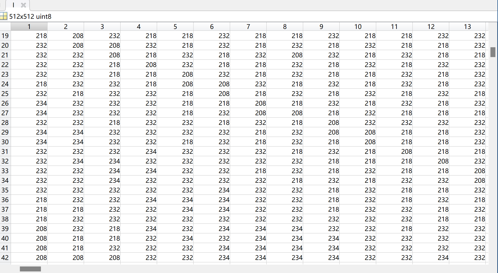
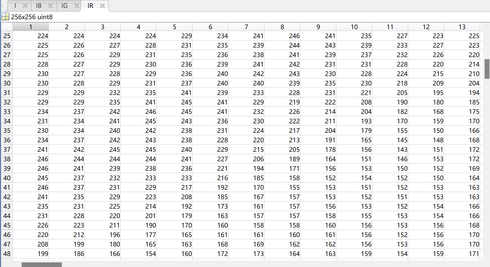
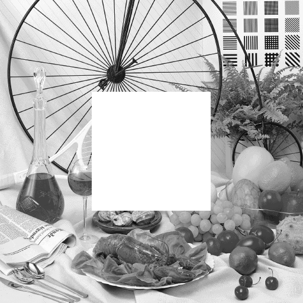
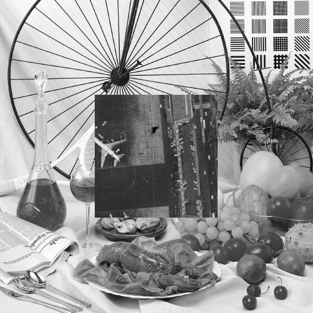

# 数字水印01

**读取图像（灰度I1、彩色I2），观察图像读取后的数据。**

- 选用80.bmp


```matlab
I = imread('D:\Pictures\Camera Roll\7.bmp');

figure;imshow(I);title('黑白打开显示')
```

- I1的数据：




选用彩图


```matlab
I = imread('D:\Python_FILE\Spyder\PJaRm\dataset\lena.png');

IR=I(:,:,1);
IG=I(:,:,2);
IB=I(:,:,3);
imshow(I),title('彩图打开显示')
```

由于直接打开会发现其是一个512×512×3的三维阵列，故分为RGB方式查看



在灰度图像中间剪切掉一块方形区域，自定义大小。

```matlab
I=imread('D:\Pictures\Camera Roll\7.bmp'); %读入黑白图
[long,width]=size(I); %获取图片的长度、宽度

%希望截取的边长，截取部分为图像正中心的以limit为边长的区域
limit=200;
%裁剪出一块方形区域
i=I((long-limit)/2:(long+limit)/2,(width-limit)/2:(width+limit)/2);
%将原图中的区域使用白色填充
I((long-limit)/2:(long+limit)/2,(width-limit)/2:(width+limit)/2)=255;

%绘图并保存为新图片
figure;imshow(I),title('黑白分割余下部分');imwrite(I,'黑白分割结果_余下部分.bmp')
figure;imshow(i),title('黑白分割裁剪部分');imwrite(i,'黑白分割结果_裁剪部分.bmp')
```



在彩色图像中间剪切掉一块方形区域，自定义大小。

```matlab
I = imread('D:\Pictures\Camera Roll\mypic.jpg'); %读入彩图
[long,width,~]=size(I); %获取图片的长度、宽度
side = 200; %想要截取的边长
i = imcrop(I,[long/2-side/2 width/2-side/2 side side]); %裁剪出一块方形区域

%将原图中的区域使用白色填充，以实现裁剪调的效果，在R、G、B范围内均填充
for k = 1:3
    I((long-side)/2:(long+side)/2,(width-side)/2:(width+side)/2,k)=255;
end

%  创建新的窗口；展示图片；保存图片
figure;imshow(I),title('彩图分割余下部分');imwrite(I,'彩图分割结果_余下部分.bmp')
figure;imshow(i),title('彩图分割裁剪部分');imwrite(i,'彩图分割结果_裁剪部分.bmp')
```


再继续读取一幅图像I3，裁剪合适大小，填充到刚才中间剪切掉的灰度和彩色图像中。

```matlab
%读入图片
B = imread('黑白分割结果_余下部分.bmp');
C = imread('彩图分割结果_余下部分.bmp');
I = imread('D:\Pictures\misc标准库\50.bmp');
% 获取图片的长与宽
[long1, width1] = size(B);
[long2, width2,~] = size(C);
[long3, width3] = size(I);

limit = 200;%希望截取的长度
i = I((long3-limit)/2:(long3+limit)/2,(width3-limit)/2:(width3+limit)/2);
%填充黑白图B
B((long1-limit)/2:(long1+limit)/2,(width1-limit)/2:(width1+limit)/2) = i;
%填充彩图C
for k = 1:3
    C((long2-limit)/2:(long2+limit)/2,(width2-limit)/2:(width2+limit)/2,k) = i;
end

figure;imshow(B);imwrite(B,'黑白拼接结果.bmp');
figure;imshow(C);imwrite(C,'彩图拼接结果.bmp');
```



