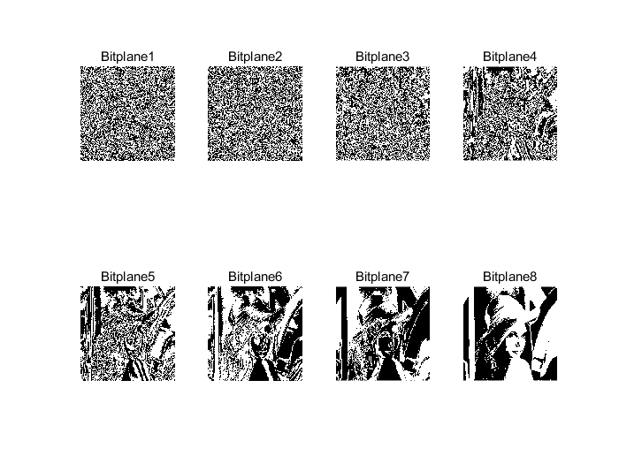

##  LSB信息隐藏算法实验内容(matlab)

1.将载体图片分成8个位平面，并显示。
2.制作水印图片，可以嵌入1个位平面的、2个位平面的、3个位平面的。
3.使用LSB信息隐藏算法，分别嵌入1bit/pixel、2bit/pixel、3bit/pixel，并显示伪装图像。
4.提取嵌入的秘密信息。

#### 将载体图片分成八个位平面，并显示。

1. 载体图片


2. 相关代码

	```matlab
	%% 第一张 风车
	imgW = imread('7.bmp');
	imgW=imresize(imgW,0.5);
	imgWsize=size(imgW);
	%提取bitplane
	bitPlaneW=zeros(imgWsize(1),imgWsize(2),8);
	for i =1:8
    for ro=1:imgWsize(1)
        for co=1:imgWsize(2)
        bitPlaneW(ro,co,i)=bitget(imgW(ro,co), i);
        end        
    end    
	end
	% 绘制bitplane
	figure;
	for i =1:8
    subplot(2,4,i)
    imshow(uint8(255*bitPlaneW(:,:,i)))
    title(['Bitplane' num2str(i)])
	end
	```

3. 八位平面展示


#### 制作水印图片，嵌入1个位平面、嵌入2个位平面、嵌入3个位平面

1. 选择Lena图片作为想要隐藏的图片



2. 相关代码段

   - 分别读入载体照片和插入照片

   ```matlab
   %% 第一张 摩天轮
   img = imread('7.bmp');
   img=imresize(img,0.5);
   imgsize=size(img);
   %提取bitplane比特平面
   bitPlane=zeros(imgsize(1),imgsize(2),8);
   for i =1:8
       for ro=1:imgsize(1)% ro: row图片行号，y
           for co=1:imgsize(2) %co: column图片,x
           bitPlane(ro,co,i)=bitget(img(ro,co), i);
           end        
       end    
   end
   % 绘制bitplane
   figure;
   for i =1:8
       subplot(2,4,i)
       imshow(uint8(255*bitPlane(:,:,i)))
       title(['Bitplane' num2str(i)])
   end
   %%  lena
   imgW = imread('9.bmp');
   imgW=imresize(imgW,0.5);
   imgWsize=size(imgW);
   [length,width,~]=size(imgW);
   %提取bitplane
   bitPlaneW=zeros(imgWsize(1),imgWsize(2),8);
   for i =1:8
       for ro=1:imgWsize(1)
           for co=1:imgWsize(2)
           bitPlaneW(ro,co,i)=bitget(imgW(ro,co), i);
           end        
       end    
   end
   % 绘制bitplane
   figure;
   for i =1:8
       subplot(2,4,i)
       imshow(uint8(255*bitPlaneW(:,:,i)))
       title(['Bitplane' num2str(i)])
   end
   ```

   - 构造新的照片
     - 嵌入1个位平面

		```matlab
   	%% 构造新的bitPlane
   	newbitPlane=bitPlane;
   	newbitPlane(:,:,1) = bitPlaneW(:,:,8);
		```
   	
   	- 嵌入2个位平面
   	
   	```matlab
   	%% 构造新的bitPlane
   	newbitPlane=bitPlane;
   	newbitPlane(:,:,2) = bitPlaneW(:,:,8);
   	newbitPlane(:,:,1) = bitPlaneW(:,:,7);
   	```
   	
   	- 嵌入3个位平面
   	
   	```matlab
   	%% 构造新的bitPlane
   	newbitPlane=bitPlane;
   	newbitPlane(:,:,3) = bitPlaneW(:,:,8);
   	newbitPlane(:,:,2) = bitPlaneW(:,:,7);
   	newbitPlane(:,:,1) = bitPlaneW(:,:,6);
   	```
   	
   - 合成新图片及提取水印
   
   ```matlab
   %% 产生新图片（含水印）
   newimg=zeros(256,256);
   for i =1:8
       newimg=newimg+newbitPlane(:,:,i)*2^(i-1);
   end
   newimg=uint8(newimg);
   figure;
   imshow(newimg),title('含水印的新图片');
   
   %% 效果展示
   %提取bitplane
   bitPlaneRec=zeros(imgsize(1),imgsize(2),8);
   for i =1:8
       for ro=1:imgsize(1)
           for co=1:imgsize(2)
           bitPlaneRec(ro,co,i)=bitget(newimg(ro,co), i);
           end        
       end    
   end
   % 绘制bitplane
   figure;
   for i =1:8
       subplot(2,4,i)
       imshow(uint8(255*bitPlaneRec(:,:,i)))
       title(['Bitplane' num2str(i)])
   end
   
   ```
   
3. 加水印的效果图

   - 嵌入1个位平面
   
   

   - 嵌入2个位平面
   
   

   - 嵌入3个位平面


#### 提取嵌入的秘密信息

1. 提取图片的信息

```matlab
%% 水印提取过程
%提取bitplane
bitPlaneRec=zeros(imgsize(1),imgsize(2),8);
for i =1:8
    for ro=1:imgsize(1)
        for co=1:imgsize(2)
        bitPlaneRec(ro,co,i)=bitget(newimg(ro,co), i);
        end        
    end    
end
% 绘制bitplane
figure;
for i =1:8
    subplot(2,4,i)
    imshow(uint8(255*bitPlaneRec(:,:,i)))
    title(['Bitplane' num2str(i)])
end

% 复原水印图
newimgW=zeros(imgsize(1),imgsize(2));
for i = 1 % 两个位平面时i=1:2  / 3个位平面时 i=1:3
    newimgW=newimgW+bitPlaneRec(:,:,i)*2^(4+i);
end

figure;imshow(uint8(newimgW)),title('提取出的图片')
```

- 从嵌入1个位平面图中提取图片


- 从嵌入2个位平面图中提取图片


- 从嵌入3个位平面图中提取图片


### 小结讨论

- 了解了LSB信息隐藏算法的原理。通过图片的权重分配，使得权重较小的位置可以藏匿我们想要的信息

- 对于低位来说：嵌入1个位平面时，受影响的值只有0~1；嵌入2个位平面时，受影响的值有0~4；嵌入3个位平面时，受影响的值也仅有0~11。这相对于常规图片的0~255来说影响不大。

- 而对于高位：嵌入1个位平面时，受影响的像素值就高达0~127；嵌入2个位平面时，受影响的像素值达到了0~190；嵌入3个位平面时，受影响的值更是涨到0~221。可以说具有举足轻重的地位。

- 那么我们将嵌入照片的高位嵌入载体照片的地位，便可以保存嵌入照片的众多信息的同时对载体照片影响微乎其微。由此可以实现信息隐藏。 
