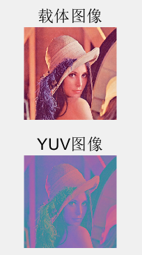
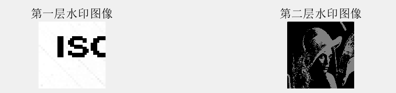
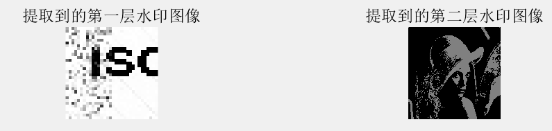

# 数字水印之彩色图像信息隐藏

### 实验目标

#### 1读取一幅彩色图像，编程实现RGB-YCbCr域的转换。

```matlab
%% RGB-YCbCr域的转换
coverRGB=imread('载体图像.bmp');
subplot(411),imshow(coverRGB),title('载体图像')
coverYUV=rgb2ycbcr(coverRGB);
y=coverYUV(:,:,1);
cb=coverYUV(:,:,2);
cr=coverYUV(:,:,3);
subplot(412),imshow(coverYUV),title('YUV图像')
```



#### 2设计水印信息。

```matlab
%% 设计水印信息
%第一层水印
watermark1=imread('隐藏图像.bmp');
%截取左上角32*32的图片作为水印
watermark1=watermark1(1:32,1:32);
origin_watermark1=watermark1;
subplot(413),imshow(watermark1),title('第一层水印图像');
watermark1=dec2bin(watermark1);
watermark1=watermark1';
watermark1=str2num(watermark1(:));%一层信息转为二进制保存
watermark2=coverRGB(:,:,3);%将B通道的最高位作为第二层水印
watermark2=bitget(watermark2,8);
subplot(414),imshow(bitshift(watermark2,7)),title('第二层水印图像');
origin_watermark2=watermark2;
watermark2=num2str(watermark2(:));%二进制的秘密信息
watermark2=reshape(watermark2,512*512/8,8);
tenwatermark=zeros(512*512/8,1);%十进制的秘密信息
for i=1:512*512/8
    tenwatermark(i)=bin2dec(watermark2(i,:));
end
fivewatermark=dec2base(tenwatermark,5);
fivewatermark=fivewatermark';
fivewatermark=str2num(fivewatermark(:));%二层信息转成五进制保存
```



#### 3将Cb域数据分割成8×8的块，一块嵌入1个bit秘密信息，将秘密信息嵌入到载体图像Cb域中。

#### 4将Cr域数据分割成8×8的块，一块嵌入1个bit秘密信息，将秘密信息嵌入到载体图像Cr域中。

```matlab
function stegoi=CbCr_em(cover,data,T)
[s,~]=size(cover);
blc=8*ones(1,s/8);
blocks=mat2cell(cover,blc,blc);%每块大小为8*8，一共是(s/8)*(s/8)块
getLSB=@(A)bitget(A,1);%匿名函数，取矩阵中每一个元素的最低位
coverLSB=cellfun(getLSB,blocks,'UniformOutput',false);%取每一块的LSB
k=1;
for i=1:s/8*s/8
    if data(k)==0
        num1=sum(sum(coverLSB{i}));%1的个数
        num0=8*8-num1;%0的个数
        j=1;
        while num0-num1<T
            if coverLSB{i}(j)~=0
                coverLSB{i}(j)=0;
                %将载体的每一块对应的像素的最低位做修改，下同
                blocks{i}(j)=bitset(blocks{i}(j),1,0);
            end
            j=j+1;
            num1=sum(sum(coverLSB{i}));%1的个数
            num0=8*8-num1;%0的个数
        end
    else
        num1=sum(sum(coverLSB{i}));%1的个数
        num0=8*8-num1;%0的个数
        j=1;
        while num1-num0<T
            if coverLSB{i}(j)~=1
                coverLSB{i}(j)=1;
                blocks{i}(j)=bitset(blocks{i}(j),1,1);
            end
            j=j+1;
            num1=sum(sum(coverLSB{i}));%1的个数
            num0=8*8-num1;%0的个数
        end
    end
    k=k+1;
end
stegoi=cell2mat(blocks);
```

```matlab
%% 嵌入第一层水印
%cb嵌入信息
T=20;%阈值
watermark1_len=numel(watermark1);
newcb=CbCr_embde(cb,watermark1(1:watermark1_len/2),T);
%cr嵌入信息
newcr=CbCr_embde(cr,watermark1(watermark1_len/2+1:end),T);
```

#### 5编程实现YCbCr-RGB域的转换，还原彩色图像，得到嵌入第一重秘密信息的载体图像。

```matlab
%% YCbCr-RGB域的转换
stegoi1(:,:,1)=y;
stegoi1(:,:,2)=newcb;
stegoi1(:,:,3)=newcr;
stegoi1=ycbcr2rgb(stegoi1);
subplot(425),imshow(stegoi1),title('嵌入第一层水印后的载密图像')
```


#### 6使用EMD算法在嵌入第一重秘密信息的载体图像RGB域嵌入第二重秘密信息。

```matlab
function stegoi=EMD_em(cover,data,mag)
%% 嵌入秘密数据
len=numel(data);%秘密信息长度
num=numel(cover);%载体像素个数
stegoi=cover;
k=1;
for i=1:2:num
    if k>=len
        break;
    end
    row=stegoi(i);
    col=stegoi(i+1);
    if mag(row+1,col)==data(k)
        stegoi(i)=row+1;
    elseif mag(row-1,col)==data(k)
        stegoi(i)=row-1;
    elseif mag(row,col+1)==data(k)
        stegoi(i+1)=col+1;
    elseif mag(row,col-1)==data(k)
        stegoi(i+1)=col-1;
    end
    k=k+1;
end
```

```matlab
%% EMD算法在RGB域嵌入第二层水印
B=stegoi1(:,:,3);
n=256;
m5=zeros(5,5);
for i=1:5
	m5(1,i)=i-1;
	m5(2,i)=mod(i+2,5);
	m5(3,i)=mod(i+5,5);
	m5(4,i)=mod(i+3,5);
	m5(5,i)=mod(i+1,5);
end
r=ceil(n/5);
c=ceil(n/5);
mag=repmat(m5,r,c);
mag=mag(1:n,1:n);
stegoi2(:,:,1)=stegoi1(:,:,1);
stegoi2(:,:,2)=stegoi1(:,:,2);
stegoi2(:,:,3)=EMD_em(B,fivewatermark,mag);
subplot(426),imshow(stegoi2),title('嵌入第二层水印后的图像');
```


#### 7提取秘密信息。

```matlab
function exdata=EMD_de(stegoi,len,mag)
%% 提取秘密数据
exdata=zeros(len,1);
num=numel(stegoi);
k=1;
for i=1:2:num
    if k>=len
        break;
    end
    row=stegoi(i);
    col=stegoi(i+1);
    exdata(k)=mag(row,col);
    k=k+1;
end
```

```matlab
function exdata=CbCr_de(stegoi)
[s,~]=size(stegoi);
blc=8*ones(1,s/8);
blocks=mat2cell(stegoi,blc,blc);%每块大小为8*8，一共是(s/8)*(s/8)块
getLSB=@(A)bitget(A,1);%匿名函数，取矩阵中每一个元素的最低位
stegoiLSB=cellfun(getLSB,blocks,'UniformOutput',false);%取每一块的LSB
exdata=zeros(s/8*s/8,1);
for i=1:s/8*s/8
    num1=sum(sum(stegoiLSB{i}));%1的个数
    num0=8*8-num1;%0的个数
    if num0>=num1
        exdata(i)=0;
    else
        exdata(i)=1;
    end
end
```

```matlab
%% 提取第二层水印
len2=numel(base5_water2);
exdata2=EMD_de(stegoi2(:,:,3),len2,mag);%提取到的是五进制数
exdata2=reshape(exdata2,4,512*512/lon);
dec_exdata2=zeros(1,512*512/lon);
%将五进制的秘密信息转成十进制
for i=1:512*512/lon
    dec_exdata2(i)=exdata2(1,i)*5^3+exdata2(2,i)*5^2+exdata2(3,i)*5+exdata2(4,i);
end
%将十进制的秘密信息转成二进制
bin_exdata2=dec2bin(dec_exdata2,lon);
bin_exdata2=str2num(bin_exdata2(:));
bin_exdata2=uint8(reshape(bin_exdata2',512,512));
subplot(428),imshow(bitshift(bin_exdata2,7));
title('提取到的第二层水印图像');

%% 提取第一层水印
stegoYUV=rgb2ycbcr(stegoi2);
stegoCb=stegoYUV(:,:,2);
stegoCr=stegoYUV(:,:,3);
exdata1_1=CbCr_de(stegoCb);%从Cb提取到的秘密信息
exdata1_2=CbCr_de(stegoCr);%从Cr提取到的秘密信息
exdata1=[exdata1_1;exdata1_2];%两者组合在一起
exdata1=num2str(exdata1);
exdata1=reshape(exdata1,lon,water1_len/lon);
exdata1=exdata1';
dec_exdata1=zeros(1,water1_len/lon);
%将二进制的秘密信息转成十进制
for i=1:water1_len/lon
    dec_exdata1(i)=bin2dec(exdata1(i,:));
end
dec_exdata1=reshape(dec_exdata1,32,32);
subplot(427),imshow(uint8(dec_exdata1));
title('提取到的第一层水印图像');
```



