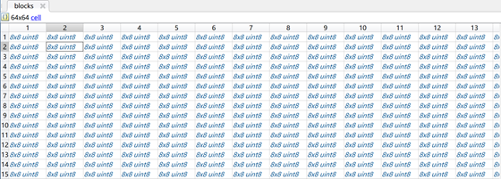
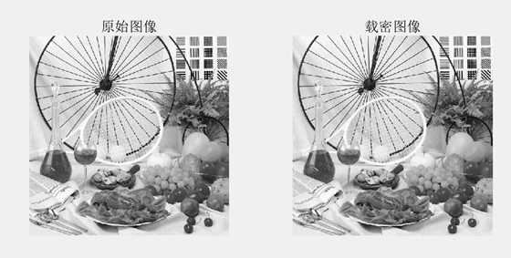
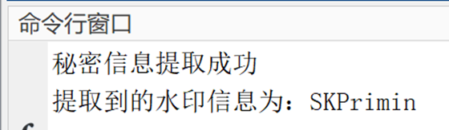

# 实验六 JPEG图像的信息隐藏

## 实验目的

1.  MATLAB中读取原始图像，分成8×8的块。

2.  8×8的块进行JPEG数据压缩。

3.  设计水印信息。

4.  LSB算法嵌入水印信息，得到嵌入水印的JPEG压缩数据。

5.  嵌入水印的JPEG压缩数据解压缩，转换成BMP格式伪装图像，并显示。

6.  提取秘密信息。

### 1MATLAB中读取原始图像，分成8×8的块。

```matlab
%% 读取原始图像，分成8×8的块
img_original = imread("7.bmp");
subplot(121),imshow(img_original),title('原始图像');
[rc,~] = size(img_original);
bottom_plate = ones(1, 64)*8;
blocks = mat2cell(img_original,bottom_plate,bottom_plate);%分成8×8的块
```



### 2.8×8的块进行JPEG数据压缩。

#### JPEG压缩过程

-   将原始图像分割为8×8的小块

-   每小块作二维DCT变换

    -   左上角为直流，zigzag扫描，对应频率从低到高

-   对DCT系数进行量化

    -   对不同频率成分采用不同的量化步长

    -   量化后的DCT系数是整数

&nbsp;

```matlab
%% 标准量化表
Q =[16,11,10,16,24,40,51,61;
    12,12,14,19,26,58,60,55;
    14,13,16,24,40,57,69,56;
    14,17,22,29,51,87,80,62;
    18,22,37,56,68,109,103,77;
    24,35,55,64,81,104,113,92;
    49,64,78,87,103,121,120,101;
    72,92,95,98,112,100,103,99];
%% 8×8的块进行JPEG数据压缩
for i=1:64
    for j=1:64
        submatrix = cell2mat(C(i,j));    %子矩阵
        submatrix = dct2(submatrix); %dct变化
        quantify = ones(7);       
        qt_fmsg=round(submatrix./W);
        quant_stegoi{i,j}=  qt_fmsg;
    end
end
```

#### Jsteg密写

-   将秘密信息嵌入在量化后的DCT系数的LSB上。但原始值为－1，0，＋1的DCT系数除外。

-   提取秘密信息时：将图像中不等于－1，0，＋1的量化DCT系数的LSB取出即可

### 3设计水印信息

```matlab
%% 设计水印信息
watermark_information = 'SKPrimin';
data = abs(watermark_information);
data = dec2bin(data);
data = data';
data = str2num(data(:));
data_length = numel(data);
```

### 4LSB算法嵌入水印信息，得到嵌入水印的JPEG压缩数据。

```matlab
%% LSB算法嵌入水印信息，得到嵌入水印的JPEG压缩数据。
k = 1;
qtstg_length = numel(quant_stegoi);
for i = 1:qtstg_length
    if k>data_length
        break;
    end
    if abs(quant_stegoi(i))>1 && quant_stegoi(i)~= -2
        quant_stegoi(i) = bitset(quant_stegoi(i),1,data(k));
        k = k+1;
    end
end
```

### 5嵌入水印的JPEG压缩数据解压缩，转换成BMP格式伪装图像，并显示。

```matlab
%% 嵌入水印的JPEG压缩数据解压缩后显示
stegoi_blocks = mat2cell(quant_stegoi,bottom_plate,bottom_plate);%分成8×8的块
inverseqt_stegoi = cell(64,64);          
for i=1:64
    for j=1:64
        secret_submatrix = cell2mat(quant_stegoi(i,j));    
        secreat = blocks(i,j);                        
        secret_submatrix(1,1)=bitset(secret_submatrix(1,1),1,secreat);
        inverseqt_stegoi{i,j}=secret_submatrix;
    end
end
 
%%反量化
Inverse_QC = cell(64,64);            
for i=1:64
    Inverse_submatrix = cell2mat(inverseqt_stegoi(i,j));    %反量化子矩阵
    Inverse_QS = zeros(7);  
    Inverse_QS=Inverse_submatrix.*W;
    temp = idct2(Inverse_QS);     %逆dct变化
    Inverse_QC{i,j}=  round(temp);
end
qt_inversemsg = cellfun(Inverse_QC,stegoi_blocks,'UniformOutput',false);
inverseqt_stegoi = uint8(cell2mat(qt_inversemsg));
subplot(122),imshow(inverseqt_stegoi),title('载密图像');
```

### 6取秘密信息。

```matlab
%% 提取秘密信息
inverseqt_stegoi = double(inverseqt_stegoi);
newblocks = mat2cell(inverseqt_stegoi,bottom_plate,bottom_plate);%分成8×8的块
qt_lmsg = cellfun(quantify,newblocks,'UniformOutput',false);
qt_mat = int8(cell2mat(qt_lmsg));%量化后的矩阵
outdata = zeros(data_length,1);
qtmat_length = numel(qt_mat);
k = 1;
%%反量化
for i = 1:qtmat_length
    if k>data_length
        break;
    end
    if abs(qt_mat(i))>1 && qt_mat(i)~= -2
        outdata(k) = bitget(qt_mat(i),1);
        k = k+1;
    end
end
if data =  = outdata
    disp('秘密信息提取成功');
    datafirst = num2str(outdata);
    datasecond = reshape(datafirst,7,data_length/7);
    tempthird = datasecond';
    tempfourth = zeros(1,data_length/7);
    for i = 1:data_length/7
        tempfourth(i) = bin2dec(tempthird(i,:));
    end
    demsg = char(tempfourth);
    fprintf('水印信息：%s\n',demsg)
else
    disp('未提取到');
end
```




