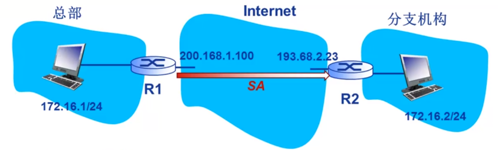

# 2022 夏季网络安全期末

## 论述题

一、A、B想要交换密钥，其使用相同的公钥算法，公私钥对为（$pk_A,sk_A$），（$pk_B,sk_B$）。

1. 双钥密码体制分配？
2. 上面的分配中，中间人攻击如何实现
3. 怎样对抗中间人攻击

二、 根据防火墙相关知识，回答下列问题

1. NAT设计内网中多主机同时与外网同一服务器通信的过程（只一为例说明）
2. 根据下表设计安全控制策略（外部网络接口为1，内部网络接口为2），要求：1）拒绝FTP内部网络数据报输出；2）拒绝外部网络HTTP数据报

| 规则 | 接口 | 协议 | 源地址 | 目的地址 | 源端口 | 目的端口 | 动作 |
| ---- | ---- | ---- | ------ | -------- | ------ | -------- | ---- |
| 1    |      |      |        |          |        |          |      |
| 2    |      |      |        |          |        |          |      |
| 3    |      |      |        |          |        |          |      |
| ……   |      |      |        |          |        |          |      |

三、如图是数字证书层次结构图，其中U，X为根CA，V、W是U的二层CA，Y、Z是X的二层CA。ABCDF为用户。

1. 设计一个可以验证身份和消息完成性的方案。
2. 试说明用户A和F之间如何利用数字证书进行双向身份验证。

## 计算题

一、$y^2 = x^3 + x +1$是系数在GF(23)上的椭圆曲线，$P(3, 10)$，$Q(9, 7)$是其上两点，求$P+Q$和$2P$。

二、ElGamal 签名体质，大素数 $p=17$，群 $Z_p^*$ 的生成元 $g=2$，以及私钥 $x=2$，若待发送消息m的哈希值 $H(m)=19$，且随机值 $k=3$ ，试验证消息m，试写出完整的签名和验证过程。

## 综合分析题

一、试根据 IPsec协议进行端到端的安全通信。

1. 假设总部网络有5个销售人员和2个分支网络，计算共需要多少条安全关联？
2. IPsea协议能否抵抗重放攻击？如果可以，请给出原因。
3. 如图，采用隧道模式ESP协议，试分析IP数据包在$R_1$ 和 $R_2$ 的处理过程。

