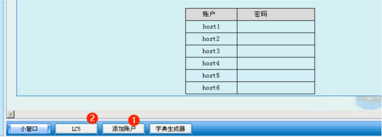
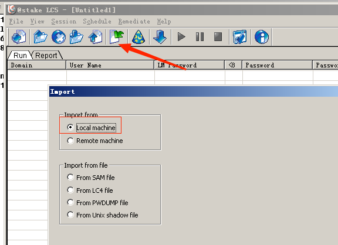
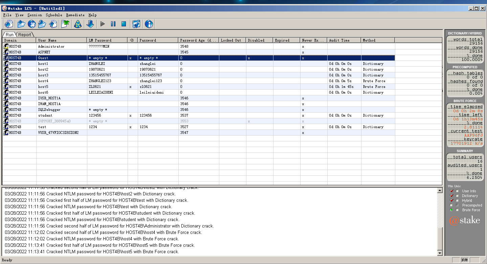
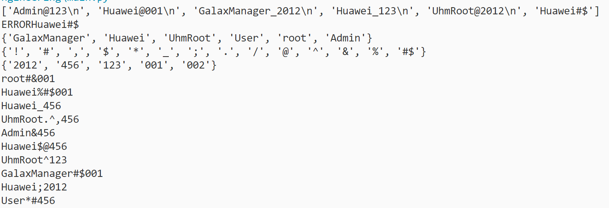
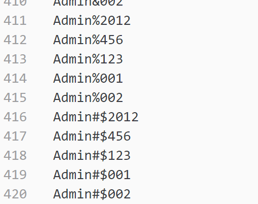

# 网络安全 社会工程学 敏感信息搜集 密码心理学攻击

1. 理解社会工程学的概念
2. 掌握获取敏感信息的方法
3. 提高自我信息保护的意识和方法
4. 理解密码心理学的概念
5. 理解密码特征分析
6. 掌握黑客猜解密码的切入方法
7. 掌握如何提高密码强壮性

# 敏感信息搜集

「注」由于对实验环境的限制，本实验不能进行实验步骤上的设计，故举出一个通过在互联网上使用信息搜集的方法来获取某人敏感信息的过程。希望通过此演示过程可以给学生一个信息搜集的思路，学生可以在课余时间进行有针对性的信息搜集的练习。
开始进行信息搜集，学生需在过程中完成表格的填写，具体过程如下：
（1）查看并分析目标个人资料，参见下图：


 可以获取有可利用价值的信息包括：

|可能具有利用价值的 |信息   |
| ------------ | ------------ |
|  性别 | 男 |
|  生日 | 6-21 |
| 血型  | B型 |
|  生肖 | 兔 |
|  星座 | 双子座 |
| 省份  | 山东 |
| 城市  | 泰安 |


 （2）访问其QQ空间，除照片外，并未发现有价值信息，参见下图： 


（3）查看其留言板现实中朋友，参见下图：


| 可能具有利用价值的信息 | 可能具有利用价值的信息 |
| ---------------------- | ---------------------- |
| 真实朋友               | 王建                   |

（4）访问王建的qq空间，发现王建的头像照片，参见下图：


 （5）使用校内网的高级搜索，配合推测的“王建”个人信息，搜索此人，参见下图：


（6）在所有搜索结果中，配合4中已确定的王建的相貌，排除其他同名者，最终确定王建校内网账号，参见下图：


（7）通过校内网中王建的好友信息，配合目标qq空间中的照片，确定其真实姓名及资料，参见下图：


| 可能具有利用价值的信息 | 可能具有利用价值的信息 |
| ---------------------- | ---------------------- |
| 目标姓名               | 张磊                   |
| 目标学校               | 鲁东大学               |

   （8）通过已获得目标的真实姓名和所在学校，通过google搜索查询，可得到如下结果：


  （9）进入网页，分析详细信息，获得目标的中学信息及毕业年份，参见下图：


（10）我们继续使用google，使用其姓名、大学、中学信息进行信息搜集，甚至发现了此人更多的敏感信息，参见下图：


 （11）请将搜集到目标的个人信息填入下表：
|可能具有利用价值的信息|可能具有利用价值的信息|
|:-:|:-:|
|姓名|张磊|
|性别|男|
|手机号码|13515455767|
|邮箱|leileiaideni@126.com|
|生日|6月21日|
|血型|B型|
|生肖|兔|
|星座|双子座|
|省份|山东|
|城市|泰安|
|大学名称|鲁东大学|
|大学入学年份|2006年|
|大学院系|交通学院|
|大学班级|机械本0603班|
|中学名称|山东省泰安一中|
|中学班级|03级8班|
|中学毕业年份|2006年|

#### 思考问题

举出保护个人敏感信息的方法（最少三点）。

- 国家建立健全相关法规，完善个人敏感信息保护制度，严惩侵犯个人敏感信息的行为。
- 企业做好相关数据管理工作，设置权限，保护用户的个人敏感信息。对于密码等关键信息可使用MD5等手段预处理，只做比对，不保存原内容。
- 个人可以在不同平台使用不同的密码、网名，使别人难以通过人肉搜索追踪。

#  密码心理学攻击

## 实验原理

### 密码特征分析

​    我们常用的一些密码特征分析如下：

1. **姓名特征**
   ​    非常不赞成使用，无论是拼音全拼简拼还是英文名，都具有十分高的被猜中概率，非常不安全。

2. **数字特征**
   ​    这些特征包括生日、电话、员工号码、门牌号码等。纯粹的数字密码假设有N位，那么每位的独立被猜中概率为1/10，密码整体完全被随机猜中的概率为1/(10N)；而我们如果采用了字母和数字混合的方式构造N位密码，则它的完全被随机猜中的概率降为1/(62N)，当N>4时，两者的概率相差将非常大。
3. **长度特征**
   ​    长度是另外一个关键特征，过短的密码会很容易被暴力破解（穷举）。0位的密码会使大部分人成为入侵者，也会让一些人自豪的自称为“黑客”，并在别人桌面上留下一份“黑客声明”。一般来讲，应用于关键计算机系统的8位以下的密码都是不推荐的。当然过长的密码可能不便记忆也不便输入，一般很少见到有人使用一个包含256个字符的密码。
4. **密码关联概率**
   ​    所谓密码关联概率，是指同一个系统管理员在不同应用场所所使用的密码之间相同或者具备某确定规律的概率。不幸的是，大部分人都使用了高度关联的密码。举例来说，一个用户用“Hu73WQ0Oue31Nmvb4”作为自己计算机管理员密码（很高兴的看到，这个用户已经采用了非常安全的密码），但是不幸的是他的疏忽造成了此密码被泄漏，更加不幸的是他在网上银行、网上私人空间等均采用了相同密码——后果是可想而知的。另外一个例子是某企业网络中有100台计算机，计算机1号的管理员密码是“admin001”，2号计算机的密码则是“admin002”。依据这两条信息，弱智也能猜到3号计算机的密码是“admin003”——遗憾的是，许许多多管理员的智力，并不比弱智好多少，原因居然是：他们认为自己太聪明了！
5. **用户名特征**
   ​    用户名与密码配对使用，然而这里也有大量玄机。此特征中被猜中概率最高的行为，就是采用了与用户名一样的密码。那么用户帐号“admin”使用“adminpassword”做密码安全吗？我告诉你，它的安全性仅仅比采用“password”做密码好一点点。此外，本文开头所描述的案例中还暴露了一个问题，那就是计算机中应该只允许必须要用的帐户存在，大部分人并不需要使用系统默认的“Administrator”或者“guest”登录，那么就应该删除此帐号。
6. **有效期特征**
   ​    许多人懒于定期修改密码，这样，一个儿时的玩伴可能在你80岁的时候窃取你银行中的所有养老金，而你却不知道何人所为。有效期特征是所有特征中非常有趣的一个，它拥有一个时间参数——随着当前密码应用时间的增加，此特征被猜中的概率也在增加。增加的原因可能来自于越来越多的个人信息、习惯被黑客所掌握；也可能是有一台超级计算机正在用穷举法破解你的密码，并预计在一个月后得到结果；也可能是一个黑客早已得到你的密码，可是为了不至于很快被警察捉到，于是等到1年之后才动手；如果你怀疑自己的帐号可能被他人登录过却并没有损失，不要迟疑，立即修改密码——黑客可能嫌你帐户中的金额还不够多，等着你将家里那100万元存入呢！
7. **大众密码**
   ​    “aaa”、“123456”、“abcd”是不是密码呢？是的，而且还被许多人应用着。这些密码同样也被黑客放在黑客词典的首页上。这样的密码除了好记一些，毫无安全性可言。
   ​    密码特征还有许多，这里列出的，都是容易遭受黑客尝试的一些。要获得比较安全的密码，那么就应该尽量选择那些不容易被想到的密码特征来组合自己的密码并启用密码策略。在WindowsXP系统中，密码策略在控制面板中的“性能和维护－管理工具－本地安全策略－帐户策略－密码策略”中。密码策略对我们上面提到的一些特征进行了强制处理。

### 猜解密码的切入方法

​    黑客猜解密码的基本思路：一般猜解、利用搜索引擎猜解和配合社会工程学猜解。猜解时主要考虑下面的心理原则：

1. **中文拼音**
       对中国人来说，一般都没有用英文名的习惯，所以很多人用中文拼音做密码；如果去论坛之类的地方，对方会要求注册一个用户名，由于简称很容易被注册，所以一般用全称。如果是密码，一般要倒过来考虑，先从简称再全称，理由是短，输入时间快，而且好记忆。
2. **简单数字**
       数字也是用得很多的，123，123456(因为一般我们的习惯是六位数字，包括银行的存折都是六位，论坛最低要求也是六位)，试一下qq的密码，其实不少人是这样的，特别是新手。下面一些也是常用的：1，11，111，123，168，1314，520(特殊意义的数字)……。
3. **生日**
       生日用得特别多，有人把存折和身份证放一起丢了，盗贼用他的生日拿到了钱。这是由于人们怕忘记密码，会造成不必要的麻烦，故使用自己永远都不会忘记的生日做密码。上面说到的六位，所以刚刚好可以这样设置790102，似乎很省事，可是一旦泄露麻烦就大了。一般人都有这样的习惯：六位就是790102，四位是7912。如果那个月和日是只有一位的，也就是1～9，一般人就是用四位的，如：7632，而不是760302，如果日期是双位的，10～31，一般人也就是用到六位而不会是五位，如：760321而不是76321。如果月是双位，一般日就是双位的，如：761203，而一般不是76123。总体来说也就是月和日都是同样位数的。因为这样比较美观。也有人不用日，只用到月，如：763，但对中国人来说7603用得少，因为0看起来是多余的。
4. **形式单一**
       一个做暴力破解机软件的人，只要他思考过，而且技术上能达到的话，破解应该按照这个顺序来：数字→字母→特殊符号。对方用户名一般不用大写字母，都是小写的多。例如用cyh比CYH多，而且用caiyihao比用CAIYIHAO多。密码就要考虑大小写，理论上也应该按照先小写再大写来。因为用户输入大写字不是按shift键而是按caps lock键，所以理论上来说，要使用大写则所有字母都会是大写。
5. **信息暴露**
       一个黑客会从细微入手分析用户的信息。从电子邮箱入手的话可以知道一些什么呢?例如：caiyihao790101@163.com，可以看出来对方是使用姓名的全拼和生日做用户名。也可通过昵称来获得用户信息。例如：QQ昵称为“浩”，很明显名里有“浩”字。

一.实验概述
    本实验设置了host1、host2、host3、host4、host5、host6六个主机用户，此六个用户的用户密码是根据实验1|练习一所搜集到的用户敏感信息设置的，具体内容可参见表1。

表1  敏感信息
|可能具有利用价值的信息| 可能具有利用价值的信息 |
|:-:|:-:|
|姓名|张磊|
|性别|男|
|手机号码|13515455767|
|邮箱|leileiaideni@126.com|
|生日|6月21|
|血型|B|
|生肖|兔|
|星座|双子座|
|省份|山东|
|城市|泰安|
|大学名称|鲁东大学|
|大学入学年份|2006|
|大学院系|机械学院|
|大学班级|0603班|
|中学名称|山东泰安第一中学|
|中学班级|03级8班|
|中学毕业年份|2006年|

根据其上大学时间，

根据表1中给出的相应信息，参考实验原理“黑客猜解密码的切入方法”，对新建的六个账户密码进行猜解。

## 实验流程

1. 点击工具栏“添加账户”按钮，生成欲猜解的账户。
       「注」 猜解的账户密码均不大于12位。

2. 在C:\创建superdic.txt。

3. 分析表1，将所猜到的可能的用户密码保存到C:\superdic.txt中，此文件将作为密码字典。根据时间推算其生日为$2006（中学毕业年份）-6（中学）-6（小学）-6（我国6岁上学）=1988$，其6月21生日早于9月1日，符合6岁上学要求，在1988基础上加减上一两年的误差。

```bash
13515455767
leileiaideni
2006
0308
zl
zhanglei
0621
1986
1987
1988
1989
19870621
sd
ta
```

4. 使用LC5工具猜解用户密码，具体操作如下：
   
   - 点击工具栏“LC5”按钮打开“LC5”实验工具。
   
   
   
   - 选择“`session`”菜单中的“`session options`”项，打开“`Auditing Options For This Session`”对话框，在“`Dictionary Crack`”栏中点击“`Dictionary List`”按钮，在对话框中点击“`Add`”按钮，文件类型设置为所有文件，将创建的`superdic.txt`添加到字典列表中，点击“OK”按钮完成添加，在“`Auditing Options For This Session`”对话框中继续点击“OK”按钮完成设置。
   
   
   
   - 返回LC5主界面，选择“`Session`”｜“`Import…`”（导入）菜单项，在弹出的“`Import`”对话框中选择“`local machine`”。
   
   
   
   - 选择“`Session`”菜单项，点击“`Begin Audit`”（开始审计）开始破解用户口令。
   
   
   
   - 将成功破解到的结果填入表2中：

|账户| 密码|
|:-:|:-:|
| host1 | ZHANGLEI     |
| host2 | 19870621     |
| host3 | 13515455767  |
| host4 | ZHANGLEI123  |
| host5 | ZL0621       |
| host6 |LEILEIAIDENI|

#### 思考 

如何提高你的密码强壮性，以避免黑客利用密码心理学猜解你的密码？

- 避免简单密码，减少使用姓名拼音，生日、车牌号等简单字符。
- 关键平台使用区别于其他地方的密码，保证不会因为一个地方疏忽导致满盘皆输。
- 定期修改密码。

# 密码字典生成器

制作一个简单的社会工程学密码字典生成器，包含字母、符号和数字，如下面的弱密码: .

```markdown
Admin@123
Huawei@001
GalaxManager_2012
Huawei_123
UhmRoot@2012
Huawei#$
```

可以将上述密码构成分为3项:信息项、符号项、弱字符串项。

其中，

- **信息项**为:和目标有关的信息，如: Admin、Huawei 等;
- **符号项**为:密码组合中会用到的符号，如:空格、@、\_、!、#、S 等;
- **弱字符项**为:密码组合中常用到的“弱口令”字符串，如: 123、 001、abc、 2012 等，区分大小写。

请基于给出的弱密码，生成包括信息项、符号项、弱字符串项(各项可以不超过3位)组合的字典，要求描述采用的方法，给出所生成的字典以及源码。

```python
import re
import random

# 预加载常见弱密码项，使用集合自动去重
informationItem = set(["User", "root"])
characterItem = set(["!", "@", "#", "$", "%", "^",
                    "&", "*",  "_", ";", ".", ",", "/"])
weakItem = set(["123", "002", "456"])

with open("pass.txt") as f:
    passText = f.readlines()

print(passText)

for item in passText:

    data = item.replace("\n", "")
    try:
        # 信息项
        informationItem.add(re.findall(r"(^[A-Za-z0-9]+)", data)[0])
    except:
        print("ERROR"+data)
    try:
        # 符号项
        characterItem.add(re.findall(r"([\W_]+)", data)[0])
    except:
        print("ERROR"+data)
    try:
        # 弱字符项
        weakItem.add(re.findall(r"([A-Za-z0-9]+$)", data)[0])
    except:
        print("ERROR"+data)

print(informationItem)
print(characterItem)
print(weakItem)


def allPass():
    allPasswd = set()
    with open("passwdDict.txt", "w", encoding="utf-8") as fw:
        for i in informationItem:
            for c in characterItem:
                for w in weakItem:
                    fw.write(i+c+w+"\n")
    #                 allPasswd.add(i+c+w)
    # return allPasswd


def getInformation(v: list):
    item = random.choice(v)
    return item


def getCharacter(v: list):
    num = random.randint(1, 3)
    item = []
    for _ in range(num):
        chara = random.choice(v)
        item.append(chara)
        if len(chara) > 1:
            break
    return("".join(item))


def getWeak(v: list):
    item = random.choice(v)
    return item


def getPasswd():
    ifmt = getInformation(list(informationItem))
    chat = getCharacter(list(characterItem))
    weak = getWeak(list(weakItem))
    passwd = ifmt+chat+weak
    if len(passwd) < 6:
        getPasswd()
    else:
        return passwd


if __name__ == '__main__':
    # 生成所有密码
    allPass()

    # 随机生成弱密码
    for _ in range(10):
        print(getPasswd())

```

运行结果如下：



可见，读入程序运行正常读入了所以常见信息，准确完成了拆分同时异常成功处理，随机生成的密码也符合标准。



密码字典列出了所有的可能性。

