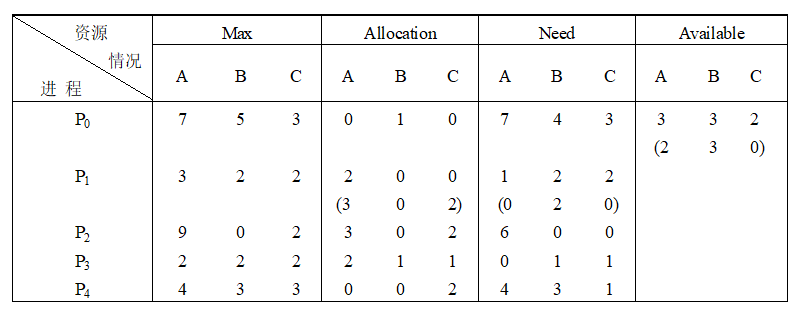
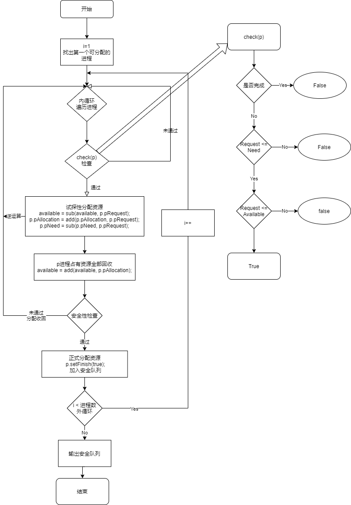
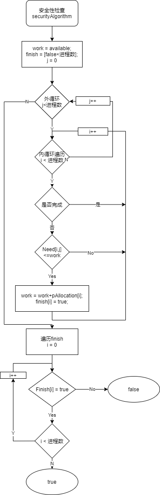
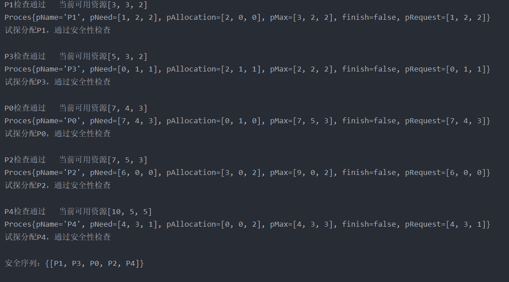

# 死锁的避免

### 实验内容

模拟进程的资源分配算法，了解死锁的产生和避免的办法。

### 实验目的

了解系统的资源分配情况，保证进程的资源请求和系统不会出现死锁。

### 实验题目

用银行家算法实现资源分配。



## 流程图

#### 银行家算法核心流程图



#### 安全性检查流程图



## 数据结构及符号说明

#### Proces进程类

构造器设置为(String pName, int[] pMax, int[] pAllocation, int[] pNeed)。创建进程时必须有（进程名，最大资源需求向量，已分配资源向量，需要的资源向量）。

设置私有变量finish，表示完成状态，并附带你setter，getter方法实现状态查询与修改。

请求向量pRequest，默认为需求向量。

#### BlankerAlgorithm算法类

提供了向量加法add，向量减法sub，以及向量非负判断 nonNegative三个静态方法，无需创建实例即可使用。

check方法用于检测请求是否合法（不超过需求）以及是否能被满足（不超过可用资源）。传入进程p即可判断

securityAlgorithm方法即安全性检测。检测满足这个请求后资源是否还存在安全序列。需要传入进程队列以及当前可用资源

## 算法实现

#### 进程类的定义

```java
package com.process.banker;

import java.util.Arrays;

/**
 * @author: SKPrimin 
 * @date: 2021/11/25  20:14
 * @ClassName: Proces
 * @Description: TODO 用于银行家算法中的进程定义
 */
public class Proces {

    String pName;
    int[] pMax;
    int[] pAllocation;
    int[] pNeed;
    private boolean finish;
    int[] pRequest;

    public Proces(String pName, int[] pMax, int[] pAllocation, int[] pNeed) {
        // 由于本次数据输入较多，容易出错，使用异常处理保证不会前功尽弃
        if (pMax.length != pAllocation.length && pMax.length != pNeed.length) {
            throw new IllegalArgumentException("输入数据有误，三个数组必须长度一致");
        }
        if (!Arrays.equals(pNeed, BlankerAlgorithm.sub(pMax, pAllocation))) {
            throw new IllegalArgumentException("输入数据有误，" + pName + "未满足Need" + Arrays.toString(pNeed) +
                    " = (Max - Allocation)" + Arrays.toString(BlankerAlgorithm.sub(pMax, pAllocation)));
        }
        this.pName = pName;
        this.pMax = pMax;
        this.pAllocation = pAllocation;
        this.pNeed = pNeed;
        this.pRequest = pNeed;
        this.finish = false;
    }

    public boolean isFinish() {
        return finish;
    }

    public void setFinish(boolean finish) {
        this.finish = finish;
    }


    @Override
    public String toString() {
        return "Proces{" +
                "pName='" + pName + '\'' +
                ", pNeed=" + Arrays.toString(pNeed) +
                ", pAllocation=" + Arrays.toString(pAllocation) +
                ", pMax=" + Arrays.toString(pMax) +
                ", finish=" + finish +
                ", pRequest=" + Arrays.toString(pRequest) +
                '}';
    }
}

```

#### 调度算法

```java
package com.process.banker;

import java.util.ArrayList;
import java.util.Arrays;

/**
 * @author: SKPrimin 
 * @date: 2021/11/25  19:13
 * @ClassName: BlankerAlgorithm
 * @Description: TODO 银行家算法，避免死锁 调度算法及其所使用的数组加减法，进程状态检测，试探调度后的安全性检测
 */
public class BlankerAlgorithm {

    // 可用资源向量，
    int[] available;
    //创建一个银行家算法时必须有可用资源，禁止创建空实例
    public BlankerAlgorithm(int[] available) {
        this.available = available;
    }

    public void dispath(Proces[] pArr) {
        // 先判断可用资源向量与进程的各向量长度是否一致
        if (available.length != pArr[0].pAllocation.length) {
            throw new IllegalArgumentException("进程资源种类不适配");
        }

        ArrayList<String> securitySequence = new ArrayList<String>();

        for (int i = 0; i < pArr.length; i++) {
            // 遍历整个队列
            for (Proces p : pArr) {
                // 先进行检查，通过后会试探性的分配资源
                if (check(p)) {
                    // 打印当前进程调度信息
                    System.out.print(p.pName+ "检查通过" );
                    System.out.println("\t当前可用资源"+Arrays.toString(available));
                    System.out.println(p);

                    /*系统将资源调度给这个进程 从available分配给其 请求的资源
                    * 当前已分配的资源等于原分配的加上刚刚申请的
                    * 所需要的的资源减去已经申请到的
                    * */
                    available = sub(available, p.pRequest);
                    p.pAllocation = add(p.pAllocation, p.pRequest);
                    p.pNeed = sub(p.pNeed, p.pRequest);
                    // 该进程试探性调度完成，释放占有的所有资源
                    available = add(available, p.pAllocation);

                    // 如果通过安全性检查将正式分配资源，并将此进程设为完成态，添加到安全性队列中
                    if (securityAlgorithm(pArr, available)) {
                        System.out.println("试探分配"+p.pName+"，通过安全性检查\n");
                        p.setFinish(true);
                        securitySequence.add(p.pName);
                    } else {
                        // 未通过安全性检查则试探分配作废，原样回退数据，进行下一个进程试调度
                        System.out.println("试探分配"+p.pName+"，未通过安全性检查\n");
                        available = add(available, p.pRequest);
                        p.pAllocation = sub(p.pAllocation, p.pRequest);
                        p.pNeed = add(p.pNeed, p.pRequest);
                    }
                }
            }
        }
        System.out.println("安全序列：{"+securitySequence+"}");
    }

    // 检查判断，检查p发出请求资源后Request <= Need 和 Request <= Available
    public boolean check(Proces p) {
        // 本进程未完成再继续检查
        if (!p.isFinish()) {
            // 如果 Request <= Need便继续检查，否则认为出错
            if (nonNegative(sub(p.pNeed, p.pRequest))) {
                // 如果Request <= Available ，即调度可行性检查通过，返回 true
                return nonNegative(sub(available, p.pRequest));
            }
            return false;
        }
        return false;
    }

    // 安全性算法
    public boolean securityAlgorithm(Proces[] pArr, int[] available) {
        // 首先设置两个向量：工作向量work、Finish
        // 工作向量work,表示系统可以提供给进程继续运行所需的各类资源数目，执行安全性算法开始时，work=available
        int[] work = available;
        /* Finish,表示系统是否有足够的资源分配给进程，使之运行完成，开始时Finish[i]=false;
         * 布尔数组默认初始化恰好是false.当有足够资源分配给进程时，再令Finish[i] = true*/
        boolean[] finish = new boolean[pArr.length];

        //对所有进程进行一轮进行安全性检查，确保即使在最差的情况下也能遍历完全
        for (int j = 0; j < pArr.length; j++) {
            //在未试探的进程中先找到一个Need[i,j]<=work的进程，找到则进行分配，未找到做外出判断
            for (int i = 0; i < pArr.length; i++) {
                if (!finish[i] && nonNegative(sub(work, pArr[i].pNeed))) {
                    // 将释放的资源加入进work；本进行检查完成设为ture；退出本轮次循环，寻找下一个
                    work = add(work, pArr[i].pAllocation);
                    finish[i] = true;
                }
            }
        }
        // 如果有一个false,即不存在安全序列，返回false,全部通过检测才会返回true
        for (boolean i : finish) {
            if (!i) {
                return false;
            }
        }
        return true;
    }

    // 提供静态方法数组加法
    public static int[] sub(int[] a, int[] b) {
        int num = a.length;
        int[] c = new int[num];
        for (int i = 0; i < num; i++) {
            c[i] = a[i] - b[i];
        }
        return c;
    }

    // 加法静态方法数组减法
    public static int[] add(int[] a, int[] b) {
        int num = a.length;
        int[] c = new int[num];
        for (int i = 0; i < num; i++) {
            c[i] = a[i] + b[i];
        }
        return c;
    }

    // 检测本向量是否非负，即用于检测两个矩阵相减结果是否符合，避免非法
    public static boolean nonNegative(int[] array) {
        for (int i : array) {
            if (i < 0) {
                return false;
            }
        }
        return true;
    }
}
```

#### 测试类

```java
package com.process.banker;

/**
 * @author: SKPrimin  
 * @date: 2021/11/25  19:29
 * @ClassName: Test
 * @Description: TODO 测试类 调用银行家算法
 */
public class Test {
    public static void main(String[] args) {

        Proces[] pArr = new Proces[5];
        pArr[0] = new Proces("P0", new int[]{7, 5, 3}, new int[]{0, 1, 0}, new int[]{7, 4, 3});
        pArr[1] = new Proces("P1", new int[]{3, 2, 2}, new int[]{2, 0, 0}, new int[]{1, 2, 2});
        pArr[2] = new Proces("P2", new int[]{9, 0, 2}, new int[]{3, 0, 2}, new int[]{6, 0, 0});
        pArr[3] = new Proces("P3", new int[]{2, 2, 2}, new int[]{2, 1, 1}, new int[]{0, 1, 1});
        pArr[4] = new Proces("P4", new int[]{4, 3, 3}, new int[]{0, 0, 2}, new int[]{4, 3, 1});

        BlankerAlgorithm ba = new BlankerAlgorithm(new int[]{3, 3,2});
        ba.dispatch(pArr);
    }
}
```


## 运行结果

### 初值

```java
(String pName, int[] pMax,     int[] pAllocation,  int[] pNeed)
("P0", new int[]{7, 5, 3}, new int[]{0, 1, 0}, new int[]{7, 4, 3});
("P1", new int[]{3, 2, 2}, new int[]{2, 0, 0}, new int[]{1, 2, 2});
("P2", new int[]{9, 0, 2}, new int[]{3, 0, 2}, new int[]{6, 0, 0});
("P3", new int[]{2, 2, 2}, new int[]{2, 1, 1}, new int[]{0, 1, 1});
("P4", new int[]{4, 3, 3}, new int[]{0, 0, 2}, new int[]{4, 3, 1});
```


```java
P1检查通过	当前可用资源[3, 3, 2]
Proces{pName='P1', pNeed=[1, 2, 2], pAllocation=[2, 0, 0], pMax=[3, 2, 2], finish=false, pRequest=[1, 2, 2]}
试探分配P1，通过安全性检查

P3检查通过	当前可用资源[5, 3, 2]
Proces{pName='P3', pNeed=[0, 1, 1], pAllocation=[2, 1, 1], pMax=[2, 2, 2], finish=false, pRequest=[0, 1, 1]}
试探分配P3，通过安全性检查

P0检查通过	当前可用资源[7, 4, 3]
Proces{pName='P0', pNeed=[7, 4, 3], pAllocation=[0, 1, 0], pMax=[7, 5, 3], finish=false, pRequest=[7, 4, 3]}
试探分配P0，通过安全性检查

P2检查通过	当前可用资源[7, 5, 3]
Proces{pName='P2', pNeed=[6, 0, 0], pAllocation=[3, 0, 2], pMax=[9, 0, 2], finish=false, pRequest=[6, 0, 0]}
试探分配P2，通过安全性检查

P4检查通过	当前可用资源[10, 5, 5]
Proces{pName='P4', pNeed=[4, 3, 1], pAllocation=[0, 0, 2], pMax=[4, 3, 3], finish=false, pRequest=[4, 3, 1]}
试探分配P4，通过安全性检查

安全序列：{[P1, P3, P0, P2, P4]}
```




