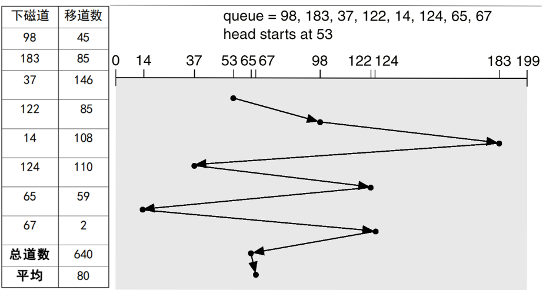
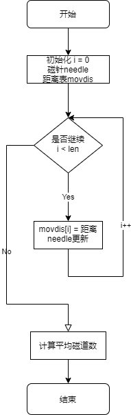
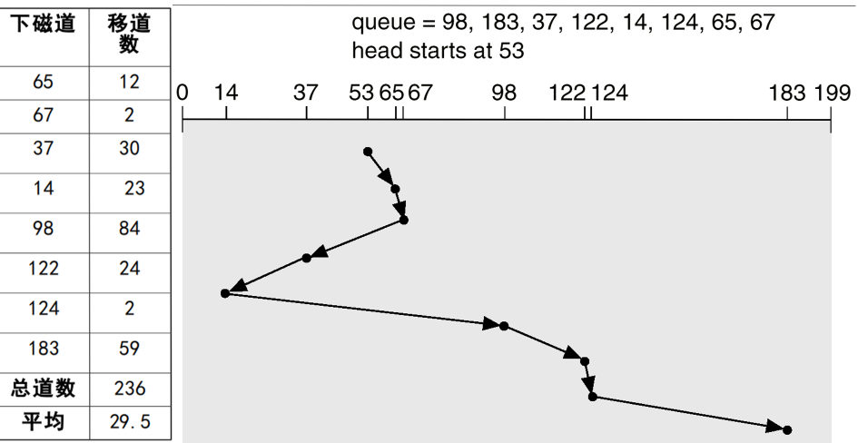
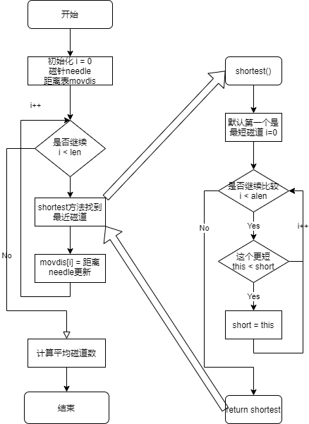
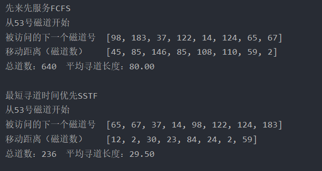

# 磁盘调度

**实验内容**：编写一个程序处理磁盘调度中寻道时间的策略。

**实验目的**：磁盘调度中寻道时间直接影响到数据访问的快慢，处理好磁盘寻道时间是关键。

**实验题目**：

- 采用先来先服务策略处理
- 采用最短寻道策略处理

https://github.com/SKPrimin/HomeWork/tree/main/OperatingSystem/diskpatch

## 实验原理

##### 先来先服务(FCFS)

优点：公平、简单，每个进程的请求都能依次得到处理
缺点：未对寻道进行优化，平均寻道时间较长



**流程图**



##### 最短寻道时间优先(SSTF)

优点：平均每次磁头移动距离较近；寻道性能比 FCFS 好，但不能保证寻道时间最短

缺点：不能保证平均寻道时间最短且有可能引起某些请求的饥饿



**流程图**



## 实现

### java

#### 数据结构和符号说明

DiskDispatch为一个工具类，定义了仅有其子类能使用的

四个变量 `start`为磁道开始点、`track`为将要访问的磁道号数组、`distanceSum`移动距离总磁道数、`movdistan`为将要计算的移动距离数组。

方法`distance(int a, int b)`使用三元表达式计算出两个磁盘的距离。

内部类`Track`是自定义数据类型，内含磁道号和磁针调度到本磁道移动距离。

`FCFS`类即先来先服务实现类

`SSTF`类即最短寻道时间优先实现类

#### DiskDispatch磁盘公有类

```java
package com.process.diskpatch;

import java.util.ArrayList;

/**
 * @Author: SKPrimin
 * @Date 2021/12/17 13:27
 * @ClassName: DiskDispatch
 * @Description: TODO
 */

public class DiskDispatch {

    /**
     * start为磁道开始点
     * track为将要访问的磁道号数组
     * distanceSum移动距离总磁道数
     * movdistan为将要计算的移动距离
     */
    protected int start;
    protected ArrayList<Integer> track;
    protected int distanceSum = 0;
    protected int[] movdistan;


    /**
     * 计算距离函数通过三元运算符返回两数绝对值
     */
    protected int distance(int a, int b) {
        return a > b ? a - b : b - a;
    }


    /**
     * 定义内部类 磁道类 包含磁道号 要想访问须达到的距离
     */
    static class Track {
        int diskName;
        int distance;
    }
}
```

####  FCFS先来先服务实现类

```java
package com.process.diskpatch;

import java.util.ArrayList;
import java.util.Arrays;

/**
 * @Author: SKPrimin
 * @Date 2021/12/16 23:12
 * @ClassName: FCFS
 * @Description: TODO 先来先服务磁盘调度算法
 */

public class FCFS extends DiskDispatch {


    // 构造器
    public FCFS(int start, ArrayList<Integer> track) {
        this.start = start;
        this.track = track;
        movdistan = new int[track.size()];
    }

    /**
     * 调度执行函数，进行此次先来先服务磁盘调度
     */
    public void run() {
        // 初始化磁针位置
        int needle = start;
        for (int i = 0; i < track.size(); i++) {
            // 求出移动距离并保存
            movdistan[i] = distance(needle, track.get(i));
            distanceSum += movdistan[i];
            // 更新指针位置
            needle = track.get(i);
        }
    }

    @Override
    public String toString() {
        return "\n先来先服务FCFS张丞E01914168" +
                "\n从" + start + "号磁道开始" +
                "\n被访问的下一个磁道号\t" + track +
                "\n移动距离（磁道数）\t" + Arrays.toString(movdistan) +
                "\n总道数："+distanceSum+"\t平均寻道长度：" + String.format("%.2f", (double) distanceSum / track.size());
    }
}
```

#### SSTF最短寻道时间优先实现类

```java
package com.process.diskpatch;

import java.util.ArrayList;
import java.util.Arrays;

/**
 * @Author: SKPrimin
 * @Date 2021/12/17 0:22
 * @ClassName: SSTF
 * @Description: TODO
 */

public class SSTF extends DiskDispatch {
    /**
     * trackSequence为SSTF调度的磁道号数组
     * len 为传出的磁道号数目
     */
    private int[] trackSequence;
    private int len;


    // 构造器
    public SSTF(int start, ArrayList<Integer> track) {
        this.start = start;
        this.track = track;
        this.len = track.size();
        movdistan = new int[len];
        trackSequence = new int[len];
    }

    /**
     * 调度执行函数，进行此次最短寻道时间优先磁盘调度
     */
    public void run() {
        // 初始化磁针位置
        int needle = start;
        for (int i = 0; i < len; i++) {
            // 求出移动距离的磁道号以及移动距离
            Track tc = shortest(needle, track);
            // 将算出的将要访问的下一磁道号、移动距离加入对应数组
            trackSequence[i] = tc.diskName;
            movdistan[i] = tc.distance;
            distanceSum += movdistan[i];
            // 更新指针位置以及磁道号列表，去除已经访问的磁道号
            needle = tc.diskName;
            // 此处使用包装类包装，避免当成索引
            track.remove(Integer.valueOf(tc.diskName));
        }
    }

    /**
     * 在给定范围内找出里磁针最近的磁道号
     *
     * @param needle 磁针当前位置
     * @param array  访问磁道号数组,即查找范围
     * @return 查找到的要访问的磁道号
     */
    public Track shortest(int needle, ArrayList<Integer> array) {
        // 各变量初始化 先默认第一个是距离最近的磁道
        Track tc = new Track();
        tc.diskName = array.get(0);
        tc.distance = distance(needle, array.get(0));
        // 进过遍历，若发现有离得更近的就替换
        for (int item :
                array) {
            if (distance(needle, item) < tc.distance) {
                tc.diskName = item;
                tc.distance = distance(needle, item);
            }
        }
        return tc;
    }

    @Override
    public String toString() {
        return "\n最短寻道时间优先SSTF张丞E01914168" +
                "\n从" + start + "号磁道开始" +
                "\n被访问的下一个磁道号\t" + Arrays.toString(trackSequence) +
                "\n移动距离（磁道数）\t" + Arrays.toString(movdistan) +
                "\n总道数："+distanceSum+"\t平均寻道长度：" + String.format("%.2f", (double) distanceSum / len);
    }
}
```

#### 测试类

```java
package com.process.diskpatch;

import java.util.ArrayList;

/**
 * @Author: SKPrimin
 * @Date 2021/12/17 0:20
 * @ClassName: Test
 * @Description: TODO 测试类 集中测试磁盘调度算法
 */

public class Test {
    public static void main(String[] args) {
        // 磁盘号顺序
        int[] track = new int[]{98, 183, 37, 122, 14, 124, 65, 67};
        ArrayList<Integer> ta = new ArrayList<>();
        for (int t : track) {
            ta.add(t);
        }

        // 先来先服务
        FCFS ff = new FCFS(53, ta);
        ff.run();
        System.out.println(ff);

        //最短寻道时间优先
        SSTF st = new SSTF(53, ta);
        st.run();
        System.out.println(st);

    }
}
```

### Python

```python
def fifo(tracklist, needle):
    movdistan = []
    distanceSum = 0
    print(f"\n先来先服务FCFS\n从{needle}号磁道开始")
    print(f"被访问的下一个磁道号\t移动距离（磁道数）")
    for index, item in enumerate(tracklist):
        # 算出移动距离并保存
        movdistan.append(abs(needle - item))
        distanceSum += movdistan[-1]
        # 更新磁针位置
        needle = item
        print(f"\t{item}\t\t\t\t\t{movdistan[-1]}")
    print(f"\n总道数：{distanceSum}\t平均寻道长度：{distanceSum / len(movdistan)}")
    return movdistan, distanceSum


def sstf(tracklist, needle):
    movdistan = []
    trackSequence = []
    distanceSum = 0
    print(f"\n最短寻道时间优先SSTF\n从{needle}号磁道开始")
    print(f"被访问的下一个磁道号\t移动距离（磁道数）")
    length = len(tracklist)
    for i in range(length):
        # 求出移动距离的磁道号以及移动距离
        ts, distance = shortest(tracklist,needle )
        trackSequence.append(ts)
        movdistan.append(distance)
        # 将算出的将要访问的下一磁道号、移动距离加入对应数组
        distanceSum += distance
        # 更新指针位置以及磁道号列表，去除已经访问的磁道号
        needle = ts
        tracklist.remove(ts)
        print(f"\t{ts}\t\t\t\t\t{distance}")
    print(f"\n总道数：{distanceSum}\t平均寻道长度：{distanceSum / len(movdistan)}")


def shortest(array,needle):
    # 各变量初始化 先默认第一个是距离最近的磁道
    diskName = array[0]
    distance = abs(needle - array[0])
    # 进过遍历，若发现有离得更近的就替换
    for item in array:
        if abs(needle - item) < distance:
            diskName = item
            distance = abs(needle - item)
    return diskName, distance

if __name__ == '__main__':

    track = [55, 58, 39, 18, 90, 160, 150, 38, 184]
    fifo(track, 100)
    sstf(track, 100)

```

### 运行截图


