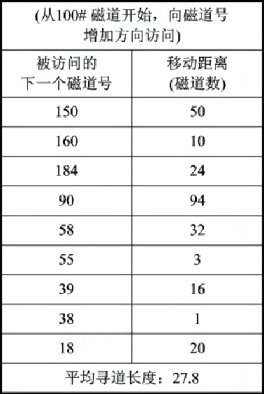
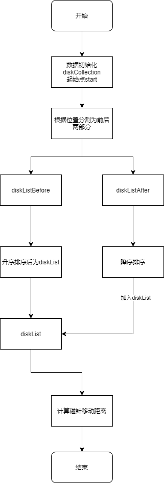
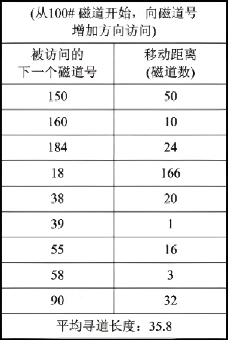
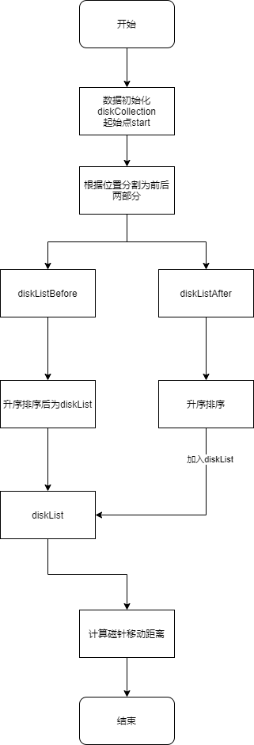
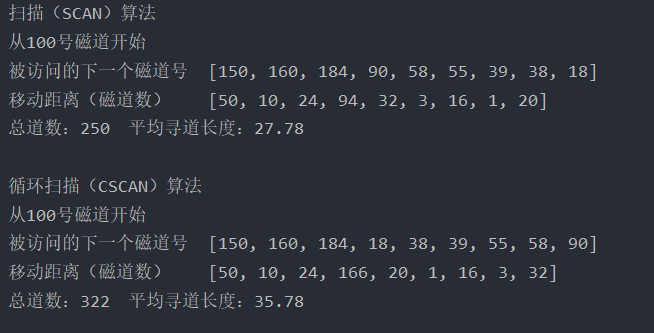
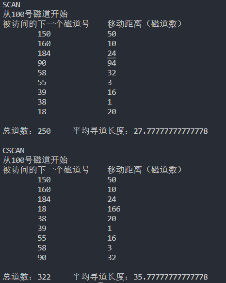

# 磁盘调度二

实验内容：编写一个程序处理磁盘调度中寻道时间的策略。
实验目的：磁盘调度中寻道时间直接影响到数据访问的快慢，处理好磁盘寻道时间是关键。
**实验题目：**

- 采用SCAN策略处理；
- 采用CSCAN策略处理；

## 实验原理

#### 扫描(SCAN)算法

进程“饥饿”现象

- [SSTF 算法](https://blog.csdn.net/m0_46530662/article/details/122001436)虽然能获得较好的寻道性能， 但却可能导致某个进程发生“饥饿” (Starvation) 现象，其实质上是基于优先级的调度算法。因为只要不断有新进程的请求到达， 且其所要访问的磁道与磁头当前所在磁道的距离较近，这种新进程的 I/O 请求必须优先满足。对 SSTF 算法略加修改后所形成的 SCAN 算法， 即可防止老进程出现“饥饿”现象。

-  SCAN 算法（电梯调度算法）不仅考虑欲访问的磁道与当前磁道的距离，更优先考虑磁 头的当前移动方向。磁头沿一个方向移动，直至该方向上无新的磁道访问请求，才将磁臂换向，为反方向上的磁道访问请求服务。
  磁道距离 + 磁头移动方向
  - 优点：较好的寻道性能，且能防止进程饥饿
  - 缺点：严重推迟某些进程的请求





#### 循环扫描(CSCAN)算法

- Scan 算法的特例：磁头刚移过某磁道 T ，该位置有访问请求，但磁头移动方向上不断有新的请求，则磁道 T 上的访问请求被严重推后。 改进SCAN算法方式：
  - 磁头单向移动
  - 循环扫描





## 代码实现

### java

#### 数据结构和符号说明

- `diskCollection` ArrayList类型数据，为初始的磁道号序列
- `start` int类型数据，为磁道开始，默认向磁道号增加的方向访问
- `timeList` ArrayList类型数据，为访问磁道对应的移动距离
- `distanceSum` int类型数据，磁针寻道总道数
- `diskList` ArrayList类型数据，为排序好的磁道访问顺序
- `diskListBefore` ArrayList类型数据，为磁针优先访问的磁道序列 由里向外访问顺序
- `diskListAfter` ArrayList类型数据，为磁针后访问的磁道序列 由外向里访问顺序

##### ScanDisk公共类

```java
package com.process.diskscan;

import java.util.ArrayList;

/**
 * @Author: SKPrimin
 * @Date 2021/12/18 16:12
 * @ClassName: ScanDisk
 * @Description: TODO 扫描算法与循环扫描的公共类 定义变量结构和分组方法
 */

public class ScanDisk {
    /**
     * diskCollection ArrayList类型数据，为初始的磁道号序列
     */
    protected ArrayList<Integer> diskCollection;
    /**
     * start int类型数据，为磁道开始，默认向磁道号增加的方向访问
     */
    protected int start;
    /**
     * timeList ArrayList类型数据，为访问磁道对应的移动距离
     */
    protected ArrayList<Integer> movList = new ArrayList<>();
    /**
     * distanceSum int类型数据，磁针寻道总道数
     */
    protected int distanceSum;
    /**
     * diskList ArrayList类型数据，为排序好的磁道访问顺序
     */
    protected ArrayList<Integer> diskList = new ArrayList<>();
    /**
     * diskListBefore ArrayList类型数据，为磁针优先访问的磁道序列 由里向外访问顺序
     */
    protected ArrayList<Integer> diskListBefore = new ArrayList<>();
    /**
     * diskListAfter ArrayList类型数据，为磁针后访问的磁道序列 由外向里访问顺序
     */
    protected ArrayList<Integer> diskListAfter = new ArrayList<>();

    /**
     * separate分割方法，以起始点为分界线，将磁道分为前后连个顺序
     */
    protected void separate() {
        // 遍历 diskCollection
        for (int item : diskCollection) {
            // 若在起始点外边在第一轮访问
            if (item > start) {
                diskListBefore.add(item);
                // 在起始点里边则在后一轮访问
            } else {
                diskListAfter.add(item);
            }
        }
    }

    /**
     * 计算距离函数通过三元运算符返回两数绝对值
     *
     * @param a 一个位置
     * @param b 另一个点位置
     * @return 两个位置之间的距离
     */
    protected int distance(int a, int b) {
        return a > b ? a - b : b - a;
    }


    /**
     * 排序函数
     *
     * @param arrayList 要排序的数组列表
     * @param reverse   是否逆序 false为升序，true为逆序
     * @return 返回已经排序好的数组列表
     */
    public ArrayList<Integer> sort(ArrayList<Integer> arrayList, boolean reverse) {
        int len = arrayList.size();
        for (int i = 0; i < len; i++) {
            int index = i;
            for (int j = i + 1; j < len; j++) {
                // 若 reverse为false 升序排序 reverse为true则降序排序
                if (!reverse) {
                    if (arrayList.get(j) < arrayList.get(index)) {
                        index = j;
                    }
                } else {
                    if (arrayList.get(j) > arrayList.get(index)) {
                        index = j;
                    }
                }
            }
            //位置交换 将较小reverse=false  /较大reverse=true 的数提到前边
            int temp = arrayList.get(index);
            arrayList.set(index, arrayList.get(i));
            arrayList.set(i, temp);
        }
        return arrayList;
    }

    public void calculateTravelDistance() {
        // 定义磁盘针头
        int pinhead = start;
        // 计算访问磁道号时的移动距离
        for (int i = 0; i < diskList.size(); i++) {
            // 将对应位置设置为距离 并统计总数
            movList.add(distance(pinhead, diskList.get(i)));
            distanceSum += movList.get(i);
            pinhead = diskList.get(i);
        }
    }
}
```

##### SCAN实现类

```java
package com.process.diskscan;

import java.util.ArrayList;

/**
 * @Author: SKPrimin
 * @Date 2021/12/18 16:08
 * @ClassName: SCAN
 * @Description: TODO 扫描算法的实现类
 */

public class SCAN extends ScanDisk {
    /**
     * 扫描算法构造器
     *
     * @param diskCollection 即将访问的磁道号数组列表
     * @param start          磁针起始点
     */
    public SCAN(ArrayList<Integer> diskCollection, int start) {
        this.diskCollection = diskCollection;
        this.start = start;
    }

    /**
     * 执行此次扫描算法的调动方法
     */
    public void run() {
        //调用父类的分类方法
        separate();
        // diskList接收排序好的顺序
        diskList = sort(diskListBefore, false);
        diskList.addAll(sort(diskListAfter, true));
        // 计算移动距离
        calculateTravelDistance();
    }

    @Override
    public String toString() {
        return "\n扫描（SCAN）算法" +
                "\n从" + start + "号磁道开始" +
                "\n被访问的下一个磁道号\t" + diskList +
                "\n移动距离（磁道数）\t" + movList +
                "\n总道数：" + distanceSum + "\t平均寻道长度：" + String.format("%.2f", (double) distanceSum / movList.size());

    }
}
```

##### CSCAN实现类

```java
package com.process.diskscan;

import java.util.ArrayList;

/**
 * @Author: SKPrimin
 * @Date 2021/12/18 17:24
 * @ClassName: CSCAN
 * @Description: TODO
 */

public class CSCAN extends ScanDisk {

    /**
     * 扫描算法构造器
     *
     * @param diskCollection 即将访问的磁道号数组列表
     * @param start          磁针起始点
     */
    public CSCAN(ArrayList<Integer> diskCollection, int start) {
        this.diskCollection = diskCollection;
        this.start = start;
    }

    /**
     * 执行此次扫描算法的调动方法
     */
    public void run() {
        //调用父类的分类方法
        separate();
        // diskList接收排序好的顺序
        diskList = sort(diskListBefore, false);
        diskList.addAll(sort(diskListAfter, false));
        // 计算移动距离
        calculateTravelDistance();
    }

    @Override
    public String toString() {
        return "\n循环扫描（CSCAN）算法" +
                "\n从" + start + "号磁道开始" +
                "\n被访问的下一个磁道号\t" + diskList +
                "\n移动距离（磁道数）\t" + movList +
                "\n总道数：" + distanceSum + "\t平均寻道长度：" + String.format("%.2f", (double) distanceSum / movList.size());

    }
}
```

##### 测试类

```java
package com.process.diskscan;

import java.util.ArrayList;

/**
 * @Author: SKPrimin
 * @Date 2021/12/18 17:27
 * @ClassName: Test
 * @Description: TODO 基于扫描的磁盘调度算法
 */

public class Test {
    public static void main(String[] args) {
        // 磁盘号顺序
        int[] track = new int[]{55, 58, 39, 18, 90, 160, 150, 38,184};
        ArrayList<Integer> ta = new ArrayList<>();
        for (int t : track) {
            ta.add(t);
        }

        // 先来先服务
        SCAN ff = new SCAN( ta,100);
        ff.run();
        System.out.println(ff);

        //最短寻道时间优先
        CSCAN st = new CSCAN( ta,100);
        st.run();
        System.out.println(st);

    }
}
```

### 运行截图



## python

```python
import copy


# 扫描算法
def SCAN(seq, start, drct):
    tempseq = copy.deepcopy(seq)
    distance = 0
    nownum = start
    if drct == 0:
        tempseq.sort()
        i = 0
        for i in range(len(tempseq)):
            if tempseq[i] >= start:
                break
        templist = list(reversed(tempseq[:i]))
        tempseq = tempseq[i:] + templist
        for num in tempseq:
            d = abs(nownum - num)
            distance += d
            nownum = num
            print('被访问的下一个磁道号：{}  \t移动距离：{}'.format(num, d))
        return distance / len(seq)
    else:
        tempseq.sort(reverse=True)
        i = 0
        for i in range(len(tempseq)):
            if tempseq[i] <= start:
                break
        templist = list(reversed(tempseq[:i]))
        tempseq = tempseq[i:] + templist
        for num in tempseq:
            d = abs(nownum - num)
            distance += d
            nownum = num
            print('被访问的下一个磁道号：{}  \t移动距离：{}'.format(num, d))
        return distance / len(seq)


# 循环扫描算法
def CSCAN(seq, start, drct):
    tempseq = copy.deepcopy(seq)
    distance = 0
    nownum = start
    if drct == 0:
        tempseq.sort()
        i = 0
        for i in range(len(tempseq)):
            if tempseq[i] >= start:
                break
        tempseq = tempseq[i:] + tempseq[:i]
        for num in tempseq:
            d = abs(nownum - num)
            distance += d
            nownum = num
            print('被访问的下一个磁道号：{}  \t移动距离：{}'.format(num, d))
        return distance / len(seq)
    else:
        tempseq.sort(reverse=True)
        i = 0
        for i in range(len(tempseq)):
            if tempseq[i] <= start:
                break
        tempseq = tempseq[i:] + tempseq[:i]
        for num in tempseq:
            d = abs(nownum - num)
            distance += d
            nownum = num
            print('被访问的下一个磁道号：{}  \t移动距离：{}'.format(num, d))
        return distance / len(seq)


if __name__ == '__main__':
    diskseq = input('请输入需要访问的磁道号序列（以空格分隔）：')
    # 55 58 39 18 90 160 150 38 184
    diskseq = list(map(lambda x: int(x), diskseq.split()))
    startnum = int(input('请输入当前磁头所在的磁道号：'))
    direction = int(input('请输入当前磁头移动的方向（0表示自里向外，1表示自外向里）：'))
    print('-----------------扫描算法--------------------')
    average_SCAN = SCAN(diskseq, startnum, direction)
    print('平均寻道长度：', average_SCAN)
    print('--------------------------------------------')
    print('-----------------循环扫描算法--------------------')
    average_CSCAN = CSCAN(diskseq, startnum, direction)
    print('平均寻道长度：', average_CSCAN)
    print('------------------------------------------------')

```

### python other 

```python
def scan(diskSet, needle):
    print(f"\nSCAN\n从{needle}号磁道开始")
    print(f"被访问的下一个磁道号\t移动距离（磁道数）")
    # 分割
    diskListBefore = [x for x in diskSet if x > needle]
    diskListAfter = [x for x in diskSet if x <= needle]
    # 将列表排序 前升序 后降序
    diskListBefore.sort()
    diskListAfter.sort(reverse=True)
    # 将后列表追加到前一列表
    diskListBefore.extend(diskListAfter)
    # 计算移动距离
    distanceSum = 0
    movdistan = []
    # 计算访问磁道号时的移动距离
    for item in diskListBefore:
        # 算出移动距离并保存
        movdistan.append(abs(needle - item))
        distanceSum += movdistan[-1]
        # 更新磁针位置
        needle = item
        print(f"\t{item}\t\t{movdistan[-1]}")
    print(f"\n总道数：{distanceSum}\t平均寻道长度：{distanceSum / len(movdistan)}")


def cscan(diskSet, needle):
    print(f"\nCSCAN\n从{needle}号磁道开始")
    print(f"被访问的下一个磁道号\t移动距离（磁道数）")
    # 分割
    diskListBefore = [x for x in diskSet if x > needle]
    diskListAfter = [x for x in diskSet if x <= needle]
    # 将列表排序 前升序 后降序
    diskListBefore.sort()
    diskListAfter.sort()
    # 将后列表追加到前一列表
    diskListBefore.extend(diskListAfter)
    # 计算移动距离
    distanceSum = 0
    movdistan = []
    # 计算访问磁道号时的移动距离
    for item in diskListBefore:
        # 算出移动距离并保存
        movdistan.append(abs(needle - item))
        distanceSum += movdistan[-1]
        # 更新磁针位置
        needle = item
        print(f"\t{item}\t\t{movdistan[-1]}")
    print(f"\n总道数：{distanceSum}\t平均寻道长度：{distanceSum / len(movdistan)}")


if __name__ == '__main__':
    track = [55, 58, 39, 18, 90, 160, 150, 38, 184]
    scan(track, 100)
    cscan(track, 100)

```

