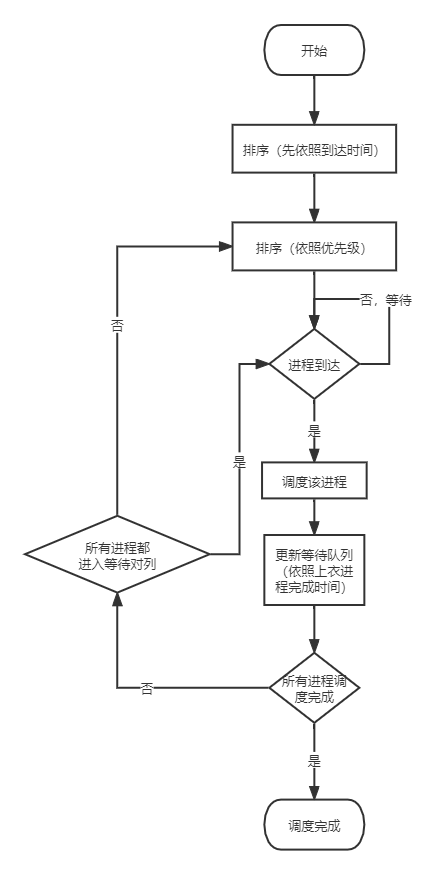
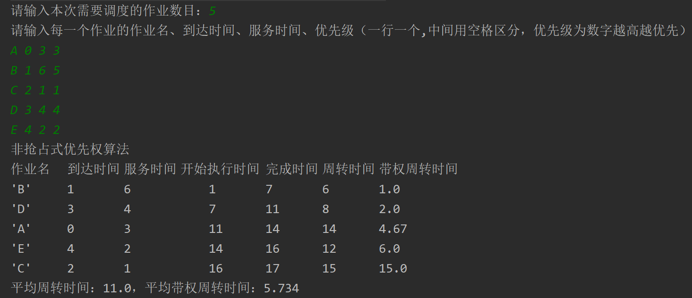
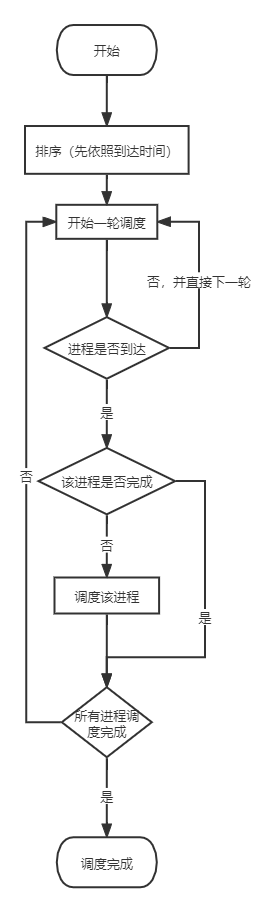
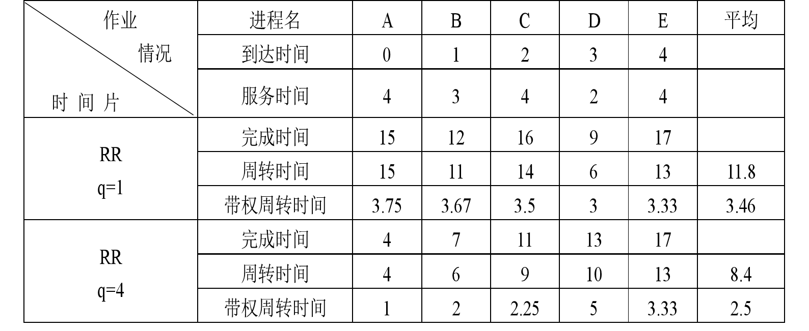
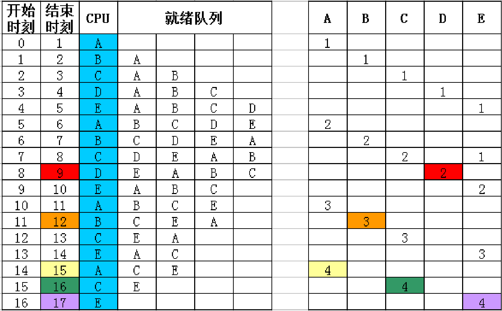

# 进程调度

### 实验内容

- 设计调度算法，模拟实现处理机的调度。

### 实验目的

- 巩固和加深处理机调度的概念。

### 实验题目

- 设计非抢占式静态优先权调度算法;
- 设计时间片轮转算法。

## 实验内容

### 非抢占式优先权调度

> 非抢占式静态优先权调度策略：静态优先权是在创建进程时确定的，且在进程的整个运行期间保持不变。一般地，优先权是利用某一范围内的一个整数来表示的，例如，0～255中的某一整数，当数值愈大时，其优先权愈低。
>
> 非抢占式优先权调度：系统一旦把处理机分配给就绪队列中优先权最高的进程后，该进程便一直执行下去，直至完成；或因发生某事件使该进程放弃处理机时，系统方可再将处理机重新分配给另一优先权最高的进程。

#### 数据结构和符号说明

本调度算法的数据结构PCB共包含了四个公共变量``，四个私有变量`timeStart、timeComplete、timeTurnaround、timeWeightedTurnaround`

```java
// 四个公共变量：作业名、到达时间、服务时间、优先级
String threadName; int timeArrival; int timeSever; int priority
// 四个私有变量：开始执行时间、完成时间、周转时间、带权周转时间
private int timeStart; private int timeComplete; 
private int timeTurnaround; private double timeWeightedTurnaround;
```

在主类NPPS中有一个进程调度函数`dispatch(PCB[] starr)`，一个根据到达时间进行排序的`sort(PCB[] starr, int num)`函数，以及一个根据优先级进行排序的函数`sortPriority(PCB[] starr, int left, int right) `。根据到达时间的sort函数只有在一开始时调用一次排序；根据优先级的sortPriority函数为了减少无意义调用从而节约时间资源，只有`rightcount <= num && lastsortflag`成立时才会进行一次排序，保证所有进程都进入等待状态并完成排序后不再重复调用浪费资源。

测试类Test包含一个主函数用于启动，以及一个专门用于接受输入进程信息的函数。并且输入的进程数组在测试类中定义，也能实现在NPPS类中的函数直接更改进程的信息。

#### 流程图




#### 源程序

###### PCB类

```java
import java.text.DecimalFormat;

public class PCB {
    /**
     * 四个公共变量:作业名、到达时间、服务时间、优先级
     */
    String threadName;
    int timeArrival;
    int timeSever;
    int priority;
    /**
     * 四个私有变量：开始执行时间、完成时间、周转时间、带权周转时间
     */
    private int timeStart;
    private int timeComplete;
    private int timeTurnaround;
    private double timeWeightedTurnaround;

    public PCB() {
    }

    public PCB(String threadName, int timeArrival, int timeSever, int priority) {
        this.threadName = threadName;
        this.timeArrival = timeArrival;
        this.timeSever = timeSever;
        this.priority = priority;
    }

    public void setTimeStart(int timeStart) {//将由算法调度程序分配开始时间
        this.timeStart = timeStart;
    }

    public int getTimeComplete() {
        return timeComplete;
    }

    public int getTimeTurnaround() {
        return timeTurnaround;
    }

    public double getTimeWeightedTurnaround() {
        return timeWeightedTurnaround;
    }

    public void run() { //开始调度后的运行内容
        /* 计算出完成时间、周转时间、带权周转时间 */
        timeComplete = timeStart + timeSever;
        timeTurnaround = timeComplete - timeArrival;
        DecimalFormat dF = new DecimalFormat("0.00");
        timeWeightedTurnaround = Double.parseDouble(dF.format((double) timeTurnaround / timeSever));
        //调用toString()将内容输出
        System.out.println(this);

    }

    @Override
    public String toString() {
        return "'" + threadName + '\'' +
                "\t\t" + timeArrival +
                "\t\t" + timeSever +
                "\t\t\t" + timeStart +
                "\t\t" + timeComplete +
                "\t\t" + timeTurnaround +
                "\t\t" + timeWeightedTurnaround;
    }
}
```

###### NPPS类

```java
public class NPPS {
    public void dispatch(PCB[] pcbarr) {
        System.out.println("非抢占式优先权算法");
        System.out.println("作业名\t到达时间\t服务时间\t开始执行时间\t完成时间\t周转时间\t带权周转时间");
        int num = pcbarr.length;
        //周转时间之和与带权周转时间之和
        int timeTurnaroundSum = 0;
        double timeWeightedTurnaroundSum = 0;
        sort(pcbarr, num);

        /* 当前执行进程、系统调度此次作业的时间、调度完成的作业数目*/
        PCB item = pcbarr[0];
        int timeStart = pcbarr[0].timeArrival;
        int count = 0;
        boolean lastsortflag = true;
        for (int i = 0; i < num; i++) {

            // 三元运算符，确保系统调度作业时作业已经到达
            timeStart = timeStart > item.timeArrival ? timeStart : item.timeArrival;
            item.setTimeStart(timeStart);
            item.run();
            //完成作业+1,并在将此次完成时间作为下一个已到达作业的开始时间
            count++;
            timeStart = item.getTimeComplete();
            timeTurnaroundSum += item.getTimeTurnaround();
            timeWeightedTurnaroundSum += item.getTimeWeightedTurnaround();
            //已到达的作业再依照优先级重排，先确立左右边界
            int rightcount = count;
            for (int j = 0; j < num - count; j++) {
                if (pcbarr[j + count].timeArrival <= timeStart) {
                    rightcount++;
                }
            }
            // 需要重排的数组切片，当所有作业都重排后停止
            if (rightcount <= num && lastsortflag) {
                sortPriority(pcbarr, count, rightcount);
            }
            if (rightcount == num) { // 代表已经将所有作业重排，此后无需重排
                lastsortflag = false;
            }
            item = pcbarr[(i + 1) % num];
        }
        System.out.println("平均周转时间：" + (double) timeTurnaroundSum / num +
                "，平均带权周转时间：" + timeWeightedTurnaroundSum / num);
    }

    public void sort(PCB[] pcbarr, int num) {
        //根据到达时间对作业进行升序排序，排序方式：选择排序
        for (int i = 0; i < num - 1; i++) {
            int index = i;
            for (int j = i + 1; j < num; j++) {
                if (pcbarr[j].timeArrival < pcbarr[index].timeArrival) {
                    index = j;
                }
            }
            //将找到的最小值放到第一的位置，进行下一遍循环
            PCB temp = pcbarr[index];
            pcbarr[index] = pcbarr[i];
            pcbarr[i] = temp;
        }
    }

    public void sortPriority(PCB[] pcbarr, int left, int right) {
        //根据服务时间对作业进行升序排序，排序方式：选择排序
        int num = right - left;
        for (int i = 0; i < num - 1; i++) {
            int index = i;
            for (int j = i + 1; j < num; j++) {
                if (pcbarr[left + j].priority > pcbarr[left + index].priority) {
                    index = j;
                }
            }
            //将找到的最大值放到第一的位置，进行下一遍循环
            PCB temp = pcbarr[left + index];
            pcbarr[left + index] = pcbarr[left + i];
            pcbarr[left + i] = temp;
        }
    }
}
```

###### Test类

```java
import java.util.Scanner;

public class Test {
    public static void main(String[] args) {
        // 读取输入的数组
        PCB[] arr1 = dataReadIn();

        //调用两大算法
        NPPS fcfs = new NPPS();
        fcfs.dispatch(arr1);
    }

    public static PCB[] dataReadIn() { //数据读入函数,直接设为静态函数，强制要求写入数据
        System.out.print("请输入本次需要调度的作业数目：");
        Scanner sc = new Scanner(System.in);
        int n = sc.nextInt();
        PCB[] starr = new PCB[n];
        System.out.println("请输入每一个作业的作业名、到达时间、服务时间、优先级（一行一个,中间用空格区分，优先级为数字越高越优先）");
        for (int i = 0; i < n; i++) {
            starr[i] = new PCB(sc.next(), sc.nextInt(), sc.nextInt(), sc.nextInt());
        }
        return starr;
    }
}
```

#### 


#### 运行时的初值和结果

>A 0 3 3
B 1 6 5
C 2 1 1
D 3 4 4
E 4 2 2



### 时间片轮转调度


>时间片轮转调度策略：在轮转(RR)法中，系统将所有的就绪进程按FCFS策略排成一个就绪队列。系统可设置每隔一定时间(如30 ms)便产生一次中断，去激活进程调度程序进行调度，把CPU分配给队首进程，并令其执行一个时间片。当它运行完毕后，又把处理机分配给就绪队列中新的队首进程，也让它执行一个时间片。这样，就可以保证就绪队列中的所有进程在确定的时间段内，都能获得一个时间片的处理机时间。

#### 数据结构和符号说明

本次的PCB类数据结构有三个公共变量，五个私有变量，一个标志变量，以及一个时时返回给调度函数值的交互式变量。

```java
//三个公共变量:作业名、到达时间、服务时间
String threadName; int timeArrival; int timeSever;
//五个私有变量：计算专用服务时间、开始执行时间、完成时间、周转时间、带权周转时间
private int timeSeverFor; private int timeStart; private int timeComplete;
private int timeTurnaround; private double timeWeightedTurnaround;
//一个标志：表示是否还需要调度 一个交互式变量：表示自己本次使用了多少时间
private boolean isFinish = false; private int timeUse;
```

另有setter、getter函数实现私有变量的访问，同时有一个`public boolean isNotStart() { return timeStart == 0; }`函数根据进程的开始时间是否为0判断本程序是否启动过。在计算完成时间时，通过timeSever进行判断。每次时间片执行时都会时timeSever减去相应时间，此处的timeSever是时时更新的剩余服务时间，如果在一个时间片内提前结束了，则完成时间以及本次进程使用的时间都会进行调整，具体实现是通过三元运算符实现`timeSever -= timeSlice;		timeComplete = timeSever > 0 ? timeNow + timeSlice : timeNow + timeSlice + timeSever;	timeUse = timeSever >= 0 ? timeSlice : timeSlice + timeSever;`，而也只有在剩余服务时间<=0时即本进程已完成才会进行周转时间等计算。

RR类进行系统调度时，由主机记录时间，并按照个一个轮转片内进程实际使用的时间累加，调用时只需按照到达时间排序一次就好，随后便是各时间片轮转，使用一个`while (countFinish < num)`表示只要有一个进程未完成都会继续执行循环，而在while循环内部刚好是一个for each循环，各进程按照顺序一一轮转，如果进程未完成，则会调度此进程，完成就countFinish加1。调度时如果是第一次启动还需赋启动时间初值，随后运行本轮次`pcb.run(timeNow, timeSlice)`，记录下这次实际使用的时间并累加到当前时间上。

测试类Test包含一个主函数用于启动并时间片长度q，以及一个专门用于接受输入进程信息的函数。并且输入的进程数组在测试类中定义，也能实现在RR类中的函数直接更改进程的信息。

#### 流程图




#### 源程序

###### PCB类

```java
import java.text.DecimalFormat;

public class PCB {
    /**
     * 三个公共变量:作业名、到达时间、服务时间
     */
    String threadName;
    int timeArrival;
    int timeSever;

    /**
     * 五个私有变量：计算专用服务时间、开始执行时间、完成时间、周转时间、带权周转时间
     * 一个标志：表示是否还需要调度
     * 一个交互式变量：表示自己本次使用了多少时间
     */
    private int timeSeverFor;
    private int timeStart;
    private int timeComplete;
    private int timeTurnaround;
    private double timeWeightedTurnaround;
    private boolean isFinish = false;
    private int timeUse;

    public PCB() {//允许空参构造器存在
    }

    public PCB(String threadName, int timeArrival, int timeSever) { //正规的有参构造器
        this.threadName = threadName;
        this.timeArrival = timeArrival;
        this.timeSever = timeSever;
        this.timeSeverFor = timeSever;
    }

    public void setTimeStart(int timeStart) {//将由算法调度程序分配开始时间
        this.timeStart = timeStart;
    }

    public boolean isNotStart() {
        return timeStart == 0;
    }

    public int getTimeTurnaround() {
        return timeTurnaround;
    }

    public double getTimeWeightedTurnaround() {
        return timeWeightedTurnaround;
    }

    public boolean isFinish() {
        return isFinish;
    }

    public int getTimeUse() {
        return timeUse;
    }

    public void run(int timeNow, int timeSlice) { //开始调度后的运行内容
        /*计算完成时间*/
        if (timeSever > 0) {
            timeSever -= timeSlice;
            // 此处保证进程在时间片内提前完成的情况下，依然能准确算出完成时间，并返回正确的使用时间
            timeComplete = timeSever > 0 ? timeNow + timeSlice : timeNow + timeSlice + timeSever;
            timeUse = timeSever >= 0 ? timeSlice : timeSlice + timeSever;
        }
        /* 当本次进程完成时，计算周转时间、带权周转时间 */
        if (timeSever <= 0) {
            isFinish = true;
            timeTurnaround = timeComplete - timeArrival;
            DecimalFormat dF = new DecimalFormat("0.00");
            timeWeightedTurnaround = Double.parseDouble(dF.format((double) timeTurnaround / timeSeverFor));
            //调用toString()将内容输出
            System.out.println(this);
        }
    }

    @Override
    public String toString() {
        return "'" + threadName + '\'' +
                "\t\t" + timeArrival +
                "\t\t" + timeSeverFor +
                "\t\t\t" + timeStart +
                "\t\t" + timeComplete +
                "\t\t" + timeTurnaround +
                "\t\t" + timeWeightedTurnaround;
    }
}
```

###### RR类

```java
public class RR {
    public void dispatch(PCB[] pcbarr, int timeSlice) {
        System.out.println("作业名\t到达时间\t服务时间\t开始执行时间\t完成时间\t周转时间\t带权周转时间");
        int num = pcbarr.length;
        //由主机记录当前时间，以便实现时间片轮转
        int timeNow = 0;
        sort(pcbarr, num);
        //此后的PCB数组都是依照到达时间排序完成的
        int countFinish = 0;
        while (countFinish < num) {
            countFinish = 0;
            for (PCB pcb : pcbarr) {
                //如果此进程未完成，且时间已到达，则会给该进程一个时间片,否则进行下一个
                if (timeNow >= pcb.timeArrival) {
                    if ((!pcb.isFinish())) {
                        if (pcb.isNotStart()) {
                            pcb.setTimeStart(timeNow);
                        }
                        pcb.run(timeNow, timeSlice);
                        timeNow += pcb.getTimeUse();
                    } else {
                        countFinish++;
                    }
                }else{//若还未到，则直接当前时间加一，从下一轮开始
                    timeNow++;
                    break;
                }
            }
        }
        //周转时间之和与带权周转时间之和
        int timeTurnaroundSum = 0;
        double timeWeightedTurnaroundSum = 0;
        for (PCB pcb : pcbarr) {
            timeTurnaroundSum += pcb.getTimeTurnaround();
            timeWeightedTurnaroundSum += pcb.getTimeWeightedTurnaround();
        }
        System.out.println("平均周转时间：" + (double) timeTurnaroundSum / num +
                "，平均带权周转时间：" + timeWeightedTurnaroundSum / num);
    }

    public void sort(PCB[] arr, int num) {
        //根据到达时间对作业进行升序排序，排序方式：选择排序
        for (int i = 0; i < num - 1; i++) {
            int index = i;
            for (int j = i + 1; j < num; j++) {
                if (arr[j].timeArrival < arr[index].timeArrival) {
                    index = j;
                }
            }
            //将找到的最小值放到第一的位置，进行下一遍循环
            PCB temp = arr[index];
            arr[index] = arr[i];
            arr[i] = temp;
        }
    }
}
```

###### Test类

```java
import java.util.Scanner;

public class Test {
    public static void main(String[] args) {
        // 设置时间片长度
        System.out.print("时间片轮转算法\n请设置时间片长度q = ");
        Scanner sc = new Scanner(System.in);
        int timeSlice = sc.nextInt();
        // 读取输入的数组
        PCB[] arr1 = dataReadIn();
        //调用时间片轮转算法
        RR rr = new RR();
        rr.dispatch(arr1, timeSlice);
    }

    public static PCB[] dataReadIn() { //数据读入函数,直接设为静态函数，强制要求写入数据
        System.out.print("请输入本次需要调度的作业数目：");
        Scanner sc = new Scanner(System.in);
        int n = sc.nextInt();
        PCB[] starr = new PCB[n];
        System.out.println("请输入每一个作业的作业名、到达时间、服务时间（一行一个,中间用空格区分）");
        for (int i = 0; i < n; i++) {
            starr[i] = new PCB(sc.next(), sc.nextInt(), sc.nextInt());
        }
        return starr;
    }
}
```

#### 运行时的初值和结果


> 时间片轮转算法
> 请设置时间片长度q = 1
> 请输入本次需要调度的作业数目：5
> 请输入每一个作业的作业名、到达时间、服务时间（一行一个,中间用空格区分）
> A 0 4
> B 1 3
> C 2 4
> D 3 2
> E 4 4
> 作业名	到达时间	服务时间	开始执行时间	完成时间	周转时间	带权周转时间
> 'D'		3		2			3		9		6		3.0
> 'B'		1		3			1		12		11		3.67
> 'A'		0		4			5		15		15		3.75
> 'C'		2		4			2		16		14		3.5
> 'E'		4		4			4		17		13		3.25
> 平均周转时间：11.8，平均带权周转时间：3.434
>
> 
>
> 时间片轮转算法
> 请设置时间片长度q = 4
> 请输入本次需要调度的作业数目：5
> 请输入每一个作业的作业名、到达时间、服务时间（一行一个,中间用空格区分）
> A 0 4
> B 1 3
> C 2 4
> D 3 2
> E 4 4
> 作业名	到达时间	服务时间	开始执行时间	完成时间	周转时间	带权周转时间
> 'A'		0		4			0		4		4		1.0
> 'B'		1		3			4		7		6		2.0
> 'C'		2		4			7		11		9		2.25
> 'D'		3		2			11		13		10		5.0
> 'E'		4		4			13		17		13		3.25
> 平均周转时间：8.4，平均带权周转时间：2.7

与理想状态相同


----------------





## Python

```python
"""实验二：分别设计非抢占式静态优先权调度算法和时间片轮转算法来实现调度"""
import copy
from queue import Queue

count = int(input('请输入进程数目：'))
process = []


# 输入进程相关信息
def inputprocess():
    i = 0
    while i < count:
        print('-------------------')
        process_name = input('请输入第%d个进程名：' % (i + 1))
        arrive_time = float(input('请输入达到时间：'))
        service_time = float(input('请输入服务时间：'))
        priority = int(input('请输入优先数：'))
        process.append([process_name, arrive_time, service_time, priority, 0, 0, 0])
        # 后面3个0分别表示完成、周转、带权周转时间
        i += 1


# 非抢占式静态优先权调度算法
def PS():
    PPro = process[:]
    PPro.sort(key=lambda item: (item[1]))  # 先按照到达时间时间排序
    PPro[1:] = sorted(PPro[1:], key=lambda item: (item[3]))  # 后面的进程按照优先级排序
    # 首先计算第一个被调度的进 程
    start = PPro[0][1]  # 开始执行时间
    PPro[0][4] = PPro[0][1] + PPro[0][2]  # 完成时间
    PPro[0][5] = PPro[0][4] - PPro[0][1]  # 周转时间
    PPro[0][6] = PPro[0][5] / PPro[0][2]  # 带权周转时间
    nowtime = PPro[0][4]  # 当前完成时间
    i = 1
    while i < count:
        tem_pro = []
        pre_pro = PPro[:]
        min_arrive = min(PPro[i:], key=lambda item: item[1])  # 找出最小到达时间
        if min_arrive[1] > nowtime:  # 如果最小到达时间小于当前完成时间
            k = PPro.index(min_arrive)
            # 调度该进程
            start = max(nowtime, PPro[k][1])  # 开始执行时间
            PPro[k][4] = start + PPro[k][2]  # 完成时间
            PPro[k][5] = PPro[k][4] - PPro[k][1]  # 周转时间
            PPro[k][6] = PPro[k][5] / PPro[k][2]  # 带权周转时间
            nowtime = PPro[k][4]  # 更新当前完成时间
            PPro[i], PPro[k] = PPro[k], PPro[i]
            PPro[i + 1:] = sorted(PPro[i + 1:], key=lambda item: (item[3]))  # 后面的进程按照优先级排序
            i += 1
        j = i
        if j >= count:
            break
        while pre_pro[j][1] > nowtime:
            tem_pro.append(pre_pro[j])
            PPro.pop(i)  # 将还未到达的进程弹出
            j += 1
            if j >= count:  # 所有进程均未达到，则重新排序
                tem_pro.sort(key=lambda item: (item[1]))  # 先按照到达时间时间排序
                tem_pro[1:] = sorted(tem_pro[1:], key=lambda item: (item[3]))  # 后面的进程按照优先级排序
                break
        else:  # 到达时间小于当前完成时间，则调度该进程
            start = max(nowtime, PPro[i][1])  # 开始执行时间
            PPro[i][4] = start + PPro[i][2]  # 完成时间
            PPro[i][5] = PPro[i][4] - PPro[i][1]  # 周转时间
            PPro[i][6] = PPro[i][5] / PPro[i][2]  # 带权周转时间
            nowtime = PPro[i][4]  # 更新当前完成时间
            i += 1
        PPro = PPro[:i] + tem_pro + PPro[i:]  # 插入之前未达到的进程
    aver_TAT = 0
    aver_WTAT = 0
    for i in range(count):
        aver_TAT += PPro[i][5]
        aver_WTAT += PPro[i][6]
    aver_TAT /= count  # 平均周转时间
    aver_WTAT /= count  # 平均带权周转时间
    # 输出
    PPro.sort(key=lambda item: (item[1]))  # 按照到达时间时间输出
    print('非抢占式静态优先权调度算法计算结果：')
    for pro in PPro:
        print('{0[0]}进程在时刻{0[1]}到来，服务时间为{0[2]},优先级为{0[3]},完成时间为{0[4]},周转时间为{0[5]},带权周转时间为{0[6]}'.format(pro))
    print('本次调度的平均周转时间为{0}，平均带权周转时间为{1}'.format(aver_TAT, aver_WTAT))


# 时间片轮转调度算法
def RRS(rr):
    RPro = process[:]
    RPro.sort(key=lambda item: item[1])  # 按照达到时间从小到大排序
    temppro = copy.deepcopy(RPro)
    qu = Queue()
    nowP = temppro[0]
    if nowP[2] > rr:  # 服务时间大于时间片
        nowP[2] -= rr  # 还需要服务的时间
        nowtime = nowP[1] + rr  # 当前完成时间
    else:  # 服务时间小于等于时间片
        nowP[4] = nowP[1] + nowP[2]  # 完成时间
        nowP[5] = nowP[4] - nowP[1]
        nowP[6] = nowP[5] / nowP[2]
        nowtime = nowP[1] + nowP[2]  # 当前完成时间
        nowP[2] = 0  # 服务结束
    if nowP[2] > 0:  # 服务未结束，放到队尾
        qu.put(nowP)
    i = 0
    flag = 1
    while flag:
        if i >= count - 1:  # 所有进程均已达到
            nowP = qu.get()
        else:
            if temppro[i + 1][1] <= nowtime:  # 下一个进程已经到达
                nowP = temppro[i + 1]  # 调度最新到来的进程
                i += 1
            else:  # 下一个进程还未到达
                if not qu.empty():  # 队列非空
                    nowP = qu.get()  # 调度当前队头进程
                else:  # 队列已空
                    nowP = temppro[i + 1]
                    nowtime = nowP[1]
                    i += 1
        if nowP[2] > rr:  # 服务时间大于时间片
            nowP[2] -= rr  # 还需要服务的时间
            nowtime = nowtime + rr  # 当前完成时间
        else:  # 服务时间小于等于时间片
            ind = temppro.index(nowP)  # 获得该进程的索引
            servicetime = RPro[ind][2]  # 原始的服务时间
            nowP[4] = nowtime + nowP[2]  # 完成时间
            nowP[5] = nowP[4] - nowP[1]
            nowP[6] = nowP[5] / servicetime
            nowtime = nowP[4]  # 更新当前完成时间
            nowP[2] = 0  # 服务结束
        if nowP[2] > 0:  # 服务未结束，放到队尾
            qu.put(nowP)
        for j in range(count):
            if temppro[j][2] == 0:
                flag = 0
            else:
                flag = 1  # 还有未服务结束的进程
                break
    for i in range(count):
        RPro[i][4] = temppro[i][4]
        RPro[i][5] = temppro[i][5]
        RPro[i][6] = temppro[i][6]
    aver_TAT = 0
    aver_WTAT = 0
    for i in range(count):
        aver_TAT += RPro[i][5]
        aver_WTAT += RPro[i][6]
    aver_TAT /= count  # 平均周转时间
    aver_WTAT /= count  # 平均带权周转时间
    # 输出
    RPro.sort(key=lambda item: (item[1]))  # 按照到达时间时间输出
    print('时间片轮转调度算法计算结果：')
    for pro in RPro:
        print('{0[0]}进程在时刻{0[1]}到来，服务时间为{0[2]},优先级为{0[3]},完成时间为{0[4]},周转时间为{0[5]},带权周转时间为{0[6]}'.format(pro))
    print('本次调度的平均周转时间为{0}，平均带权周转时间为{1}'.format(aver_TAT, aver_WTAT))


if __name__ == '__main__':
    inputprocess()
    print('-------------------')
    PS()
    print('-------------------')
    rr = int(input('下面将使用时间片轮转调度算法，请输入时间片大小：'))
    RRS(rr)

```

