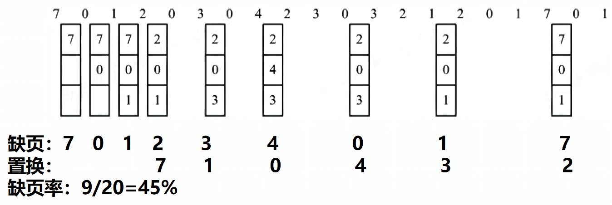
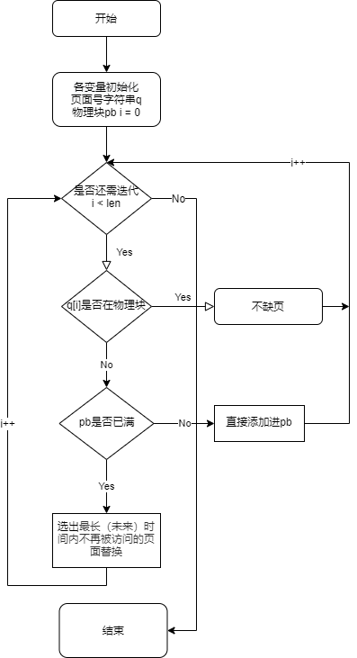
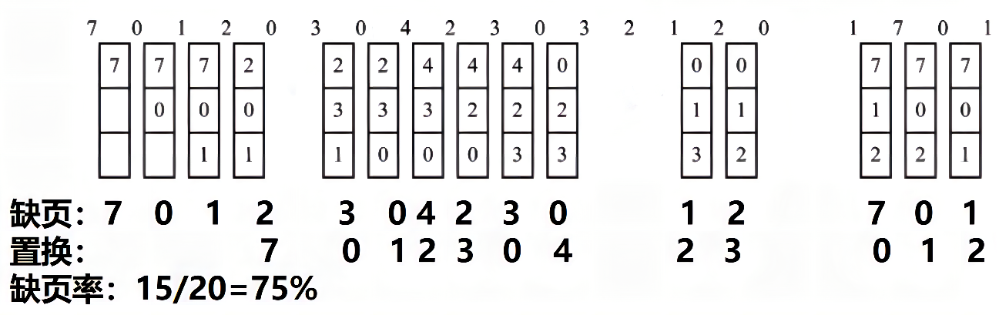
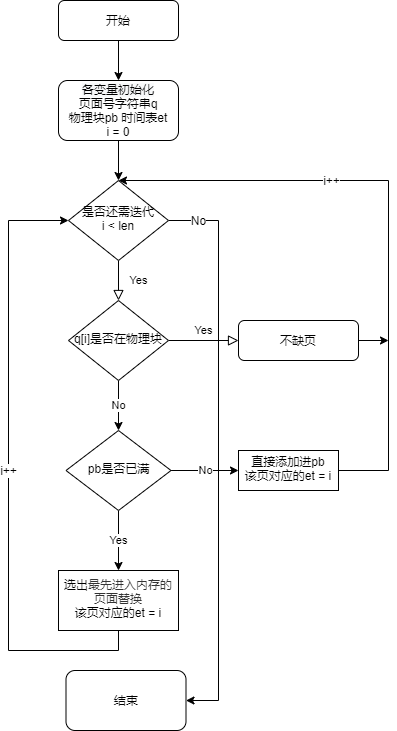
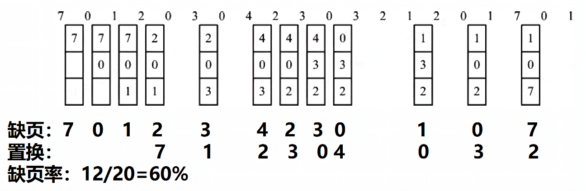
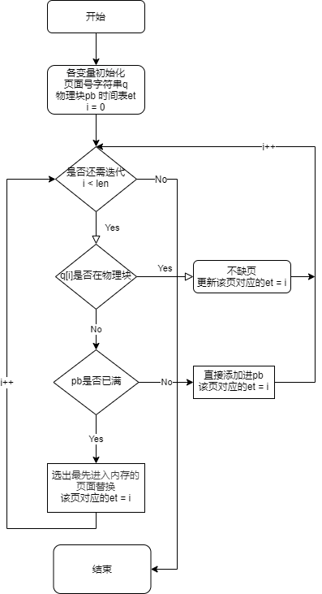
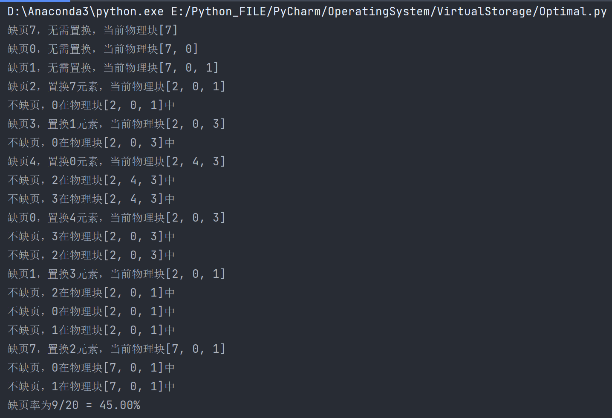
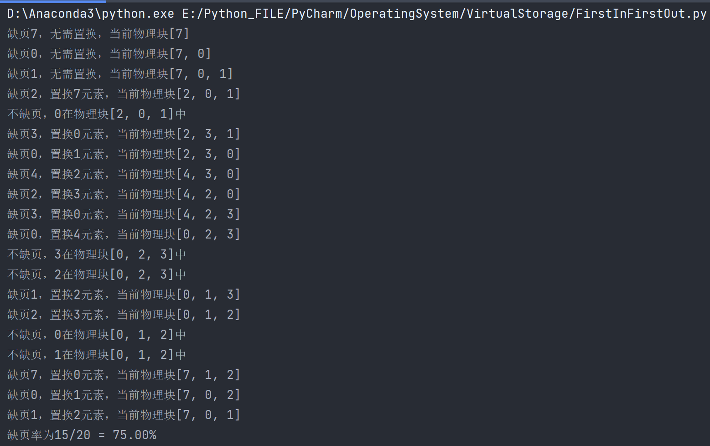
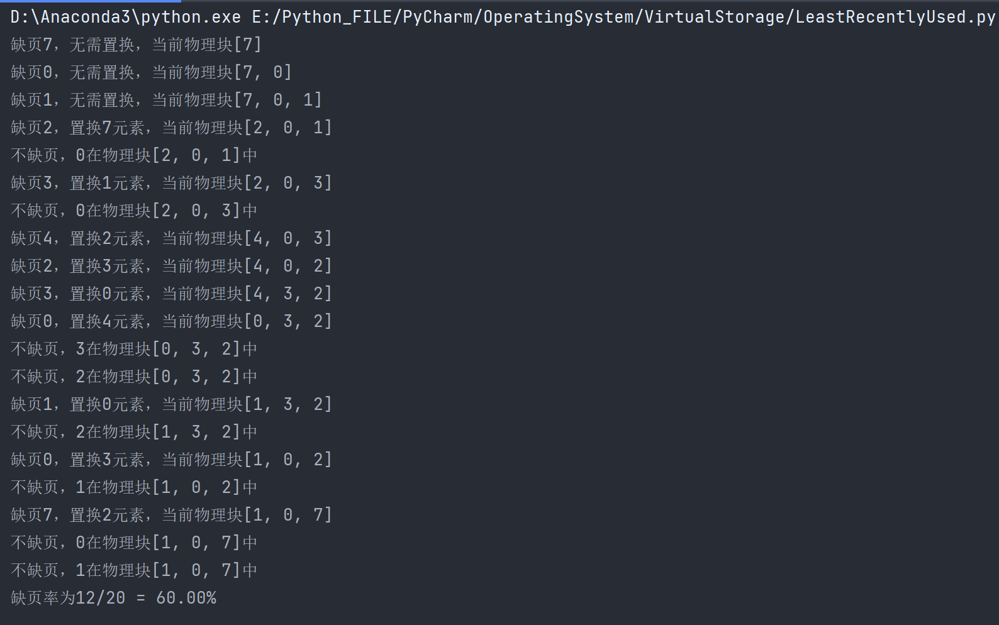

# 虚拟存储

实验内容：模拟请求分页虚拟存器管理技术中的硬件地址变换、缺页中断以及页式淘汰算法，处理缺页中断。

实验目的：清楚认识请求分页管理。

## <font color="#0066CC">最佳(Optimal)置换算法</font>

其所选择的被淘汰页面将是以后永不使用的，或许是在最长（未来）时间内不再被访问的页面。

- 采用最佳置换算法，可保证获得最低的缺页率。



流程图



## <font color="#0066CC">先进先出(FIFO)页面置换算法</font>

- 思想：淘汰最先进入内存的页面，即选择在内存驻留时间最长的页面予以淘汰。实现简单。 
- 实现：按页面调入内存的先后链结为队列，设置一个替换指针，总是指向最先进入内存的页面。
- 缺点：与进程实际运行规律不符，性能不好。
  - 该算法的出发点是最早调入内存的页面，其不再被访问的可能性会大一些。
- 该算法实现比较简单，对具有线性顺序访问的程序比较合适，而对其他情况效率不高。因为经常被访问的页面，往往在内存中停留最久，结果这些常用的页面却因变老而被淘汰。



## 

## <font color="#0066CC">LRU(Least Recently Used)置换算法</font>

基本原理：最近未访问的页面，将来一段时间也不会访问。

- 利用局部性原理，根据一个进程在执行过程中过去的页面访问踪迹来推测未来的行为。
- 最近的过去 → 最近的将来

思想：选择最近最久未使用的页面予以淘汰。 

-  利用页表中的访问字段，记录页面自上次被访问以来所经历的时间 t ，需要淘汰页面时，选择在内存页面中 t 值最大的，即最近最久未使用的页面予以淘汰。

该算法的出发点

- 如果某个页面被访问了，则它可能马上还要访问。反之，如果很长时间未被访问，则它在最近一段时间也不会被访问。

该算法的性能接近于最佳算法，但实现起来较困难。因为要找出最近最久未使用的页面，必须为每一页设置相关记录项，用于记录页面的访问情况，并且每访问一次页面都须更新该信息。这将使系统的开销加大，所以在实际系统中往往使用该算法的近似算法。





## 代码实现

### 数据结构和符号说明

**pageQueue**：页面号引用串

**pageNum**：物理块数目

**physicalBlock**：物理块，系统为其分配的虚拟存储空间

**missingNum**：缺页次数

**enterTime**：进入时间表

#### 最佳置换算法

- 采用最佳置换算法实现分页管理的缺页调度

##### python实现

```python
def optimal(pageNum, pageQueue):
    # 定义物理块,初始化缺页次数
    physicalBlock = []
    missingNum = 0
    for index, page in enumerate(pageQueue):
        # 查看本页是否在物理块中
        if page not in physicalBlock:
            # 缺页则再根据物理块情况判断
            missingNum += 1
            # 物理块充足时无需替换，直接加入物理块中
            if len(physicalBlock) < pageNum:
                physicalBlock.append(page)
                print(f"缺页{page}，无需置换，当前物理块{physicalBlock}")
            # 物理块不足时调用函数找出未来最远使用的一个
            else:
                farthest = findFarthest(pageQueue[index + 1:], physicalBlock)
                farIndex = physicalBlock.index(farthest)
                # 在物理块中替换
                physicalBlock[farIndex] = page
                print(f"缺页{page}，置换{farthest}元素，当前物理块{physicalBlock}")
        # 不缺页
        else:
            print(f"不缺页，{page}在物理块{physicalBlock}中")
    print("缺页率为{}/{} = {:.2%}".format(missingNum, len(pageQueue), missingNum / len(pageQueue)))


def findFarthest(alist, pblist):
    """找出物理块中最远使用的页面在物理块的索引以及页面号"""
    # 先默认要替换第一个页
    farthest = pblist[0]
    # 如果这个元素在后续列表中不存在，那么这是永远都用不到的，直接返回
    for item in pblist:
        if item not in alist:
            return item
    # index如果找不到会报错，故先行处理找不到的情况
    last = alist.index(pblist[0])
    # 遍历整个物理块
    for i in range(0, len(pblist)):
        # 如果这个元素比之前一个离得更远，就替换
        new = alist.index(pblist[i])
        if last < new:
            last = new
            farthest = pblist[i]
    return farthest


if __name__ == '__main__':
    # 设置分配的物理块数目
    # pageNum = int(input("请输入分配的物理块数目"))
    pageNum = 3
    # 接收输入的页面号引用串 并分割，int类型转换，转为列表
    # pageQueue = list(map(int, input("请输入页面号引用串").split()))
    pageQueue = [7, 0, 1, 2, 0, 3, 0, 4, 2, 3, 0, 3, 2, 1, 2, 0, 1, 7, 0, 1]
    optimal(pageNum, pageQueue)
```

##### java实现

```java
package com.process.virtualstorage;

import java.util.*;

public class Optimal {
    /**
     * 设置分配的物理块数目pageNum
     * 页面号引用串 pageQueue
     */
    int pageNum;
    ArrayList pageQueue;

    // 类唯一的构造器，只允许创建时直接确定好物理块数目一斤页面号引用串
    public Optimal(int pageNum, ArrayList pageQueue) {
        this.pageNum = pageNum;
        this.pageQueue = pageQueue;
    }

    public void run() {
        // 定义物理块,初始化缺页次数
        ArrayList physicalBlock = new ArrayList(pageNum);
        int missingNum = 0;
        int index = 0;
        Iterator itpQ = pageQueue.iterator();
        while (itpQ.hasNext()) {
            Object page = itpQ.next();
            // 查看本页是否在物理块中
            if (!physicalBlock.contains(page)) {
                // 缺页则再根据物理块情况判断
                missingNum++;
                // 物理块充足时无需替换，直接加入物理块中
                if (physicalBlock.size() < pageNum) {
                    physicalBlock.add(page);
                    System.out.println("缺页" + page + "，无需置换，当前物理块" + physicalBlock);
                    // 物理块不足时调用函数找出未来最远使用的一个
                } else {
                    List<Object> al = new ArrayList<Object>(pageQueue.subList(index+1, pageQueue.size()));
                    Object farthest = findFarthest((ArrayList) al,physicalBlock);
                    int farIndex = physicalBlock.indexOf(farthest);
                    // 在物理块中替换
                    physicalBlock.set(farIndex, page);
                    System.out.println("缺页" + page + "，置换" + farthest + "元素，当前物理块" + physicalBlock);
                }
                // 不缺页
            } else {
                System.out.println("不缺页，" + page + "在物理块" + physicalBlock + "中");
            }
            index++;
        }
        System.out.println("缺页率为" + missingNum + "/" + pageQueue.size() + " = " + missingNum* 100 / pageQueue.size()  + "%");
    }

    // 找出物理块中最远使用的页面在物理块的索引以及页面号
    public Object findFarthest(ArrayList alist, ArrayList pblist) {

        // 如果这个元素在后续列表中不存在，那么这是永远都用不到的，直接返回
        for (Object item : pblist) {
            if (!alist.contains(item))
                return item;
        }
        // 先默认要替换第一个页
        Object farthest = pblist.get(0);
        // index如果找不到会报错，故先行处理找不到的情况
        int last = alist.indexOf(pblist.get(0));
        // 遍历整个物理块
        for (Object item : pblist) {
            int now = alist.indexOf(item);
            // 如果这个元素比之前一个离得更远，就替换
            if (last < now) {
                last = now;
                farthest = item;
            }
        }
        return farthest;
    }
}


class TestO{
    public static void main(String[] args) {
        // 设置分配的物理块数目
        int pageNum = 3;
        // 初始化页面号引用串
        ArrayList pageQueue = new ArrayList();
        int[] array = {7, 0, 1, 2, 0, 3, 0, 4, 2, 3, 0, 3, 2, 1, 2, 0, 1, 7, 0, 1};
        for (int i :array){
            pageQueue.add(i);
        }
        Optimal op = new Optimal(pageNum, pageQueue);
        op.run();
    }
}
```



#### 先进先出算法

- 采用先进先出算法实现分页管理的缺页调度

##### python实现

```python
def fifo(pageNum, pageQueue):
    # 定义物理块,初始化缺页次数
    physicalBlock = []
    missingNum = 0
    # 时间记录表，记录物理块中各元素进入时间
    enterTime = []
    for index, page in enumerate(pageQueue):
        # 查看是否缺页
        if page not in physicalBlock:
            # 缺页则再根据物理块情况判断
            missingNum += 1
            # 物理块充足时无需替换，直接加入物理块中，并记录进入时间
            if len(physicalBlock) < pageNum:
                physicalBlock.append(page)
                enterTime.append(index)
                print(f"缺页{page}，无需置换，当前物理块{physicalBlock}")
            # 物理块不足时调用函数找出内存驻留时间最长的页面，即在enterTime值最小
            else:
                # 找到存在时间最长的元素
                longestTime = min(enterTime)
                # 获取要替换位置的索引
                timeIndex = enterTime.index(longestTime)
                longest = physicalBlock[timeIndex]
                # 根据索引进行替换，时间表物理块都进行替换
                physicalBlock[timeIndex] = page
                enterTime[timeIndex] = index
                print(f"缺页{page}，置换{longest}元素，当前物理块{physicalBlock}")
        # 不缺页
        else:
            print(f"不缺页，{page}在物理块{physicalBlock}中")
    print("缺页率为{}/{} = {:.2%}".format(missingNum, len(pageQueue), missingNum / len(pageQueue)))


if __name__ == '__main__':
    # 设置分配的物理块数目
    # pageNum = int(input("请输入分配的物理块数目"))
    pageNum = 3
    # 接收输入的页面号引用串 并分割，int类型转换，转为列表
    # pageQueue = list(map(int, input("请输入页面号引用串").split()))
    pageQueue = [7, 0, 1, 2, 0, 3, 0, 4, 2, 3, 0, 3, 2, 1, 2, 0, 1, 7, 0, 1]
    fifo(pageNum, pageQueue)
```

##### java实现

```java
package com.process.virtualstorage;

import java.util.ArrayList;
import java.util.Iterator;
import java.util.List;

public class FiFo {
    /**
     * 设置分配的物理块数目pageNum
     * 页面号引用串 pageQueue
     */
    int pageNum;
    ArrayList pageQueue;

    // 类唯一的构造器，只允许创建时直接确定好物理块数目一斤页面号引用串
    public FiFo(int pageNum, ArrayList pageQueue) {
        this.pageNum = pageNum;
        this.pageQueue = pageQueue;
    }

    public void run() {
        // 定义物理块,初始化缺页次数
        ArrayList physicalBlock = new ArrayList(pageNum);
        int missingNum = 0;
        int time = 0;
        //时间记录表，记录物理块中各元素进入时间 直接定义为整数型
        ArrayList<Integer> enterTime = new ArrayList<>(pageNum);
        Iterator itpQ = pageQueue.iterator();
        while (itpQ.hasNext()) {
            Object page = itpQ.next();
            // 查看本页是否在物理块中
            if (!physicalBlock.contains(page)) {
                // 缺页则再根据物理块情况判断
                missingNum++;
                // 物理块充足时无需替换，直接加入物理块中
                if (physicalBlock.size() < pageNum) {
                    physicalBlock.add(page);
                    enterTime.add(time);
                    System.out.println("缺页" + page + "，无需置换，当前物理块" + physicalBlock);
                    // 物理块不足时调用函数找出未来最远使用的一个
                } else {
                    int earindex = findEarliest(enterTime);
                    Object earliest = physicalBlock.get(earindex);
                    // 在物理块中替换
                    physicalBlock.set(earindex, page);
                    enterTime.set(earindex, time);
                    System.out.println("缺页" + page + "，置换" + earliest + "元素，当前物理块" + physicalBlock);
                }
                // 不缺页
            } else {
                System.out.println("不缺页，" + page + "在物理块" + physicalBlock + "中");
            }
            time++;
        }
        System.out.println("缺页率为" + missingNum + "/" + pageQueue.size() + " = " + missingNum * 100 / pageQueue.size() + "%");
    }

    // 找出物理块中最早进入的页面在物理块的索引
    public int findEarliest(ArrayList<Integer> tlist) {
        // 先默认第一个元素是最先进入的
        int earliest = tlist.get(0);
        int earindex = 0;
        // 遍历整个物理块
        for (int i = 0; i < tlist.size(); i++) {
            // 如果这个元素比之前一个更早进入，即对应数值更小，就替换
            if (earliest > tlist.get(i)) {
                earindex = i;
                earliest = tlist.get(i);
            }
        }
        return earindex;
    }
}

class TestFF {
    public static void main(String[] args) {
// 设置分配的物理块数目
        int pageNum = 3;
        // 初始化页面号引用串
        ArrayList pageQueue = new ArrayList();
        int[] array = {7, 0, 1, 2, 0, 3, 0, 4, 2, 3, 0, 3, 2, 1, 2, 0, 1, 7, 0, 1};
        for (int i :array){
            pageQueue.add(i);
        }
        FiFo ff = new FiFo(pageNum, pageQueue);
        ff.run();
    }
}
```



#### LRU算法

- 采用LRU算法实现分页管理的缺页调度。

与FIFO方法的区别在于要时刻更新进入时间表

##### python实现

```python
def lru(pageNum, pageQueue):
    # 定义物理块,初始化缺页次数
    physicalBlock = []
    missingNum = 0
    # 时间记录表，记录物理块中各元素进入时间
    enterTime = []
    for index, page in enumerate(pageQueue):
        # 查看是否缺页
        if page not in physicalBlock:
            # 缺页则再根据物理块情况判断
            missingNum += 1
            # 物理块充足时无需替换，直接加入物理块中，并记录进入时间
            if len(physicalBlock) < pageNum:
                physicalBlock.append(page)
                enterTime.append(index)
                print(f"缺页{page}，无需置换，当前物理块{physicalBlock}")
            # 物理块不足时调用函数找出内存驻留时间最长的页面，即在enterTime值最小
            else:
                # 找到存在时间最长的元素
                longestTime = min(enterTime)
                # 获取要替换位置的索引
                timeIndex = enterTime.index(longestTime)
                longest = physicalBlock[timeIndex]
                # 根据索引进行替换，时间表物理块都进行替换
                physicalBlock[timeIndex] = page
                enterTime[timeIndex] = index
                print(f"缺页{page}，置换{longest}元素，当前物理块{physicalBlock}")
        # 不缺页 更新时间表，当前使用的表
        else:
            # 获取要替换位置的索引
            timeIndex = physicalBlock.index(page)
            enterTime[timeIndex] = index
            print(f"不缺页，{page}在物理块{physicalBlock}中")
    print("缺页率为{}/{} = {:.2%}".format(missingNum, len(pageQueue), missingNum / len(pageQueue)))


if __name__ == '__main__':
    # 设置分配的物理块数目
    # pageNum = int(input("请输入分配的物理块数目"))
    pageNum = 3
    # 接收输入的页面号引用串 并分割，int类型转换，转为列表
    # pageQueue = list(map(int, input("请输入页面号引用串").split()))
    pageQueue = [7, 0, 1, 2, 0, 3, 0, 4, 2, 3, 0, 3, 2, 1, 2, 0, 1, 7, 0, 1]
    lru(pageNum, pageQueue)
```

##### java实现

```java
package com.process.virtualstorage;

import java.util.ArrayList;
import java.util.Iterator;

public class LRU {

    /**
     * 设置分配的物理块数目pageNum
     * 页面号引用串 pageQueue
     */
    int pageNum;
    ArrayList pageQueue;

    // 类唯一的构造器，只允许创建时直接确定好物理块数目一斤页面号引用串
    public LRU(int pageNum, ArrayList pageQueue) {
        this.pageNum = pageNum;
        this.pageQueue = pageQueue;
    }

    public void run() {
        // 定义物理块,初始化缺页次数
        ArrayList physicalBlock = new ArrayList(pageNum);
        int missingNum = 0;
        int time = 0;
        //时间记录表，记录物理块中各元素进入时间 直接定义为整数型
        ArrayList<Integer> enterTime = new ArrayList<>(pageNum);
        Iterator itpQ = pageQueue.iterator();
        while (itpQ.hasNext()) {
            Object page = itpQ.next();
            // 查看本页是否在物理块中
            if (!physicalBlock.contains(page)) {
                // 缺页则再根据物理块情况判断
                missingNum++;
                // 物理块充足时无需替换，直接加入物理块中
                if (physicalBlock.size() < pageNum) {
                    physicalBlock.add(page);
                    enterTime.add(time);
                    System.out.println("缺页" + page + "，无需置换，当前物理块" + physicalBlock);
                    // 物理块不足时调用函数找出未来最远使用的一个
                } else {
                    int earindex = findEarliest(enterTime);
                    Object earliest = physicalBlock.get(earindex);
                    // 在物理块中替换
                    physicalBlock.set(earindex, page);
                    enterTime.set(earindex, time);
                    System.out.println("缺页" + page + "，置换" + earliest + "元素，当前物理块" + physicalBlock);
                }
                // 不缺页
            } else {
                //获取要替换位置的索引
                int earindex = physicalBlock.indexOf(page);
                enterTime.set(earindex,time);
                System.out.println("不缺页，" + page + "在物理块" + physicalBlock + "中E01914168张丞");
            }
            time++;
        }
        System.out.println("缺页率为" + missingNum + "/" + pageQueue.size() + " = " + missingNum * 100 / pageQueue.size() + "%");
    }

    // 找出物理块中最早进入的页面在物理块的索引
    public int findEarliest(ArrayList<Integer> tlist) {
        // 先默认第一个元素是最先进入的
        int earliest = tlist.get(0);
        int earindex = 0;
        // 遍历整个物理块
        for (int i = 0; i < tlist.size(); i++) {
            // 如果这个元素比之前一个更早进入，即对应数值更小，就替换
            if (earliest > tlist.get(i)) {
                earindex = i;
                earliest = tlist.get(i);
            }
        }
        return earindex;
    }
}

class TestL {
    public static void main(String[] args) {
// 设置分配的物理块数目
        int pageNum = 3;
        // 初始化页面号引用串
        ArrayList pageQueue = new ArrayList();
        int[] array = {7, 0, 1, 2, 0, 3, 0, 4, 2, 3, 0, 3, 2, 1, 2, 0, 1, 7, 0, 1};
        for (int i :array){
            pageQueue.add(i);
        }
        LRU lr = new LRU(pageNum, pageQueue);
        lr.run();
    }
}
```



