### Salary python逆向

https://github.com/SKPrimin/HomeWork/ReverseEngineering/lab1_python

（选做）运行Salary.pyc，要求输出 flag 代表成功。

直接运行发现RuntimeError，magic number，这是类UNIX系统上文件的前几个字节的内容，它标志着该文件的类型。

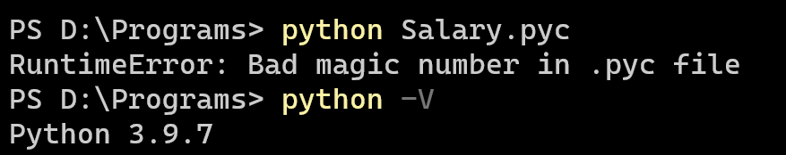

```bash
PS D:\Programs> python Salary.pyc
RuntimeError: Bad magic number in .pyc file
```

使用十六进制查看magic number，其为`0x0D42 = 3394`

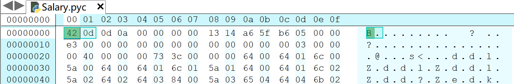

经过一番查找搜寻，我们发现所有的信息都在从importlib.util中的_RAW_MAGIC_NUMBER进入的配置文件里

```python
#     Python 3.7b5  3394 (restored docstring as the first stmt in the body;
#                         this might affected the first line number #32911)
```

此时我们当然可以直接下载python3.7版本，然后运行，但这不是捡了芝麻丢了西瓜吗？我们不能为了一题把整个电脑的配置环境搞得一团遭，好在此前我们曾经接触过anaconda，随后我们用如下命令创建一个python版本为3.7的虚拟环境：

```bash
conda create -n p37 python=3.7
```

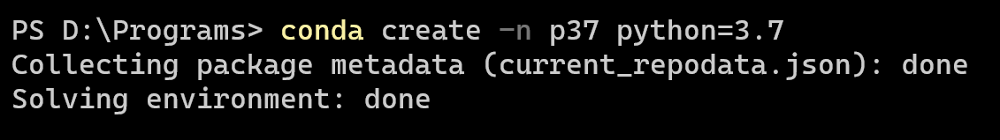

经过一系列创建下载后，虚拟环境创建成功。

随后我们找到 anaconda自带的命令行，再次激活 p37并进入，能够成功运行，显然这需要逆向查看源代码。

```bash
(base) PS D:\Programs> conda info -e  
# conda environments:
#
base                  *  D:\Anaconda3
p37                      D:\Anaconda3\envs\p37
```

```bash
conda activate p37
python Salary.pyc
```

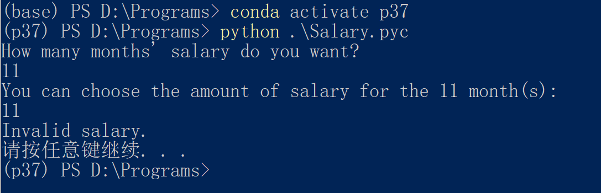

我们直接使用uncompyle6反编译得到python代码，当然也可以在 https://tool.lu/pyc/ 网站上反编译

```bash
uncompyle6 Salary.pyc > Salary.py
```

对源代码做如下的分析

```python
# uncompyle6 version 3.8.0
# Python bytecode 3.7.0 (3394)
# Decompiled from: Python 3.9.7 (default, Sep 16 2021, 16:59:28) [MSC v.1916 64 bit (AMD64)]
# Embedded file name: Salary.py
# Compiled at: 2020-11-07 11:27:15
# Size of source mod 2**32: 1462 bytes
import hashlib, random, os

def run():
    dword = [
     465, 293, 555, 151, 760, 370, 315, 817, 676, 840, 976, 240, 660, 691, 218, 578, 80, 933, 786,
     158, 622, 657, 952, 972, 924, 744, 635, 507, 451, 879]
    s = ''
    v12 = ''
    seed = 0
    print("How many months' salary do you want?")
    # 第一个输入数据，循环次数，要求大于0
    v5 = int(input())
    if v5 <= 0:
        print('You want too much!! Get Out!!')
        return
    print('You can choose the amount of salary for the', v5, 'month(s):')
    for i in range(v5):
        # 接收 v6 薪水数，取值(16, 65535)范围参与异或，一次则等效于直接赋值，低于16，seed直接出0
        v6 = int(input())
        if not v6 <= 16:
            if v6 > 65535:
                print('Invalid salary.')
                return
            seed = seed ^ v6

    i = seed
    v9 = 0
    while True:
        # i 不为0则参与运算
        if i:
            # v9 递增
            v9 = v9 + 1
            # i 同 i-1 与运算，根据性质，i为 2^n时直接清零，其余时：将二进制下最后一个1该为0
            i &= i - 1
        else:
            break
    # v9 必须等于 10，即要求i的二进制有 10 个 1,有多少个0无关紧要
    if v9 != 10:
        print("That's not for you.")
        return
    random.seed(seed) # 锁定随机数，随机数序列从此固定
    v10 = hashlib.md5()
    for i in range(30):
        # 随机生成数字字符串并拼接
        v9 = random.randint(0, 1000)
        s = s + str(v9)
        # md5.update  会将每次字符串拼接后再散列
        v10.update(s.encode())
        # v12 由随机数参与dword内容异或
        v12 = v12 + chr(v9 ^ dword[i])
    # 进行 MD5 验证，锁定只有一个能出来
    v11 = v10.hexdigest()
    if v11 != 'c29c475cae3bae204393f198b0cf33e3':
        print('Try different salaries, Your decision is a bit hasty')
        return
    print("\nYou've chosen the most suitable salary and here is your reward: The flag is nullcon{", v12, '}')


if __name__ == '__main__':
    run()
    os.system('pause')
# okay decompiling Salary.pyc

```

从此我们可知，我们需要得知seed的值，而seed值二进制表示中1的个数恒为10，这大大缩小了范围，如下是一种暴力破解方式。

```python
import random
from hashlib import md5

seed = 1023
dword = [465, 293, 555, 151, 760, 370, 315, 817, 676, 840, 976, 240, 660, 691, 218, 578, 80, 933, 786, 158, 622, 657, 952, 972, 924, 744, 635, 507, 451, 879]
while seed:
    if bin(seed).count('1') == 10:
        s = ''
        v12 = ''
        random.seed(seed)
        v10 = md5()
        for i in range(30):
            v9 = random.randint(0, 1000)
            print(v9)
            s = s + str(v9)
            v10.update(s.encode())
            v12 = v12 + chr(v9 ^ dword[i])
        v11 = v10.hexdigest()
        if v11 == 'c29c475cae3bae204393f198b0cf33e3':
            print('seed = ',seed )
            break
    seed += 1
```

我们得到`seed = 52111`，即我们输入的几个数异或结果必须为52111。

我们可以轻而易举的找到无数个满足条件的数

```
1  52111
2  51591 520 
……
```

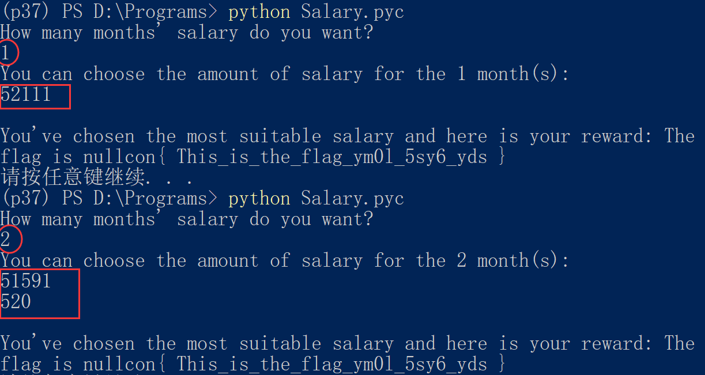


### elfpass 静态调试

把elfpass拷贝进seed虚拟机，设成root所有suid程序，用普通用户去攻击获得root权限。可以先静态分析，搞不定再用gdb动态调试。

直接使用IDA打开(后缀改为`.elf`)，映入眼帘的缩略图显示这是一个只有主函数的简单程序。

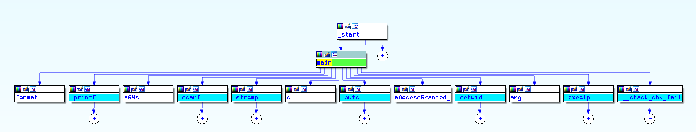

进入主函数

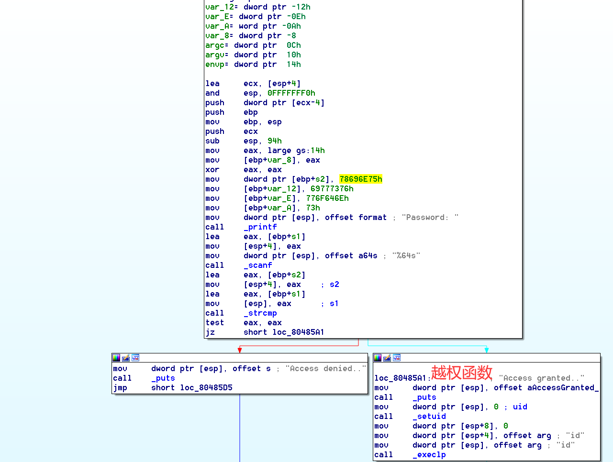

可见，程序进行了栈的初始化，开辟空间，并将几个数据压入栈中

```assembly
.text:08048524 ; int __cdecl main(int argc, const char **argv, const char **envp)
.text:08048524                 public main
.text:08048524 main            proc near               ; DATA XREF: _start+17o
.text:08048524
.text:08048524 s1              = byte ptr -7Ah
.text:08048524 s2              = byte ptr -16h
.text:08048524 var_12          = dword ptr -12h
.text:08048524 var_E           = dword ptr -0Eh
.text:08048524 var_A           = word ptr -0Ah
.text:08048524 var_8           = dword ptr -8
.text:08048524 argc            = dword ptr  0Ch
.text:08048524 argv            = dword ptr  10h
.text:08048524 envp            = dword ptr  14h
.text:08048524
.text:08048524                 lea     ecx, [esp+4]
.text:08048528                 and     esp, 0FFFFFFF0h
.text:0804852B                 push    dword ptr [ecx-4]
.text:0804852E                 push    ebp
.text:0804852F                 mov     ebp, esp
.text:08048531                 push    ecx
.text:08048532                 sub     esp, 94h
.text:08048538                 mov     eax, large gs:14h
.text:0804853E                 mov     [ebp+var_8], eax
.text:08048541                 xor     eax, eax 
.text:08048543                 mov     dword ptr [ebp+s2], 78696E75h
.text:0804854A                 mov     [ebp+var_12], 69777376h
.text:08048551                 mov     [ebp+var_E], 776F646Eh
.text:08048558                 mov     [ebp+var_A], 73h
```

`_printf` 和  `_scanf`即为输出函数与输入函数，可通过`scanf`参数`%64s`得知接收的是字符`s1`，并将收到的字符压入栈中

```assembly
mov     dword ptr [esp], offset format ; "Password: "
call    _printf
lea     eax, [ebp+s1]
mov     [esp+4], eax
mov     dword ptr [esp], offset a64s ; "%64s"
call    _scanf
```

`_strcmp`函数为字符串比较函数，此处使用`lea`和`mov`将`s2 s1`的地址送入栈中，s2在初始化时即已经存在于栈中。

```assembly
lea     eax, [ebp+s2]
mov     [esp+4], eax    ; s2
lea     eax, [ebp+s1]
mov     [esp], eax      ; s1
call    _strcmp
```

而想要执行特权函数`loc_80485A1`就必须通过下面两条指令

```bash
test    eax, eax 
jz      short loc_80485A1
```

-  `est`对两个参数(目标，源)执行AND逻辑操作，`jz` 结果为0则设置ZF零标志为1，跳转。
- 在此处意思即当eax的值等于０时跳转。

至此，我们大致可以推断出，该程序，将输入的字符与原有的进行对比，如果相同，则会跳转到特权函数。我们将字符值提取出来为。0x78696e75，0x69777376，0x776f646e，0x73转为字符即：xinu，iwsv，wodn，s

再转为正确的顺序，即可得到：`unixvswindows`

运行，获得root权限

```bash
sudo chown root:root elfpass 
sudo chmod 4755 elfpass 
elfpass
```

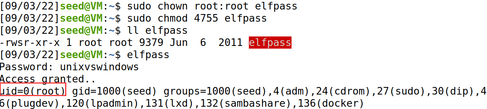

我们也可以找到主函数`main`，一键F5反汇编

```c
int __cdecl main(int argc, const char **argv, const char **envp)
{
  int result; // eax@4
  int v4; // edx@4
  char s1; // [sp+1Eh] [bp-7Ah]@1
  char s2[4]; // [sp+82h] [bp-16h]@1
  int v7; // [sp+90h] [bp-8h]@1

  v7 = *MK_FP(__GS__, 20);
  strcpy(s2, "unixvswindows");
  printf("Password: ");
  scanf("%64s", &s1);
  if ( !strcmp(&s1, s2) )
  {
    puts("Access granted..");
    setuid(0);
    execlp("id", "id", 0);
  }
  else
  {
    puts("Access denied..");
  }
  result = 0;
  v4 = *MK_FP(__GS__, 20) ^ v7;
  return result;
}
```

### win python 逆向

3运行win.pyc，要求输出'You Win'代表成功。

```bash
uncompyle6 win.pyc > win.py
```

反编译得到如下所示：

```python
# uncompyle6 version 3.8.0
# Python bytecode 2.7 (62211)
# Decompiled from: Python 3.9.7 (default, Sep 16 2021, 16:59:28) [MSC v.1916 64 bit (AMD64)]
# Embedded file name: d:/idf.py
# Compiled at: 2014-12-21 10:28:24


def encrypt(key, seed, string):
    rst = []
    for v in string:
        rst.append((ord(v) + seed ^ ord(key[seed])) % 255)
        seed = (seed + 1) % len(key)

    return rst


if __name__ == '__main__':
    print "Welcome to idf's python crackme"
    flag = input('Enter the Flag: ')
    KEY1 = 'Maybe you are good at decryptint Byte Code, have a try!'
    KEY2 = [124, 48, 52, 59, 164, 50, 37, 62, 67, 52, 48, 6, 1, 122, 3, 22, 72, 1, 1, 14, 46, 27, 232]
    en_out = encrypt(KEY1, 5, flag)
    if KEY2 == en_out:
        print 'You Win'
    else:
        print 'Try Again !'
# okay decompiling win.pyc
```

通过分析关键过程

```bash
num = (ord(v) + seed ^ ord(key[seed])) % 255
```

```
num = (ord(v) + seed ^ ord(key[seed])) % 255
		↓
ord(v) + seed = num ^ ord(key[seed]) %255
		↓
ord(v) = ((num ^ key[seed]) % 255) - seed
```

得到解密核心

```
((num ^ key[seed]) % 255) - seed
```

写出解密程序

```python
def decrypt(key, seed, KEY2):
    rst = []
    for num in KEY2:
        rst.append(((num ^ key[seed]) % 255) - seed)
        seed = (seed + 1) % len(key)
    return rst


if __name__ == '__main__':
    KEY1 = b'Maybe you are good at decryptint Byte Code, have a try!'
    KEY2 = [124, 48, 52, 59, 164, 50, 37, 62, 67, 52, 48, 6, 1, 122, 3, 22, 72, 1, 1, 14, 46, 27, 232]
    de_out = decrypt(KEY1, 5, KEY2)
    s = ''.join([chr(i) for i in de_out])
    print(s)
```

运行得到：

```
WCTF{ILOVEPYTHONSOMUCH}
```

随后接着使用anaconda创建python2.7的虚拟环境

```
 conda create -n p27 python=2.7
```

```
conda activate p37
python Salary.pyc
```

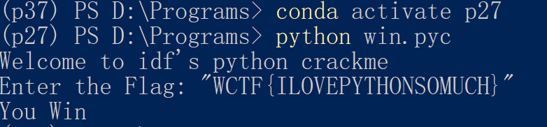


### crackme 逆向

5. （选做）crackme文件拷贝进seed虚拟机，运行，要求输出'Congratulations!'代表成功。

使用IDA静态调试，发现程序结构更为简单

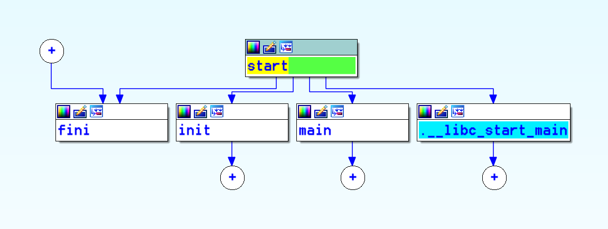

发现关键函数

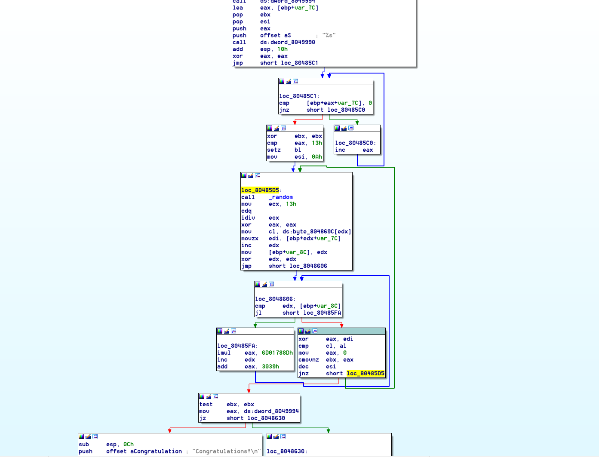

对其反编译发现，如下

```c
int sub_8048591()
{
  int i; // eax@1
  int v1; // ebx@4
  signed int v2; // esi@4
  __int32 v3; // edx@5
  int v4; // eax@5
  char v5; // cl@5
  char v6; // di@5
  int v7; // edx@5
  int result; // eax@12
  int v9; // [sp+18h] [bp-8Ch]@5
  char v10[124]; // [sp+28h] [bp-7Ch]@1

  dword_8049994("Password, please? ");
  dword_8049990("%s", v10); 
  for ( i = 0; v10[i]; ++i )
    ; // 获取 v10的长度
  v1 = i == 19; // 判断 v10的长度是否为19
  v2 = 10;
  do
  {
    v3 = random() % 19;
    v4 = 0;
    v5 = byte_804869C[v3];
    v6 = v10[v3];
    v9 = v3 + 1;
    v7 = 0;
    while ( v7 < v9 ) //根据v3值确定v4值
    {
      ++v7;
      v4 = 1828812941 * v4 + 12345;
    }
    if ( v5 != ((unsigned __int8)v6 ^ (unsigned __int8)v4) ) //byte_804869C[v3] != v10[v3] ^ v4
      v1 = 0;
    --v2;
  }
  while ( v2 ); // 执行 v2=10 次循环
  if ( v1 )  // 若 输入19个 且 byte_804869C[v3] == v10[v3] ^ v4 一直成立，成功
    result = dword_8049994("Congratulations!\n");
  else
    result = dword_8049994("Oops..\n");
  return result;
}
```

一路追查发现数组

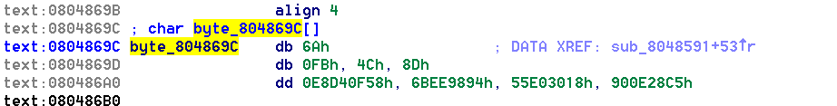

推理

```python
byte_array = [0x6a, 0xfb, 0x4c, 0x8d, 0x58, 0x0F, 0xD4, 0xE8, 0x94, 0x98, 0xEE, 0x6B, 0x18, 0x30, 0xE0, 0x55, 0xC5, 0x28, 0x0E, 0x90]

v4 = 0
result = []
for i in range(19):
    v4 = -115 * v4 + 57
    v4 &= 255
    result.append(chr(byte_array[i] ^ v4))

print(''.join(result))
```

```python
SesameOpenYourself!
```

赋权执行

```
chmod +x crackme
```

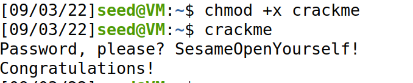


### LEC RSA

> cipher text
>  {920139713,19}
>
> 704796792, 752211152, 274704164, 18414022, 368270835, 483295235, 263072905, 459788476, 483295235, 459788476, 663551792, 475206804, 459788476, 428313374, 475206804, 459788476, 425392137, 704796792, 458265677, 341524652, 483295235, 534149509, 425392137, 428313374, 425392137, 341524652, 458265677, 263072905, 483295235, 828509797, 341524652, 425392137, 475206804, 428313374, 483295235, 475206804, 459788476, 306220148

{920139713,19}我们猜测可能是RSA的公钥{N, e}，其中第一个数920139713 = 18443 × 49891两个质数相乘，第二个数是质数。更加印证了我们的猜想。随后逐个破解密文。

```python
import gmpy2 
 cipher = [704796792, 752211152, 274704164, 18414022, 368270835, 483295235, 263072905, 459788476, 483295235, 459788476, 663551792, 475206804, 459788476, 428313374, 475206804, 459788476, 425392137, 704796792, 458265677, 341524652, 483295235, 534149509, 425392137, 428313374, 425392137, 341524652, 458265677, 263072905, 483295235, 828509797, 341524652, 425392137, 475206804, 428313374, 483295235, 475206804, 459788476, 306220148] 
 
 n = 920139713 
 e = 19 
 p, q = 49891, 18443 
 
 phi = (p-1)*(q-1) 
 d = gmpy2.invert(e, phi) 
 for c in cipher: 
   print(chr(gmpy2.powmod(c, d, n)), end="")
```

得到

> flag{13212je2ue28fy71w8u87y31r78eu1e2}
