# 逆向工程 .NET 逆向

## 1 .NET逆向

1. 阅读
    https://blog.csdn.net/cnhk1225/article/details/53568996
    然后回答问题：
    What does this code do?

```c#
Optimizing csc .NET compiler from MSVS 2015 (/o switch), ildasm output:
  .method public hidebysig static bool  f(char a) cil managed
  {
    // Code size       26 (0x1a)
    .maxstack  8
    IL_0000:  ldarg.0				//参数1入栈
    IL_0001:  ldc.i4.s   97			//32位数97入栈
    IL_0003:  blt.s      IL_000c	//小于则跳转到IL_000c

    IL_0005:  ldarg.0				//参数1入栈
    IL_0006:  ldc.i4.s   122		//32位数122入栈
    IL_0008:  bgt.s      IL_000c	//大于则跳转到IL_000c

    IL_000a:  ldc.i4.1				//数值1入栈
    IL_000b:  ret					//返回 (返回1)

    IL_000c:  ldarg.0				//参数1入栈
    IL_000d:  ldc.i4.s   65			//32位数65入栈
    IL_000f:  blt.s      IL_0018	//小于则跳转IL_0018

    IL_0011:  ldarg.0				//参数1入栈
    IL_0012:  ldc.i4.s   90			//32位数90入栈
    IL_0014:  bgt.s      IL_0018	//大于则跳转

    IL_0016:  ldc.i4.1				//数值1入栈
    IL_0017:  ret					//返回
	
    IL_0018:  ldc.i4.0				//数值0入栈
    IL_0019:  ret					//返回
  } // end of method some_class::f
```
一样的代码，只不过换成了Java语言

```java
  Java 1.8 compiler:
  public boolean f(char);
    descriptor: (C)Z
    flags: ACC_PUBLIC
    Code:
      stack=2, locals=2, args_size=2
         0: iload_1					//参数1入栈
         1: bipush       97		  //97入栈
         3: if_icmplt     14		//小于则跳转到14
         6: iload_1
         7: bipush       122
         9: if_icmpgt     14		//大于则跳转14
        12: iconst_1				//const 1入栈
        13: ireturn					//返回
        14: iload_1
        15: bipush       65
        17: if_icmplt     28
        20: iload_1
        21: bipush       90
        23: if_icmpgt     28
        26: iconst_1
        27: ireturn
        28: iconst_0				//const 0入栈
        29: ireturn
```

代码功能是判断传入的char的ascii码是否在`65~90`或`97~122`之间。

## 2文件隐写


2. 2017bath这张图片有一些文字片段，可能简单加密了，是某人说的，此人的姓名是什么？
    hint：hex editor

使用binwalk操作图片，可见其中隐藏了一个rar文件。

```bash
# 查看 文件组成
binwalk 2017bath.jpg

# 将文件中隐藏的东西分离出来
binwalk -e 2017bath.jpg
```

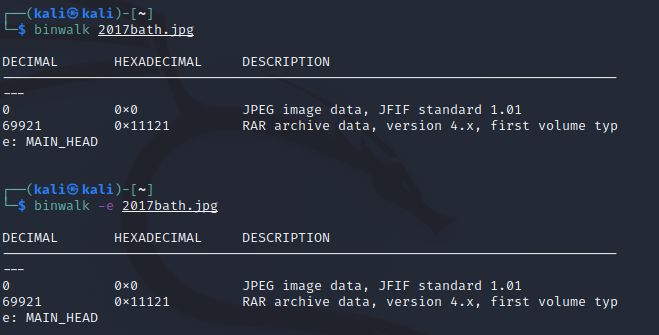

查看文件内容，是一段密码，根据其名字 rail Fence猜测是栅栏密码。


```
CrudreasrsheheanaulhfouCmhlaopiaeifltouermrtdpiyeCntpmafhnpbgmbaoagspeuteuwtecwokpetwutileolctnreoicottievhetepriogoseIretodaiithgottfeorhersnueualtebtfamtnseetehrnieipooilrshashyhsrmttmanariaictntgutdeeonmotaudeowuselctnfeoghrtsbaCrgarhtbprthcirarQktodbeateesa
```

使用脚本进行暴力破解：

```python
import re

cipher = '''CrudreasrsheheanaulhfouCmhlaopiaeifltouermrtdpiyeCntpmafhnpbgmbaoagspeuteuwtecwokpetwutileolctnreoicottievhetepriogoseIretodaiithgottfeorhersnueualtebtfamtnseetehrnieipooilrshashyhsrmttmanariaictntgutdeeonmotaudeowuselctnfeoghrtsbaCrgarhtbprthcirarQktodbeateesa'''


def deRailFence(chipher, space):
    plain = ""
    for i in range(0, space):
        for j in range(i, len(chipher), space):
            plain += chipher[j]
    return plain


if __name__ == "__main__":
    plainDict = {}
    for i in range(len(cipher)):
        plain = deRailFence(cipher, i)
        # 正则表达式识别出超高频单词
        words = re.findall('is|be|the|and|of|have|to', plain, flags=0)
        print(f'本明文{plain}\n包含 {len(words)} 个超高频单词，分别是{words}\n')
        plainDict[plain] = len(words)
    # 将字典按照元素值进行逆序排序
    plainDict = dict(sorted(plainDict.items(), key=lambda i: i[1], reverse=True))
	
    # 选出前五个最有可能的选项
    print("其中最有可能是有意义文字的是:")
    for i, (k, v) in enumerate(plainDict.items()):
        if i in range(0, 5):
            print(v, k)

```

运行结果如下

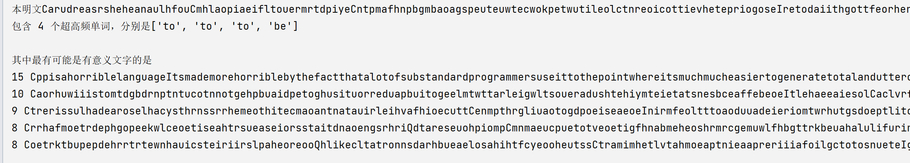

将最有可能的筛选出来，发现确实是一段有意义的英文，加上空格，可读

```
Cpp is a horrible language Its made more horrible by the fact that a lot of substandard programmers use it to the point where its much much easier to generate total and utter crap with it Quite frankly even if the choice of C were to do nothing but keep the Cpp programmers out that in itself would be a huge reason to use Ca
```

查阅可知，这是Linus炮轰C++:《糟糕程序员的垃圾语言》时说的话，即此人的姓名是`Linus·Benedict·Torvalds`

## 3 CrackMe1.exe  NET逆向


2. 运行CrackMe1.exe，提示 "嗯，对了" 代表成功。首先修改exe使得出现成功提示，其次不修改exe输入正确的密码达到成功的目的。
     hint:https://blog.csdn.net/Nagi_Way/article/details/68961121

使用Reflector进行分析，在Form1处找到了相关的源代码。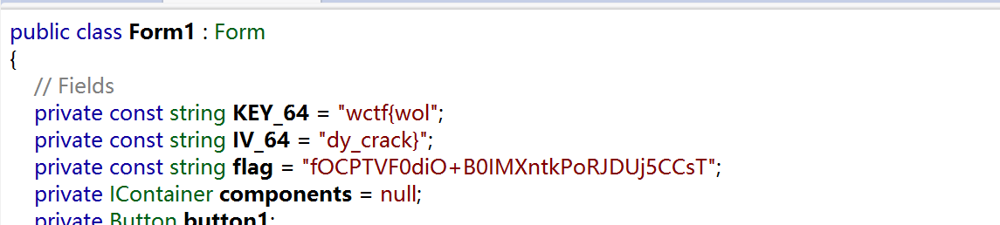

……

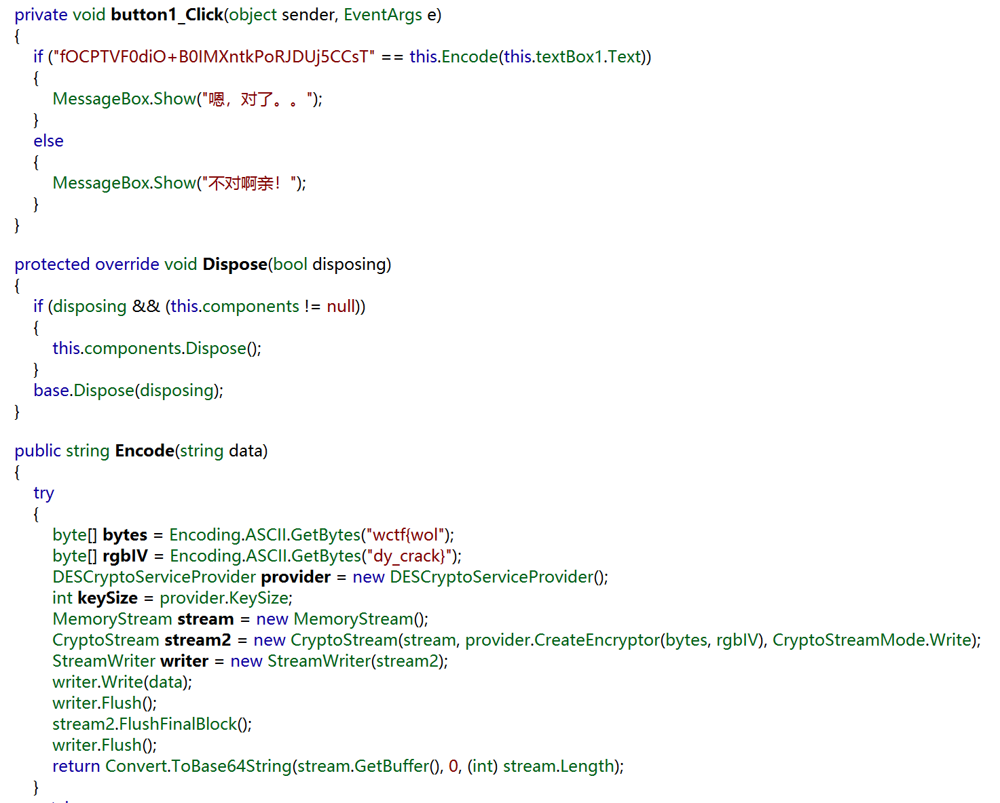

可见其中的核心便是

```c#
 if ("fOCPTVF0diO+B0IMXntkPoRJDUj5CCsT" == this.Encode(this.textBox1.Text))
```

其中Encode函数如下：

```C#
 public string Encode(string data)
    {
        try
        {
            byte[] bytes = Encoding.ASCII.GetBytes("wctf{wol");
            byte[] rgbIV = Encoding.ASCII.GetBytes("dy_crack}");
            DESCryptoServiceProvider provider = new DESCryptoServiceProvider();
            int keySize = provider.KeySize;
            MemoryStream stream = new MemoryStream();
            CryptoStream stream2 = new CryptoStream(stream, provider.CreateEncryptor(bytes, rgbIV), CryptoStreamMode.Write);
            StreamWriter writer = new StreamWriter(stream2);
            writer.Write(data);
            writer.Flush();
            stream2.FlushFinalBlock();
            writer.Flush();
            return Convert.ToBase64String(stream.GetBuffer(), 0, (int) stream.Length);
        }
```

可见，这是一个DES加密，选择，解密模式`CBC`，编码方式`Base64`，密钥`wctf{wol`，偏移量`dy_crack`，解密成功：

```
wctf{dotnet_crackme1}
```


## 4CrackMe1.exe进阶 修改程序


2. （选做）修改CrackMe1.exe使得：只有输入你的学号才能出现成功提示。并且把“大家好...net”这段话全部换成自己自定义的英文。

### Reflexil插件

首先按照同样的参数，对自己的学号进行加密，得到`dlEUw9/4PddgNjNvrzftBQ==`

我们可以使用高端插件[Reflexil](https://github.com/sailro/Reflexil)

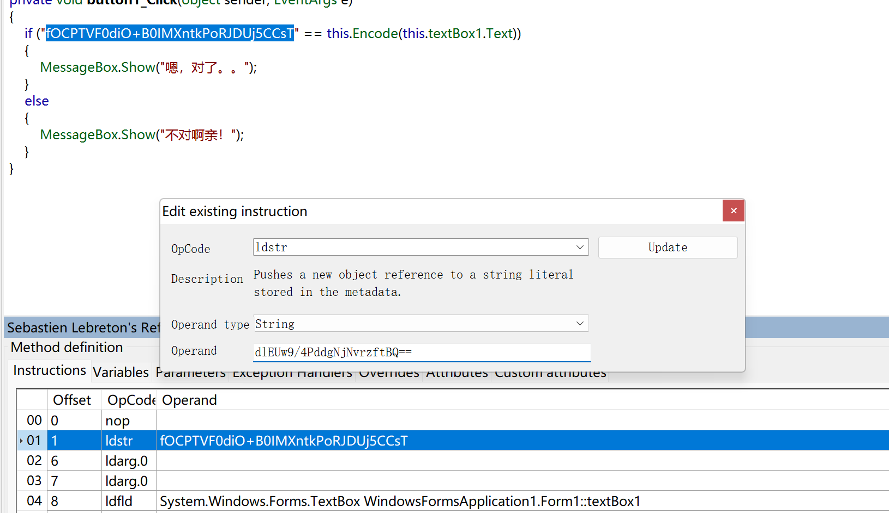

文字部分均在 InitializeComponent函数中，进行逐个修改即可。

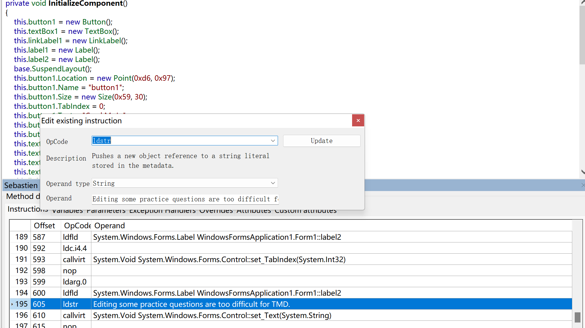

修改后，保存

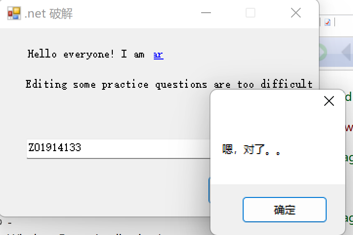

### Hxd逐字节编辑

当然我们也可以朴实无华的逐字节修改

##### 修改密文

为了最小化修改，我们控制字符长度。wctf{dotnetZ01914133}，加密为`fOCPTVF0diOYHGrv4GU8vAvoKya+xKMq`

找到存放`fOCPTVF0diO+B0IMXntkPoRJDUj5CCsT`的地方进行逐个替换，使用著名的16进制编辑器Hxd

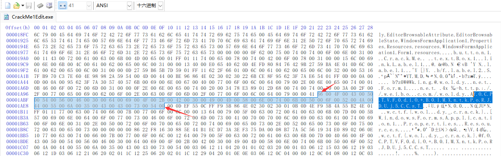

编写脚本来实现转换

```python
>>> "".join([hex(ord(i))[2:]+'00' for  i in "fOCPTVF0diOYHGrv4GU8vAvoKya+xKMq"])
'66004f00430050005400560046003000640069004f005900480047007200760034004700550038007600410076006f004b00790061002b0078004b004d007100'
```

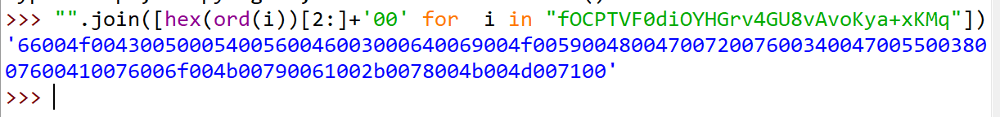

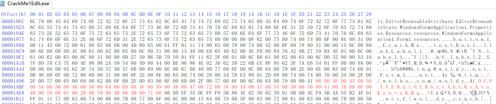

保存文件，也能成功破解

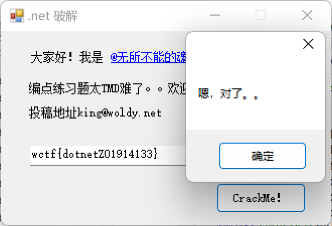

##### 汉字替换

###### 主内容替换

根据文本中仅有的英文`TMD`我们定位到文本的位置，在其后紧跟着的两个汉字`难了`所对应的编码为`BE 96 86 4E`，经过[查询](https://www.qqxiuzi.cn/bianma/zifuji.php)得知，其所对应的正是Unicode编码 `难：000096BE` 、`了：00004E86`。

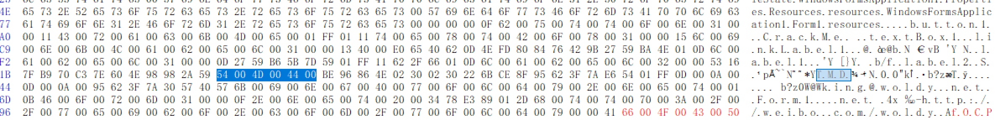

再次查询发现 `编：7F16`、  `点：70B9` 、 `练：7EC3`于是基本可以确定这块长度为0x52的空间内存放的内容便是`编点练习题太TMD难了。。欢迎投稿哦！投稿地址king@woldy.net`，而空间前的`53`便是该部分长度加上其自身。

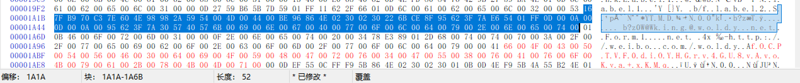

我们计划使用`0x52÷2 = 41`个字符代替。

```python
>>> "".join([hex(ord(i))[2:]+'00' for  i in "Edit some exercises is too TMD difficult!"])
'4500640069007400200073006f006d0065002000650078006500720063006900730065007300200069007300200074006f006f00200054004d004400200064006900660066006900630075006c0074002100'
```

替换完成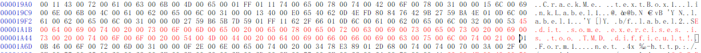

###### 称呼替换

接下来是替换`大家好！我是@...` ，根据前面提示的`0D`，判断该部分内容到此为止了，我们使用6个字符替换


```python
>>> "".join([hex(ord(i))[2:]+'00' for  i in "Hello!"])
'480065006c006c006f002100'
```

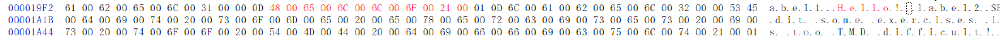

###### 作者替换

最后的文字是`@无所不能的魂大人`， `@：0040`、  `无：65E0` 、 `所：6240` 、……、`人：4EBA`。

遂轻车熟路的找到了位置。

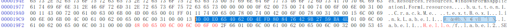

9个字符替换

```python
>>> "".join([hex(ord(i))[2:]+'00' for  i in "Collapsar"])
'43006f006c006c0061007000730061007200'
```

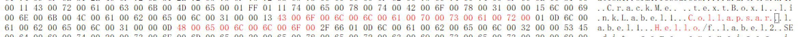

保存文件，运行

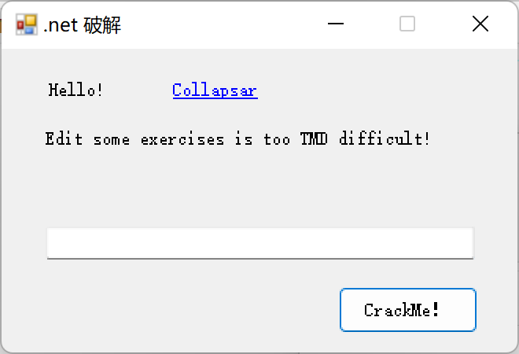

已然修改完成。

## 5login.exe .NET逆向


2. 运行login.exe，提示 "You Get It!" 代表成功。

照例使用Reflector逆向分析，果然发现了Form1

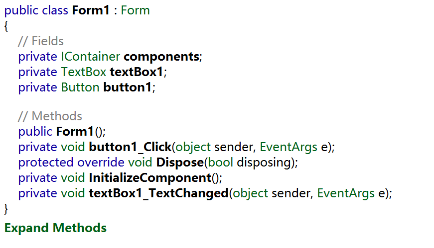

根据该程序朴实无华的界面，我们推测`button1_Click()`函数暗藏玄只因。

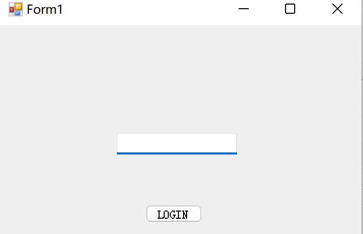

点击进入该函数，果然发现了其核心的对比过程。

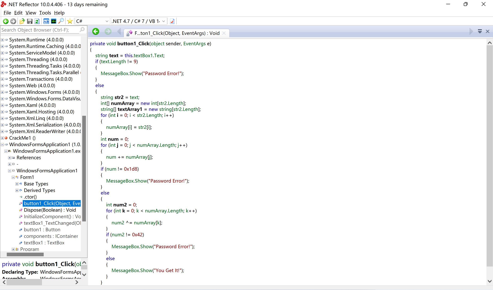

```c#
private void button1_Click(object sender, EventArgs e)
{
    string text = this.textBox1.Text; // 接收输入的内容
    if (text.Length != 9) // 判断输入的长度是否为9
    {
        MessageBox.Show("Password Error!");
    }
    else
    {
        string str2 = text; // 传递字符串
        int[] numArray = new int[str2.Length]; // int类型的数组，在此后存储输入的内容，并由其参与运算
        string[] textArray1 = new string[str2.Length];  // 来搞笑的
        for (int i = 0; i < str2.Length; i++) // 将字符串中的字符存入int类型的数组中，即存储的是其ASCII码
        {
            numArray[i] = str2[i];
        }
        int num = 0; //累加求和，总和必须是0x1d8 = 472
        for (int j = 0; j < numArray.Length; j++)
        {
            num += numArray[j];
        }
        if (num != 0x1d8) 
        {
            MessageBox.Show("Password Error!");
        }
        else
        {
            int num2 = 0; //累计抑或，异或后为0x42 = 0b0100 0010
            for (int k = 0; k < numArray.Length; k++)
            {
                num2 ^= numArray[k];
            }
            if (num2 != 0x42)
            {
                MessageBox.Show("Password Error!");
            }
            else
            {
                MessageBox.Show("You Get It!");
            }
        }
    }
}
```

综上我们可以得知，我们要构造一个长度为`9`的字符串，ASCII码和为`0x1d8 = 472`，ASCII码异或为`0x42 = 0b0100 0010 = 66`。

#### 爆破

我们当然可以暴力破解，但9个字符还要运算还是比较难的。由于只要有一个正确答案即可，我们可以随机生成字符串

```python
import random


def RanStr(len):
    # 指定包含数字、大小写字母、特殊符号的字符集
    string = "1234567890abcdefghijklmnopqrstuvwxyzABCDEFGHIJKLMNOPQRSTUVWXYZ!@#$%^&*()_+=-"
    # 取9位组成字符串的ascii数组
    ranstr = []
    for i in range(len):
        ranstr.append(ord(random.choice(string)))
    return ranstr


while True:
    rasc = list(RanStr(9))
    if sum(rasc) == 0x1d8:
        xor = 0
        for j in rasc:
            xor ^= j
        if xor == 0x42:
            print(f"{rasc} ==> {''.join([chr(i) for i in rasc])}")
            # exit(0)
```

```
[40, 66, 64, 41, 76, 54, 48, 45, 38] ==> (B@)L60-&
[37, 42, 43, 67, 66, 35, 56, 57, 69] ==> %*+CB#89E
[75, 35, 53, 42, 38, 40, 43, 81, 65] ==> K#5*&(+QA
[36, 50, 75, 43, 65, 66, 57, 43, 37] ==> $2K+AB9+%
[35, 52, 35, 76, 43, 66, 89, 35, 41] ==> #4#L+BY#)
[40, 65, 68, 54, 38, 40, 52, 74, 41] ==> (AD6&(4J)
[40, 41, 48, 33, 87, 77, 37, 73, 36] ==> ()0!WM%I$
……
```

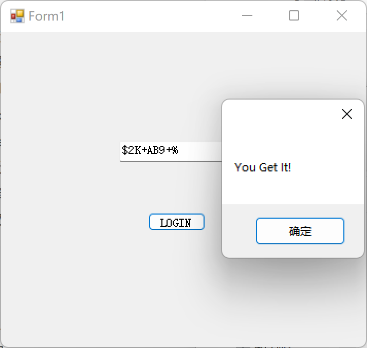

#### 手算

事实上，根据三个关键数据，我们也可以直接手算

> - 由于异或结果必须为 66,先生成一个66即字母B，随后让其他8个数能够两两相等即可，472-66 = 406
>
> - 剩下放入6个50即数字2，406-6×50 = 106
>
> - 接着平分 放入两个53即数字5，刚好满足

果然成功

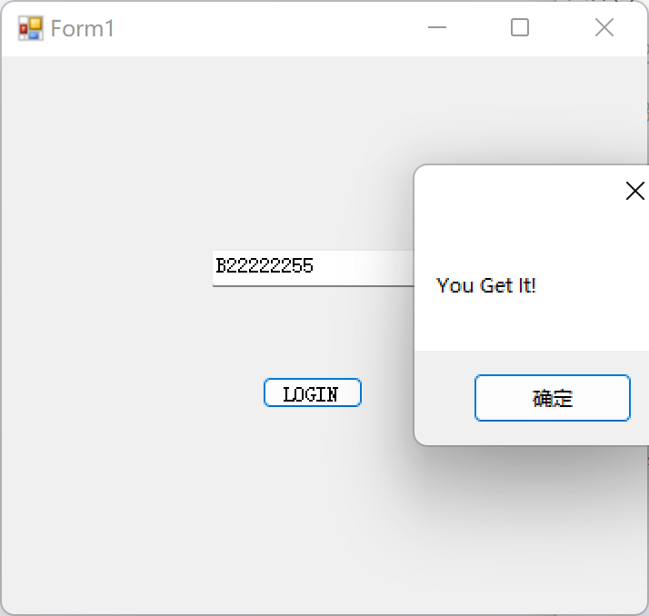

## The Garden of sinners.jpg

hint：shift+6

图片无法直接打开，显然是加密了，使用Hex查看器发现，文件头已经损坏

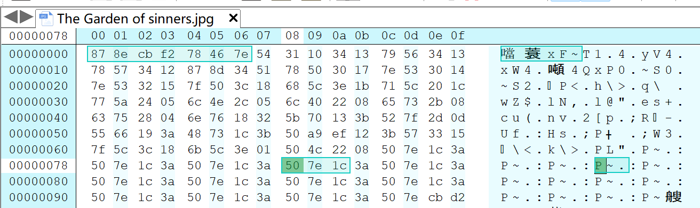

这时，我们注意到在其中多次出现`50 7e 1c 3a`组合，合理推测是被一串长度为4的密码加密了，根据提示的<kbd>shift</kbd>+<kbd>6</kbd>。我们按出了`^`，推测加密的方式为与密码进行异或运算。

我们打开一个正常的jpg文件，可以与之进行对照

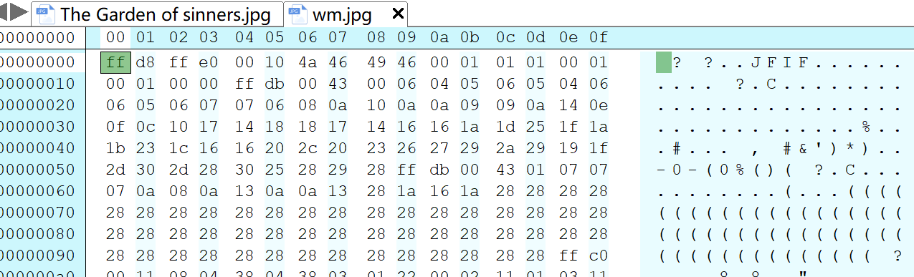

经过查阅文件头

| 文件类型                                    | 后缀     | 文件头      | 对应字符 |
| :------------------------------------------ | :------- | :---------- | :------- |
| JPEG raw or in the JFIF or Exif file format | jpg      | FF D8 FF E0 | ÿØÿà     |
| JPEG raw                                    | jpg jepg | FF D8 FF DB | ÿØÿÛ     |
| JPEG raw                                    | jpg jepg | FF D8 FF EE | ÿØÿî     |

锁定jpeg前三个文件头内容为`FF D8 FF` ，而加密文件是：`87 8e cb`，异或运算得到密码前三位 `78 56 34`

```python
>>> hex(0xff ^ 0x87)
'0x78'
>>> hex(0xd8^0x8e)
'0x56'
>>> hex(0xff^0xcb)
'0x34'
```

我们推测最后一位是不是`12`呢？计算得到：

```python
>>> hex(0xf2^0x12)
'0xe0'
```

而`FF D8 FF E0`恰好是jpg专属文件头。即我们得到了密码，`78 56 34 12`，对于异或运算，加密再加密即可得到原文。编写脚本。

```python
import struct

password = [0x78, 0x56, 0x34, 0x12]
decrypic = []
with open("imageDecrypt.jpg", 'wb') as fd:
    with open('image.jpg', 'rb') as f:
        byte = f.read()
        i = 0
        for b in byte:
            a = b ^ password[i % 4]
            i += 1

            fd.write(struct.pack('B', a))
        print(decrypic)

    fd.close()

```

解密完成后得到图片


