## 1、Java Bytecode Reversing and Patching Exercise

https://reversingproject.info/?page_id=62

> - 描述 
>
> 想象一下，您刚刚实施了称为“密码库”的控制台应用程序的Java版本，该应用程序可帮助计算机用户以安全和方便的方式创建和管理其密码。在发布公司网站上的应用程序的限量试用版本之前，您想了解反向工程师在试用版中限制限制的限制，以鼓励购买完整版本有多困难；该应用程序的试用版将用户可能创建的密码记录数量限制为五个。开发了Java版本的密码保险库应用程序，以提供一个非平凡的应用程序，用于逆转练习，而无需与他人拥有的反向工程软件有关的无数法律关注。密码保险公司应用程序的Java版本使用Sun的Java加密扩展（JCE）采用128位AES加密，以安全地存储多个用户的密码，每个用户都在单独的，加密的XML文件中。

> - 练习的软件
>
> - **[Password Vault Java Windows® installer](http://reversingproject.info/wp-content/uploads/2009/05/password_vault_java_trial.zip)**
>
> - **[FrontEnd Plus (java bytecode decompiler)](http://reversingproject.info/wp-content/uploads/2009/05/frontendplusv1andv2.zip)**
> - **[Jad (java bytecode decompiler)](http://reversingproject.info/wp-content/uploads/2009/05/jad.zip)**（如果您喜欢在命令行中工作）

> 练习的解决方案：
>
> 出于教学目的，演示 Java Password Vault 应用程序的完整端到端逆向工程的动画解决方案是使用 Qarbon Viewlet Builder 创建的，并且可以使用 Macromedia Flash Player 进行查看。 本教程从安装在 Windows XP® 机器上的 Java Password Vault 应用程序、FrontEnd Plus 和 Sun 的 Java JDK v1.6 开始。
>
> - **[Java Bytecode Reversing and Patching Exercise Animated Solution](http://reversingproject.info/wp-content/uploads/2009/05/password_vault_java_reversing_exercise.swf)**
>
> 
> 图1. Java字节码逆转和修补动画解决方案

我们要做的就是破解这个软件仅能5个用户的限制

##### 打开查看

1. 安装Password Vault Java并打开，我们可见这是个终端程序。

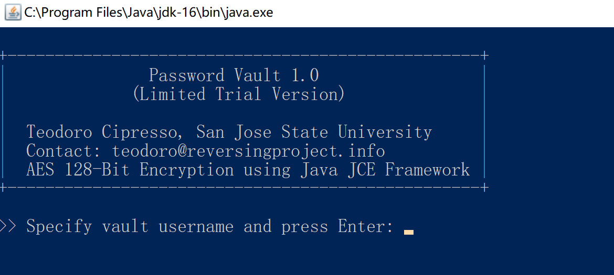

##### 反汇编查看

2. 使用jd-gui字节码反汇编工具打开

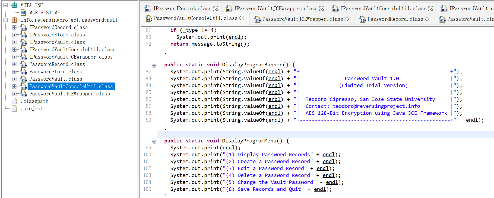

在一个PasswordVaultConsoleUtil类中我们发现了有关交互的代码。同时也得知一些选项

>   (1) Display Password Records 展示
>
>   (2) Create a Password Record 新建
>
>   (3) Edit a Password Record 编辑
>
>   (4) Delete a Password Record 删除
>
>   (5) Change the Vault Password 修改密码
>
>   (6) Save Records and Quit 保存并推出 :wq

由于目的是能够突破限制，那么显然我们关注的重点就是**2-Create** 

##### 关注Create功能

3. 下拉这个Java类，我们就可以发现其中接收输入的函数`getConsoleInputLine()`

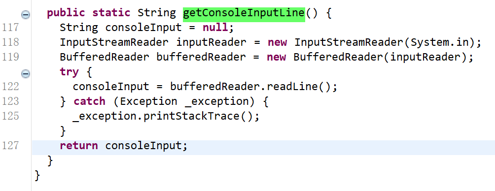

使用gd-gui的搜索功能，我们可以很方便的按图索骥，找到调用这个方法的地方

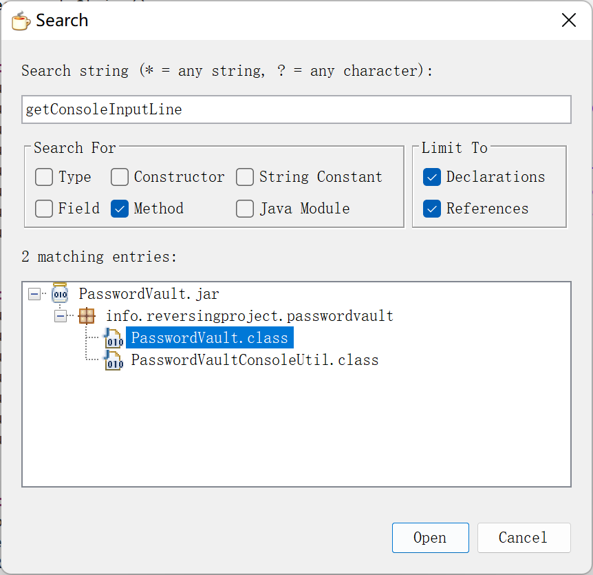

而正是在这个类中我们找到了`run`函数，而Create选项正是数字2所对应的。

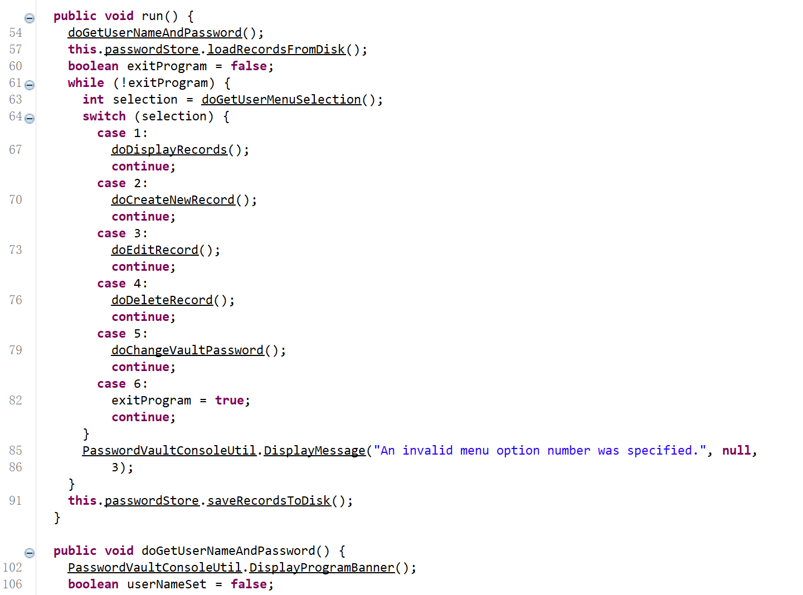

##### 程序测试

我们先再数据库中创建五个用户

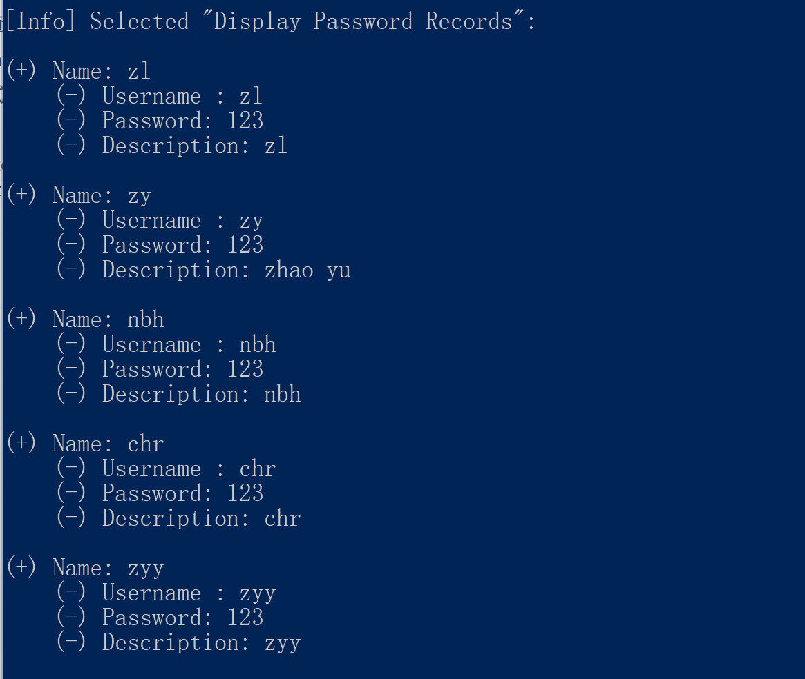

随后我们再次尝试创建

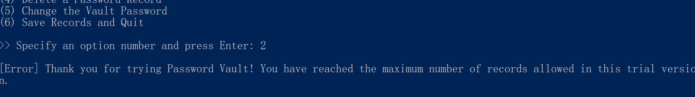

发现并不能创建，并报错`[Error] Thank you for trying Password Vault! You have reached the maximum number of records allowed in this trial version.`感谢您试用密码保险库！ 您已经达到了此试用版中允许的最大记录数量。

##### 探寻Create原理

再次在反汇编工具中查看，我们进入`doCreateNewRecord`函数，找到了上面的错误提示，随后我们发现这是通过比较records的大小是否 >= 5 来判断的。


至此，我们锁定了目标，即修改位于`PasswordVault`类中的`doCreateNewRecord`方法的前三行:

```java
 if (this.passwordStore.getRecords().size() >= 5) {
      PasswordVaultConsoleUtil.DisplayMessage("Thank you for trying Password Vault! You have reached the maximum number of records allowed in this trial version.", null, 
          3);
      return;
    } 
```

##### jbe修改字节码

先提出`PasswordVault.class`文件，使用[jbe](https://set.ee/jbe/)打开，根据提示字符串，我们可以轻而易举的找到问题的关键是5\~7行。

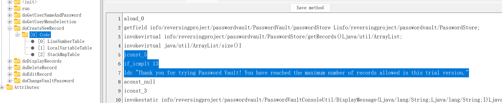

- 当int取值**-1~5**采用iconst指令，取值**-128~127**采用bipush指令，取值**-32768~32767**采用sipush指令，取值**-2147483648~2147483647**采用 ldc 指令。

关于 `if_icmp<cond>`

```
if_icmp<cond>
branchbyte1
branchbyte2
```

操作：如果int比较成功，则执行分支

> value1和value2都必须为int类型。 它们都从操作数堆栈中弹出并进行了比较。 比较结果如下：
>
> IF_ICMPEQ当且仅当 `Value1 = Value2` 时执行分支
> IF_ICMPNE当且仅当 `Value1 ≠ Value2` 时执行分支
> IF_ICMPLT当且仅当 `Value1 < Value2` 时执行分支
> if_ICMPLE 当且仅当 `Value1 ≤ Value2` 时执行分支
> IF_ICMPGT当且仅当 `Value1 > Value2` 时执行分支
> IF_ICMPGE当且仅当 `Value1 ≥ Value2` 时执行分支

可知，问题的关键便是判断，这里`Value1` 为`size`即密码账户个数，`Value2`为`iconst_`传进去的数据

当 size大于等于0 时，始终跳转

```java
iconst_0
if_icmpge 13  
```

当size 大于 -1时，跳转

```
iconst_m1
if_icmpgt 13  
```

事实上选择方式多种多样，但由于iconst的` -1~5`限制，又不能随意自如

##### 保存运行

将修改后的class文件使用bandzip等压缩软件替换原文件，即可

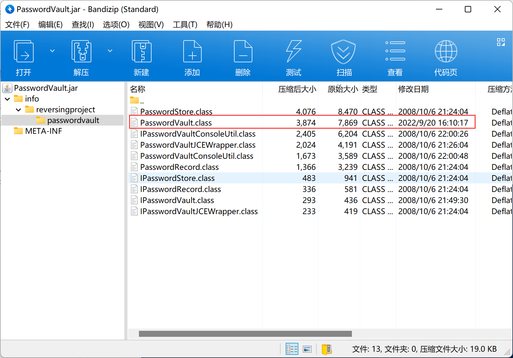

运行后，再次创建，并没有报错提示，我们已经接近实现了

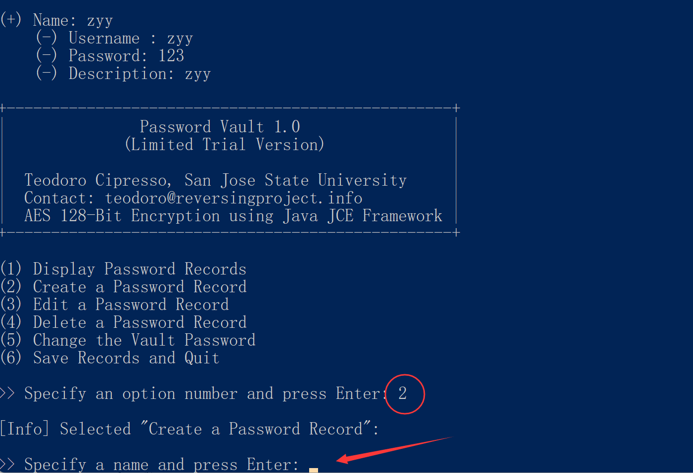

最后成功加入了第六个用户

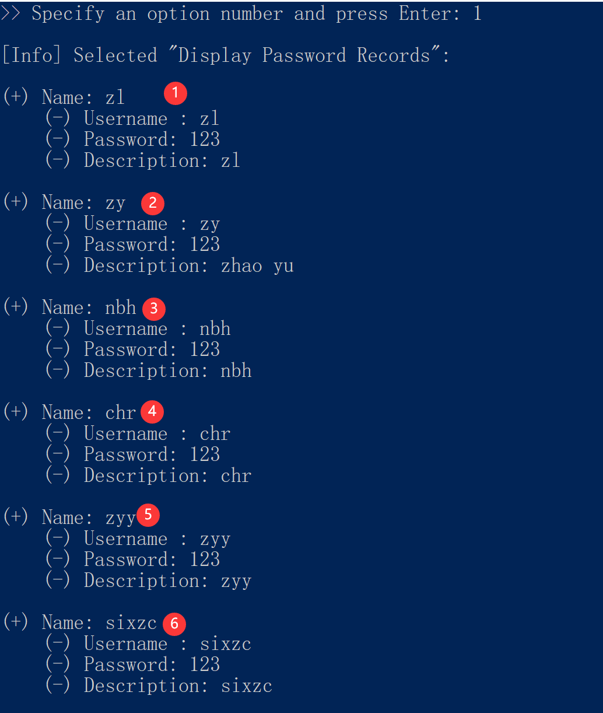

## 2、201807

### test-welcome

这是一个 test.class文件，直接运行

```bash
java test
```

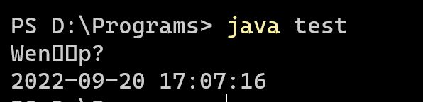

使用反字节码工具打开，得到Java源码，我们直接复制到IDEA中运行

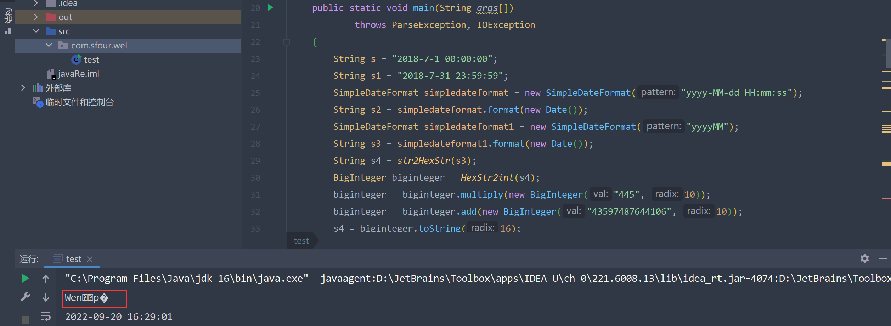

```java
// FrontEnd Plus GUI for JAD
// DeCompiled : test.class

import java.io.*;
import java.math.BigInteger;
import java.text.ParseException;
import java.text.SimpleDateFormat;
import java.util.Calendar;
import java.util.Date;

public class test
{

    public test()
    {
    }

    public static void main(String args[])
            throws ParseException, IOException
    {
        String s = "2018-7-1 00:00:00";
        String s1 = "2018-7-31 23:59:59";
        SimpleDateFormat simpledateformat = new SimpleDateFormat("yyyy-MM-dd HH:mm:ss");
        String s2 = simpledateformat.format(new Date());
        SimpleDateFormat simpledateformat1 = new SimpleDateFormat("yyyyMM");
        String s3 = simpledateformat1.format(new Date());
        String s4 = str2HexStr(s3);
        BigInteger biginteger = HexStr2int(s4);
        biginteger = biginteger.multiply(new BigInteger("445", 10));
        biginteger = biginteger.add(new BigInteger("43597487644106", 10));
        s4 = biginteger.toString(16);
        s4 = s4.toUpperCase();
        s4 = hexStr2Str(s4);
        Date date = simpledateformat.parse(s);
        Date date1 = simpledateformat.parse(s1);
        Date date2 = simpledateformat.parse(s2);
        boolean flag = isEffectiveDate(date2, date, date1);
        if(flag)
        {
            System.out.println(s2);
            System.in.read();
        } else
        {
            System.out.println(s2);
            System.exit(1);
        }
    }

    public static BigInteger HexStr2int(String s)
    {
        BigInteger biginteger = new BigInteger(s, 16);
        return biginteger;
    }

    public static String str2HexStr(String s)
    {
        char ac[] = "0123456789ABCDEF".toCharArray();
        StringBuilder stringbuilder = new StringBuilder("");
        byte abyte0[] = s.getBytes();
        for(int j = 0; j < abyte0.length; j++)
        {
            int i = (abyte0[j] & 0xf0) >> 4;
            stringbuilder.append(ac[i]);
            i = abyte0[j] & 0xf;
            stringbuilder.append(ac[i]);
        }

        return stringbuilder.toString().trim();
    }

    public static String hexStr2Str(String s)
    {
        String s1 = "0123456789ABCDEF";
        char ac[] = s.toCharArray();
        byte abyte0[] = new byte[s.length() / 2];
        for(int j = 0; j < abyte0.length; j++)
        {
            int i = s1.indexOf(ac[2 * j]) * 16;
            i += s1.indexOf(ac[2 * j + 1]);
            abyte0[j] = (byte)(i & 0xff);
        }

        String s2 = new String(abyte0);
        System.out.println(s2);
        return s2;
    }

    public static boolean isEffectiveDate(Date date, Date date1, Date date2)
    {
        if(date.getTime() == date1.getTime() || date.getTime() == date2.getTime())
            return true;
        Calendar calendar = Calendar.getInstance();
        calendar.setTime(date);
        Calendar calendar1 = Calendar.getInstance();
        calendar1.setTime(date1);
        Calendar calendar2 = Calendar.getInstance();
        calendar2.setTime(date2);
        return calendar.after(calendar1) && calendar.before(calendar2);
    }
}
```

##### 分析输出

主函数这里，我们可以看到不论如何都会输出 `s2`也就是当前时间

```java
public static void main(String args[])
            throws ParseException, IOException
    {
        ......
        String s2 = simpledateformat.format(new Date());
    
		......
            
        if(flag)
        {
            System.out.println(s2);
            System.in.read();
        } else
        {
            System.out.println(s2);
            System.exit(1);
        }
    }
```

随后我们在 `hexStr2Str()`函数处发现发现了输出语句

```java
public static String hexStr2Str(String s)
{
    String s1 = "0123456789ABCDEF";
    char ac[] = s.toCharArray();
    byte abyte0[] = new byte[s.length() / 2];
    for(int j = 0; j < abyte0.length; j++)
    {
        int i = s1.indexOf(ac[2 * j]) * 16;
        i += s1.indexOf(ac[2 * j + 1]);
        abyte0[j] = (byte)(i & 0xff);
    }

    String s2 = new String(abyte0);
    System.out.println(s2);
    return s2;
}
```

再次回推，在主函数查看调用逻辑

```java
        SimpleDateFormat simpledateformat1 = new SimpleDateFormat("yyyyMM");
        String s3 = simpledateformat1.format(new Date()); // 生成当前年月
        String s4 = str2HexStr(s3); // 运算
        BigInteger biginteger = HexStr2int(s4); // 转为数字
        biginteger = biginteger.multiply(new BigInteger("445", 10)); // *445
        biginteger = biginteger.add(new BigInteger("43597487644106", 10)); // +43597487644106
        s4 = biginteger.toString(16); // 转为16进制字符形式
        s4 = s4.toUpperCase(); // 转为大写
        s4 = hexStr2Str(s4);

......
    public static String str2HexStr(String s)
    {
        char ac[] = "0123456789ABCDEF".toCharArray();
        StringBuilder stringbuilder = new StringBuilder("");
        byte abyte0[] = s.getBytes();
        for(int j = 0; j < abyte0.length; j++)
        {
            int i = (abyte0[j] & 0xf0) >> 4;
            stringbuilder.append(ac[i]);
            i = abyte0[j] & 0xf;
            stringbuilder.append(ac[i]);
        }

        return stringbuilder.toString().trim();
    }

    public static BigInteger HexStr2int(String s)
    {
        BigInteger biginteger = new BigInteger(s, 16);
        return biginteger;
    }
```

这段的逻辑是，以`"yyyyMM"`即年月的格式生成一个当前年月，随后`str2HexStr`一下，然后再`HexStr2int`以16进制形式转为数字，再乘445，加上43597487644106，再最后转为16进制形式，以字符参与`hexStr2Str`转换。

根据测试我们验证猜想，并进行一些反推


```
202209
323032323039
57656E160170DF
```

##### 验证猜想

可见此输出的唯一变量是当年年月。而在主函数开始阶段我们看到，这是自2018-7月一整个月

```java
        String s = "2018-7-1 00:00:00";
        String s1 = "2018-7-31 23:59:59";
```

而主函数再最后的判断部分也是

```java
		Date date = simpledateformat.parse(s);
        Date date1 = simpledateformat.parse(s1);
        Date date2 = simpledateformat.parse(s2);
        boolean flag = isEffectiveDate(date2, date, date1);
        
        public static boolean isEffectiveDate(Date date, Date date1, Date date2)
    { // 用于判断date时间是否在 date1和date2中间，或者直接等于date1 或 date2
        if(date.getTime() == date1.getTime() || date.getTime() == date2.getTime())
            return true;
        Calendar calendar = Calendar.getInstance();
        calendar.setTime(date);
        Calendar calendar1 = Calendar.getInstance();
        calendar1.setTime(date1);
        Calendar calendar2 = Calendar.getInstance();
        calendar2.setTime(date2);
        return calendar.after(calendar1) && calendar.before(calendar2);
    }
```

我们猜测需要将时间设置为`201807`，直接进行测试

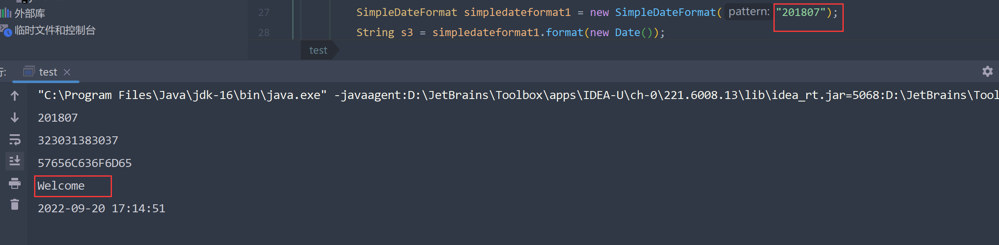

果然如此，接下来便是修改test.class字节码

##### 修改字节码

直奔main函数，找到18行，修改为201807

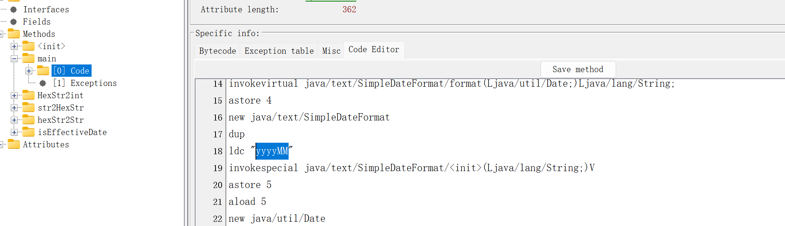

再次执行，成功输出`welcome`

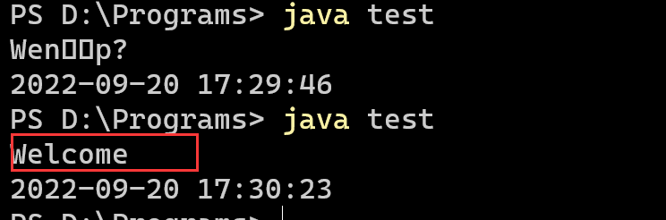

### Time4

直接运行发现失败

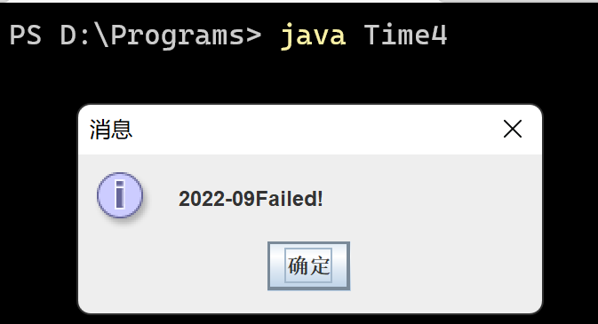

再次使用反编译工具查看源代码

```java
// FrontEnd Plus GUI for JAD
// DeCompiled : Time4.class

import java.awt.Dimension;
import java.awt.Toolkit;
import java.text.SimpleDateFormat;
import java.util.Calendar;
import java.util.Date;
import javax.swing.JFrame;
import javax.swing.JOptionPane;

public class Time4 extends JFrame
{

    private int ww;
    private int hh;
    private String d;
    private String p;

    public Time4()
    {
        ww = Toolkit.getDefaultToolkit().getScreenSize().width;
        hh = Toolkit.getDefaultToolkit().getScreenSize().height;
        d = "%5;+B=.";
        p = "070097105108101100033";
    }

    private String s(String s1)
    {
        StringBuilder stringbuilder = new StringBuilder(s1);
        for(int i = 0; i < 7; i++)
        {
            char c = s1.charAt(i);
            char c1 = d.charAt(i);
            stringbuilder.replace(i, i + 1, Character.toString((char)(c + c1)));
        }

        s1 = stringbuilder.toString();
        return s1;
    }

    private String m(String s1)
    {
        StringBuilder stringbuilder = new StringBuilder(s1);
        char ac[] = new char[7];
        for(int i = 0; i < 21; i += 3)
        {
            int j = Integer.valueOf(p.substring(i, i + 3)).intValue();
            ac[i / 3] = (char)j;
        }

        for(int k = 0; k < 7; k++)
            stringbuilder.replace(k, k + 1, Character.toString(ac[k]));

        s1 = stringbuilder.toString();
        return s1;
    }

    private String u(String s1)
    {
        char c = '\204';
        char ac[] = s1.toCharArray();
        for(int i = 0; i < ac.length; i++)
        {
            char c1 = ac[i];
            ac[i] = (char)(ac[i] ^ c1);
        }

        return String.valueOf(ac);
    }

    public static void main(String args[])
    {
        String s1 = "2018-07";
        SimpleDateFormat simpledateformat = new SimpleDateFormat("yyyy-MM");
        String s2 = simpledateformat.format(new Date());
        Calendar calendar = Calendar.getInstance();
        String s3 = String.valueOf(calendar.get(1));
        Calendar calendar1 = Calendar.getInstance();
        String s4 = String.valueOf(calendar1.get(2));
        String s5 = new String((new StringBuilder()).append(s3).append("_").append(s4).toString());
        JFrame jframe = new JFrame("hello");
        Time4 time4 = new Time4();
        if(s2.equals(s1))
        {
            if(s5.equals(s1))
                JOptionPane.showMessageDialog(jframe, (new StringBuilder()).append(s2).append("Failed!").append(time4.u(s5)).toString());
            else
                JOptionPane.showMessageDialog(jframe, (new StringBuilder()).append(s2).append(time4.s(s2)).append(time4.u(s5)).toString());
        } else
        {
            JOptionPane.showMessageDialog(jframe, (new StringBuilder()).append(s2).append(time4.m(s2)).append(time4.u(s5)).toString());
        }
        jframe.setBounds((time4.ww - 200) / 2, (time4.hh - 200) / 2, 200, 200);
        jframe.setSize(300, 200);
        jframe.setDefaultCloseOperation(3);
    }
}
```

发现这是个换汤不换药程序，依然是获取当前年月，据此进行一系列闪转腾挪。

这一次，在主函数上赫然写着

```java
String s1 = "2018-07";
```

这一次，我们不再犹豫，直接替换

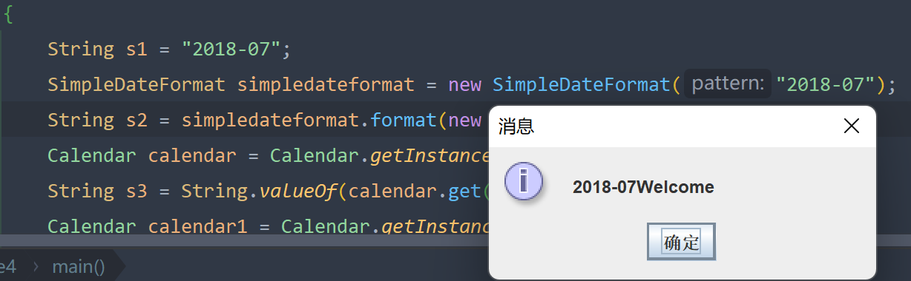

发现果然成功运行出来。

##### 修改字节码

继续使用jbe修改

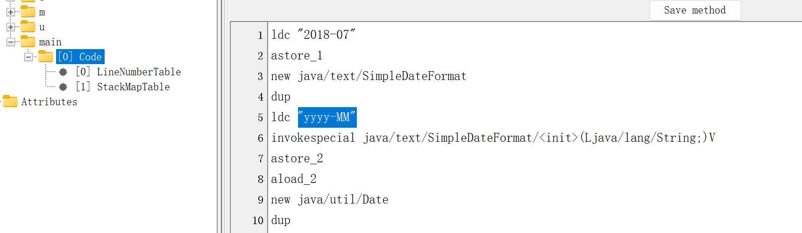

找到第五行位置修改为指定日期

```
ldc "2018-07"
```

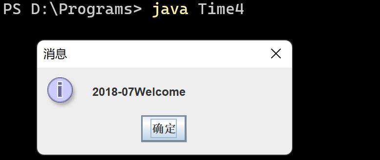

运行成功

## 4、read

http://www.cnblogs.com/LittleHann/p/3374206.html

这篇文章是关于android逆向的内容，作者通过一道题目具体讲解，循序渐进，逐层拨开面纱，其中关于编码解码的分析过程更是惟妙惟肖，令人拍案叫绝啧啧称奇。
