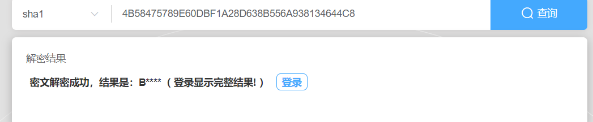
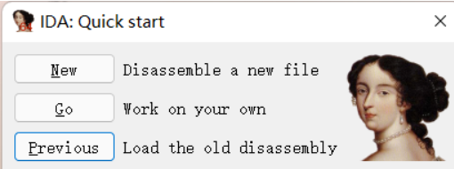
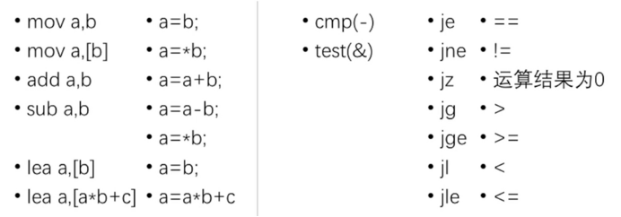
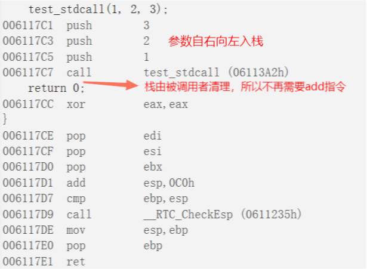
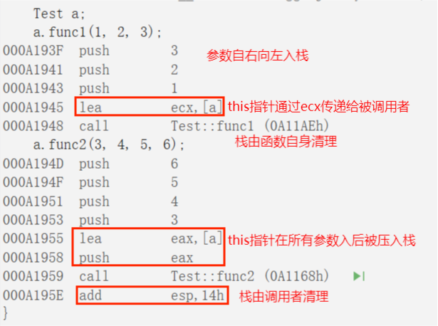

# RELEC0 Base64 Crack-SHA1 调用约定

参与作者：[**lanpesk**](https://lanpesk.github.io/)、z周周、wm

## 1、python基础

> （一定要看）阅读Python Tutorial。会大致看懂基本语法能完成下个任务就可以了，不要求学会这门语言<http://www.pythondoc.com/pythontutorial3/index.html>

这是一门变幻莫测的语言，这个语言中包含众多包，可以让我们轻而易举的完成一些任务。同时这又是一门简单的语言 简单到我们甚至不需要定义变量的数据类型。

## 2、Base64

> 搜索Base64算法资料，详细解释该算法。用Python实现它，把自己的学号（字母大写）用Base64编码输出。并且把上面的源代码文件编译成pyc文件。（不要抄袭）

```python
import libnum

code = ['A', 'B', 'C', 'D', 'E', 'F', 'G', 'H', 'I', 'J', 'K', 'L', 'M', 'N', 'O', 'P', 'Q', 'R', 'S', 'T',
        'U', 'V', 'W', 'X', 'Y', 'Z', 'a', 'b', 'c', 'd', 'e', 'f', 'g', 'h', 'i', 'j', 'k', 'l', 'm', 'n',
        'o', 'p', 'q', 'r', 's', 't', 'u', 'v', 'w', 'x', 'y', 'z', '0', '1', '2', '3', '4', '5', '6', '7',
        '8', '9', '+', '/', '=']

data = libnum.s2b(input("Input what you want to encode : "))

pad = 0

if len(data) % 6 != 0:
    pad = (6 - (len(data) % 6)) // 2
    data += (6 - (len(data) % 6))*'0'


result = []
for i in range(0, len(data), 6):
    index = int('0b' + data[i:i+6], 2)
    result.append(code[index])

result.append(pad*'=')

print(''.join(result))
```

以下指令进行编译：

```bash
python -m compilall -b base64.py
```

## 3、反编译

> 找班上学号和你相邻的一位同学要一下上面的pyc文件（不是源代码文件），然后搜索相关反编译工具把pyc反编译成Python源代码，最好能多找几种工具或者途径达到反编译的目的。

这里使用uncompyle6库进行反编译操作。此库可以直接使用pip安装。

使用以下指令进行反编译：

```bash
$ uncompyle6 base64.pyc > base64_reverse.py
```

不过不支持我的3.9版本python。

使用<https://tool.lu/pyc/>进行反编译。得到反编译的结果：

```python
#!/usr/bin/env python
# visit https://tool.lu/pyc/ for more information
# Version: Python 3.9

import libnum

code = [
    "A",    "B",    "C",    "D",    "E",    "F",    "G",    "H",    "I",    "J",
    "K",    "L",    "M",    "N",    "O",    "P",    "Q",    "R",    "S",    "T",
    "U",    "V",    "W",    "X",    "Y",    "Z",    "a",    "b",    "c",    "d",
    "e",    "f",    "g",    "h",    "i",    "j",    "k",    "l",    "m",    "n",
    "o",    "p",    "q",    "r",    "s",    "t",    "u",    "v",    "w",    "x",
    "y",    "z",    "0",    "1",    "2",    "3",    "4",    "5",    "6",    "7",
    "8",    "9",    "+",    "/",    "=",
]
data = libnum.s2b(input("Input what you want to encode : "))
pad = 0
if len(data) % 6 != 0:
    pad = (6 - len(data) % 6) // 2
    data += (6 - len(data) % 6) * "0"
result = []
result.append(pad * "=")
print("".join(result))
```

## 4、Cracking SHA1

4.  去<https://www.mysterytwisterc3.org/>用各自组长的学号注册一个账号（字母大写），账号密码记住以后课堂要用到。完成关卡Cracking SHA1-Hashed Passwords<https://www.mysterytwisterc3.org/en/challenges/level-ii/cracking-sha1-hashed-passwords>

> 监视系统的网络服务器的漏洞泄露了管理员帐户密码的SHA1哈希值。
> 密码的哈希值是  
>
> ```
> 67ae1a64661ac8b4494666f58c4822408dd0a3e4
> ```
>
> 此外，登录终端的键盘显示了输入密码的明确符号，因为在软件中成功进行登录导航之后，仅通过箭头键完成。
>
> 
>
> 密码是什么？

### 爆破

写了个脚本来解：

```bash
import hashlib
import itertools

wordSet = ['Q', 'q', '@', 'W', 'w', '%', '5', '(', '8','[','=','0','}', 'I','i', '*','+', '~', 'N', 'n', '2', '4', '6', '8']

for len in range(1, len(wordSet) + 1):
    for i in itertools.permutations(wordSet, len) :
        if hashlib.sha1(''.join(i).encode('utf8')).hexdigest() == '67ae1a64661ac8b4494666f58c4822408dd0a3e4':
            print(''.join(i))
            exit(0)
```

### 笛卡尔积

这么写好像时间复杂度太高了。由于一个按键同一时间只能输出一个字符，可以考虑换成以按键为主循环的遍历。遍历所有按键可产生的笛卡尔积即可。考虑到小键盘中的也是方向键这里暂时认为密码中不包含这几个键。

```python
import hashlib
import itertools

wordSet = [['Q', 'q', '@'], ['W', 'w'], ['%', '5'], ['(', '8','['], ['=','0','}'], ['I','i'],['N', 'n'],[ '*','+', '~']]

setGroup = list(itertools.product(wordSet[0],wordSet[1],wordSet[2],wordSet[3],wordSet[4],wordSet[5],wordSet[6],wordSet[7]))
for i in setGroup:
    for j in itertools.permutations(i, 8):
        if hashlib.sha1(''.join(j).encode('utf8')).hexdigest() == '67ae1a64661ac8b4494666f58c4822408dd0a3e4':
            print(''.join(j))
            exit(0)

```

结果为：

```bash
(Q=win*5
```

## 5、Cracking SHA1

> 从前有一个熊孩子入侵了一个网站的数据库，找到了管理员密码，手一抖在数据库中修改了一下，现在的密码变成了 4B58475789E60DBF1A28GD638B556A938134644C8。那个熊孩子其实就是我！肿么办求解原始密码！在线等，挺急的。hint：密码长度为5

很明显，G在其中格格不入，去除后这将成为一个40位的十六进制数

```bash
4B58475789E60DBF1A28D638B556A938134644C8
```

16进制四十位，就是2进制下的 160位，现在还使用160位的不多，常见的只有SHA1。我们上网查询发现                         

安能摧眉折腰事权贵，使我不得开心颜！！！

已知密码长度为5，那么未知的还剩4位，我们尝试将所有键盘上能输入的字符一一遍历一遍，也不过 94\*94\*94\*94=78,074,896 七千多万，不如我们先遍历数字字母，只需14，776，336次。很轻松遍历出来

```python
import string
import hashlib
import sys
import time


def lookFor(passwdList, target):
    for a in "B":
        for b in passwdList:
            for c in passwdList:
                for d in passwdList:
                    for e in passwdList:
                        passwd = a + b + c + d + e
                        sha1 = hashlib.sha1(passwd.encode('utf-8'))
                        sys.stdout.write("\r %s" % (passwd))
                        if sha1.hexdigest() == target:
                            return passwd


if __name__ == '__main__':
    start = time.time()
    # 三选项 string.ascii_letters+string.digits+string.punctuation
    passwdAvailable = string.ascii_letters + string.digits  # 仅有数字英文的情况
    target = "4B58475789E60DBF1A28D638B556A938134644C8".lower()
    print(len(passwdAvailable))
    lookFor(passwdAvailable, target)
    end = time.time()
    print(f"\nUse time: {end - start} s")

```

​                         

## 6、观看视频

6.观看 某马拉松大学校内 CTF 赛前培训\--逆向工程课<https://www.bilibili.com/video/BV1xs411x7op>写一下观后感，说下视频大概介绍了哪些内容。

用一些CTF例子介绍反汇编调试工具IDA(静态） OD(动态)使用

​                         

NEW：进入ida选择你想要分析的程序

GO：直接进去ida 不进行选择

Previous：之前打开过的文件

当然你可以直接将程序拖到ida的图标上就可以直接打开了

**IDA的核心功能可以将汇编语言转换为高级语言（伪代码）**

​                         

1、函数窗口 可以看到程序中所调用的函数

2、全局图形视图 当前页面只有一个图形框所以显示为空白

3、消息输出窗口 ida进行的操作可以从该窗口看到

4、图形视图 以图形的形式比较直观的看到各个函数之间的关系 以汇编的形式展现

5、ida的功能栏 分别为文件 编辑 跳转 搜索 视图 动调 ida的一个插件 选项 自定义桌面 帮助

- F9:运行
- F8:单步步过
- F7：单步步入 
- F2:设置断点
- Ctrl + G ：输入Windows API函数名 可以定位函数位置

​                         

以及汇编基础知识

​                         

​                         

## 7、解释汇编

7、解释每一条汇编语言的含义，这几条汇编合在一起的作用是什么？\<\<恶意代码分析实战>\> 那本书有一章是讲汇编的，可以看看。

```assembly
xor edx,edx
mov eax, 51EB851Eh 
imul ecx
shr edx, 5
mov eax, edx

```

-------------------- -----------------------------------------------------------------------------------------------------
|||
| ------------------ | ------------------------------------------------------------ |
| xor edx,edx        | 按位异或运算，操作数两数相同为0，相异为1。两个操作数都是edx，所以进行该运算后edx清0。 |
| mov eax, 51EB851Eh | 传送指令，把值51EB851Eh复制到eax寄存器中。                   |
| imul ecx           | 有符号数乘法指令，将eax的值与ecx的值相乘，乘积保存在 edx:eax 中。高32位保存在edx，低32位保存在eax。 |
| shr edx, 5         | 逻辑右移指令，将edx的值整体右移5位，高位补0。                |
| mov eax, edx       | 把edx中的内容复制到eax寄存器。                               |

-------------------- -----------------------------------------------------------------------------------------------------

这几条汇编语句合在一起的作用：把eax的值与ecx相乘所得乘积的高32位逻辑右移5位后所得结果复制到eax中。

## 8、名词解释 

8、名词解释 **cdecl** stdcall **thiscall** vectorcall **fastcall** clrcall每种调用约定最好能用汇编代码片段举例。

\_\_cdecl是最常用的约定之一，在该约定中，参数是从右到左按序被压入栈，当函数完成时由调用者清理栈，并且将返回值保存在eax中。

------------------- ------------------------------------------------------------------------
|||
| -------------- | ------------------------------------------------------------ |
| 参数传递顺序   | 参数从右向左压入堆栈                                         |
| 堆栈维护职责   | 由调用者清理堆栈                                             |
| 名称修饰约定   | 下划线字符 (_) 作为名称的前缀，导出使用 C 链接的 __cdecl 函数时除外 |
| 大小写转换约定 | 不执行任何大小写转换                                         |

------------------- ------------------------------------------------------------------------

```c
#include <stdio.h>
int __cdecl test_cdecl(int a, int b, int c)
{
	return a + b + c;
}
int main()
{
	test_cdecl(1, 2, 3);
	return 0;
}
```

        

\_\_stdcall调用约定在函数完成时由被调用者清理栈，其余和\_\_cdecl类似。\_\_stdcall是Windows API的标准调用约定，任何调用这些API的代码都不需要清理栈，因为清理栈的责任是由实现API函数代码的DLL程序来承担。

------------------- --------------------------------------------------------------------------------------------------------------------------------------------------

|||
| -------------- | ------------------------------------------------------------ |
| 参数传递顺序   | 参数从右向左压入堆栈。如果调用类的成员函数，最后压入this指针 |
| 参数传递约定   | 按值，除非传递指针或引用类型                                 |
| 堆栈维护职责   | 被调用函数清理堆栈                                           |
| 名称修饰约定   | 函数名自动加前导的下划线，后面紧跟一个@符号，其后紧跟着参数的尺寸。 因此，声明为 int add( int a, double b ) 的函数按如下所示进行修饰：_add@12 |
| 大小写转换约定 | 不执行任何大小写转换                                         |

------------------- --------------------------------------------------------------------------------------------------------------------------------------------------

```c
int __stdcall test_stdcall(int a, int b, int c)
```

​                         

\_\_thiscall只能够用在类的成员函数上。thiscall是唯一一个不能明确指明的函数修饰，因为thiscall不是关键字。它是C++类成员函数缺省的调用约定。由于成员函数调用还有一个this指针，因此必须特殊处理。

------------------- -----------------------------------------------------------------------------------------------------
  参数传递顺序        参数从右向左压入栈

  参数传递约定        如果参数个数确定，this指针通过ecx传递给被调用者；如果参数不确定，this指针在所有参数被压栈后压入堆栈

  堆栈维护职责        对参数个数不确定的，由调用者清理堆栈，否则函数自己清理堆栈

  名称修饰方案        由于此调用约定仅适用于 C++，因此它没有 C 名称修饰方案
------------------- -----------------------------------------------------------------------------------------------------

```c
#include <iostream>
#include <stdarg.h>

class Test
{
public:
	int func1(int a, int b, int c);//参数个数确定
	int func2(int a, ...);//参数个数不确定
};

int Test::func1(int a, int b,int c)
{
	return a + b + c;
}

int Test::func2(int n, ...)
{
	va_list ap;
	va_start(ap, n);
	int i = n;
	int result = 0;
	while (i > 0)
	{
		result += va_arg(ap, int);
		i--;
	}
	return result;
}

int main()
{
	Test a;
	a.func1(1, 2, 3);
	a.func2(3, 4, 5, 6);
	return 0;
}
```

​                         

\_\_vectorcall调用约定指定在可能的情况下在寄存器中传递函数的参数。 \_\_vectorcall 继承于fastcall ，对于fastcall中的整数仍然按照fastcall规则传递，而浮点以及向量将通过寄存器传递，优化了浮点向量运算。\_\_vectorcall在x86 和 x64中的通用功能如下：

------------------- ----------------------------------------------------------------------------
  名称修饰约定        函数名的前缀为两个"@"符号 (@@)，后接参数列表中的字节数（以十进制形式表示）

  大小写转换约定      不执行任何大小写转换
------------------- ----------------------------------------------------------------------------

​                         

\_\_fastcall调用约定指定在可能的情况下在寄存器中传递函数的参数。 此调用约定仅适用于 x86 体系结构。

------------------- -------------------------------------------------------------------------------------------------------------------------------
  参数传递顺序        在自变量列表中按从左到右的顺序找到的前两个 DWORD 或更小自变量将在 ECX 和 EDX 寄存器中传递；所有其他自变量在堆栈上从右向左传递

  堆栈维护职责        被调用函数清理堆栈

  名称修饰约定        同\_\_stdcall

  大小写转换约定      不执行任何大小写转换

------------------- -------------------------------------------------------------------------------------------------------------------------------

```c
int __fastcall test_fastcall(int a, int b, int c,int d)
```

        

\_\_clrcall与.NET Framework有关系，用于指定函数只能被托管代码(managed code)调用。

\_\_clrcall用来指定只能从托管代码调用的函数。对所有只能从托管代码调用的虚函数使用 \_\_clrcall。 但是，此调用约定不能用于从本机代码调用的函数。当通过指针从托管函数调用到虚拟托管函数或从托管函数调用到托管函数时，可使用 \_\_clrcall 来提高性能。

入口点是编译器生成的单独函数。 如果函数同时具有本机和托管入口点，则其中一个将是具有函数实现的实际函数。 其他函数将是调用到实际函数的单独函数（形式转换 (thunk)）并允许公共语言运行时执行 PInvoke。

将函数标记为 \_\_clrcall时，表示函数实现必须是 MSIL，并且不会生成本机入口点函数。当采用本机函数的地址时，如果未指定 \_\_clrcall，编译器将使用本机入口点。 \_\_clrcall 指示函数是托管的，无需执行从托管转换到本机的转换。 在这种情况下，编译器将使用托管入口点。（来源于docs.microsoft.com）
