#   Crypto One-Way Hash Function and MAC 单向哈希函数和MAC


> 本实验室的学习目标是让学生熟悉单向哈希函数和消息认证码(MAC)。在完成实验室后，除了获得更深 入的概念基础外，学生还应该能够使用工具和编写程序来生成给定信息的单向哈希值和MAC。

## 准备工作

> **安装OpenSSL。**在这个实验室中，我们将使用openssl命令和库。我们已经在虚拟机中停止了开放环境的 二进制文件。需要注意的是，如果您想在程序中使用开放语言库，您需要为编程环境安装其他一些东西
>
> 包括头文件、库、手册等。我们已经在目录/home/seed/openssl-1.0.1下载了必要的文件。openssl要配置和安装选项s库，请转到`openssl-1.0.1`文件夹，并运行以下命令。
>
> ```bash
> sudo ./config
> sudo make
> sudo make test
> sudo make install
> ```

如果你是在seed VM12.04，那么确实可以按照以上的方式安装成功。


但你很难安装bless，因此我建议你换个虚拟机，任何一个linux都可。

在ubuntu上，你甚至会发现自带了openssl，

```bash
openssl version -a
```

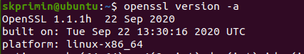

> **安装十六进制编辑器。**在这个实验室中，我们需要能够查看和修改二进制格式的文件。我们已经在VM 中安装了一个名为GHex的十六进制编辑器。它允许用户从任何文件中加载数据，查看和编辑它在十六 进制或ascii。注意：许多人告诉我们，另一个名为Bless的十六进制编辑器更好；这个工具可能没有安装在您正在使用的VM版本中，但您可以使用以下命令自己安装它：
>
> ```bash
> sudo apt-get install bless
> ```

我们使用更好用的seedubuntu20完成实验。

# 任务

## 任务1：生成消息摘要和MAC

> 在这个任务中，我们将使用各种单向哈希算法。您可以使用以下openssldgst命令为文件生成哈希值。 要查看手册，您可以输入man openssl和man dgst。
>
> ```bash
> openssl dgst dgsttype filename
> ```
>
> 请用特定的单向哈希算法替换`dgsttype`，如`-md5`、`-sha1`、`-sha256`等。在此任务中，您应该尝试至 少3种不同的算法，并描述您的观察结果。您可以通过输入"man openssl"来找到受支持的单向哈希算法。

先向一个文件中写入内容

```bash
echo "skprimin" > testfile
```

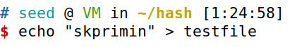

```bash
openssl dgst -md5 testfile
openssl dgst -sha1 testfile
openssl dgst -sha256 testfile
```

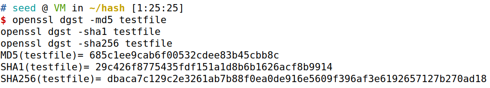

- md5与shal和sha256相比，md5的哈希值长度更小，sha1/sha256更强，事实上确实如此。
- sha1和sha256相比，sha256的哈希值长度大于sha1值，表明sha256比sha1更强。
- 字母中没有超过f的，这些应该是16进制数字

再使用一些别类型的算法

```bash

openssl dgst -rmd160 testfile
openssl dgst -sha3-256 testfile
openssl dgst -shake256 testfile
openssl dgst -sm3 testfile
```

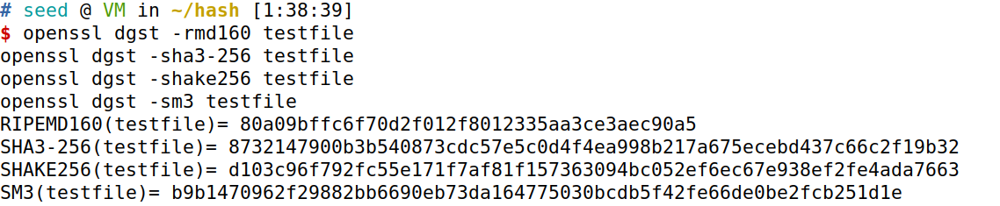

- 发现xxx256加密出来的有64个十六进制数，换算成2进制恰为256位。
- 我国的商用密码也为256型

## 任务2：键散列和HMAC

> 在这个任务中，我们希望生成一个键控哈希散列（MAC）的文件。我们可以使用`-hmac`选项（这个选项目 前没有文档记录，但该选项支持它）。下面的示例使用HMAC-MD5算法为文件生成键控散列。`-hmac`选项 后面的字符串是键。
>
> ```bash
> openssl dgst -md5 -hmac "abcdefg" filename
> ```
>
> 请使用HMAC-MD5、HMAC-SHA256和HMAC-SHA1为您选择的任何文件生成键控散列。请试试几个不同长度的键。我们必须在HMAC中使用固定大小的键吗？如果是这样，键的大小是多少？如果不是，为什 么？

```bash
openssl dgst -md5 -hmac "123456" testfile
openssl dgst -md5 -hmac "abcdefg" testfile
openssl dgst -md5 -hmac "12345678" testfile
openssl dgst -md5 -hmac "123456789" testfile
```

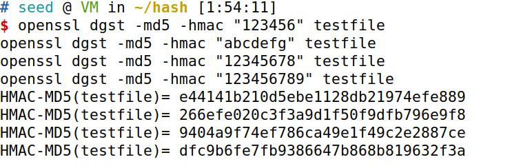

```bash
openssl dgst -sha1 -hmac "abcdefg" testfile
openssl dgst -sha1 -hmac "12345678" testfile
openssl dgst -sha256 -hmac "abcdefg" testfile
openssl dgst -sha256 -hmac "12345678" testfile
```

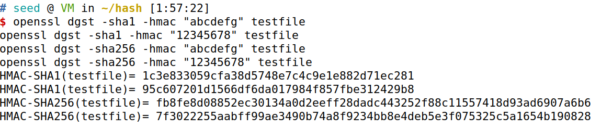

- 可以观察到md5写入的hash key的长度比shal和sha256的要小。 但是对于不同的键（123456，adcdef，1245678，123456789），哈希值的长度是相同的。
- sha1 和sha256 相比，sha256 的哈希长度大于sha1 的长度，说明sha256 比shal 更安全。 不同的键也有不同的哈希值，但哈希值的长度是相同的。

## 任务3：单向哈列的随机性

> 为了了解单向哈希函数的特性，我们想对MD5和SHA256做以下练习：
>
> 1. 创建任意长度的文本文件。
>
> 2.  使用特定的哈希算法生成此文件的哈希值*$H_1$*。
> 3.  翻转输入文件的一个位。您可以使用ghex或bless来实现此修改。
> 4.  生成已修改后的文件的散列值*$H_2$*。
> 5.  请观察是否*$H_1$*和$H_2$是否相似。请在实验室报告中描述您的观察结果。你可以编写一个简短的程序 来计算*$H_1$*和$H_2$之间有多少位是相同的。

```bash
echo "12345678" > befor
bless befor
```

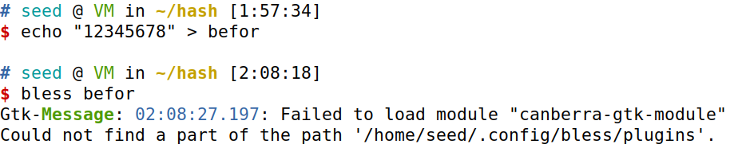

在此如果我们想翻转一位，可以通过另一种方式实现。

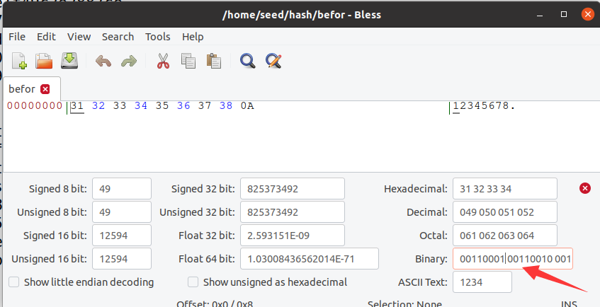

```bash
echo "02345678" > after
```

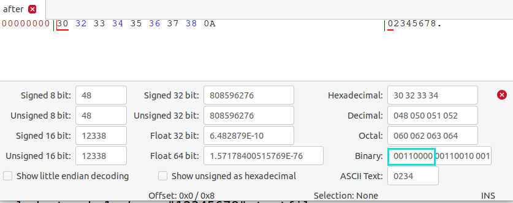

在此我们很清晰的看到，发生了一位偏转。

### 生成哈希值

```bash
openssl dgst -md5 befor
openssl dgst -md5 after

openssl dgst -sha256 befor
openssl dgst -sha256 after
```

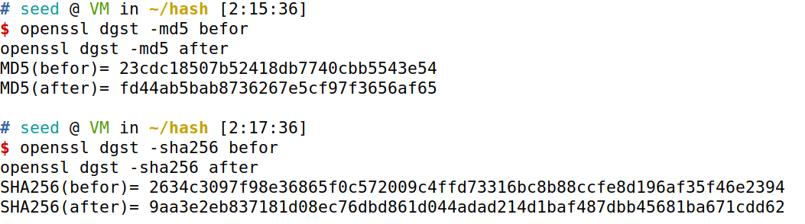

比对程序

```python
def compare(str1, str2):
    count = 0
    for i, k in enumerate(str1):
        if k == str2[i]:
            count += 1
    return count


md51 = "23cdc18507b52418db7740cbb5543e54"
md52 = "fd44ab5bab8736267e5cf97f3656af65"

md5num = compare(md51, md52)
print("Same digits in   MD5  hashes are:", md5num,
      ",The proportion is ", 100*md5num/len(md51), "%")

sha21 = "2634c3097f98e36865f0c572009c4ffd73316bc8b88ccfe8d196af35f46e2394"
sha22 = "9aa3e2eb837181d08ec76dbd861d044adad214d1baf487dbb45681ba671cdd62"

sha2num = compare(sha21, sha22)
print("Same digits in SHA256 hashes are:", sha2num,
      ",The proportion is ", 100*sha2num/len(sha21), "%")
```

发现仅仅修改一位，hash值的命中率也低至3.125%，两个无关字符相同的概率约为3.846%，可以断定两个hash值无关。

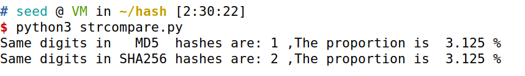

### 直接脚本比对二进制

```python
import hashlib
import binascii


def compare(file1, file2, flag):
    # This python script is designed to print out the number of different bits between two files (file1 and file2).
    if flag:
        hash1 = hashlib.md5(file1.encode())
        hash2 = hashlib.md5(file2.encode())
    else:
        hash1 = hashlib.sha256(file1.encode())
        hash2 = hashlib.sha256(file2.encode())
    hashString1 = (hash1.hexdigest())
    hashString2 = (hash2.hexdigest())
    # Convert HEX string to binary
    file1Binary = bin(int(hashString1, 16))[2:]
    file2Binary = bin(int(hashString2, 16))[2:]
    numDifferentBits = 0
    for x in range(len(file1Binary)if len(file1Binary) < len(file2Binary)else len(file2Binary)):
        if int(file1Binary[x]) == int(file2Binary[x]):
            numDifferentBits += 1
    return numDifferentBits


file1 = "1234567"
file2 = "0234567"

md5num = compare(file1, file2, 1)
print("Same digits in   MD5  hashes are:", md5num,
      ",The proportion is ", 100*md5num/128, "%")


sha2num = compare(file1, file2, 0)
print("Same digits in SHA256 hashes are:", sha2num,
      ",The proportion is ", 100*sha2num/256, "%")

```

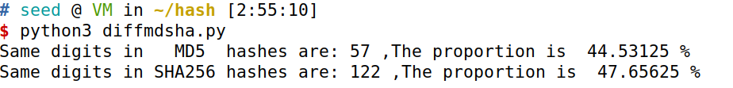

发现大致在50%左右，由于只有0、1两种可能性，所以随机情况下也会接近50%。

## 任务4：单向属性与无碰撞属性

> 在这个任务中，我们将研究哈希函数的两个性质之间的区别：单向性质和无碰撞性质。我们将使用蛮 力方法来看看破坏这些属性需要多长时间。不需要使用openssl的命令行工具，而需要编写自己的C程 序来调用openssl加密库中的消息摘要工具。示例代码可以从
>
> http://www.openssl.org/docs/crypto/EVP_DigestInit.html下载。
>
> 由于大多数哈希函数对这两个特性的蛮力攻击相当强，我们需要数年时间才能使用蛮力方法来打破它们。为了使该任务可行，我们将哈希值的长度减少到24位。我们可以使用任何单向哈希函数，但在这个任务中，我们只使用哈希值的前24位。也就是说，我们使用了一个修改的单向哈希函数。请设 计一个实验，以了解以下内容：
>
> 我们在任意平台上运行python，由于一般来讲主机运行速度显著快于虚拟机，在主机上运行脚本

### one-way

> 1、需要多少次试验才能打破单向性属性？你应该重复你的实验多次，并报告你的平均试验次数。

抗原像性（单向特性）。这衡量了设计一条散列到已知摘要的消息的难度，粗略地说，哈希函数必须是单向的。

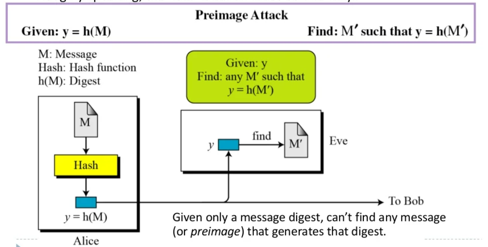

该程序的目标是通过生成不同字符串的哈希并将其与目标哈希值相匹配。在计算上无法找到到特定哈希的数据映射
生成字符串并将它们与目标匹配的方法实现如下:

```python
import random
import string
import hashlib
HASH_VALUE = '021126'
numTrials = 0
times = 5
sumTrials = 0
for i in range(times):
    while True:
        randomStr = ''.join([random.choice(
            string.ascii_letters + string.digits + string.punctuation) for n in range(20)])
        hash_object = hashlib.md5(randomStr.encode())
        hash_string = hash_object.hexdigest()
        numTrials += 1
        if hash_string[0:6] == HASH_VALUE:
            break
    sumTrials += numTrials
    print("No.", i+1, "num trials to break one-way property = ", numTrials)
print("average:", sumTrials/times)

```

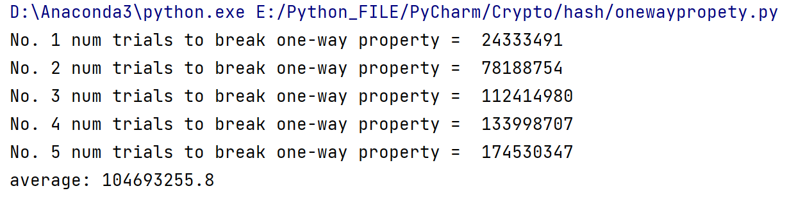

平均值104693255

C语言版本

由对酒当歌提供，注意此C语言版本仅仅能在Windows上进行了测试，所需的openssl建议大家使用[vcpkg](https://github.com/microsoft/vcpkg)下载，vcpkg的安装和使用方法见：

https://github.com/microsoft/vcpkg/blob/master/README_zh_CN.md

https://blog.csdn.net/cjmqas/article/details/79282847?spm=1001.2014.3001.5506

`vcpkg install openssl:x86-windows`开始下载安装openssl

```c
#define _CRT_SECURE_NO_WARNINGS
#include <stdio.h>
#include <string.h>
#include <openssl/evp.h>
#include <time.h>

//生成随机字符串用到的字符
char strdict[] = "0123456789qwertyuiopasdfghjklzxcvbnmQWERTYUIOPASDFGHJKLZXCVBNM!\"#$ % &'()*+, -./:;<=>?@[\\]^_`{|}~";

//生成随机字符串的函数
void generateString(unsigned char* gen_str, const unsigned int len)
{
    int dictlen = strlen(strdict);
    for (int i = 0; i < len; i++)
    {
        int randnumm = rand() % dictlen;
        gen_str[i] = strdict[randnumm];
    }
}

int main(int argc, char* argv[])
{

    EVP_MD_CTX* mdctx;
    const EVP_MD* md;
    argv[2] = "e59ff9";//根据需要自己编一个哈希值（24位，6个十六进制数）
    char *hash_value0 = argv[2];
    char hash_value1[7] = "0"; //因为字符串末尾还需要一个\0作为结束标志，所以长度为7
    unsigned char md_value[EVP_MAX_MD_SIZE];
    unsigned int md_len, count;
    float average = 0;
    const unsigned int len = 12;//生成的随机字符串的长度
    argv[1] = "md5";//使用md5算法
    unsigned char str[len+1] = { "0" }; //len+1原因同上
    srand((unsigned int)time(NULL));    //设置随机数种子
    for (int i = 0; i < 5; i++) //5次破解
    {
        char hash_value1[7] = "0";
        count = 0;  //尝试次数
        while (strcmp(hash_value0, hash_value1))
        {
            generateString(str, len);
            //printf("random str:%s\n", str);
            if (argv[1] == NULL) {
                printf("Usage: mdtest digestname\n");
                exit(1);
            }

            md = EVP_get_digestbyname(argv[1]);
            if (md == NULL) {
                printf("Unknown message digest %s\n", argv[1]);
                exit(1);
            }
            //计算哈希值
            mdctx = EVP_MD_CTX_new();
            EVP_DigestInit_ex2(mdctx, md, NULL);
            EVP_DigestUpdate(mdctx, str, strlen((const char*)str));
            EVP_DigestFinal_ex(mdctx, md_value, &md_len);
            EVP_MD_CTX_free(mdctx);
            sprintf(hash_value1, "%02x%02x%02x", md_value[0], md_value[1], md_value[2]);//只取前24位
            /*
            printf("Digest is: ");
            for (int i = 0; i < md_len; i++)
                printf("%02x", md_value[i]);
            printf("\n");
            */
            count++;
        }
        printf("Number of attempts is :%d\n", count);
        average += count;
        //printf("The resulting string is %s:\n", str);
    }
    printf("The average number of attempts is:%f\n", average / 5);
    return 0;
}
```


### collision-resistant

> 2、需要多少次试验才能破解无碰撞属性？同样地，你应该计算平均值。

抗碰撞。这衡量了设计一个散列到已知摘要及其消息的消息的难度

在无冲突属性的情况下，对目标哈希没有限制。在计算上无法找到相同哈希的两个数据

给定一条消息，找不到具有相同消息摘要的另一条消息。


找到具有相同消息摘要的第二条消息的攻击是第二原像攻击。如果使用的散列函数不是强抗碰撞，那么从旧签名中伪造新的数字签名将很容易

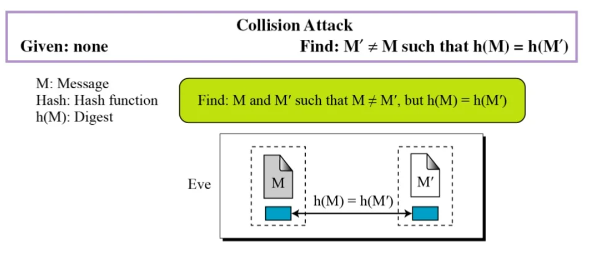

找不到任何两条具有相同消息摘要的不同消息，碰撞阻力意味着第二原像阻力。如果我们能找到碰撞，就会给签名者提供一种拒绝他们签名的方法

```python
import random
import string
import hashlib
numTrials = 0
times = 5
sumTrials = 0
for i in range(times):
    while True:
        randomString1 = ''.join([random.choice(
            string.ascii_letters + string.digits + string.punctuation) for n in range(20)])
        randomString2 = ''.join([random.choice(
            string.ascii_letters + string.digits + string.punctuation) for n in range(20)])
        if randomString1 == randomString2:
            continue
        else:
            hash_object_1 = hashlib.md5(randomString1.encode())
            hash_string_1 = hash_object_1.hexdigest()
            hash_object_2 = hashlib.md5(randomString2.encode())
            hash_string_2 = hash_object_2.hexdigest()
            numTrials += 1
            if (hash_string_1[0:6] == hash_string_2[0:6]):
                break
    sumTrials += numTrials
    print("No.", i+1, "num trials to break collision-resistant property = ", numTrials)
print("average:", sumTrials/times)

```

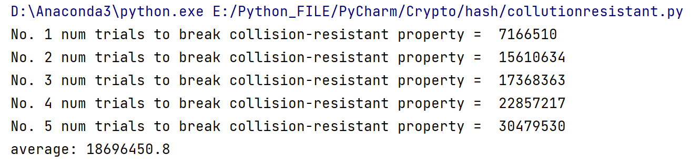

平均值为18696450

C版本

```bash
#define _CRT_SECURE_NO_WARNINGS
#include <stdio.h>
#include <string.h>
#include <openssl/evp.h>
#include <time.h>
//生成随机字符串用到的字符
char strdict[] = "0123456789qwertyuiopasdfghjklzxcvbnmQWERTYUIOPASDFGHJKLZXCVBNM!\"#$ % &'()*+, -./:;<=>?@[\\]^_`{|}~";
//生成随机字符串的函数
void generateString(unsigned char* gen_str, const unsigned int len)
{
    int dictlen = strlen(strdict);
    for (int i = 0; i < len; i++)
    {
        int randnumm = rand() % dictlen;
        gen_str[i] = strdict[randnumm];
    }
}

int main(int argc, char* argv[])
{

    EVP_MD_CTX* mdctx0, * mdctx1;
    const EVP_MD* md;
    unsigned char md_value0[EVP_MAX_MD_SIZE], md_value1[EVP_MAX_MD_SIZE];
    unsigned int md_len, count;
    float average = 0;
    const unsigned int len = 12;
    argv[1] = "md5";//使用md5算法
    unsigned char str1[len + 1] = { "\0" };//因为字符串末尾还需要一个\0作为结束标志，所以长度为len+1
    unsigned char str2[len + 1] = { "\0" };
    srand((unsigned int)time(NULL));//设置随机数种子
    for (int i = 0; i < 5; i++) //5次破解
    {
        count = 0;//尝试次数
        char hash_value0[7] = "1";//因为字符串末尾还需要一个\0作为结束标志，所以长度为7
        char hash_value1[7] = "0";
        while (strcmp(hash_value0, hash_value1))
        {
            generateString(str1, len);
            generateString(str2, len);
            if (strcmp((const char*)str1, (const char*)str2) == 0)
                continue;   //生成的两个随机字符串相等则重新生成
            if (argv[1] == NULL) {
                printf("Usage: mdtest digestname\n");
                exit(1);
            }

            md = EVP_get_digestbyname(argv[1]);
            if (md == NULL) {
                printf("Unknown message digest %s\n", argv[1]);
                exit(1);
            }
            //计算str1的哈希值
            mdctx0 = EVP_MD_CTX_new();
            EVP_DigestInit_ex2(mdctx0, md, NULL);
            EVP_DigestUpdate(mdctx0, str1, strlen((const char*)str1));
            EVP_DigestFinal_ex(mdctx0, md_value0, &md_len);
            EVP_MD_CTX_free(mdctx0);
            sprintf(hash_value0, "%02x%02x%02x", md_value0[0], md_value0[1], md_value0[2]);//只取前24位
            /*
            printf("Digest is: ");
            for (int i = 0; i < md_len; i++)
                printf("%02x", md_value0[i]);
            printf("\n");
            */
            //计算str2的哈希值
            mdctx1 = EVP_MD_CTX_new();
            EVP_DigestInit_ex2(mdctx1, md, NULL);
            EVP_DigestUpdate(mdctx1, str2, strlen((const char*)str2));
            EVP_DigestFinal_ex(mdctx1, md_value1, &md_len);
            EVP_MD_CTX_free(mdctx1);
            sprintf(hash_value1, "%02x%02x%02x", md_value1[0], md_value1[1], md_value1[2]);//只取前24位
            /*
            printf("Digest is: ");
            for (int i = 0; i < md_len; i++)
                printf("%02x", md_value1[i]);
            printf("\n");
            */
            count++;
        }
        printf("Number of attempts is :%d\n", count);
        average += count;
        //printf("str1 :%s\n", str1);
        //printf("str2 :%s\n", str2);
    }
    printf("The average number of attempts is:%f\n", average / 5);
    return 0;
}
```

> 3、根据你的观察，使用暴力破解方法更容易破坏哪个属性？

- 可以观察到，平均破解单向hash需要的次数为104693255，平均破解无碰撞hash需要的次数为18696450，显然使用蛮力法更容易破解的属性是无碰撞属性。

> 4、你能用数学方法解释一下你的观察结果的差异吗？

由以上结果可知，破解抗碰撞性要更容易一些（生日攻击原理）。证明过程如下：

1. 单向性

问题描述为：

已知哈希值$H$ ，输入空间的大小为$n$ ，尝试次数为$k$ ，计算能找到一个输入使得其哈希值也为$H$的概率。

解：

对于任意一个输入，其哈希值为$H$的概率为$\frac{1}{n}$哈希值不为$H$的概率为$1-\frac{1}{n}$ 。那么，对于$k$个输入，他们的哈希值都不为$H$的概率为$(1-\frac{1}{n})^k$ 。故，至少有一个输入的哈希值为$H$的概率为
$$
1-(1-\frac{1}{n})^k
$$


2. 抗碰撞性

问题描述为：

输入空间的大小为$n$，尝试次数为$k$ ，计算找到两个输入使得它们的哈希值相等的概率。

解：

这$k$个输入的哈希值都不相等的概率为：
$$
\frac{C^1_n}{n} \frac{C^1_{n-1}}{n} \frac{C^1_{n-2}}{n}\cdots \frac{C^1_{n-k+1}}{n}=\frac{n!}{n^k(n-k)!}
$$
​          

则至少两个输入的哈希值相等的概率为：
$$
1 - \frac{n!}{n^k(n-k)!}
$$
接下来我们比1式和2式的被减数。相除得：
$$
\frac{\frac{n!}{n^k(n-k)!}}{(1-\frac{1}{n})^k} = \frac{n!}{(n-1)^k(n-k)!}
$$


​                                          

当输入空间足够大时$(n-1)^k = n^k$，$(n-k)! = n!$，则上式$<1$，自然2式子小于1式子，因此破解抗碰撞性更容易一些。
