# Public-Key Infrastructure (PKI) Lab

> 公钥密码学是当今安全通信的基础，但当通信的一方将公钥发送到另一边时，它就会受到人工攻击。根本的问题是，没有简单的方法来验证公钥的所有权，即，给定一个公钥及其声明的所有者信息，我们如何确保公钥确实属于声明的所有者？公钥基础设施(PKI)是解决这个问题的一个实用的解决方案。
>
> 本实验室的学习目标是让学生获得关于PKI的第一手经验。SEED实验室有一系列专注于公钥密码学的实验室，而这个实验室则专注于PKI。通过在这个实验室完成任务，学生应该能够更好地理解PKI是如何工作的，PKI如何被用来保护网络，以及中间人攻击如何被PKI击败。此外，学生将能够理解对公钥基础设施的信任的根源，以及如果根本信任被破坏，会出现什么问题。本实验室涵盖以下主题：
>
> - 公钥加密、公钥基础架构(PKI)
> - 证书颁发机构（CA)、X.509证书和根CA
> - Apache、HTTP和HTTPS
> - 中间人攻击

## 公钥构架

- 公开密钥密码学

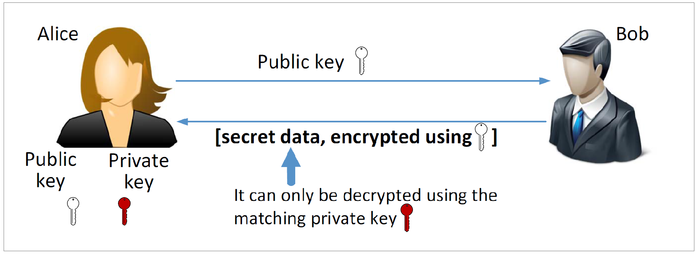

- 中间人攻击

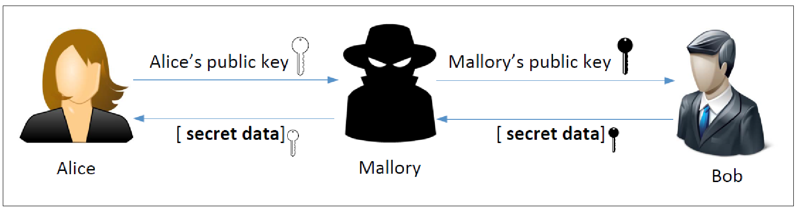

**根本问题**：

- 鲍勃没有办法知道他收到的公钥是否属于爱丽丝。

**解决方案**：

- 找到受信任方以验证身份	

- 将身份绑定到证书中的公钥
- 证书不能伪造或篡改（使用数字签名）

### 数字签名

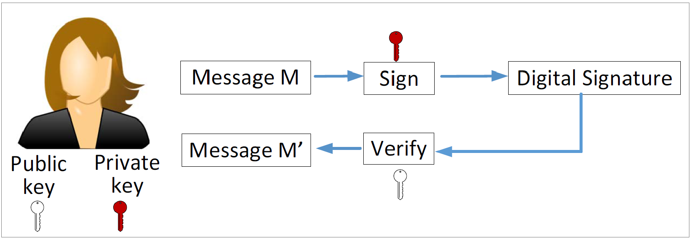

如果签名没有被篡改，M‘将和M只有Alice可以签名一样（她有私钥），每个人都可以验证（公钥是公开已知的）

使用数字签名防止MITM攻击：

- Alice需要去一个受信任方来获得一个证书。
- 在验证Alice的身份后，受信任方颁发带有Alice的名字和公钥的证书。
- Alice将整个证书发送给Bob。
- Bob使用受信任方的公钥来验证证书。
- Bob现在知道了一个公钥的真正所有者。

证书颁发机构(CA)：一个受信任的交易方，负责验证用户的身份，然后将已验证的身份绑定到一个公钥。

数字证书：证明其中包含的公钥确实属于文档中描述的身份的文件。


Q：如果ModelCA的证书是自签名的，我们如何验证它？

A：没有办法来验证它。我们只是确保证书以受信任的方式获得

- 附带操作系统（如果我们信任操作系统，我们就信任证书）。
- 与该软件一起提供（如果我们信任该软件，那么我们就信任该证书）。
- 手动添加（如果我们相信自己的决定，我们就相信证书）。
- 是由我们不信任的人寄给我们的（不要相信证书）

## 实验环境设置

> 在这个实验室中，我们将生成公钥证书，然后使用它们来保护web服务器。证书生成任务将在VM上执行，但我们将使用一个容器来托管web服务器。

> **容器设置和命令**。请从实验室的网站下载[Labsetup.zip](https://github.com/SKPrimin/HomeWork/tree/main/SEEDLabs/Crypto_PKI/Labsetup.zip)文件到您的VM，解压它，进入Labsetup文件夹，并使用docker-compose.yml文件来设置实验室环境。
>
> 在下面的内容中，我们将列出一些与Docker和组成相关的常用命令。由于我们将非常频繁地使用这些命令，因此我们已经在.bashrc文件(在我们提供的SEEDubuntu20.04VM中)中为它们创建了别名。
>
> ```bash
> $ docker-compose build # 构建容器镜像
> $ docker-compose up    # 启动容器
> $ docker-compose down  # 关闭容器
> 
> // 上面命令的别名
> $ dcbuild		 # Alias for: docker-compose build
> $ dcup 			 # Alias for: docker-compose up
> $ dcdown 		 # Alias for: docker-compose down
> ```
>

```
docker-compose build
docker-compose up
```

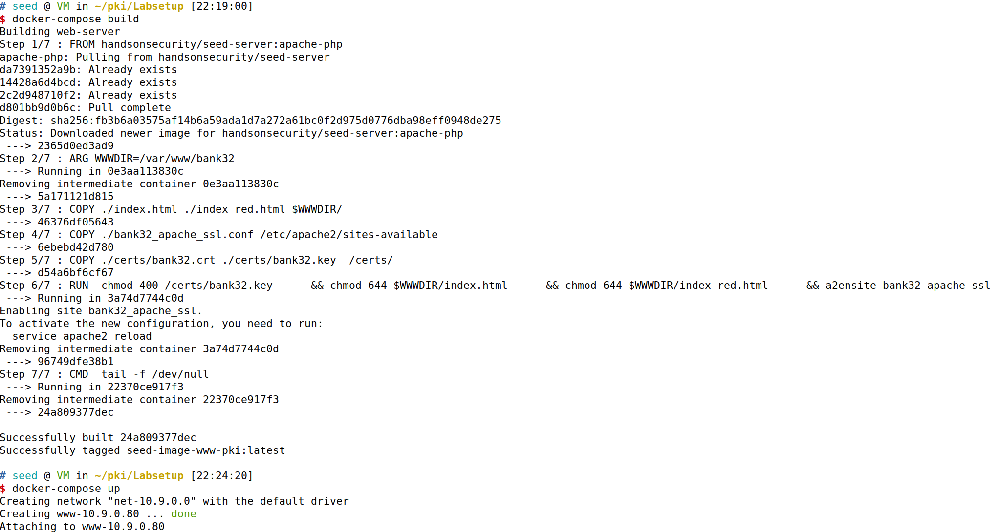

> 所有的容器都将在后台运行。要在容器上运行命令，我们通常需要在该容器上获取一个shell。我们首先需要使用“dockerps”命令来找出容器的ID，然后使用“dockerexec”来在该容器上启动一个shell。我们已经在.bashrc文件中为它们创建了别名。
>
> ```bash
> $ dockps 		// Alias for: docker ps --format "{{.ID}} {{.Names}}"
> $ docksh <id>   // Alias for: docker exec -it <id> /bin/bash
> 
> // 下面的示例显示了如何在主机内获取shell
> $ dockps
> b1004832e275	hostA-10.9.0.5
> 0af4ea7a3e2e 	hostB-10.9.0.6
> 9652715c8e0a 	hostC-10.9.0.7
> 
> $ docksh 96
> root@9652715c8e0a:/#
> // 注意：如果Docker命令需要一个容器ID，则无需键入整个ID字符串。 
> // 只要所有容器在所有容器中都是唯一的，那么键入前几个字符就足够了。
> ```

```bash
docker ps
docker exec -it 05 /bin/bash
```

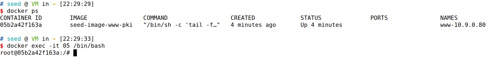

> **DNS设置**。在本文档中，我们以 www.bank32.com 为例说明如何部署具有此域名的 HTTPS Web 服务器。
> 学生需要使用其他名称完成实验。除非教师额外指定名称，否则学生应在服务器名称中包括其姓氏和实验年份。
> 例如，王小二在 2020 年进行了此实验，则服务器名称应为 www.wang2020.com。
> 你不需要拥有此域名，你只需要通过在 /etc/hosts中添加以下条目即可将此名称映射到容器的IP地址（第一个条目是必需的，否则，本实验说明中的示例将会失效）：
>
> ```python
> 10.9.0.80   www.bank32.com
> 10.9.0.80   www.wang2020.com
> ```

```
sudo vim /etc/hosts
```

先按下<kbd>i</kbd> 键编辑内容，调整好格式后，按下<kbd>Esc</kbd>键进入命令模式，输入`:wq`保存并退出。

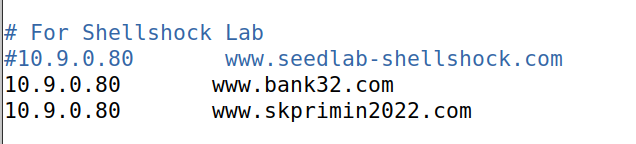

## 任务1：成为证书颁发机构(CA)

> 证书颁发机构（CA）是颁发数字证书的一个受信任的实体。数字证书通过证书指定的主体（Subject）证明公钥的所有权。有许多商业化的CA被视为根CA。在撰写本文时，VeriSign是最大的CA。用户需要付费才能获得这些商业CA颁发的数字证书。
>
> 在这个实验中，我们需要创建数字证书，但是我们不会向任何商业CA付费。我们会自己创建一个根CA，然后使用该CA为其他实体（例如服务器）颁发证书。在此任务中，我们将自己设为根CA，并为此CA生成一个证书。与通常由另一个CA签名的其他证书不同，根CA的证书是自签名的。根CA的证书通常预加载到大多数操作系统，Web浏览器和其他依赖PKI的软件中。根CA的证书是无条件信任的。

> **配置文件选项**。配置文件openssl.conf。要使用 OpenSSL 来创建证书，首先需要有一个配置文件。配置文件的扩展名通常为  `.cnf`。在 OpenSSL 的 ca、 req 和  x509 命令中会使用到这个配置文件。openssl.conf 的说明文档可以网络上找到，OpenSSL 默认会使用 `/usr/lib/ssl/openssl.cnf` 作为配置文件。
> 由于我们需要对这个文件做出一些改动，我们把它复制到当前目录，并指定 OpenSSL 使用这个副本。

```bash
cp /usr/lib/ssl/openssl.cnf ~/pki
```

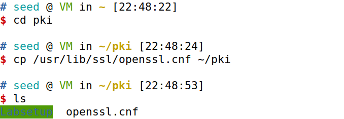

> 配置文件中的[CA_default] 一节展示了我们需要准备的默认设置。我们需要创建几个子目录。请去掉 unique_subject 一行的注释，以允许创建有相同主体的多张证书，因为在这个实验中我们很可能遇到这种情况。
>
>
> <center>清单1：默认的CA设置</center>
>
> ```bash
> [ CA_default ]
> dir             = ./demoCA         # Where everything is kept
> certs           = $dir/certs       # Where the issued certs are kept
> crl_dir         = $dir/crl         # Where the issued crl are kept
> database        = $dir/index.txt   # database index file.
> #unique_subject = no               # Set to 'no' to allow creation of
>                                     # several certs with same subject.
> new_certs_dir   = $dir/newcerts    # default place for new certs.
> serial          = $dir/serial      # The current serial number
> ```
>
> 对于index.txt文件，只需创建一个空文件。对于serial文件，在文件中放一个字符串格式的数字（例如1000）。设置了配置文件openssl.cnf后，就可以创建并颁发证书了。

显然，根据其清单内容，我们要新建一个文件夹demoCA  ，然后在demoCA下新建certs crl newcerts 三个文件夹和 index.txt serial 两个文件

```bash
mkdir demoCA
ls
cd demoCA
mkdir certs crl newcerts 
touch index.txt
echo 1000 > serial
```

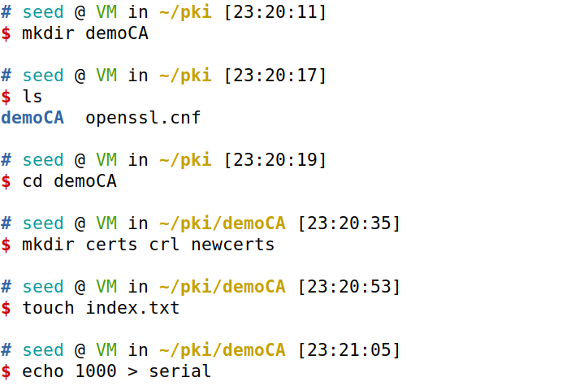

此时的文件情况如下所示

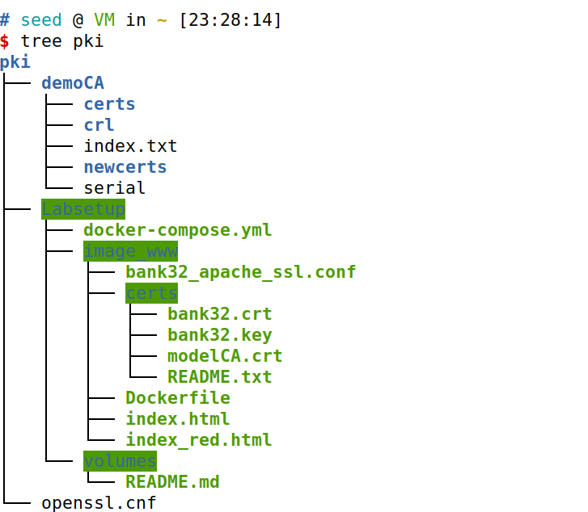

随后我们在 pki文件夹下修改文件，去掉 unique_subject 一行的注释

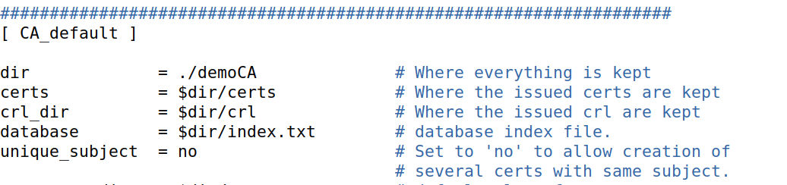

> **证书颁发机构(CA)**。如前所述，我们需要为我们的CA生成一个自签名证书。这意味着该CA是完全受信任的，并且其证书将用作根证书。你可以运行以下命令为CA生成自签名证书：
>
> ```bash
> openssl req -x509 -newkey rsa:4096 -sha256 -days 3650 \
>             -keyout ca.key -out ca.crt
> ```
>
> 系统将提示您输入密码。不要丢失此密码，因为每次要使用此CA为其他证书签名时，都必须键入密码短语。您还将被要求填写主题信息，如国家名称、公共名称等。
>
> 该命令的输出存储在两个文件中：ca.key和ca.crt。文件ca.key包含CA的私钥，而ca.crt包含公钥证书。

由于要指定修改后的`openssl.cnf`，因此我们需要再添加一个参数-config ，来指定配置openssl.cnf。我们应在openssl.cnf同一路径下运行此命令。但显然这个要输入的有点多了，我们还是换下一个指令吧。

```bash
openssl req -x509 -newkey rsa:4096 -sha256 -days 3650 \
            -keyout ca.key -out ca.crt \
            -config openssl.cnf
```


> 你也可以在命令行中指定主体信息和密码，这样就不会提示你输入任何其他信息。
>在以下命令中，我们使用 -subj 设置主体信息；使用 -passout pass:dees 将密码设置为 dees 。
> 
>```bash
> openssl req -x509 -newkey rsa:4096 -sha256 -days 3650 \
>             -keyout ca.key -out ca.crt  \
>             -subj "/CN=www.modelCA.com/O=Model CA LTD./C=US" \
>             -passout pass:dees
> ```
> 

显然还是这个命令干净利落。

```bash
openssl req -x509 -newkey rsa:4096 -sha256 -days 3650 \
            -keyout ca.key -out ca.crt  \
            -config openssl.cnf \
            -subj "/CN=www.modelCA.com/O=Model CA LTD./C=US" \
            -passout pass:dees
```

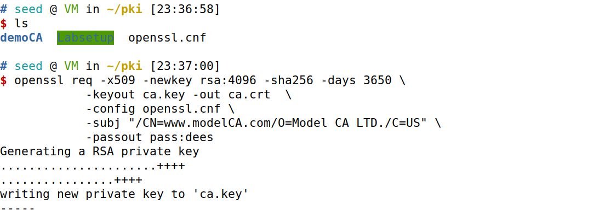

> 我们可以使用以下命令查看 X509 证书和 RSA 密钥的解码内容
> （ -text 表示将内容解码为纯文本； -noout 表示不打印出编码版本）：
>
> ```bash
> openssl x509 -in ca.crt -text -noout
> openssl rsa -in ca.key -text -noout
> ```
>

```bash
openssl x509 -in ca.crt -text -noout
```

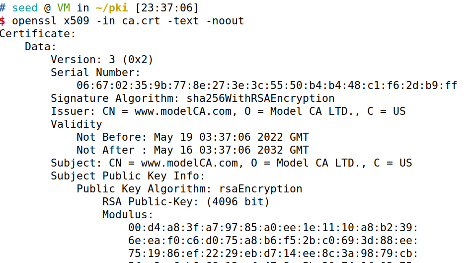

> 请运行以上命令，并从输出中找出以下内容：
>
> - 证书中的哪一部分说明了这是一个 CA 的证书？

- Basic Constraints：一指明是否属于CA;

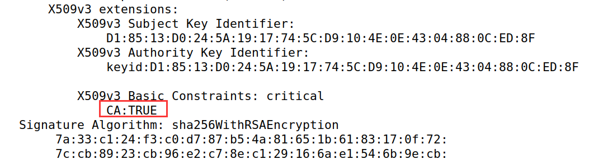

> - 证书中的哪一部分说明了这是一个自签名证书？

- 颁发者（Issuer）：发证书单位的标识信息，如N=www.example.com  ST=Beijing, L=Beijing, O=Model ，C  C=CN；

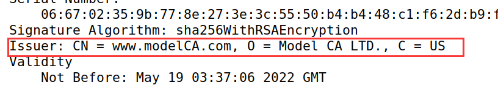

颁发者是我们自己指定的


- 颁发者唯一号（Issuer Unique Identifier）：代表颁发者的唯一信息；
- 主体唯一号（Subject Unique Identifier）：代表拥有证书实体的唯一信息

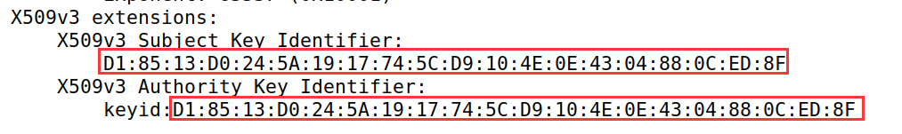

颁发者与拥有证书实体是相同的。

> - 在 RSA 算法中，我们有公开指数 $e$ 、私有指数 $d$、模数 $n$， 以及两个秘密的数 $p$ 和 $q$ 使得 $n = pq$ 。 请从你的证书和密钥文件中找出这些元素的值。

RSA查看，输入密码 dees

``` bash
openssl rsa -in ca.key -text -noout
```

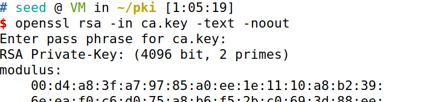

文件内容缩略如下

```css
modulus:
	00:d4:a8:3f:a7:97:85:a0:ee:1e:11:10:a8:b2:39...  长度1026
publicExponent: 65537 (0x10001)
privateExponent:
	1a:c0:1f:61:c1:99:b9:a8:ba:77:83:14:f5:76:6c...  长度1024
prime1:
    00:ff:72:26:e9:e0:c2:a7:18:cc:5e:21:fd:09:d8...  长度514
prime2:
	00:d5:1e:56:16:23:4c:fa:d1:a5:42:2b:14:81:22...  长度514
exponent1:
	14:b8:69:b7:a6:e7:a3:2e:3b:c5:96:f4:33:8c:49...  长度512
exponent2:
    23:1d:22:75:f7:4f:01:ac:75:1c:17:d9:03:05:d9...  长度512
coefficient:
	00:99:f3:d7:29:88:e6:61:56:db:ca:f5:6e:37:45...  长度514
```

显然

| RSA名称      | ca.key对应部分  |
| ------------ | --------------- |
| 公开指数 $e$ | publicExponent  |
| 私有指数 $d$ | privateExponent |
| 模数 $n$     | modulus         |
| $p$          | prime1          |
| $q$          | prime2          |

## 任务 2: 为你的 Web 服务器生成证书请求

> 生成证书签名请求（CSR）的命令与在创建 CA 自签名证书时使用的命令非常相似，唯一的区别是是否带有 -x509选项。
>
> 没有这个选项，该命令将生成一个证书签发请求；加上这个选项，该命令将生成一个自签名证书。以下命令为 www.bank32.com生成 CSR （您应该使用自己的服务器名称）：
>
> ```bash
> openssl req -newkey rsa:2048 -sha256  \
>             -keyout server.key   -out server.csr  \
>             -subj "/CN=www.bank32.com/O=Bank32 Inc./C=US" \
>             -passout pass:dees
> ```
>
> 该命令将生成一对公私钥对，然后使用公钥创建证书签名请求。我们可以使用以下命令查看 CSR 和私钥文件的解码内容：
>
> ```bash
> openssl req -in server.csr -text -noout
> openssl rsa -in server.key -text -noout
> ```
>
> **添加备用名称（Alternative Name）**：许多网站都有不同的 URL 。例如， www.example.com ， example.com ， example.net和 example.org 都指向同一 Web 服务器。
> 由于浏览器实施了主机名匹配策略，因此证书中的公用名（Common Name）必须与服务器的主机名匹配，否则浏览器将拒绝与服务器通信。
>
> 为了使证书具有多个名称， X.509 规范定义了一个可以附加到证书的扩展，名为主体备用名称（SAN）。使用 SAN 扩展名，可以在证书的 subjectAltName 字段中指定多个主机名。
>
> 要使用此类字段生成证书签名请求，我们可以将所有必要的信息放在配置文件中或命令行中。我们在本任务中使用命令行的方法（在 TLS 实验中会使用配置文件的方法）。我们可以在 openssl req 命令中添加以下选项。
> 应当注意， subjectAltName 扩展字段还必须包括通用名称字段中的主机名。否则，通用名称将不会被接受为有效名称。
>
> ```bash
> -addext "subjectAltName = DNS:www.bank32.com,  \
>                           DNS:www.bank32A.com, \
>                           DNS:www.bank32B.com"
> ```
>
> 请在你的证书签名请求中添加两个备用名称。在后面的任务中将会用到它们。

```bash
openssl req -newkey rsa:2048 -sha256  \
            -keyout server.key   -out server.csr  \
            -config openssl.cnf \
            -subj "/CN=www.skprimin2022.com/O=Bank32 Inc./C=US" \
            -passout pass:dees -addext "subjectAltName = DNS:www.skprimin2022.com,  \
                          DNS:www.skprimin2022A.com, \
                          DNS:www.skprimin2022B.com"
```

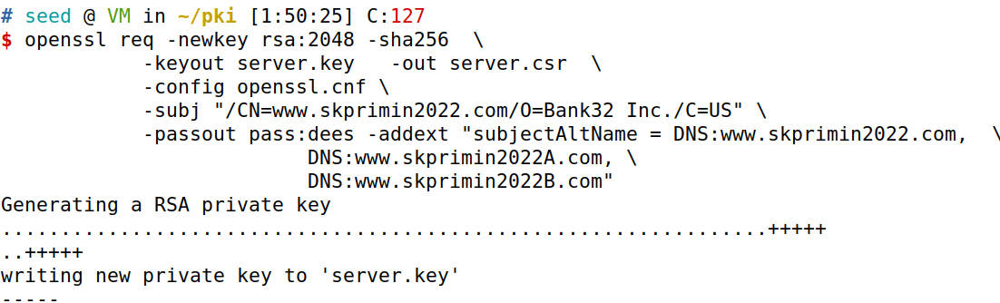

```bash
openssl req -in server.csr -text -noout
openssl rsa -in server.key -text -noout
```


## 任务 3: 为你的服务器生成证书

> CSR文件需要具有CA的签名才能形成证书。在现实世界中，通常将CSR文件发送到受信任的CA进行签名。在本实验中，我们将使用我们自己的受信任CA生成证书。以下命令使用CA的  ca.crt 和  ca.key ，将证书签名请求（  server.csr ）转换为X509证书（ server.crt）：
>
> ```bash
> openssl ca -config myCA_openssl.cnf -policy policy_anything \
>          -md sha256 -days 3650 \
>          -in server.csr -out server.crt -batch \
>          -cert ca.crt -keyfile ca.key
> ```
>
> 在上面的命令中，`myCA_openssl.cnf `是我们从 ` /usr/lib/ssl/openssl.cnf`
> 复制的配置文件（我们在任务 1 中对此文件进行了更改）。我们使用配置文件中定义的 policy\_anything 策略，这不是默认策略。默认策略有更多限制，要求请求中的某些主体信息必须与 CA 证书中的主体信息匹配。命令中使用的策略不强制执行任何匹配规则。
>
> **复制扩展域**：出于安全原因，openssl.cnf 中的默认设置不允许 openssl ca 命令将扩展字段从请求复制到最终证书。为此，我们可以在配置文件的副本中，取消以下行的注释：
>
> ```bash
> # 扩展复制选项：谨慎使用。
> copy_extensions = copy
> ```
>

openssl.cnf我们早已复制过来，我们再次修改文件

```
sudo vim openssl.cnf
```

位于 68行

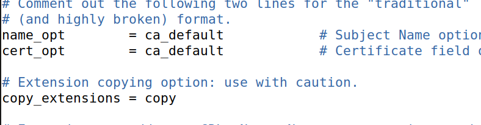

```bash
openssl ca -config openssl.cnf -policy policy_anything \
         -md sha256 -days 3650 \
         -in server.csr -out server.crt -batch \
         -cert ca.crt -keyfile ca.key
```

| 参数                | 含义                                 |
| ----------------- | -------------------------------------------- |
| ca                | 证书授权模块                                 |
| -in filename      | 指定输入文件名                               |
| -out filename     | 结果存储在指定的输出文件中。                 |
| -cert             | 证书授权证书文件。                           |
| -keyfile filename | 签署请求的私钥。                             |
| server.csr        | server.csr是要读取用于处理结果的输入文件名。 |
| server.crt        | server.crt是输出的文件                       |
| ca.crt            | Ca.crt是签名证书。                           |
| ca.key            | Ca.key 是证书的私钥。                        |

签署整证书，密码设为 dees

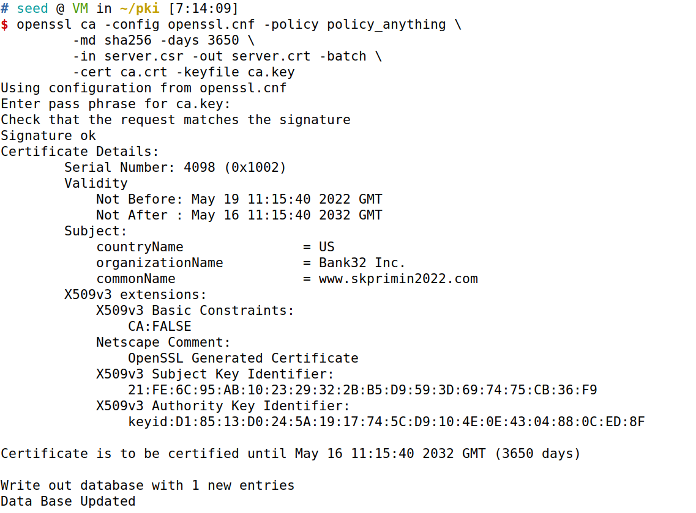

> 签署证书后，请使用以下命令输出证书的解码内容，并检查是否包含备用名称。
>
> ```bash
> openssl x509 -in server.crt -text -noout
> ```
>

我们再其中并没有看到备用名称

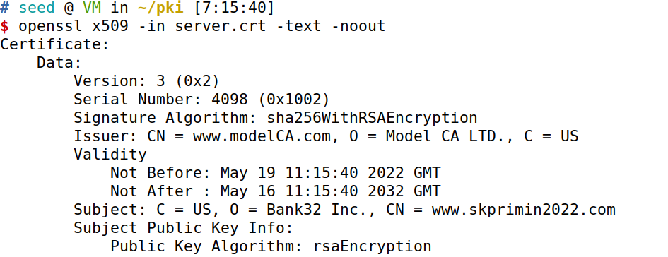

## 任务 4： 在基于Apache的HTTPS网站中部署证书

> 在此任务中，我们将看到网站如何使用公钥证书来保护 Web 浏览。我们将建立一个基于 Apache 的 HTTPS 网站。我们的容器中已经安装了 Apache 服务器，它支持 HTTPS 协议。要搭建 HTTPS 网站，我们只需要配置 Apache 服务器，让它知道从哪里获取私钥和证书。在我们的容器中，我们已经为bank32.com设置了一个HTTPS站点。学生们可以遵循这个例子来建立他们自己的HTTPS站点。
>
> 一个Apache服务器可以同时托管多个网站。它需要知道网站文件的存储目录。这是通过位于 /etc/apache2/sites-available 目录中的 VirtualHost 文件完成的。在我们的容器中，我们有一个名为 bank32\_apache\_ssl.conf 的文件，其中包含以下条目：
>
> ```css
> <VirtualHost *:443>
>  DocumentRoot /var/www/bank32
>  ServerName www.bank32.com
>  ServerAlias www.bank32A.com
>  ServerAlias www.bank32B.com
>  DirectoryIndex index.html
>  SSLEngine On
>  SSLCertificateFile    /certs/bank32.crt    (*@\ding{192}@*)
>  SSLCertificateKeyFile /certs/bank32.key    (*@\ding{193}@*)
> </VirtualHost>
> ```
>
> 上面的示例设置了 HTTPS 站点 https://www.bank32.com（端口 443 是默认的 HTTPS 端口）。
> ServerName 条目指定网站的名称，而 DocumentRoot 条目指定网站文件的存储位置。使用 ServerAlias 条目，我们允许网站使用不同的名称。你也应该提供两个别名条目。
>
> 我们还需要告诉 Apache 服务器证书（192）和私钥（193）的存储位置。在 Dockerfile 中，我们已经包含了用于将证书和密钥复制到容器的 /certs文件夹的命令。

我们在此处修改文件内容

```xml
<VirtualHost *:443> 
    DocumentRoot /var/www/bank32
    ServerName www.skprimin2022.com
    ServerAlias www.skprimin2022A.com
    ServerAlias www.skprimin2022B.com
    DirectoryIndex index.html
    SSLEngine On 
    SSLCertificateFile /certs/server.crt
    SSLCertificateKeyFile /certs/server.key
</VirtualHost>
```

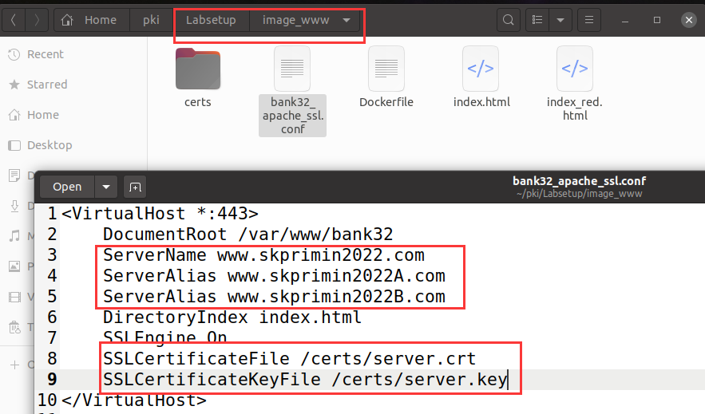

并将上面生成的server.crt server.key放入到image_www/certs下

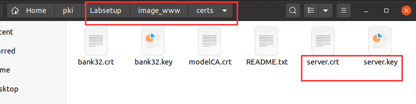

此外，还需要修改Dockerfile文件内容，COPY server的文件等

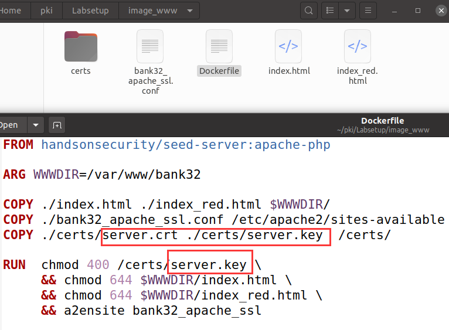

随后重新构建docker 

```
docker-compose down

docker-compose build
docker-compose up
```

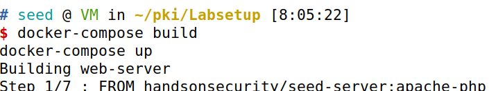

随后进入docker，我们查看配置文件发现已经是我们修改之后的。

```
docker ps

docker exec -it cc /bin/bash

cat /etc/apache2/sites-available/bank32_apache_ssl.conf
cat
```

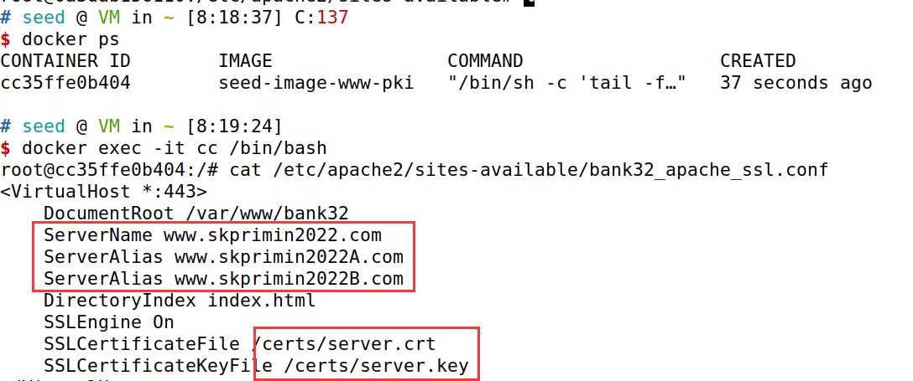

> 为了使该网站正常工作，我们需要启用 Apache 的 ssl 模块，然后启用该网站。可以使用以下命令完成操作，这些命令在构建容器时已经执行。
>
>
> ```bash
> # a2enmod ssl                 // 启用SSL模块
> # a2ensite bank32_apache_ssl  // 启用此文件中描述的网站
> ```
>

> **启动 Apache 服务器**：在容器中 Apache 服务器不会自动启动。我们需要在容器里运行以下命令来启动服务器（我们还列出了一些相关命令）：
>
> ```java
> // Start the server
> # service apache2 start
> 
> // Stop the server
> # service apache stop
> 
> // Restart a server
> # service apache restart
> ```
>
> Apache 启动时，需要为每个 HTTPS 站点加载私钥。我们的私钥已加密，因此 Apache 会要求我们输入密码进行解密。在容器内，用于 bank32 的密码为 dees 。如果一切设置正确，我们就可以浏览该网站，并且浏览器和服务器之间的所有流量都将被加密。

```bash
a2enmod ssl
a2ensite bank32_apache_ssl
service apache2 start
```

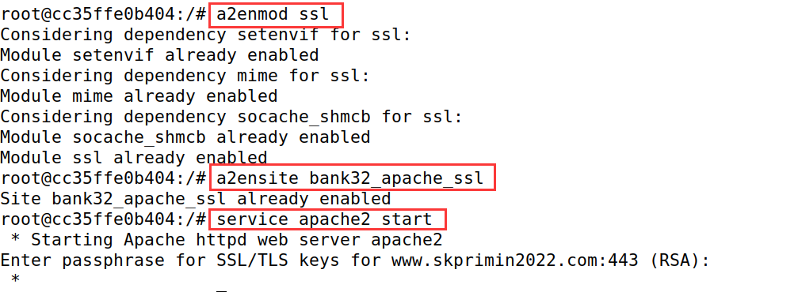

> 请使用以上示例作为指导，为您的网站设置 HTTPS 服务器。请描述你的操作步骤、添加到 Apache 的配置文件中的内容以及最终结果的屏幕截图，以展示你可以成功浏览 HTTPS 站点。

> **虚拟机和容器之间的共享文件夹。**在此任务中，我们需要将文件从VM复制到容器中。为了避免重复重新创建容器，我们在VM和容器之间创建了一个共享文件夹。当您使用Labsetup文件夹中的“合成”文件来创建容器时，该卷子文件夹将被挂载到该容器中。您放在此文件夹中的任何东西都可以从正在运行的容器内部访问。
>
> **浏览网站**：现在，用浏览器访问你的 Web 服务（注意：你应该在 URL 的开头加上 https，而不要使用 http）。请描述你观察到的现象并做出解释。您很可能无法成功，这是因为……（此处省略了原因，学生应在实验报告中做出解释）。请解决此问题，并证明你可以成功访问 HTTPS 网站。

```bash
https://www.skprimin2022.com/
```

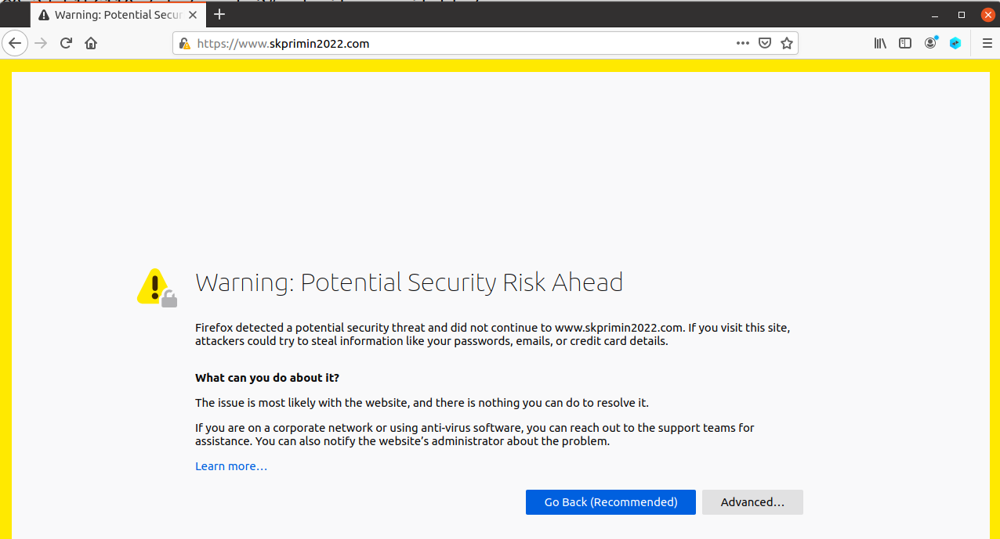

这是由于我们并没有信任此网站，我们选择相信此网站。


随后便能成功访问

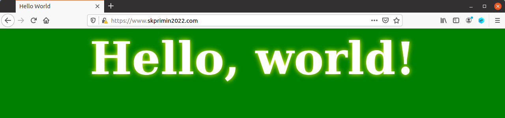

正如我们在这个任务的实验中所看到的，我们使用了一个预先构建的html文件(index.html)作为名为skprimin2022.com的网站的主页，并在一个apache服务器上部署了该网站的证书，使其成为一个安全的网页。我们还观察到，对default-ssl.conf文件的任何更改都会在https网页中部署变化，但是，在000-default.conf文件中的任何更改都会在网站的http网页中部署变化。这意味着为了将证书部署到服务器，我们需要对default-ssl.conf文件进行更改，然后使浏览器和服务器之间的连接安全。

> 
>
> 下面，我们说明如何将证书加载到 Firefox 。学生需要自己弄清楚为什么以及应该加载什么证书。要将证书手动添加到 Firefox 浏览器，请在地址栏中键入以下URL，然后单击页面上的 View Certificates 按钮（滚动到底部）。
>
> ```bash
> about:preferences#privacy
> ```
>
> 在 Authorities 标签中，你将看到已被 Firefox 接受的证书列表。

```css
about:preferences#privacy
Authorities
```

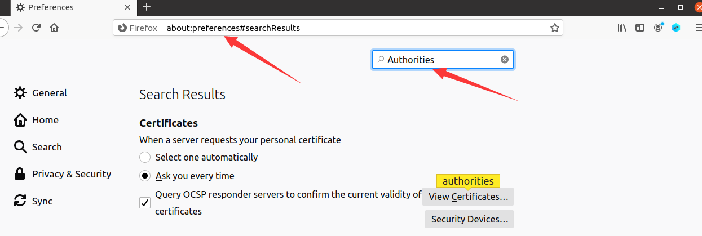

> 在这里，我们可以导入我们自己的证书。选择证书文件后，请选择 "Trust this CA to identify websites'' 选项。你会看到我们的证书现在在 Firefox 接受的证书列表中。

导入task1创建的ca.crt证书

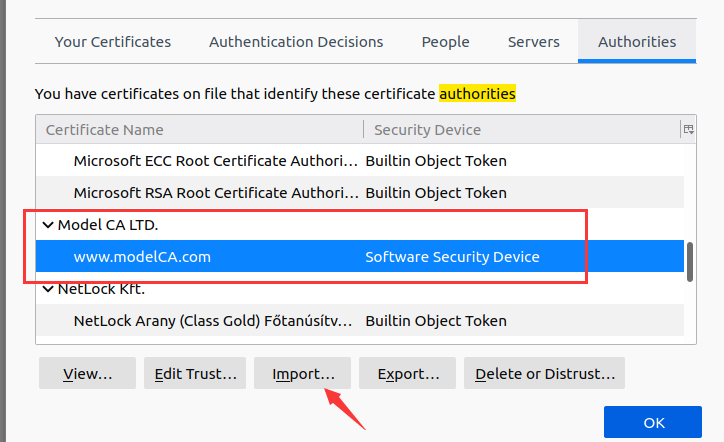

我们双击查看具体信息，确为我们所颁发的。

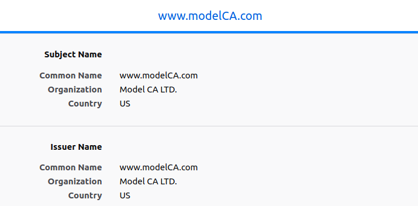

## 任务 5: 发起中间人攻击

在此任务中，我们将展示 PKI 如何抵御中间人（MITM）攻击。下图描述了MITM攻击的工作方式。

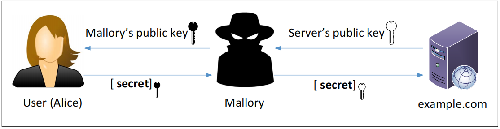

<center>中间人(MITM)攻击</center>

> 假设 Alice 想通过HTTPS协议访问 example.com。她需要从 example.com 服务器获取公钥；Alice 将生成一个秘密，并使用服务器的公钥对该秘密进行加密，然后将其发送到服务器。
>
> 如果攻击者可以拦截 Alice 与服务器之间的通信，那么攻击者可以用其自己的公钥替换服务器的公钥。这样 Alice 的秘密实际上是使用攻击者的公钥加密的，因此攻击者将能够读取该秘密。
>
> 攻击者可以使用服务器的公钥将秘密转发给服务器。因为该秘密将用于加密 Alice 和服务器之间的通信，因此攻击者可以解密加密的通信。
>

> 该任务的目的是帮助学生了解 PKI 如何抵御此类MITM攻击。在任务中，我们将模拟一次MITM攻击，并了解PKI如何精确地防御。我们将首先选择一个目标网站。
> 在本文档中，我们使用 www.example.com 作为目标网站。但在实际任务中，为了使其更有意义，学生可以选择一个受欢迎的网站，例如银行网站或者社交网站。

这里我们选择使用 www.bilibili.com作为目标网站。

### 第 1 步: 启动一个恶意网站

> 在任务4中，我们已经为 pkiserver 建立了HTTPS网站。我们将使用同一台 Apache 服务器来模拟 www.example.com （或学生选择的站点www.bilibili.com）。
> 为此，我们将按照任务4中的说明向Apache的SSL配置文件中添加 VirtualHost 条目，ServerName 应该为 www.bilibili.com ，但其余配置可以与任务4中使用的相同。

443是默认的 HTTPS 端口，而80是默认的 HTTP 端口，这一次我们修改完全。

```xml
<VirtualHost *:443> 
    DocumentRoot /var/www/bank32
    ServerName www.bilibili.com

    DirectoryIndex index.html
    SSLEngine On 
    SSLCertificateFile /certs/server.crt
    SSLCertificateKeyFile /certs/server.key
</VirtualHost>

<VirtualHost *:80> 
    DocumentRoot /var/www/bank32
    ServerName www.skprimin2022.com
    DirectoryIndex index_red.html
</VirtualHost>
```

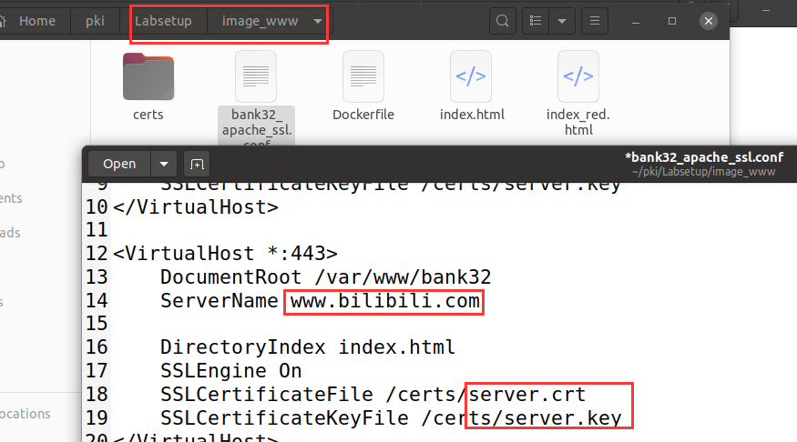


> 显然在真实世界中你不可能获得一个 www.bilibili.com 的合法证书，所以我们将会使用与我们自己的服务器相同的证书。
>
> 我们的目标如下：当用户尝试访问 www.bilibili.com 时，我们将使该用户进入我们的服务器，该服务器托管一个伪造的 www.bilibili.com。
>
> 如果这是一个社交网络网站，则假网站可以显示类似于目标网站中的登录页面。
> 如果用户无法分辨出区别，则可以在伪造的网页中键入其帐户凭据，从而使攻击者获得凭据。

### 第 2 步: 成为中间人

> 有几种方法可以使用户的 HTTPS 请求进入我们的 Web 服务器。
>
> 一种方法是路由攻击，使用户的 HTTPS 请求被路由到我们的 Web 服务器。
>
> 另一种方法是 DNS 攻击，当受害者的计算机尝试找出目标 Web 服务器的 IP 地址时，它将获取到我们 Web 服务器的 IP 地址。
>
> 在此任务中，我们模拟 DNS 攻击。我们无需发动真正的的 DNS 缓存中毒攻击，只需要修改受害者机器的 /etc/hosts 文件，通过把 www.example.com 映射到我们的恶意 Web 服务器上来模拟 DNS 缓存存储攻击的结果。
>
> ```bash
> 10.9.0.80  www.example.com
> ```

```bash
10.9.0.80       www.bilibili.com
```

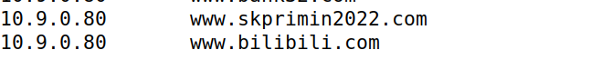

### 第 3 步: 浏览目标网站

> 完成所有设置后，现在访问目标真实网站，并查看您的浏览器会说些什么。请解释你观察到的现象。

```
docker ps

docker exec -it 4e /bin/bash

a2enmod ssl
a2ensite bank32_apache_ssl
service apache2 start
```

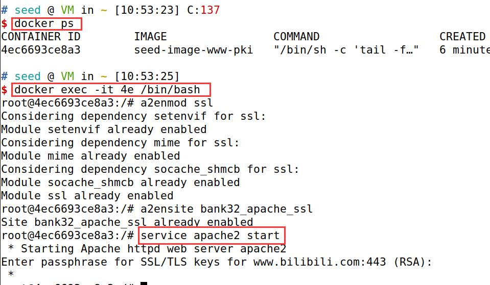

htttp形式浏览目标网站，直接被标记为不安全

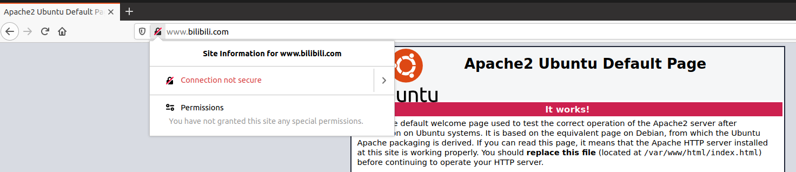

https形式浏览目标网站，发现被警告

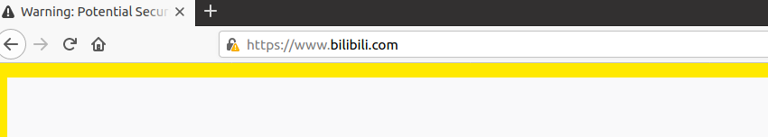

如果使用默认的bank32，我们会发现效果更明显

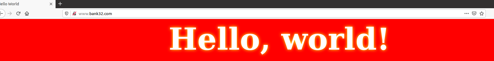

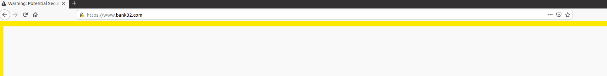

通过这个任务，我们观察到我们成功地让用户访问bilibili.com恶意网页，但是，浏览器仍然显示连接不安全的警告。

如果用户访问http://www.bilibili.com网页，他/她将登陆恶意页面，但会观察到连接不安全(因为使用了http协议)。

如果用户访问https://instagram.com网页，则浏览器将显示一个提示，表示与本网站的连接不安全。

因此，我们无法在次实现中间人攻击。

## 任务 6: 使用一个被攻陷的 CA 发起中间人攻击

> 在本任务中，假设我们在任务 1 中创建的根 CA 被攻击者攻破，并且其私钥被盗。因此，攻击者可以使用此 CA 的私钥生成任意证书。在此任务中，我们将看到这种破坏的结果。

> 请设计一个实验，以表明攻击者可以在任何HTTPS网站上成功发起MITM攻击。你可以使用在任务5中创建的相同设置，但是这次，你需要证明MITM攻击是成功的。即当受害人试图访问网站时，浏览器不会有起任何怀疑，而是落入MITM攻击者的虚假网站。

#### 生成公钥/私钥对：skp.com

```bash
openssl genrsa -aes128 -out skp.key 1024
```

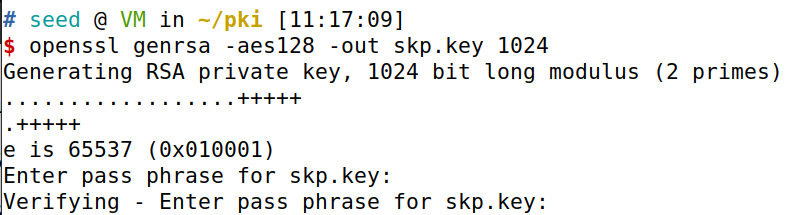


#### 生成 crt：

输入生成 skp.key 时设置的密码，先生成csr。

```bash
openssl req -new -key skp.key -out skp.csr -config openssl.cnf \
			-subj "/CN=www.modelCA.com/O=Model CA LTD./C=US" \
            -passout pass:dees
```

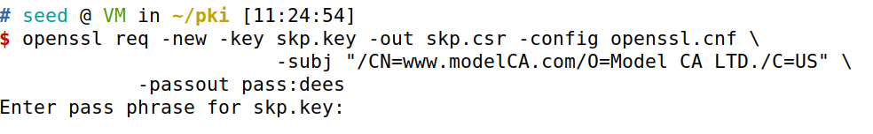

由csr，crt我们生成crt

```bash
openssl x509 -req -days 3650 -in skp.csr -signkey skp.key -out skp.crt

openssl req -new -x509 -key skp.key -out skp.crt -days 3650 
            -passout pass:dees 
openssl x509 -req -days 3650 -in skp.csr -signkey skp.key -out skp.crt

openssl ca -config openssl.cnf -policy policy_anything \
      -md sha256 -days 3650 \
      -in skp.csr -out skp.crt \
      -keyfile skp.key -cert ca.crt
```

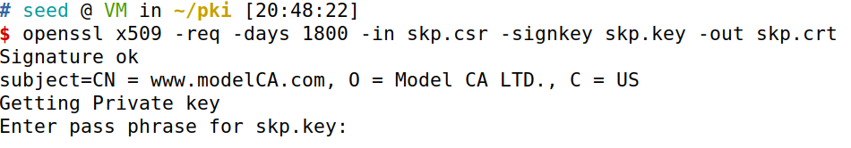

#### 更改配置

##### hosts

```
sudo vim /etc/hosts
```

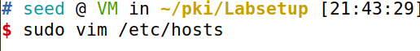

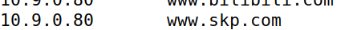

##### key crt

复制skp的 key crt 到镜像处的certs文件夹下

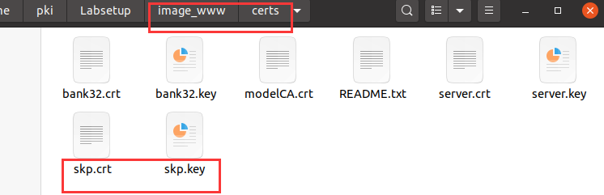

##### dockerfile

既然要更新文件了，那同样也要修改Docker配置，增加一条复制上述两文件的语句

```dockerfile
COPY ./certs/skp.crt ./certs/skp.key  /certs/
```

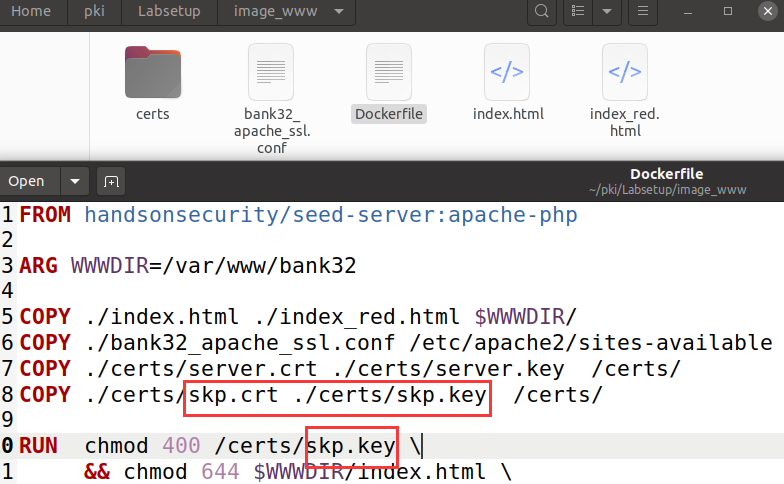

##### apache-conf

在apache配置文件中添加内容

```xml
<VirtualHost *:443> 
    DocumentRoot /var/www/bank32
    ServerName www.skp.com

    DirectoryIndex index.html
    SSLEngine On 
    SSLCertificateFile /certs/skp.crt
    SSLCertificateKeyFile /certs/skp.key
</VirtualHost>
```

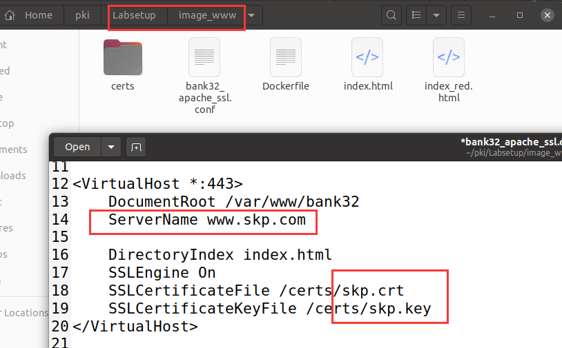

### 重启服务

```
docker ps

docker exec -it 73 /bin/bash

a2enmod ssl
a2ensite bank32_apache_ssl
service apache2 start
```


```
<VirtualHost *:443> 
    DocumentRoot /var/www/bank32
    ServerName www.skprimin2022.com
    ServerAlias www.skprimin2022A.com
    ServerAlias www.skprimin2022B.com
    DirectoryIndex index.html
    SSLEngine On 
    SSLCertificateFile /certs/server.crt
    SSLCertificateKeyFile /certs/server.key
</VirtualHost>
```

