# RSA Public-Key Encryption and Signature Lab

## 概述

RSA（RIVEST-Shamir-Adleman）是第一个公钥密码系统之一，广泛用于安全通信。 RSA算法将生成两个大的随机素数，然后使用它们生成公钥和私钥对，该对可用于进行加密，解密，数字签名生成和数字签名验证。 RSA算法建立在数字理论上，并且可以通过库的支持很容易地实现。
该实验的学习目标是为学生获得RSA算法的实践经验。我们应该学习了RSA算法的理论部分，因此他们可以闻名地知道如何生成公钥/私钥以及如何执行加密/解密和签名生成/验证。该实验室通过要求他们通过RSA算法的实际数字的每个重要步骤增强了学生对RSA的理解，因此他们可以应用从类中学到的理论。基本上，学生将使用C程序语言实现RSA算法。实验室涵盖以下与安全相关主题：

- 公钥加密
- RSA算法和键生成
- 大数字计算
- 使用RSA加密和解密
- 电子签名
- X.509认证

读数和视频。 公钥加密的详细覆盖范围可以在以下内容中找到：

- 种子书，计算机和互联网安全的第23章：Wenliang du的动手方法，第2版。 查看https://www.handsonsecurity.net的详细信息。

**实验室环境**：  此实验室已在我们预构建的 Ubuntu 16.04 VM 上进行了测试，该 VM 可以从 SEED 网站下载。 本练习需要 openssllibrary，该库已安装在 Ubuntu16.04 VM 上。如果选择使用其他 VM，则可以运行以下命令来安装 openssl，众所周知，seed12.04是安装不了任何东西的，我们可以随机选虚拟机

```bash
$  sudo  apt-get update
$  sudo  apt-get  install  libssl-dev
```

## 背景

RSA算法涉及大量计算。这些计算无法使用程序中的简单算术运算符直接控制，因为这些操作员只能在原始数据类型上运行，例如32位整数和64位长整数类型。 RSA算法涉及的数字通常大于512位。例如，到多个两个32位整数A和B，我们只需要在我们的程序中使用* b。但是，如果他们是大数字，我们就不能再这样做了;相反，我们需要使用算法（即，函数）来计算其产品。
有几个库可以在任意大小的整数上执行算术运算。在此实验室中，我们将使用OpenSSL提供的大数字库。要使用此库，我们将将每个大数字作为Bignum类型，然后使用库提供的API用于各种操作，例如添加，乘法，指数，模块化操作等。

公钥加密技术：

- 是当今安全通信的基础
- 允许通信双方获取共享密钥
- 公钥(用于加密)和私钥(用于解密)
- 私钥(用于数字签名)和公钥(用于验证签名)

### RSA

- 需要生成：模数n，公钥指数e，私钥指数d
- 方法

    - 选择p,q(大型随机质数)
    - N = pq(应该很大)
    - 选择e, 1 < e < φ(n) e相对于φ(n)是质数
    - 求$d, ed \mod φ(n) = 1$
- 结果

    - (e,n)为公钥
    - d 为私钥
- 加密
    将明文视为数字，假设M < n
    $C = M^e \mod n$
- 解密
    $M = C^d \mod n$

证明
$$

M^{ed} &=& M^{k\phi(n)+1} \mod n\\
&=& M^{k\phi(n)}*M \mod n\\
&=& (M^{\phi(n)}\mod n)^k\times M \mod n \text{(分配规则)}\\
&=&1^k \times M \mod n \text{(欧拉定理)}\\
&=&M
$$


### 2.1 BIGNUM api

所有大量的api都可以从https://linux.die.net/man/3/bn找到。在下文中，我们将描述这个实验室需要的一些api。

- 一些库函数需要临时变量。由于动态内存分配来创建BIGNUMs非常昂贵，当与重复子例程调用一起使用时，创建一个BN CTX结构来保存库函数使用的BIGNUM临时变量。我们需要创建这样一个结构，并将其传递给需要它的函数。

    ```c
    BN_CTX  *ctx  =  BN_CTX_new()
    ```

- 初始化BIGNUM变量

    ```c
    BIGNUM  *a  =  BN_new()
    ```

- 有很多方法可以给BIGNUM变量赋值。

    ```c
    //  从十进制数字字符串中指定一个值
    BN_dec2bn(&a,  "12345678901112231223");
    //  从十六进制数字字符串赋值
    BN_hex2bn(&a,  "2A3B4C55FF77889AED3F");
    //  生成128位的随机数
    BN_rand(a,  128,  0,  0);
    //  生成一个128位的随机素数
    BN_generate_prime_ex(a,  128,  1,  NULL,  NULL,  NULL);
    ```

- 打印一个大数

    ```c
    void  printBN(char  *msg,  BIGNUM  *  a)
    {
    //  Convert  the  BIGNUM  to  number  string
    char  *  number_str  =  BN_bn2dec(a);
    //  Print  out  the  number  string
    printf("%s  %s\n",  msg,  number_str);
    //  Free  the  dynamically  allocated  memory
    OPENSSL_free(number_str);
    }
    ```

-  计算 $res = a - b$ 和 $res = a + b$：

    ```c
    BN_sub(res,  a,  b);
    BN_add(res,  a,  b);
    ```

- 计算$res = a \times b$。应该注意的是，此 API 中需要 BN CTX 结构。

```c
BN_mul(res,  a,  b,  ctx)
```

- 计算$res = a \times b \mod n$：

```c
BN_mod_mul(res,  a,  b,  n,  ctx)
```

- 计算$res = a^c  \mod n$

```c
BN_mod_exp(res,  a,  c,  n,  ctx)
```

- 计算模逆，即给定 a，找到 b，使得 $a \times b \mod n = 1$。值 b 相对于模 n 称为 a 的逆。

```c
BN_mod_inverse(b,  a,  n,  ctx);
```

### 2.2 完整示例

我们在下面展示了一个完整的示例。在这个例子中，我们初始化了三个BIGNUM变量，a，b和n;然后我们计算a * b和（$a^b  \mod  n$）。

```c
/ *bn_sample.c * /
#include <stdio.h>
#include <openssl/bn.h>
#define NBITS 256
    void printBN(char *msg, BIGNUM *a)
{
    /*  Use  BN_bn2hex(a)  for  hex  string
*  Use  BN_bn2dec(a)  for  decimal  string  */
    char *number_str = BN_bn2hex(a);
    printf("%s  %s\n", msg, number_str);
    OPENSSL_free(number_str);
}
int main()
{
    BN_CTX *ctx = BN_CTX_new();
    BIGNUM *a = BN_new();
    BIGNUM *b = BN_new();
    BIGNUM *n = BN_new();
    BIGNUM *res = BN_new();

    //  Initialize  a,  b,  n
    BN_generate_prime_ex(a, NBITS, 1, NULL, NULL, NULL);
    BN_dec2bn(&b, "273489463796838501848592769467194369268");
    BN_rand(n, NBITS, 0, 0);
    //  res  =  a *b
    BN_mul(res, a, b, ctx);
    printBN("a  *  b  =  ", res);
    //  res  =  aˆb  mod  n
    BN_mod_exp(res, a, b, n, ctx);
    printBN("aˆc  mod  n  =  ", res);
    return 0;
}
```

**编译**我们可以使用以下命令编译 bn sample.c（- 后面的字符是字母 l，而不是数字 1;它告诉编译器使用加密库）。

```bash
gcc bn_sample.c -lcrypto
```

## 3任务

为避免错误，请避免手动键入用于实验室任务的数字。复制并粘贴其中的数字。


### 3.1 任务1：派生私钥

> 设 p、q 和 e 为三个素数。设 $n = p \times q$。我们将使用（e，n）作为公钥。请计算私钥d。下面列出了 p、q 和 e 的十六进制值。应该注意的是，尽管此任务中使用的p和q是相当大的数字，但它们不够大而不安全。为了简单起见，我们故意使它们变小。在实践中，这些数字的长度应至少为 512 位（此处使用的数字仅为 128 位）。
>
> ```bash
> p  =  F7E75FDC469067FFDC4E847C51F452DF
> q  =  E85CED54AF57E53E092113E62F436F4F
> e  =  0D88C3
> ```
>

#### 编写程序C

```c
#include <stdio.h>
#include <openssl/bn.h>
#define NBITS 128
void printBN(char *msg, BIGNUM *a)
{ /* Use BN_bn2hex(a) for hex string
	* Use BN_bn2dec(a) for decimal string */
    char *number_str = BN_bn2hex(a);
    printf("%s %s\n", msg, number_str);
    OPENSSL_free(number_str);
}
int main()
{
    BN_CTX *ctx = BN_CTX_new();
    BIGNUM *p = BN_new();
    BIGNUM *q = BN_new();
    BIGNUM *fai_n = BN_new();
    BIGNUM *n = BN_new();
    BIGNUM *e = BN_new();
    BIGNUM *d = BN_new();
    BIGNUM *p_1 = BN_new();
    BIGNUM *q_1 = BN_new();

    BN_hex2bn(&p, "F7E75FDC469067FFDC4E847C51F452DF");
    BN_hex2bn(&q, "E85CED54AF57E53E092113E62F436F4F");
    BN_hex2bn(&e, "0D88C3");

    BN_sub(p_1, p, BN_value_one());
    BN_sub(q_1, q, BN_value_one());
    BN_mul(n, p, q, ctx);
    BN_mul(fai_n, p_1, q_1, ctx);

    //printBN("fai_n=", fai_n);
    BN_mod_inverse(d, e, fai_n, ctx);

    printBN("public key e=\t", e);
    printBN("public key n=\t", n);
    printBN("private key d=\t", d);
    return 0;
}
```

```bash
gcc t1.c -lcrypto -o t1
t1
```

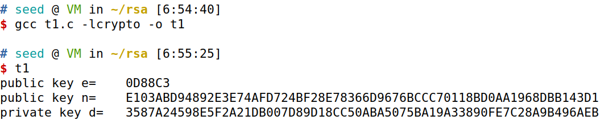

求得：

```bash
public key e=	 0D88C3
public key n=	 E103ABD94892E3E74AFD724BF28E78366D9676BCCC70118BD0AA1968DBB143D1
private key d=	 3587A24598E5F2A21DB007D89D18CC50ABA5075BA19A33890FE7C28A9B496AEB
```

#### python版本

```python
import gmpy2

p = 0xF7E75FDC469067FFDC4E847C51F452DF
q = 0xE85CED54AF57E53E092113E62F436F4F
e = 0x0D88C3

n = q * p
phi = (p - 1) * (q - 1)
d = gmpy2.invert(e, phi)

print("public key:(" + hex(e) + ',' + hex(n) + ")")
print("private key:" + hex(d))
```

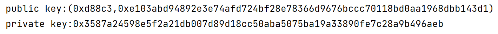

### 3.2 任务 2：加密消息

> 设 （e， n） 为公钥。请加密消息“A top secret!”引文不包括在内）。我们需要将此 ASCII 字符串转换为十六进制字符串，然后使用 hex-to-bn  API BN hex2bn() 将十六进制字符串转换为 BIGNUM。以下 python 命令可用于将普通 ASCII 字符串转换为十六进制字符串。
>
> ```bash
> $ python -c ' print("A top secret!".encode("hex")) ') '
> 4120746f702073656372657421
> ```
>
> 公钥如下所示(十六进制)。我们还提供私钥d，以帮助您验证您的加密结果。
>
> ```bash
> n  =  DCBFFE3E51F62E09CE7032E2677A78946A849DC4CDDE3A4D0CB81629242FB1A5 
> e  =  010001   (this hex  value  equals  to  decimal  65537)
> M  =  A  top  secret!
> d  =  74D806F9F3A62BAE331FFE3F0A68AFE35B3D2E4794148AACBC26AA381CD7D30D
> ```
>

#### 编写程序

```c
#include <stdio.h>
#include <openssl/bn.h>
#define NBITS 128
void printBN(char *msg, BIGNUM *a)
{ /* Use BN_bn2hex(a) for hex string
	* Use BN_bn2dec(a) for decimal string */
    char *number_str = BN_bn2hex(a);
    printf("%s %s\n", msg, number_str);
    OPENSSL_free(number_str);
}
int main()
{
    BN_CTX *ctx = BN_CTX_new();

    BIGNUM *n = BN_new();
    BIGNUM *e = BN_new();
    BIGNUM *d = BN_new();
    BIGNUM *m = BN_new(); //massage
    //BIGNUM* p = BN_new(); //plaintxt
    BIGNUM *c = BN_new(); //cyphertxt

    BN_hex2bn(&n, "DCBFFE3E51F62E09CE7032E2677A78946A849DC4CDDE3A4D0CB81629242FB1A5");
    BN_hex2bn(&e, "010001");
    BN_hex2bn(&d, "74D806F9F3A62BAE331FFE3F0A68AFE35B3D2E4794148AACBC26AA381CD7D30D");
    BN_hex2bn(&m, "4120746f702073656372657421");

    BN_mod_exp(c, m, e, n, ctx);
    //BN_mod_exp(p, c, d, n, ctx);
    printBN("cyphertxt:", c);
    //printBN("plaintxt:", p);
    return 0;
}

```

```bash
$ gcc t2.c -lcrypto -o t2
t2
```

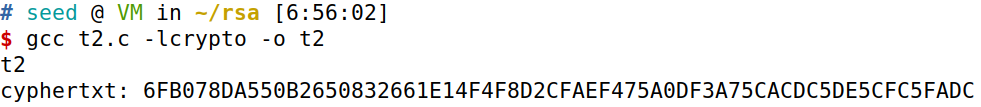

加密结果为：6FB078DA550B2650832661E14F4F8D2CFAEF475A0DF3A75CACDC5DE5CFC5FADC

#### python程序

```python
import gmpy2

n = 0xDCBFFE3E51F62E09CE7032E2677A78946A849DC4CDDE3A4D0CB81629242FB1A5
e = 0x010001

m = "A top secret!".encode("utf-8").hex()
m = int(m, 16)
c = gmpy2.powmod(m, e, n)
print(hex(c))
```

### 3.3任务3:解密消息

> 此任务中使用的公钥/私钥与task 2中使用的公钥/私钥相同。请解密以下密文C，并将其转换为纯ASCII字符串。
>
> ```bash
> C  =  8C0F971DF2F3672B28811407E2DABBE1DA0FEBBBDFC7DCB67396567EA1E2493F
> ```
>
> 您可以使用以下python命令将十六进制字符串转换为普通ASCII字符串。
>
> ```bash
> $ python -c 'print("4120746f702073656372657421".decode("hex"))'
> A  top  secret!
> ```
>

#### 编写程序C

```c
#include <stdio.h>
#include <openssl/bn.h>
#define NBITS 128
void printBN(char *msg, BIGNUM *a)
{ /* Use BN_bn2hex(a) for hex string
	* Use BN_bn2dec(a) for decimal string */
    char *number_str = BN_bn2hex(a);
    printf("%s %s\n", msg, number_str);
    OPENSSL_free(number_str);
}
int main()
{
    BN_CTX *ctx = BN_CTX_new();

    BIGNUM *n = BN_new();
    BIGNUM *e = BN_new();
    BIGNUM *d = BN_new();
    BIGNUM *p = BN_new(); //plaintxt
    BIGNUM *c = BN_new(); //cyphertxt

    BN_hex2bn(&n, "DCBFFE3E51F62E09CE7032E2677A78946A849DC4CDDE3A4D0CB81629242FB1A5");
    BN_hex2bn(&e, "010001");
    BN_hex2bn(&d, "74D806F9F3A62BAE331FFE3F0A68AFE35B3D2E4794148AACBC26AA381CD7D30D");
    BN_hex2bn(&c, "8C0F971DF2F3672B28811407E2DABBE1DA0FEBBBDFC7DCB67396567EA1E2493F");

    BN_mod_exp(p, c, d, n, ctx);
    printBN("plaintxt:", p);
    return 0;
}
```

```
$ gcc t3.c -lcrypto -o t3
t3
```


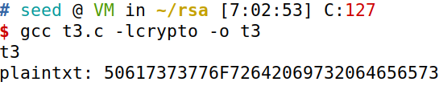

解密结果为：50617373776F72642069732064656573

使用python将其转换成ASCII字符串：

```python
# python2 seed12 seed16
python2 -c 'print("50617373776F72642069732064656573".decode("hex"))'
# python3 seed20
python3 -c 'print(bytes.fromhex("50617373776F72642069732064656573").decode("utf-8"))'
```

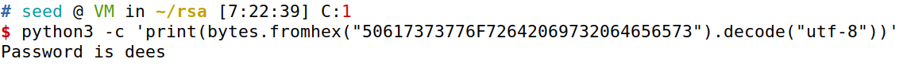

#### python程序

```python
import gmpy2

n = 0xDCBFFE3E51F62E09CE7032E2677A78946A849DC4CDDE3A4D0CB81629242FB1A5
d = 0x74D806F9F3A62BAE331FFE3F0A68AFE35B3D2E4794148AACBC26AA381CD7D30D
C = 0x8C0F971DF2F3672B28811407E2DABBE1DA0FEBBBDFC7DCB67396567EA1E2493F

M = gmpy2.powmod(C, d, n)
m = str(hex(M))[2:]
print("M:" + bytes.fromhex(m).decode("utf-8"))
```

### 3.4任务4:签名

> 通过签署数字文件提供真实性证明
> 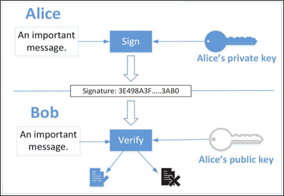
>
> 在M使用私钥对M应用私钥操作，并获得一个数字，每个人都可以使用我们的公钥来从s回来对于需要签名的消息：
> $数字签名= m^d \mod n$
> 在实践中，消息可能很长，从而产生长签名和更多的计算时间，因此，我们从原始信息中生成加密哈希值，并且只签署哈希值
>
> 此任务中使用的公钥/私钥与task 2中使用的公钥/私钥相同。请为以下消息生成签名(请直接签名此消息，而不是签名其哈希值):
>
> ```
> M  =  I  owe  you  $2000.
> ```
>
> 请对M消息做一点小小的修改，比如把\$2000改成\$3000，并在修改后的消息上签名。比较两个签名并描述你所观察到的。
>
> ```
> M  =  I  owe  you  $3000.
> ```

将两个签名转换

```bash
# python3 seed12 seed16
python -c 'print("I owe you $2000".encode("hex"))'
python -c 'print("I owe you $3000".encode("hex"))'

# python3 seed20
"I owe you $2000".encode("utf-8").hex()
"I owe you $3000".encode("utf-8").hex()
或
import binascii
binascii.hexlify(b"I owe you $2000")
binascii.hexlify(b"I owe you $3000")
```

得到：

```
49206f776520796f75202432303030

49206f776520796f75202433303030
```

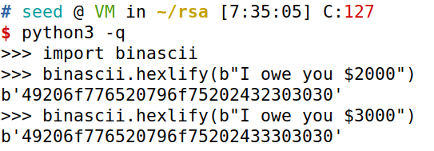

#### 编写程序C

```c
#include <stdio.h>
#include <openssl/bn.h>
#define NBITS 128
void printBN(char *msg, BIGNUM *a)
{ /* Use BN_bn2hex(a) for hex string
	* Use BN_bn2dec(a) for decimal string */
    char *number_str = BN_bn2hex(a);
    printf("%s %s\n", msg, number_str);
    OPENSSL_free(number_str);
}
int main()
{
    BN_CTX *ctx = BN_CTX_new();

    BIGNUM *n = BN_new();
    BIGNUM *e = BN_new();
    BIGNUM *d = BN_new();
    BIGNUM *m1 = BN_new();
    BIGNUM *m2 = BN_new();
    BIGNUM *sig1 = BN_new();
    BIGNUM *sig2 = BN_new();

    BN_hex2bn(&n, "DCBFFE3E51F62E09CE7032E2677A78946A849DC4CDDE3A4D0CB81629242FB1A5");
    BN_hex2bn(&e, "010001");
    BN_hex2bn(&d, "74D806F9F3A62BAE331FFE3F0A68AFE35B3D2E4794148AACBC26AA381CD7D30D");
    BN_hex2bn(&m1, "49206f776520796f75202432303030");
    BN_hex2bn(&m2, "49206f776520796f75202433303030");

    BN_mod_exp(sig1, m1, d, n, ctx);
    BN_mod_exp(sig2, m2, d, n, ctx);
    printBN("signature of m1:", sig1);
    printBN("signature of m2:", sig2);
    return 0;
}
```

```bash
gcc t4.c -lcrypto -o t4
t4
```

```
signature of m1: 80A55421D72345AC199836F60D51DC9594E2BDB4AE20C804823FB71660DE7B82
signature of m2: 04FC9C53ED7BBE4ED4BE2C24B0BDF7184B96290B4ED4E3959F58E94B1ECEA2EB
```

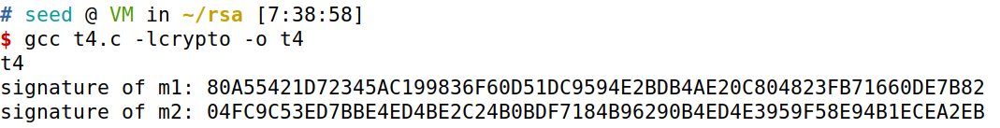

可见，虽然信息只做了稍微的改动，签名结果也会发生很大的变化。

#### python程序

```python
import gmpy2

n = 0xDCBFFE3E51F62E09CE7032E2677A78946A849DC4CDDE3A4D0CB81629242FB1A5
e = 0x010001
d = 0x74D806F9F3A62BAE331FFE3F0A68AFE35B3D2E4794148AACBC26AA381CD7D30D

msg = ["I owe you $2000", "I owe you $3000"]
for m in msg:
    print(m)
    m = int(m.encode("utf-8").hex(), 16)
    c = gmpy2.powmod(m, d, n)
    print(hex(c))
```

### 3.5任务5:验证签名

> Bob收到来自Alice的消息M = "Launch a missile."，其签名为s。我们知道Alice的公钥是(e, n)，请验证该签名是否确实是Alice的。公钥和签名(十六进制)如下所示：
>
> ```bash
> M  =  Launch  a  missile.
> S  =  643D6F34902D9C7EC90CB0B2BCA36C47FA37165C0005CAB026C0542CBDB6802F 
> e  =  010001   (this  hex  value  equals  to  decimal  65537)
> n  =  AE1CD4DC432798D933779FBD46C6E1247F0CF1233595113AA51B450F18116115
> ```
>
> 假设in的签名已损坏，签名的最后一个字节从2F更改为3F，即只有一个比特的更改。请重复这个任务，并描述验证过程会发生什么。

#### 编写程序C

```c
#include <stdio.h>
#include <openssl/bn.h>
#define NBITS 128
void printBN(char *msg, BIGNUM *a)
{ /* Use BN_bn2hex(a) for hex string
	* Use BN_bn2dec(a) for decimal string */
    char *number_str = BN_bn2hex(a);
    printf("%s %s\n", msg, number_str);
    OPENSSL_free(number_str);
}
int main()
{
    BN_CTX *ctx = BN_CTX_new();

    BIGNUM *n = BN_new();
    BIGNUM *e = BN_new();
    BIGNUM *M = BN_new();
    BIGNUM *m1 = BN_new();
    BIGNUM *m2 = BN_new();
    BIGNUM *sig1 = BN_new();
    BIGNUM *sig2 = BN_new();
       %TRHrnT#ARGXB   
    BN_hex2bn(&M, "4c61756e63682061206d697373696c652e");
    BN_hex2bn(&n, "AE1CD4DC432798D933779FBD46C6E1247F0CF1233595113AA51B450F18116115");
    BN_hex2bn(&e, "010001");
    BN_hex2bn(&sig1, "643D6F34902D9C7EC90CB0B2BCA36C47FA37165C0005CAB026C0542CBDB6802F");
    BN_hex2bn(&sig2, "643D6F34902D9C7EC90CB0B2BCA36C47FA37165C0005CAB026C0542CBDB6803F");

    BN_mod_exp(m1, sig1, e, n, ctx);
    BN_mod_exp(m2, sig2, e, n, ctx);

    printf("verifying of signature1:");
    if (BN_cmp(m1, M) == 0)
    {
        printf("valid!\n");
    }
    else
    {
        printf("invalid!\n");
    }
    printf("verifying of signature2:");
    if (BN_cmp(m2, M) == 0)
    {
        printf("valid!\n");
    }
    else
    {
        printf("invalid!\n");
    }

    return 0;
}
```

```bash
gcc t5.c -lcrypto -o t5
t5
```

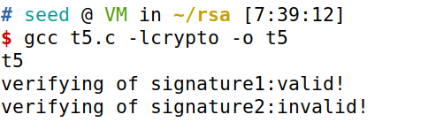

当签名没有损坏时，可以验证成功。即使签名只变动了一位，也会使得验证失败。

#### python程序

```python
import gmpy2

M = "Launch a missile."
Sorg = 0x643D6F34902D9C7EC90CB0B2BCA36C47FA37165C0005CAB026C0542CBDB6802F
Serr = 0x643D6F34902D9C7EC90CB0B2BCA36C47FA37165C0005CAB026C0542CBDB6802A
n = 0xAE1CD4DC432798D933779FBD46C6E1247F0CF1233595113AA51B450F18116115
e = 0x010001

sig = [Sorg, Serr]
for S in sig:
    m = gmpy2.powmod(S, e, n)
    m = str(hex(m))[2:]
    try:
        msg = bytes.fromhex(m).decode('utf-8')
        print(msg)
        if m == M:
            print("signature valid!")
        else:
            print("signature invalid!")
    except:
        print(bytes.fromhex(m))
        print("signature invalid!")
```

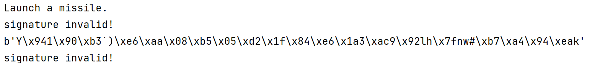

### 3.6任务6:手动验证X.509证书

在这个任务中，我们将使用我们的程序手动验证X.509证书。509包含关于公钥的数据和数据上的发布者签名。我们将从web服务器下载一个真实的X.509证书，获取其颁发者的公钥，然后使用这个公钥来验证证书上的签名。

##### 步骤1:从真实的web服务器下载证书。

> 我们使用www.example.org服务器这个文档。学生应该选择拥有不同证书的不同的网络服务器
> 本文档中使用的证书(需要注意的是www.example.com与www.example.org共享相同的证书)。我们可以使用浏览器下载证书，也可以使用以下命令下载证书：
>
> ```bash
> $  openssl  s_client  -connect  www.example.org:443  -showcerts
> Certificate  chain
> 0  s:/C=US/ST=California/L=Los  Angeles/O=Internet  Corporation  for  Assigned Names  and  Numbers/OU=Technology/CN=www.example.org
> i:/C=US/O=DigiCert  Inc/OU=www.digicert.com/CN=DigiCert  SHA2  High  Assurance
> Server  CA
> -----BEGIN  CERTIFICATE-----
> MIIF8jCCBNqgAwIBAgIQDmTF+8I2reFLFyrrQceMsDANBgkqhkiG9w0BAQsFADBw
> MQswCQYDVQQGEwJVUzEVMBMGA1UEChMMRGlnaUNlcnQgSW5jMRkwFwYDVQQLExB3
> ......
> wDSiIIWIWJiJGbEeIO0TIFwEVWTOnbNl/faPXpk5IRXicapqiII=
> -----END  CERTIFICATE-----
> 1  s:/C=US/O=DigiCert  Inc/OU=www.digicert.com/CN=DigiCert  SHA2  High Assurance  Server  CA
> i:/C=US/O=DigiCert  Inc/OU=www.digicert.com/CN=DigiCert  High  Assurance
> EV  Root  CA
> -----BEGIN  CERTIFICATE-----
> MIIEsTCCA5mgAwIBAgIQBOHnpNxc8vNtwCtCuF0VnzANBgkqhkiG9w0BAQsFADBs
> MQswCQYDVQQGEwJVUzEVMBMGA1UEChMMRGlnaUNlcnQgSW5jMRkwFwYDVQQLExB3
> ......
> cPUeybQ=
> -----END  CERTIFICATE-----
> ```
>
> 命令执行结果中包含两个证书。证书的主题字段(以s:开头的条目)是www.example.org，也就是说，这是www.example.org的证书。issuer字段(以i:开头的条目)提供了发行者的信息。第二个证书的主题字段与第一个证书的颁发者字段相同。基本上，第二个证书属于中间CA。在本任务中，我们将使用CA的证书来验证服务器证书。
> 如果您使用上面的命令只能获得一个证书，这意味着您获得的证书是由根CA签名的。根CA的证书可以从安装在我们预构建的虚拟机中的Firefox浏览器中获得。点击编辑→首选项→隐私，然后点击安全→查看证书。请搜索颁发者名称并下载其证书。
> 将每个证书(包含“Begin certificate”行和包含“END certificate”行之间的文本，包括这两行)复制并粘贴到一个文件中。我们称第一个为c0.pem和第二个c1.pem。

```bash
openssl s_client -connect www.example.org:443 -showcerts
```

得到如下结果：


将第一个证书复制到文件：c0.pem，无需调整换行，带上`-----BEGIN CERTIFICATE-----...-----END CERTIFICATE-----`

将第二个证书复制到文件：c1.pem

为了避免格式问题，尽量在seed中编辑文件

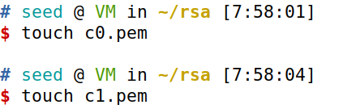


##### 步骤2:从颁发者的证书中提取公钥(e , n)。

> Openssl提供了从x509证书中提取某些属性的命令。我们可以用-模求出n的值。没有特定的命令来提取e，但是我们可以打印出所有的字段，并且可以很容易地找到e的值。
>
> ```bash
> For  modulus   (n):
> $  openssl  x509  -in  c1.pem  -noout  -modulus
> Print  out  all  the  fields,  find  the  exponent   (e):
> $  openssl  x509  -in  c1.pem  -text  -noout
> ```
>

使用命令得到公钥的模数n：

```bash
openssl  x509  -in  c1.pem  -noout  -modulus
```

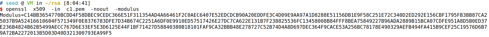

得到n=C14BB3654770BCDD4F58DBEC9CEDC366E51F311354AD4A66461F2C0AEC6407E52EDCDCB90A20EDDFE3C4D09E9AA97A1D8288E51156DB1E9F58C251E72C340D2ED292E156CBF1795FB3BB87CA25037B9A52416610604F571349F0E8376783DFE7D34B674C2251A6DF0E9910ED57517426E27DC7CA622E131B7F238825536FC13458008B84FFF8BEA75849227B96ADA2889B15BCA07CDFE951A8D5B0ED37E236B4824B62B5499AECC767D6E33EF5E3D6125E44F1BF71427D58840380B18101FAF9CA32BBB48E278727C52B74D4A8D697DEC364F9CACE53A256BC78178E490329AEFB494FA415B9CEF25C19576D6B79A72BA2272013B5D03D40D321300793EA99F5

```bash
openssl x509 -in c1.pem -text -noout
```

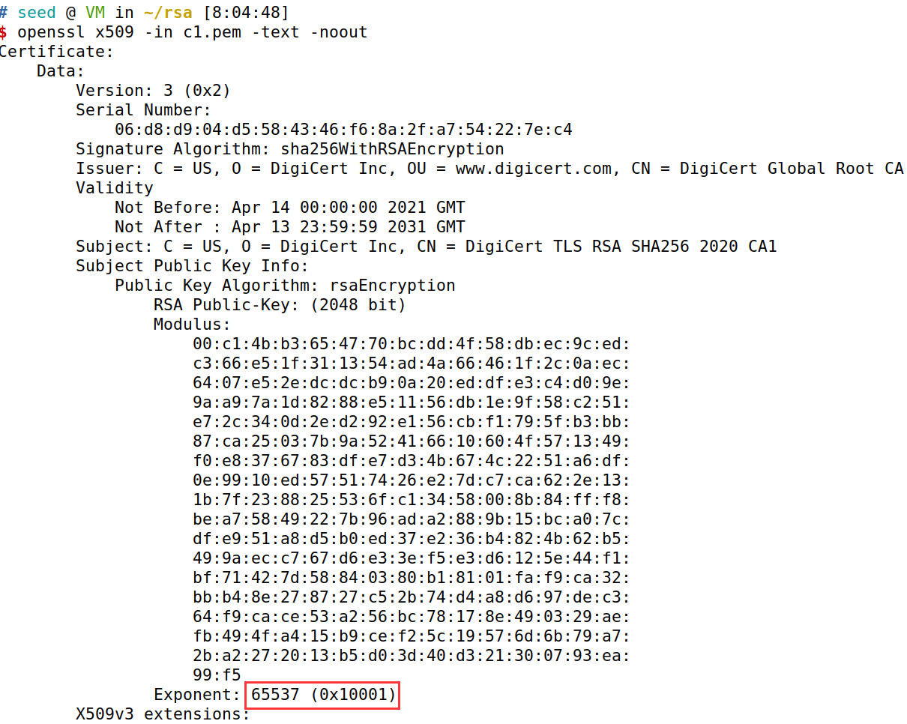

得到，e=0x10001

##### 步骤3:从服务器的证书中提取签名。

> 没有特定的openssl命令来提取签名字段。但是，我们可以打印出所有的字段，然后复制并粘贴签名
> (注意:如果证书中使用的签名算法不是基于RSA的，您可以找到另一个证书)。
>
> ```bash
> $  openssl  x509  -in  c0.pem  -text  -noout
> ...
> Signature  Algorithm:  sha256WithRSAEncryption
> 84:a8:9a:11:a7:d8:bd:0b:26:7e:52:24:7b:b2:55:9d:ea:30:
> 89:51:08:87:6f:a9:ed:10:ea:5b:3e:0b:c7:2d:47:04:4e:dd:
> ......
> 5c:04:55:64:ce:9d:b3:65:fd:f6:8f:5e:99:39:21:15:e2:71:
> aa:6a:88:82
> ```
>
> 我们需要从数据中删除空格和冒号，这样就可以得到一个十六进制字符串，并将其输入到程序中。下面的命令可以实现这个目标。tr命令是一个用于字符串操作的Linux实用工具。在本例中，-d选项用于删除数据的":"和"space"。
>
> ```bash
> $  cat signature | tr -d `[:space:]:`
> 84a89a11a7d8bd0b267e52247bb2559dea30895108876fa9ed10ea5b3e0bc7
> ......
> 5c045564ce9db365fdf68f5e99392115e271aa6a8882
> ```
>

使用命令找到签名signature：

```bash
openssl x509 -in c0.pem -text -noout 
```

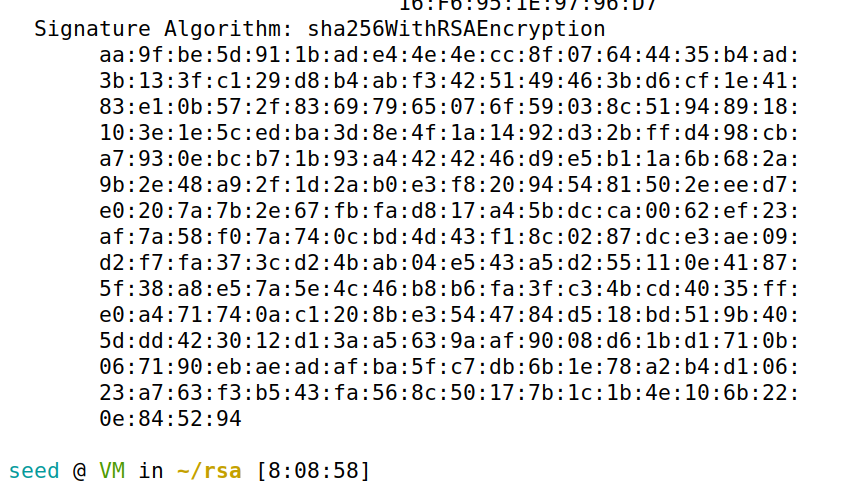

将签名复制到文件signature，删除空格和冒号

```bash
cat signature | tr -d '[:space:]:'
```

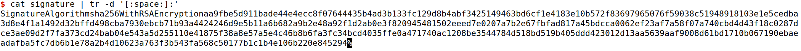

得到signature：

aa9fbe5d911bade44e4ecc8f07644435b4ad3b133fc129d8b4abf3425149463bd6cf1e4183e10b572f83697965076f59038c51948918103e1e5cedba3d8e4f1a1492d32bffd498cba7930ebcb71b93a4424246d9e5b11a6b682a9b2e48a92f1d2ab0e3f820945481502eeed7e0207a7b2e67fbfad817a45bdcca0062ef23af7a58f07a740cbd4d43f18c0287dce3ae09d2f7fa373cd24bab04e543a5d255110e41875f38a8e57a5e4c46b8b6fa3fc34bcd4035ffe0a471740ac1208be3544784d518bd519b405ddd423012d13aa5639aaf9008d61bd1710b067190ebaeadafba5fc7db6b1e78a2b4d10623a763f3b543fa568c50177b1c1b4e106b220e845294

##### 步骤4:提取服务器证书的主体

> 证书颁发机构(CA)首先计算证书的哈希值，然后对哈希值进行签名，从而为服务器证书生成签名。为了验证签名，我们还需要从证书生成散列。由于哈希是在计算签名之前生成的，所以在计算哈希时需要排除证书的签名块。如果不能很好地理解证书的格式，那么要找出证书的哪一部分用于生成散列是非常困难的。
> 509证书是使用ASN.1(抽象语法符号1)标准编码的，所以如果我们能解析ASN.1结构，我们就能很容易地从证书中提取任何字段。Openssl有一个名为asn1parse的命令，可以用来解析X.509证书。
>
> ```bash
> $ openssl asn1parse -i -in c0.pem
> 0:d=0 hl=4 l=1522 cons: SEQUENCE
> 4:d=1 hl=4 l=1242 cons: SEQUENCE ➊
> 8:d=2 hl=2 l= 3 cons: cont [ 0 ]
> 10:d=3 hl=2 l= 1 prim: INTEGER :02
> 13:d=2 hl=2 l= 16 prim: INTEGER
> :0E64C5FBC236ADE14B172AEB41C78CB0
> ... ...
> 1236:d=4 hl=2 l= 12 cons: SEQUENCE
> 1238:d=5 hl=2 l= 3 prim: OBJECT :X509v3 Basic Constraints
> 1243:d=5 hl=2 l= 1 prim: BOOLEAN :255
> 1246:d=5 hl=2 l= 2 prim: OCTET STRING [HEX DUMP]:3000
> 1250:d=1 hl=2 l= 13 cons: SEQUENCE ➋
> 1252:d=2 hl=2 l= 9 prim: OBJECT :sha256WithRSAEncryption
> 1263:d=2 hl=2 l= 0 prim: NULL
> 1265:d=1 hl=4 l= 257 prim: BIT STRING
> ```
>
> 从➊开始的字段是用来生成哈希的证书的主体;从➋开始的字段为签名块。它们的偏移量是每行开头的数字。在我们的例子中，证书主体是从偏移量4到1249，而签名块是从文件末尾的1250。对于X.509证书，起始偏移量总是相同的(即4)，但结束偏移量取决于证书的内容长度。我们可以使用-strparse选项从偏移量4获取字段，这将为我们提供证书的主体，不包括签名块。
>
> ```bash
> $  openssl  asn1parse  -i  -in  c0.pem  -strparse  4  -out  c0_body.bin  -noout
> ```
>
> 一旦我们获得证书的主体，我们可以使用以下命令计算它的哈希值：
>
> ```bash
> $  sha256sum  c0_body.bin
> ```
>

使用命令解析服务器的证书：

```bash
openssl asn1parse -i -in c0.pem
```

用来生成哈希的证书的主体：

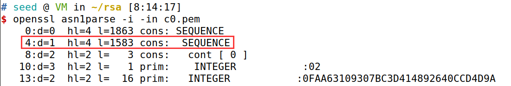

签名块：

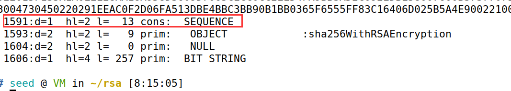

得到证书的主体，并计算它的哈希值

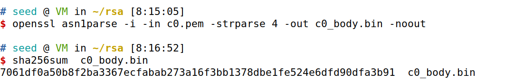

哈希值为：

7061df0a50b8f2ba3367ecfabab273a16f3bb1378dbe1fe524e6dfd90dfa3b91

##### 步骤5:验证签名。

> 现在我们拥有了所有信息，包括CA的公钥、CA的签名和服务器证书的主体。我们可以运行自己的程序来验证签名是否有效。Openssl确实为我们提供了一个验证证书的命令，但要求学生使用自己的程序来验证证书，否则，他们在这项任务中得到的分数为零。

```c
#include <stdio.h>
#include <openssl/bn.h>
#define NBITS 128
void printBN(char *msg, BIGNUM *a)
{ /* Use BN_bn2hex(a) for hex string
	* Use BN_bn2dec(a) for decimal string */
    char *number_str = BN_bn2hex(a);
    printf("%s %s\n", msg, number_str);
    OPENSSL_free(number_str);
}
int main()
{
    BN_CTX *ctx = BN_CTX_new();

    BIGNUM *n = BN_new();
    BIGNUM *e = BN_new();
    BIGNUM *sig = BN_new();
    BIGNUM *m = BN_new();

    BN_hex2bn(&n, "C14BB3654770BCDD4F58DBEC9CEDC366E51F311354AD4A66461F2C0AEC6407E52EDCDCB90A20EDDFE3C4D09E9AA97A1D8288E51156DB1E9F58C251E72C340D2ED292E156CBF1795FB3BB87CA25037B9A52416610604F571349F0E8376783DFE7D34B674C2251A6DF0E9910ED57517426E27DC7CA622E131B7F238825536FC13458008B84FFF8BEA75849227B96ADA2889B15BCA07CDFE951A8D5B0ED37E236B4824B62B5499AECC767D6E33EF5E3D6125E44F1BF71427D58840380B18101FAF9CA32BBB48E278727C52B74D4A8D697DEC364F9CACE53A256BC78178E490329AEFB494FA415B9CEF25C19576D6B79A72BA2272013B5D03D40D321300793EA99F5");
    BN_hex2bn(&e, "010001");
    BN_hex2bn(&sig, "aa9fbe5d911bade44e4ecc8f07644435b4ad3b133fc129d8b4abf3425149463bd6cf1e4183e10b572f83697965076f59038c51948918103e1e5cedba3d8e4f1a1492d32bffd498cba7930ebcb71b93a4424246d9e5b11a6b682a9b2e48a92f1d2ab0e3f820945481502eeed7e0207a7b2e67fbfad817a45bdcca0062ef23af7a58f07a740cbd4d43f18c0287dce3ae09d2f7fa373cd24bab04e543a5d255110e41875f38a8e57a5e4c46b8b6fa3fc34bcd4035ffe0a471740ac1208be3544784d518bd519b405ddd423012d13aa5639aaf9008d61bd1710b067190ebaeadafba5fc7db6b1e78a2b4d10623a763f3b543fa568c50177b1c1b4e106b220e845294");

    BN_mod_exp(m, sig, e, n, ctx);

    printBN("message:", m);

    return 0;
}
```


```bash
gcc t6.c -lcrypto -o t6
t6
```

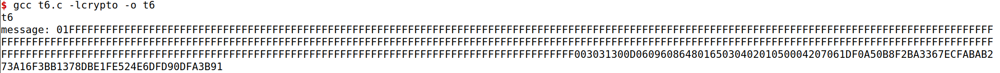

得到，验证结果为：

01FFFFFFFFFFFFFFFFFFFFFFFFFFFFFFFFFFFFFFFFFFFFFFFFFFFFFFFFFFFFFFFFFFFFFFFFFFFFFFFFFFFFFFFFFFFFFFFFFFFFFFFFFFFFFFFFFFFFFFFFFFFFFFFFFFFFFFFFFFFFFFFFFFFFFFFFFFFFFFFFFFFFFFFFFFFFFFFFFFFFFFFFFFFFFFFFFFFFFFFFFFFFFFFFFFFFFFFFFFFFFFFFFFFFFFFFFFFFFFFFFFFFFFFFFFFFFFFFFFFFFFFFFFFFFFFFFFFFFFFFFFFFFFFFFFFFFFFFFFFFFFFFFFFFFFFFFFFFFFFFFFFFFFFFFFFFFFFFFFFFFFFFFFFFFFFFFFFFFFFFFFFFFFFFFFFFFFFFFFFFFFFFFFFFFFFFFFFFFFFFFFFF003031300D0609608648016503040201050004207061DF0A50B8F2BA3367ECFABAB273A16F3BB1378DBE1FE524E6DFD90DFA3B91

根据sha256WithRSAEncryption可知，发放证书用到的hash算法是sha256，即得到的hash值共有256位，256/4=64。再根据于X.509证书签名验证的流程可知，只需要将上述结果的后64个十六进制数与step4得到的hash值做比较即可。

使用python实现：

```python
m = "01FFFFFFFFFFFFFFFFFFFFFFFFFFFFFFFFFFFFFFFFFFFFFFFFFFFFFFFFFFFFFFFFFFFFFFFFFFFFFFFFFFFFFFFFFFFFFFFFFFFFFFFFFFFFFFFFFFFFFFFFFFFFFFFFFFFFFFFFFFFFFFFFFFFFFFFFFFFFFFFFFFFFFFFFFFFFFFFFFFFFFFFFFFFFFFFFFFFFFFFFFFFFFFFFFFFFFFFFFFFFFFFFFFFFFFFFFFFFFFFFFFFFFFFFFFFFFFFFFFFFFFFFFFFFFFFFFFFFFFFFFFFFFFFFFFFFFFFFFFFFFFFFFFFFFFFFFFFFFFFFFFFFFFFFFFFFFFFFFFFFFFFFFFFFFFFFFFFFFFFFFFFFFFFFFFFFFFFFFFFFFFFFFFFFFFFFFFFFFFFFFFFF003031300D0609608648016503040201050004207061DF0A50B8F2BA3367ECFABAB273A16F3BB1378DBE1FE524E6DFD90DFA3B91"

hash = "7061df0a50b8f2ba3367ecfabab273a16f3bb1378dbe1fe524e6dfd90dfa3b91"
print(m[-64:].lower()==hash )
```

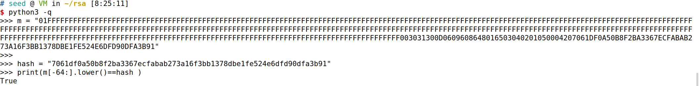

验证成功，签名有效！
