# Pseudo Random Number Generation Lab

生成随机数是安全软件中的一个相当常见的任务。 在许多情况下，用户未提供加密密钥，而是在软件内生成。 他们的随机性非常重要; 否则，攻击者可以预测加密密钥，从而击败加密的目的。 许多开发人员知道如何从他们的先前经验中生成随机数（例如，对于Monte Carlo仿真），因此它们使用类似的方法来为安全目的生成随机数。 不幸的是，一系列随机数对于蒙特卡罗模拟可能是良好的，但它们可能对加密密钥不利。 开发人员需要知道如何生成安全的随机数，或者他们会犯错误。 在一些知名的产品中，包括类似的错误，包括Netscape和Kerberos。

在这个实验室中，我们将学习为什么典型的随机数生成方法不适用于生成秘密，例如加密密钥。 他们将进一步学习标准的方法来生成适合安全目的的伪随机数。 此实验室涵盖以下主题：

- 伪随机数生成
- 随机数生成中的错误
- 生成加密密钥
- ` /dev/random` 和`/dev/urandom` 设备文件

代码仓库：https://github.com/SKPrimin/HomeWork/tree/main/SEEDLabs/Crypto_Random_Number

## 任务1：以错误的方式生成加密密钥

> 要生成良好的伪随机数，我们需要从一个随机的东西开始; 否则，结果将是非常可预测的。 以下程序使用当前时间作为伪随机数发生器的种子。

```c
#include <stdio.h>
#include <stdlib.h>
#include <time.h>
#define KEYSIZE 16
void main()
{
    int i;
    char key[KEYSIZE];
    printf("%lld\n", (long long)time(NULL));
    srand(time(NULL));
    for (i = 0; i < KEYSIZE; i++)
    {
        key[i] = rand() % 256;
        printf("%.2x", (unsigned char)key[i]);
    }
    printf("\n");
}
```

> 库函数时间（）将时间返回以来秒以来的秒数，1970-01-01 00:00:00 +0000（UTC）。 运行上面的代码，并描述您的观察。 然后，注释退出行`srand  (time(NULL)); `，再次运行程序，并描述您的观察。 在两种情况下使用观察来解释代码中SRAND（）和时间（）函数的目的。

代码如下，首先注释掉 srand (time(NULL));

```bash
gcc task1.c -o task1 
./task1
```

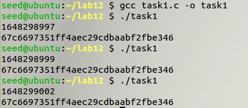

在反复运行多次之后发现，随着时间改变，注释掉 srand (time(NULL)); 

后编译运行的结果只有秒数在变，但是生成的随机数是不变的。 取消注释后：

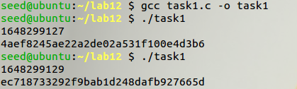

发现每次的随机数和秒数都不一样。 这是因为 srand(time（NULL）)函数用于给随机数生成函数 rand（） 设定种子；time 是 C 语言获取当前系统时间的函数，以秒作单位， 代表当前时间自 Unix 标准时间戳(1970 年 1 月 1 日 0 点 0 分 0 秒， GMT)经过了多少秒；每次运行的时间不一样，故得到的随机数也不 一样。当注释掉 srand (time(NULL))时，由于没有设定种子，就会使 用默认是随机数种子 0，因此每次运行程序，产生的随机数都是相同的。

## 任务2：猜测密钥

> 2018年4月17日，Alice Fi保存了她的纳税申报表，她在磁盘上保存了回报（PDF file）。为了保护file，她使用任务1中描述的程序生成的键加密了PDF文件。她在笔记本中写下了钥匙，该笔记本电脑安全地存储在保险箱中。几个月后，鲍勃闯入了她的电脑并获得了加密纳税申报表的副本。由于爱丽丝是一个大公司的首席执行官，这一文件非常有价值。
>
> Bob无法获得加密密钥，而是通过查看Alice的计算机，他看到了关键代表程序，并怀疑程序可以生成Alice的加密密钥。他还注意到了加密文件的时间戳，即“2018-04-17 23:08:49”。他猜到了在创建文件之前，可以在两个小时的窗口中生成密钥。
>
> 由于FI LE是PDF FI LE，其具有标题。标题的开始部分始终是版本号。围绕创建文件的时间，PDF-1.5是最常见的版本，即，标题以％PDF-1.5开始，这是8个字节的数据。接下来的8字节的数据也很容易预测。因此，Bob很容易获得明文的第16个字节。基于加密文件的元数据，他知道使用AES-128-CBC加密文件。由于AES是一个128位密码，16字节明文由一个明文组成，因此Bob知道一块明文及其匹配的密文。此外，BOb还知道来自加密的文件（IV永远不会加密）的初始向量（IV）。这是Bob知道的：
>
> ```
> Plaintext: 255044462d312e350a25d0d4c5d80a34
> Ciphertext: d06bf9d0dab8e8ef880660d2af65aa82
> IV: 09080706050403020100A2B2C2D2E2F2
> ```
>
> 您的工作是帮助Bob 查出 Alice的加密密钥，因此您可以解密整个文档。 您应该编写一个程序以尝试所有可能的密钥。 想要生成正确的密钥几乎是不可能的任务。但是，由于Alice使用time()来创建她的随机数生成器，您应该能够轻松地找到她的密钥。 您可以使用date命令用来打印出特定时间之间的秒数，1970-01-01 00:00:00 +0000（UTC）。 请参阅以下示例。
>
> ```bash
> $ date  -d  "2018-04-15  15:00:00"  +%s
> 1523818800
> ```

将市区调至纽约


首先根据加密文件时间戳计算两小时内秒数范围:

```
date  -d  "2018-04-17  21:08:49"  +%s
date  -d  "2018-04-17  23:08:49"  +%s
```

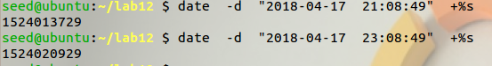

```
1524013729

1524020929
```

### 计算密钥

编写代码获得所有可能的密钥:

```c
#include <stdio.h>
#include <stdlib.h>
#include <time.h>
#define KEYSIZE 16
#define START 1524013729
#define END 1524020929
void main()
{
    int i;
    time_t t;
    char key[KEYSIZE];
    FILE *f;
    f = fopen("key.txt", "w");
    for (t = START; t < END; t++) // 两小时之内
    {
        /* 初始化随机数发生器 */
        srand((unsigned)t);

        /* 输出 0 到 256之间的16个随机数 */
        for (i = 0; i < KEYSIZE; i++)
        {
            key[i] = rand() % 256;
            fprintf(f, "%.2x", (unsigned char)key[i]);
        }
        fprintf(f, "\n");
    }
}
```

编译执行

```bash
gcc task2.c -o task2 
./task2
```

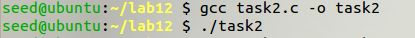

keys.txt文件是根据开始结束时间创建的，在这段时间内可能生成的所有键都在keys.txt中

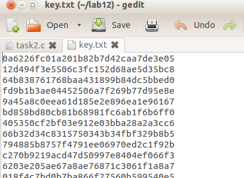

### 验证密钥

现在要做的就是对所有密钥一个一个的尝试，直到成功为止，于是编写脚本get_key.py：

```python
# /*   get_key.py  */
from Crypto import Random
from Crypto.Cipher import AES

ciphertext = "d06bf9d0dab8e8ef880660d2af65aa82"
IV = "09080706050403020100A2B2C2D2E2F2".lower().decode("hex")
plaintext1 = "255044462d312e350a25d0d4c5d80a34".decode("hex")

with open('key.txt') as f:
    keys = f.readlines()

for k in keys:
    key = (k[:-1]).decode("hex")
    cipher = AES.new(key, AES.MODE_CBC, IV)
    encrypted = cipher.encrypt(plaintext1)
    if ciphertext == encrypted.encode("hex")[0:32]:
        print("Match found")
        print("key: "+k[:-1])
        print("Ciphertext: " + ciphertext)
        print("Encrypted: " + encrypted.encode("hex"))

```

运行脚本

```bash
python get_key.py
```

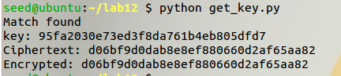

得到密钥：`95fa2030e73ed3f8da761b4eb805dfd7`

时间作为seed值并不是一个真正的随机数，用时间生成随机数不可取。

## 任务3：测量内核的熵

> 在虚拟世界中，难以创建随机性，即，单独的软件很难创建随机数。 大多数系统诉诸物理世界获得随机性。 Linux从以下物理资源中获得了随机性：
>
> ```c
> void  add_keyboard_randomness(unsigned  char  scancode);
> void  add_mouse_randomness(__u32  mouse_data);
> void  add_interrupt_randomness(int  irq);
> void  add_blkdev_randomness(int  major);
> ```
>
> 前两个非常容易理解：第一个使用按键之间的时间； 第二个使用鼠标运动和中断定时；第三个一个使用中断定时收集随机数。 当然，并非所有中断都是良好的随机性。 例如，定时器中断不是一个不错的选择，因为它是可预测的。 但是，磁盘中断是更好的度量。 最后一个测量块设备请求的文件。
> 使用熵测量随机性，这与信息理论中的熵的含义不同。 在这里，它只是意味着系统当前具有多少位随机数。 您可以使用以下命令突出内核在当前时刻有多少熵。
>
> ```bash
> $  cat  /proc/sys/kernel/random/entropy_avail
> ```
>
> 让我们通过Watch运行上面的命令来监视熵的更改，该命令定期执行程序，显示全屏中的输出。 以下命令每0.1秒运行CAT程序。
>
> ```bash
> $  watch  -n .1  cat  /proc/sys/kernel/random/entropy_avail
> ```
>
> 请运行上述命令。当它运行时，移动鼠标，单击鼠标，键入一些内容，阅读大文件，访问网站。哪些活动显著增加了熵。请在报告中描述您的观察结果。

运行以下命令：实时监测熵

```
watch  -n .1  cat  /proc/sys/kernel/random/entropy_avail
```

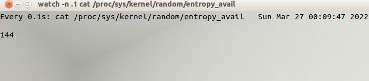

发现每次移动鼠标、敲击键盘等都会引起熵的变化

## 任务4：从/ dev /random获取伪随机数

> Linux将从物理资源收集的随机数据存储到随机池中，然后使用两个设备将随机性转换为伪随机数。 这两个设备是/ dev /随机和/ dev / urandom。 他们有不同的行为。 / dev /随机设备是阻塞设备。
>
> 即，每次通过该设备发出随机数时，随机池的熵将会减小。 当熵达到零时，/ dev /随机将阻塞，直到它增益足够的随机性。
>
> 让我们设计一个实验以观察/开/随机设备的行为。 我们将使用cat命令从/ dev /随机读取伪随机数。 我们将输出管向exdump管子进行漂亮的打印。

```bash
cat /dev/random | hexdump
watch -n .1 cat /proc/sys/kernel/random/entropy_avail
```

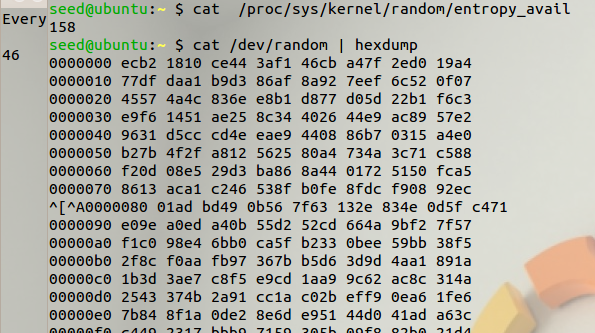

> 请运行上面的命令，同时使用Watch命令监视熵。
>
> 如果您没有移动鼠标或键入任何内容，会发生什么。 然后，随机移动鼠标，看看你是否可以观察任何差异。 请描述和解释您的观察。
>
> 问题：如果服务器使用/开/随机以使用客户端生成随机会话密钥。 请描述如何在此类服务器上启动拒绝服务（DOS）攻击。

不移动鼠标时不会有任何反应，只有移动鼠标到到一定程度时才会出现新的一行数据。

且entropy_avail值会从0~70不断变化，与此前的数据相比大小减小

## 任务 5：从/dev/urandom获取伪随机数

> Linux 提供了另一种通过 /dev/urandom 设备访问随机池的方法，除了此设备不会阻塞。/dev/random 和 /dev/urandom 都使用池中的随机数据来生成伪随机数。 当熵不够时，/dev/random 将暂停，而 /dev/urandom 将继续生成新数字。将池中的数据视为"seed"，正如我们所知，我们可以使用seed来生成任意数量的伪随机数。
>
> 让我们看看 /dev/urandom 的行为。我们再次使用 cat 从此设备获取伪随机数。请运行以下命令，并描述移动鼠标是否对结果有任何影响。
>
> ```bash
> $  cat  /dev/random   |  hexdump
> ```
>


```bash
watch -n .1 cat /proc/sys/kernel/random/entropy_avail
cat /dev/urandom | hexdump
```

不管三七二十一，控制台都会疯狂打印数据

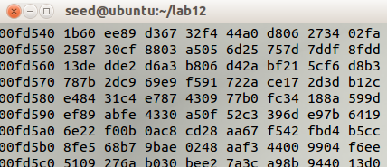

### 质量评测

> 让我们测量随机数的质量。我们可以使用名为 ent 的工具，该工具已安装在虚拟机中。根据其手册，"ent将各种测试应用于存储在文件中的字节序列，并报告这些测试的结果。该程序可用于评估伪随机数生成器，用于加密和统计采样应用程序，压缩算法以及感兴趣的文件信息密度的其他应用程序"。让我们首先从 /dev/urandom 生成 1 MB 的伪随机数，并将它们保存在一个文件中。然后，我们对文件运行 ent。请描述您的结果，并分析随机数的质量是否良好。
>
> ```bash
> $  head  -c  1M  /dev/urandom  >  output.bin
> $  ent output.bin
> ```
>

在本地发现ent指令无法在seed12上使用。这里我们又请来了老朋友kali

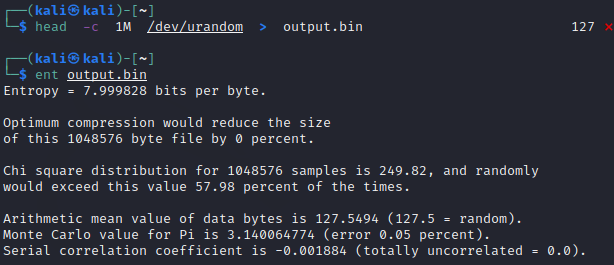

评测结果显示

```
Entropy = 7.999828 bits per byte.
熵=每一个字节7.999828位。————表示该文件的信息非常密集——基本上是随机的。

Optimum compression would reduce the size
of this 1048576 byte file by 0 percent.
最佳压缩将将1048576字节文件的大小缩小为0％。————

Chi square distribution for 1048576 samples is 249.82, and randomly
would exceed this value 57.98 percent of the times.
1048576样品的卡方分布为249.82，随机将超过此值的时间为57.98％。————卡方检验是最常用的数据随机性检验

Arithmetic mean value of data bytes is 127.5494 (127.5 = random).
数据字节的算术平均值为127.5494（127.5 =随机）。————值高于127.5表示它是随机的

Monte Carlo value for Pi is 3.140064774 (error 0.05 percent).
PI的Monte Carlo值为3.140064774（错误0.05％）。————如果是随机的，Pi的蒙特卡罗值将接近于Pi的值，它只有0.02%，因此我们可以认为它是随机的

Serial correlation coefficient is -0.001884 (totally uncorrelated = 0.0).
串行相关系数为-0.001884（完全不相关= 0.0）。————序列相关系数——这个量度量文件中每个字节对前一个字节的依赖程度，对于随机数，这个值将接近0
```

### 真正的随机数

> 从理论上讲，/dev/random设备更安全，但在实践中，没有太大区别，因为/dev/urandom使用的"seed"是随机且不可预测的（每当新的随机数据可用时，/dev/urandom都会重新播种）。 /dev/random 的阻塞行为的一个大问题是，阻塞可能导致拒绝服务攻击。因此，建议我们使用 /dev/urandom 来获取随机数。要在我们的程序中执行此操作，我们只需要直接从此设备文件中读取即可。以下代码片段演示了如何操作。
>
> ```c
> #define  LEN  16    //  128  bits
> unsigned  char  *key  =   (unsigned  char  *)  malloc(sizeof(unsigned  char)*LEN); FILE *  random  =  fopen("/dev/urandom",  "r");
> fread(key,  sizeof(unsigned  char) *LEN,  1,  random);
> fclose(random);
> ```
>
> 请修改上述代码片段以生成 256 位加密密钥。

```c
/*   task5.c   */
#include <stdio.h>
#include <stdlib.h>
#define LEN 32 //  256  bits

void main()
{

    int i;
    unsigned char *key = (unsigned char *)malloc(sizeof(unsigned char) * LEN);
    FILE *random = fopen("/dev/urandom", "r");
    for (i = 0; i < LEN; i++)
    {
        fread(key, sizeof(unsigned char) * LEN, 1, random);
        printf("%.2x", *key);
    }
    printf("\n");
    fclose(random);
}
```

编译运行

```bash
gcc task5.c -o task5
./task5
```

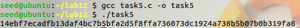

这是真正的随机数，因为它是从`/dev/urandom`读取的
