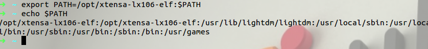
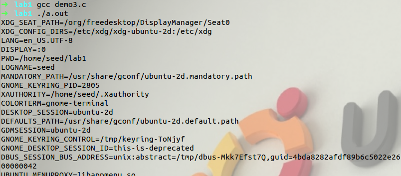
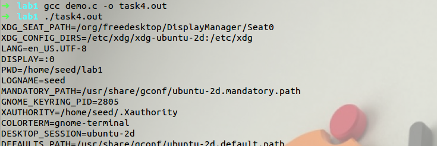
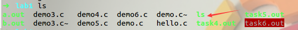
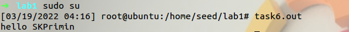
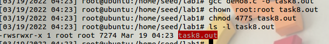
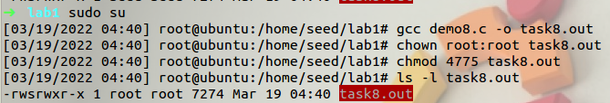
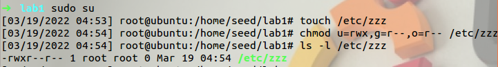
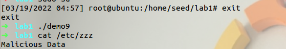

# Environment Variable and Set-UID Program

本文作者：[对酒当歌](https://blog.csdn.net/youyouwoxi)

# LEC

#### 1.1写出一行 linux 命令列出根目录下所有 suid 程序。 

SUID 是 `Set User ID` 的缩写，是一种特殊权限，设置了 SUID 的程 序文件，在用户执行该程序时，用户的权限是该程序文件属主的权限。

 例如程序文件的属主是 root，那么执行该程序的用户就将暂时获得 root 账户的权限。和 SUID 类似的有一种 SGID 的特殊权限。SGID 是 Set Group ID 的缩写。两者不同的是 SGID 是执行程序时获得的是文件 属组的权限。 

命令：

```bash
sudo find / -perm -4000 -type f -ls 
```

- `sudo `以root权限执行，更方便访问文件
- `find` 为查找
- `-perm` 为匹配权限
- `4000 2000 1000` 分别表示 `SUID SGID SBIT `
- `-type` 根据文件类型查找
-  `f` 表示普通文件
-  `-ls` 是英文单词 list 的简写，其功能为列出目录的内容，是用户最常 用的命令之一，类似于 DOS 下的 dir 命令 执行结果

执行结果：


#### 1.2描述 linux 下 setuid/seteuid/setreuid/getenv 这几个函数的功 能和差异。

 首先要了解的是内核为每个进程维护的三个 UID 值。这三个 UID 分别是`实际用户 ID(real uid)`、`有效用户 ID(effective uid)`、`保存的设置用户 ID(saved set-user-ID)`。

- 实际用户 ID，指我们当前以哪个用户登录了，我们运行的程序的 实际用户 ID 就是这个用户的 ID。
- 有效用户 ID ，是当前进程是以哪个 用户 ID 来运行的，一般情况下是实际用户 ID，如果可执行文件具有 了 SUID 权限，那么它的有效用户 ID 就是可执行文件的拥有者。
- 保存的设置用户 ID ，是有效用户 ID 的一个副本，与 SUID 权限有关。 

setuid()用来重新设置执行目前进程的用户识别码。 

seteuid()用来重新设置执行目前进程的有效用户识别码。它只改 变进程 euid，而不改变 ruid 和 suid。 

setreuid()用来设定真实用户 ID(real uid)和有效用户 ID(effective uid)，这个函数在由有效用户 ID 符为 0 的进程调用时,不会改变已保 存用户 ID。 

getenv()用来取得参数 envvar 环境变量的内容。参数 envvar 为环 境变量的名称，如果该变量存在则会返回指向该内容的指针。执行成 功则返回指向该内容的指针，找不到符合的环境变量名称则返回 NULL。如果变量存在但无关联值，它将运行成功并返回一个空字符串， 即该字符的第一个字节是 null。

#### 2、有些入侵者入侵系统后，喜欢隐藏一个 suid root shell 文件以便下次再进入。对于这种后门应该如何进行检测？

系统管理员应该定期查看系统中有哪些 SUID 和 SGID 文件。执 

行以下命令： 

```bash
sudo find / -type f -perm -4000 -o -perm -2000 
```

- -o 表示满足-4000（SUID）和-2000（SGID）其中一个即可

执行结果（部分）：


#### 3.1解释 Linux 环境变量 PATH 的作用，如何显示和修改这个环境变量？ 

PATH 说简单点就是一个字符串变量，当输入命令的时候 LINUX 会去查找 PATH 里面记录的路径。比如在根目录/下可以输入命令 ls, 在/usr目录下也可以输入ls,但其实ls这个命令根本不在这个两个目录 下，事实上当你输入命令的时候 LINUX 会去`/bin,/usr/bin,/sbin `等目录 下 面 去 找 你 此 时 输 入 的 命 令 ， 而 PATH 的 值 恰 恰 就 是 `/bin:/sbin:/usr/bin:...`

其中的冒号使目录与目录之间隔开。 使用 export 命令查看 PATH 值，执行结果如下：

```bash
export
```


修改 PATH：

```bash
export PATH=/opt/xtensa-lx106-elf:$PATH 
```

检查修改结果

```bash
echo $PATH 
```



#### 3.2解释 linux 下用 root 执行下面这条命令 chmod 4755 file 的 含义和用途。 

`chmod` 是 Linux 下设置文件权限的命令，后面的数字表示不同用 户或用户组的权限。chmod 是 Linux 下设置文件权限的命令，后面的 数字表示不同用户或用户组的权限。 

一般是三个数字： 

第一个数字表示文件所有者的权限 

第二个数字表示与文件所有者同属一个用户组的其他用户的权限 

第三个数字表示其它用户组的权限。

 权限分为三种：

| 权限 | 数字 |
| ---- | ---- |
| 读   | r=4  |
| 写   | w=2  |
| 执行 | x=1  |

综合起来还有

| 权限           | 数字        |
| -------------- | ----------- |
| 可读可执行     | rx=5=4+1    |
| 可读可写       | rw=6=4+2    |
| 可读可写可执行 | rwx=7=4+2+1 |

 所以，`chmod 755` 设置用户的权限为：

1. 文件所有者可读可写可执行 
2. 与文件所有者同属一个用户组的其他用户可读可执行 
3. 其它用户组可读可执行。

chmod 4755 与 chmod 755 的区别在于开头多了一位，4 表示其他用户执行文件时，具有与所有者相当的权限。

#### 5、描述 system、execve、fork 这几个函数的功能和差异。

**system()**会调用 fork()产生子进程，由子进程来调用`/bin/sh-c string `来执行参数 string 字符串所代表的命令，此命>令执行完后 随即返回原调用的进程。在调用 system()期间 SIGCHLD 信号会被 暂时搁置，SIGINT 和 SIGQUIT 信号则会被忽略。 

> 返回值:
>
> =-1: 出现错误
> =0: 调用成功但是没有出现子进程
> \> 0: 成功退出的子进程的 id

**execve()**用来执行参数 filename 字符串所代表的文件路径， 第二个参数是利用数组指针来传递给执行文件，并且需要以空指 针(NULL)结束，最后一个参数则为传递给执行文件的新环境变量 数组。

> 返回值：如果执行成功则函数不会返回，执行失败则直接 返回-1，失败原因存于 errno 中。 

**fork（）**函数通过系统调用创建一个与原来进程几乎完全相 同的进程，也就是两个进程可以做完全相同的事，但如果初始参 数或者传入的变量不同，两个进程也可以做不同的事。一个进程 调用 fork（）函数后，系统先给新的进程分配资源，例如存储数 据和代码的空间。然后把原来的进程的所有值都复制到新的新进 程中，只有少数值与原来的进程的值不同。相当于克隆了一个自 己。

> 返回值： 若成功调用一次则返回两个值，子进程返回 0， 父进程返回子进程标记；否则，出错返回-1。

# Lab

代码仓库：https://github.com/SKPrimin/HomeWork/tree/main/SEEDLabs/ZUD1Environment_Variable_and_SetUID

## **Task 1: Manipulating environment variables**

任务 1：管理环境变量 

> 在这个任务中，我们研究可以用来设置和取消环境变量的命令。我们在seed帐户中使用 Bash。用户使用的默 认 shell 设置在`/etc/passwd` 文件中（每个条目的最后一个字段）。 您可以使用 chsh 命令将此更改为另一个 shell 程序（请不要为本实验室这样做）。 请你完成以下任务：
>
> • 使用 printenv 或 env 命令打印出环境变量。 如果您对某些特定的环境变量感兴趣，例如 PWD，您可以使用“`printenvPWD`”或“`env|grepPWD`”。 
>
> • 使用 export 和 unset 设置或 unset 环境变量.. 应该注意的是，这两个命令不是单独的程序；它们是 Bash的两个内部命令(您将无法在 Bash 之外找到它们)。

（1）使用 printenv 命令输出环境变量输入命令 printenv，得到如下结果

```bash
printenv
```


使用 printenv 命令查看 PATH 环境变量，得到如下结果

```bash
printenv PWD
```


（2）使用 export 和 unset 设置或删除环境变量

使用 echo 显示环境变量，`$`符号实际作用是将变量转换成字符，方便输出。

```bash
export demo="home/bin"
echo $demo
unset demo
echo $demo
```


## **Task 2: Inheriting environment variables from parents**

任务2 ：继承来自父母的环境变量

> 在这个任务中，我们研究环境变量是如何由孩子从他们的父母那里继承的。 在 Unix 中，fork()通过复制调用 进程来创建一个新进程。 新进程，简称子进程，是调用进程的精确重复，简称父进程；但是，有几个东西不 是子进程继承的(请参阅 fork 手册()通过键入以下命令：manfork).. 
>
> 在这个任务中，我们想知道父进程的环境变 量是否由子进程继承。
>
>  步骤 1 请编译并运行以下程序，并描述您的观察。 因为输出包含多个字符串，所以应该将输出保存到一个文 件中，例如使用 a.out>子文件(假设 a.out 是可执行文件名)。

```c
#include <unistd.h>
#include <stdio.h>
#include <stdlib.h>

extern char **environ;

void printenv()
{
    int i = 0;
    while (environ[i] != NULL)
    {
        printf("%s\n", environ[i]);
        i++;
    }
}
void main()
{
    pid_t childPid;
    switch (childPid = fork())
    {
    case 0: /* child process */
        printenv();
        exit(0);
    default: /* parent process */
        //printenv();
        exit(0);
    }
}
```


1. 编译 C 文件，系统会默认将结果保存为 a.out 文件

```bash
gcc demo.c
./a.out
```


> 步骤 2 现在，在子进程案例中注释掉 printenv()语句，并在父进程案例中取消注释 printenv()语句。 编译并运行代码，并描述您的观察。 将输出保存在另一个文件中。 

2. 按题意，将 child process 中 `printenv()`注释，将 process 中` parent printenv()`取消注释，重新保存编译 C 文件，并将结果保存为 b.out 文件

作如下修改


```bash
gcc demo.c -o b.out
./b.out
```


> 步骤 3 使用 diff 命令比较这两个文件的差异.. 请得出你的结论。

```bash
diff a.out b.out
```


可见，两者除了文件名外完全相同。这说明子进程环境变量会继 承父环境变量。进一步查阅资料了解到，子进程自父进程继承到进程 的资格、环境、堆栈、内存等，但子进程所独有的是不同的父进程号、 自己的文件描述符和目录流的拷贝、在 tms 结构中的系统时间、不继 承异步输入和输出等

##  **Task 3: Environment variables and** execve()

任务3：环境变量和execve()

> 在这个任务中，我们研究了当一个新的程序通过 execve()执行时，环境变量是如何受到影响的.. 函数 execve() 调用系统调用来加载新命令并执行它；此函数永远不会返回。 没有创建新进程；相反，调用进程的文本、数 据、bss 和堆栈被加载的程序覆盖。 本质上，execve()在调用过程中运行新程序。 我们对环境变量会发生什么 感兴趣；它们是由新程序自动继承的吗？ 

> 步骤 1 请编译并运行以下程序，并描述您的观察。 此程序只需执行一个名为`/usr/bin/env` 的程序，该程序打印 出当前进程的环境变量。

```c
#include <stdio.h>
#include <stdlib.h>
extern char **environ;
int main()
{
    char *argv[2];
    argv[0] = "/usr/bin/env";
    argv[1] = NULL;
    execve("/usr/bin/env", argv, NULL);
    // execve("/usr/bin/env", argv, environ);
    return 0;
}
```


```bash
gcc demo3.c
./a.out
```


执行结果为空。查询函数 execve()的作用，其调用格式如下：

 `int execve(const char * filename, char * const argv[], char * const envp[]) `

第一个参数为一个可执行的有效的路径名。第二个参数系利用数组指 针来传递给执行文件，argv 是要调用的程序执行的参数序列，也就是我们要调用的程序需要传入的参数。envp 则为传递给执行文件的新 环境变量数。所以在此处，我们赋予新进程的环境变量为空，自然印 出环境变量结果为空。

> 步骤 2 现在，将 execve()的调用更改为以下内容，并描述您的观察。 
>
> `execve("/usr/bin/env", argv, environ);`



> 步骤 3 请就新程序如何获得其环境变量得出您的结论。

以上实验可以看出，`execve()`产生的新进程的环境变量又调用时重新赋予，而 fork()则是直接继承父进程环境变量。

## **Task 4: Environment variables and** system()

任务 4：环境变量和系统()

> 在此任务中，我们研究通过`system()`函数执行新程序时，如何影响环境变量。此函数用于执行命令，但与直接执行命令的` execve()`不同，system() 实际上执行"`/bin/sh -c command`"，即它执行`/bin/sh`，并要求 shell 执行该命令。
>
>  如果查看系统()函数的实现，会看到它使用 execl()执行/bin/sh；excel()调用 execve()，传递给它环境变量数组。 因此，使用system()，调用进程的环境变量传递给新程序/bin/sh。 请编译并运行以下程序来验证这一点。

```c
#include <stdio.h>
#include <stdlib.h>
int main()
{
    system("/usr/bin/env");
    return 0;
}
```

```bash
gcc demo.c -o task4.out
./task4.out
```



查阅资料得 system（）的调用格式如下：int system（const char * string），system()会调用 fork()产生子进程，由子进程来调用/bin/sh-c string 来执行参数 string 字符串所代表的命令，此命>令执行完后随即 返回原调用的进程。在调用 system()期间 SIGCHLD 信号会被暂时搁 置，SIGINT 和 SIGQUIT 信号则会被忽略。
具体描述为这样三个步骤：

1. 调用 fork（）函数新建一个子进程；

2. 在子进程中调用 exec 函数去执行 command；

3. 在父进程中调用 wait 去 等待子进程结束。 

> 返回值 
>
> =-1:出现错误
>
>  =0:调用成功但是没有出现子进程 
>
> >0:成功 退出的子进程的 id 
>
> 如果 system()在调用/bin/sh 时失败则返回 127，其他失败原因返回-1。若参数 string 为空指针(NULL)，则返回非零值。 如果 system()调用成功则最后会返回执行 shell 命令后的返回值，但是此返回值也有可能为system()调用/bin/sh 失败所返回的 127，因此最 好能再检查 errno 来确认执行成功。

##  **Task 5: Environment variable and** Set-UID **Programs**

任务 5：环境变量和集合-UID 程序 

> Set-UID 是 Unix 操作系统中重要的安全机制。 当 SET-UID 程序运行时，它假定所有者的特权。 例如，如果 程序的所有者是 root，那么当任何人运行此程序时，程序在执行过程中会获得 root 的特权。 Set-UID 允许我们 做许多有趣的事情，但是它在执行时会升级用户的特权，这使得它非常危险。 虽然 SET-UID 程序的行为是由 其程序逻辑决定的，而不是由用户决定的，但用户确实可以通过环境变量来影响这些行为。 为了了解 Set-UID 程序是如何受到影响的，让我们首先弄清楚 Set-UID 程序的进程是否从用户的进程继承了环境变量。 

> 步骤 1 我们将编写一个程序，可以打印出当前进程中的所有环境变量。

```c
#include <stdio.h>
#include <stdlib.h>

extern char **environ;

void main()
{
    int i = 0;
    while (environ[i] != NULL)
    {
        printf("%s\n", environ[i]);
        i++;
    }
}
```

```bash
gcc demo5.c -o task5.out
./task5.out
```


> 步骤 2 编译上述程序，将其所有权更改为 root，并使其成为 Set-UID 程序

```bash
sudo su
[sudo] password for seed: dees
chown root:root demo5.c
```


>  步骤 3 在您的 Bashshell 中（需要在普通用户帐户中，而不是根帐户中），使用 export 命令设置以下环境变量 （它们可能已经存在）：
>
> *•* PATH
>
> *•* LD_LIBRARY_PATH
>
> *•* ANY_NAME (this is an environment variable defifined by you, so pick whatever name you want).
>
>  在用户的 shell 进程中设置这些环境变量.. 现在，从 shell 中的步骤 2 运行 Set-UID 程序。 在您的 shell 中键 入程序名称后，shell 将分叉一个子进程，并使用子进程运行程序。 请检查在 shell 进程（父进程）中设置的所 有环境变量是否进入 Set-UID 子进程。 描述你的观察。 如果你有惊喜，描述一下。

```bash
exit
export PATH="$PATH:/usr/Local/"
export LD_LIBRARY_PATH="$LD_LIBRARY_PATH:/usr/locaL/"
export SK_Primin="/usr/local/"
./task5.out
```


果然有新变量，三个被定义的环境变量全部被包括在 shell 中。


## **Task 6: The PATH Environment variable and** Set-UID **Programs**

任务 6：PATH 环境变量和 SET-UID 程序 

由于调用了 shell 程序，在 Set-UID 程序中调用系统()是非常危险的。 这是因为 shell 程序的实际行为可能会受 到环境变量的影响，例如 PATH；这些环境变量是由用户提供的，用户可能是恶意的。通过改变这些变量，恶 意用户可以控制 SET-UID 程序的行为。在 Bash 中，可以通过以下方式更改 PATH 环境变量(本例将目录 /home/seed 添加到 PATH 环境变量的开头)：

```bash
export PATH=/home/seed:$PATH
```

下面的 Set-UID 程序应该执行/bin/ls 命令；但是，程序员只使用 ls 命令的相对路径，而不是绝对路径：

```c
int main()
{
    system("ls");
    return 0;
}
```

请编译上述程序，并将其所有者更改为 root，并使其成为 Set-UID 程序。您能让这个 SET-UID 程序运行您的代码而不是/bin/ls 吗？ 如果可以，您的代码是否使用根特权运行？ 描述并解释你的观察。

```bash
gcc demo6.c -o task6.out
chown root:root task6.out
chmod u+s task6.out
ls -l task6.out
```


运行程序，结果如下：

```bash
task6.out
```


它运行的是/bin/ls

创建一个hello.c，用于输出一段话。

```c
#include <stdio.h>
int main()
{
    printf("hello SKPrimin\n");
}
```

将 hello。out 复制到当前目录并命名为 ls，

```bash
gcc hello.c -o ls
ls
```



执行 task6.out 就会获得 root权限。其中，hello.out 的作用是输出“`hello`”。此时再运行 task6.out， 结果如下： 

```bash
sudo su
task6.out
```



## **Task 8: Invoking external programs using** system() **versus** execve()

任务 8：使用system()和execve()调用外部程序 

> 虽然system()和 execve（)都可以用来运行新的程序，但如果在特权程序中使用system()，如 Set-UID 程序，则是 相当危险的。我们已经看到了 PATH 环境变量如何影响系统()的行为，因为变量会影响 shell 的工作方式

> execve()没有问题，因为它不调用 shell。 调用 shell 有另一个危险的后果，这一次，它与环境变量无关。 让我们看看 下面的场景。
>
>  鲍勃在一家审计机构工作，他需要调查一家公司涉嫌欺诈。 为了调查目的，Bob 需要能够读取公司 Unix 系统中的所有文件；另一方面，为了保护系统的完整性，Bob 不应该能够修改任何文件。 为了实现这一目标， 系统的超级用户 Vince 编写了一个特殊的 set-root-uid 程序（见下文），然后将可执行权限授予 Bob。此程序要 求 Bob 在命令行中键入文件名，然后运行/bin/cat 来显示指定的文件。 由于程序作为根目录运行，它可以显示 Bob 指定的任何文件。 然而，由于程序没有写操作， Vince非常确信 Bob 不能使用这个特殊程序来修改任何文 件。

```c
#include <string.h>
#include <stdio.h>
#include <stdlib.h>
int main(int argc, char *argv[])
{
    char *v[3];
    char *command;
    if (argc < 2)
    {
        printf("Please type a file name.\n");
        return 1;
    }
    v[0] = "/bin/cat";
    v[1] = argv[1];
    v[2] = NULL;
    command = malloc(strlen(v[0]) + strlen(v[1]) + 2);
    sprintf(command, "%s %s", v[0], v[1]);
    // Use only one of the followings.
    system(command);
    // execve(v[0], v, NULL);
    return 0;
}
```

> 步骤 1：编译上述程序，使其所有者 root 目录，并将其更改为 SET-UID 程序。程序将使用系统()调用该命令。如果你是鲍勃，你能损害系统的完整性吗？ 例如，您能删除对您不可写的文件吗？

```bash
gcc demo8.c -o task8.out
chown root:root task8.out
chmod 4775 task8.out
ls -l task8.out
```



新建一个名为 Myfile 的文件，并设置其权限为仅 root 用户可读、写、 执行。

```bash
touch Myfile
chmod u=rwx,g=---,o=--- Myfile
ls -l Myfile
```


根据书上 P16，为程序输入一个字符串“`Myfile；rm Myfile`”即可删除 Myfile 文件 

```bash
./task8.out "Myfile; rm Myfile"
```


> 步骤 2：注释出system(command)语句，并取消注释 execve()语句；程序将使用 execve()调用该命令。 编译程序，并使其 Set-UID(由 root 拥有)。 步骤 1 中的攻击仍然有效吗？ 请描述并解释你的观察。

文件修改后重新编译

```bash
sudo su
gcc demo8.c -o task8.out
chown root:root task8.out
chmod 4775 task8.out
ls -l task8.out
```



再创建文件

```bash
touch Myfile
chmod u=rwx,g=---,o=--- Myfile
ls -l Myfile
```


```bash
exit
./task8.out "Myfile; rm Myfile"
```


可见，该攻击方法已经不管用。 

分析其原因，是因为 execve()函数会把 `file; rm file` 看成是一个文件名， 系统会提示不存在这个文件，system()则不会。

##  **Task 9: Capability Leaking**

任务 9：能力泄漏 

> 为了遵循最小特权原则，如果不再需要这些特权，Set-UID 程序通常会永久地放弃其根本特权。此外，有时程 序需要将其控制移交给用户；在这种情况下，必须撤销根特权。 可以使用 setuid()系统调用来撤销特权。 根据 手册，“setuid()设置调用过程的有效用户 ID。 如果调用方的有效 UID 是 root，则还将设置真正的 UID 和保存 的 set-user-ID”。 因此，如果具有有效 UID0 的 SET-UID 程序调用 `setuid(n)`，则该进程将成为一个正常进程， 其所有 UID 都被设置为 n。 
>
> 当取消特权时，常见的错误之一是能力泄漏。当进程仍然处于特权状态时，可能已经获得了一些特权功能； 当特权被降级时，如果程序不清理这些功能，它们仍然可以被非特权进程访问。 换句话说，虽然进程的有效 用户 ID 变得非特权，但进程仍然具有特权，因为它具有特权功能。 
>
> 编译下面的程序，将其所有者更改为 root，并使其成为 Set-UID 程序。作为正常用户运行程序，并描述您 所观察到的内容。 文件`/etc/zzz` 是否会被修改？ 请解释你的观察。

```c
#include <stdio.h>
#include <stdlib.h>
#include <fcntl.h>
void main()
{
    int fd;
    /* Assume that /etc/zzz is an important system file,
    * and it is owned by root with permission 0644.
    * Before running this program, you should creat
    * the file /etc/zzz first. */
    fd = open("/etc/zzz", O_RDWR | O_APPEND);
    if (fd == -1)
    {
        printf("Cannot open /etc/zzz\n");
        exit(0);
    } /* Simulate the tasks conducted by the program */
    sleep(1);
    /* After the task, the root privileges are no longer needed,it’s time to relinquish the root privileges permanently. */
    setuid(getuid()); /* getuid() returns the real uid */
    if (fork())
    { /* In the parent process */
        close(fd);
        exit(0);
    }
    else
    { /* in the child process */
        /* Now, assume that the child process is compromised, malicious attackers have injected the following statements
into this process */
        write(fd, "Malicious Data\n", 15);
        close(fd);
    }
}
```

先切换为 root 用户，创建/etc/zzz，设置其为只有 root 用户可以写入。

```bash
sudo su
chmod u=rwx,g=r--,o=r-- /etc/zzz
ls -l /etc/zzz
```



 保存代码为 demo9.c 文件，将其编译为 demo9，并赋予 SUID 特殊权限。

```bash
gcc demo9.c -o demo9
chmod 4775 demo9
```


执行 demo9，查看内容，发现被写入信息



分析其原因是因为其在取消权限前并没有关闭文件，导致 seed 用户任然可以进行 root 用户才可以执行的写入操作。