# SQL Injection Attack Lec&Lab

## 介绍

SQL 注入是一种代码注入技术，它利用 Web 应用程序和数据库服务器之间的接口中的漏洞。当用户的输入在发送到后端数据库服务器之前未在 Web 应用程序中正确检查时，就会出现此漏洞。

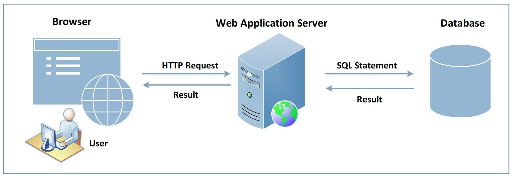

许多 Web 应用程序从用户那里获取输入，然后使用这些输入来构造 SQL 查询，因此 Web 应用程序可以从数据库中提取信息。Web 应用程序还使用 SQL 查询将信息存储在数据库中。这些是 Web 应用程序开发中的常见做法。如果 SQL 查询构造不仔细，就会出现 SQL 注入漏洞。SQL 注入攻击是对 Web 应用程序最常见的攻击之一。

本实验的目标是找到利用 SQL-Injection 漏洞的方法，展示攻击可以造成的破坏，并掌握可以帮助防御此类攻击的技术。

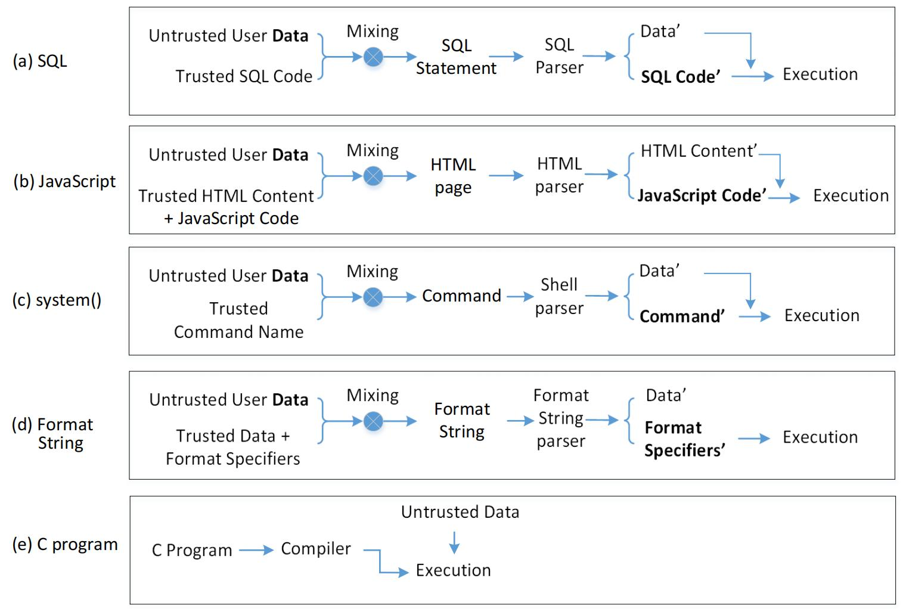

本文作者：zmzzmqa、对酒当歌

# Pre

#### 1、阅读 SQL Injection with MySQL

网上搜索和阅读 SQL Injection with MySQL 这篇文章，描述 SQL Injection 的原因和危害，注意其中提到的单引号双引号和井号等特殊字符。思考如何才能防止 SQL Injection？

一般情况下，SQL 语句包含用户提供的数据，如果一条 SQL 语句 构造不当，恶意用户就能向 SQL 语句中注入恶意代码，并让数据块去 执行它，这种攻击成为 SQL 注入。

原因： 首先，SQL 语句混入了两段信息，一段来自用户，这一段 并不可信，另一段通常由程序提供，这部分是可信的。这两段信息合 并之前，开发者很清楚这两者之间的界限。但在合并之后，这些界限 就消失了。其次，两段信息混合后，结果会被发送给 SQL 解析器，如 果数据总包含了关键词或者字符，即便它们是原始数据的一部分，也 会被视为代码，因为解释器并不知道代码和数据间的原始界限。这样 一来，攻击者就可以通过数据通道向疏于防范的程序注入代码了。这与 `system() `函数的攻击以及格式化字符串攻击的原理类似。

危害：

1. 用户的隐私以及个人信息泄露。
2. 可以对数据库的数据进行增加或删除操作，造成破坏或者长期背控制
3. 如果网站目录存在写入权限，可以写入网页木马。攻击者进而可以对网页进行篡改， 发布一些违法信息等。
4. 经过提权等步骤，服务器最高权限被攻击者获取。攻击者可以远程控制服务器，安装后门，得以修改或控制操作系统。

预防 SQL 注入攻击的方法：

1. 严格限制 Web 应用的数据库的操作权限，给连接数据库的用户提供满足需要的最 低权限，最大限度的减少注入攻击对数据库的危害
2. 校验参数的数据格式是否合法（可以使用正则或特殊字符的判断）
3. 对进入数据库的特殊字符进行转义处理，或编码转换
4. 预编译 SQL，参数化查询方式，避免 SQL 拼接
5. 报错信息不要包含 SQL 信息输出到 Web 页面

### 2、猜测手段

SQL Injection 过程中，需要猜测未知的数据表名和字段名以及密码，描述一下常用的猜测手段。

1. 猜解数据库表名：

admin adminuser user pass password。如： `and 0<>(select count(*) from admin) `---判断是否存在 admin 这张表。

2. 猜解数据库字段名

在`len()`括号里面加上我们想到的字段名称 。如： `and 1=(select count(*) from admin where len（ password)>0)`。

3. 猜解密码

如： `and 1=(select count(*) from admin where left(name,1)=a)` ---猜解用 户帐号的第一位。

### 3、阅读 Basic SQL Tutorial。

http://www.w3schools.com/sql/
http://www.w3schools.com/php/
以及阅读 SQL Injection Attacks by Example
http://www.unixwiz.net/techtips/sql-injection.html

第一篇文章介绍的是 SQL 的基本语法和用法，包括创建数据库、 创建表、插入行、SELECT 语句、WHERE 语句、UPDATA 语句等。

第二篇文章主要介绍的是 PHP 语言。文章介绍了 PHP 的基本语 法、数据类型、输出、字符串、循环、函数、数组等。

第三篇文章主要介绍的是一个 SQL 注入实例。文章猜测了一些字 段名称，包括电子邮件、passwd 文件、登录 ID 等。从中可以学习到 SQL 注入的常用猜测手段。

### 4、HTS Realistic 4

（可以网上搜索 walkthrough）HTS Realistic 4。先去http://www.hackthissite.org/注册，然后利用SQL Injection 完成下面这一关，目的是获得 a list of the email addresses。

Fischer’s Animal Products: A company slaughtering animals and turning their skin into overpriced products sold to rich bastards! Help animal rights activists increase political awareness by hacking their mailing list.

From: SaveTheWhales

Message: Hello, I was referred to you by a friend who says you know how to hack into computers and web sites - well I was wondering if you could help me out here. There’s this local store who is killing hundreds of animals a day exclusively for the purpose of selling jackets and purses etc out of their skin! I have been to their website and they have an email list for their customers. I was wondering if you could somehow hack in and send me every email address on that list? I want to send them a message letting them know of the murder they are wearing. Just reply to this message with a list of the email addresses. Please? Their website is at http://www.hackthissite.org/missions/realistic/4/. Thanks so much!!

消息：您好，我的一个朋友介绍了你，他知道你知道如何破解计算机和网站 - 好吧，我想知道你是否可以帮助我。 这家本地商店每天一天杀死数百只动物，专门为销售夹克和钱包等肌肤！ 我去过他们的网站，他们为客户提供了一封电子邮件列表。 我想知道你是否可以以某种方式破解并向我发送该列表的每一个电子邮件地址？ 我想向他们发送一条消息，让他们知道他们穿着的是杀戮。 只需回复电子邮件列表。 请？ 他们的网站是http://www.hackthissite.org/missions/remistic/4/。 非常感谢！！

该网站有个明显的可能有注入漏洞的点， add to list，但是怎么输入都没用

只有两种返回结果，:`Email added successfully.`和`Error inserting into table "email"! Email not valid! Please contact an administrator of Fischer's`。

F12 查看页面源代码，发现还有两处可点击的地方，是商品的列表

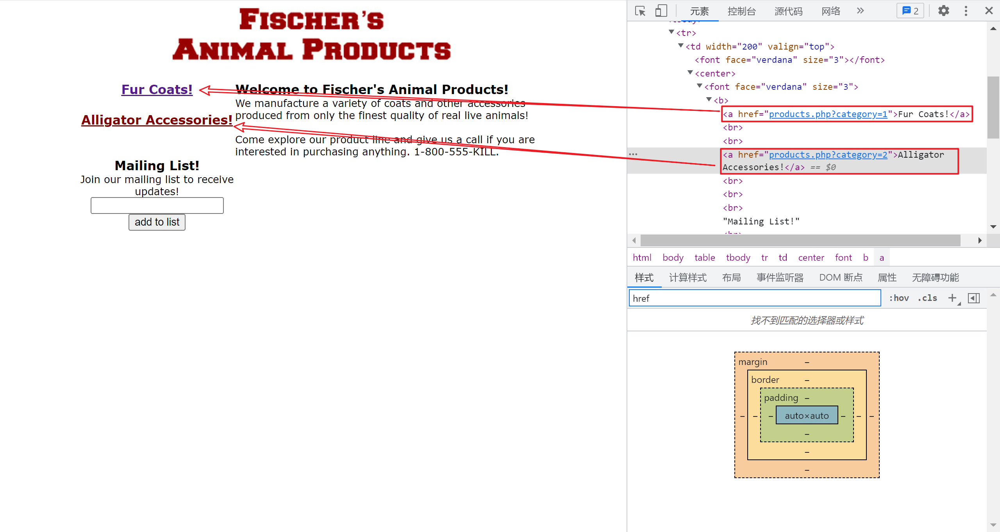

都是链接到`products.php?category=`。尝试访问 products.php?category=1 or 2 发先有注入漏洞

使用 union 编写注入语句作为 category 参数的值，

- `UNION ALL `选取两个所有的的值，包括重复的， UNION 内部的每个 SELECT 语句必须拥有相同数量的列。列也必须拥有相似的数据类型

用 null 空列来解决这个问题。三个 null 达到目的

即

```sql
?category=1 UNION ALL SELECT NULL, *, NULL, NULL FROM email;
?category=2 UNION ALL SELECT NULL, *, NULL, NULL FROM email;
```

便得到了已注册的邮箱

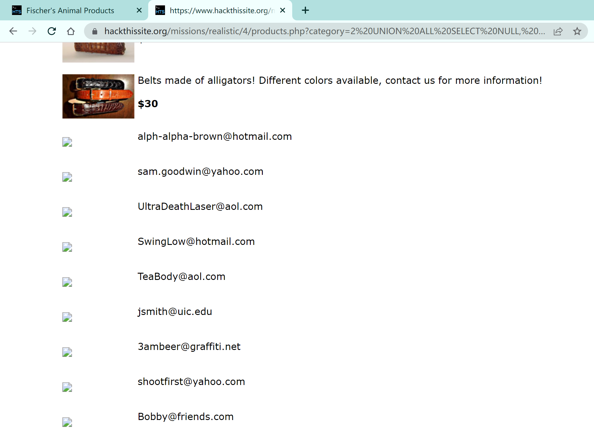

5、目前有名为 smbpasswd 的文件，内容为
root:0:XXXXXXXXXXXXXXXXXXXXXXXXXXXXXXXX:09840D4B78FCCC0628B4218F5C902EB9:[U ]:LCT-498C012B:
能从里面解密出 root 的密码吗？（不超过 5 位）

smbpasswd 文件格式为：

`username:uid:Lanman Password Hash:NT Password Hash:账号标志:最后修改时间`

`NT Password Hash`：指定 Windows NT 的用户口令散列表，也是 32 位的十六进制编码。 在 MD5 解密网站https://www.cmd5.com/进行查询，选中NTLM格式解密成功，密码`1q2w3`

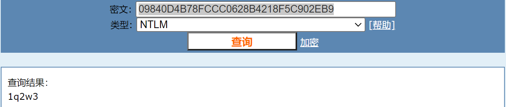

6、认真观看，P4 SQL Injection Attack Lecture
https://www.bilibili.com/video/BV1a441117kb
大概说下视频的内容。

视频首先简单介绍了 SQL，包括登录 MySQL、创建数据库、创建 表、插入行、SELECT 语句、WHERE 语句、UPDATA 语句、SQL 语 句中的注释等。然后介绍了如何发动 SQL 注入攻击。通过输入一些 特殊字符，如撇号`'`，井号`#`等，就可以成功改变 SQL 语句的 含义，从而发动攻击。

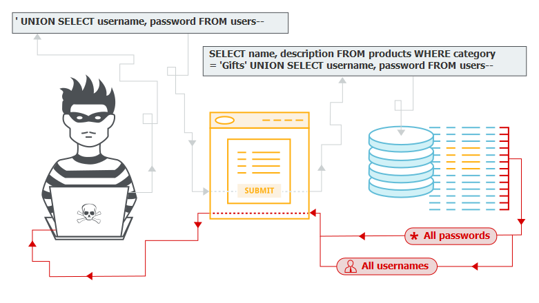

# Lab

## 实验室环境配置

代码仓库：[SQL_Injection at main · SKPrimin (github.com)](https://github.com/SKPrimin/HomeWork/tree/main/SEEDLabs/SQL_Injection)

### 环境配置

在本实验中，我们需要三样东西，所有这些都已安装在提供的 VM 映像中：(1) Firefox Web 浏览器，(2) Apache Web 服务器，以及 (3) Collabtive 项目管理 Web 应用程序。对于浏览器，我们需要使用 Firefox 的 LiveHTTPHeaders 扩展来检查 HTTP 请求和响应。提供给您的预构建 Ubuntu VM 映像已经安装了带有所需扩展的 Firefox Web 浏览器。

**启动 Apache 服务器。**Apache Web 服务器包含在预构建的 Ubuntu 映像中。Web 服务器默认启动。如果需要启动 Web 服务器，请使用以下命令：

```bash
sudo service apache2 start
```

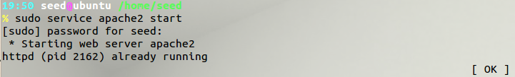

**协作 Web 应用程序。**在本实验室中，我们使用了一个名为 Collabtive 的开源 Web 应用程序。Collabtive 是一个基于 Web 的项目管理系统。此 Web 应用程序已在预构建的 Ubuntu VM 映像中设置。我们还在 Collabtive 服务器上创建了几个用户帐户。要查看所有用户的帐户信息，首先使用以下密码以管理员身份登录；其他用户的账号信息可以从首页的帖子或者“管理用户”选项卡中获取。

```bash
username: admin

password: admin
```

**配置 DNS**。 我们已经控制了此实验室所需的以下 URL。 要访问 URL，需要启动 Apache 服务器：

URL: http://www.SEEDLabSQLInjection.com
Folder: /var/www/SQLInjection/

上面的 URL 只能从虚拟机内部访问，因为我们修改了 /etc/hosts 文件，将每个 URL 的域名映射到虚拟机的本地 IP 地址（127.0.0.1）。您可以使用 /etc/hosts 将任何域名映射到特定的 IP 地址。例如，您可以通过将以下条目附加到 /etc/hosts 来将 http://www.example.com 映射到本地 IP 地址：

```bash
127.0.0.1 www.example.com
```

如果您的 Web 服务器和浏览器运行在两台不同的机器上，您需要相应地修改浏览器机器上的 /etc/hosts 以将这些域名映射到 Web 服务器的 IP 地址，而不是 127.0.0.1。

**配置 Apache 服务器。**在预构建的 VM 映像中，我们使用 Apache 服务器来托管实验室中使用的所有网站。Apache 中基于名称的虚拟主机功能可用于在同一台机器上托管多个网站（或 URL）。目录“/etc/apache2/sites-available”中名为 default 的配置文件包含配置所需的指令：

1. 指令“NameVirtualHost\*”指示 Web 服务器使用机器中的所有 IP 地址（有些机器可能有多个 IP 地址）。

2. 每个网站都有一个 VirtualHost 块，它指定网站的 URL 和包含网站源的文件系统中的目录。例如，配置一个 URL 为http://www.example1.com 且源位于目录/var/www/Example_1/的网站，以及配置一个 URL 为http://www.example2.com的网站并提供源在目录/var/www/Example_2/中，我们使用以下块：

   ```xml
   <VirtualHost *>
   
   ServerName http://www.example1.com
   
   DocumentRoot /var/www/Example_1/
   
   </VirtualHost>
   
   <VirtualHost *>
   
   ServerName http://www.example2.com
   
   DocumentRoot /var/www/Example_2/
   
   </VirtualHost>
   ```

您可以通过访问上述目录中的源来修改 Web 应用程序。例如，通过上述配置， 可以通过修改目录/var/www/Example_1/中的源来更改 Web 应用程序http://www.example1.com。

### 关闭保护

PHP 提供了一种自动防御 SQL 注入攻击的机制。该方法称为 magic quote，更多细节将在任务 3 中介绍。我们先关闭此保护（PHP 5.3.0 版本后已弃用此保护方法）。

1. 在终端中，输入 `sudo gedit /etc/php5/apache2/php.ini`
2. 找到这条语句：`magic_quotes_gpc = On`
3. 将其更改为：`magic_quotes_gpc = Off`
4. 保存更改。
5. 通过运行`sudo service apache2 restart`重新启动 Apache 服务器。

```
sudo vim /etc/php5/apache2/php.ini
```

在**非 inset** 模式下，可以输入`/magic_quotes_gpc` Enter 快速找到。将 On 改 为 Off 后，重启 apache 服务器。

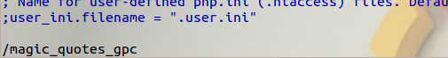

按<kbd>i</kbd>键将 `On `改`off`

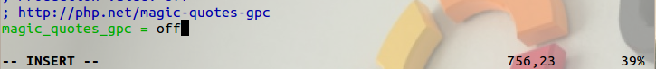

随后，<kbd>Esc</kbd>退出编辑模式，数据`:wq`保存并退出，重启 apache 服务器。

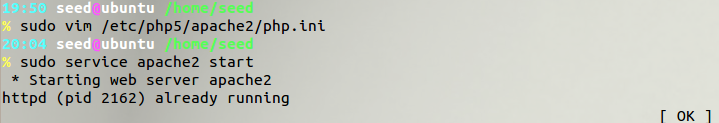

### 补丁

给现有虚拟机打补丁，添加 Web 应用

[patch.tar.gz at main · SKPrimin (github.com)](https://github.com/SKPrimin/HomeWork/blob/main/SEEDLabs/SQL_Injection/patch.tar.gz)

我们为此实验室开发了简单的员工管理 Web 应用程序。Web 应用程序用于存储员工配置文件信息。我们为此应用程序创建了多个员工帐户。若要查看所有员工的帐户信息，可以以管理员身份登录 www.SEEDLabSQLInjection.com（员工 ID 为 99999）。
您从我们的课程网站下载的 SEEDUbuntu12.04 图像不包括此 Web 应用程序。 需要为此练习修补 VM。 您可以从我们的课程网站下载名为 patch.tar.gz 的补丁文件。 该文件包括 Web 应用程序和一个脚本，该脚本将安装本练习所需的所有必需文件。将 patch.tar.gz 放在任何文件夹中，解压缩它，然后运行一个名为 bootstrap.sh 的脚本。VM 现在已准备好用于此实验室。

```bash
tar -zxvf ./patch.tar.gz
cd patch
chmod a+x bootstrap.sh
./bootstrap.sh
```

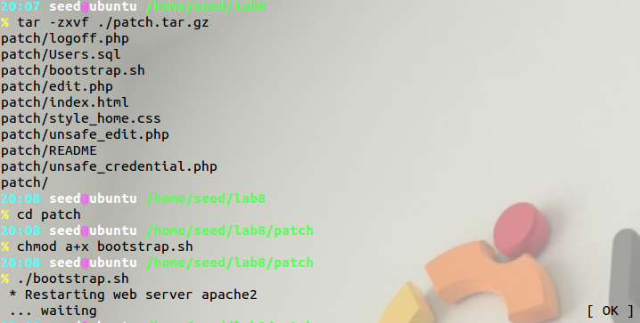

bootstrap.sh 脚本在现有的 SEEDUbuntu VM 中创建一个名为 Users 的新数据库，将数据加载到数据库中，设置虚拟主机 URL，最后修改本地 DNS 配置。如果您有兴趣手动进行设置，请参阅附录部分以了解详细信息。

#### 测试 SQL 注入字符串。

在真实的应用程序中，可能很难检查 SQL 注入攻击是否包含任何语法错误，因为服务器通常不会返回这类错误消息。要进行调查，可以将 SQL 语句从 php 源代码复制到 MySQL 控制台。假设您有下面的 SQL 语句，注入字符串是'或 1=1;#。

```sql
SELECT * from credential
WHERE name=’$name’ and password=’$pwd’;
```

你可以用注入字符串替换\$name 的值，并使用 MySQL 控制台测试它。这种方法可以帮助您在发起真正的注入攻击之前构造一个没有语法错误的注入字符串。

#### 教学须知

如果讲师计划为此练习举办实验课程，我们建议在实验课程中涵盖以下背景材料：

1. 如何使用虚拟机、Firefox Web 浏览器和 LiveHTTPHeaders 扩展。
2. SQL 简介。只需要涵盖 SELECT、UPDATE 和 INSERT 语句的基本结构。 有用的在线 SQL 教程可以在 http://www.w3schools 上找到。com/sql/.
3. 如何操作 MySQL 数据库（仅基础知识）。有关 MySQL 数据库的帐户信息可以在 VM 的用户手册中找到，该手册可从我们的 SEED 网页下载。
4. PHP 简介。只需要涵盖最基本的内容。具有 C / C++，Java 或其他语言背景的学生应该能够很快学习这种脚本语言。

#### A 修补实验室环境

在环境设置一节中，我们描述了如何运行补丁脚本来设置 SQL 注入实验室环境。如果您对手动设置环境感兴趣，本节将提供一步一步的说明。

#### A.1 加载数据到数据库

我们需要将一些现有的数据加载到 MySQL 中。下面的命令登录到 MySQL 数据库，创建一个名为 Users 的数据库，并从 Users 加载数据。SQL 到新创建的数据库。

```sql
$  mysql  -u  root  -pseedubuntu
mysql>  CREATE  DATABASE  Users;
mysql> quit
$  mysql  -u  root  -pseedubuntu  Users  <  Users.sql
```

#### A.2 搭建网站

在 VM 中设置 Employee Management web 应用程序需要四个步骤。

1. 第一步:创建一个新的文件夹/var/www/SQLInjection，并复制所有的 php, html,c cs 文件到/var/www/SQLInjection。请进入存放补丁文件夹的目录，并键入以下命令。

```bash
$ sudo mkdir /var/www/SQLInjection
$ sudo cp *.css *.php *.html /var/www/SQLInjection
```

2. 步骤 2:在 SEEDUbuntu VM 中，我们使用 Apache 托管实验室中使用的所有网站。Apache 中基于名称的虚拟主机特性可以用于在同一台机器上托管多个网站(或 url)。配置文件/etc/apache2/sites-available/default 包含必要的配置指令。我们可以在/etc/apache2/sites-available/default 文件中添加一个新的 url，如下所示:

```xml
<VirtualHost  *>
ServerName  http://www.SeedLabSQLInjection.com
DocumentRoot  /var/www/SQLInjection/
</VirtualHost>
```

3. 步骤 3:我们需要修改本地 DNS 文件/etc/hosts，为主机名www.SeedLabSQLInjection.com提供一个IP地址(127.0.0.1)。

```bash
127.0.0.1                  www.SeedLabSQLInjection.com
```

4. 步骤 4:重启 Apache 务器

```bash
sudo  service  apache2  restart
```

## 实验室任务

我们已经创建了一个 web 应用程序，并将其托管在www.SEEDLabSQLInjection.com上。这个web应用是一个简单的员工管理应用程序。员工可以查看和更新他们的个人

通过这个 web 应用程序，数据库中的信息。在这个 web 应用程序中主要有两个角色：管理员是一个特权角色，可以管理每个员工的个人信息；“员工”是普通角色，可以查看或更新自己的个人信息。所有员工信息如下表所示。

| User  | Employee ID | Password  | Salary | Birthday | SSN      | Nickname | Email | Address | Phone# |
| ----- | ----------- | --------- | ------ | -------- | -------- | -------- | ----- | ------- | ------ | 
| Admin | 99999       | seedadmin | 400000 | 3/5      | 43254314 |          |       |         |        |     |
| Alice | 10000       | seedalice | 20000  | 9/20     | 10211002 |          |       |         |        |     |
| Boby  | 20000       | seedboby  | 50000  | 4/20     | 10213352 |          |       |         |        |     |
| Ryan  | 30000       | seedryan  | 90000  | 4/10     | 32193525 |          |       |         |        |     |
| Samy  | 40000       | seedsamy  | 40000  | 1/11     | 32111111 |          |       |         |        |     |
| Ted   | 50000       | seedted   | 110000 | 11/3     | 24343244 |          |       |         |        |     |

### 任务 1:MySQL 控制台

> 这个任务的目标是通过使用所提供的数据库来熟悉 SQL 命令。我们已经创建了一个名为 Users 的数据库，其中包含一个名为 credential 的表;该表存储每个员工的个人信息(例如 eid、密码、工资、ssn 等)。管理员可以修改所有员工的配置文件信息，但每个员工只能修改自己的信息。在这个任务中，您需要使用数据库来熟悉 SQL 查询。
> MySQL 是一个开源的关系数据库管理系统。我们已经在 SEEDUbuntu 虚拟机映像中设置了 MySQL。用户名为 root，密码为 seedubuntu。请使用以下命令登录 MySQL 控制台:
>
> ```bash
> mysql -u root -pseedubuntu
> ```

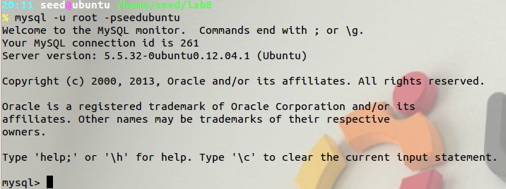

> 登录后，可以创建新的数据库或加载现有数据库。因为我们已经为您创建了 Users 数据库，您只需要使用以下命令加载这个现有的数据库:
>
> ```mysql
> mysql> use Users;
> ```
>
> 要显示 Users 数据库中有哪些表，可以使用以下命令打印所选数据库的所有表。
>
> ```mysql
> mysql>  show  tables;
> ```

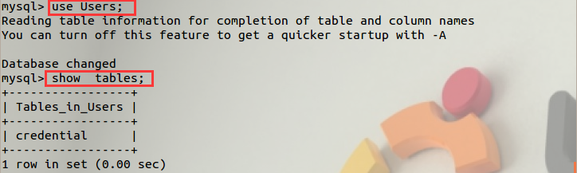

> 运行上述命令后，需要使用 SQL 命令打印员工 Alice 的所有配置信息。

```sql
select * from credential where name= 'Alice';
```

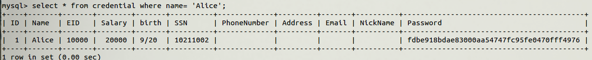

### 任务 2：对 SELECT 语句的 SQL 注入攻击

> SQL 注入基本上是一种技术，通过这种技术，攻击者可以执行他们自己的恶意 SQL 状态，通常称为恶意负载。通过恶意 SQL 语句，攻击者可以窃取受害者数据库中的信息;更糟糕的是，他们可能会对数据库进行更改。我们的员工管理 web 应用程序有 SQL 注入漏洞，这模仿了开发人员经常犯的错误。
> 您可以进入我们的 web 应用程序的入口页面www.SEEDLabSQLInjection.com，在那里您需要使用员工ID和密码登录。登录界面如下图所示。
>
> 身份验证基于员工 ID 和密码，因此只有知道自己 ID 和密码的员工才能查看或更新个人信息。作为攻击者，您的工作是在不知道任何员工的凭据的情况下登录到应用程序。

进入网页 www.SEEDLabSQLInjection.com 。

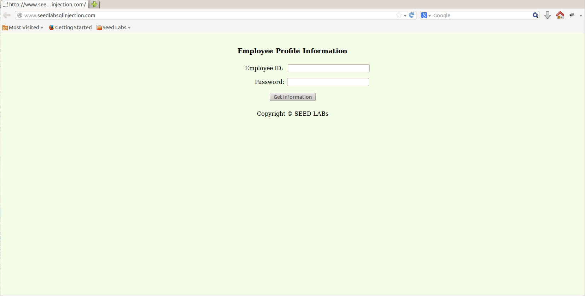

> 为了帮助您开始这个任务，我们将解释如何在我们的 web 应用程序中实现身份验证。位于/var/www/SQLInjection 目录中的 PHP 代码不安全凭据。PHP 用于进行用户身份验证。下面的代码片段显示如何对用户进行身份验证。
>
> ```。php
> $conn  =  getDB();
> $sql  =  "SELECT  id,  name,  eid,  salary,  birth,  ssn,                            								 phonenumber,  address,  email,  nickname,  Password
> 		FROM  credential
> 		WHERE  eid=  ’$input_eid’  and  password=’$input_pwd’";
> $result  =  $conn->query($sql))
>
> //  The  following  is  psuedo  code
> if(name==’admin’){
> 		return  All  employees  information.
> }  else  if(name!=NULL){
> 		return  employee  information.
> }  else  {
> 		authentication  fails.
> }
> ```
>
> 上面的 SQL 语句从凭证表中选择个人员工信息，如 id、姓名、工资、ssn 等。变量 input eid 和 input pwd 保存用户在登录页面中输入的字符串。基本上，程序检查任何记录是否与员工 ID 和密码匹配;如果有匹配，则用户身份验证成功，并得到相应的员工信息。如果没有匹配，则认证失败。

网页的源码位置在/var/www/SQLInjection，进入目录后，用 vim 打开 unsafe_credential.php 可以看到网页的源码：

```bash
cd /var/www/SQLInjection
vim unsafe_credential.php
```

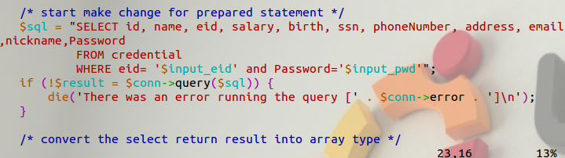

#### 任务 2.1:网页 SQL 注入攻击

> 您的任务是以管理员登录页面，可以看到所有员工的信息。我们假设您知道管理员的帐户名，即 admin，但不知道 ID 或密码。您需要决定在 Employee ID 和 Password 字段中输入什么才能成功攻击。

分析源代码可知，存在 SQL 注入漏洞。

当 ID 栏输入`'OR name ='admin'#`就可以成功以 admin 的身份登入.原因是,第一个单引号会闭合`id=’$input_eid’`,使条件变成了 `eid=’’OR name=’admin’#`,而`#`会把后面的语句都注释掉,所以相跳过了验证密码，直接登入 admin。

```
'OR name ='admin'#
```

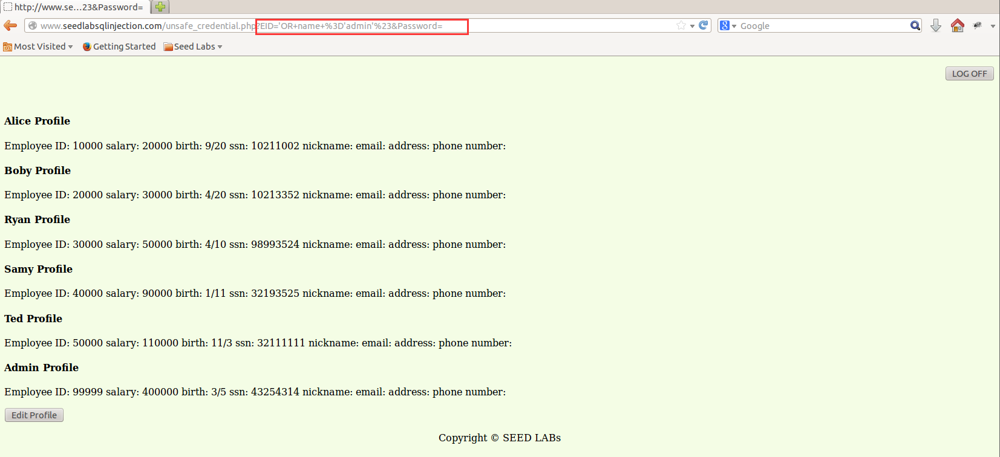

#### 任务 2.2:来自命令行的 SQL 注入攻击。

> 你的任务是重复 task 2.1，但你需要在不使用网页的情况下完成它。您可以使用命令行工具，例如 curl，它可以发送 HTTP 请求。值得一提的是，如果你想在 HTTP 请求中包含多个参数，你需要将 URL 和参数放在一对单引号之间;否则，用于分隔参数的特殊字符(如&)将被 shell 程序解释，从而改变命令的含义。下面的例子展示了如何发送一个 HTTP GET 请求到我们的 web 应用程序，带有两个参数(SUID 和密码):
>
> ```bash
> curl  ’www .SeedLabSQLInjection.com/index.php?SUID=10000&Password=111’
> ```
>
> 如果需要在 SUID 和 Password 字段中包含特殊字符，则需要对它们进行适当的编码，否则它们可能会改变请求的含义。如果想在这些字段中包含单引号应该使用%27、如果要包含空格则应该使用%20。在这个任务中，您确实需要在使用 curl 发送请求时处理 HTTP 编码。

我们构建的攻击字符串是

```bash
http://www.seedlabsqlinjection.com/unsafe_credential.php?EID='+OR+NAME='admin'+#&Password=
```

在 URL 编码中，`单引号、空格、井号`，分别对应`%27、%20、%23`。

转换为以下命令：

```bash
curl 'http://www.seedlabsqlinjection.com/unsafe_credential.php?EID=%27+OR+NAME%3D%27admin%27+%23&Password='
```

但此时你或许会面临一个严峻的问题，seedubuntu12 没有`curl`，这里我们可以先`ifconfig`查看 seedubuntu 的 ip 地址，然后在另一台虚拟上直接访问地址。如下图所示，由于网页的特性，你可以直接按照此前的额路径访问。

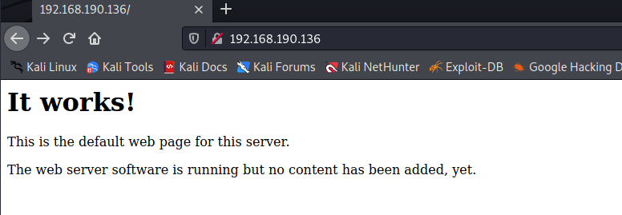

即`http://192.168.190.136/SQLInjection/`，也可以打开页面。

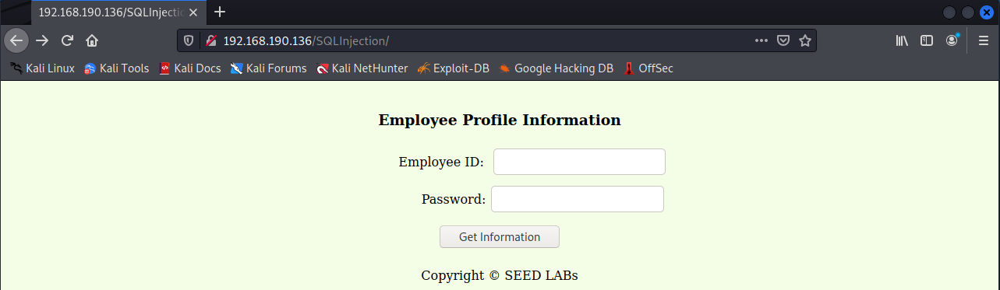

修改命令

```bash
curl 'http://192.168.190.136/SQLInjection/unsafe_credential.php?EID=%27OR+name+%3D%27admin%27%23&Password='
```

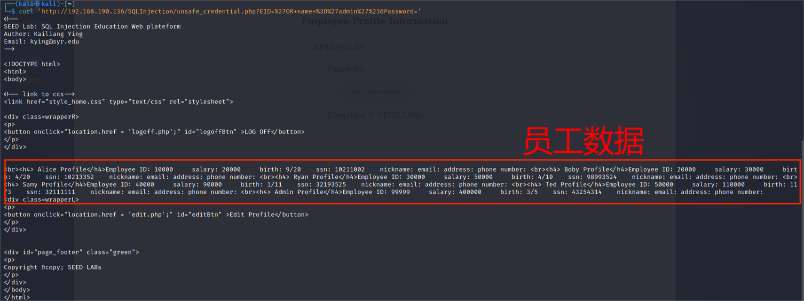

输入命令后，获得了所有员工的信息。

#### 任务 2.3:添加一个新的 SQL 语句

> 在上述两种攻击中，我们只能从数据库中窃取信息;如果我们可以在登录页面中使用相同的漏洞来修改数据库就更好了。一种想法是使用 SQL 注入攻击将一条 SQL 语句变成两条，而第二条 SQL 语句则是更新或删除语句。在 SQL 语句中，分号(;)用来分隔两条 SQL 语句。请描述如何使用登录页面让服务器运行两个 SQL 语句。尝试从数据库中删除一条记录，并描述您的观察结果。

构造注入语句 进行尝试

```
' OR name='admin' ;Drop user Alice
```

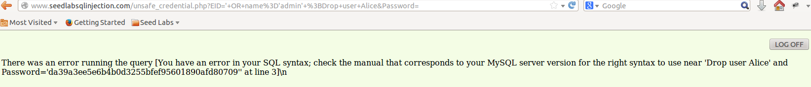

发现失败了,原因是,PHP 中 mysqli 扩展的 query（）函数不允许在数据 库服务器中运行多条语句。 这是 MySQL 中的一种特殊的保护机制。

### 任务 3:UPDATE 语句的 SQL 注入攻击

> 如果 UPDATE 语句存在 SQL 注入漏洞，则危害会更严重，因为攻击者可以利用该漏洞修改数据库。在我们的员工管理应用程序中，有一个 Edit Profile 页面(图 2)，允许员工更新他们的个人信息，包括昵称、电子邮件、地址、电话号码和密码。员工需要先登录才能进入该页面。
> 当员工通过 Edit Profile 页面更新他们的信息时，将执行以下 SQL update 查询。在 unsafe edit.php 文件中实现的 PHP 代码用于更新员工的配置文件信息。PHP 文件位于/var/www/SQLInjection 目录中。
>
> ```php
> $conn = getDB();
> $sql = "UPDATE credential SET nickname=’$nickname’,
>                               email=’$email’,
>                               address=’$address’,
>                               phonenumber=’$phonenumber’,
>                               Password=’$pwd’
> WHERE id= ’$input_id’ ";
> $conn->query($sql))
> ```

#### 任务 3.1:SQL 注入攻击的 UPDATE 语句-修改工资

> 如 Edit 中所示个人资料页面，员工只能更新自己的昵称、电子邮件、地址、电话号码和密码;他们无权改变自己的薪水。只有管理员才可以修改工资。如果你是一个恶意的员工(比如 Alice)，你在这个任务中的目标是通过编辑个人资料页面来增加你自己的薪水。我们假设您知道，工资存储在一个名为“工资”的列中。

首先利用 SQL 注入漏洞登录 Alice 账户。

```
'OR name ='Alice'#
```


用 vim unsafe edit.php 查看源代码：

```
vim /var/www/SQLInjection/unsafe_edit.php
```

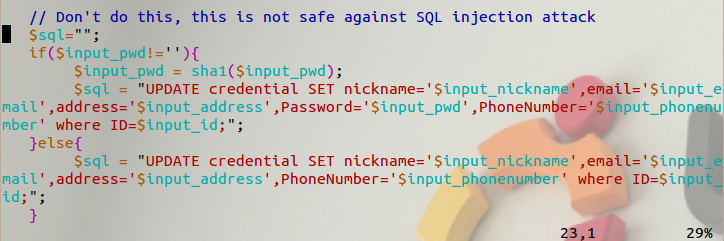

Alice 的工资为 20000，ID 为 1000，现将工资改为 9999999，根据源代码，构造 SQL 语句如下：

```bash
',salary='9999999' where EID='10000';#
```

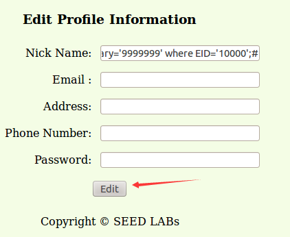

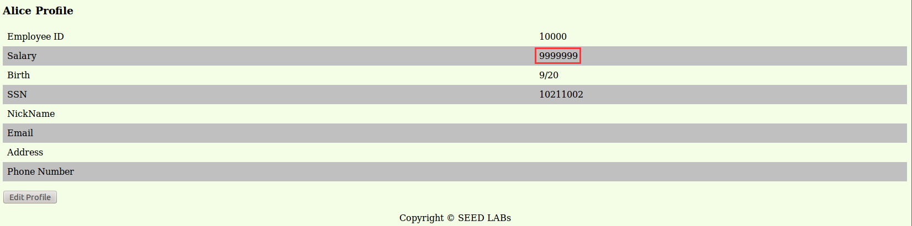

可见，salary 修改成功

#### 任务 3.2:UPDATE 语句上的 SQL 注入攻击——修改他人密码。

> 我们用上述 UPDATE 语句中的相同漏洞，恶意员工还可以更改他人的数据。此任务的目标是修改另一名员工的密码，然后演示您可以使用新密码成功登录到受害者的帐户。这里的假设是，你已经知道你想攻击的员工(如 Ryan)的名字。这里值得一提的一点是，数据库存储的是密码的哈希值，而不是明文密码字符串。您可以再次查看不安全的 edit.php 代码，看看密码是如何存储的。使用 SHA1 哈希函数生成密码的哈希值。

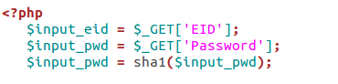

可见 password 在数据库中是以 sha1 的形式存储的，在网上找了[在线 sha1 加密工具](http://www.ttmd5.com/hash.php)，将 6666 加密。或者使用 python 加密

```python
python

import hashlib

hashlib.sha1("6666").hexdigest()
```

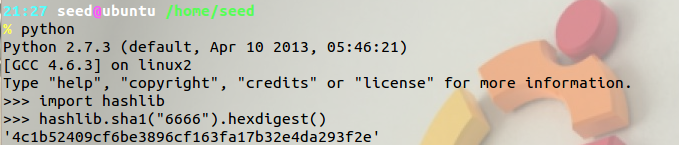

```
4c1b52409cf6be3896cf163fa17b32e4da293f2e
```

构造 SQL 注入语句：

```sql
',Password='你自己sha1加密' where Name='Ryan';#
```

在 Alice 的 Nick Name 栏中输入。

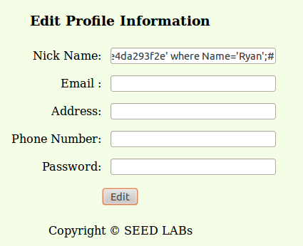

在命令行查看表的信息，发现，Ryan 密码修改成功。

```sql
select * from credential where name= 'Ryan';
```

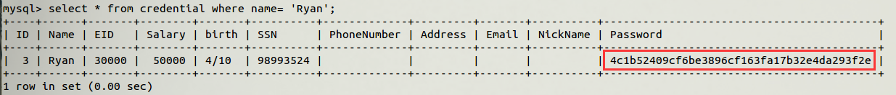

> 为了确保你的注入字符串不包含任何语法错误，你可以在对我们的 web 应用程序发动真正的攻击之前在 MySQL 控制台测试你的注入字符串。

以 ID=30000，password=6666 登录 Ryan，成功！

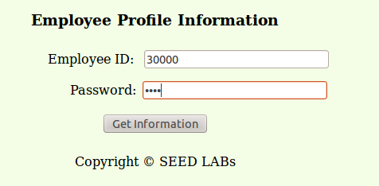

成功进入了 Ryan 的个人界面，由于网页使用 GET 明文传值，我们也可以发现，密码确为 6666。

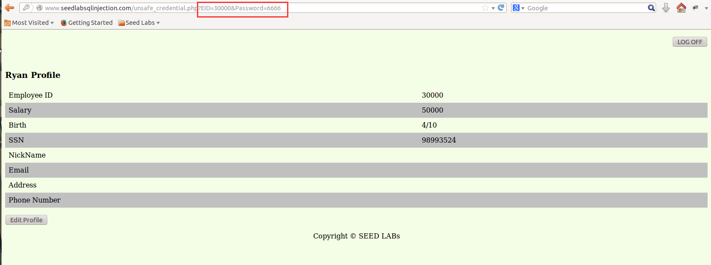

### 任务 4：对策——预处理语句

> SQL 注入漏洞的根本问题是无法将代码与数据分离。当构造 SQL 语句时，程序(例如 PHP 程序)知道哪些部分是数据，哪些部分是代码。不幸的是，当 SQL 语句被发送到数据库时，边界已经消失了;SQL 解释器看到的边界可能与开发人员设置的原始边界不同。要解决这个问题，必须确保服务器端代码和数据库中的边界视图是一致的。最安全的方法是使用预处理语句。

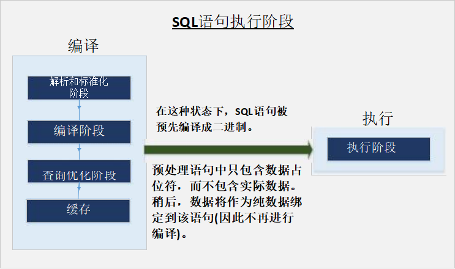

> 为了理解预处理语句是如何防止 SQL 注入的，我们需要理解当 SQL server 接收到一个查询时发生了什么。查询如何执行的高级工作流如图 3 所示。在编译步骤中，查询首先经过解析和规范化阶段，在此阶段根据语法和语义检查查询。下一个阶段是编译阶段，关键字(如 SELECT、FROM、UPDATE 等)被转换成机器可以理解的格式。基本上，在这个阶段，查询被解释。在查询优化阶段，将考虑执行查询的不同计划的数量，并从中选择最佳优化计划。选择的计划被存储在缓存中，所以每当下一次查询进入时，它将根据缓存中的内容进行检查;如果它已经存在于缓存中，解析、编译和查询优化阶段将被跳过。然后，编译后的查询被传递到实际执行的执行阶段。

> 预处理语句在编译之后，但在执行步骤之前出现。预编译语句将经过编译步骤，并被转换为带有空数据占位符的预编译查询。要运行这个预编译查询，需要提供数据，但这些数据不会经过编译步骤;相反，它们被直接插入预编译的查询，并被发送到执行引擎。因此，即使数据中有 SQL 代码，不经过编译步骤，代码也会被简单地视为数据的一部分，没有任何特殊含义。预备语句就是这样防止 SQL 注入攻击的。

> 下面是一个如何在 PHP 中编写预备语句的例子。在下面的例子中，我们使用 SELECT 语句。我们将展示如何使用预备语句重写易受 SQL 注入攻击的代码。
>
> ```bash
> $conn  =  getDB();
> $sql  =  "SELECT  name ,  local ,  gender
> 					FROM  USER_TABLE
> 					WHERE  id  =  $id  AND  password  =’ $pwd’  " ;
> $result  =  $conn->query($sql))
> ```

> 上面的代码很容易受到 SQL 注入攻击。它可以被改写为以下内容
>
> ```bash
> $conn  =  getDB();
> $stmt  =  $conn->prepare( "SELECT  name ,  local ,  gender
>                             FROM  USER_TABLE
>                             WHERE  id  =  ?  and  password  =  ? " );
> //  Bind  parameters  to  the  query
> $stmt->bind_param("is", $id, $pwd);
> $stmt->execute();
> $stmt->bind_result($bind_name, $bind_local, $bind_gender);
> $stmt->fetch();
> ```
>
> 使用预处理语句机制，我们将向数据库发送 SQL 语句的过程分为两个步骤。第一步是只发送代码部分，即不包含实际数据的 SQL 语句。这是准备步骤。正如我们从上面的代码片段中看到的，实际的数据被问号(?)代替。在这一步之后，我们使用 bind param()将数据发送到数据库。数据库将只将这一步中发送的所有内容视为数据，而不再视为代码。它将数据绑定到预处理语句的相应问号上。在 bind param()方法中，第一个参数"is"表示参数的类型:"i"表示\$id 中的数据为整数类型，"s"表示\$pwd 中的数据为字符串类型。
> 对于此任务，请使用准备好的语句机制修复您在前面的任务中利用的 SQL 注入漏洞。然后，检查您是否仍然可以利用该漏洞。

将`unsafe_credential.php`文件原有 35 行内容

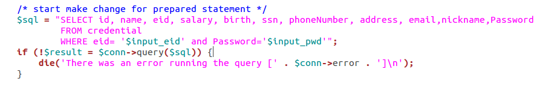

修改为

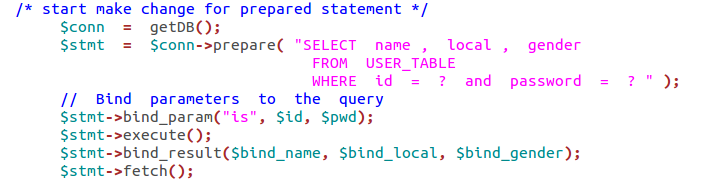

但如果你直接在文本处修改是没有权限的，该文件夹所有文件都是 root 所有。

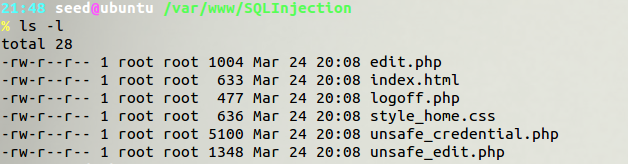

使用 VIm 编辑

```bash
sudo vim unsafe_credential.php
```

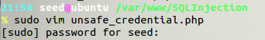

先找到 35 行，在命令模式下`dd`即可删除一行，<kbd>i</kbd>进入编辑模式粘贴。<kbd>Esc</kbd>退出编辑模式，`:wq`保存并退出。

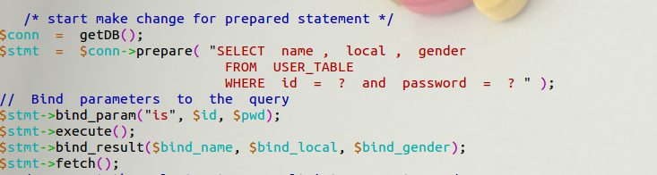

使用任务一的命令尝试注入

```sql
'OR name ='admin'#
```

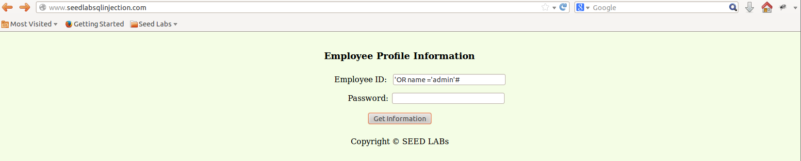

发现果然失败了

```
http://www.seedlabsqlinjection.com/unsafe_credential.php?EID=%27OR+name+%3D%27admin%27%23&Password=
```

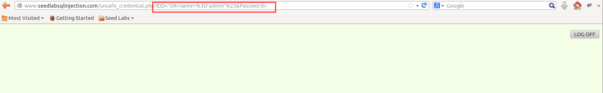

# Lab Old

seed9 版

在本实验中，我们修改了一个名为 phpBB2 的 web 应用程序，并禁用了几个由 phpBB2 实现的对策。因此，我们创建了一个容易受到 SQL-Injection 攻击的 phpBB 版本。虽然我们的修改是人为的，但它们捕获了许多 web 开发人员犯的常见错误。学生在这个实验室的目标是找到利用 SQL-Injection 漏洞的方法，演示攻击可以造成的损害，并掌握帮助防御此类攻击的技术。

实验室环境
您需要为这个实验室使用我们提供的虚拟机映像。支持该实验室的 VM 镜像的名称称为**seedubuntu9 - August -2010**，它是在 2010 年 8 月构建的。如果您碰巧有我们预构建的 VM 镜像的旧版本，则需要下载最新版本，因为旧版本不能用于本实验室。登录我们的 SEED 网页(http://www.cis.syr.edu/˜wedu/seed/)获取虚拟机镜像。

## 实验准备

打开 apache

```bash
sudo service apache2 start
```

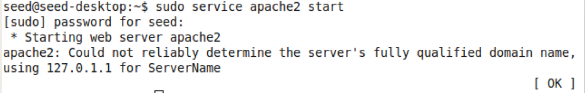

phpBB2 网站所在目录`/var/www/SQL/SQLLabMysqlPhpbb/`

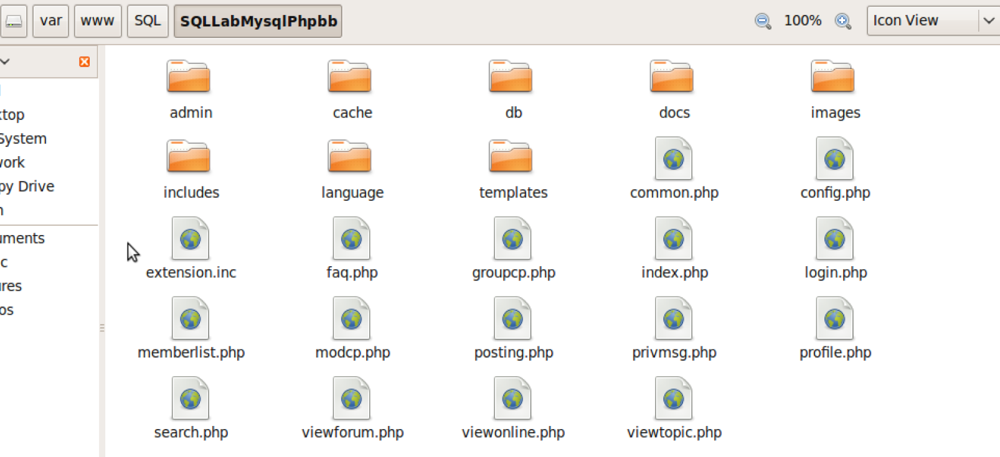

关闭防护对策: 打开/etc/php5/apache2/php.ini，找到 457 行

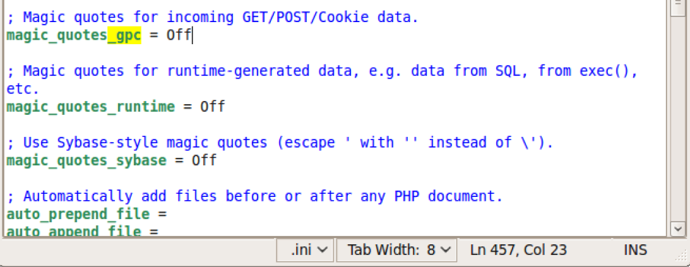

直接修改发现没有权限，使用 sudo 权限，命令模式下直接定位到 457 行。`:457`

```bash
sudo vim /etc/php5/apache2/php.ini
```

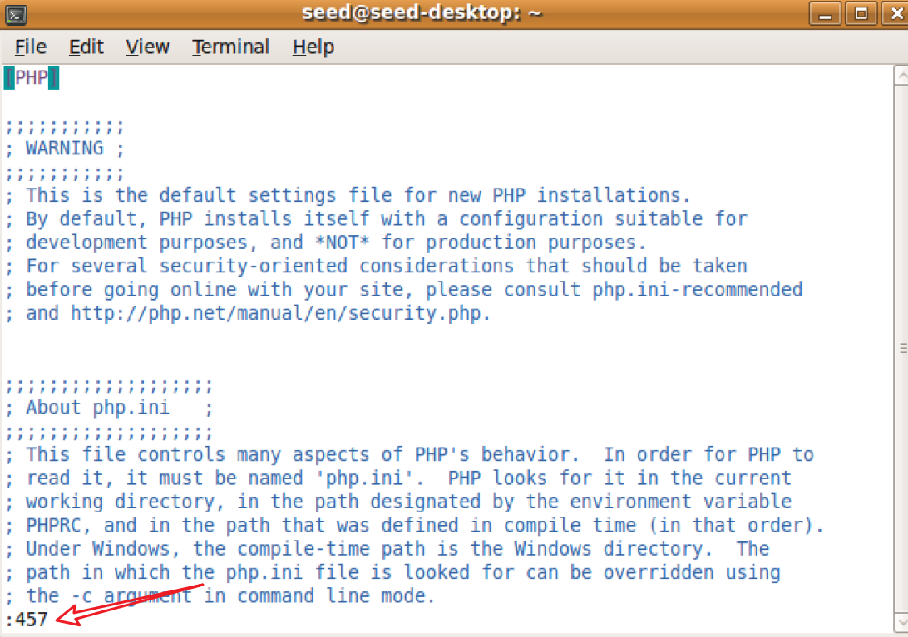

将 On 改为 Off，保存并退出，重启 apache

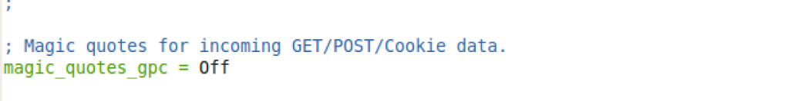

```bash
sudo service apache2  restart
```

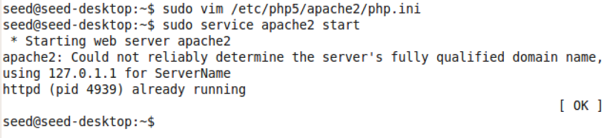

自此，网站便搭建完成，如果你的虚拟机也无法安装 VMtools，那么你可以在另一台 linux 上完成网页端的实验。

```bash
ifconfig
```

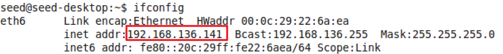

在得到此虚拟机 ip 地址后，我们果断在 kali 上开始后续实验。

## Task 1：注入攻击 SELECT 语句

> 对于这个任务，您将在您的虚拟机中使用通过 URL www.sqllabmysqlphpbb.com访问的web应用程序，该URL是phpBB2，配置了MySQL数据库。在你开始使用phpBB2之前，系统会要求你登录。身份验证是由login.php在服务器端实现的。这个程序将向用户显示一个登录窗口，并要求用户输入他们的用户名和密码。登录界面显示如下:

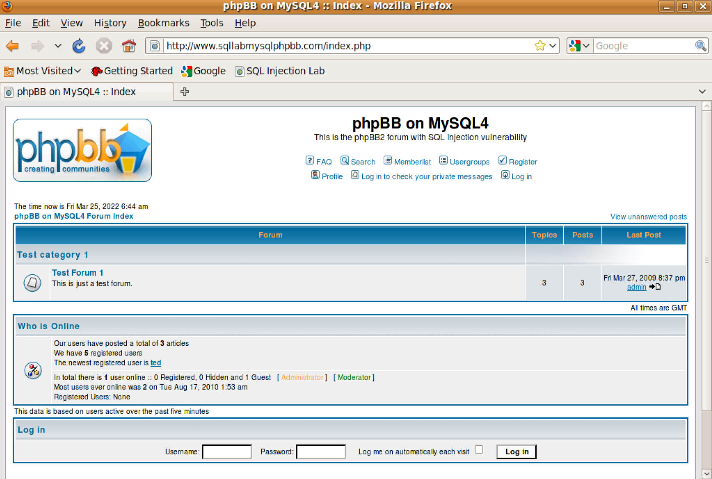

如果是在另一台电脑上，则可以根据 IP 地址定位

```
http://Seed9的IP地址/SQL/SQLLabMysqlPhpbb/
```

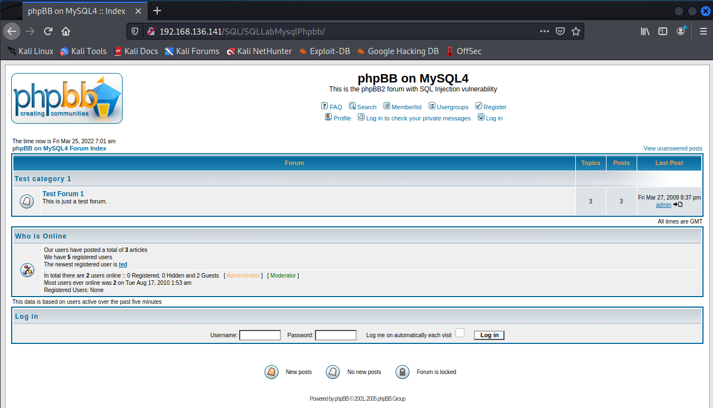

由于是在另一台主机上，因此需要设置 DNS

```bash
sudo vim /etc/hosts

服务器Seed9的IP地址 www.sqllabmysqlphpbb.com
```

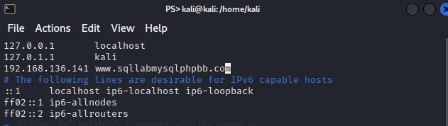

这样就能访问了

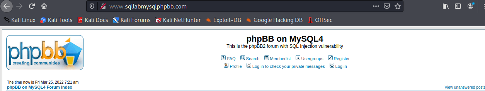

> 用户输入用户名和密码后，login.php 程序将使用用户提供的数据来查找它们是否与数据库中任何记录的用户名和用户密码字段匹配。如果有匹配，这意味着用户提供了正确的用户名和密码组合，应该允许登录。与大多数其他 web 应用程序一样，PHP 程序使用标准 SQL 语言与后端数据库交互。在 phpBB2 中，下面的 SQL 查询是在 login.php 中构造的，用来验证用户:

```sql
SELECT  user_id,  username,  user_password,  user_active,  user_level,
user_login_tries,  user_last_login_try
FROM USERS_TABLE
WHERE username = ’$username’  AND  user_password  =  ’md5($password)’;

if   (found  one  record)
then  {allow  the  user  to  login}
```

> 在上面的 SQL 语句,用户表是一个宏观的 php 将取代用户 ta - ble 的名字:phpbb 用户,用户名是一个变量,持有美元字符串输入用户名的文本框,密码是一个变量保存字符串输入密码文本框。用户在这两个文本框中的输入直接放置在 SQL 查询字符串中。

#### 登录 SQL 注入攻击:

> 上述查询存在 SQL 注入漏洞。您能否利用这个漏洞来实现以下目标?
>
> - 你能在不知道正确密码的情况下登录别人的账户吗?
> - 你能找到修改数据库的方法吗(仍然使用上面的 SQL 查询)?例如，是否可以向数据库添加新帐户，或删除现有的用户帐户?
>
> 显然，上面的 SQL 语句只是一个查询语句，不能更新数据库。但是，使用 SQL 注入，可以将上面的语句转换为两条语句，其中第二条是更新语句。请尝试此方法，看是否可以成功更新数据库。
>
> 老实说，我们无法达到更新的目标。这是因为 MySQL 中实现了一种特殊的防御机制。在报告中，你应该向我们展示你为了修改数据库所做的努力。您应该找出攻击失败的原因，MySQL 中的什么机制阻止了这种攻击。你可以从网上查找证据(二手)来支持你的结论。然而，第一手的证据会得到更亲切的体验(使用你自己的创造力去寻找第一手的证据)。

### 1.尝试登录别人的账号

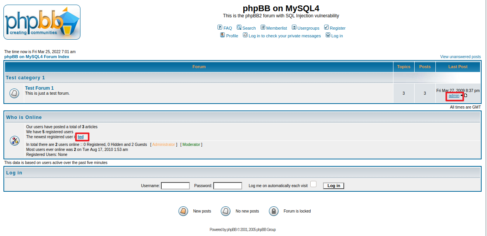

由网站首页能知道两个用户名，且其中一个是 admin 管理员，尝试使用另一个 ted 用户名登录。

由于其核心判单语句为

```sql
WHERE username = ’$username’  AND  user_password  =  ’md5($password)’;
```

故构造输入，将其后的密码判断注释掉

```sql
ted ' #
```

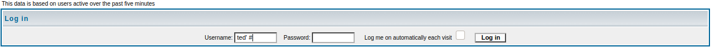

成功登录，并能查看成员表


用同样方法就能登录其他用户的账号。

```sql
alice ' #
```

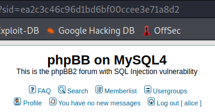

甚至是管理员

```sql
admin ' #
```

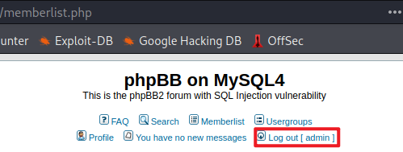

### 2.尝试修改数据库

创建新表

```sql
';CREATE TABLE `phpbb_users2` #
```

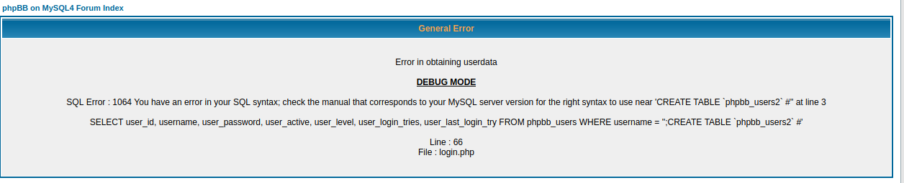

发现报错。

构造输入删除表

```SQL
'; DELETE FROM phpbb_users #
```

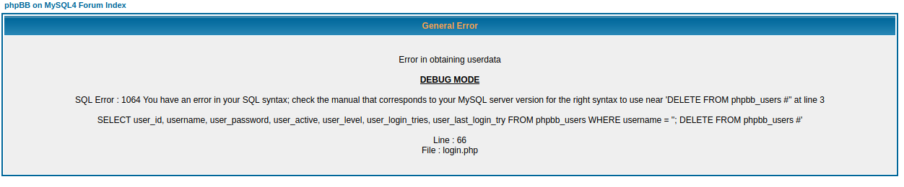

依然报 1064 错，查询得知是 sql 语句中的字段和 MySQL 数据库关键字冲突，如 update 、create、delete 等；所以构造的堆叠注入并不能执行，delete 关键字被视为普通字段。所以是堆叠注入不可能成功的。原因有很多，如可能受到 API 或者数据库引擎，又或者权限的限制。

## Task2： 攻击 UPDATE 语句

> 当用户想要在 phpBB2 中更新他们的配置文件时，他们可以单击 Profile 链接，然后填写一个表单来更新配置文件信息。用户向服务器发送更新请求后，将在 include/usercp_register.php 中构造一条 update SQL 语句。这个语句的目的是修改 phpbb_users 表中当前用户的概要信息。此 SQL 语句存在 SQL 注入漏洞。请找到漏洞，然后利用它做以下工作:
>
> - 在不知道密码的情况下更改另一个用户的个人资料。例如，如果您已登录作为 Alice，您的目标是使用该漏洞修改 Ted 的个人资料信息，包括 Ted 的密码。袭击之后，你应该能登录到 ted 的账户。

使用 Alice 账号修改 ted 信息

构造输入

```sql
hello' where name='ted' #
```

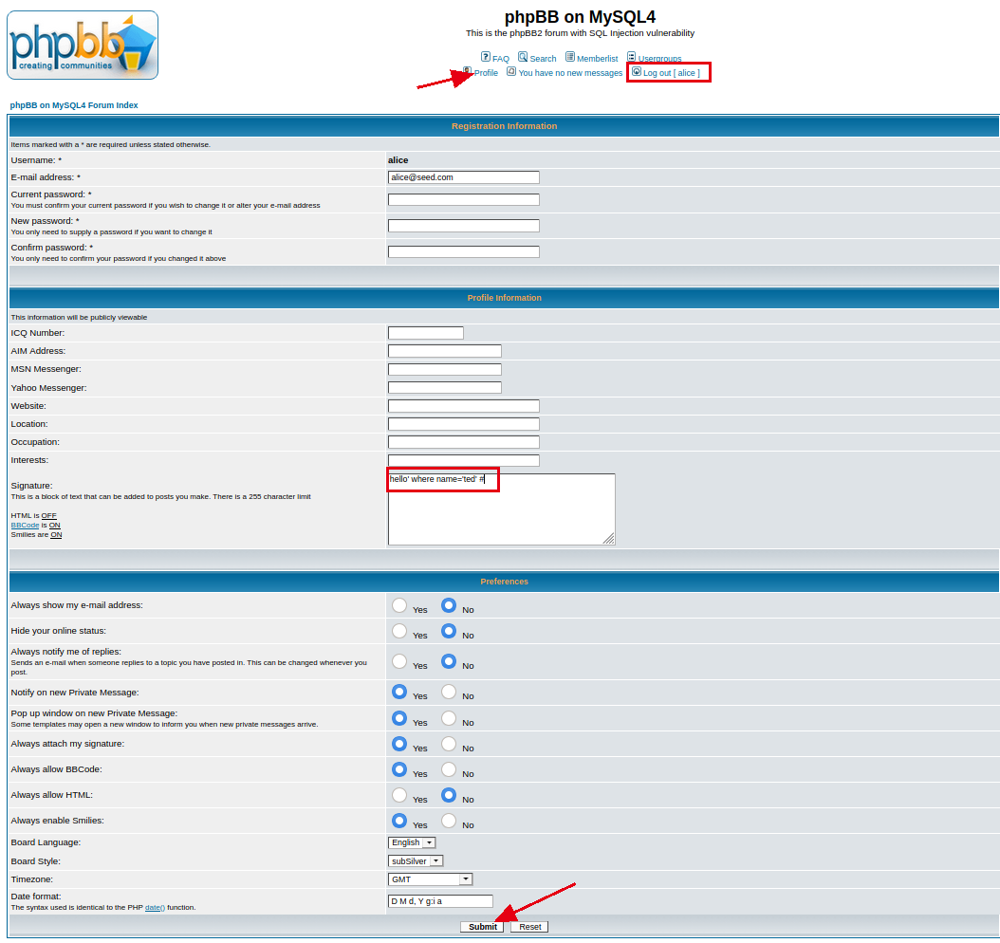

报错，得到 sql 语句

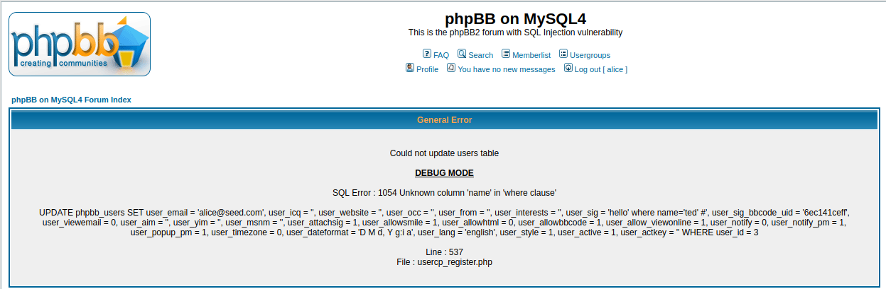

更改输入

```SQL
', user_aim='hello' where username='ted'; #
```

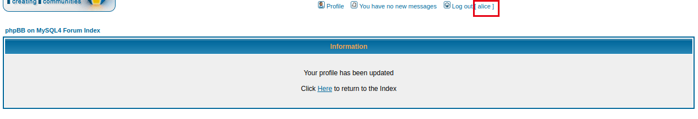

修改成功！

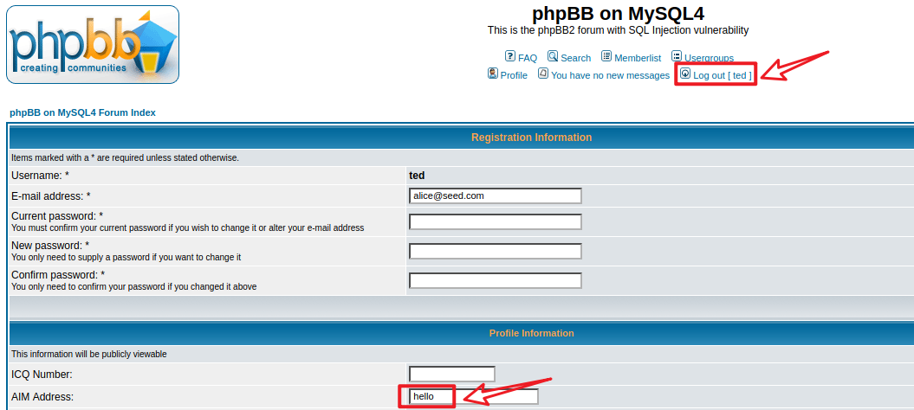

按照同样的方法修改 ted 的 password，密码需要 md5 加密处理

```sql
', user_password='f379eaf3c831b04de153469d1bec345e' where username='ted' ; #
```

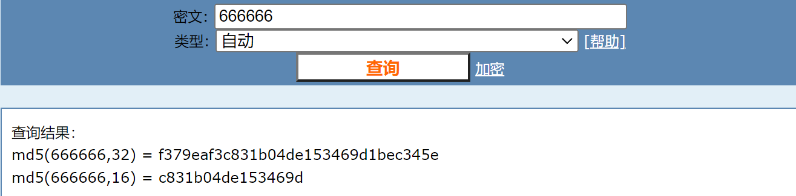

使用 Alice 账户进行修改

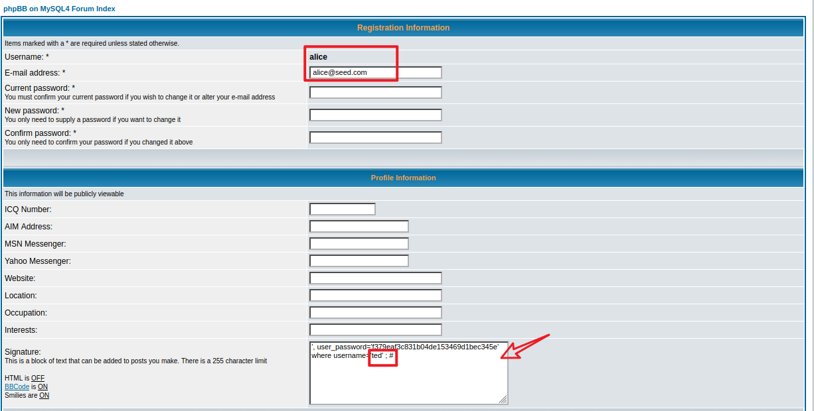

修改过后使用密码 123456 就能登录 ted 账号

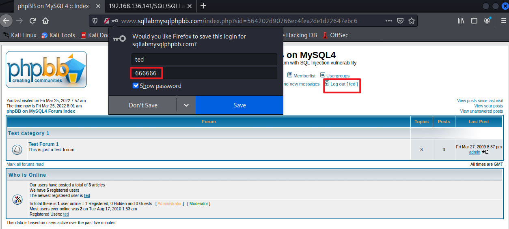

## Task 3：应对措施

```bash
cd /var/www/SQL/SQLLabMysqlPhpbb
sudo vim login.php
```

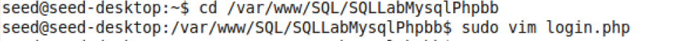

在 login.php 中写入

```PHP
$myFile = "/tmp/mylog.txt";
$fh = fopen($myFile, ’a’) or die("can’t open file");
fwrite($fh, $sql_checkpasswd. "\n");
fclose($fh);
```

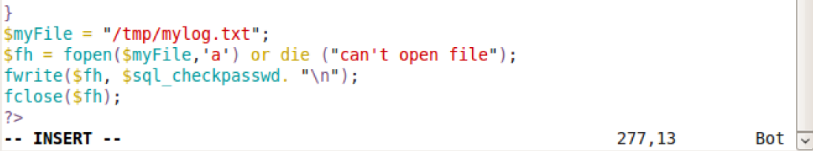

方便查看后台经过对用户输入检查后，真正查询的语句是什么样的。

### 1.使用 magic_quotes_gpc 转义特殊字符

在没有使用该机制时，访问数据的查询语句：

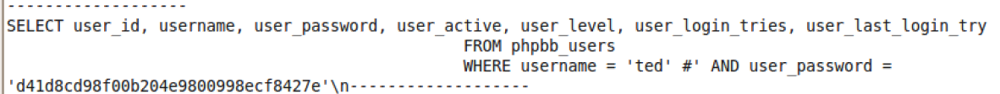

打开/etc/php5/apache2/php.ini，将 magic_quotes_gpc 对策打开。

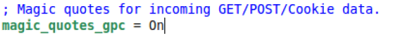

重启 apache2

```
sudo service apache2 restart
```

用之前的注入语句尝试，登录失败

```SQL
ted' #
```

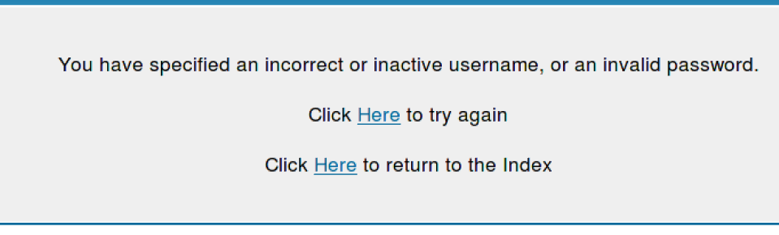

查看写入的日志，单引号被转义了。

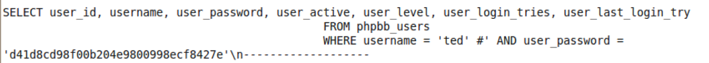

除了单引号会被转义，还有，反斜杠、双引号，和 null 字符被转义。

### 2.使用 addslashes()转义特殊字符

关闭 magic_quotes_gpc()，去掉 common.php 中的 and False 来打开 addslashes()措施

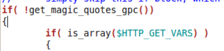

同样的进行了转义


相对于 magic_quotes_gpc，addslashes()可以由用户指定在何时转义哪些数据，更加安全，但也容易忘记加。

### 3.使用 mysql_real_escape_string()转义

下列字符受影响：`\x00 \n \r \ ' " \x1a`

将 2.中的 addslashes 替换成 mysql_real_escape_string。

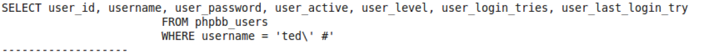

同样的，用户输入的特殊字符，被反斜杠转义了

### 4.预处理

关闭 magic_quotes_gpc，并在 common 判断中加上 and False

在登录检查前加入预编译

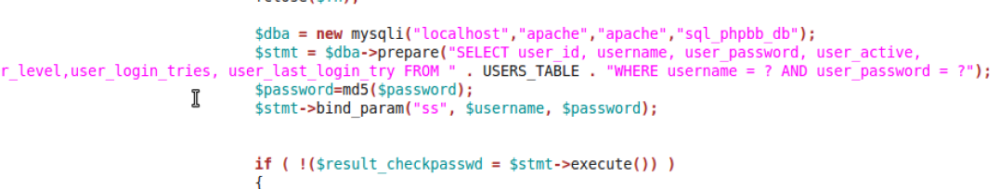

用户输入的字符没有被转义，但是没有执行。
